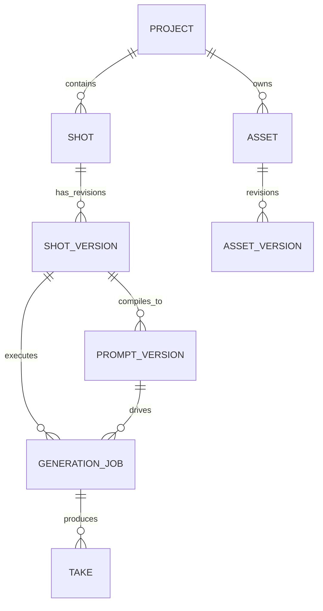

# CANONICAL DATA MODEL
## AI Video Factory — Master Relational & Entity Specification
**VERSION:** 1.0.0

---

## 1. Core Lineage: ShotVersion -> PromptVersion -> GenerationJob -> Take

---

## 2. Table Specifications

### 2.1 `shot_versions`
Immutable creative direction for a single shot revision.
- `shot_version_id` UUID PRIMARY KEY
- `shot_id` UUID NOT NULL REFERENCES shots(shot_id)
- `version_number` INT NOT NULL
- `duration_ms` INT NOT NULL
- `action_description` TEXT NOT NULL
- `camera_motion` VARCHAR(100)
- `environment_settings` TEXT
- `character_refs` UUID[]
- `style_refs` UUID[]
- `asset_refs` UUID[]
- `constraints` TEXT[]
- `continuity_refs` UUID[]
- `created_at` TIMESTAMPTZ NOT NULL DEFAULT NOW()
- `UNIQUE(shot_id, version_number)`

### 2.2 `prompt_versions`
Compiled prompt generated from a `ShotVersion` for a target AI provider.
- `prompt_version_id` UUID PRIMARY KEY
- `shot_id` UUID NOT NULL
- `shot_version_id` UUID NOT NULL
- `version_number` INT NOT NULL
- `target_provider` VARCHAR(50) NOT NULL
- `positive_prompt` TEXT NOT NULL
- `negative_prompt` TEXT
- `parameters` JSONB NOT NULL DEFAULT '{}'
- `ast_snapshot` JSONB NOT NULL DEFAULT '{}'
- `created_at` TIMESTAMPTZ NOT NULL DEFAULT NOW()
- `FOREIGN KEY (shot_id, shot_version_id) REFERENCES shot_versions(shot_id, shot_version_id)`
- `UNIQUE(shot_version_id, version_number)`

### 2.3 `generation_jobs`
Execution record of a render attempt for a specific prompt and shot.
- `job_id` UUID PRIMARY KEY
- `project_id` UUID NOT NULL REFERENCES projects(project_id)
- `shot_id` UUID NOT NULL
- `shot_version_id` UUID NOT NULL
- `prompt_version_id` UUID NOT NULL REFERENCES prompt_versions(prompt_version_id)
- `provider_id` VARCHAR(50) NOT NULL
- `idempotency_key` VARCHAR(128) NOT NULL
- `status` VARCHAR(30) NOT NULL DEFAULT 'QUEUED'
- `execution_stage` VARCHAR(50) NOT NULL DEFAULT 'WAITING_FOR_ASSETS'
- `attempt_index` INT NOT NULL DEFAULT 1
- `max_attempts` INT NOT NULL DEFAULT 3
- `provider_job_id` VARCHAR(255)
- `flow_track` VARCHAR(50)
- `lease_token` UUID
- `lease_expires_at` TIMESTAMPTZ
- `estimated_cost_credits` NUMERIC(10,4) DEFAULT 0
- `actual_cost_credits` NUMERIC(10,4) DEFAULT 0
- `normalized_error` JSONB
- `requested_at` TIMESTAMPTZ NOT NULL DEFAULT NOW()
- `submitted_at` TIMESTAMPTZ
- `completed_at` TIMESTAMPTZ
- `entity_version` INT NOT NULL DEFAULT 1
- `UNIQUE(provider_id, idempotency_key)`
- `FOREIGN KEY (shot_id, shot_version_id) REFERENCES shot_versions(shot_id, shot_version_id)`

### 2.4 `takes`
Generated media outputs produced by completed generation jobs.
- `take_id` UUID PRIMARY KEY
- `shot_id` UUID NOT NULL
- `shot_version_id` UUID NOT NULL
- `prompt_version_id` UUID NOT NULL
- `job_id` UUID NOT NULL REFERENCES generation_jobs(job_id)
- `take_number` INT NOT NULL
- `storage_uri` TEXT NOT NULL
- `mime_type` VARCHAR(50) NOT NULL
- `byte_size` BIGINT NOT NULL
- `checksum_sha256` CHAR(64) NOT NULL
- `duration_ms` INT NOT NULL
- `qc_status` VARCHAR(20) NOT NULL DEFAULT 'PENDING'
- `qc_score` NUMERIC(5,2)
- `created_at` TIMESTAMPTZ NOT NULL DEFAULT NOW()
- `UNIQUE(shot_version_id, take_number)`

### 2.5 `asset_versions`
Versioned media assets (images, style guides, character turnarounds, audio stems).
- `asset_version_id` UUID PRIMARY KEY
- `asset_id` UUID NOT NULL REFERENCES assets(asset_id)
- `version_number` INT NOT NULL
- `storage_uri` TEXT NOT NULL
- `mime_type` VARCHAR(100) NOT NULL
- `byte_size` BIGINT NOT NULL
- `checksum_sha256` CHAR(64) NOT NULL
- `source_type` VARCHAR(50) NOT NULL
- `license_type` VARCHAR(100)
- `rights_attribution` TEXT
- `origin_uri` TEXT
- `created_at` TIMESTAMPTZ NOT NULL DEFAULT NOW()
- `UNIQUE(asset_id, version_number)`
