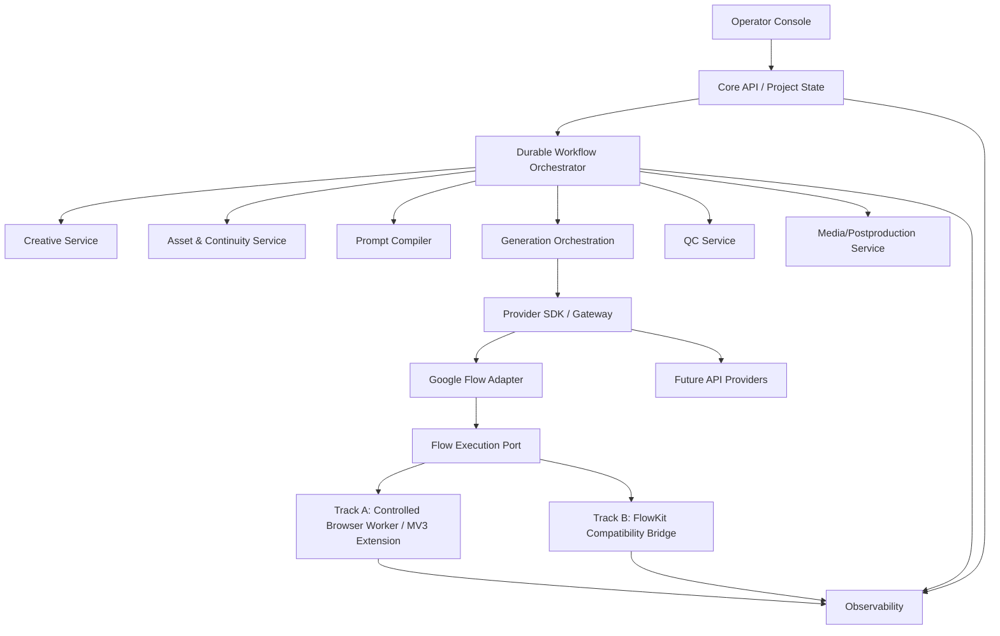

# Master Blueprint — AI Video Factory

## 1. Mission

Build a modular production system that transforms a brief or a structured shot plan into traceable, reviewable, generated video assets and final assembled outputs while preserving recoverability, provenance, provider replaceability, and human control.

The system must support a progression from manual/structured shot input to creative automation without changing the generation core.

## 2. Architectural style

**Contract-first, service-oriented system with independently buildable repositories.**

Not every repository must be an independently deployed network microservice on day one. A repository may be a service, worker, adapter, SDK, UI, or test harness. The boundary is ownership + contract first; deployment separation follows operational need.

## 3. Canonical architecture



## 4. Core principle: provider and browser are unreliable peripherals

The product's durable state does not live in:

- a browser tab;
- an extension queue;
- FlowKit SQLite;
- an LLM conversation;
- LangGraph memory;
- a local Downloads folder.

Canonical state is owned by the Core API / Project State repository and persisted in PostgreSQL.

## 5. Source of truth

Canonical records include:

- Project;
- CreativeSpecVersion;
- ScriptVersion;
- Scene;
- Shot / ShotVersion;
- Character / CharacterVersion;
- StyleProfile / StyleVersion;
- Asset / AssetVersion;
- PromptVersion;
- GenerationJob;
- Take;
- QCResult;
- WorkflowRun;
- CostUsageRecord.

Binary media is stored in object storage and referenced by immutable asset identifiers/checksums.

## 6. Execution classification

| Capability | Execution type |
|---|---|
| Persistence, queue correctness, retries, idempotency | Deterministic software |
| Script/shot/prompt enrichment | Bounded LLM task |
| Multi-step creative exploration | Agent only when justified |
| Browser manipulation | Deterministic-first automation |
| Browser recovery | Constrained agent fallback, then human |
| QC technical checks | Deterministic |
| QC semantic checks | Multimodal model |
| Final retry decision | Deterministic policy engine |
| Approval gates | Human or policy-driven |

## 7. Repository set

1. `avf-contracts`
2. `avf-core-state`
3. `avf-creative`
4. `avf-assets-continuity`
5. `avf-prompt-compiler`
6. `avf-workflow`
7. `avf-provider-sdk`
8. `avf-google-flow-adapter`
9. `avf-browser-worker` — Track A
10. `avf-flowkit-bridge` — Track B
11. `avf-qc`
12. `avf-media`
13. `avf-operator-console`
14. `avf-platform-observability`
15. `avf-integration-harness`

## 8. Google Flow dual-track strategy

### Track A — Controlled implementation

Preferred long-term route when reliability is acceptable:

- Chrome Manifest V3 extension with content scripts for DOM-level interaction;
- extension state kept minimal and disposable;
- local worker owns command execution state;
- communication option A1: Chrome Native Messaging;
- communication option A2: authenticated loopback WebSocket;
- optional Playwright persistent automation profile for browser lifecycle and deterministic test harness;
- no dependence on undocumented Google endpoints as a product contract;
- CAPTCHA/security challenge => `HUMAN_REQUIRED` or `BLOCKED_PROVIDER`, not bypass logic.

### Track B — FlowKit accelerated route

Used to reduce development time and validate end-to-end generation faster:

- FlowKit runs as an external execution engine;
- `avf-flowkit-bridge` maps our frozen `FlowExecutionPort` into FlowKit operations;
- FlowKit database, queue, entity model, headers, internal endpoint details, and extension protocol remain implementation-private;
- upstream repos never import FlowKit models;
- unsupported or policy-sensitive behavior is not copied into core;
- Track B can be removed without changing `GenerationJob`, `PromptVersion`, or `VideoGenerationProvider`.

## 9. Durable workflow

Production recommendation: Temporal-style durable execution.

The workflow owns sequencing and waiting; Core State owns business truth. Activities execute side effects with idempotency keys.

Example:

```text
ResolveAssets
 -> CompilePrompt
 -> SubmitGeneration
 -> WaitForProvider
 -> DownloadTake
 -> RunTechnicalQC
 -> RunSemanticQC
 -> ApplyRetryPolicy
 -> Approve / Regenerate / HumanReview
```

## 10. Idempotency

Every paid/external side effect has a deterministic idempotency key.

Recommended generation key:

```text
gen:{project_id}:{shot_version_id}:{prompt_version_id}:{provider}:{attempt_no}
```

The key is persisted before the external call. A retry after process crash must reconcile existing state before resubmission.

## 11. Retry taxonomy

- **Technical retry:** network/browser/transport failure; same creative request.
- **Provider retry:** provider failed/rejected; may be same request depending on error class.
- **Creative retry:** valid output but failed semantic QC; new attempt and optionally new PromptVersion.
- **Human recovery:** authentication challenge, changed UI, budget exhaustion, repeated quality failure.

No LLM is allowed to perform unbounded retry loops.

## 12. Versioning

Creative artifacts are append-only versions, never overwritten.

```text
Script v1 -> Script v2
Shot v1 -> Shot v2
Prompt v1 -> Prompt v2
Take #1, #2, #3
```

A Take always references the exact PromptVersion and ShotVersion used to generate it.

## 13. Security boundary

Browser profiles/cookies/tokens are secrets.

- never committed to source control;
- never copied into project state JSON;
- least-privilege host permissions in extension;
- loopback transport authenticated;
- logs redact tokens/cookies;
- screenshots may contain sensitive content and require retention policy;
- FlowKit bridge is treated as a privileged local integration component.

## 14. Observability

Every generation must answer:

- which project/shot?
- which immutable shot version?
- which prompt version?
- which character/style/assets?
- which provider/model/capability profile?
- which browser/execution session?
- which attempt?
- what did the provider return?
- what QC scores/issues occurred?
- why was it approved/retried/rejected?
- how much provider/LLM usage was consumed?

Required identifiers:

`trace_id`, `workflow_run_id`, `project_id`, `shot_id`, `generation_job_id`, `attempt_id`.

## 15. Build philosophy

Contracts and fake implementations precede live provider work.

```text
Interface -> Contract Tests -> Fake Implementation -> Real Implementation -> E2E
```

A coding agent is never assigned “build AI Video Factory”. It receives one repo blueprint plus a frozen contract version and acceptance tests.

## 16. Critical path

```text
Frozen contracts
 -> Fake provider + state machine
 -> Single-shot durable workflow
 -> Google Flow Track A/Track B spike
 -> Idempotent resume/recovery
 -> Multi-shot pipeline
```

Creative agents, advanced QC, dashboard polish, parallel worker pools, and multi-provider routing are not on the first critical path.

## 17. Provisional system acceptance targets

These are **review targets**, not evidence-backed SLAs until measured:

- Generation provenance completeness: 100%.
- Asset provenance completeness: 100%.
- No accidental duplicate generation in controlled failure tests: 100%.
- Single-shot automation success: target >=95% over a defined 100-run benchmark before production dependence on a UI integration.
- Resume success after worker/process restart: target >=99% in deterministic/fake tests; live-provider target set after Phase 0 measurements.
- Every blocked auth/security challenge must surface operator action, never silently loop.

## 18. Architecture evolution

### MVP

Core State + Workflow + Provider SDK + FakeProvider + one Google Flow execution track + media persistence.

### V1 Production

Add robust operator controls, QC, multiple browser workers, security hardening, backups, traces, budgets.

### Scale

Only after measured need: provider-specific queues, worker pools, multiple providers/accounts, autoscaling. No redesign of the core domain is expected.
