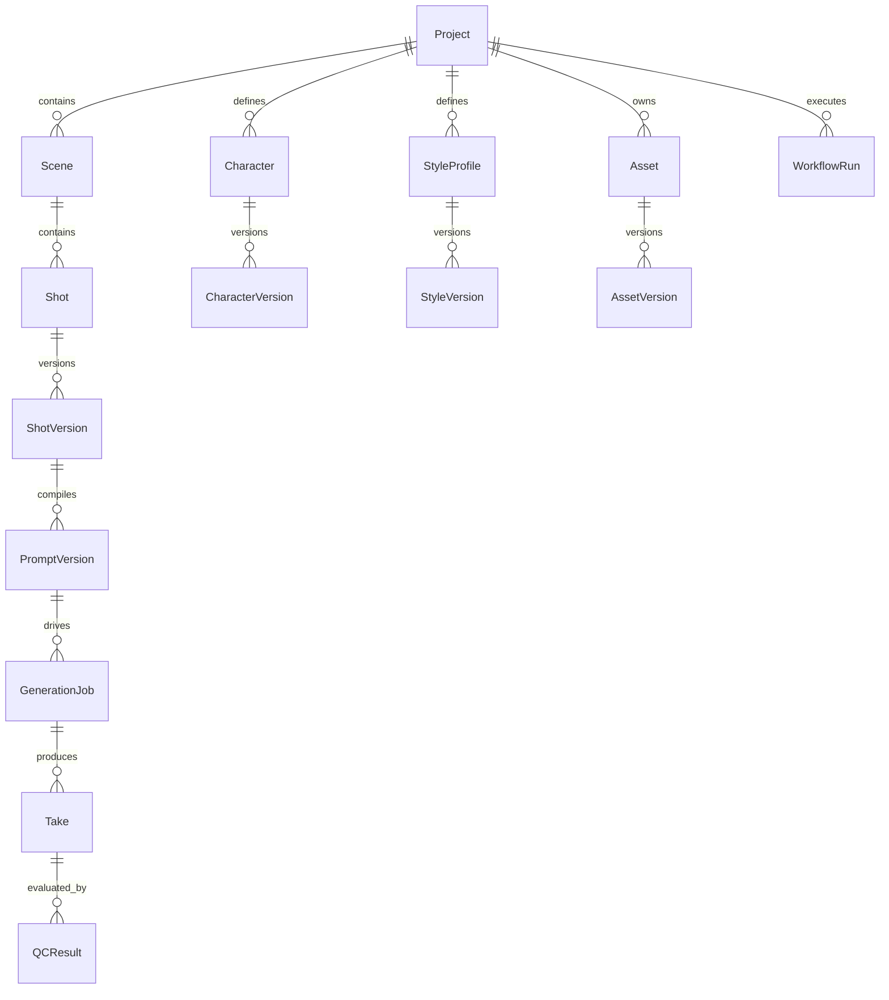

# Canonical Data Model

## Ownership

`avf-core-state` owns canonical IDs and relationships. Other repositories operate on references and return proposals/results.



## Required base fields

Every canonical entity has, as applicable:

```text
id UUID
status string
version integer (for versioned artifacts)
created_at RFC3339
updated_at RFC3339
created_by actor ref
project_id UUID
metadata JSONB (namespaced, not semantic dumping ground)
```

## Project

Owns project lifecycle and references to creative/asset/workflow artifacts.

## Shot / ShotVersion

`Shot` is stable identity. `ShotVersion` is immutable creative intent.

Required ShotVersion semantics:

- duration target;
- action;
- camera;
- environment;
- character version refs;
- style version ref;
- asset/reference refs;
- hard/soft constraints;
- continuity predecessor refs if needed.

## PromptVersion

Immutable compiled generation instruction.

Required provenance:

- shot_version_id;
- compiler version;
- provider family/profile;
- prompt text/spec;
- asset refs;
- character/style versions;
- optional LLM enrichment model/template;
- input_hash.

## GenerationJob

Represents one generation attempt boundary. Required fields:

```text
generation_job_id
shot_id
shot_version_id
prompt_version_id
provider
provider_capability
provider_profile_version
attempt_no
idempotency_key
status
provider_job_id nullable
flow_execution_track nullable
browser_session_id nullable
requested_at
submitted_at nullable
completed_at nullable
normalized_error nullable
```

## Take

Immutable produced candidate media from one GenerationJob. A Take remains historical even when rejected.

## QCResult

Immutable evaluation tied to exact Take checksum + evaluator version/profile.

## Asset / AssetVersion

Asset is logical identity; AssetVersion is immutable binary/content version with checksum, media type, source, rights/license/provenance, object URI, and metadata.

## Character / CharacterVersion

CharacterVersion contains canonical visual/semantic constraints and ReferenceSet refs. Do not store the entire identity only as prompt prose.

## StyleProfile / StyleVersion

Versioned art direction: palette, lighting, lens/camera language, environment rules, era/costume constraints, prohibited variation.

## WorkflowRun

Links durable workflow engine identity to business project/shot scope; workflow history is not the replacement for business records.

## CostUsageRecord

Append-only record containing provider/model/activity, units/credits/tokens where measurable, attempt, duration, timestamp, and related generation/workflow IDs.
