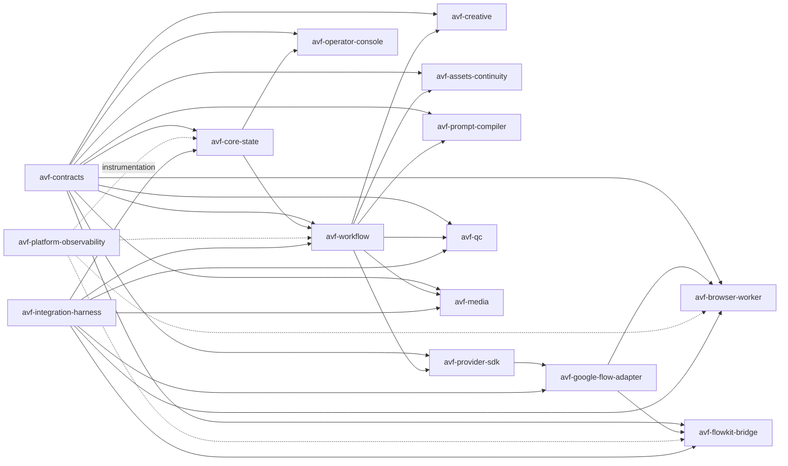

# Dependency Graph

## Forbidden dependencies

- Creative -> Google Flow Adapter
- Asset Service -> Browser Worker
- Prompt Compiler -> FlowKit model/database
- QC -> browser selectors
- Browser Worker -> Core database
- FlowKit Bridge -> Core database
- Operator Console -> provider-specific database
