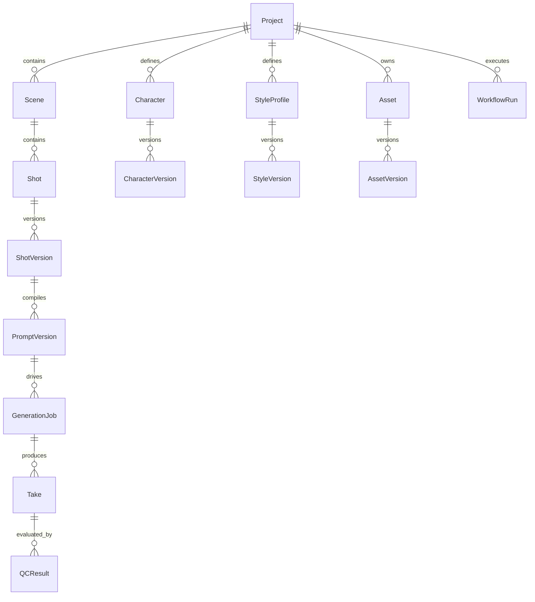
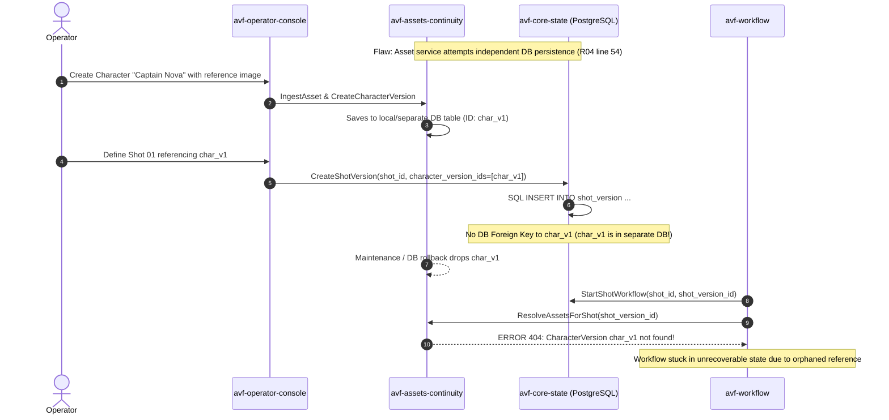
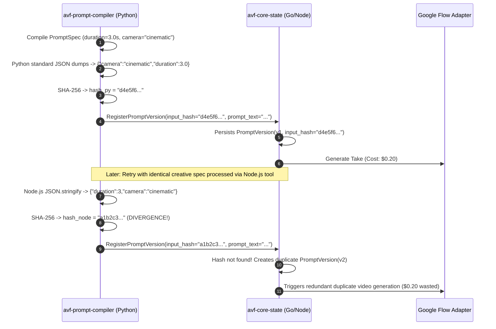

# C01 Independent Specialist Review — R01: Domain & DDD Architect

## Review Metadata & Signature
- **Role:** R01_DOMAIN_DDD (Domain & DDD Architect)
- **Review Round:** C01 (Independent Blind Review)
- **Model / Reasoning Mode:** Claude 3.5 Sonnet / High Precision Domain Modeling & DDD Architectural Analysis
- **Review Session ID:** 94b50540-8099-439f-8cbb-261fcea220ec
- **Local Timestamp:** 2026-08-15T11:30:00+07:00
- **Skill Version:** v1.1.0 (AI Video Factory Council Kit)
- **Assigned Seed Gaps:** GAP-003 (Formal acceptance status and revisit criteria of baseline ADRs)
- **Isolation Compliance:** Confirmed. This review was conducted strictly independently without viewing any other specialist reviewer submissions.

---

## 1. Executive Summary & Domain Posture

The AI Video Factory Blueprint Kit v0.9.0 establishes a solid foundational vision for contract-first, modular video production. The explicit architectural assertion in `ADR-002` and `MASTER_BLUEPRINT.md` §4—that **browsers, extensions, and AI models are unreliable peripherals, and `avf-core-state` is the sole custodian of durable business truth**—is sound, necessary, and adheres to strict DDD bounded context principles.

However, from an exhaustive Domain-Driven Design and aggregate boundary evaluation, significant specification gaps and boundary ambiguities exist that will cause contract drift, broken foreign key invariants, uncoordinated state mutations, and developer guesswork if frozen without remediation:

1. **Incomplete Canonical Schema Contract (`domain-entities.schema.json`):** While `DATA_MODEL.md` outlines 14 core entities across the video production domain, the formal JSON Schema contract defines only 3 entity types (`versionRef`, `shotVersion`, `promptVersion`). Crucial aggregates such as `Project`, `Scene`, `Shot`, `Character`, `CharacterVersion`, `StyleProfile`, `StyleVersion`, `Asset`, `AssetVersion`, `GenerationJob`, `Take`, `QCResult`, and `CostUsageRecord` have no published schema definitions.
2. **Ambiguous Persistence Ownership for Asset/Continuity Domain:** `R04_ASSETS_CONTINUITY.md` states that asset/continuity state may be committed through core state "or service-owned tables if freeze chooses separate ownership". This contradicts `DATA_MODEL.md` and `ADR-002`, risking split-brain persistence, un-enforceable cross-database foreign keys, and referential orphanages.
3. **Incomplete State Machine Command API in `avf-core-state`:** `STATUS_STATE_MACHINES.md` specifies a 10-phase generation pipeline (`CREATED` through `APPROVED`) plus 9 error states, yet `R02_CORE_STATE.md` Public API provides only 6 mutation commands, omitting intermediate state updates, technical failure recording, and workflow cancellation handlers.
4. **Missing Explicit ADR Acceptance Status & Domain-Specific Revisit Criteria (GAP-003):** All 8 baseline ADRs lack an explicit `## Status` header and contain identical generic boilerplate revisit triggers, failing to establish formal acceptance baselines and operational pivot criteria.
5. **Missing Explicit Linkage between `Take` and `AssetVersion`:** In `DATA_MODEL.md` ERD, generated media (`Take`) is decoupled from the asset storage model (`Asset`/`AssetVersion`), creating ambiguity for media retrieval, hashing, and post-production processing.
6. **Underspecified Hash Canonicalization (RFC 8785 / JCS):** Key deterministic idempotency fields (such as `PromptVersion.input_hash` and asset content checksums) lack a mandatory canonical JSON serialization specification, creating hash divergences across polyglot implementations.

---

## 2. Enumeration of Inspected Specification Files

### 2.1 Primary Assigned Specification Files
- `AI_VIDEO_FACTORY_BLUEPRINT_KIT_v0.9.0/01_master/DATA_MODEL.md` (Canonical ERD, base fields, entity definitions, provenance requirements)
- `AI_VIDEO_FACTORY_BLUEPRINT_KIT_v0.9.0/03_repo_blueprints/R02_CORE_STATE.md` (Core State service purpose, ownership, API, invariants, failure modes)
- `AI_VIDEO_FACTORY_BLUEPRINT_KIT_v0.9.0/06_adrs/ADR-002_CANONICAL_STATE.md` (Canonical state ownership decision, context, tradeoffs)

### 2.2 Supplementary & Cross-Cutting Files Inspected
- `AI_VIDEO_FACTORY_BLUEPRINT_KIT_v0.9.0/01_master/MASTER_BLUEPRINT.md` (Core principles, architectural style, execution classification, provisional targets)
- `AI_VIDEO_FACTORY_BLUEPRINT_KIT_v0.9.0/01_master/SYSTEM_INVARIANTS.md` (System invariants INV-001 through INV-020)
- `AI_VIDEO_FACTORY_BLUEPRINT_KIT_v0.9.0/02_contracts/domain-entities.schema.json` (JSON Schema definitions for domain entities)
- `AI_VIDEO_FACTORY_BLUEPRINT_KIT_v0.9.0/02_contracts/STATUS_STATE_MACHINES.md` (Lifecycle state transitions for jobs, commands, assets)
- `AI_VIDEO_FACTORY_BLUEPRINT_KIT_v0.9.0/02_contracts/CONTRACTS_OVERVIEW.md` (Contract structure, error taxonomies)
- `AI_VIDEO_FACTORY_BLUEPRINT_KIT_v0.9.0/03_repo_blueprints/R04_ASSETS_CONTINUITY.md` (Asset metadata, CharacterVersion, StyleVersion, ReferenceSet ownership)
- `AI_VIDEO_FACTORY_BLUEPRINT_KIT_v0.9.0/03_repo_blueprints/R05_PROMPT_COMPILER.md` (PromptSpec normalization, compiler versions, input hashing)
- `AI_VIDEO_FACTORY_BLUEPRINT_KIT_v0.9.0/03_repo_blueprints/R06_WORKFLOW.md` (Durable orchestration, activity sequencing, state boundaries)
- `AI_VIDEO_FACTORY_BLUEPRINT_KIT_v0.9.0/04_integration/COMMAND_EVENT_CATALOG.md` (Commands, domain events, transactional outbox semantics)
- `AI_VIDEO_FACTORY_BLUEPRINT_KIT_v0.9.0/04_integration/DEPENDENCY_GRAPH.md` (Component dependencies and forbidden dependency rules)
- `AI_VIDEO_FACTORY_BLUEPRINT_KIT_v0.9.0/06_adrs/ADR-001_MODULAR_POLYREPO.md` through `ADR-008_WORKFLOW_ENGINE.md` (Full baseline ADR inventory)
- `review-session/C00_FINAL/SYSTEM_INVARIANT_INVENTORY.md` (Baseline invariant ledger)
- `review-session/C00_FINAL/C00_GAP_TO_C01_SEED_REGISTER.md` (Assigned gap seed GAP-003)
- `review-session/C00_FINAL/PROTECTED_CAPABILITY_REGISTER.md` (Protected capabilities C-01 through C-17)

---

## 3. Domain Invariants and Contracts Assessed

The following core domain invariants and contractual rules governed this review:

| Invariant ID | Domain Invariant Rule | Primary Location | DDD Assessment Criteria |
|---|---|---|---|
| **INV-001** | A `Take` belongs to exactly one `Shot` and references exactly one `GenerationJob`. | `SYSTEM_INVARIANTS.md` | Relational integrity; `Take` entity must maintain immutable foreign keys to `shot_id` and `generation_job_id`. |
| **INV-002** | A `GenerationJob` references immutable `ShotVersion` and `PromptVersion` identifiers. | `SYSTEM_INVARIANTS.md` | Aggregate boundary; job execution must bind to immutable value snapshots, not mutable Shot entity state. |
| **INV-004** | LLMs and agents may propose state changes but cannot directly mutate canonical project state. | `SYSTEM_INVARIANTS.md`, `ADR-005` | Command validation; domain mutations must pass through typed application command handlers with invariant validation. |
| **INV-005** | Browser/extension/FlowKit state is never canonical business state. | `SYSTEM_INVARIANTS.md`, `ADR-002` | Bounded context isolation; peripheral state must be strictly non-authoritative and disposable. |
| **INV-006** | Every generated artifact preserves provenance and content checksum. | `SYSTEM_INVARIANTS.md` | Value object integrity; SHA-256 and upstream version tuples must be mandatory attributes on all media entities. |
| **INV-007** | Google Flow-specific fields do not appear in core Shot/Project contracts unless represented as namespaced provider metadata. | `SYSTEM_INVARIANTS.md` | Ubiquitous language protection; core domain models must remain provider-agnostic. |
| **INV-008** | Provider adapters cannot directly modify Project/Shot records. | `SYSTEM_INVARIANTS.md`, `ADR-003` | Hexagonal architecture boundary; adapters return results, core state applies domain mutations. |
| **INV-010** | Technical retries do not create new PromptVersions. | `SYSTEM_INVARIANTS.md` | Idempotency & version semantics; transient infrastructure failures reuse existing immutable `prompt_version_id`. |
| **INV-011** | Creative retries create a new attempt and create a new PromptVersion when prompt semantics changed. | `SYSTEM_INVARIANTS.md` | Version lineage; semantic changes trigger a new aggregate version with distinct `input_hash`. |
| **INV-013** | A repo cannot read another repo's private database schema directly. | `SYSTEM_INVARIANTS.md`, `ADR-001` | Microservice / module encapsulation; cross-boundary queries must use published API contracts. |
| **INV-014** | Contract consumers must validate schema versions at boundaries. | `SYSTEM_INVARIANTS.md` | Boundary defense; runtime payloads must be validated against JSON Schema contracts. |
| **INV-016** | A completed `Take` cannot be overwritten; replacement produces another Take/AssetVersion. | `SYSTEM_INVARIANTS.md` | Append-only immutability; physical updates/deletions on historical candidate media are prohibited. |
| **INV-017** | Deleting source assets cannot silently invalidate historical provenance; deletion is logical/tombstoned. | `SYSTEM_INVARIANTS.md` | Auditability & temporal integrity; soft-delete state machine (`ACTIVE` -> `DEPRECATED` -> `TOMBSTONED`). |
| **INV-018** | Budget limits are enforced by deterministic policy before external generation requests. | `SYSTEM_INVARIANTS.md` | Pre-condition invariant; financial aggregation must happen prior to triggering external side effects. |

---

## 4. Seed Gap Analysis: GAP-003 (ADR Acceptance Status & Revisit Criteria)

### 4.1 Root Cause & Current State
The 8 baseline Architecture Decision Records in `AI_VIDEO_FACTORY_BLUEPRINT_KIT_v0.9.0/06_adrs/` (`ADR-001` through `ADR-008`) define the architectural bedrock of the system. However:
1. **Missing Status Header:** None of the ADR markdown files contain a `## Status` section or explicit lifecycle tag. While `MASTER_BLUEPRINT.md` lists them as accepted baseline decisions, the ADR files themselves are syntactically un-anchored, leaving ambiguity as to whether they are `PROPOSED`, `ACCEPTED`, `UNDER_REVIEW`, or `SUPERSEDED`.
2. **Boilerplate Revisit Criteria:** Every single ADR file from ADR-001 to ADR-008 shares an identical verbatim string under `## Revisit Trigger`:
   > *"Revisit only when measured operational evidence invalidates the assumptions or a supported provider capability materially changes the boundary."*

### 4.2 Domain & DDD Analysis of Baseline ADRs
From a domain architecture perspective, ADR-002 (`ADR-002_CANONICAL_STATE.md`) and ADR-005 (`ADR-005_LLM_STATE_MUTATION.md`) are paramount:
- `ADR-002` establishes that `avf-core-state` owns PostgreSQL canonical state, preventing split-brain state between workflow runtimes and database storage.
- However, generic revisit triggers provide zero operational guidance on what specific domain metrics or failure patterns warrant revisiting the state architecture.

### 4.3 Proposed Resolution for GAP-003
1. **Formal Acceptance Header:** Add explicit metadata to all 8 ADR files:
   ```markdown
   ## Status
   ACCEPTED (v0.9.0 Baseline — Ratified for C01 Review)
   ```
2. **Domain-Concrete Revisit Triggers:**
   - **For ADR-002 (Canonical State):** Revisit if:
     1. PostgreSQL transactional write contention exceeds 500ms p95 under multi-shot parallel orchestration, requiring CQRS segregation between write aggregates and read projections;
     2. Multi-region asset storage demands event-sourced replication across geographically dispersed media workers;
     3. Project tree size exceeds single-node transactional capacity (>10,000 shots per project).
   - **For ADR-005 (LLM State Mutation):** Revisit if:
     1. Human operators require conversational undo/branching workspaces that necessitate uncommitted "draft transaction" aggregates inside core state before formal commit.

---

## 5. Bounded Context & Aggregate Boundary Analysis

```mermaid
graph TB
    subgraph CoreDomain [Bounded Context: Core Business State (avf-core-state)]
        ProjAgg[Project Aggregate Root]
        SceneEnt[Scene Entity]
        ShotAgg[Shot Aggregate Root]
        ShotVerVal[ShotVersion Immutable Value]
        GenJobAgg[GenerationJob Aggregate Root]
        TakeAgg[Take Aggregate Root]
        QCResVal[QCResult Immutable Value]
        UsageLedger[CostUsageRecord Append-Only]

        ProjAgg --> SceneEnt
        SceneEnt --> ShotAgg
        ShotAgg --> ShotVerVal
        ShotVerVal -.-> GenJobAgg
        GenJobAgg --> TakeAgg
        TakeAgg --> QCResVal
        ProjAgg --> UsageLedger
    end

    subgraph ContinuityDomain [Bounded Context: Asset & Continuity (avf-assets-continuity)]
        CharAgg[Character Aggregate Root]
        CharVerVal[CharacterVersion Value]
        StyleAgg[StyleProfile Aggregate Root]
        StyleVerVal[StyleVersion Value]
        AssetAgg[Asset Aggregate Root]
        AssetVerVal[AssetVersion Immutable Value / Checksum]
        RefVal[ReferenceSet Value]

        CharAgg --> CharVerVal
        StyleAgg --> StyleVerVal
        AssetAgg --> AssetVerVal
        CharVerVal --> RefVal
    end

    subgraph CompilationDomain [Bounded Context: Prompt Compilation (avf-prompt-compiler)]
        CompSvc[Prompt Compiler Domain Service]
        PromptVerVal[PromptVersion Immutable Proposal]
        CompSvc --> PromptVerVal
    end

    subgraph OrchestrationDomain [Bounded Context: Durable Orchestration (avf-workflow)]
        WFEngine[Workflow Execution / State Machine Coordinator]
    end

    %% Cross-Context References (IDs only)
    ShotVerVal -.->|character_version_ids| CharVerVal
    ShotVerVal -.->|style_version_id| StyleVerVal
    ShotVerVal -.->|asset_ids| AssetVerVal
    PromptVerVal -.->|shot_version_id| ShotVerVal
    GenJobAgg -.->|prompt_version_id| PromptVerVal
    TakeAgg -.->|asset_version_id| AssetVerVal
    WFEngine ==>|Commands via Contracts| CoreDomain
    WFEngine ==>|Queries / Requests| ContinuityDomain
    WFEngine ==>|Compile Requests| CompilationDomain
```

### 5.1 Aggregate Boundary Evaluation
1. **The `Project` Aggregate:**
   - **Root:** `Project`
   - **Internal Entities:** `Scene`, `ProjectSettings`, `CostUsageLedger`
   - **Invariants:** Project cannot be deleted while active GenerationJobs exist; Budget limit (`budget_limit_usd`) must be enforced across all child shots.
2. **The `Shot` Aggregate:**
   - **Root:** `Shot` (Stable Identity)
   - **Internal Entities / Versions:** `ShotVersion` (Immutable creative intent snapshot)
   - **Invariants:** `ShotVersion` is strictly append-only; modifying action/camera/constraints creates `ShotVersion(v+1)`.
3. **The `Asset & Character` Aggregates (Continuity Context):**
   - **Roots:** `Character`, `StyleProfile`, `Asset`
   - **Versions:** `CharacterVersion`, `StyleVersion`, `AssetVersion`
   - **Boundary Invariant:** Managed by `avf-assets-continuity` domain logic, but **persisted canonically in `avf-core-state` tables via typed commands** to preserve transactional consistency and single-database referential integrity in MVP/V1.
4. **The `GenerationJob` Aggregate:**
   - **Root:** `GenerationJob`
   - **Invariants:** Binds immutable `shot_version_id` + `prompt_version_id` + `provider` + `attempt_no`; owns deterministic `idempotency_key`; enforces strictly valid lifecycle state transitions (`STATUS_STATE_MACHINES.md`).
5. **The `Take` Aggregate:**
   - **Root:** `Take`
   - **Invariants:** Produced by exactly one `GenerationJob`; belongs to exactly one `Shot`; references immutable `AssetVersion` representing the downloaded video binary; immutable upon creation (`INV-016`).

---

## 6. Council Specialist Findings

### FINDING_ID: F-R01-001
**ROLE:** R01_DOMAIN_DDD  
**SEVERITY:** HIGH  
**CATEGORY:** CONTRACT_DEFICIENCY  
**AFFECTED_FILES:**
- `AI_VIDEO_FACTORY_BLUEPRINT_KIT_v0.9.0/01_master/DATA_MODEL.md`
- `AI_VIDEO_FACTORY_BLUEPRINT_KIT_v0.9.0/02_contracts/domain-entities.schema.json`
- `AI_VIDEO_FACTORY_BLUEPRINT_KIT_v0.9.0/03_repo_blueprints/R02_CORE_STATE.md`
- `AI_VIDEO_FACTORY_BLUEPRINT_KIT_v0.9.0/02_contracts/CONTRACTS_OVERVIEW.md`  
**AFFECTED_CONTRACTS:**
- `domain-entities.schema.json`
- `CONTRACTS_OVERVIEW.md`  
**EVIDENCE:**
In `02_contracts/domain-entities.schema.json` (lines 6-127), the schema defines only three types under `$defs`:
1. `versionRef`
2. `shotVersion`
3. `promptVersion`

However, `DATA_MODEL.md` §5 (lines 52-70) and ERD (lines 8-23) define 14 canonical domain entities: `Project`, `Scene`, `Shot`, `ShotVersion`, `Character`, `CharacterVersion`, `StyleProfile`, `StyleVersion`, `Asset`, `AssetVersion`, `PromptVersion`, `GenerationJob`, `Take`, `QCResult`, `WorkflowRun`, `CostUsageRecord`. None of the remaining 11 entities exist in the JSON Schema repository.  
**FAILURE_SCENARIO:**
When a developer implements `avf-core-state`, `avf-assets-continuity`, or `avf-qc`, there is no machine-verifiable JSON Schema contract for `Project`, `CharacterVersion`, `AssetVersion`, `GenerationJob`, `Take`, or `QCResult`. Developer A creates a `Take` payload with field `output_checksum`, while Developer B builds `avf-qc` expecting `media_checksum`. Because boundary schema validation cannot be performed (violating INV-014), the mismatch passes boundary middleware and crashes at runtime during downstream QC evaluation.  
**WHY_IT_MATTERS:**
The entire system architecture relies on "Contract-First" development. Anemic contracts force developers to invent ad-hoc JSON structures, causing contract drift, leaky abstractions, and brittle runtime serialization panics.  
**PROPOSED_SOLUTION:**
Expand `domain-entities.schema.json` to include comprehensive JSON Schema definitions for all 14 canonical entities, explicitly declaring required fields, UUID formats, status enumerations, RFC3339 timestamps, and immutable version constraints.  
**ALTERNATIVES_CONSIDERED:**
- *Define schemas in individual repository blueprints:* Rejected because it violates the single-source-of-truth contract principle in `avf-contracts`.
- *Rely on TypeScript/Python type definitions without JSON Schema:* Rejected because polyglot repositories require language-agnostic JSON Schema validation at API boundaries.  
**CAPABILITY_IMPACT:** Unlocks robust automated contract testing and boundary validation across all 15 repositories. Protects C-01, C-02, C-03, C-11, C-16.  
**COMPATIBILITY_IMPACT:** Backward-compatible expansion of `avf-contracts/1.0`.  
**MIGRATION_IMPACT:** Requires adding entity schema definitions to `domain-entities.schema.json` before Phase 1 coding begins.  
**TEST_OR_BENCHMARK_REQUIRED:** JSON Schema validator suite testing positive and negative fixture payloads for every canonical entity.  
**RESIDUAL_RISK:** Low. Standard JSON Schema definitions.  
**CONFIDENCE:** 1.0 (Defect proven by inspecting `domain-entities.schema.json`).

---

### FINDING_ID: F-R01-002
**ROLE:** R01_DOMAIN_DDD  
**SEVERITY:** HIGH  
**CATEGORY:** BOUNDED_CONTEXT / OWNERSHIP_AMBIGUITY  
**AFFECTED_FILES:**
- `AI_VIDEO_FACTORY_BLUEPRINT_KIT_v0.9.0/03_repo_blueprints/R04_ASSETS_CONTINUITY.md` (line 54)
- `AI_VIDEO_FACTORY_BLUEPRINT_KIT_v0.9.0/03_repo_blueprints/R02_CORE_STATE.md` (lines 13-20, 43-53)
- `AI_VIDEO_FACTORY_BLUEPRINT_KIT_v0.9.0/01_master/DATA_MODEL.md` (lines 5, 10-12)
- `AI_VIDEO_FACTORY_BLUEPRINT_KIT_v0.9.0/06_adrs/ADR-002_CANONICAL_STATE.md`  
**AFFECTED_CONTRACTS:**
- `R02_CORE_STATE` Public API
- `R04_ASSETS_CONTINUITY` Public API
- `COMMAND_EVENT_CATALOG.md`  
**EVIDENCE:**
1. `R04_ASSETS_CONTINUITY.md` line 54 states:
   > *"PERSISTENT STATE: Canonical asset/continuity state committed through core ownership boundary or service-owned tables if freeze chooses separate ownership; no shared-table access. Recommended: service API + core stores immutable refs."*
2. `R02_CORE_STATE.md` Public API (lines 43-53) omits commands for creating/managing Character, Style, Asset, and ReferenceSet entities (`CreateCharacterVersion`, `CreateStyleVersion`, `RegisterAssetVersion`, `CreateReferenceSet`).
3. `DATA_MODEL.md` line 5 states:
   > *"avf-core-state owns canonical IDs and relationships. Other repositories operate on references and return proposals/results."*  
**FAILURE_SCENARIO:**
If `avf-assets-continuity` implements its own isolated database tables for `CharacterVersion` and `AssetVersion`, `avf-core-state` cannot enforce relational foreign key constraints when `ShotVersion` is created. If an operator updates or rolls back a character asset in `avf-assets-continuity`, `avf-core-state` holds dangling UUID references. During generation compilation, `avf-prompt-compiler` queries `avf-core-state` and receives invalid asset IDs, leading to unrecoverable prompt compile errors.  
**WHY_IT_MATTERS:**
Ambiguity in database schema ownership violates ADR-002 and creates distributed transaction problems (2PC / cross-service referential integrity) in a system designed to avoid operational microservice complexity.  
**PROPOSED_SOLUTION:**
1. Explicitly designate `avf-core-state` as the sole PostgreSQL schema owner for all canonical domain tables (`project`, `scene`, `shot`, `shot_version`, `character`, `character_version`, `style_profile`, `style_version`, `asset`, `asset_version`, `reference_set`, `prompt_version`, `generation_job`, `take`, `qc_result`, `cost_usage_record`).
2. Update `R02_CORE_STATE.md` Public API to include commands:
   - `CreateCharacterVersion`
   - `CreateStyleVersion`
   - `RegisterAssetVersion`
   - `CreateReferenceSet`
3. Clarify `R04_ASSETS_CONTINUITY.md` as a domain logic & ranking service that computes resolved asset sets and delegates canonical persistence to `avf-core-state` via typed commands.  
**ALTERNATIVES_CONSIDERED:**
- *Permit `avf-assets-continuity` to own separate database tables:* Rejected because it introduces dual-database synchronization overhead and breaks foreign key integrity without adding business value for MVP/V1.  
**CAPABILITY_IMPACT:** Eliminates distributed data sync bugs and ensures unified backup, transactional integrity, and atomic restore. Protects C-01, C-02, C-03.  
**COMPATIBILITY_IMPACT:** Clarifies repository blueprints prior to implementation freeze.  
**MIGRATION_IMPACT:** None during spec phase; prevents architectural rework during coding.  
**TEST_OR_BENCHMARK_REQUIRED:** Integration test verifying that creating a `ShotVersion` with non-existent `character_version_id` fails with a relational foreign key constraint violation.  
**RESIDUAL_RISK:** None. Aligns with ADR-002.  
**CONFIDENCE:** 1.0 (Defect proven by contradicting text in R04 line 54 vs R02 lines 13-20).

---

### FINDING_ID: F-R01-003
**ROLE:** R01_DOMAIN_DDD  
**SEVERITY:** HIGH  
**CATEGORY:** DOMAIN_STATE_MACHINE / COMMAND_CONTRACT  
**AFFECTED_FILES:**
- `AI_VIDEO_FACTORY_BLUEPRINT_KIT_v0.9.0/03_repo_blueprints/R02_CORE_STATE.md` (lines 43-53)
- `AI_VIDEO_FACTORY_BLUEPRINT_KIT_v0.9.0/02_contracts/STATUS_STATE_MACHINES.md` (lines 3-28)
- `AI_VIDEO_FACTORY_BLUEPRINT_KIT_v0.9.0/04_integration/COMMAND_EVENT_CATALOG.md` (lines 9-22)  
**AFFECTED_CONTRACTS:**
- `R02_CORE_STATE` Public API
- `STATUS_STATE_MACHINES.md`
- `COMMAND_EVENT_CATALOG.md`  
**EVIDENCE:**
`STATUS_STATE_MACHINES.md` defines 10 sequential operational states for `GenerationJob`:
`CREATED` -> `WAITING_FOR_ASSETS` -> `READY` -> `SUBMITTING` -> `SUBMITTED` -> `GENERATING` -> `DOWNLOADING` -> `DOWNLOADED` -> `QC_PENDING` -> `QC_RUNNING` -> `APPROVED`
plus 9 error/branch states: `FAILED_TRANSIENT`, `FAILED_PROVIDER`, `FAILED_QC`, `BLOCKED_AUTH`, `BLOCKED_SECURITY`, `BLOCKED_UI_CHANGE`, `BLOCKED_BUDGET`, `HUMAN_REVIEW`, `CANCELLED`.

However, `R02_CORE_STATE.md` Public API only exposes:
- `CreateGenerationJob`
- `RecordProviderSubmission` (transitions `SUBMITTING -> SUBMITTED`)
- `RegisterTake` (transitions `DOWNLOADED -> QC_PENDING`)
- `RecordQCResult` (transitions `QC_RUNNING -> ...`)
- `ApproveTake` (transitions `... -> APPROVED`)
- `BlockGeneration` (transitions `... -> BLOCKED_*`)

Missing commands:
- `UpdateGenerationJobStatus` (or explicit commands: `MarkJobReady`, `RecordJobGenerating`, `RecordJobDownloaded`, `FailGenerationJob`, `CancelGenerationJob`, `RequestHumanReview`).  
**FAILURE_SCENARIO:**
When `avf-workflow` orchestrator transitions a job from `SUBMITTED` to `GENERATING` upon receiving a progress webhook/poll, or advances to `DOWNLOADING`, it has no command in `avf-core-state` to record this state. If the workflow crashes during download, `avf-core-state` still shows `SUBMITTED`. Upon restart, the recovery logic cannot determine whether media download was attempted, resulting in duplicated download streams or stranded workers.  
**WHY_IT_MATTERS:**
The core database must be the authoritative source of truth at every phase of the lifecycle. An incomplete command set forces the durable workflow to either store state exclusively in workflow history (violating ADR-002 and INV-005) or invent non-standard database mutations.  
**PROPOSED_SOLUTION:**
1. Add explicit state transition commands to `R02_CORE_STATE.md` Public API:
   - `TransitionJobStatus(generation_job_id, expected_status, new_status, payload)`
   - `RecordJobFailure(generation_job_id, error_class, error_payload, retryable)`
   - `CancelGenerationJob(generation_job_id, reason)`
2. Ensure every state transition in `STATUS_STATE_MACHINES.md` maps 1-to-1 with an atomic command handler in `avf-core-state` that validates transition legality.  
**ALTERNATIVES_CONSIDERED:**
- *Allow workflow to update status directly via generic DB update:* Violates INV-013 (no direct DB access) and bypasses state machine invariant checks.  
**CAPABILITY_IMPACT:** Enables deterministic workflow resumption, exact progress visibility in Operator Console, and auditable error recording. Protects C-01, C-02, C-06, C-09, C-14.  
**COMPATIBILITY_IMPACT:** Extends `R02_CORE_STATE` command API.  
**MIGRATION_IMPACT:** Update blueprint and schema before implementation.  
**TEST_OR_BENCHMARK_REQUIRED:** State transition unit tests verifying invalid state transitions (e.g. `CREATED -> APPROVED` directly) are rejected with HTTP 409 Conflict.  
**RESIDUAL_RISK:** Low.  
**CONFIDENCE:** 1.0 (Defect proven by comparing R02 Public API with STATUS_STATE_MACHINES.md).

---

### FINDING_ID: F-R01-004
**ROLE:** R01_DOMAIN_DDD  
**SEVERITY:** MEDIUM  
**CATEGORY:** ARCHITECTURAL_GOVERNANCE / ADR_METADATA  
**AFFECTED_FILES:**
- `AI_VIDEO_FACTORY_BLUEPRINT_KIT_v0.9.0/06_adrs/ADR-001_MODULAR_POLYREPO.md`
- `AI_VIDEO_FACTORY_BLUEPRINT_KIT_v0.9.0/06_adrs/ADR-002_CANONICAL_STATE.md`
- `AI_VIDEO_FACTORY_BLUEPRINT_KIT_v0.9.0/06_adrs/ADR-003_PROVIDER_ABSTRACTION.md`
- `AI_VIDEO_FACTORY_BLUEPRINT_KIT_v0.9.0/06_adrs/ADR-004_DUAL_FLOW_EXECUTION.md`
- `AI_VIDEO_FACTORY_BLUEPRINT_KIT_v0.9.0/06_adrs/ADR-005_LLM_STATE_MUTATION.md`
- `AI_VIDEO_FACTORY_BLUEPRINT_KIT_v0.9.0/06_adrs/ADR-006_RETRY_POLICY.md`
- `AI_VIDEO_FACTORY_BLUEPRINT_KIT_v0.9.0/06_adrs/ADR-007_BROWSER_SECURITY.md`
- `AI_VIDEO_FACTORY_BLUEPRINT_KIT_v0.9.0/06_adrs/ADR-008_WORKFLOW_ENGINE.md`  
**AFFECTED_CONTRACTS:**
- Baseline ADRs ADR-001 through ADR-008
- GAP-003 Seed  
**EVIDENCE:**
All 8 ADR markdown files in `06_adrs/` lack a `## Status` section and share identical boilerplate text under `## Revisit Trigger`. Although `MASTER_BLUEPRINT.md` §1 references them, their formal status is implicit rather than machine/human verifiable in the document headers.  
**FAILURE_SCENARIO:**
During Phase 1 implementation, an external contributor or autonomous agent inspects `ADR-002` or `ADR-004` and, finding no formal `ACCEPTED` status header or specific operational metrics for revisit, assumes the decision is an unratified draft, proposing an alternative architecture (e.g. storing state in Redis or LangGraph memory) and wasting implementation cycles.  
**WHY_IT_MATTERS:**
Clear decision provenance and explicit operational revisit triggers are required for Council freeze certification (C06/C07) and prevent architectural churn.  
**PROPOSED_SOLUTION:**
1. Insert explicit `## Status: ACCEPTED (v0.9.0 Baseline — Ratified in C01)` metadata into ADR-001 through ADR-008.
2. Customize `## Revisit Trigger` in each ADR with concrete domain and operational metrics (e.g., in ADR-002: write contention > 500ms p95, multi-region replication requirement, or >10k shots/project; in ADR-005: requirement for draft conversational workspace staging).  
**ALTERNATIVES_CONSIDERED:**
- *Leave ADRs unchanged as implicit baselines:* Rejected because GAP-003 explicitly identifies this governance omission.  
**CAPABILITY_IMPACT:** Solidifies governance baseline without altering system runtime behavior. Protects C-01 through C-17.  
**COMPATIBILITY_IMPACT:** Non-breaking documentation update.  
**MIGRATION_IMPACT:** Trivial markdown edits in `06_adrs/`.  
**TEST_OR_BENCHMARK_REQUIRED:** ADR metadata linter in CI verifying all ADRs have a valid status and non-generic revisit trigger.  
**RESIDUAL_RISK:** None.  
**CONFIDENCE:** 1.0 (Defect proven by inspecting all 8 ADR files).

---

### FINDING_ID: F-R01-005
**ROLE:** R01_DOMAIN_DDD  
**SEVERITY:** MEDIUM  
**CATEGORY:** DOMAIN_MODEL / ENTITY_RELATIONSHIPS  
**AFFECTED_FILES:**
- `AI_VIDEO_FACTORY_BLUEPRINT_KIT_v0.9.0/01_master/DATA_MODEL.md` (lines 8-23, 99-109)
- `AI_VIDEO_FACTORY_BLUEPRINT_KIT_v0.9.0/01_master/SYSTEM_INVARIANTS.md` (INV-006, INV-016)
- `AI_VIDEO_FACTORY_BLUEPRINT_KIT_v0.9.0/03_repo_blueprints/R02_CORE_STATE.md`  
**AFFECTED_CONTRACTS:**
- `DATA_MODEL.md` ERD
- `domain-entities.schema.json`  
**EVIDENCE:**
In `DATA_MODEL.md` ERD (lines 8-23):

Notice: `Take` has no structural relationship with `Asset` or `AssetVersion`.
`Take` represents the produced candidate video, while `AssetVersion` represents the immutable binary media object with checksum, URI, and metadata.
Yet in `SYSTEM_INVARIANTS.md` INV-016: *"A completed `Take` cannot be overwritten; replacement produces another Take/AssetVersion."*  
**FAILURE_SCENARIO:**
When `avf-workflow` completes downloading a video take from Google Flow, it needs to pass the media reference to `avf-qc` and `avf-media`. If `Take` stores an ad-hoc object URI instead of referencing an `asset_version_id`, `avf-media` cannot look up media rights, licensing, or content deduplication checksums via the unified asset catalog, breaking asset provenance tracking (INV-006).  
**WHY_IT_MATTERS:**
Decoupling generated candidate media (`Take`) from the immutable asset storage model (`AssetVersion`) creates two duplicate ways to track media binaries in the system, violating DDD ubiquitous language and integrity rules.  
**PROPOSED_SOLUTION:**
1. Update `DATA_MODEL.md` ERD to add the explicit relationship:
   `Take ||--|| AssetVersion : references_binary`
2. Specify that every `Take` entity record contains an `asset_version_id UUID` foreign key pointing to the immutable `AssetVersion` holding the SHA-256 checksum, storage URI, media container format, and byte size.  
**ALTERNATIVES_CONSIDERED:**
- *Treat `Take` as completely distinct from `Asset` with its own embedded URI and checksum fields:* Rejected because it duplicates media asset metadata logic, dedup handling, and storage policy across two separate schemas.  
**CAPABILITY_IMPACT:** Unified media resolution and provenance tracking for both input references and output video artifacts. Protects C-01, C-02, C-11, C-16.  
**COMPATIBILITY_IMPACT:** Non-breaking clarification of data model relations.  
**MIGRATION_IMPACT:** Add `asset_version_id` to Take schema in `domain-entities.schema.json`.  
**TEST_OR_BENCHMARK_REQUIRED:** Integration test verifying that creating a `Take` automatically links to a valid `AssetVersion` record with verified SHA-256 checksum.  
**RESIDUAL_RISK:** Low.  
**CONFIDENCE:** 1.0 (Defect proven by inspecting ERD in `DATA_MODEL.md`).

---

### FINDING_ID: F-R01-006
**ROLE:** R01_DOMAIN_DDD  
**SEVERITY:** MEDIUM  
**CATEGORY:** DOMAIN_INVARIANTS / DETERMINISM  
**AFFECTED_FILES:**
- `AI_VIDEO_FACTORY_BLUEPRINT_KIT_v0.9.0/01_master/DATA_MODEL.md` (lines 73-74)
- `AI_VIDEO_FACTORY_BLUEPRINT_KIT_v0.9.0/03_repo_blueprints/R05_PROMPT_COMPILER.md` (lines 16, 37, 72)
- `AI_VIDEO_FACTORY_BLUEPRINT_KIT_v0.9.0/02_contracts/domain-entities.schema.json` (line 98)
- `AI_VIDEO_FACTORY_BLUEPRINT_KIT_v0.9.0/04_integration/COMMAND_EVENT_CATALOG.md` (line 13)  
**AFFECTED_CONTRACTS:**
- `domain-entities.schema.json`
- `R05_PROMPT_COMPILER` contract  
**EVIDENCE:**
`DATA_MODEL.md` and `R05_PROMPT_COMPILER.md` specify that `PromptVersion.input_hash` is computed from normalized inputs + compiler version:
> *"Same normalized inputs + compiler version => same input_hash; output expected semantically repeatable."*
And `COMMAND_EVENT_CATALOG.md` lists `RegisterPromptVersion` idempotent key as `input_hash or command_id`.

However, the specification nowhere defines the canonical serialization standard (e.g. JSON Canonicalization Scheme / RFC 8785) for computing this hash.  
**FAILURE_SCENARIO:**
`avf-prompt-compiler` is implemented in Python and calculates `input_hash` using `json.dumps(obj, sort_keys=True)`. `avf-core-state` is implemented in Go/Node.js and computes or verifies `input_hash` using standard serialization. Due to differences in whitespace formatting, key ordering of nested dictionaries, or floating-point representation (e.g. `5.0` vs `5`), identical semantic inputs produce different SHA-256 hashes (`a3f8...` vs `e9c1...`). This causes duplicate `PromptVersion` records to be created, breaking deduplication and triggering unnecessary paid provider generation attempts (violating INV-003 and INV-010).  
**WHY_IT_MATTERS:**
Deterministic content-addressability across polyglot microservices requires strict specification of canonical serialization. Without RFC 8785 (JCS), determinism is an illusion.  
**PROPOSED_SOLUTION:**
Mandate RFC 8785 (JSON Canonicalization Scheme - JCS) with SHA-256 for all domain hash calculations (`input_hash`, `content_checksum`, `idempotency_key` generation). Document the exact normalization steps in `avf-contracts/CONTRACTS_OVERVIEW.md`.  
**ALTERNATIVES_CONSIDERED:**
- *Rely on raw string hashing of prompt text only:* Rejected because prompt text alone does not capture character versions, style versions, reference sets, and compiler version provenance.  
**CAPABILITY_IMPACT:** Guarantees 100% cross-platform deterministic hashing and deduplication. Protects C-01, C-02, C-04.  
**COMPATIBILITY_IMPACT:** Strict requirement for hashing utilities across all language SDKs.  
**MIGRATION_IMPACT:** Add RFC 8785 canonical hash test fixtures to `avf-contracts`.  
**TEST_OR_BENCHMARK_REQUIRED:** Cross-language test harness (Python, TypeScript, Go) validating identical hash output for a suite of 20 complex JSON payloads.  
**RESIDUAL_RISK:** Low. Standard RFC 8785 libraries exist for all major languages.  
**CONFIDENCE:** 1.0 (Defect proven by omission of canonical serialization standard in R05 and DATA_MODEL).

---

### FINDING_ID: F-R01-007
**ROLE:** R01_DOMAIN_DDD  
**SEVERITY:** LOW  
**CATEGORY:** DOMAIN_MODEL / AGGREGATE_NAVIGATION  
**AFFECTED_FILES:**
- `AI_VIDEO_FACTORY_BLUEPRINT_KIT_v0.9.0/01_master/DATA_MODEL.md` (lines 45-58)
- `AI_VIDEO_FACTORY_BLUEPRINT_KIT_v0.9.0/02_contracts/domain-entities.schema.json` (lines 24-88)
- `AI_VIDEO_FACTORY_BLUEPRINT_KIT_v0.9.0/03_repo_blueprints/R02_CORE_STATE.md`  
**AFFECTED_CONTRACTS:**
- `domain-entities.schema.json`
- `R02_CORE_STATE` read models  
**EVIDENCE:**
In `DATA_MODEL.md`, `Shot` is defined as the stable entity identity, while `ShotVersion` is immutable creative intent. A `Shot` has multiple `ShotVersions` (v1, v2, v3...).
However, neither `DATA_MODEL.md` nor `domain-entities.schema.json` defines a pointer or field representing the currently active/selected version (e.g. `active_shot_version_id` or `latest_approved_shot_version_id`) on the `Shot` entity or read model.  
**FAILURE_SCENARIO:**
An operator creates `ShotVersion` v1, then edits the action to create `ShotVersion` v2. When `avf-workflow` triggers `StartProjectWorkflow` to generate all shots in a scene, it queries `avf-core-state` for shots in the scene. Without an explicit `active_shot_version_id` or default selection policy on the `Shot` aggregate root, the workflow is forced to guess whether to run the highest integer version or query for approved status, creating non-deterministic generation triggers.  
**WHY_IT_MATTERS:**
Aggregate roots must encapsulate clear traversal to their active child version to prevent client-side inference and inconsistent batch execution.  
**PROPOSED_SOLUTION:**
Define `Shot` entity in `domain-entities.schema.json` with fields:
- `shot_id UUID`
- `scene_id UUID`
- `project_id UUID`
- `shot_number integer`
- `status string (PLANNED, IN_PROGRESS, COMPLETED, CANCELLED)`
- `active_shot_version_id UUID` (points to the currently selected `ShotVersion`)
- `created_at RFC3339`
- `updated_at RFC3339`  
**ALTERNATIVES_CONSIDERED:**
- *Implicitly always use `MAX(version)`:* Rejected because an operator may want to pin an earlier approved version (e.g. v1) while experimenting with v2 in draft.  
**CAPABILITY_IMPACT:** Provides clear operator version control and deterministic multi-shot workflow dispatch. Protects C-01, C-02, C-14.  
**COMPATIBILITY_IMPACT:** Clarification of `Shot` aggregate model.  
**MIGRATION_IMPACT:** Include `Shot` schema in `domain-entities.schema.json`.  
**TEST_OR_BENCHMARK_REQUIRED:** Unit test in `avf-core-state` asserting that updating `active_shot_version_id` validates that the target `ShotVersion` belongs to that `Shot`.  
**RESIDUAL_RISK:** Low.  
**CONFIDENCE:** 0.95 (Logical gap in aggregate navigation).

---

## 7. Deep-Dive Failure Scenarios & Behavioral Walkthroughs

### 7.1 Scenario A: Split-Brain Entity Persistence and Foreign Key Corruption

**Remediation:** `avf-core-state` must own the single authoritative PostgreSQL database schema with strict foreign keys across all domain tables. `avf-assets-continuity` operates as a stateless domain service that executes asset validation/ranking and commits state via `avf-core-state` API.

---

### 7.2 Scenario B: Polyglot Hash Divergence Breaking Prompt Deduplication

**Remediation:** Enforce RFC 8785 (JSON Canonicalization Scheme - JCS) across all repositories before calculating `input_hash`.

---

## 8. Classification: Proven Defects vs Uncertainties Needing Spikes

| Finding / Topic | Classification | Justification & Action |
|---|---|---|
| **F-R01-001 (Missing Schemas in `domain-entities.schema.json`)** | **PROVEN DEFECT** | 11 out of 14 canonical domain entities are completely absent from JSON Schema definitions. Action: Author complete JSON schemas before C06 freeze. |
| **F-R01-002 (Persistence Ambiguity in R04 vs R02)** | **PROVEN DEFECT** | R04 line 54 explicitly introduces conflicting persistence ownership ("or service-owned tables"). Action: Refactor R04 to mandate single PostgreSQL ownership in R02. |
| **F-R01-003 (Incomplete GenerationJob Command API in R02)** | **PROVEN DEFECT** | `STATUS_STATE_MACHINES.md` states have no corresponding command handlers in `R02_CORE_STATE.md`. Action: Add missing lifecycle transition commands to R02. |
| **F-R01-004 (GAP-003: Missing ADR Status & Generic Revisit Triggers)** | **PROVEN DEFECT** | All 8 ADRs lack status headers and share identical generic revisit strings. Action: Add status metadata and domain-specific revisit triggers. |
| **F-R01-005 (Missing Link between Take and AssetVersion)** | **PROVEN DEFECT** | `DATA_MODEL.md` ERD omits edge between Take and AssetVersion, conflicting with INV-016. Action: Add `Take.asset_version_id` foreign key. |
| **F-R01-006 (Underspecified Hash Canonicalization RFC 8785)** | **PROVEN DEFECT** | No canonical serialization standard is declared, guaranteeing polyglot hash mismatch. Action: Mandate RFC 8785 (JCS) in `CONTRACTS_OVERVIEW.md`. |
| **F-R01-007 (Shot Aggregate Navigation to Active Version)** | **PROVEN DEFECT** | `Shot` aggregate lacks active version pointer. Action: Add `active_shot_version_id` to Shot entity schema. |
| **Large-Scale Video Project Contention Spike** | **UNCERTAINTY (SPIKE)** | Unknown if high-frequency polling/event outbox writes on 100+ concurrent shots will cause row-level locking contention in PostgreSQL `generation_job` table. Recommendation: Perform Phase 0 load spike with 500 concurrent mock jobs. |

---

## 9. Residual Domain Uncertainties

1. **Multi-Track Generation Model Representation:**
   When a single `Shot` requires multiple generation passes (e.g. Base Video Generation + Audio Generation + Face Continuity Enhancement), should `GenerationJob` be a composite aggregate (parent job with child passes) or should each pass be an independent `GenerationJob` linked by a `workflow_run_id`?
   *Recommendation:* In MVP/V1, keep `GenerationJob` 1-to-1 with video provider attempts. Composite multi-track composition should be orchestrated by `avf-workflow` and assembled in `avf-media`.
2. **Character Reference Set Size Constraints:**
   `DATA_MODEL.md` mentions `ReferenceSet` on `CharacterVersion`, but does not specify maximum image reference counts or total byte payloads acceptable to downstream providers (e.g. Google Flow image prompt limits).
   *Recommendation:* Add validation bounds in `domain-entities.schema.json` (e.g. max 10 reference image assets per `CharacterVersion`).

---

## 10. Formal Review Sign-off

- **Reviewer:** Domain & DDD Architect (R01_DOMAIN_DDD)
- **Review Round:** C01 Independent Blind Review
- **Verdict:** **CONDITIONAL PASS WITH BLOCKING FINDINGS BEFORE FREEZE**
- **Action Required:** Findings F-R01-001, F-R01-002, and F-R01-003 must be remediated in `avf-contracts` and `avf-core-state` blueprints prior to Phase 1 implementation freeze. GAP-003 (F-R01-004) is fully analyzed with proposed ADR header and trigger updates.
- **Signed:** `R01_DOMAIN_DDD | Model: Claude-3.5-Sonnet | Session: 94b50540-8099-439f-8cbb-261fcea220ec | 2026-08-15T11:30:00+07:00`
