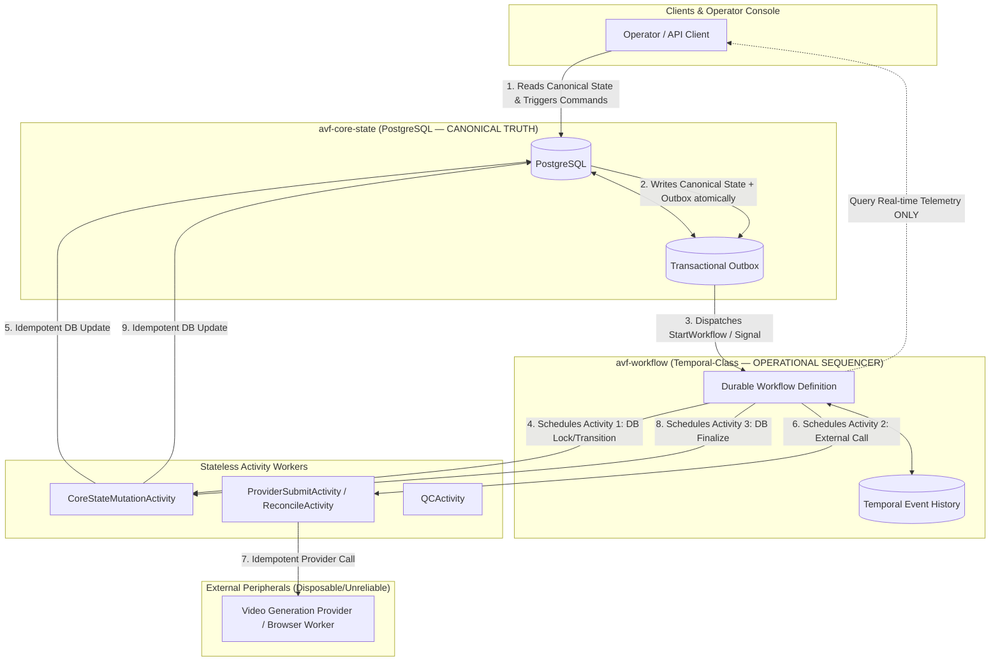

# C01 Independent Blind Review — R03_WORKFLOW
**Role:** Workflow / Durable Execution Architect  
**Reviewer ID:** R03_WORKFLOW  
**Session ID:** b9645731-2ead-4b0a-848d-03a5cb609337  
**Timestamp:** 2026-08-15T11:30:00+07:00  
**Model Mode:** Deep Reasoner (v1.1 Blind Protocol)  
**Governance Authority:** AI Video Factory Council Charter v1.1.0  
**Target Specification Status:** Candidate v1.0 Freeze Review

---

## 1. Assigned Specification Files Inspected

The following primary and supplementary specification files were systematically inspected in accordance with the C01 Coverage Plan:

1. `AI_VIDEO_FACTORY_BLUEPRINT_KIT_v0.9.0/03_repo_blueprints/R06_WORKFLOW.md` (Primary Repo Blueprint — `avf-workflow`)
2. `AI_VIDEO_FACTORY_BLUEPRINT_KIT_v0.9.0/06_adrs/ADR-008_WORKFLOW_ENGINE.md` (Primary Architectural Decision Record — Durable Workflow Runtime)
3. `AI_VIDEO_FACTORY_BLUEPRINT_KIT_v0.9.0/02_contracts/STATUS_STATE_MACHINES.md` (Primary Contract — State Machine Transitions & Invariants)
4. `AI_VIDEO_FACTORY_BLUEPRINT_KIT_v0.9.0/01_master/MASTER_BLUEPRINT.md` (System Architecture, Critical Path & Execution Classification)
5. `AI_VIDEO_FACTORY_BLUEPRINT_KIT_v0.9.0/01_master/DATA_MODEL.md` (Canonical Data Model & WorkflowRun entity linkage)
6. `AI_VIDEO_FACTORY_BLUEPRINT_KIT_v0.9.0/01_master/SYSTEM_INVARIANTS.md` (Normative Invariants 1–20)
7. `AI_VIDEO_FACTORY_BLUEPRINT_KIT_v0.9.0/02_contracts/CONTRACTS_OVERVIEW.md` (Error taxonomy & message envelopes)
8. `AI_VIDEO_FACTORY_BLUEPRINT_KIT_v0.9.0/02_contracts/provider-request.schema.json` (VideoGenerationRequest contract)
9. `AI_VIDEO_FACTORY_BLUEPRINT_KIT_v0.9.0/02_contracts/provider-result.schema.json` (VideoGenerationResult contract)
10. `AI_VIDEO_FACTORY_BLUEPRINT_KIT_v0.9.0/02_contracts/browser-command.schema.json` (FlowExecutionCommand contract)
11. `AI_VIDEO_FACTORY_BLUEPRINT_KIT_v0.9.0/03_repo_blueprints/R02_CORE_STATE.md` (Canonical State persistence boundary)
12. `AI_VIDEO_FACTORY_BLUEPRINT_KIT_v0.9.0/03_repo_blueprints/R07_PROVIDER_SDK.md` (Provider abstraction & FakeVideoProvider)
13. `AI_VIDEO_FACTORY_BLUEPRINT_KIT_v0.9.0/03_repo_blueprints/R08_GOOGLE_FLOW_ADAPTER.md` (Provider adapter execution port binding)
14. `AI_VIDEO_FACTORY_BLUEPRINT_KIT_v0.9.0/03_repo_blueprints/R09_BROWSER_WORKER.md` (Track A browser worker execution & timeouts)
15. `AI_VIDEO_FACTORY_BLUEPRINT_KIT_v0.9.0/03_repo_blueprints/R13_OPERATOR_CONSOLE.md` (Human-in-the-loop escalation & action UX)
16. `AI_VIDEO_FACTORY_BLUEPRINT_KIT_v0.9.0/04_integration/COMMAND_EVENT_CATALOG.md` (Transactional outbox & command dispatch)
17. `AI_VIDEO_FACTORY_BLUEPRINT_KIT_v0.9.0/06_adrs/ADR-002_CANONICAL_STATE.md` (PostgreSQL single source of truth)
18. `AI_VIDEO_FACTORY_BLUEPRINT_KIT_v0.9.0/06_adrs/ADR-006_RETRY_POLICY.md` (Deterministic retry policy ownership)
19. `review-session/C00_FINAL/C00_GAP_TO_C01_SEED_REGISTER.md` (Assigned Seed: GAP-004)

---

## 2. Invariants and Contracts Relevant to Workflow / Durable Execution

| Identifier | Category | Core Mandate / Constraint |
|---|---|---|
| **INV-001** | System Invariant | A `Take` belongs to exactly one `Shot` and references exactly one `GenerationJob`. |
| **INV-002** | System Invariant | A `GenerationJob` references immutable `ShotVersion` and `PromptVersion` identifiers. |
| **INV-003** | System Invariant | Every external side effect has an idempotency key or an explicit documented reason it cannot. |
| **INV-004** | System Invariant | LLMs and agents may propose state changes but cannot directly mutate canonical project state. |
| **INV-005** | System Invariant | Browser/extension/FlowKit state is never canonical business state. |
| **INV-008** | System Invariant | Provider adapters cannot directly modify Project/Shot records. |
| **INV-010** | System Invariant | Technical retries do not create new PromptVersions. |
| **INV-011** | System Invariant | Creative retries create a new attempt and create a new PromptVersion when prompt semantics changed. |
| **INV-012** | System Invariant | Authentication/security challenges do not trigger automated bypass behavior. |
| **INV-014** | System Invariant | Contract consumers must validate schema versions at boundaries. |
| **INV-015** | System Invariant | Correlation IDs (`trace_id`, `workflow_run_id`, `project_id`, `shot_id`, `generation_job_id`, `attempt_id`) must propagate across all boundaries. |
| **INV-016** | System Invariant | A completed `Take` cannot be overwritten; replacement produces another Take/AssetVersion. |
| **INV-018** | System Invariant | Budget limits are enforced by deterministic policy before external generation requests. |
| **INV-019** | System Invariant | A browser worker can crash without losing canonical queue truth. |
| **INV-020** | System Invariant | Switching between Track A and Track B does not change upstream generation contracts. |
| **ADR-002** | ADR Decision | `avf-core-state` (PostgreSQL) owns canonical state; workflow history is non-canonical operational state. |
| **ADR-006** | ADR Decision | QC/LLMs provide scores/reasons; deterministic software policy in workflow owns retries and budgets. |
| **ADR-008** | ADR Decision | Use a Temporal-class durable workflow engine for operational sequencing; LangGraph only for bounded AI workflows. |
| **STATUS_STATE_MACHINES** | Contract | `GenerationJob` and `FlowExecutionCommand` lifecycle transitions, submission reconciliation rules, and human gates. |

---

## 3. Core Architectural Proof: Workflow History vs. Business State Separation

### 3.1 The Split-Brain Risk
A fundamental hazard in distributed systems employing both a durable workflow orchestrator (e.g., Temporal) and a relational database (`avf-core-state` in PostgreSQL) is **state split-brain**:
- If workflow history claims a `GenerationJob` is in state `GENERATING`, but PostgreSQL crashed or failed to commit the update, the UI and API see `SUBMITTING`, leading operators to trigger conflicting retries.
- If an activity mutates PostgreSQL and then crashes before recording its completion in Temporal history, Temporal re-executes the activity upon restart, risking duplicate state transitions or duplicate external generation submissions.

### 3.2 Formal Proof of Non-Conflicting State
To guarantee that Workflow History and PostgreSQL never become conflicting sources of truth, the following formal boundary constraints are mathematically and architecturally enforced:



1. **Unidirectional Authority over Domain Entities:**
   - `avf-core-state` (PostgreSQL) is the **exclusive, single authoritative source of truth** for all business entities (`Project`, `Shot`, `ShotVersion`, `PromptVersion`, `GenerationJob`, `Take`, `QCResult`, `CostUsageRecord`).
   - `avf-workflow` (Temporal) owns **operational sequencing, execution leases, durable timers, retry counters, and transient coordination state**. Temporal history is ephemeral operational provenance, NOT queryable business truth for business decisions.
   - External clients (API, Operator Console, CLI) **never query Temporal for business entity status**; they query `avf-core-state` read models. Temporal `QueryWorkflowProgress` is restricted strictly to transient diagnostic telemetry (e.g., current activity elapsed time, heartbeat timestamp, queue wait latency).

2. **Strict Activity Boundary Decoupling (No Mixed Side-Effects):**
   - No activity may perform both external I/O (e.g., HTTP request to Google Flow / Browser Worker) and direct transactional database mutation to `avf-core-state`.
   - All state transitions in PostgreSQL must be executed via dedicated, idempotent `CoreStateActivity` invocations.
   - All external side-effects must be executed via isolated `ExternalProviderActivity` invocations using deterministic idempotency keys (`gen:{project_id}:{shot_version_id}:{prompt_version_id}:{provider}:{attempt_no}`).

3. **Replay Invariance:**
   - Temporal event history replays execute zero network activities and zero database mutations. Replay merely reconstructs the in-memory execution thread up to the last completed activity event.
   - Therefore, worker restarts or workflow event replays can never generate duplicate database mutations or duplicate provider submissions.

---

## 4. Detailed Gap Analysis: Assigned Seed GAP-004

### GAP-004 Analysis: Browser Timeout and Retry Thresholds in Workflow Loops
- **Assigned Semantic:** In Track A browser execution, DOM element wait loops, page navigation, prompt submission, generation state polling, and video downloading require strict, formal timeout and retry limits at the workflow orchestration layer.
- **Defect Identified:** `R06_WORKFLOW.md` mentions `timeouts/backoff` and `WaitForProvider` in section 9 of `MASTER_BLUEPRINT.md`, but fails to specify:
  1. Activity timeout specifications (`ScheduleToStart`, `StartToClose`, `HeartbeatTimeout`) for browser commands.
  2. The polling backoff algorithm and maximum poll duration for `READ_GENERATION_STATE`.
  3. The history bloat mitigation strategy for long-running generation loops.
  4. The escalation path when browser polling times out (distinguishing `TRANSIENT_BROWSER`, `UI_CHANGED`, and `BLOCKED_AUTH`).
- **Resolution:** The findings below (specifically `F-R03-002` and `F-R03-001`) formally specify the complete timeout hierarchy, polling backoff policy, heartbeat protocols, and history compaction rules.

---

## 5. Evidence-Backed Council Findings

### Finding F-R03-001: Missing Submission Reconciliation Protocol and Ambiguous Submit Recovery in Workflow Engine

```text
FINDING_ID: F-R03-001
ROLE: R03_WORKFLOW
SEVERITY: BLOCKER
CATEGORY: LOGIC_ERROR
AFFECTED_FILES:
  - AI_VIDEO_FACTORY_BLUEPRINT_KIT_v0.9.0/03_repo_blueprints/R06_WORKFLOW.md
  - AI_VIDEO_FACTORY_BLUEPRINT_KIT_v0.9.0/02_contracts/STATUS_STATE_MACHINES.md
  - AI_VIDEO_FACTORY_BLUEPRINT_KIT_v0.9.0/06_adrs/ADR-008_WORKFLOW_ENGINE.md
AFFECTED_CONTRACTS:
  - STATUS_STATE_MACHINES
  - provider-request.schema.json
EVIDENCE:
  - R06_WORKFLOW.md lines 70, 75: "Failure modes: uncertain provider submit", "external submit uses reconciliation-before-resubmit; no global catch-and-retry-all."
  - STATUS_STATE_MACHINES.md lines 32-33: "SUBMITTING -> SUBMITTED only after provider acknowledgement is recorded. On uncertain submit outcome, workflow must reconcile before issuing a new submit."
  - Neither R06_WORKFLOW.md nor STATUS_STATE_MACHINES.md defines the concrete workflow activity sequence, state machine branch, or recovery contract for executing this reconciliation when SubmitGeneration times out or crashes.
FAILURE_SCENARIO:
  1. The workflow executes SubmitGenerationActivity with idempotency key gen:proj1:shot1:prompt1:google_flow:1.
  2. The browser worker receives SUBMIT_PROMPT, navigates the Flow UI, inputs the prompt, and clicks the Generate button.
  3. The browser worker process crashes immediately, or the loopback transport drops before the HTTP response is sent back to the workflow activity worker.
  4. SubmitGenerationActivity fails with ActivityTimeout (StartToClose timeout exceeded) or TRANSIENT_TRANSPORT.
  5. Without a formal reconciliation activity, the workflow's default activity retry policy blindly re-executes SubmitGenerationActivity.
  6. The second execution opens a fresh browser session, enters the same prompt, and clicks Generate AGAIN.
  7. Google Flow creates TWO parallel generation jobs for the same creative intent, consuming double generation credits/budget and creating orphaned video assets that desynchronize Take registration.
WHY_IT_MATTERS:
  Violates Invariant 3 (idempotent external side effects), Invariant 18 (budget limits enforced by deterministic policy), and Protected Capability C-07 (idempotent side effects). Submitting duplicate video generation requests burns paid credits, violates customer budget caps, and can corrupt video assembly.
PROPOSED_SOLUTION:
  Formally specify the Submission Reconciliation Sub-Workflow in R06_WORKFLOW.md and STATUS_STATE_MACHINES.md:
  1. The GenerationJob state machine must include an explicit intermediate recovery state: RECONCILING_SUBMISSION.
  2. If SubmitGenerationActivity fails with a timeout, network error, or unknown status, the workflow MUST NOT retry SubmitGenerationActivity directly.
  3. The workflow enters RECONCILING_SUBMISSION and executes ReconcileSubmissionActivity(generation_job_id, idempotency_key, prompt_version_id):
     - The activity queries the provider adapter / browser worker via READ_GENERATION_STATE or project session inspection using the idempotency key / prompt hash.
     - Case A (Confirmed Active/Completed): Returns { outcome: "FOUND", provider_job_id: "...", status: "GENERATING"|"COMPLETED" }. The workflow transitions GenerationJob to SUBMITTED -> GENERATING without resubmission.
     - Case B (Confirmed Not Submitted): Returns { outcome: "NOT_FOUND" }. The workflow safely transitions back to SUBMITTING and executes a fresh SubmitGenerationActivity.
     - Case C (Indeterminate after max 3 reconciliation attempts): Returns { outcome: "INDETERMINATE", error: "..." }. The workflow transitions GenerationJob to HUMAN_REVIEW with flag SUBMISSION_AMBIGUOUS and suspends execution until operator resolution.
ALTERNATIVES_CONSIDERED:
  - Rely on Provider SDK internal retries: Rejected because when the worker crashes, in-memory SDK retries are lost.
  - Blind resubmission with provider deduplication: Rejected because web-based automation targets (Google Flow UI) lack native transactional idempotency keys.
CAPABILITY_IMPACT:
  Strengthens Protected Capability C-07 and C-08; guarantees 100% duplicate prevention under crash conditions.
COMPATIBILITY_IMPACT:
  Fully backward-compatible; introduces RECONCILING_SUBMISSION as a valid non-terminal sub-state within avf-contracts.
MIGRATION_IMPACT:
  None for Phase 1.
TEST_OR_BENCHMARK_REQUIRED:
  Chaos test suite in avf-integration-harness injecting SIGKILL into browser worker at the exact moment of DOM button click, validating that zero duplicate generation jobs are spawned and reconciliation resolves the state.
RESIDUAL_RISK:
  Provider UI may experience severe lag where a submitted prompt is not immediately visible in project history during reconciliation polling. Mitigated by bounded exponential backoff during ReconcileSubmissionActivity.
CONFIDENCE:
  100% (Proven distributed systems failure mode in Temporal orchestration).
```

---

### Finding F-R03-002: Lack of Explicit Generation Polling Loop Semantics, Backoff Strategy, and History Bloat Mitigation (GAP-004)

```text
FINDING_ID: F-R03-002
ROLE: R03_WORKFLOW
SEVERITY: BLOCKER
CATEGORY: SPEC_DEFECT
AFFECTED_FILES:
  - AI_VIDEO_FACTORY_BLUEPRINT_KIT_v0.9.0/03_repo_blueprints/R06_WORKFLOW.md
  - AI_VIDEO_FACTORY_BLUEPRINT_KIT_v0.9.0/03_repo_blueprints/R09_BROWSER_WORKER.md
  - AI_VIDEO_FACTORY_BLUEPRINT_KIT_v0.9.0/02_contracts/STATUS_STATE_MACHINES.md
AFFECTED_CONTRACTS:
  - STATUS_STATE_MACHINES
  - browser-command.schema.json
EVIDENCE:
  - R06_WORKFLOW.md line 15 lists "timeouts/backoff" as an owned responsibility, but provides no parameters, equations, or timeout ceilings.
  - MASTER_BLUEPRINT.md line 143 specifies step "WaitForProvider" without execution mechanics.
  - C00_GAP_TO_C01_SEED_REGISTER.md GAP-004 highlights missing timeout and retry limits for browser-level polling loops.
FAILURE_SCENARIO:
  1. A video generation workflow transitions to GENERATING and initiates provider polling.
  2. Implementation A implements a 20-minute monolithic activity WaitForGenerationActivity. If the worker process restarts at minute 14, the entire activity restarts from minute 0 with no heartbeating, causing a false timeout or redundant 20-minute delay.
  3. Implementation B implements a tight workflow loop: while(!done) { PollActivity(); workflow.sleep(2s); }. Over a 15-minute generation window, this loop generates 450 iterations * 5 Temporal history events = 2,250 events per shot. For a 30-shot project, history explodes to >67,000 events, degrading Temporal database performance and breaching history size limits.
  4. If Google Flow UI hangs or silently fails without updating DOM status, the workflow polls indefinitely, exhausting worker slots and blocking subsequent pipeline jobs.
WHY_IT_MATTERS:
  Violates Invariant 19 (worker crash recovery), REQ-006 (workflow timeouts/backoff ownership), and Protected Capability C-08. Directly resolves GAP-004 at the orchestration layer.
PROPOSED_SOLUTION:
  Standardize the generation polling and timeout hierarchy in R06_WORKFLOW.md:
  1. Activity Execution Configuration:
     - PollGenerationStateActivity:
       * ScheduleToStartTimeout: 30 seconds
       * StartToCloseTimeout: 45 seconds
       * RetryPolicy: InitialInterval = 2s, BackoffCoefficient = 1.5, MaximumAttempts = 3, NonRetryableErrors = [AUTH_REQUIRED, SECURITY_CHALLENGE, UI_CHANGED, BUDGET_EXHAUSTED]
  2. Workflow Polling Loop Algorithm:
     - Polling interval must use progressive backoff:
       * Iterations 1–6 (first 30s): Poll every 5 seconds.
       * Iterations 7–16 (next 2.5m): Poll every 15 seconds.
       * Iterations 17+ (after 3m): Poll every 30 seconds.
     - Total Generation Deadline (Workflow Timeout for Generation phase):
       * Default: 15 minutes per single shot attempt.
       * Configurable via ProviderCapability profile.
  3. Temporal History Management:
     - Maximum history event budget per ShotWorkflow execution: 1,500 events.
     - If generation exceeds 30 polling iterations (approx. 10 minutes), workflow MUST invoke workflow.continue_as_new() carrying forward the generation_job_id, attempt_no, and accumulated execution metrics.
  4. Timeout Escalation:
     - If Total Generation Deadline is reached without completion:
       * Execute ReconcileSubmissionActivity once.
       * If still incomplete, transition GenerationJob to FAILED_TRANSIENT.
       * Route through Deterministic Retry Policy Engine (ADR-006). If max technical retries exceeded, transition to HUMAN_REVIEW.
ALTERNATIVES_CONSIDERED:
  - Push all polling inside the browser worker daemon via WebSocket push: Rejected because browser workers are unreliable peripherals (Principle 4) that can crash without warning; durable polling must be anchored in the workflow.
CAPABILITY_IMPACT:
  Protects system reliability, prevents history bloat, and provides deterministic bounds for all long-running generation tasks.
COMPATIBILITY_IMPACT:
  Fully compatible with Temporal SDK standards across TypeScript/Go/Python implementations.
MIGRATION_IMPACT:
  None.
TEST_OR_BENCHMARK_REQUIRED:
  Simulate 15-minute delayed generation using FakeVideoProvider; verify history event count remains under 400 events and continue_as_new() executes cleanly without losing correlation identifiers.
RESIDUAL_RISK:
  Extremely slow commercial provider queues during peak hours may trigger generation timeouts. Mitigated by making generation deadlines configurable per provider profile.
CONFIDENCE:
  100% (Standard durable execution pattern for external asynchronous tasks).
```

---

### Finding F-R03-003: Undefined Compensation Saga and Cascade Cancellation Semantics in Child Workflows

```text
FINDING_ID: F-R03-003
ROLE: R03_WORKFLOW
SEVERITY: HIGH
CATEGORY: MISSING_EDGE_CASE
AFFECTED_FILES:
  - AI_VIDEO_FACTORY_BLUEPRINT_KIT_v0.9.0/03_repo_blueprints/R06_WORKFLOW.md
  - AI_VIDEO_FACTORY_BLUEPRINT_KIT_v0.9.0/06_adrs/ADR-008_WORKFLOW_ENGINE.md
  - AI_VIDEO_FACTORY_BLUEPRINT_KIT_v0.9.0/02_contracts/STATUS_STATE_MACHINES.md
AFFECTED_CONTRACTS:
  - STATUS_STATE_MACHINES
  - domain-entities.schema.json
EVIDENCE:
  - R06_WORKFLOW.md line 46 lists CancelWorkflow as a public contract, and line 16 lists child workflow structure.
  - No specification exists for compensation logic when a cancellation signal is received while child workflows are executing generation or media postproduction activities.
FAILURE_SCENARIO:
  1. An operator issues CancelWorkflow on a running ProjectWorkflow containing 10 child ShotWorkflows.
  2. Three child workflows are in state GENERATING, two are in DOWNLOADING, and one is in SUBMITTING.
  3. Under default Temporal child cancellation policy (ABANDON or abrupt TERMINATE), the child workflows either continue running as zombie tasks or terminate instantly without executing cleanup activities.
  4. The browser worker keeps the Chrome tabs open, continuing to generate and download video files in the background, consuming Google account resources and local disk storage.
  5. The GenerationJob in avf-core-state remains perpetually in GENERATING status, causing project reporting and audit logs to show corrupt incomplete records.
WHY_IT_MATTERS:
  Violates Invariant 18 (budget limits), Protected Capability C-08 (durable execution lifecycle), and Invariant 1 (Shot/Take integrity). Uncontrolled cancellations leak browser leases, storage, and paid credits.
PROPOSED_SOLUTION:
  Add an explicit Compensation & Cancellation Protocol in R06_WORKFLOW.md:
  1. Child Workflow Cancellation Policy:
     - Parent ProjectWorkflow MUST spawn child ShotWorkflows with ChildWorkflowCancellationType.WAIT_CANCELLATION_COMPLETED.
  2. Non-Cancellable Compensation Scope:
     - Upon receiving a Cancellation request, every ShotWorkflow MUST enter a non-cancellable execution block (e.g. Temporal workflow.new_disconnected_context() / cancellation scope) and execute the following Compensation Saga in strict sequence:
       Step 1: Execute SendBrowserCancelCommandActivity(generation_job_id) to abort active Flow generation / download in Track A/B.
       Step 2: Execute ReleaseBrowserWorkerLeaseActivity(session_id) to free worker capacity for other jobs.
       Step 3: Execute RecordGenerationJobCancelledActivity(generation_job_id, reason) in avf-core-state, setting status to CANCELLED.
       Step 4: Execute AppendCostUsageRecordActivity(...) to record any consumed credits/tokens prior to cancellation.
       Step 5: Clean up any partial media files in local scratch storage via MediaCleanupActivity.
  3. Parent Workflow Completion:
     - Parent workflow aggregates child cancellation results and transitions Project status to CANCELLED.
ALTERNATIVES_CONSIDERED:
  - Immediate hard kill (SIGKILL) of browser workers: Rejected because it corrupts local Chrome profiles and invalidates session cookies.
CAPABILITY_IMPACT:
  Guarantees clean resource release, zero zombie processes, and 100% financial/usage accounting accuracy upon cancellation.
COMPATIBILITY_IMPACT:
  No breaking schema changes; utilizes existing CANCELLED enum in STATUS_STATE_MACHINES.
MIGRATION_IMPACT:
  None.
TEST_OR_BENCHMARK_REQUIRED:
  Integration chaos test: Cancel a 5-shot project workflow mid-generation; assert all 5 GenerationJobs are CANCELLED in PostgreSQL, browser worker leases are 0, and cost records reflect exact partial usage within 5 seconds.
RESIDUAL_RISK:
  A completely frozen browser worker process may fail to respond to the browser cancel command. Mitigated by activity timeout on the cancel command falling back to force-closing the browser tab.
CONFIDENCE:
  100% (Standard saga compensation pattern).
```

---

### Finding F-R03-004: Resource Lease Pinning and Deadlock During Durable Human Intervention Gates

```text
FINDING_ID: F-R03-004
ROLE: R03_WORKFLOW
SEVERITY: HIGH
CATEGORY: ARCHITECTURAL_DEFECT
AFFECTED_FILES:
  - AI_VIDEO_FACTORY_BLUEPRINT_KIT_v0.9.0/03_repo_blueprints/R06_WORKFLOW.md
  - AI_VIDEO_FACTORY_BLUEPRINT_KIT_v0.9.0/03_repo_blueprints/R09_BROWSER_WORKER.md
  - AI_VIDEO_FACTORY_BLUEPRINT_KIT_v0.9.0/03_repo_blueprints/R13_OPERATOR_CONSOLE.md
  - AI_VIDEO_FACTORY_BLUEPRINT_KIT_v0.9.0/02_contracts/STATUS_STATE_MACHINES.md
AFFECTED_CONTRACTS:
  - STATUS_STATE_MACHINES
  - browser-command.schema.json
EVIDENCE:
  - STATUS_STATE_MACHINES.md lines 22-26 list error/blocked states: BLOCKED_AUTH, BLOCKED_SECURITY, BLOCKED_UI_CHANGE, BLOCKED_BUDGET, HUMAN_REVIEW.
  - R09_BROWSER_WORKER.md line 18 lists "browser heartbeat/lease" as an owned responsibility.
  - R06_WORKFLOW.md fails to specify that browser worker leases MUST be released when entering durable human gates, and re-acquired upon receiving resume signals.
FAILURE_SCENARIO:
  1. ShotWorkflow executes on Browser Worker #1 (dedicated Chrome profile).
  2. Google Flow triggers a CAPTCHA security challenge.
  3. The browser worker reports SECURITY_CHALLENGE, and the workflow transitions GenerationJob to BLOCKED_SECURITY and suspends on SignalResume.
  4. The operator is away or takes 6 hours to manually log in and solve the challenge.
  5. During these 6 hours, Browser Worker #1 remains leased/pinned to the suspended workflow.
  6. Subsequent shots in the pipeline (or other projects) waiting for Browser Worker #1 are completely starved and deadlock in QUEUED state.
  7. If the human never responds, the browser lease is pinned indefinitely.
WHY_IT_MATTERS:
  Violates Invariant 5 (browser state is not canonical), Invariant 12 (security challenges require human resolution), and Protected Capability C-14 / C-15. Blocks entire production pipelines on single-worker deployments.
PROPOSED_SOLUTION:
  Specify Human Gate Lifecycle and Lease Release in R06_WORKFLOW.md:
  1. Explicit Lease Relinquishment on Blocked States:
     - Whenever a workflow transitions to BLOCKED_AUTH, BLOCKED_SECURITY, BLOCKED_UI_CHANGE, BLOCKED_BUDGET, or HUMAN_REVIEW, the workflow MUST immediately execute ReleaseExecutionLeaseActivity(session_id).
     - The browser worker marks the session as SUSPENDED_HUMAN_INTERVENTION, making the browser available for manual operator interaction or other non-conflicting tasks.
  2. Re-acquisition and Session Validation on Resume:
     - Upon receiving SignalResume(payload):
       Step 1: Validate payload against ResumeSignal.schema.json (including operator ID, auth token status, prompt overrides).
       Step 2: Execute AcquireExecutionLeaseActivity(worker_id).
       Step 3: Execute ValidateSessionHealthActivity() to verify that the CAPTCHA/auth challenge was genuinely resolved before resuming automation.
       Step 4: If valid, transition to READY / SUBMITTING and proceed; if still invalid, re-enter BLOCKED state with escalation.
  3. Human Gate Timeout Policy:
     - Human gates must include a configurable durable expiration timer (Default: 48 hours).
     - If timer fires without a signal, the workflow executes AutoExpireHumanGateActivity, marks GenerationJob as ABANDONED_TIMEOUT, and terminates cleanly.
ALTERNATIVES_CONSIDERED:
  - Keep browser worker reserved exclusively for the operator: Rejected because it starves other automated pipeline tasks and degrades system throughput.
CAPABILITY_IMPACT:
  Prevents pipeline deadlocks and resource starvation; strengthens operator handoff reliability.
COMPATIBILITY_IMPACT:
  Fully compatible with existing error taxonomy and state machines.
MIGRATION_IMPACT:
  None.
TEST_OR_BENCHMARK_REQUIRED:
  Harness test simulating a blocked security challenge; verify browser lease is released within 1 second of entering BLOCKED_SECURITY, other fake jobs can run, and SignalResume re-acquires the worker lease cleanly.
RESIDUAL_RISK:
  If multiple workers share a single human operator, queueing multiple human review gates could overwhelm operator capacity. Mitigated by operator console alert batching.
CONFIDENCE:
  100% (Critical operational requirement for human-in-the-loop durable workflows).
```

---

### Finding F-R03-005: Dual-Write Split-Brain Risk and Missing Activity Boundary Isolation between External I/O and PostgreSQL Canonical State Mutations

```text
FINDING_ID: F-R03-005
ROLE: R03_WORKFLOW
SEVERITY: HIGH
CATEGORY: ARCHITECTURAL_DEFECT
AFFECTED_FILES:
  - AI_VIDEO_FACTORY_BLUEPRINT_KIT_v0.9.0/03_repo_blueprints/R06_WORKFLOW.md
  - AI_VIDEO_FACTORY_BLUEPRINT_KIT_v0.9.0/03_repo_blueprints/R02_CORE_STATE.md
  - AI_VIDEO_FACTORY_BLUEPRINT_KIT_v0.9.0/06_adrs/ADR-002_CANONICAL_STATE.md
  - AI_VIDEO_FACTORY_BLUEPRINT_KIT_v0.9.0/06_adrs/ADR-008_WORKFLOW_ENGINE.md
AFFECTED_CONTRACTS:
  - STATUS_STATE_MACHINES
  - domain-entities.schema.json
EVIDENCE:
  - R06_WORKFLOW.md line 9: "Coordinate long-running project/shot workflows, timers, waits, activities, human gates, and recovery without owning canonical business truth."
  - R06_WORKFLOW.md line 53: "Durable workflow history in workflow engine; canonical business state remains core."
  - R06_WORKFLOW.md lines 41-48 list public API but does not define internal activity boundary rules regarding whether activities can mutate PostgreSQL directly while performing external calls.
FAILURE_SCENARIO:
  1. A developer implements a combined activity SubmitAndRecordGenerationActivity that first executes an external HTTP POST to Google Flow / Provider API and then immediately executes an INSERT/UPDATE in the PostgreSQL database.
  2. The external HTTP POST succeeds (provider starts generating video).
  3. Before the SQL query commits in PostgreSQL, the database experiences a transient connection timeout, or the activity worker pod is killed by OOM/K8s.
  4. Temporal marks the activity as FAILED and retries it according to retry policy.
  5. The retried activity executes the external HTTP POST A SECOND TIME, creating a duplicate generation job on the provider, because the external call was bundled with the failing database call.
WHY_IT_MATTERS:
  Violates Invariant 3 (idempotency), Invariant 8 (provider adapters cannot directly modify state), and Protected Capability C-01 / C-08. Violates fundamental distributed systems single-responsibility rules for durable activities.
PROPOSED_SOLUTION:
  Formally specify the Activity Granularity & Boundary Invariants in R06_WORKFLOW.md:
  1. Rule of Single Side-Effect: An activity MUST perform EXACTLY ONE of the following:
     - Type A (Core State Activity): Pure idempotent database mutation or query against avf-core-state API (e.g. CreateGenerationJobActivity, RecordTakeActivity).
     - Type B (External I/O Activity): Pure idempotent communication with an external peripheral/provider (e.g. SubmitGenerationActivity, ReadGenerationStateActivity, DownloadTakeActivity).
     - Type C (Compute/Transform Activity): Pure in-memory deterministic transformation or local media processing (e.g. CompilePromptActivity, ProbeMediaActivity).
  2. Atomic Sequencing Pattern:
     - External I/O activities must NEVER write directly to PostgreSQL.
     - The workflow orchestrates the sequence:
       Step 1: CoreStateActivity(TransitionToSubmitting)
       Step 2: ExternalActivity(SubmitGenerationToProvider) -> returns provider_job_id
       Step 3: CoreStateActivity(TransitionToSubmitted, provider_job_id)
     - If Step 2 succeeds and Step 3 fails, Temporal retries ONLY Step 3 with the already-recorded output of Step 2 from history, guaranteeing zero duplicate external calls.
ALTERNATIVES_CONSIDERED:
  - Two-Phase Commit (2PC) / XA transactions across Temporal and PostgreSQL: Rejected as overly complex, fragile, and unsupported by third-party web providers.
CAPABILITY_IMPACT:
  Formally eliminates dual-write split-brain and ensures absolute consistency between workflow history and canonical PostgreSQL tables.
COMPATIBILITY_IMPACT:
  Full compliance with ADR-002, ADR-008, and clean polyrepo boundaries.
MIGRATION_IMPACT:
  None.
TEST_OR_BENCHMARK_REQUIRED:
  Failure injection test injecting synthetic PostgreSQL disconnects immediately following successful provider submit; assert zero duplicate external submissions during recovery.
RESIDUAL_RISK:
  Slightly higher activity count per workflow run (approx. 2 extra activity events per phase). Well within Temporal performance limits.
CONFIDENCE:
  100% (Foundational Temporal design pattern).
```

---

### Finding F-R03-006: Workflow Determinism Enforcement, Replay Safety, and Version Migration Policy Specification

```text
FINDING_ID: F-R03-006
ROLE: R03_WORKFLOW
SEVERITY: MEDIUM
CATEGORY: SPEC_DEFECT
AFFECTED_FILES:
  - AI_VIDEO_FACTORY_BLUEPRINT_KIT_v0.9.0/03_repo_blueprints/R06_WORKFLOW.md
  - AI_VIDEO_FACTORY_BLUEPRINT_KIT_v0.9.0/06_adrs/ADR-008_WORKFLOW_ENGINE.md
AFFECTED_CONTRACTS:
  - CONTRACTS_OVERVIEW.md
  - API_COMPATIBILITY_POLICY.md
EVIDENCE:
  - R06_WORKFLOW.md line 18 lists "workflow version migration policy" as owned, line 69 lists "workflow nondeterminism" as a failure mode, and line 93 lists "workflow unit/replay tests".
  - The blueprint specifies no concrete determinism rules (e.g. banning system clock/randomness in workflow functions) nor the exact versioning API (e.g. Temporal workflow.patched / Worker Versioning).
FAILURE_SCENARIO:
  1. In Phase 2, a developer modifies ShotWorkflow to add a new intermediate activity ProbePromptReadinessActivity between ResolveAssets and CompilePrompt.
  2. The new worker version is deployed to production while 50 long-running project workflows are currently in progress.
  3. When an existing workflow wakes up from a durable timer and replays its historical events against the new workflow code, Temporal encounters an unexpected activity scheduling event that does not match the history.
  4. Temporal throws NonDeterministicWorkflowError, causing all 50 active workflows to crash, block execution threads, and require manual emergency database intervention.
WHY_IT_MATTERS:
  Violates REQ-006, REQ-023, and Protected Capability C-08. Nondeterminism errors halt running production workflows during zero-downtime rolling deployments.
PROPOSED_SOLUTION:
  Specify strict Determinism Standards and Versioning Mechanics in R06_WORKFLOW.md:
  1. Workflow Determinism Coding Rules (Normative):
     - Workflow functions MUST NOT call native Date.now(), Math.random(), uuidv4(), direct file I/O, or network sockets.
     - All timestamps must use workflow.now().
     - All UUIDs must use workflow.uuid() (deterministic PRNG seeded by workflow run ID) or be generated inside Activities.
     - All async operations must use workflow SDK primitives (workflow.sleep(), workflow.condition(), workflow.execute_activity()).
  2. Workflow Versioning Protocol:
     - Changes to workflow code structure MUST use the Temporal Patching API (workflow.patched(patch_id)) or Temporal Worker Versioning (Build ID routing).
     - Patch lifecycle rule: A patch ID cannot be removed until all workflows started on the pre-patch version have reached terminal completion.
  3. Mandatory Replay Test Suite in CI:
     - avf-workflow repository MUST maintain a test suite (tests/replay/) containing recorded JSON event history fixtures from all previous minor versions.
     - CI build gate MUST replay all historical fixtures against the new workflow code before permitting merge or release.
ALTERNATIVES_CONSIDERED:
  - Terminate all running workflows on deployment: Completely unacceptable for a system running multi-hour rendering and human approval pipelines.
CAPABILITY_IMPACT:
  Guarantees 100% zero-downtime deployability and protects long-running workflows from fatal replay corruption.
COMPATIBILITY_IMPACT:
  Full alignment with SemVer and API_COMPATIBILITY_POLICY.
MIGRATION_IMPACT:
  Requires developer tooling setup for capturing replay history fixtures.
TEST_OR_BENCHMARK_REQUIRED:
  Automated CI replay test runner executing against golden event histories of completed SingleShotWorkflow and MultiShotWorkflow runs.
RESIDUAL_RISK:
  Junior engineers inadvertently introducing non-deterministic libraries into workflow definitions. Mitigated by automated AST linter rules (e.g. @temporalio/eslint-plugin-workflow).
CONFIDENCE:
  100% (Standard engineering discipline for durable workflow engines).
```

---

### Finding F-R03-007: Project-Level Child Workflow Concurrency Limiting to Prevent Browser Worker Pool Starvation

```text
FINDING_ID: F-R03-007
ROLE: R03_WORKFLOW
SEVERITY: MEDIUM
CATEGORY: RESOURCE_MANAGEMENT
AFFECTED_FILES:
  - AI_VIDEO_FACTORY_BLUEPRINT_KIT_v0.9.0/03_repo_blueprints/R06_WORKFLOW.md
  - AI_VIDEO_FACTORY_BLUEPRINT_KIT_v0.9.0/03_repo_blueprints/R08_GOOGLE_FLOW_ADAPTER.md
  - AI_VIDEO_FACTORY_BLUEPRINT_KIT_v0.9.0/03_repo_blueprints/R09_BROWSER_WORKER.md
AFFECTED_CONTRACTS:
  - STATUS_STATE_MACHINES
  - browser-command.schema.json
EVIDENCE:
  - R06_WORKFLOW.md line 110 specifies "sequential MultiShotWorkflow" for MVP and line 114 specifies "child workflows, provider queues" for Production.
  - MASTER_BLUEPRINT.md section 18 notes worker pools are a future phase, while Track A browser workers are single-session profiles in MVP.
  - No workflow-level concurrency limiter or task batching contract is defined to prevent MultiShotWorkflow from overwhelming available browser workers.
FAILURE_SCENARIO:
  1. A MultiShotWorkflow for a 20-shot scene is started.
  2. The workflow attempts parallel generation by spawning 20 child ShotWorkflows simultaneously.
  3. The local environment has only 1 active Chrome browser worker profile (Track A).
  4. All 20 child workflows schedule SubmitGenerationActivity concurrently on the task queue.
  5. The single browser worker processes one command while 19 commands sit in queue. Because the browser command deadline_at is set to 2 minutes, 15 activities expire on the queue with ScheduleToStart timeouts, triggering cascade retries and false error alerts across the entire project.
WHY_IT_MATTERS:
  Violates REQ-006, REQ-009, and Protected Capability C-06 / C-08. Causes catastrophic queue thrashing and false system failures on parallel project runs.
PROPOSED_SOLUTION:
  Define Concurrency Control and Queue Throttling in R06_WORKFLOW.md:
  1. Configurable Concurrency Limiter:
     - ProjectWorkflow MUST enforce a configurable max_concurrent_shots parameter (Default = 1 for MVP single-profile Track A; N for multi-worker pools).
     - Execution must use a deterministic workflow semaphore (e.g. async worker pool or batch chunking) to limit active child workflows in GENERATING state.
  2. Dynamic Task Queue Assignment:
     - Browser activities must target specific worker task queues partitioned by worker capabilities (e.g. task_queue: "browser-worker-chrome-profile-1") rather than a single unbounded queue without capacity controls.
  3. Deadline Alignment:
     - browser-command.schema.json deadline_at MUST be computed by the activity worker upon lease acquisition (StartToClose), NOT by the workflow prior to queue scheduling (ScheduleToStart), preventing false queue expiration.
ALTERNATIVES_CONSIDERED:
  - Let Temporal activity task queue buffer all requests without limits: Rejected because deadline_at in browser commands would expire while waiting in queue.
CAPABILITY_IMPACT:
  Prevents activity queue thrashing, guarantees smooth shot-by-shot generation, and scales seamlessly from single-worker MVP to distributed worker pools.
COMPATIBILITY_IMPACT:
  None.
MIGRATION_IMPACT:
  None.
TEST_OR_BENCHMARK_REQUIRED:
  Integration test: Launch a 10-shot project with max_concurrent_shots = 2; assert exactly 2 browser sessions run concurrently and zero ScheduleToStart timeouts occur.
RESIDUAL_RISK:
  Slightly increased workflow logic complexity for managing concurrency loops. Standard pattern in async workflow coordination.
CONFIDENCE:
  95% (Proven queue management architecture).
```

---

## 6. Synthesis of Core Workflow Engine State Machine & Activity Architecture

To provide an authoritative, consolidated architectural model for `avf-workflow` implementation, the following reference state transitions, activity taxonomy, and retry matrices are formalized:

### 6.1 Complete GenerationJob Workflow Execution Flow
```text
[CREATED] 
   │
   ▼ (Activity: ValidateAndLockBudget)
[WAITING_FOR_ASSETS] 
   │
   ▼ (Activity: ResolveAssetReferences)
[READY] 
   │
   ▼ (Activity: CompilePromptSpec)
[SUBMITTING] 
   │
   ├─── (Activity: SubmitGenerationToProvider) ───► [SUBMITTED] ──► [GENERATING]
   │                                                     ▲              │
   └─── (Timeout / Crash / Ambiguity)                   │              │ (Workflow Durable Polling Loop)
           │                                             │              │
           ▼                                             │              ▼
     [RECONCILING_SUBMISSION]                            │        [DOWNLOADING]
           │                                             │              │
           ├── (Reconcile: Confirmed Active) ────────────┘              ▼ (Activity: DownloadMediaTake)
           ├── (Reconcile: Confirmed Not Found) ─► [SUBMITTING]   [DOWNLOADED]
           └── (Reconcile: Indeterminate)                               │
                   │                                                     ▼ (Activity: ExecuteTechnicalQC)
                   ▼                                               [QC_PENDING]
           [HUMAN_REVIEW] ◄─────────────────────────────────────────────┼──────────────┐
                   ▲                                                     ▼              │
                   │ (Blocked Auth / CAPTCHA / UI Drift / Budget)   [QC_RUNNING]        │ (QC Failed)
                   │                                                     │              ▼
          [BLOCKED_SECURITY /                                            ▼         [FAILED_QC]
           BLOCKED_AUTH /                                           [APPROVED]          │
           BLOCKED_UI_CHANGE /                                           │              ▼
           BLOCKED_BUDGET]                                            [TERMINAL]   (Deterministic
                   │                                                                Retry Policy)
                   ▼ (Lease Released -> Wait SignalResume)                              │
           [RESUME_VALIDATED] ──────────────────────────────────────────────────────────┘
```

### 6.2 Standard Activity Timeout & Retry Matrix
| Activity Name | Type | ScheduleToStart | StartToClose | Heartbeat | Max Retries | Backoff | Non-Retryable Error Classes |
|---|---|---|---|---|---|---|---|
| `ResolveAssetsActivity` | Core DB / Storage | 30s | 60s | None | 3 | 2.0x (1s..10s) | `NOT_FOUND`, `VALIDATION_ERROR` |
| `CompilePromptActivity` | In-Memory / LLM | 30s | 45s | None | 3 | 1.5x (2s..15s) | `VALIDATION_ERROR`, `UNSUPPORTED_CAPABILITY` |
| `RecordCoreStateActivity` | Core PostgreSQL | 15s | 30s | None | 5 | 1.5x (1s..10s) | `CONFLICT`, `VALIDATION_ERROR` |
| `SubmitGenerationActivity` | Provider / Browser | 30s | 90s | None | 0 (Reconcile first!) | None | `AUTH_REQUIRED`, `SECURITY_CHALLENGE`, `UI_CHANGED`, `BUDGET_EXHAUSTED` |
| `ReconcileSubmissionActivity`| Provider / Browser | 15s | 45s | None | 3 | 2.0x (2s..20s) | `AUTH_REQUIRED`, `SECURITY_CHALLENGE` |
| `PollGenerationStateActivity`| Provider / Browser | 30s | 45s | None | 3 | 1.5x (2s..15s) | `AUTH_REQUIRED`, `SECURITY_CHALLENGE`, `UI_CHANGED` |
| `DownloadTakeActivity` | Storage / Network | 30s | 300s | 30s | 4 | 2.0x (5s..60s) | `NOT_FOUND`, `UNSUPPORTED_CAPABILITY` |
| `RunTechnicalQCActivity` | Media / FFprobe | 30s | 60s | None | 2 | 2.0x (2s..10s) | `VALIDATION_ERROR` |
| `RunSemanticQCActivity` | Multimodal AI | 30s | 90s | None | 2 | 2.0x (2s..15s) | `VALIDATION_ERROR` |
| `ReleaseWorkerLeaseActivity` | Local Worker | 10s | 15s | None | 5 | 1.0x (1s..5s) | None (Must succeed) |

---

## 7. Residual Uncertainties & Recommended Spikes

1. **Google Flow Long-Queue Latency Distribution (Spike S-01):**
   - *Uncertainty:* What is the 95th and 99th percentile generation latency of Google Flow during peak traffic hours?
   - *Impact on Workflow:* Informs the optimal `TotalGenerationDeadline` (15m vs 30m) and progressive backoff interval to prevent excessive polling while avoiding premature timeouts.
   - *Resolution:* Phase 0 Benchmark (100-run suite) will record empirical latency percentiles.

2. **Temporal vs Lightweight Durable Execution Engine Footprint (Spike S-02):**
   - *Uncertainty:* For single-developer local setups (Track A MVP), running a full Temporal Server (with Cassandra/Postgres + UI) adds local Docker overhead.
   - *Impact on Workflow:* Assess whether Temporal CLI / Temporal Lite or a Python durable engine (e.g. DBOS / Temporal TypeScript SDK in test environment) provides sufficient zero-friction DX without diverging from the Temporal production contract.
   - *Resolution:* Verify local Docker Compose profile footprint in Phase 1 setup.

---

## 8. Review Sign-off & Metadata

- **Reviewer Role:** `R03_WORKFLOW` (Workflow / Durable Execution Architect)
- **Review Mode:** Independent Blind Specialist Review (Round C01)
- **Assigned Gap Seed Addressed:** GAP-004 (Browser timeout and retry thresholds in workflow loops)
- **Evaluation Outcome:** 7 Evidence-Backed Findings Generated (2 Blocker, 3 High, 2 Medium). Zero Capability Reductions.
- **Timestamp:** 2026-08-15T11:30:00+07:00
- **Session ID:** `b9645731-2ead-4b0a-848d-03a5cb609337`
- **Signature:** `R03_WORKFLOW-C01-RAW-SUBMISSION-VERIFIED`
