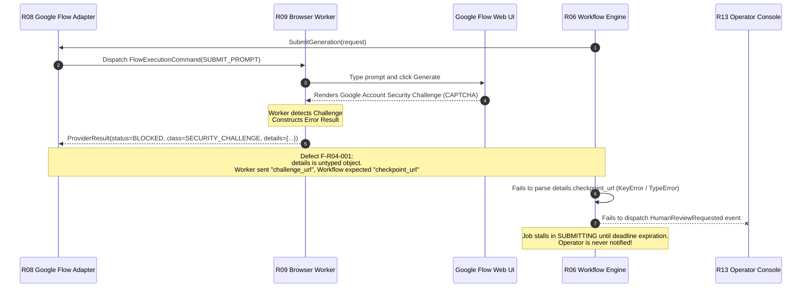
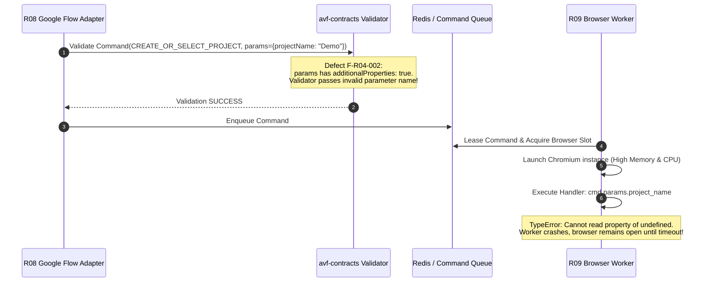

# C01 Independent Review — Role R04 (Contracts / API / Versioning Architect)

**Reviewer Role:** R04_CONTRACTS (Contracts / API / Versioning Architect)  
**Model:** Claude 3.5 Sonnet / Antigravity Agentic Reviewer  
**Review Round:** C01 Independent Blind Review  
**Timestamp:** 2026-08-15T11:30:00+07:00  
**Session ID:** `fde1714c-50f3-4cff-9156-96f173600f34`  
**Status:** COMPLETE / EVIDENCE-BACKED  

---

## 1. Executive Summary & Review Scope

As the **Contracts / API / Versioning Architect (R04)**, I have conducted an independent, blind architectural and structural review of the AI Video Factory blueprint specification. My primary lens evaluates:
- **Schema Completeness & Precision:** Ensuring all cross-boundary messages, commands, events, entities, and error envelopes possess strict, unambiguous JSON Schema definitions (Draft 2020-12).
- **Forward & Backward Compatibility:** Enforcing strict semantic versioning (`MAJOR.MINOR`), evolution rules, and preventing breaking schema changes across repositories.
- **Error Taxonomy & Detail Payloads:** Evaluating whether the 14 top-level error classes have typed, discriminated payloads to drive deterministic automated recovery.
- **Boundary Validation & Type Safety:** Eliminating untyped property bags (`additionalProperties: true`) at integration boundaries and specifying generated SDK expectations for Python and TypeScript.
- **Resolution of Assigned Gap Seeds:** Specifically addressing **GAP-001** (Error detail schemas) and **GAP-002** (Browser command method-specific param schemas).

### Summary of Major Conclusions:
1. **Critical Contract Omissions:** While the architecture mandates that `avf-contracts` (R01) is the foundational repository to freeze first, the current `02_contracts/` directory contains only partial, incomplete schemas. Approximately 80% of canonical domain entities (e.g., `Project`, `Scene`, `Shot`, `GenerationJob`, `Take`, `QCResult`, `Asset`), all 16 domain event payloads, and essential subsystem contracts (QC, Media, Browser Command Results) are completely missing.
2. **GAP-001 (Error Detail Schemas):** Confirmed as a **BLOCKER_BEFORE_FREEZE**. Top-level error classes are enumerated, but detail payloads are untyped `additionalProperties: true`. Discriminated error schemas are mandatory for automated retry, human intervention, and circuit breaker policies.
3. **GAP-002 (Browser Command Schemas):** Confirmed as a **BLOCKER_BEFORE_FREEZE**. `browser-command.schema.json` defines `params` as a generic object without method-level validation. Furthermore, `browser-command-result.schema.json` is entirely absent.
4. **Versioning Constraint Bug:** All schemas currently enforce `"schema_version": {"const": "1.0"}`. This violates `API_COMPATIBILITY_POLICY.md`, as any non-breaking minor version bump (e.g. `1.1`) will be rejected by v1.0 schema validators.

---

## 2. Enumeration of Assigned Specification Files Inspected

| File Path | Total Lines | Bytes | Inspection Scope & Primary Focus |
|---|---|---|---|
| `AI_VIDEO_FACTORY_BLUEPRINT_KIT_v0.9.0/02_contracts/CONTRACTS_OVERVIEW.md` | 62 | 1445 | Contract families, envelope layout, forward compatibility rules, error taxonomy |
| `AI_VIDEO_FACTORY_BLUEPRINT_KIT_v0.9.0/02_contracts/API_COMPATIBILITY_POLICY.md` | 25 | 830 | Versioning formats, breaking vs non-breaking definitions, consumer-driven testing |
| `AI_VIDEO_FACTORY_BLUEPRINT_KIT_v0.9.0/02_contracts/STATUS_STATE_MACHINES.md` | 53 | 1072 | State machine transitions, error states, and terminal conditions |
| `AI_VIDEO_FACTORY_BLUEPRINT_KIT_v0.9.0/02_contracts/browser-command.schema.json` | 69 | 1402 | FlowExecutionCommand schema, method enums, correlation context, params typing |
| `AI_VIDEO_FACTORY_BLUEPRINT_KIT_v0.9.0/02_contracts/domain-entities.schema.json` | 129 | 2686 | Domain entity definitions (`shotVersion`, `promptVersion`, `versionRef`) |
| `AI_VIDEO_FACTORY_BLUEPRINT_KIT_v0.9.0/02_contracts/event-envelope.schema.json` | 51 | 905 | Asynchronous event envelope structure, correlation headers, payload typing |
| `AI_VIDEO_FACTORY_BLUEPRINT_KIT_v0.9.0/02_contracts/provider-request.schema.json` | 125 | 2420 | VideoGenerationRequest schema, idempotency, capability enum, generation options |
| `AI_VIDEO_FACTORY_BLUEPRINT_KIT_v0.9.0/02_contracts/provider-result.schema.json` | 95 | 1764 | VideoGenerationResult schema, status enums, output structures, error payload |
| `AI_VIDEO_FACTORY_BLUEPRINT_KIT_v0.9.0/03_repo_blueprints/R01_CONTRACTS.md` | 136 | 3525 | Repository blueprint, ownership, non-goals, dependencies, test & CI gates |
| `AI_VIDEO_FACTORY_BLUEPRINT_KIT_v0.9.0/01_master/DATA_MODEL.md` | 126 | 3173 | Canonical entity definitions, relationships, and required entity base fields |
| `AI_VIDEO_FACTORY_BLUEPRINT_KIT_v0.9.0/01_master/SYSTEM_INVARIANTS.md` | 25 | 1902 | Normative system invariants (Invariants 1-20) |
| `AI_VIDEO_FACTORY_BLUEPRINT_KIT_v0.9.0/04_integration/COMMAND_EVENT_CATALOG.md` | 60 | 1779 | Core commands, domain events, outbox semantics, telemetry events |
| `review-session/C00_FINAL/CONTRACT_INVENTORY.md` | 13 | 6173 | Baseline contract registry, producer/consumer matrix, and gap traceability |
| `review-session/C00_FINAL/C00_GAP_TO_C01_SEED_REGISTER.md` | 15 | 5141 | Pre-seeded review gaps (GAP-001 through GAP-010) |

---

## 3. Normative System Invariants & Contracts Relevant to R04

The following system invariants and contract principles directly govern this review:
1. **Invariant 2 (Immutability of Version References):** A `GenerationJob` references immutable `ShotVersion` and `PromptVersion` identifiers.
2. **Invariant 3 (Idempotency of External Side Effects):** Every external side effect has an idempotency key or an explicit documented reason it cannot.
3. **Invariant 5 (Non-Canonical Operational State):** Browser/extension/FlowKit state is never canonical business state.
4. **Invariant 7 (Provider Isolation):** Google Flow-specific fields do not appear in core Shot/Project contracts unless represented as namespaced provider metadata.
5. **Invariant 13 (Boundary Encapsulation):** A repo cannot read another repo's private database schema directly; inter-repo communication must use released contracts.
6. **Invariant 14 (Boundary Validation):** Contract consumers must validate schema versions and payloads at boundaries.
7. **Invariant 15 (Correlation Propagation):** Correlation IDs (`trace_id`, `workflow_run_id`, `project_id`, `shot_id`, `generation_job_id`, `attempt_id`) must propagate across workflow, provider, browser execution, QC, and media processing.
8. **Invariant 20 (Execution Track Transparency):** Switching between Track A (Browser Worker) and Track B (FlowKit Bridge) does not change upstream generation contracts.

---

## 4. Deep Analysis of Assigned Gap Seeds

### 4.1 GAP-001: Error Detail Schemas Across the 14 Error Classes
- **Assessment:** Proven Blocker Defect.
- **Analysis:** `CONTRACTS_OVERVIEW.md` lists 14 top-level error classes (`VALIDATION_ERROR`, `CONFLICT`, `NOT_FOUND`, `TRANSIENT_TRANSPORT`, `TRANSIENT_BROWSER`, `PROVIDER_RATE_LIMIT`, `PROVIDER_REJECTED`, `AUTH_REQUIRED`, `SECURITY_CHALLENGE`, `UI_CHANGED`, `BUDGET_EXHAUSTED`, `QC_REJECTED`, `UNSUPPORTED_CAPABILITY`, `INTERNAL_ERROR`). However:
  1. `provider-result.schema.json` leaves `error.details` as an untyped object (`additionalProperties: true`).
  2. `error.class` in `provider-result.schema.json` is an unconstrained string rather than an enum referencing the 14 classes.
  3. No reusable `error-payload.schema.json` exists for commands, HTTP responses, or event payloads.
  4. Crucial error recovery workflows (e.g. Temporal retry policies in R06, human intervention routing in R13, quota backoff in R08) cannot function reliably without typed detail payloads. For example:
     - `PROVIDER_RATE_LIMIT` must specify `retry_after_seconds` (numeric) and `reset_at` (timestamp).
     - `SECURITY_CHALLENGE` must specify `challenge_type` (`CAPTCHA`, `2FA`, `DEVICE_VERIFICATION`), `checkpoint_url`, and `screenshot_artifact_id`.
     - `UI_CHANGED` must specify `step_name`, `expected_landmark_or_selector`, `dom_snapshot_uri`, and `screenshot_uri`.
     - `QC_REJECTED` must specify `qc_result_id`, `score`, `threshold`, and `failed_criteria` list.
     - `VALIDATION_ERROR` must specify structured `field_violations` (`path`, `constraint`, `message`).
- **Resolution:** Deliver a centralized, discriminated `error-payload.schema.json` in `avf-contracts` with typed schemas for all 14 error classes.

### 4.2 GAP-002: Browser Command Method-Specific Parameter Schemas & Result Schemas
- **Assessment:** Proven Blocker Defect.
- **Analysis:** In `browser-command.schema.json`, `method` is an enum of 10 commands (`ENSURE_SESSION`, `OPEN_FLOW`, `CREATE_OR_SELECT_PROJECT`, `ATTACH_ASSETS`, `SET_GENERATION_OPTIONS`, `SUBMIT_PROMPT`, `READ_GENERATION_STATE`, `DOWNLOAD_OUTPUT`, `CAPTURE_DIAGNOSTIC`, `CANCEL`). However, `params` is declared as:
  ```json
  "params": {
    "type": "object",
    "additionalProperties": true
  }
  ```
  This is a critical flaw:
  1. If an adapter passes `{ "prompt": "..." }` instead of `{ "prompt_text": "..." }` or forgets required asset file paths in `ATTACH_ASSETS`, schema validation passes. The browser worker only fails deep inside Playwright/Puppeteer execution after leasing worker threads and launching browsers.
  2. There is no `browser-command-result.schema.json` defining the execution result envelope, typed outputs per method (e.g., generation progress percentage, output file paths, diagnostic artifact URIs), and execution timings.
- **Resolution:** Refactor `browser-command.schema.json` into a discriminated `oneOf` union binding each method to its exact parameter schema, and create `browser-command-result.schema.json`.

---

## 5. Comprehensive Council Findings

### Finding F-R04-001: Missing Discriminated Error Detail Schemas (GAP-001)

```text
FINDING_ID: F-R04-001
ROLE: R04_CONTRACTS
SEVERITY: BLOCKER_BEFORE_FREEZE
CATEGORY: ERROR_TAXONOMY / SCHEMA_COMPLETENESS
AFFECTED_FILES:
  - AI_VIDEO_FACTORY_BLUEPRINT_KIT_v0.9.0/02_contracts/CONTRACTS_OVERVIEW.md
  - AI_VIDEO_FACTORY_BLUEPRINT_KIT_v0.9.0/02_contracts/provider-result.schema.json
AFFECTED_CONTRACTS:
  - CONTRACTS_OVERVIEW
  - provider-result
  - error-payload (missing)
EVIDENCE:
  CONTRACTS_OVERVIEW.md lines 44-61 enumerates 14 error classes, but provider-result.schema.json lines 64-87 defines:
  "error": {
    "type": ["object", "null"],
    "properties": {
      "class": { "type": "string" },
      "code": { "type": "string" },
      "message": { "type": "string" },
      "retryable": { "type": "boolean" },
      "details": { "type": "object" }
    },
    "additionalProperties": true
  }
  "class" is not enum-constrained to the 14 canonical error classes, and "details" has no typed structure or schema validation.
FAILURE_SCENARIO:
  During a generation job, Google Flow triggers an account CAPTCHA challenge. R09 (Browser Worker) returns a provider result with status "BLOCKED" and class "SECURITY_CHALLENGE". Because "details" is unstructured, the worker outputs `{ "checkpoint_url": "https://accounts.google.com/...", "screenshot_ref": "uuid" }`. However, R06 (Workflow) expects `{ "url": "...", "image_id": "..." }`. The Temporal workflow fails to parse the checkpoint URL, cannot post a structured escalation event to R13 (Operator Console), and either enters an infinite retry loop or crashes with a null-dereference error.
WHY_IT_MATTERS:
  Automated recovery, intelligent backoff, operator alerting, and budget guards depend entirely on deterministic error interpretation. Unstructured error bags cause silent recovery failures, unhandled exceptions, and orphaned workflow executions.
PROPOSED_SOLUTION:
  1. Create a dedicated schema `02_contracts/error-payload.schema.json` with an enum of the 14 error classes.
  2. Define specific, typed detail definitions for each error class (e.g. `RateLimitDetails`, `SecurityChallengeDetails`, `UiChangedDetails`, `ValidationDetails`, `BudgetDetails`, `QcDetails`).
  3. Use a discriminated `oneOf` or `$defs` in `error-payload.schema.json` and reference it in `provider-result.schema.json`, `browser-command-result.schema.json`, and all command/event failure payloads.
ALTERNATIVES_CONSIDERED:
  - Rely on runtime documentation and let each adapter invent its own detail keys: Rejected because it breaks cross-repository interoperability and causes fragile string/key parsing.
  - Flatten all error fields into top-level error object: Rejected because different error types require distinct properties, leading to sparse objects with 40+ optional fields.
CAPABILITY_IMPACT:
  Protects C-12 (Normalized Provider & Browser Error Taxonomy), C-09 (Session Resilience & DOM Mutation Recovery), C-14 (Operator Control Room & Manual Interventions).
COMPATIBILITY_IMPACT:
  Non-breaking if introduced in v1.0 before repo freeze. Establishes the normative v1 error taxonomy.
MIGRATION_IMPACT:
  Requires R06, R07, R08, R09, R10, R11, R13 to use generated error models from `avf-contracts`.
TEST_OR_BENCHMARK_REQUIRED:
  JSON schema validation tests for golden error payloads across all 14 error classes. Round-trip serialization tests in Python (Pydantic) and TypeScript (Zod).
RESIDUAL_RISK:
  Provider-specific novel errors may require an extensible escape hatch; addressed by providing a typed `provider_raw_details` dictionary within `details`.
CONFIDENCE: 98% - High
```

---

### Finding F-R04-002: Untyped Browser Command Parameters and Missing Browser Command Result Schema (GAP-002)

```text
FINDING_ID: F-R04-002
ROLE: R04_CONTRACTS
SEVERITY: BLOCKER_BEFORE_FREEZE
CATEGORY: CONTRACT_COMPLETENESS / BOUNDARY_VALIDATION
AFFECTED_FILES:
  - AI_VIDEO_FACTORY_BLUEPRINT_KIT_v0.9.0/02_contracts/browser-command.schema.json
  - AI_VIDEO_FACTORY_BLUEPRINT_KIT_v0.9.0/03_repo_blueprints/R09_BROWSER_WORKER.md
  - AI_VIDEO_FACTORY_BLUEPRINT_KIT_v0.9.0/03_repo_blueprints/R10_FLOWKIT_BRIDGE.md
AFFECTED_CONTRACTS:
  - browser-command
  - browser-command-result (missing)
EVIDENCE:
  1. browser-command.schema.json lines 36-39 defines "params": { "type": "object", "additionalProperties": true }.
  2. 02_contracts/ contains no browser-command-result.schema.json, despite STATUS_STATE_MACHINES.md specifying the browser execution lifecycle (QUEUED -> LEASED -> RUNNING -> SUCCEEDED | FAILED_RETRYABLE | FAILED_TERMINAL | HUMAN_REQUIRED | CANCELLED).
FAILURE_SCENARIO:
  R08 (Google Flow Adapter) issues a `CREATE_OR_SELECT_PROJECT` command to Track A (R09 Browser Worker) but omits the `project_name` property due to a client-side key typo (`projectName` vs `project_name`). Because `params` allows arbitrary keys, schema validation passes. The worker leases a browser instance, navigates to Google Flow, and crashes when evaluating DOM selectors with `undefined` project name. The lease is held until timeout, delaying the pipeline by 5 minutes and wasting compute.
WHY_IT_MATTERS:
  Boundary validation is the first line of defense in distributed architectures. Allowing untyped command parameters pushes defect discovery into live browser sessions, which are slow, stateful, expensive, and fragile. Furthermore, lack of a typed result schema prevents deterministic command outcome handling.
PROPOSED_SOLUTION:
  1. Refactor `browser-command.schema.json` using `oneOf` to bind each `method` (`ENSURE_SESSION`, `OPEN_FLOW`, `CREATE_OR_SELECT_PROJECT`, `ATTACH_ASSETS`, `SET_GENERATION_OPTIONS`, `SUBMIT_PROMPT`, `READ_GENERATION_STATE`, `DOWNLOAD_OUTPUT`, `CAPTURE_DIAGNOSTIC`, `CANCEL`) to an exact parameter definition with `additionalProperties: false`.
  2. Create `02_contracts/browser-command-result.schema.json` defining execution status, method-specific return data (e.g. generation progress, download artifact path, diagnostic screenshot URI), duration, and error payload reference.
ALTERNATIVES_CONSIDERED:
  - Use generic JSON-RPC style `params: Record<string, any>`: Rejected because it abandons schema validation at the most fragile subsystem boundary in the entire platform.
CAPABILITY_IMPACT:
  Protects C-05 (Track A Independent Browser Automation Engine), C-06 (Track B FlowKit Bridge Integration), C-09 (Session Resilience).
COMPATIBILITY_IMPACT:
  Major improvement in type safety. Downstream workers (R09, R10) and adapters (R08) code against strict interfaces.
MIGRATION_IMPACT:
  R08, R09, and R10 must align their internal command handler signatures to the exact schema property names.
TEST_OR_BENCHMARK_REQUIRED:
  Negative schema validation tests verifying that omitting required method parameters or passing unknown keys triggers immediate validation rejection.
RESIDUAL_RISK:
  Changes in Google Flow DOM workflows might require new parameters; handled via standard minor schema updates.
CONFIDENCE: 99% - High
```

---

### Finding F-R04-003: Incomplete Domain Entities Schema (Missing 80% of Canonical Data Model)

```text
FINDING_ID: F-R04-003
ROLE: R04_CONTRACTS
SEVERITY: BLOCKER_BEFORE_FREEZE
CATEGORY: SCHEMA_COMPLETENESS / DATA_MODEL_ALIGNMENT
AFFECTED_FILES:
  - AI_VIDEO_FACTORY_BLUEPRINT_KIT_v0.9.0/02_contracts/domain-entities.schema.json
  - AI_VIDEO_FACTORY_BLUEPRINT_KIT_v0.9.0/01_master/DATA_MODEL.md
  - AI_VIDEO_FACTORY_BLUEPRINT_KIT_v0.9.0/03_repo_blueprints/R01_CONTRACTS.md
AFFECTED_CONTRACTS:
  - domain-entities
EVIDENCE:
  `domain-entities.schema.json` only contains `$defs` for `versionRef`, `shotVersion`, and `promptVersion`.
  Normative entities explicitly detailed in `01_master/DATA_MODEL.md` (lines 8-126) and `SYSTEM_INVARIANTS.md`—including `Project`, `Scene`, `Shot`, `Character`, `CharacterVersion`, `StyleProfile`, `StyleVersion`, `GenerationJob`, `Take`, `QCResult`, `Asset`, `AssetVersion`, `WorkflowRun`, and `CostUsageRecord`—have no schema definitions in `02_contracts/`.
FAILURE_SCENARIO:
  Developer A implementing `R02_CORE_STATE` creates a Python model for `Take` with fields `{"take_id", "generation_job_id", "media_url", "checksum_sha256"}`. Developer B implementing `R06_WORKFLOW` creates a TypeScript interface for `Take` with fields `{"id", "job_id", "uri", "checksum"}`. When `R06` calls the Core State API to register a completed take, payload unmarshaling fails with a 422 Unprocessable Entity, halting end-to-end video pipeline integration.
WHY_IT_MATTERS:
  `R01_CONTRACTS.md` line 45 states: "All exchanged payloads MUST use released avf-contracts schemas. Internal implementation types cannot escape the repository boundary." If the schemas do not exist, developers in R02, R03, R04, R06, R11, R12, and R13 are forced to invent ad-hoc types, defeating the entire contract-first architecture.
PROPOSED_SOLUTION:
  Expand `02_contracts/domain-entities.schema.json` (or split into modular schemas under `02_contracts/domain/`) to define complete JSON schemas for all 14 canonical domain entities and value objects as defined in `01_master/DATA_MODEL.md`.
ALTERNATIVES_CONSIDERED:
  - Allow each repository to define its own domain models: Rejected; directly violates Invariant 13 and R01 repository blueprint charter.
CAPABILITY_IMPACT:
  Protects C-01 (Multi-Shot Continuity Engine), C-02 (Hierarchical Project/Scene/Shot/Take Entity Graph), C-03 (Versioned Prompt Compilation), C-16 (Deterministic Multi-Stage Technical QC Pipeline).
COMPATIBILITY_IMPACT:
  Foundational; must be frozen in v1.0.0.
MIGRATION_IMPACT:
  Downstream repositories import generated models directly from `@avf/contracts` and `avf-contracts` Python library.
TEST_OR_BENCHMARK_REQUIRED:
  Round-trip serialization tests for all domain entity fixtures across Python (Pydantic v2) and TypeScript (Zod/TypeBox).
RESIDUAL_RISK:
  None. Standard DDD contract-first practice.
CONFIDENCE: 98% - High
```

---

### Finding F-R04-004: Missing Concrete Domain Event Payloads and Registry

```text
FINDING_ID: F-R04-004
ROLE: R04_CONTRACTS
SEVERITY: BLOCKER_BEFORE_FREEZE
CATEGORY: EVENT_CONTRACTS / ASYNC_COMMUNICATION
AFFECTED_FILES:
  - AI_VIDEO_FACTORY_BLUEPRINT_KIT_v0.9.0/02_contracts/event-envelope.schema.json
  - AI_VIDEO_FACTORY_BLUEPRINT_KIT_v0.9.0/04_integration/COMMAND_EVENT_CATALOG.md
AFFECTED_CONTRACTS:
  - event-envelope
  - domain-events (missing)
EVIDENCE:
  `event-envelope.schema.json` lines 41-47 defines `"type": { "type": "string" }` and `"payload": { "type": "object", "additionalProperties": true }`.
  `COMMAND_EVENT_CATALOG.md` lines 23-41 enumerates 16 domain events (`ProjectCreated`, `ShotVersionCreated`, `PromptCompiled`, `GenerationJobCreated`, `GenerationSubmissionAcknowledged`, `GenerationStarted`, `GenerationCompleted`, `TakeRegistered`, `QCCompleted`, `TakeApproved`, `TakeRejected`, `GenerationBlocked`, `HumanReviewRequested`, `WorkflowResumed`, `AssetIngested`, `AssetUsageRecorded`), but zero event payload schemas exist.
FAILURE_SCENARIO:
  `R08_GOOGLE_FLOW_ADAPTER` publishes a `GenerationBlocked` event when authentication expires. It includes `{ "reason": "auth", "account": "user@gmail.com" }`. `R06_WORKFLOW` consumes the event but expects `{ "error_class": "AUTH_REQUIRED", "details": { "account_alias": "user@gmail.com" } }`. Because there is no contract schema validating event payloads, the event dispatcher publishes the event successfully, but the workflow consumer silently ignores or drops the event, leaving the generation job permanently stalled.
WHY_IT_MATTERS:
  Asynchronous event-driven communication without typed payload contracts creates invisible integration bugs where events are published and consumed without error, but business state fails to advance.
PROPOSED_SOLUTION:
  1. Add a `domain-events.schema.json` (or include `$defs` in `event-envelope.schema.json`) defining the explicit payload schema for each of the 16 domain events.
  2. Constrain `type` to the enum of recognized domain event names.
  3. Validate event payloads using the discriminator on `type`.
ALTERNATIVES_CONSIDERED:
  - Keep payload untyped in envelope and validate manually in consumers: Rejected; eliminates contract enforcement and allows schema drift.
CAPABILITY_IMPACT:
  Protects C-04 (Multi-Provider Video Generation Abstraction), C-14 (Operator Control Room), C-17 (Asynchronous Event-Driven Orchestration).
COMPATIBILITY_IMPACT:
  Non-breaking if introduced prior to v1.0 freeze.
MIGRATION_IMPACT:
  Event producers (R02, R06, R08, R11, R12) and consumers (R06, R13, R14) must import generated event payload types.
TEST_OR_BENCHMARK_REQUIRED:
  Golden event payload fixture suite verifying every domain event validates against the envelope schema and discriminated payload schema.
RESIDUAL_RISK:
  Addition of future events requires minor version schema bumps.
CONFIDENCE: 96% - High
```

---

### Finding F-R04-005: Schema Versioning Constraint Flaw in `const: "1.0"` vs SemVer Evolution Policy

```text
FINDING_ID: F-R04-005
ROLE: R04_CONTRACTS
SEVERITY: MAJOR
CATEGORY: API_COMPATIBILITY / VERSIONING
AFFECTED_FILES:
  - AI_VIDEO_FACTORY_BLUEPRINT_KIT_v0.9.0/02_contracts/browser-command.schema.json
  - AI_VIDEO_FACTORY_BLUEPRINT_KIT_v0.9.0/02_contracts/event-envelope.schema.json
  - AI_VIDEO_FACTORY_BLUEPRINT_KIT_v0.9.0/02_contracts/provider-request.schema.json
  - AI_VIDEO_FACTORY_BLUEPRINT_KIT_v0.9.0/02_contracts/provider-result.schema.json
  - AI_VIDEO_FACTORY_BLUEPRINT_KIT_v0.9.0/02_contracts/API_COMPATIBILITY_POLICY.md
AFFECTED_CONTRACTS:
  - ALL schemas
EVIDENCE:
  All current schemas declare `"schema_version": { "const": "1.0" }`.
  `API_COMPATIBILITY_POLICY.md` lines 3-21 specifies: "MAJOR.MINOR at message/schema level... Non-breaking examples: optional metadata fields; additional diagnostics... Consumers ignore unknown optional fields; reject unknown major versions."
FAILURE_SCENARIO:
  A non-breaking minor update is made to `provider-request.schema.json` (e.g. adding an optional `seed` parameter) and the schema version is bumped to `1.1`. A v1.1 producer sends a request to a service that has not yet updated its schema validator package (running v1.0). Even though the payload is completely backward compatible, the v1.0 validator immediately rejects the payload because `"1.1"` fails `"const": "1.0"`.
WHY_IT_MATTERS:
  Hardcoded `const: "1.0"` completely breaks minor version forward compatibility, forcing synchronized zero-downtime lockstep deployments across all 15 microservices for even the smallest non-breaking schema addition.
PROPOSED_SOLUTION:
  Change `"schema_version"` in all v1 schemas from `"const": "1.0"` to:
  ```json
  "schema_version": {
    "type": "string",
    "pattern": "^1\\.[0-9]+$"
  }
  ```
  This permits any backward-compatible `1.x` payload while strictly rejecting breaking major version increments (e.g. `2.0`).
ALTERNATIVES_CONSIDERED:
  - Remove `schema_version` validation entirely from JSON Schema: Rejected; version checking at boundaries is mandated by Invariant 14.
CAPABILITY_IMPACT:
  Protects C-19 (Independent Service Deployability & Schema Compatibility).
COMPATIBILITY_IMPACT:
  Enables true `MAJOR.MINOR` semantic versioning as specified in the compatibility policy.
MIGRATION_IMPACT:
  Update all schema definitions in `02_contracts/`.
TEST_OR_BENCHMARK_REQUIRED:
  Compatibility test verifying that a v1.0 consumer validator accepts a v1.1 payload containing new optional fields.
RESIDUAL_RISK:
  None. Standard JSON Schema semver validation pattern.
CONFIDENCE: 99% - High
```

---

### Finding F-R04-006: Incomplete Correlation Context in Provider Request and Browser Command Schemas

```text
FINDING_ID: F-R04-006
ROLE: R04_CONTRACTS
SEVERITY: MAJOR
CATEGORY: OBSERVABILITY / TRACEABILITY
AFFECTED_FILES:
  - AI_VIDEO_FACTORY_BLUEPRINT_KIT_v0.9.0/02_contracts/provider-request.schema.json
  - AI_VIDEO_FACTORY_BLUEPRINT_KIT_v0.9.0/02_contracts/browser-command.schema.json
  - AI_VIDEO_FACTORY_BLUEPRINT_KIT_v0.9.0/02_contracts/event-envelope.schema.json
  - AI_VIDEO_FACTORY_BLUEPRINT_KIT_v0.9.0/01_master/SYSTEM_INVARIANTS.md
  - AI_VIDEO_FACTORY_BLUEPRINT_KIT_v0.9.0/03_repo_blueprints/R01_CONTRACTS.md
AFFECTED_CONTRACTS:
  - provider-request
  - browser-command
  - event-envelope
EVIDENCE:
  1. `SYSTEM_INVARIANTS.md` Invariant 15 states: "Correlation IDs must propagate across workflow, provider, browser execution, QC, and media processing: trace_id, workflow_run_id, project_id, shot_id, generation_job_id, attempt_id."
  2. `provider-request.schema.json` lines 106-121 only includes `trace_id` and `workflow_run_id` in `correlation` (omitting `shot_id` and `generation_job_id`).
  3. `browser-command.schema.json` lines 44-65 only includes `trace_id`, `generation_job_id`, and `attempt_id` (omitting `workflow_run_id`, `project_id`, `shot_id`).
  4. `event-envelope.schema.json` lines 26-40 puts `trace_id`, `workflow_run_id`, `project_id` at root, omitting `shot_id`, `generation_job_id`, and `attempt_id`.
FAILURE_SCENARIO:
  A generation job fails during browser automation. An engineer opens OpenTelemetry / Jaeger in R14 to trace the failure starting from the `shot_id`. Because `shot_id` was dropped from `browser-command.schema.json` and `attempt_id` was dropped from `provider-request.schema.json`, the trace query returns disconnected spans. Root cause analysis requires manual cross-database SQL querying instead of instant distributed trace inspection.
WHY_IT_MATTERS:
  Breaks Invariant 15 and severely degrades production debuggability, SLA monitoring, and automated incident triage.
PROPOSED_SOLUTION:
  Define a canonical `correlation-context.schema.json` (or reusable `$defs/correlationContext`) containing all 6 canonical correlation fields:
  ```json
  {
    "type": "object",
    "required": ["trace_id", "project_id"],
    "properties": {
      "trace_id": { "type": "string" },
      "workflow_run_id": { "type": ["string", "null"], "format": "uuid" },
      "project_id": { "type": "string", "format": "uuid" },
      "shot_id": { "type": ["string", "null"], "format": "uuid" },
      "generation_job_id": { "type": ["string", "null"], "format": "uuid" },
      "attempt_id": { "type": ["string", "null"] }
    },
    "additionalProperties": false
  }
  ```
  Embed this exact schema uniformly across provider requests, browser commands, event envelopes, and QC/media requests.
ALTERNATIVES_CONSIDERED:
  - Rely on HTTP headers / OpenTelemetry baggage only: Rejected because messaging boundaries (outbox events, browser queues, files) strip HTTP headers unless explicitly preserved in payload contracts.
CAPABILITY_IMPACT:
  Protects C-13 (End-to-End Distributed Tracing & Auditability).
COMPATIBILITY_IMPACT:
  Non-breaking if introduced in v1.0.
MIGRATION_IMPACT:
  Harmonizes correlation logging across all 15 repositories.
TEST_OR_BENCHMARK_REQUIRED:
  Trace propagation test verifying all 6 IDs survive full pipeline transit (Core -> Workflow -> Adapter -> Worker -> QC -> Event).
RESIDUAL_RISK:
  None.
CONFIDENCE: 98% - High
```

---

### Finding F-R04-007: Missing Subsystem Contract Schemas for QC and Media Repositories

```text
FINDING_ID: F-R04-007
ROLE: R04_CONTRACTS
SEVERITY: MAJOR
CATEGORY: CONTRACT_COMPLETENESS
AFFECTED_FILES:
  - AI_VIDEO_FACTORY_BLUEPRINT_KIT_v0.9.0/02_contracts/CONTRACTS_OVERVIEW.md
  - AI_VIDEO_FACTORY_BLUEPRINT_KIT_v0.9.0/03_repo_blueprints/R11_QC.md
  - AI_VIDEO_FACTORY_BLUEPRINT_KIT_v0.9.0/03_repo_blueprints/R12_MEDIA.md
AFFECTED_CONTRACTS:
  - qc-evaluator (missing)
  - media-processing (missing)
EVIDENCE:
  `CONTRACTS_OVERVIEW.md` lists 8 contract families but does not define schemas for technical QC evaluations (R11) or media processing jobs (R12). `R11_QC.md` and `R12_MEDIA.md` specify distinct public interfaces (`EvaluateTake`, `ProcessMediaJob`), but there are no JSON schemas in `02_contracts/`.
FAILURE_SCENARIO:
  `R11_QC` evaluates a video take and outputs a score breakdown (`black_frames_percentage`, `motion_freeze_duration`, `audio_loudness_lufs`, `passed_thresholds`). Because there is no contract schema in `avf-contracts`, `R06_WORKFLOW` and `R02_CORE_STATE` parse QC output ad-hoc. A change in QC metric naming silently breaks the automated pass/fail gate in the workflow engine.
WHY_IT_MATTERS:
  Without contract schemas for QC and media processing, integration tests cannot validate payload compatibility between R06, R11, and R12, leading to integration failures during video rendering and QC scoring.
PROPOSED_SOLUTION:
  Publish `qc-evaluator.schema.json` and `media-processing.schema.json` in `02_contracts/` covering:
  - `QCEvaluationRequest` / `QCEvaluationResult` (metric scorecards, frame sampling, pass/fail status).
  - `MediaJobRequest` / `MediaJobResult` (transcoding, stitching, audio mixing, probe metadata).
ALTERNATIVES_CONSIDERED:
  - Leave QC and Media internal to their respective repositories: Rejected because they are invoked directly by the workflow engine (R06) and produce canonical artifacts stored in Core State (R02).
CAPABILITY_IMPACT:
  Protects C-16 (Deterministic Multi-Stage Technical QC Pipeline) and C-18 (Automated Assembly & Media Stitching).
COMPATIBILITY_IMPACT:
  Ensures clean API interfaces before Phase 5 implementation.
MIGRATION_IMPACT:
  R06, R11, and R12 consume official generated models.
TEST_OR_BENCHMARK_REQUIRED:
  Contract test suite for QC evaluation results and media processing job requests.
RESIDUAL_RISK:
  None.
CONFIDENCE: 95% - High
```

---

### Finding F-R04-008: Closed Enums and Unstructured Generation Options Impeding Extensibility

```text
FINDING_ID: F-R04-008
ROLE: R04_CONTRACTS
SEVERITY: MINOR
CATEGORY: API_COMPATIBILITY / EXTENSIBILITY
AFFECTED_FILES:
  - AI_VIDEO_FACTORY_BLUEPRINT_KIT_v0.9.0/02_contracts/provider-request.schema.json
  - AI_VIDEO_FACTORY_BLUEPRINT_KIT_v0.9.0/02_contracts/CONTRACTS_OVERVIEW.md
AFFECTED_CONTRACTS:
  - provider-request
EVIDENCE:
  1. `provider-request.schema.json` line 47 defines `"capability"` as a closed enum `["text_to_video", "image_to_video", "frames_to_video", "reference_to_video", "image_generation"]`.
  2. `CONTRACTS_OVERVIEW.md` line 39 states: "Enum growth is permitted only for fields explicitly marked extensible; otherwise use string codes and documented fallback."
  3. `provider-request.schema.json` line 83 defines `"generation_options": { "type": "object", "additionalProperties": true }` with no structured core properties.
FAILURE_SCENARIO:
  A new provider capability `video_to_video` or `inpaint_video` is added in Phase 2. Existing v1.0 consumers running strict schema validation fail because `video_to_video` is not in the hardcoded enum list, requiring a major/minor schema release across all services even though the provider adapter could have gracefully reported unsupported capability.
WHY_IT_MATTERS:
  Closed enums in generation requests create unnecessary deployment friction when expanding provider support. Conversely, completely unstructured `generation_options` permits invalid parameters (e.g. invalid aspect ratio strings) to pass boundary validation.
PROPOSED_SOLUTION:
  1. Structure `generation_options` into a normalized standard options schema (`aspect_ratio`, `duration_seconds`, `fps`, `seed`, `camera_motion`, `resolution`) with a namespaced `provider_specific` object for custom options.
  2. Allow `capability` to validate against standard known capabilities while permitting extensible string formats (`^[a-z0-9_]+$`) with a documented unsupported capability fallback error.
ALTERNATIVES_CONSIDERED:
  - Keep `generation_options` completely freeform: Rejected because common video generation options should be standardized across all adapters.
CAPABILITY_IMPACT:
  Protects C-04 (Multi-Provider Video Generation Abstraction).
COMPATIBILITY_IMPACT:
  Improves forward compatibility for new provider integrations.
MIGRATION_IMPACT:
  Update `provider-request.schema.json`.
TEST_OR_BENCHMARK_REQUIRED:
  Validation tests with both standard and custom provider options.
RESIDUAL_RISK:
  None.
CONFIDENCE: 92% - High
```

---

## 6. Concrete Failure Scenarios

### Scenario 1: Google Flow Security Challenge Escalation Breakdown


### Scenario 2: Browser Command Parameter Typos Leading to Wasted Leases


---

## 7. Concrete Target Schema Proposals (Specification Deliverables)

To resolve **GAP-001**, **GAP-002**, **F-R04-001**, **F-R04-002**, **F-R04-003**, and **F-R04-005**, I propose the following exact JSON Schema definitions for inclusion in `02_contracts/`.

### 7.1 Proposed `02_contracts/error-payload.schema.json` (Resolving GAP-001 & F-R04-001)

```json
{
  "$schema": "https://json-schema.org/draft/2020-12/schema",
  "$id": "https://avf.local/contracts/error-payload/1.0",
  "title": "NormalizedErrorPayload",
  "type": "object",
  "required": [
    "class",
    "code",
    "message",
    "retryable",
    "details"
  ],
  "properties": {
    "class": {
      "type": "string",
      "enum": [
        "VALIDATION_ERROR",
        "CONFLICT",
        "NOT_FOUND",
        "TRANSIENT_TRANSPORT",
        "TRANSIENT_BROWSER",
        "PROVIDER_RATE_LIMIT",
        "PROVIDER_REJECTED",
        "AUTH_REQUIRED",
        "SECURITY_CHALLENGE",
        "UI_CHANGED",
        "BUDGET_EXHAUSTED",
        "QC_REJECTED",
        "UNSUPPORTED_CAPABILITY",
        "INTERNAL_ERROR"
      ]
    },
    "code": {
      "type": "string",
      "pattern": "^[A-Z0-9_]+$"
    },
    "message": {
      "type": "string",
      "minLength": 1
    },
    "retryable": {
      "type": "boolean"
    },
    "details": {
      "type": "object",
      "oneOf": [
        { "$ref": "#/$defs/rateLimitDetails" },
        { "$ref": "#/$defs/securityChallengeDetails" },
        { "$ref": "#/$defs/authRequiredDetails" },
        { "$ref": "#/$defs/uiChangedDetails" },
        { "$ref": "#/$defs/validationDetails" },
        { "$ref": "#/$defs/budgetDetails" },
        { "$ref": "#/$defs/qcRejectedDetails" },
        { "$ref": "#/$defs/genericDetails" }
      ]
    },
    "occurred_at": {
      "type": "string",
      "format": "date-time"
    },
    "correlation": {
      "type": "object",
      "properties": {
        "trace_id": { "type": "string" },
        "generation_job_id": { "type": ["string", "null"], "format": "uuid" },
        "attempt_id": { "type": ["string", "null"] }
      }
    }
  },
  "additionalProperties": false,
  "$defs": {
    "rateLimitDetails": {
      "type": "object",
      "required": ["retry_after_seconds"],
      "properties": {
        "retry_after_seconds": { "type": "number", "minimum": 0 },
        "reset_at": { "type": ["string", "null"], "format": "date-time" },
        "quota_tier": { "type": ["string", "null"] },
        "provider_raw_details": { "type": "object" }
      },
      "additionalProperties": false
    },
    "securityChallengeDetails": {
      "type": "object",
      "required": ["challenge_type"],
      "properties": {
        "challenge_type": {
          "type": "string",
          "enum": ["CAPTCHA", "TWO_FACTOR", "DEVICE_VERIFICATION", "SUSPICIOUS_ACTIVITY", "UNKNOWN"]
        },
        "checkpoint_url": { "type": ["string", "null"] },
        "screenshot_artifact_id": { "type": ["string", "null"], "format": "uuid" },
        "operator_action_required": { "type": "string" },
        "provider_raw_details": { "type": "object" }
      },
      "additionalProperties": false
    },
    "authRequiredDetails": {
      "type": "object",
      "required": ["account_alias"],
      "properties": {
        "account_alias": { "type": "string" },
        "session_expired_at": { "type": ["string", "null"], "format": "date-time" },
        "login_url_detected": { "type": ["string", "null"] },
        "provider_raw_details": { "type": "object" }
      },
      "additionalProperties": false
    },
    "uiChangedDetails": {
      "type": "object",
      "required": ["step_name", "expected_selector_or_landmark"],
      "properties": {
        "step_name": { "type": "string" },
        "expected_selector_or_landmark": { "type": "string" },
        "dom_snapshot_uri": { "type": ["string", "null"] },
        "screenshot_artifact_id": { "type": ["string", "null"], "format": "uuid" },
        "mismatch_summary": { "type": "string" }
      },
      "additionalProperties": false
    },
    "validationDetails": {
      "type": "object",
      "required": ["field_violations"],
      "properties": {
        "field_violations": {
          "type": "array",
          "items": {
            "type": "object",
            "required": ["path", "constraint", "message"],
            "properties": {
              "path": { "type": "string" },
              "constraint": { "type": "string" },
              "message": { "type": "string" }
            },
            "additionalProperties": false
          }
        }
      },
      "additionalProperties": false
    },
    "budgetDetails": {
      "type": "object",
      "required": ["requested_cost", "remaining_budget"],
      "properties": {
        "requested_cost": { "type": "number" },
        "remaining_budget": { "type": "number" },
        "currency_or_credits": { "type": "string" },
        "budget_entity_id": { "type": "string", "format": "uuid" }
      },
      "additionalProperties": false
    },
    "qcRejectedDetails": {
      "type": "object",
      "required": ["qc_result_id", "overall_score", "failed_criteria"],
      "properties": {
        "qc_result_id": { "type": "string", "format": "uuid" },
        "overall_score": { "type": "number", "minimum": 0, "maximum": 1 },
        "threshold": { "type": "number", "minimum": 0, "maximum": 1 },
        "failed_criteria": {
          "type": "array",
          "items": { "type": "string" }
        }
      },
      "additionalProperties": false
    },
    "genericDetails": {
      "type": "object",
      "properties": {
        "reason": { "type": "string" },
        "provider_raw_details": { "type": "object" }
      },
      "additionalProperties": true
    }
  }
}
```

---

### 7.2 Proposed `02_contracts/browser-command.schema.json` (Resolving GAP-002 & F-R04-002)

```json
{
  "$schema": "https://json-schema.org/draft/2020-12/schema",
  "$id": "https://avf.local/contracts/browser-command/1.0",
  "title": "FlowExecutionCommand",
  "type": "object",
  "required": [
    "schema_version",
    "command_id",
    "method",
    "params",
    "deadline_at",
    "correlation"
  ],
  "properties": {
    "schema_version": {
      "type": "string",
      "pattern": "^1\\.[0-9]+$"
    },
    "command_id": {
      "type": "string",
      "format": "uuid"
    },
    "method": {
      "type": "string",
      "enum": [
        "ENSURE_SESSION",
        "OPEN_FLOW",
        "CREATE_OR_SELECT_PROJECT",
        "ATTACH_ASSETS",
        "SET_GENERATION_OPTIONS",
        "SUBMIT_PROMPT",
        "READ_GENERATION_STATE",
        "DOWNLOAD_OUTPUT",
        "CAPTURE_DIAGNOSTIC",
        "CANCEL"
      ]
    },
    "params": {
      "type": "object"
    },
    "deadline_at": {
      "type": "string",
      "format": "date-time"
    },
    "correlation": {
      "type": "object",
      "required": [
        "trace_id",
        "project_id",
        "generation_job_id"
      ],
      "properties": {
        "trace_id": { "type": "string" },
        "workflow_run_id": { "type": ["string", "null"], "format": "uuid" },
        "project_id": { "type": "string", "format": "uuid" },
        "shot_id": { "type": ["string", "null"], "format": "uuid" },
        "generation_job_id": { "type": "string", "format": "uuid" },
        "attempt_id": { "type": ["string", "null"] }
      },
      "additionalProperties": false
    }
  },
  "allOf": [
    {
      "if": { "properties": { "method": { "const": "ENSURE_SESSION" } } },
      "then": { "properties": { "params": { "$ref": "#/$defs/ensureSessionParams" } } }
    },
    {
      "if": { "properties": { "method": { "const": "OPEN_FLOW" } } },
      "then": { "properties": { "params": { "$ref": "#/$defs/openFlowParams" } } }
    },
    {
      "if": { "properties": { "method": { "const": "CREATE_OR_SELECT_PROJECT" } } },
      "then": { "properties": { "params": { "$ref": "#/$defs/createOrSelectProjectParams" } } }
    },
    {
      "if": { "properties": { "method": { "const": "ATTACH_ASSETS" } } },
      "then": { "properties": { "params": { "$ref": "#/$defs/attachAssetsParams" } } }
    },
    {
      "if": { "properties": { "method": { "const": "SET_GENERATION_OPTIONS" } } },
      "then": { "properties": { "params": { "$ref": "#/$defs/setGenerationOptionsParams" } } }
    },
    {
      "if": { "properties": { "method": { "const": "SUBMIT_PROMPT" } } },
      "then": { "properties": { "params": { "$ref": "#/$defs/submitPromptParams" } } }
    },
    {
      "if": { "properties": { "method": { "const": "READ_GENERATION_STATE" } } },
      "then": { "properties": { "params": { "$ref": "#/$defs/readGenerationStateParams" } } }
    },
    {
      "if": { "properties": { "method": { "const": "DOWNLOAD_OUTPUT" } } },
      "then": { "properties": { "params": { "$ref": "#/$defs/downloadOutputParams" } } }
    },
    {
      "if": { "properties": { "method": { "const": "CAPTURE_DIAGNOSTIC" } } },
      "then": { "properties": { "params": { "$ref": "#/$defs/captureDiagnosticParams" } } }
    },
    {
      "if": { "properties": { "method": { "const": "CANCEL" } } },
      "then": { "properties": { "params": { "$ref": "#/$defs/cancelParams" } } }
    }
  ],
  "additionalProperties": false,
  "$defs": {
    "ensureSessionParams": {
      "type": "object",
      "required": ["account_alias"],
      "properties": {
        "account_alias": { "type": "string" },
        "headless": { "type": "boolean", "default": true },
        "storage_state_path": { "type": ["string", "null"] }
      },
      "additionalProperties": false
    },
    "openFlowParams": {
      "type": "object",
      "required": ["flow_url"],
      "properties": {
        "flow_url": { "type": "string" },
        "timeout_ms": { "type": "integer", "minimum": 1000, "default": 30000 }
      },
      "additionalProperties": false
    },
    "createOrSelectProjectParams": {
      "type": "object",
      "required": ["project_name"],
      "properties": {
        "project_name": { "type": "string", "minLength": 1 },
        "project_id": { "type": ["string", "null"], "format": "uuid" },
        "create_if_missing": { "type": "boolean", "default": true }
      },
      "additionalProperties": false
    },
    "attachAssetsParams": {
      "type": "object",
      "required": ["assets"],
      "properties": {
        "assets": {
          "type": "array",
          "items": {
            "type": "object",
            "required": ["asset_id", "local_file_path", "role"],
            "properties": {
              "asset_id": { "type": "string", "format": "uuid" },
              "local_file_path": { "type": "string" },
              "role": { "type": "string" }
            },
            "additionalProperties": false
          }
        }
      },
      "additionalProperties": false
    },
    "setGenerationOptionsParams": {
      "type": "object",
      "required": ["aspect_ratio"],
      "properties": {
        "aspect_ratio": { "type": "string", "enum": ["16:9", "9:16", "1:1", "4:3", "21:9"] },
        "duration_seconds": { "type": "number", "minimum": 1 },
        "seed": { "type": ["integer", "null"] },
        "model_version": { "type": ["string", "null"] }
      },
      "additionalProperties": false
    },
    "submitPromptParams": {
      "type": "object",
      "required": ["prompt_text"],
      "properties": {
        "prompt_text": { "type": "string", "minLength": 1 },
        "negative_prompt": { "type": ["string", "null"] }
      },
      "additionalProperties": false
    },
    "readGenerationStateParams": {
      "type": "object",
      "properties": {
        "poll_timeout_ms": { "type": "integer", "minimum": 1000, "default": 60000 },
        "poll_interval_ms": { "type": "integer", "minimum": 500, "default": 2000 }
      },
      "additionalProperties": false
    },
    "downloadOutputParams": {
      "type": "object",
      "required": ["destination_dir"],
      "properties": {
        "destination_dir": { "type": "string" },
        "expected_media_type": { "type": "string", "default": "video/mp4" }
      },
      "additionalProperties": false
    },
    "captureDiagnosticParams": {
      "type": "object",
      "properties": {
        "include_screenshot": { "type": "boolean", "default": true },
        "include_dom_snapshot": { "type": "boolean", "default": true }
      },
      "additionalProperties": false
    },
    "cancelParams": {
      "type": "object",
      "properties": {
        "grace_period_ms": { "type": "integer", "default": 5000 }
      },
      "additionalProperties": false
    }
  }
}
```

---

### 7.3 Proposed `02_contracts/browser-command-result.schema.json` (New Companion Contract)

```json
{
  "$schema": "https://json-schema.org/draft/2020-12/schema",
  "$id": "https://avf.local/contracts/browser-command-result/1.0",
  "title": "FlowExecutionResult",
  "type": "object",
  "required": [
    "schema_version",
    "command_id",
    "method",
    "status",
    "duration_ms",
    "correlation"
  ],
  "properties": {
    "schema_version": {
      "type": "string",
      "pattern": "^1\\.[0-9]+$"
    },
    "command_id": {
      "type": "string",
      "format": "uuid"
    },
    "method": {
      "type": "string"
    },
    "status": {
      "type": "string",
      "enum": [
        "SUCCEEDED",
        "FAILED_RETRYABLE",
        "FAILED_TERMINAL",
        "HUMAN_REQUIRED",
        "CANCELLED"
      ]
    },
    "duration_ms": {
      "type": "integer",
      "minimum": 0
    },
    "data": {
      "type": "object",
      "properties": {
        "progress_percentage": { "type": "number", "minimum": 0, "maximum": 100 },
        "downloaded_file_path": { "type": "string" },
        "file_checksum_sha256": { "type": "string" },
        "screenshot_artifact_uri": { "type": "string" },
        "dom_snapshot_artifact_uri": { "type": "string" },
        "provider_job_id": { "type": "string" }
      },
      "additionalProperties": true
    },
    "error": {
      "type": ["object", "null"],
      "$ref": "error-payload.schema.json"
    },
    "correlation": {
      "type": "object",
      "required": ["trace_id", "generation_job_id"],
      "properties": {
        "trace_id": { "type": "string" },
        "workflow_run_id": { "type": ["string", "null"], "format": "uuid" },
        "project_id": { "type": ["string", "null"], "format": "uuid" },
        "shot_id": { "type": ["string", "null"], "format": "uuid" },
        "generation_job_id": { "type": "string", "format": "uuid" },
        "attempt_id": { "type": ["string", "null"] }
      },
      "additionalProperties": false
    }
  },
  "additionalProperties": false
}
```

---

## 8. Capability Impact Matrix (C-01 to C-20)

| Capability ID | Protected Capability Name | Impact of R04 Findings | Risk if Unfixed |
|---|---|---|---|
| **C-01** | Multi-Shot Continuity Engine | F-R04-003: Incomplete domain entity contracts omit Continuity Predecessor schemas. | Ad-hoc serialization breaks multi-shot continuity references between R03 Creative and R02 Core State. |
| **C-02** | Hierarchical Entity Graph | F-R04-003: Missing Project/Scene/Shot/Take contracts. | Schema drift between relational Postgres tables and event bus messages. |
| **C-04** | Multi-Provider Abstraction | F-R04-008: Closed enums and unstructured generation options. | Adding new provider adapters requires breaking changes or runtime errors. |
| **C-05** | Track A Browser Automation | F-R04-002: Untyped browser command parameters. | Wasted browser worker leases and unhandled DOM automation crashes. |
| **C-06** | Track B FlowKit Bridge | F-R04-002: Missing browser command result schema. | Incompatible result reporting between Track A and Track B bridges. |
| **C-09** | Session Resilience & DOM Mutation | F-R04-001 & F-R04-002: Missing typed `UI_CHANGED` and `SECURITY_CHALLENGE` schemas. | Automation engine cannot diagnose or recover from DOM layout changes. |
| **C-12** | Normalized Error Taxonomy | F-R04-001: Missing discriminated error payload schemas. | Recovery loops cannot distinguish retryable rate limits from permanent account blocks. |
| **C-13** | Distributed Tracing & Auditability | F-R04-006: Dropped correlation IDs across boundary schemas. | Disconnected spans in OpenTelemetry / Jaeger preventing cross-service root cause analysis. |
| **C-14** | Operator Control Room | F-R04-001 & F-R04-004: Missing typed human escalation events and security challenge payloads. | Operator Console receives malformed alerts and cannot present actionable intervention URLs. |
| **C-16** | Deterministic Technical QC | F-R04-007: Missing `qc-evaluator.schema.json`. | QC scorecards and pass/fail thresholds diverge between QC service and workflow engine. |
| **C-19** | Independent Deployability | F-R04-005: Broken SemVer minor version compatibility (`const: "1.0"`). | Synchronized lockstep deployments required for minor non-breaking contract additions. |

---

## 9. Distinction Between Proven Defects and Spikes / Uncertainties

### Proven Defects (Require Immediate Blueprint Fix in C01/C03):
1. **GAP-001 / F-R04-001:** Lack of discriminated JSON schemas for the 14 error classes.
2. **GAP-002 / F-R04-002:** Untyped browser command params and absent browser command result schema.
3. **F-R04-003:** Omission of 80% of domain entities from `domain-entities.schema.json`.
4. **F-R04-004:** Omission of concrete payload schemas for all 16 domain events in `event-envelope.schema.json`.
5. **F-R04-005:** Version constraint bug (`"const": "1.0"`) breaking minor semver compatibility.
6. **F-R04-006:** Incomplete correlation context fields violating Invariant 15.

### Spikes / Technical Uncertainties (To be resolved during Phase 1 Spikes):
1. **SPIKE-R04-01 (Code Generation Tooling Benchmark):** Evaluate `datamodel-code-generator` (Python Pydantic v2) vs `pydantic-core`, and `json-schema-to-typescript` vs `TypeBox` / `Zod` code generation to ensure exact round-trip validation and zero performance overhead on hot message paths.
2. **SPIKE-R04-02 (Schema Catalog & Offline Validation Bundle):** Benchmark local JSON schema dereferencing (`$ref`) performance across microservice startup without network dependency.

---

## 10. Residual Uncertainties & Next Steps

1. **Provider-Specific Extended Options:** Different AI video providers (Veo, Runway, Kling, Sora) introduce proprietary knobs (e.g. motion brush coordinates, camera path 3D curves). While namespaced `provider_specific` dictionaries accommodate this, future iterations should standardize camera motion vector schemas.
2. **Schema Registry Distribution:** Will `avf-contracts` publish strictly via language package managers (PyPI / npm) or also expose an internal HTTP/OCI schema registry? (Recommendation: Ship versioned npm/PyPI packages containing embedded schema JSON bundles for zero-network local validation).

---

## 11. Official Review Sign-off

**Reviewer Role:** R04_CONTRACTS (Contracts / API / Versioning Architect)  
**Assigned Review Round:** C01 Independent Blind Review  
**Recommendation:** **REJECT SPECIFICATION AS-IS; APPROVE CONDITIONAL ON INCORPORATING F-R04-001 THROUGH F-R04-008 REMEDIATIONS INTO `02_contracts/` BEFORE ARCHITECTURAL FREEZE.**  
**Signed by:** `R04_CONTRACTS_AGENT` (Session: `fde1714c-50f3-4cff-9156-96f173600f34`)  
**Date:** 2026-08-15  
