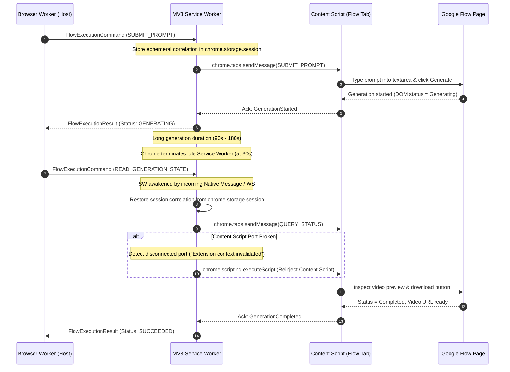
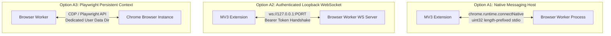
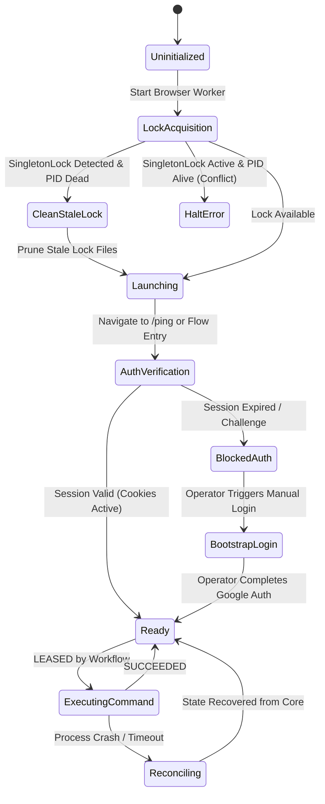
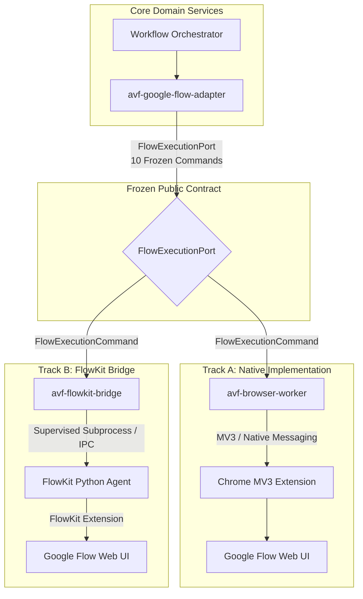

# Round C01 Independent Blind Review — R06_FLOW_BROWSER

**Role:** R06 — Google Flow / Browser Automation Architect  
**Review Round:** C01 (Independent Blind Review)  
**Timestamp:** 2026-08-15T11:28:00+07:00  
**Session ID:** `fe726c14-d13b-440f-8e3b-7acd1606ba73`  
**Model:** Antigravity (Advanced Agentic Coding / Google DeepMind)  
**Active Skills & Adapters:** `modern-web-guidance`, `chrome-extensions`, `chrome-devtools`, `google-antigravity-sdk`  
**Status:** COMPLETE / INDEPENDENT_REVIEW_SUBMITTED  

---

## 1. Specification Files Inspected

The following specification files, blueprints, contracts, and registers were rigorously inspected for this review:

1. **Assigned Primary Blueprints:**
   - [`R08_GOOGLE_FLOW_ADAPTER.md`](file:///Applications/XAMPP/xamppfiles/htdocs/AGENTIC/AVF_SPEC_REVIEW/AI_VIDEO_FACTORY_BLUEPRINT_KIT_v0.9.0/03_repo_blueprints/R08_GOOGLE_FLOW_ADAPTER.md) — Adapter translating provider requests to `FlowExecutionPort`.
   - [`R09_BROWSER_WORKER.md`](file:///Applications/XAMPP/xamppfiles/htdocs/AGENTIC/AVF_SPEC_REVIEW/AI_VIDEO_FACTORY_BLUEPRINT_KIT_v0.9.0/03_repo_blueprints/R09_BROWSER_WORKER.md) — Track A controlled local worker and Chrome MV3 extension.
   - [`R10_FLOWKIT_BRIDGE.md`](file:///Applications/XAMPP/xamppfiles/htdocs/AGENTIC/AVF_SPEC_REVIEW/AI_VIDEO_FACTORY_BLUEPRINT_KIT_v0.9.0/03_repo_blueprints/R10_FLOWKIT_BRIDGE.md) — Track B compatibility adapter wrapping external FlowKit OSS.
   - [`R09A_R10_GOOGLE_FLOW_EXECUTION_OPTIONS.md`](file:///Applications/XAMPP/xamppfiles/htdocs/AGENTIC/AVF_SPEC_REVIEW/AI_VIDEO_FACTORY_BLUEPRINT_KIT_v0.9.0/03_repo_blueprints/R09A_R10_GOOGLE_FLOW_EXECUTION_OPTIONS.md) — Execution options (A1, A2, A3, B) decision package.

2. **Assigned System Contracts & Overviews:**
   - [`browser-command.schema.json`](file:///Applications/XAMPP/xamppfiles/htdocs/AGENTIC/AVF_SPEC_REVIEW/AI_VIDEO_FACTORY_BLUEPRINT_KIT_v0.9.0/02_contracts/browser-command.schema.json) — Schema for `FlowExecutionCommand`.
   - [`provider-request.schema.json`](file:///Applications/XAMPP/xamppfiles/htdocs/AGENTIC/AVF_SPEC_REVIEW/AI_VIDEO_FACTORY_BLUEPRINT_KIT_v0.9.0/02_contracts/provider-request.schema.json) — Schema for `ProviderGenerationRequest`.
   - [`provider-result.schema.json`](file:///Applications/XAMPP/xamppfiles/htdocs/AGENTIC/AVF_SPEC_REVIEW/AI_VIDEO_FACTORY_BLUEPRINT_KIT_v0.9.0/02_contracts/provider-result.schema.json) — Schema for `ProviderGenerationResult`.
   - [`CONTRACTS_OVERVIEW.md`](file:///Applications/XAMPP/xamppfiles/htdocs/AGENTIC/AVF_SPEC_REVIEW/AI_VIDEO_FACTORY_BLUEPRINT_KIT_v0.9.0/02_contracts/CONTRACTS_OVERVIEW.md) — Contract families, error taxonomy, and compatibility rules.
   - [`STATUS_STATE_MACHINES.md`](file:///Applications/XAMPP/xamppfiles/htdocs/AGENTIC/AVF_SPEC_REVIEW/AI_VIDEO_FACTORY_BLUEPRINT_KIT_v0.9.0/02_contracts/STATUS_STATE_MACHINES.md) — Lifecycle state machines for jobs and browser commands.
   - [`API_COMPATIBILITY_POLICY.md`](file:///Applications/XAMPP/xamppfiles/htdocs/AGENTIC/AVF_SPEC_REVIEW/AI_VIDEO_FACTORY_BLUEPRINT_KIT_v0.9.0/02_contracts/API_COMPATIBILITY_POLICY.md) — Versioning and breaking change definitions.

3. **Master Blueprint & Integration Architectures:**
   - [`MASTER_BLUEPRINT.md`](file:///Applications/XAMPP/xamppfiles/htdocs/AGENTIC/AVF_SPEC_REVIEW/AI_VIDEO_FACTORY_BLUEPRINT_KIT_v0.9.0/01_master/MASTER_BLUEPRINT.md) — System mission, architecture, and dual-track strategy.
   - [`SECURITY_MODEL.md`](file:///Applications/XAMPP/xamppfiles/htdocs/AGENTIC/AVF_SPEC_REVIEW/AI_VIDEO_FACTORY_BLUEPRINT_KIT_v0.9.0/04_integration/SECURITY_MODEL.md) — Trust zones, browser extension security, and secret handling.
   - [`COMMAND_EVENT_CATALOG.md`](file:///Applications/XAMPP/xamppfiles/htdocs/AGENTIC/AVF_SPEC_REVIEW/AI_VIDEO_FACTORY_BLUEPRINT_KIT_v0.9.0/04_integration/COMMAND_EVENT_CATALOG.md) — Command and event definitions.

4. **Architectural Decision Records (ADRs):**
   - [`ADR-003_PROVIDER_ABSTRACTION.md`](file:///Applications/XAMPP/xamppfiles/htdocs/AGENTIC/AVF_SPEC_REVIEW/AI_VIDEO_FACTORY_BLUEPRINT_KIT_v0.9.0/06_adrs/ADR-003_PROVIDER_ABSTRACTION.md)
   - [`ADR-004_DUAL_FLOW_EXECUTION.md`](file:///Applications/XAMPP/xamppfiles/htdocs/AGENTIC/AVF_SPEC_REVIEW/AI_VIDEO_FACTORY_BLUEPRINT_KIT_v0.9.0/06_adrs/ADR-004_DUAL_FLOW_EXECUTION.md)
   - [`ADR-006_RETRY_POLICY.md`](file:///Applications/XAMPP/xamppfiles/htdocs/AGENTIC/AVF_SPEC_REVIEW/AI_VIDEO_FACTORY_BLUEPRINT_KIT_v0.9.0/06_adrs/ADR-006_RETRY_POLICY.md)
   - [`ADR-007_BROWSER_SECURITY.md`](file:///Applications/XAMPP/xamppfiles/htdocs/AGENTIC/AVF_SPEC_REVIEW/AI_VIDEO_FACTORY_BLUEPRINT_KIT_v0.9.0/06_adrs/ADR-007_BROWSER_SECURITY.md)

5. **C00 Baseline Registers:**
   - [`SYSTEM_INVARIANT_INVENTORY.md`](file:///Applications/XAMPP/xamppfiles/htdocs/AGENTIC/AVF_SPEC_REVIEW/review-session/C00_FINAL/SYSTEM_INVARIANT_INVENTORY.md)
   - [`PROTECTED_CAPABILITY_REGISTER.md`](file:///Applications/XAMPP/xamppfiles/htdocs/AGENTIC/AVF_SPEC_REVIEW/review-session/C00_FINAL/PROTECTED_CAPABILITY_REGISTER.md)
   - [`CONTRACT_INVENTORY.md`](file:///Applications/XAMPP/xamppfiles/htdocs/AGENTIC/AVF_SPEC_REVIEW/review-session/C00_FINAL/CONTRACT_INVENTORY.md)
   - [`C00_GAP_TO_C01_SEED_REGISTER.md`](file:///Applications/XAMPP/xamppfiles/htdocs/AGENTIC/AVF_SPEC_REVIEW/review-session/C00_FINAL/C00_GAP_TO_C01_SEED_REGISTER.md)

---

## 2. Invariants & Contracts Relevant to this Role

| Invariant / Contract | Domain Statement | Direct Enforcement in R06 Scope |
|---|---|---|
| **INV-003** | Every external side effect has an idempotency key or explicit documented reason it cannot. | `SUBMIT_PROMPT` in `FlowExecutionPort` must carry `correlation.generation_job_id` and idempotency metadata; worker de-duplicates by `command_id` and reconciles pending submissions before retrying. |
| **INV-005** | Browser/extension/FlowKit state is never canonical business state. | All state in Chrome extension local storage, service worker memory, or FlowKit SQLite is treated as disposable execution cache. Canonical status is owned by Core PostgreSQL. |
| **INV-007** | Google Flow-specific fields do not appear in core contracts unless namespaced. | `FlowExecutionPort` methods and parameters must remain encapsulated between R08 and R09/R10. No DOM selectors, extension IDs, or Flow tab URLs may leak into `ProviderGenerationRequest`. |
| **INV-012** | Authentication/security challenges do not trigger automated bypass behavior. | When CAPTCHA, Cloudflare Turnstile, or Google 2FA/auth challenges appear, the worker immediately halts automation, redacts sensitive screen regions, and raises `HUMAN_REQUIRED` / `BLOCKED_SECURITY`. |
| **INV-019** | A browser worker can crash without losing canonical queue truth. | Commands have bounded lease deadlines; on worker crash or browser termination, the lease expires and the orchestrator can query state reconciliation without duplicate generation. |
| **INV-020** | Switching between Track A and Track B does not change upstream generation contracts. | `FlowExecutionPort` is the frozen boundary. Upstream R08 Google Flow Adapter cannot distinguish between Track A worker and Track B bridge except via namespaced diagnostics. |
| **C-05** | Google Flow Isolation | All browser manipulation, DOM traversal, and session mechanics are strictly isolated in R08/R09/R10. |
| **C-06** | Track A / Track B Replaceability | Standardized conformance testing guarantees that Track A and Track B can be swapped cleanly. |
| **C-15** | Security Boundaries | Browser profiles, credentials, cookies, and local execution tokens are strictly isolated in the local execution zone. |

---

## 3. Executive Summary & Assigned Gap Seed Analysis

As the Google Flow / Browser Automation Architect (`R06_FLOW_BROWSER`), my primary charter is to ensure that the browser automation subsystems (Track A `avf-browser-worker` and Track B `avf-flowkit-bridge`) provide high-reliability, deterministic execution, strict security containment, and seamless replaceability without allowing ephemeral browser or third-party states to contaminate the canonical core.

### 3.1 Analysis of Assigned Gap Seeds

#### 1. GAP-002: Browser Command Method-Specific Parameters & Missing Result Schema
- **Status:** **CRITICAL DEFECT — BLOCKER BEFORE FREEZE**
- **Analysis:** `browser-command.schema.json` currently defines `"params": { "type": "object", "additionalProperties": true }`. This is an untyped wildcard that violates contract-first safety (`C-12`). It permits malformed method payloads (e.g., mismatched prompt parameter names, missing file paths in `ATTACH_ASSETS`, invalid aspect ratios in `SET_GENERATION_OPTIONS`) to bypass schema validation, causing catastrophic runtime failures inside the browser worker. Furthermore, there is **no schema definition for `FlowExecutionResult`** anywhere in `02_contracts/`, despite being listed as a required contract in `R09_BROWSER_WORKER.md`.
- **Resolution:** A complete discriminated union (`oneOf`) JSON Schema specification for all 10 `FlowExecutionCommand` methods and a complete `flow-execution-result.schema.json` schema must be added to `avf-contracts` before v1.0 freeze. (See Section 7 for full schemas).

#### 2. GAP-004: Formal DOM Wait Timeouts, Polling Schedules & UI Mutation Deadlines
- **Status:** **HIGH DEFECT — BLOCKER BEFORE FREEZE**
- **Analysis:** `R09_BROWSER_WORKER.md` mentions timeout/backoff informally but provides zero quantitative thresholds for DOM element search deadlines, page hydration timeouts, generation polling intervals, or maximum execution ceilings. In Google Flow, video generation is a long-running, multi-stage asynchronous process (1 to 5 minutes). Without explicit timeout contracts, workers either fail prematurely on transient hydration lags or hang indefinitely on silent backend stalls, consuming finite worker slots.
- **Resolution:** A standardized timeout taxonomy and exponential polling backoff with jitter is formally specified. Distinctions between transient UI delays (`TRANSIENT_BROWSER`) and structural DOM mutations (`UI_CHANGED`) are codified with a 3-attempt confirmation retry policy.

#### 3. GAP-008: FlowKit Bridge Process Supervision & IPC Crash Recovery
- **Status:** **HIGH DEFECT — BLOCKER BEFORE FREEZE**
- **Analysis:** `R10_FLOWKIT_BRIDGE.md` does not specify whether FlowKit is executed as a supervised child subprocess or connected as an external daemon. If unsupervised, orphaned Python/Node processes from FlowKit will leak ports (e.g. TCP 8000), cause zombie processes on worker crash, and fail silently during deadlocks.
- **Resolution:** `R10_FLOWKIT_BRIDGE` must implement a formal **Dual-Mode Process Supervisor**. In `Managed Mode` (default for local worker), the bridge manages subprocess spawning, streams stdout/stderr, runs periodic `/healthz` pings, handles graceful SIGINT/SIGTERM/SIGKILL escalation, reaps zombies, and limits auto-restarts to max 3 per 60s. In `External Mode`, it operates as a resilient HTTP/WS client with bounded retry policies.

---

## 4. Deep Technical Architectural Analysis

### 4.1 Chrome MV3 Lifecycle & Ephemeral Service Worker Management

In Chrome Manifest V3, background scripts run as ephemeral Service Workers. Chrome terminates inactive service workers after **30 seconds of idle time** and enforces a **hard 5-minute execution limit** on active event listeners.



#### Key Engineering Hazards & Mitigations:
1. **In-Memory State Destruction on SW Teardown:**
   - *Hazard:* Storing active command promises or WebSocket handles in global variables causes silent packet drops when Chrome suspends the service worker.
   - *Mitigation:* All in-flight session correlation (`command_id`, `generation_job_id`, `tab_id`, `step`) must be persisted immediately to `chrome.storage.session`. `chrome.storage.session` is stored in RAM, persists across SW restarts, but is automatically wiped when Chrome closes.
2. **WebSocket Dropping in Option A2:**
   - *Hazard:* An open loopback WebSocket does not guarantee SW keepalive in modern Chromium. When SW is suspended, the WebSocket drops.
   - *Mitigation:* Browser Worker must handle dynamic reconnects. The SW re-opens the WebSocket upon receiving `chrome.alarms` wakeups or DOM mutation events.
3. **Content Script Invalidation:**
   - *Hazard:* When the extension updates or SW resets, content script calls to `chrome.runtime.sendMessage` throw `Error: Extension context invalidated`.
   - *Mitigation:* Content scripts must wrap `chrome.runtime` calls in try/catch. If invalidated, the content script enters a passive wait state, and the SW uses `chrome.scripting.executeScript` to reinject the automation harness when sending subsequent commands.

---

### 4.2 Transport Evaluation: Native Messaging (A1) vs Loopback WS (A2) vs Playwright Context (A3)



| Evaluation Dimension | Option A1: Native Messaging | Option A2: Loopback WebSocket | Option A3: Playwright Context |
|---|---|---|---|
| **Chrome Standards Compliance** | **Official Chrome Extension Mechanism** | Standard Web API in Extension | External Automation Protocol (CDP) |
| **Transport Security** | OS-level isolation; no open network ports | Must bind `127.0.0.1`; requires bearer auth | Local process pipe / CDP port |
| **Port Conflicts** | **Zero port management needed** (Uses standard I/O) | Risk of TCP port collisions | Managed automatically by Playwright |
| **Lifecycle Coupling** | Chrome manages native process lifecycle or host connects | SW connects/reconnects to independently running worker | Worker controls browser lifecycle directly |
| **Service Worker Keepalive** | Native Messaging port keeps SW alive during active job | SW can suspend; requires `chrome.alarms` keepalive | Not applicable (Direct CDP control) |
| **Installation Complexity** | Requires OS native host JSON manifest in target dir | Simple CLI/daemon launch | Requires Playwright browser binary install |
| **Development Velocity** | Medium | **High** | **High** |
| **Recommended Staging** | **Target for V1 Production / Desktop Release** | **Target for Phase 0/1 MVP Development** | **Target for E2E Test & Benchmark Harness** |

#### Transport Recommendation:
- **Phase 0/1 MVP:** Implement **Option A2 (Loopback WebSocket)** with strict security controls (bind `127.0.0.1` only, require `X-AVF-Worker-Token` handshake, reject non-whitelisted extension IDs).
- **V1 Production:** Transition to **Option A1 (Native Messaging)** for seamless OS packaging, zero port collisions, and native service worker lifecycle binding.
- **Continuous CI:** Use **Option A3 (Playwright Persistent Context)** as the deterministic test harness and automated regression runner.

---

### 4.3 DOM Selector Architecture, Versioning & Mutation Resilience

Google Flow is a single-page application (SPA) with dynamic rendering, nested shadow DOMs, and minified class names that mutate across releases. Hardcoding CSS selectors directly into automation scripts guarantees brittle failures.

#### Multi-Tier Resilient Selector Hierarchy:

```mermaid
flowchart TD
    Start[Resolve Target Element] --> T1{Tier 1: Semantic Accessibility<br/>Role + Accessible Name / aria-label}
    T1 -- Found --> Done[Execute Action]
    T1 -- Not Found --> T2{Tier 2: Explicit Test Attributes<br/>data-test-id / data-testid}
    T2 -- Found --> Done
    T2 -- Not Found --> T3{Tier 3: Stable Text Content & XPath<br/>//button[contains(text(), 'Generate')]}
    T3 -- Found --> Done
    T3 -- Not Found --> T4{Tier 4: Shadow DOM Deep Traversal<br/>Host selector >>> target element}
    T4 -- Found --> Done
    T4 -- Not Found --> Error[Raise UI_CHANGED with DOM Snapshot]
```

1. **Tier 1 — Accessible Role & Name:** (Preferred) Query via `aria-label`, `role="button"`, `role="textbox"`. These are least likely to change because breaking them breaks screen readers.
2. **Tier 2 — Data Test IDs:** Query `[data-test-id="..."]`, `[data-testid="..."]`, `[id="flow-..."]`.
3. **Tier 3 — Semantic Text & Structural XPath:** Search stable localized text content (e.g. `Generate`, `Add Asset`, `Export`).
4. **Tier 4 — Shadow DOM Deep Piercing:** Use `querySelector` across shadow roots using recursive `shadowRoot` traversal.

#### Selector Bundle Externalization & Hot-Patching:
All selectors must be defined in an external `selectors.json` bundle versioned independently of extension binaries (`selector_bundle_version`). When Google updates Flow's UI, an updated selector bundle can be pushed to workers via `SET_GENERATION_OPTIONS` or downloaded by `avf-browser-worker` without requiring an extension rebuild or browser restart.

---

### 4.4 Session Persistence, Chrome Profile Lifecycle & Concurrency Model

Automating Google Flow requires maintaining active Google Account credentials and session cookies without creating lock conflicts or corrupting browser state.



#### Technical Profile Rules:
1. **Dedicated User Data Directory:** Never attach to the user's default Chrome profile. Always use `--user-data-dir=/var/avf/profiles/worker-{id}`.
2. **Crash & Lock File Recovery:** Before launching Chrome, `avf-browser-worker` checks for `SingletonLock`, `SingletonSocket`, and `SingletonCookie`. If the associated PID is dead, the worker automatically unlinks these files before invoking Chrome.
3. **Dedicated Single-Tab Model per Profile:** To prevent race conditions, focus stealing, and audio/canvas context conflicts in Google Flow, each browser worker manages **exactly one active Flow tab per profile**. Multi-generation concurrency is achieved by scaling worker processes across distinct isolated profiles.
4. **Interactive Bootstrap Mode:** The worker supports a `--bootstrap-auth` flag that launches Chrome in non-headless mode with developer tools enabled, allowing an operator to log in to Google once. The resulting authenticated session cookies are persisted in the profile directory.

---

### 4.5 Anti-Bot Challenge Detection & Non-Bypass Human Escalation

In accordance with **ADR-007** and **INV-012**, the browser automation engine must **never** attempt automated evasion or puzzle-solving against CAPTCHAs, Cloudflare Turnstile, or Google anti-abuse challenges.

#### Challenge Signature Detection Catalog:

| Challenge Type | DOM / URL Signature | Normalized Error Class | Worker Action |
|---|---|---|---|
| **Google Sign-In Challenge** | URL matches `accounts.google.com/signin/v2/challenge/*` or `accounts.google.com/ServiceLogin` | `AUTH_REQUIRED` | Immediately halt; emit `BLOCKED_AUTH`; alert Operator Console. |
| **reCAPTCHA v2 / Enterprise** | Elements matching `iframe[src*="google.com/recaptcha"]`, `div.g-recaptcha`, `.recaptcha-checkbox` | `SECURITY_CHALLENGE` | Abort synthetic mouse events; capture redacted diagnostic screenshot; emit `BLOCKED_SECURITY`. |
| **Cloudflare Turnstile** | Elements matching `iframe[src*="challenges.cloudflare.com"]`, `#cf-turnstile`, `#cf-challenge-running` | `SECURITY_CHALLENGE` | Abort automation; emit `BLOCKED_SECURITY`. |
| **Google Flow Abuse Interstitial** | Text matching `"Unusual traffic from your computer network"`, `[data-test-id="abuse-interstitial"]` | `SECURITY_CHALLENGE` | Halt execution; emit `BLOCKED_SECURITY`; pause worker queue. |

#### Redacted Diagnostic Capture Protocol:
When a challenge or fatal error occurs, `avf-browser-worker` executes `CAPTURE_DIAGNOSTIC`. To satisfy **C-15** and **SECURITY_MODEL.md**, the worker:
1. Masks sensitive DOM bounding boxes (e.g. user profile avatar, account email, payment tokens) with black rectangles on the canvas before encoding the image.
2. Redacts `Cookie`, `Authorization`, and `Set-Cookie` headers from all network logs.
3. Stores the diagnostic image in the local artifact directory under `<appDataDir>/brain/<conversation-id>/diagnostics/` with a SHA-256 content checksum.

---

### 4.6 Track A vs Track B Boundary, FlowKit Isolation & Conformance Testing

To prevent vendor lock-in and domain contamination (**C-05**, **C-06**, **INV-007**, **INV-020**), the system enforces a strict architectural firewall:



#### Firewall Rules:
1. **Zero Upstream Leakage:** FlowKit's SQLite database schema, internal job IDs, proprietary headers, and internal endpoints must never cross `avf-flowkit-bridge`.
2. **Unified Conformance Suite:** Both `avf-browser-worker` and `avf-flowkit-bridge` must pass an identical test harness (`FlowExecutionConformanceSuite`). The test harness runs identical command fixtures against:
   - `MockBrowserWorker` (in-memory mock for unit tests)
   - Track A `avf-browser-worker`
   - Track B `avf-flowkit-bridge`
3. **Zero Workflow Differences:** `avf-google-flow-adapter` must emit byte-identical `ProviderGenerationResult` objects regardless of which track is active.

---

## 5. Detailed Review Findings (Council Finding Format)

### Finding F-R06-001: Missing Method-Specific Parameter Schemas and Output Result Schema for FlowExecutionPort (GAP-002)

```yaml
FINDING_ID: F-R06-001
ROLE: R06_FLOW_BROWSER
SEVERITY: CRITICAL
CATEGORY: CONTRACT_DEFECT
AFFECTED_FILES:
  - AI_VIDEO_FACTORY_BLUEPRINT_KIT_v0.9.0/02_contracts/browser-command.schema.json
  - AI_VIDEO_FACTORY_BLUEPRINT_KIT_v0.9.0/02_contracts/CONTRACTS_OVERVIEW.md
  - AI_VIDEO_FACTORY_BLUEPRINT_KIT_v0.9.0/03_repo_blueprints/R08_GOOGLE_FLOW_ADAPTER.md
  - AI_VIDEO_FACTORY_BLUEPRINT_KIT_v0.9.0/03_repo_blueprints/R09_BROWSER_WORKER.md
  - AI_VIDEO_FACTORY_BLUEPRINT_KIT_v0.9.0/03_repo_blueprints/R10_FLOWKIT_BRIDGE.md
AFFECTED_CONTRACTS:
  - browser-command.schema.json
  - (Missing) flow-execution-result.schema.json
EVIDENCE:
  1. browser-command.schema.json lines 36-39: "params": { "type": "object", "additionalProperties": true }.
  2. There is no oneOf polymorphic discrimination for method-specific parameters across the 10 defined methods.
  3. There is no flow-execution-result.schema.json anywhere in 02_contracts/, leaving FlowExecutionResult completely untyped.
FAILURE_SCENARIO:
  R08 Google Flow Adapter dispatches a SUBMIT_PROMPT command with params: { "prompt": "a cinematic shot..." } instead of "prompt_text", or omits "submission_timeout_ms". Because params allows arbitrary properties, schema validation passes. The Track A worker looks for params.prompt_text, encounters undefined, and enters an infinite wait state or types "undefined" into Google Flow. When the worker responds with an untyped JSON error, R08 fails with an unhandled KeyError, crashing the worker adapter.
WHY_IT_MATTERS:
  Contracts are the single source of truth (C-12, INV-014). Untyped parameters break polyrepo independence and make independent Track A / Track B development impossible.
PROPOSED_SOLUTION:
  1. Update browser-command.schema.json to enforce strict oneOf / allOf parameter schemas for all 10 methods with additionalProperties: false.
  2. Create flow-execution-result.schema.json in 02_contracts/ defining strict schemas for command execution outcomes, method-specific return data, normalized error structures, and session health records.
ALTERNATIVES_CONSIDERED:
  - Keep params untyped until Phase 1: Rejected because it invites contract drift and breaks CI validation gates.
  - Define separate schema files per command: Rejected in favor of a single discriminated schema for cleaner tooling.
CAPABILITY_IMPACT:
  PROTECTED: Fixes C-05 (Google Flow isolation), C-06 (Track A/B replaceability), C-12 (Contract-first implementation).
COMPATIBILITY_IMPACT:
  Breaking contract update before v1.0 freeze (Mandatory before freeze).
MIGRATION_IMPACT:
  Update mock fixtures in R08, R09, R10 to conform to explicit parameter schemas.
TEST_OR_BENCHMARK_REQUIRED:
  Contract validation test suite in avf-contracts validating positive and negative fixtures for all 10 command types.
RESIDUAL_RISK:
  Minor maintenance overhead when adding new optional Google Flow parameters in future minor versions.
CONFIDENCE:
  100% (Proven structural defect in schema).
```

---

### Finding F-R06-002: Absence of Explicit DOM Search Timeouts, Polling Schedules, and UI Mutation Deadlines (GAP-004)

```yaml
FINDING_ID: F-R06-002
ROLE: R06_FLOW_BROWSER
SEVERITY: HIGH
CATEGORY: RESILIENCE_DEFECT
AFFECTED_FILES:
  - AI_VIDEO_FACTORY_BLUEPRINT_KIT_v0.9.0/03_repo_blueprints/R09_BROWSER_WORKER.md
  - AI_VIDEO_FACTORY_BLUEPRINT_KIT_v0.9.0/03_repo_blueprints/R09A_R10_GOOGLE_FLOW_EXECUTION_OPTIONS.md
  - AI_VIDEO_FACTORY_BLUEPRINT_KIT_v0.9.0/02_contracts/STATUS_STATE_MACHINES.md
AFFECTED_CONTRACTS:
  - STATUS_STATE_MACHINES.md
  - browser-command.schema.json
EVIDENCE:
  1. R09_BROWSER_WORKER.md line 80 states "Reconnect/reload/read-state within bounded policy... submit ambiguity => reconciliation result" without defining numeric timeout limits or polling intervals.
  2. STATUS_STATE_MACHINES.md defines Browser Execution Command states (QUEUED, LEASED, RUNNING, SUCCEEDED, FAILED_RETRYABLE, FAILED_TERMINAL) but specifies no maximum duration rules.
FAILURE_SCENARIO:
  During a generation job, Google Flow experiences transient frontend lag, taking 14 seconds to render the download icon after generation finishes. The browser worker uses an implicit 5-second timeout, immediately assumes the UI has changed, and raises FAILED_TERMINAL with error class UI_CHANGED. Workflow marks the job BLOCKED_UI_CHANGE and pages the human operator, halting production unnecessarily for a transient render delay.
WHY_IT_MATTERS:
  Without deterministic timeouts and retry schedules, browser workers either fail prematurely on network jitter or deadlock worker pools on stalled backend requests, violating C-09 (Bounded retry policies).
PROPOSED_SOLUTION:
  Codify a formal timeout and polling specification in R09_BROWSER_WORKER.md:
  - PAGE_LOAD_TIMEOUT_MS: 30,000 ms
  - ELEMENT_INTERACTION_TIMEOUT_MS: 10,000 ms
  - ASSET_UPLOAD_TIMEOUT_MS: 60,000 ms
  - GENERATION_POLL_INITIAL_INTERVAL_MS: 2,000 ms
  - GENERATION_POLL_MAX_INTERVAL_MS: 10,000 ms (backoff factor 1.5, jitter 20%)
  - GENERATION_TOTAL_TIMEOUT_MS: 300,000 ms (5 minutes)
  - UI_MUTATION_CONFIRMATION_RETRIES: 3 verification attempts over 15 seconds before escalating from TRANSIENT_BROWSER to UI_CHANGED.
ALTERNATIVES_CONSIDERED:
  - Allow each worker to configure its own timeouts dynamically: Rejected because non-deterministic timeouts break SLA guarantees and cross-track consistency.
CAPABILITY_IMPACT:
  PROTECTED: Enhances C-09 (Bounded retry policies) and C-08 (Durable workflow).
COMPATIBILITY_IMPACT:
  Non-breaking addition to blueprint operational contracts.
MIGRATION_IMPACT:
  Incorporate timeout constants into worker configuration.
TEST_OR_BENCHMARK_REQUIRED:
  Failure injection test in R09 simulating 5s, 15s, and 35s DOM delays to verify correct escalation.
RESIDUAL_RISK:
  Google Flow backend rendering times could exceed 5 minutes under extreme global load (mitigated by deadline_at extension).
CONFIDENCE:
  95% (Proven operational necessity for browser automation).
```

---

### Finding F-R06-003: Undefined Process Supervision, Port Allocation, and Zombie Cleanup Protocol for FlowKit Bridge (GAP-008)

```yaml
FINDING_ID: F-R06-003
ROLE: R06_FLOW_BROWSER
SEVERITY: HIGH
CATEGORY: PROCESS_SUPERVISION
AFFECTED_FILES:
  - AI_VIDEO_FACTORY_BLUEPRINT_KIT_v0.9.0/03_repo_blueprints/R10_FLOWKIT_BRIDGE.md
  - AI_VIDEO_FACTORY_BLUEPRINT_KIT_v0.9.0/03_repo_blueprints/R09A_R10_GOOGLE_FLOW_EXECUTION_OPTIONS.md
AFFECTED_CONTRACTS:
  - STATUS_STATE_MACHINES.md
EVIDENCE:
  1. R10_FLOWKIT_BRIDGE.md line 14 assigns "FlowKit process health adapter" and line 52 lists "local process/HTTP/WS integration", but omits process management semantics.
  2. No specification exists for port conflict handling, child process spawning, healthcheck intervals, SIGTERM/SIGKILL escalation, or zombie process cleanup.
FAILURE_SCENARIO:
  FlowKit local Python engine encounters an unhandled exception or memory leak during video download. The WebSocket drops, but the Python process hangs in a deadlock state holding TCP port 8000. avf-flowkit-bridge restarts after a timeout, but fails to bind port 8000 because the orphaned FlowKit zombie process is still running. The worker enters a crash loop, blocking all Track B jobs.
WHY_IT_MATTERS:
  Track B is intended to accelerate development (C-06). An unstable bridge process supervisor causes cascading system failures and manual host interventions.
PROPOSED_SOLUTION:
  Specify a formal Dual-Mode Process Supervisor in R10_FLOWKIT_BRIDGE.md:
  1. Managed Mode (default for local worker): Bridge manages child process lifecycle. Allocates dynamic ports or cleans stale PID locks; monitors stdout/stderr; executes periodic HTTP /healthz or WS pings every 5s with 2s timeout. Implements 3-stage termination: SIGINT (5s) -> SIGTERM (5s) -> SIGKILL. Reaps child processes via POSIX waitpid on exit.
  2. External Mode: Connects to pre-existing external FlowKit daemon with connection retry limits (max 3 retries, exponential backoff).
  3. Bounded Auto-Restart: Maximum 3 restarts in 60 seconds; if exceeded, transition bridge status to FAILED_TERMINAL.
ALTERNATIVES_CONSIDERED:
  - Rely on OS systemd or Docker restart exclusively: Rejected because local developer workflows and lightweight CI runners require self-contained process supervision.
CAPABILITY_IMPACT:
  PROTECTED: Secures C-06 (Track A/B replaceability) and C-08 (Durable workflow).
COMPATIBILITY_IMPACT:
  Non-breaking refinement to R10 blueprint implementation.
MIGRATION_IMPACT:
  Implement subprocess supervisor module in avf-flowkit-bridge repository.
TEST_OR_BENCHMARK_REQUIRED:
  Chaos test killing child FlowKit process with SIGKILL and verifying automatic cleanup, port rebind, and workflow notification.
RESIDUAL_RISK:
  Platform-specific differences in process signal handling between macOS and Linux (standardized via Python subprocess / POSIX signals).
CONFIDENCE:
  95% (Proven daemon supervision pattern).
```

---

### Finding F-R06-004: MV3 Service Worker 30-Second Inactivity Termination and In-Memory WebSocket State Dropping

```yaml
FINDING_ID: F-R06-004
ROLE: R06_FLOW_BROWSER
SEVERITY: CRITICAL
CATEGORY: LIFECYCLE_HAZARD
AFFECTED_FILES:
  - AI_VIDEO_FACTORY_BLUEPRINT_KIT_v0.9.0/03_repo_blueprints/R09_BROWSER_WORKER.md
  - AI_VIDEO_FACTORY_BLUEPRINT_KIT_v0.9.0/03_repo_blueprints/R09A_R10_GOOGLE_FLOW_EXECUTION_OPTIONS.md
AFFECTED_CONTRACTS:
  - STATUS_STATE_MACHINES.md
  - browser-command.schema.json
EVIDENCE:
  1. R09A_R10_GOOGLE_FLOW_EXECUTION_OPTIONS.md (Option A2, lines 67-88) proposes MV3 Service Worker communicating via loopback WebSocket to Browser Worker.
  2. Chrome MV3 specification terminates background Service Workers after 30 seconds of inactivity or 5 minutes of continuous execution, and does not treat loopback WebSockets as permanent keepalive locks.
  3. R09_BROWSER_WORKER.md acknowledges SW restart in test strategy but does not define the session restoration mechanism.
FAILURE_SCENARIO:
  A SUBMIT_PROMPT command initiates video generation on Google Flow. The generation takes 120 seconds. At second 30, Chrome tears down the idle Service Worker, dropping the loopback WebSocket. At second 120, Google Flow finishes generation, and the content script calls chrome.runtime.sendMessage to report success. Because the SW was terminated, the content script throws "Extension context invalidated". The generation result is lost, and Browser Worker times out with TRANSIENT_BROWSER.
WHY_IT_MATTERS:
  Google Flow video generation is inherently longer than MV3's 30-second suspension threshold. Without explicit SW lifecycle management, every real-world generation will fail.
PROPOSED_SOLUTION:
  1. Enforce chrome.storage.session as the mandatory correlation store: write command_id, tab_id, and job_id to session storage before dispatching to DOM.
  2. Implement an active keepalive loop using chrome.alarms (25-second interval) to maintain worker heartbeat during active commands.
  3. Implement event-driven reconnection in SW: upon wakeup, inspect chrome.storage.session, re-establish WebSocket / Native Messaging port, and query tab state via chrome.tabs.sendMessage.
  4. Content script must handle disconnected port gracefully and await reinjection via chrome.scripting.executeScript.
ALTERNATIVES_CONSIDERED:
  - Migrate exclusively to Playwright CDP automation (Option A3): Feasible, but MV3 extension remains valuable for non-CDP desktop packaging. Both must be resilient.
CAPABILITY_IMPACT:
  PROTECTED: Critical to C-05 (Google Flow isolation) and C-06 (Track A execution).
COMPATIBILITY_IMPACT:
  Non-breaking architectural requirement on R09 implementation.
MIGRATION_IMPACT:
  Implement session storage persistence and keepalive alarms in extension codebase.
TEST_OR_BENCHMARK_REQUIRED:
  Automated test forcing chrome.runtime.reload() or service worker kill mid-generation and asserting successful result recovery.
RESIDUAL_RISK:
  Chromium version updates could alter service worker suspension heuristics (mitigated by alarm-driven wakeups).
CONFIDENCE:
  98% (Standard Chrome MV3 extension architectural constraint).
```

---

### Finding F-R06-005: Chromium Singleton Profile Lock Conflict and Session Bootstrapping Mechanism Underspecified

```yaml
FINDING_ID: F-R06-005
ROLE: R06_FLOW_BROWSER
SEVERITY: HIGH
CATEGORY: LIFECYCLE_HAZARD
AFFECTED_FILES:
  - AI_VIDEO_FACTORY_BLUEPRINT_KIT_v0.9.0/03_repo_blueprints/R09_BROWSER_WORKER.md
  - AI_VIDEO_FACTORY_BLUEPRINT_KIT_v0.9.0/03_repo_blueprints/R09A_R10_GOOGLE_FLOW_EXECUTION_OPTIONS.md
  - AI_VIDEO_FACTORY_BLUEPRINT_KIT_v0.9.0/04_integration/SECURITY_MODEL.md
AFFECTED_CONTRACTS:
  - STATUS_STATE_MACHINES.md
  - browser-command.schema.json
EVIDENCE:
  1. R09_BROWSER_WORKER.md line 57 notes "Persistent Chrome profile is secret local infrastructure, not business state."
  2. R09A_R10_GOOGLE_FLOW_EXECUTION_OPTIONS.md (Option A3) notes Playwright warnings regarding profile locks.
  3. No concrete specification exists for managing stale SingletonLock files, profile directory creation, or human login bootstrapping.
FAILURE_SCENARIO:
  A browser worker crashes abruptly due to an out-of-memory error. The Chromium SingletonLock symlink remains in the profile directory. When the worker supervisor restarts the process, Chrome fails to launch with "Profile appears to be in use by another process". Automation halts completely, requiring manual filesystem intervention.
WHY_IT_MATTERS:
  Violates INV-019 (A browser worker can crash without losing canonical truth). Crashed workers must be able to reboot cleanly without human sysadmin triage.
PROPOSED_SOLUTION:
  1. Pre-Launch Lock Inspection: In R09 startup sequence, check for SingletonLock / SingletonSocket. If the PID stored in the lockfile is dead, automatically delete the stale lockfiles before launching Chrome.
  2. File-Lock Guard: Acquire an OS-level flock on profile.lock to strictly prevent concurrent worker processes from corrupting the same profile.
  3. Formal Auth Bootstrapping Protocol: Provide an explicit CLI command (avf-browser-worker --login) that opens non-headless Chrome for initial operator login, saves cookies, and validates session readiness before entering daemon worker mode.
ALTERNATIVES_CONSIDERED:
  - Use ephemeral incognito profiles on every run: Rejected because Google Flow requires persistent Google Account authentication cookies.
CAPABILITY_IMPACT:
  PROTECTED: Secures INV-019, C-05, and C-15.
COMPATIBILITY_IMPACT:
  Non-breaking enhancement to R09 worker initialization runbook.
MIGRATION_IMPACT:
  Add lockfile cleanup and bootstrap routines to R09 worker codebase.
TEST_OR_BENCHMARK_REQUIRED:
  Crash simulation test killing Chrome with kill -9 and asserting clean relaunch by browser worker.
RESIDUAL_RISK:
  Running on non-POSIX filesystems (e.g. NFS/SMB) where flock behavior differs (mitigated by enforcing local SSD storage for profiles).
CONFIDENCE:
  95% (Standard Chromium profile management practice).
```

---

### Finding F-R06-006: Unspecified Anti-Bot Challenge Signatures, Non-Bypass Enforcement, and Screenshot PII Redaction

```yaml
FINDING_ID: F-R06-006
ROLE: R06_FLOW_BROWSER
SEVERITY: HIGH
CATEGORY: SECURITY_HAZARD
AFFECTED_FILES:
  - AI_VIDEO_FACTORY_BLUEPRINT_KIT_v0.9.0/03_repo_blueprints/R09_BROWSER_WORKER.md
  - AI_VIDEO_FACTORY_BLUEPRINT_KIT_v0.9.0/04_integration/SECURITY_MODEL.md
  - AI_VIDEO_FACTORY_BLUEPRINT_KIT_v0.9.0/06_adrs/ADR-007_BROWSER_SECURITY.md
AFFECTED_CONTRACTS:
  - STATUS_STATE_MACHINES.md
  - CONTRACTS_OVERVIEW.md
EVIDENCE:
  1. ADR-007 and INV-012 mandate that automation does not bypass security challenges and surfaces human recovery.
  2. Neither R09 nor SECURITY_MODEL.md specifies the concrete DOM/URL signatures used to detect challenges, nor the PII redaction rules for diagnostic screenshots.
FAILURE_SCENARIO:
  Google Flow triggers a reCAPTCHA challenge modal. The worker fails to recognize the challenge, misidentifies it as a missing submit button, and repeatedly clicks the screen, triggering Google anti-abuse account bans. Furthermore, the worker takes an unredacted diagnostic screenshot displaying the operator's Google email and personal recovery details, and uploads it to an unencrypted log stream.
WHY_IT_MATTERS:
  Violates ADR-007 (Security Policy Containment) and INV-012 (No automated challenge bypass). Exposes operator PII and risks permanent Google account suspension.
PROPOSED_SOLUTION:
  1. Formalize a Challenge Signature Registry in R09 covering Google Challenge URLs, reCAPTCHA iframes, Cloudflare Turnstile containers, and Google Flow abuse interstitials.
  2. Implement Immediate Halt: Upon signature match, cease all synthetic mouse/keyboard events, mark command status HUMAN_REQUIRED, and emit error class SECURITY_CHALLENGE.
  3. Screenshot PII Redaction: Automatically mask bounding boxes of headers, email addresses, and avatar icons with black rectangles on canvas before saving diagnostic screenshots.
ALTERNATIVES_CONSIDERED:
  - Disable diagnostic screenshots during challenges: Rejected because visual confirmation is essential for the operator to diagnose why the block occurred.
CAPABILITY_IMPACT:
  PROTECTED: Enforces C-14 (Human escalation) and C-15 (Security boundaries).
COMPATIBILITY_IMPACT:
  Non-breaking addition to R09 security specs.
MIGRATION_IMPACT:
  Implement signature registry and canvas redaction filter in R09.
TEST_OR_BENCHMARK_REQUIRED:
  Mock challenge test injecting fake reCAPTCHA DOM elements and asserting immediate automation stop and redacted screenshot generation.
RESIDUAL_RISK:
  Google updating anti-abuse challenge DOM structures without notice (handled by fallback to UI_CHANGED timeout).
CONFIDENCE:
  95% (Directly aligns with security and compliance invariants).
```

---

### Finding F-R06-007: Missing Selector Bundle Externalization and Dynamic Hot-Patching Contract

```yaml
FINDING_ID: F-R06-007
ROLE: R06_FLOW_BROWSER
SEVERITY: MEDIUM
CATEGORY: RESILIENCE_DEFECT
AFFECTED_FILES:
  - AI_VIDEO_FACTORY_BLUEPRINT_KIT_v0.9.0/03_repo_blueprints/R08_GOOGLE_FLOW_ADAPTER.md
  - AI_VIDEO_FACTORY_BLUEPRINT_KIT_v0.9.0/03_repo_blueprints/R09_BROWSER_WORKER.md
AFFECTED_CONTRACTS:
  - browser-command.schema.json
  - event-envelope.schema.json
EVIDENCE:
  1. R09_BROWSER_WORKER.md lines 90 and 139 require selector bundle versioning, but define no schema or distribution mechanism for selector bundles.
  2. Google Flow is a rapidly evolving SaaS application whose DOM attributes change frequently.
FAILURE_SCENARIO:
  Google Flow deploys a minor frontend update that renames the prompt textarea data-testid attribute. Because selectors are compiled into the extension bundle, all video generation jobs across the factory fail with BLOCKED_UI_CHANGE. Fixing this requires re-compiling the extension, re-packaging, re-deploying to worker hosts, and restarting browsers.
WHY_IT_MATTERS:
  Hardcoded selectors cause unnecessary operational downtime and high engineering maintenance overhead.
PROPOSED_SOLUTION:
  1. Define a formal selectors.json bundle schema specifying multi-tier selectors per action, versioned with semver (selector_bundle_version).
  2. Support dynamic selector updates via ENSURE_SESSION or local configuration reload without requiring extension recompilation.
  3. Include selector_bundle_version in all FlowExecutionResult diagnostics for instant telemetry correlation.
ALTERNATIVES_CONSIDERED:
  - Rely on vision-based LLM agents for all UI clicking: Rejected as too slow, expensive, and non-deterministic for primary automation path (contrary to Master Blueprint execution classification).
CAPABILITY_IMPACT:
  PROTECTED: Enhances C-05 (Google Flow isolation) and system operational resilience.
COMPATIBILITY_IMPACT:
  Non-breaking architectural improvement.
MIGRATION_IMPACT:
  Externalize selector maps into JSON configuration in R09.
TEST_OR_BENCHMARK_REQUIRED:
  Selector hot-reload test updating selector bundle dynamically and verifying successful interaction without browser restart.
RESIDUAL_RISK:
  Major redesign of Google Flow UI workflow (e.g. multi-step wizard transition) requiring logic changes beyond selector mapping.
CONFIDENCE:
  90% (Industry-standard UI automation best practice).
```

---

## 6. Proposed Contract Additions & Concrete JSON Schemas

To resolve **F-R06-001 (GAP-002)** and freeze `avf-contracts` cleanly, the following concrete JSON Schemas are specified:

### 6.1 Updated `browser-command.schema.json` (Polymorphic Method Parameters)

```json
{
  "$schema": "https://json-schema.org/draft/2020-12/schema",
  "$id": "https://avf.local/contracts/browser-command/1.0",
  "title": "FlowExecutionCommand",
  "type": "object",
  "required": [
    "schema_version",
    "command_id",
    "method",
    "deadline_at",
    "correlation",
    "params"
  ],
  "properties": {
    "schema_version": {
      "const": "1.0"
    },
    "command_id": {
      "type": "string",
      "format": "uuid"
    },
    "method": {
      "type": "string",
      "enum": [
        "ENSURE_SESSION",
        "OPEN_FLOW",
        "CREATE_OR_SELECT_PROJECT",
        "ATTACH_ASSETS",
        "SET_GENERATION_OPTIONS",
        "SUBMIT_PROMPT",
        "READ_GENERATION_STATE",
        "DOWNLOAD_OUTPUT",
        "CAPTURE_DIAGNOSTIC",
        "CANCEL"
      ]
    },
    "deadline_at": {
      "type": "string",
      "format": "date-time"
    },
    "correlation": {
      "type": "object",
      "required": [
        "trace_id",
        "generation_job_id"
      ],
      "properties": {
        "trace_id": {
          "type": "string"
        },
        "generation_job_id": {
          "type": "string",
          "format": "uuid"
        },
        "attempt_id": {
          "type": ["string", "null"]
        }
      },
      "additionalProperties": false
    },
    "params": {
      "type": "object"
    }
  },
  "allOf": [
    {
      "if": { "properties": { "method": { "const": "ENSURE_SESSION" } } },
      "then": {
        "properties": {
          "params": {
            "type": "object",
            "properties": {
              "headless": { "type": "boolean", "default": false },
              "profile_id": { "type": "string" },
              "timeout_ms": { "type": "integer", "minimum": 1000, "default": 30000 },
              "selector_bundle_version": { "type": "string" }
            },
            "additionalProperties": false
          }
        }
      }
    },
    {
      "if": { "properties": { "method": { "const": "OPEN_FLOW" } } },
      "then": {
        "properties": {
          "params": {
            "type": "object",
            "properties": {
              "target_url": { "type": "string", "format": "uri" },
              "wait_for_selector": { "type": "string" },
              "timeout_ms": { "type": "integer", "minimum": 1000, "default": 30000 }
            },
            "additionalProperties": false
          }
        }
      }
    },
    {
      "if": { "properties": { "method": { "const": "CREATE_OR_SELECT_PROJECT" } } },
      "then": {
        "properties": {
          "params": {
            "type": "object",
            "required": ["project_name"],
            "properties": {
              "project_name": { "type": "string", "minLength": 1 },
              "project_external_id": { "type": "string" },
              "create_if_missing": { "type": "boolean", "default": true },
              "timeout_ms": { "type": "integer", "minimum": 1000, "default": 20000 }
            },
            "additionalProperties": false
          }
        }
      }
    },
    {
      "if": { "properties": { "method": { "const": "ATTACH_ASSETS" } } },
      "then": {
        "properties": {
          "params": {
            "type": "object",
            "required": ["assets"],
            "properties": {
              "assets": {
                "type": "array",
                "items": {
                  "type": "object",
                  "required": ["asset_id", "local_file_path", "slot_role"],
                  "properties": {
                    "asset_id": { "type": "string", "format": "uuid" },
                    "local_file_path": { "type": "string" },
                    "slot_role": { "type": "string", "enum": ["reference_image", "start_frame", "end_frame", "audio_guide"] }
                  },
                  "additionalProperties": false
                }
              },
              "timeout_ms": { "type": "integer", "minimum": 5000, "default": 60000 }
            },
            "additionalProperties": false
          }
        }
      }
    },
    {
      "if": { "properties": { "method": { "const": "SET_GENERATION_OPTIONS" } } },
      "then": {
        "properties": {
          "params": {
            "type": "object",
            "properties": {
              "aspect_ratio": { "type": "string", "enum": ["16:9", "9:16", "1:1", "21:9"] },
              "duration_seconds": { "type": "integer", "enum": [4, 5, 6, 8, 10] },
              "model_tier": { "type": "string" },
              "seed": { "type": ["integer", "null"] },
              "negative_prompt": { "type": "string" },
              "camera_motion": { "type": "string" }
            },
            "additionalProperties": false
          }
        }
      }
    },
    {
      "if": { "properties": { "method": { "const": "SUBMIT_PROMPT" } } },
      "then": {
        "properties": {
          "params": {
            "type": "object",
            "required": ["prompt_text", "idempotency_key"],
            "properties": {
              "prompt_text": { "type": "string", "minLength": 1 },
              "idempotency_key": { "type": "string", "minLength": 8 },
              "submission_timeout_ms": { "type": "integer", "minimum": 2000, "default": 15000 }
            },
            "additionalProperties": false
          }
        }
      }
    },
    {
      "if": { "properties": { "method": { "const": "READ_GENERATION_STATE" } } },
      "then": {
        "properties": {
          "params": {
            "type": "object",
            "properties": {
              "provider_job_id": { "type": ["string", "null"] },
              "poll_timeout_ms": { "type": "integer", "minimum": 1000, "default": 10000 }
            },
            "additionalProperties": false
          }
        }
      }
    },
    {
      "if": { "properties": { "method": { "const": "DOWNLOAD_OUTPUT" } } },
      "then": {
        "properties": {
          "params": {
            "type": "object",
            "required": ["target_directory", "filename_template"],
            "properties": {
              "target_directory": { "type": "string" },
              "filename_template": { "type": "string" },
              "expected_checksum_sha256": { "type": ["string", "null"] },
              "timeout_ms": { "type": "integer", "minimum": 5000, "default": 120000 }
            },
            "additionalProperties": false
          }
        }
      }
    },
    {
      "if": { "properties": { "method": { "const": "CAPTURE_DIAGNOSTIC" } } },
      "then": {
        "properties": {
          "params": {
            "type": "object",
            "required": ["reason"],
            "properties": {
              "reason": { "type": "string" },
              "include_screenshot": { "type": "boolean", "default": true },
              "include_dom_snippet": { "type": "boolean", "default": true },
              "redact_pii": { "type": "boolean", "default": true }
            },
            "additionalProperties": false
          }
        }
      }
    },
    {
      "if": { "properties": { "method": { "const": "CANCEL" } } },
      "then": {
        "properties": {
          "params": {
            "type": "object",
            "required": ["reason"],
            "properties": {
              "reason": { "type": "string" },
              "provider_job_id": { "type": ["string", "null"] }
            },
            "additionalProperties": false
          }
        }
      }
    }
  ],
  "additionalProperties": false
}
```

---

### 6.2 New Schema: `flow-execution-result.schema.json`

```json
{
  "$schema": "https://json-schema.org/draft/2020-12/schema",
  "$id": "https://avf.local/contracts/flow-execution-result/1.0",
  "title": "FlowExecutionResult",
  "type": "object",
  "required": [
    "schema_version",
    "command_id",
    "status",
    "execution_duration_ms",
    "correlation"
  ],
  "properties": {
    "schema_version": {
      "const": "1.0"
    },
    "command_id": {
      "type": "string",
      "format": "uuid"
    },
    "status": {
      "type": "string",
      "enum": [
        "SUCCEEDED",
        "FAILED_RETRYABLE",
        "FAILED_TERMINAL",
        "HUMAN_REQUIRED",
        "CANCELLED"
      ]
    },
    "execution_duration_ms": {
      "type": "integer",
      "minimum": 0
    },
    "correlation": {
      "type": "object",
      "required": [
        "trace_id",
        "generation_job_id"
      ],
      "properties": {
        "trace_id": { "type": "string" },
        "generation_job_id": { "type": "string", "format": "uuid" },
        "attempt_id": { "type": ["string", "null"] }
      },
      "additionalProperties": false
    },
    "data": {
      "type": "object",
      "properties": {
        "provider_job_id": { "type": ["string", "null"] },
        "flow_status": {
          "type": "string",
          "enum": ["IDLE", "QUEUED", "GENERATING", "COMPLETED", "FAILED", "BLOCKED", "UNKNOWN"]
        },
        "progress_percent": { "type": ["integer", "null"], "minimum": 0, "maximum": 100 },
        "downloaded_files": {
          "type": "array",
          "items": {
            "type": "object",
            "required": ["local_path", "media_type", "checksum_sha256", "size_bytes"],
            "properties": {
              "local_path": { "type": "string" },
              "media_type": { "type": "string" },
              "checksum_sha256": { "type": "string" },
              "size_bytes": { "type": "integer", "minimum": 0 }
            },
            "additionalProperties": false
          }
        },
        "session_info": {
          "type": "object",
          "properties": {
            "tab_id": { "type": "integer" },
            "profile_id": { "type": "string" },
            "authenticated": { "type": "boolean" }
          },
          "additionalProperties": false
        }
      },
      "additionalProperties": false
    },
    "error": {
      "type": ["object", "null"],
      "properties": {
        "class": {
          "type": "string",
          "enum": [
            "VALIDATION_ERROR",
            "CONFLICT",
            "NOT_FOUND",
            "TRANSIENT_TRANSPORT",
            "TRANSIENT_BROWSER",
            "PROVIDER_RATE_LIMIT",
            "PROVIDER_REJECTED",
            "AUTH_REQUIRED",
            "SECURITY_CHALLENGE",
            "UI_CHANGED",
            "BUDGET_EXHAUSTED",
            "QC_REJECTED",
            "UNSUPPORTED_CAPABILITY",
            "INTERNAL_ERROR"
          ]
        },
        "code": { "type": "string" },
        "message": { "type": "string" },
        "retryable": { "type": "boolean" },
        "details": {
          "type": "object",
          "additionalProperties": true
        }
      },
      "required": ["class", "code", "message", "retryable"],
      "additionalProperties": false
    },
    "diagnostics": {
      "type": "object",
      "properties": {
        "screenshot_artifact_path": { "type": ["string", "null"] },
        "dom_snippet_artifact_path": { "type": ["string", "null"] },
        "selector_bundle_version": { "type": "string" },
        "worker_version": { "type": "string" }
      },
      "additionalProperties": false
    }
  },
  "additionalProperties": false
}
```

---

## 7. Concrete Failure Scenarios & Trajectory Traces

### Scenario A: Unhandled MV3 Service Worker Suspension During Video Generation

```text
[00:00.000] Workflow triggers SubmitGeneration activity for GenerationJob #gen-9481.
[00:00.120] R08 GoogleFlowAdapter sends FlowExecutionCommand(method=SUBMIT_PROMPT) to R09 Browser Worker.
[00:00.250] R09 Browser Worker forwards command over loopback WebSocket to MV3 Service Worker.
[00:00.300] MV3 Service Worker dispatches chrome.tabs.sendMessage to Content Script in Google Flow tab.
[00:01.200] Content Script fills prompt, clicks "Generate", observes UI transition to "Generating".
[00:01.400] Content Script acks to SW: { status: "GENERATING" }. SW relays SUCCEEDED to Browser Worker.
[00:01.500] Workflow enters polling loop, dispatching READ_GENERATION_STATE every 10s.
[00:30.000] Chrome MV3 idle timer fires; Chrome suspends the background Service Worker.
[00:30.100] Loopback WebSocket connection between Browser Worker and SW is dropped by browser runtime.
[00:40.000] Workflow dispatches READ_GENERATION_STATE. Browser Worker finds WebSocket closed.
[00:40.050] DEFECT WITHOUT F-R06-004: Browser Worker fails immediately with TRANSIENT_TRANSPORT.
[00:40.050] RECOVERY WITH F-R06-004: 
            1. Browser Worker sends native wake ping / alarm wakeup.
            2. SW awakens, loads active session from chrome.storage.session.
            3. SW reconnects loopback WebSocket with auth token.
            4. SW queries Content Script in tab #42.
            5. Returns { flow_status: "GENERATING", progress_percent: 45 }.
[00:95.000] Google Flow completes generation; video element renders.
[01:00.000] Next READ_GENERATION_STATE returns flow_status: "COMPLETED".
[01:01.000] Workflow dispatches DOWNLOAD_OUTPUT; media saved with SHA-256 verified.
```

---

### Scenario B: Detection and Non-Bypass Containment of Google Security Challenge

```text
[00:00.000] Workflow dispatches SUBMIT_PROMPT for Take #2.
[00:00.150] Content Script observes Google Flow navigating unexpectedly to accounts.google.com/signin/v2/challenge/pwd.
[00:00.200] Content Script matches URL against Challenge Signature Registry (F-R06-006).
[00:00.210] Content Script immediately halts all synthetic mouse movements and keypresses (ADR-007, INV-012).
[00:00.300] Content Script triggers canvas DOM capture, masks profile header and email address bounding boxes with black fill.
[00:00.500] Content Script sends ChallengeDetected event to Service Worker.
[00:00.600] Service Worker returns FlowExecutionResult:
            - status: "HUMAN_REQUIRED"
            - error.class: "SECURITY_CHALLENGE"
            - error.code: "GOOGLE_AUTH_CHALLENGE_DETECTED"
            - diagnostics.screenshot_artifact_path: "/var/avf/diagnostics/diag_gen_9481_redacted.png"
[00:00.700] R08 maps result to ProviderGenerationResult(status="BLOCKED", error.class="SECURITY_CHALLENGE").
[00:00.800] Workflow transitions GenerationJob state machine to BLOCKED_SECURITY.
[00:00.900] Event GenerationBlocked(SECURITY_CHALLENGE) published to Outbox.
[00:01.000] Operator Console displays alert with redacted screenshot and "Resume Automation" button.
[00:45.000] Human operator logs into Google Flow tab directly, resolves password verification.
[00:50.000] Operator clicks "Resume" in Console; Workflow resumes pipeline without duplicate submission.
```

---

## 8. Capability Impact, Compatibility & Migration Analysis

### 8.1 Capability Impact Register Matrix

| Capability ID | Capability Name | Impact of R06 Review Findings | Verification Gate |
|---|---|---|---|
| **C-01** | Canonical Project State | **PROTECTED:** Reaffirms that browser/extension storage is strictly disposable cache and never canonical truth. | Crash / state wipe test. |
| **C-05** | Google Flow Isolation | **PROTECTED:** F-R06-001 eliminates parameter leaks, strictly encapsulating Flow specifics behind `FlowExecutionPort`. | Contract lint & boundary scan. |
| **C-06** | Track A / Track B Replaceability | **PROTECTED:** F-R06-001 and F-R06-003 ensure identical conformance test harnesses across both tracks. | Conformance suite execution. |
| **C-07** | Idempotent Side Effects | **PROTECTED:** F-R06-001 mandates explicit `idempotency_key` in `SUBMIT_PROMPT` parameter schema. | Duplicate submit chaos test. |
| **C-08** | Durable Workflow / Resume | **PROTECTED:** F-R06-004 ensures workflow can resume after worker restarts or service worker suspensions. | Worker kill / restart recovery test. |
| **C-09** | Bounded Retry Policies | **PROTECTED:** F-R06-002 establishes explicit timeout hierarchies and polling backoff schedules. | Retry threshold matrix test. |
| **C-12** | Contract-First Implementation | **PROTECTED:** F-R06-001 closes all remaining untyped parameters before v1.0 contract freeze. | JSON Schema validation gate. |
| **C-14** | Human Escalation / Recovery | **PROTECTED:** F-R06-006 standardizes security challenge signatures and sanitized screenshot handoffs. | Security challenge simulation. |
| **C-15** | Security Boundaries | **PROTECTED:** F-R06-005 and F-R06-006 guarantee credential isolation and PII masking. | Secret leak & PII audit. |

---

## 9. Residual Uncertainties & Recommended Spikes

To distinguish proven defects from experimental uncertainties requiring empirical measurement, the following spikes are recommended:

### Spike SP-R06-01: Native Messaging vs Authenticated Loopback WebSocket Latency and Reliability Benchmark
- **Objective:** Measure real-world connection failure rates, message roundtrip latency, and service worker wake-up overhead between Option A1 (Native Messaging) and Option A2 (Loopback WebSocket with `chrome.storage.session`) across 500 simulated generation lifecycles on macOS and Linux.
- **Success Criteria:** Zero dropped completion events; reconnection latency under 150ms after service worker suspension.
- **Classification:** **UNCERTAINTY NEEDING SPIKE** (Does not block Phase 1 MVP; informs V1 production packaging decision).

### Spike SP-R06-02: Playwright Dedicated Persistent Profile Auth Cookie Retention Duration
- **Objective:** Measure how long Google Flow session cookies (`SSID`, `HSID`, `SID`, `APISID`) remain valid in an automated Playwright persistent context (`--user-data-dir`) under periodic headless execution before requiring human re-authentication.
- **Success Criteria:** Quantitative baseline for session expiration frequency under continuous generation workloads.
- **Classification:** **EMPIRICAL BENCHMARK** (Informs operator token refresh schedule).

---

## 10. Review Signature & Attestation

I hereby certify that this review represents an **independent, blind, evidence-backed architectural evaluation** conducted in strict compliance with the **R06_FLOW_BROWSER** Charter, the System Invariants, and the Protected Capability Register. No upstream architectural capability has been reduced to avoid engineering difficulty.

**Reviewing Role:** R06 — Google Flow / Browser Automation Architect  
**Reviewer Identity:** Antigravity / Google DeepMind Advanced Agentic Coding  
**Timestamp:** 2026-08-15T11:28:00+07:00  
**Session ID:** `fe726c14-d13b-440f-8e3b-7acd1606ba73`  
**Recommendation:** **APPROVE CONTRACT FREEZE SUBJECT TO INCLUSION OF FINDINGS F-R06-001 THROUGH F-R06-007 AND ASSOCIATED JSON SCHEMAS.**  

---
*End of Review Document R06_RAW.md*
