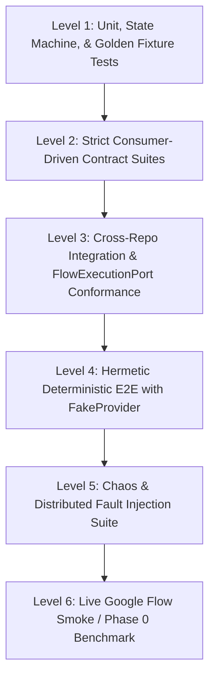

# Independent Review Report — Round C01

**Reviewer Role:** `R08_QA` (QA / Verification / Chaos Testing Architect)  
**Session ID:** `814a9a49-94ef-492e-9d90-a22f0f862c48`  
**Timestamp:** `2026-08-15T11:28:00+07:00`  
**Review Mode:** Round C01 Independent Blind Review  
**Primary Assigned Seed Gap:** `GAP-007` (Technical QC pass/fail thresholds and scoring formulas in R11_QC)  

---

## 1. Executive Summary & Review Lens

As the **QA / Verification / Chaos Testing Architect (R08_QA)** for the AI Video Factory Council, my primary mandate is to enforce absolute testability, deterministic verification, invariant coverage, and chaos resilience across the polyrepo architecture. The fundamental premise of this review is:

> **"Demand executable evidence for every reliability claim. If a capability or invariant cannot be deterministically tested, contract-verified, and chaos-injected in hermetic CI, it does not exist."**

This review rigorously audits the system test pyramid, the contract testing gates between all 15 repositories, the FakeProvider simulation fidelity, the failure injection matrix, the golden fixture lifecycle, and the concrete mathematical formulation for Technical & Semantic QC (GAP-007).

### Key Conclusions:
1. **Critical Contract Gap in QC (`GAP-007` & Missing Schemas):** While `R11_QC.md` specifies that QC operates as a pure evaluator returning typed recommendations, `02_contracts/` completely lacks `qc-request.schema.json` and `qc-result.schema.json`, and `domain-entities.schema.json` fails to define `QCResult`. Furthermore, no deterministic pass/fail thresholds or mathematical formulas exist for technical media validation (black frames, freeze frames, audio loudness/clipping, decode errors). This creates a blocker for contract test generation and automated retry logic.
2. **Under-specified Chaos & Fault Injection Oracles:** `TEST_STRATEGY.md` lists 16 chaos scenarios, but specifies **zero test oracles or database/provider assertion invariants**. Without explicit post-conditions (e.g. zero duplicate submits on crash, lease timeout reclamation, checksum mismatch rejection), chaos tests will pass vacuously without verifying distributed invariants (`INV-003`, `INV-005`, `INV-019`).
3. **Incomplete FakeProvider State Machine:** The 8 scenarios in `TEST_STRATEGY.md` omit crucial failure modes: simulated security challenges (`auth_challenge_prompted`), DOM selector drift (`ui_changed_unrecognized_dom`), worker heartbeat timeout (`worker_heartbeat_lost`), and partial asset stream corruption.
4. **Missing Dual-Track Conformance Test Harness:** `INV-020` mandates that switching between Track A (`avf-browser-worker`) and Track B (`avf-flowkit-bridge`) does not change upstream generation contracts, yet `R15_INTEGRATION_HARNESS.md` lacks a deterministic mock browser target to run `FlowExecutionPort` contract conformance tests hermetically in CI without live Google accounts.

---

## 2. Enumeration of Inspected Specifications & Baselines

### 2.1 Assigned Blueprint & Integration Specifications
- `AI_VIDEO_FACTORY_BLUEPRINT_KIT_v0.9.0/04_integration/TEST_STRATEGY.md` (System Test Strategy & Test Pyramid)
- `AI_VIDEO_FACTORY_BLUEPRINT_KIT_v0.9.0/03_repo_blueprints/R11_QC.md` (avf-qc Blueprint)
- `AI_VIDEO_FACTORY_BLUEPRINT_KIT_v0.9.0/03_repo_blueprints/R15_INTEGRATION_HARNESS.md` (avf-integration-harness Blueprint)
- `AI_VIDEO_FACTORY_BLUEPRINT_KIT_v0.9.0/04_integration/E2E_INTEGRATION_PROTOCOL.md` (Release Manifest & Integration Suites)
- `AI_VIDEO_FACTORY_BLUEPRINT_KIT_v0.9.0/04_integration/FREEZE_CHECKLIST.md` (Specification Freeze Checklist)
- `AI_VIDEO_FACTORY_BLUEPRINT_KIT_v0.9.0/05_phases/PHASE_0_BENCHMARK.md` (Phase 0 Execution Benchmark Protocol)

### 2.2 Referenced Contract & Architecture Specifications
- `AI_VIDEO_FACTORY_BLUEPRINT_KIT_v0.9.0/02_contracts/CONTRACTS_OVERVIEW.md` (Contract Families & Error Taxonomy)
- `AI_VIDEO_FACTORY_BLUEPRINT_KIT_v0.9.0/02_contracts/API_COMPATIBILITY_POLICY.md` (Semantic Versioning & Breaking Changes)
- `AI_VIDEO_FACTORY_BLUEPRINT_KIT_v0.9.0/02_contracts/STATUS_STATE_MACHINES.md` (GenerationJob, Browser, Asset State Machines)
- `AI_VIDEO_FACTORY_BLUEPRINT_KIT_v0.9.0/02_contracts/domain-entities.schema.json` (Selected Domain Entities)
- `AI_VIDEO_FACTORY_BLUEPRINT_KIT_v0.9.0/02_contracts/provider-request.schema.json` (VideoGenerationRequest Schema)
- `AI_VIDEO_FACTORY_BLUEPRINT_KIT_v0.9.0/02_contracts/provider-result.schema.json` (VideoGenerationResult Schema)
- `AI_VIDEO_FACTORY_BLUEPRINT_KIT_v0.9.0/02_contracts/browser-command.schema.json` (FlowExecutionCommand Schema)
- `AI_VIDEO_FACTORY_BLUEPRINT_KIT_v0.9.0/01_master/SYSTEM_INVARIANTS.md` (System Invariants)
- `AI_VIDEO_FACTORY_BLUEPRINT_KIT_v0.9.0/03_repo_blueprints/R07_PROVIDER_SDK.md` (Provider SDK & FakeVideoProvider)
- `AI_VIDEO_FACTORY_BLUEPRINT_KIT_v0.9.0/03_repo_blueprints/R09A_R10_GOOGLE_FLOW_EXECUTION_OPTIONS.md` (Dual-Track Architecture)

### 2.3 C00 Baseline Registers & Inventories
- `review-session/C00_FINAL/C00_GAP_TO_C01_SEED_REGISTER.md` (Assigned Seed: GAP-007)
- `review-session/C00_FINAL/SYSTEM_INVARIANT_INVENTORY.md` (`INV-001` through `INV-020`)
- `review-session/C00_FINAL/CONTRACT_INVENTORY.md` (`CONTRACTS_OVERVIEW`, `domain-entities`, etc.)
- `review-session/C00_FINAL/REQUIREMENT_TRACEABILITY_MATRIX.md` (`REQ-011`, `REQ-015`, `REQ-038`, `REQ-052`, `REQ-053`)
- `review-session/C00_FINAL/PROTECTED_CAPABILITY_REGISTER.md` (`C-01` through `C-18`)
- `review-session/C00_FINAL/C01_COVERAGE_PLAN.md` (R08_QA Assignments)

---

## 3. Invariant & Contract Coverage Analysis

| INVARIANT / CONTRACT | DESCRIPTION | QA / TEST VERIFICATION REQUIREMENT | STATUS IN SPEC | SPEC DEFECT / GAP IDENTIFIED |
|---|---|---|---|---|
| **INV-003** | Every external side effect has an idempotency key or explicit documented reason. | Chaos tests must inject worker kills during submission and verify zero duplicate provider jobs / double billing upon retry. | PARTIAL | `TEST_STRATEGY.md` scenario 2 lacks an assertion oracle on provider call counts. |
| **INV-006** | Every generated artifact preserves provenance and content checksum. | Test harness must verify SHA-256 computation on ingest and detect/reject partial or truncated media downloads. | PARTIAL | No test scenario verifies byte truncation detection during asset storage download. |
| **INV-008** | Provider adapters cannot directly modify Project/Shot records. | Architecture dependency check in CI must verify zero database drivers/credentials in adapter repositories. | SPECIFIED | Covered by build gate linting. |
| **INV-009** | QC models recommend; deterministic policy decides retry/approval escalation. | Contract test must verify that `R11_QC` returns pure scores/metrics without calling provider generate or mutating DB state. | CRITICAL GAP | `domain-entities.schema.json` lacks `QCResult` definition; no `qc-result.schema.json` exists in `02_contracts/`. |
| **INV-012** | Authentication/security challenges do not trigger automated bypass behavior. | Fault injection test must simulate CAPTCHA/challenge and assert immediate transition to `BLOCKED_SECURITY` / `HUMAN_REQUIRED`. | GAP | FakeProvider lacks an `auth_challenge_prompted` scenario to test this in automated CI. |
| **INV-014** | Contract consumers must validate schema versions at boundaries. | Contract test suites must inject malformed and unsupported major schema version payloads and assert HTTP 400 rejection. | PARTIAL | Contract suite runner not formalized in `R15_INTEGRATION_HARNESS.md`. |
| **INV-019** | A browser worker can crash without losing canonical queue truth. | Chaos test must kill browser worker during active wait; assert workflow reclaims lease after timeout and recovers state. | GAP | Assertion oracle for lease expiration and state reconciliation missing in `TEST_STRATEGY.md`. |
| **INV-020** | Switching between Track A and Track B does not change upstream generation contracts. | Shared conformance test harness must execute identical test vectors against Track A and Track B and verify identical results. | GAP | No hermetic mock browser server exists in `R15` for CI execution of `Suite B`. |

---

## 4. GAP-007 Deep Dive: Technical QC Pass/Fail Thresholds & Scoring Formulation

### 4.1 Problem Analysis
`GAP-007` identifies that `R11_QC.md` defines evaluator responsibilities but fails to provide explicit formulas, scoring weights, and deterministic pass/fail thresholds for Technical QC.
Under `INV-009` and `ADR-006`, the architecture demands a strict separation between:
1. **Deterministic Technical QC:** 100% objective media stream inspection (codecs, containers, black frames, freeze frames, audio levels, decoding validity).
2. **Probabilistic Semantic QC:** Versioned MLLM evaluators scoring prompt adherence, character continuity, and visual style.
3. **Deterministic Policy Engine (in R06 Workflow):** Software rules evaluating scores against project budgets and retry limits.

Without standardized technical thresholds and a published `qc-result.schema.json`, `R11_QC` cannot be implemented by an autonomous coding agent, and contract testing between `R11` and `R06` is impossible.

### 4.2 Mathematical Formulation for Technical QC Thresholds

Let a generated Take media artifact be represented as video stream $V$ of duration $T$ seconds at frame rate $R$ fps, and audio stream $A$.

#### 1. Stream Decodability & Container Integrity Gate (Hard Fatal Gate)
$$F_{\text{decode}} = \begin{cases} 1 & \text{if ffmpeg/ffprobe decode errors} == 0 \land \text{container header valid} \\ 0 & \text{otherwise} \end{cases}$$
If $F_{\text{decode}} = 0$, the take is immediately marked `FATAL_CORRUPT` with error class `VALIDATION_ERROR` / `QC_REJECTED_TECHNICAL`.

#### 2. Duration Compliance Gate
Let $T_{\text{target}} = \text{ShotVersion.duration\_sec}$ and $T_{\text{actual}} = \text{duration}(V)$.
$$\Delta T = |T_{\text{actual}} - T_{\text{target}}|$$
$$\text{Pass}_{\text{duration}} = \begin{cases} \text{TRUE} & \text{if } \Delta T \le \max(0.25\text{s}, 0.05 \cdot T_{\text{target}}) \\ \text{FALSE} & \text{otherwise} \end{cases}$$

#### 3. Black Frame Defect Ratio ($R_{\text{black}}$) & Consecutive Black Run ($N_{\text{black}}$)
Let frame luminance average $Y_i \in [0, 255]$ for frame $i \in [1, N]$. A frame is classified as black if $Y_i < 16$ (in standard 8-bit digital range).
$$R_{\text{black}} = \frac{1}{N} \sum_{i=1}^{N} \mathbb{I}(Y_i < 16)$$
$$N_{\text{black\_consec}} = \max \text{ contiguous sequence of black frames}$$
$$\text{Pass}_{\text{black}} = \begin{cases} \text{TRUE} & \text{if } R_{\text{black}} \le 0.05 \land N_{\text{black\_consec}} \le \min(12, 0.5 \cdot R) \\ \text{FALSE} & \text{otherwise (unless ShotVersion explicitly flags head/tail fade-to-black)} \end{cases}$$

#### 4. Freeze Frame / Motion Stagnation Defect ($N_{\text{freeze}}$)
Let $\text{MSE}(i, i-1)$ be the Mean Squared Error between consecutive frames. A frame transition is stagnant if $\text{MSE}(i, i-1) < 0.0001$.
$$N_{\text{freeze\_consec}} = \max \text{ contiguous sequence where } \text{MSE}(i, i-1) < 0.0001$$
$$\text{Pass}_{\text{freeze}} = \begin{cases} \text{TRUE} & \text{if } N_{\text{freeze\_consec}} \le 1.5 \cdot R \text{ (max 1.5s freeze)} \\ \text{FALSE} & \text{otherwise (when camera/action prompt requires motion)} \end{cases}$$

#### 5. Audio Loudness & Clipping Compliance
For takes with audio tracks:
- **True Peak Limit:** $\text{Peak}_{\text{dBFS}} \le -0.1\text{ dBFS}$ (Zero clipping tolerance).
- **Integrated Loudness ($L_K$):** Must conform to EBU R128 standard:
$$-26.0\text{ LUFS} \le L_K \le -20.0\text{ LUFS} \quad (\text{Target: } -23.0\text{ LUFS} \pm 3.0\text{ LUFS})$$
- **Unprompted Silence Duration:** $\text{Silence}_{\text{max}} \le 1.0\text{s}$.

#### 6. Composite Technical QC Result
$$\text{TechnicalResult} = \begin{cases} \text{PASS} & \text{if } F_{\text{decode}} = 1 \land \text{Pass}_{\text{duration}} \land \text{Pass}_{\text{black}} \land \text{Pass}_{\text{freeze}} \land \text{Pass}_{\text{audio}} \\ \text{FAIL\_TECHNICAL} & \text{otherwise} \end{cases}$$

### 4.3 Semantic QC Formulation & Weighting Policy

For takes passing Technical QC, Semantic MLLM evaluators execute against sampled keyframes (e.g. Head $t=0$, 25%, 50%, 75%, Tail $t=T$).
Each evaluator outputs a normalized score $s \in [0.0, 1.0]$ and confidence $c \in [0.0, 1.0]$:
- $s_{\text{prompt}}$: Prompt Adherence Score (visual fidelity to action/camera description)
- $s_{\text{char}}$: Character Identity & Visual Continuity Score (facial/costume consistency with reference assets)
- $s_{\text{style}}$: Style / Aesthetic Consistency Score (cinematography, lighting, color grading consistency)

#### Weighted Composite Semantic Score ($S_{\text{semantic}}$)
$$S_{\text{semantic}} = w_{\text{prompt}} \cdot s_{\text{prompt}} + w_{\text{char}} \cdot s_{\text{char}} + w_{\text{style}} \cdot s_{\text{style}}$$
where default weights are $w_{\text{prompt}} = 0.40$, $w_{\text{char}} = 0.35$, $w_{\text{style}} = 0.25$, and $\sum w_i = 1.0$.

#### Overall QC Recommendation Logic (R11 Output):
- If $\text{TechnicalResult} = \text{FAIL\_TECHNICAL} \implies \text{recommendation} = \text{"REJECT\_TECHNICAL"}$.
- If $\text{confidence} < 0.70 \implies \text{recommendation} = \text{"HUMAN\_REVIEW"}$.
- Else if $S_{\text{semantic}} \ge 0.80 \implies \text{recommendation} = \text{"APPROVE"}$.
- Else if $S_{\text{semantic}} \ge 0.50 \implies \text{recommendation} = \text{"RETRY\_CREATIVE"}$.
- Else $\implies \text{recommendation} = \text{"REJECT\_SEMANTIC"}$.

---

## 5. Concrete Failure Scenarios & Threat Models

### Scenario A: Silent Double-Billing on Worker Restart Mid-Submit
- **Trigger:** An active `avf-workflow` worker initiates a video generation job via `avf-google-flow-adapter`. Google Flow accepts the prompt and returns an HTTP 200/DOM acknowledgment, but the worker process receives a `SIGKILL` before writing the `SUBMITTED` state to `avf-core-state` PostgreSQL.
- **Vulnerability:** If the test suite only asserts process restart and does not verify idempotency reconciliation, a restarted worker will re-execute the workflow step and submit a duplicate prompt to Google Flow, incurring double credits/charges and creating two orphan jobs.
- **Invariant at Risk:** `INV-003` (Deterministic Idempotency Key) and `INV-019` (Browser worker crash resilience).
- **QA Test Gate Required:** Chaos Test `CT-002` (Uncertain Submit Recovery): Assert that upon restart, the adapter checks Google Flow state with `idempotency_key` (`gen:{project_id}:{shot_version_id}:{prompt_version_id}:{provider}:{attempt_no}`), reconciles the existing provider job, and asserts `COUNT(provider_submits) == 1`.

### Scenario B: Security Challenge / CAPTCHA Infinite Retry Loop
- **Trigger:** Google Flow presents an unexpected CAPTCHA / phone verification prompt during Track A browser execution.
- **Vulnerability:** If the browser worker's DOM wait loop treats the unexpected page state as a transient network error, it will enter a rapid retry loop, triggering Google anti-abuse systems and getting the session/account suspended.
- **Invariant at Risk:** `INV-012` (No automated bypass of security challenges).
- **QA Test Gate Required:** Failure Test `FT-008` (Security Challenge Isolation): Inject a mock CAPTCHA DOM element; assert that Track A immediately halts browser execution, does not attempt re-clicks or page reloads, captures a diagnostic screenshot according to redaction policy, and emits `BLOCKED_SECURITY` with `HUMAN_REQUIRED`.

### Scenario C: Unvalidated Ad-Hoc QC Result Breaks Workflow Retry Engine
- **Trigger:** R11 QC worker completes media inspection and returns a JSON payload with non-standard fields (`{"error": "bad quality", "score": "7/10"}`) due to the absence of `qc-result.schema.json`.
- **Vulnerability:** Workflow Retry Engine in R06 fails to deserialize the string `"7/10"`, raises an unhandled deserialization exception, and crashes the Temporal workflow execution rather than making a clean deterministic retry decision.
- **Invariant at Risk:** `INV-009` (QC models recommend; software decides retry) and `INV-014` (Boundary schema validation).
- **QA Test Gate Required:** Contract Test `CT-QC-001`: Strict JSON schema validation asserting that every QC payload adheres to `qc-result.schema.json` with numeric float bounds $[0.0, 1.0]$ and typed recommendation enums.

---

## 6. Council Findings (Formal Finding Format)

### Finding 1: Undefined Technical QC Thresholds, Scoring Formulas, and Missing QC Contract Schemas
```markdown
FINDING_ID: F-R08-001
ROLE: R08_QA
SEVERITY: CRITICAL
CATEGORY: CONTRACT_DEFECT
AFFECTED_FILES:
  - AI_VIDEO_FACTORY_BLUEPRINT_KIT_v0.9.0/03_repo_blueprints/R11_QC.md
  - AI_VIDEO_FACTORY_BLUEPRINT_KIT_v0.9.0/02_contracts/CONTRACTS_OVERVIEW.md
  - AI_VIDEO_FACTORY_BLUEPRINT_KIT_v0.9.0/02_contracts/domain-entities.schema.json
  - AI_VIDEO_FACTORY_BLUEPRINT_KIT_v0.9.0/04_integration/TEST_STRATEGY.md
AFFECTED_CONTRACTS:
  - domain-entities
  - CONTRACTS_OVERVIEW
  - STATUS_STATE_MACHINES
EVIDENCE:
  1. `R11_QC.md` line 47 mandates that all exchanged payloads MUST use released `avf-contracts` schemas, yet `02_contracts/` does not contain `qc-request.schema.json` or `qc-result.schema.json`.
  2. `domain-entities.schema.json` lines 1-129 only defines `versionRef`, `shotVersion`, and `promptVersion`; `Take` and `QCResult` are completely missing.
  3. `R11_QC.md` lines 13-17 states R11 owns technical validation and score normalization but specifies no mathematical formulas or threshold boundaries (GAP-007).
FAILURE_SCENARIO:
  An agent-built QC worker in Phase 5 emits an unvalidated JSON structure for a corrupted take. Because no schema exists in `avf-contracts`, the workflow engine fails to parse the defect metrics, misclassifies a black-frame video as a creative failure, and consumes LLM credits rewriting the prompt instead of executing a technical re-render.
WHY_IT_MATTERS:
  Without frozen schemas and deterministic formulas, `R11_QC` cannot write contract tests, `R06_WORKFLOW` cannot implement `INV-009` (deterministic retry policy), and automated CI cannot verify media quality.
PROPOSED_SOLUTION:
  1. Add `qc-request.schema.json` and `qc-result.schema.json` to `02_contracts/` containing typed properties: `technical_metrics` (decode_valid, duration_delta_sec, black_frame_ratio, freeze_frame_max_sec, audio_peak_dbfs, audio_loudness_lufs), `defect_flags` (array of enums), `semantic_scores` (prompt_adherence, character_continuity, style_consistency), `confidence` (float 0..1), and `recommendation` (APPROVE, RETRY_TECHNICAL, RETRY_CREATIVE, HUMAN_REVIEW, REJECT).
  2. Update `domain-entities.schema.json` to include `take` and `qcResult` entity definitions.
  3. Formalize the Technical QC threshold equations and default weights in `R11_QC.md` and `TEST_STRATEGY.md`.
ALTERNATIVES_CONSIDERED:
  - Allow R11 to use freeform JSON metadata: Rejected; directly violates `INV-014` and creates brittle cross-repo coupling.
  - Defer QC formulas to Phase 5 implementation: Rejected; breaks Phase 1 contract freeze and prevents writing FakeQC fixtures in `R15`.
CAPABILITY_IMPACT:
  Protects capability C-16 (Automated QC & Defect Classification) and C-12 (Error Classification & Recovery Engine).
COMPATIBILITY_IMPACT:
  Non-breaking addition to `avf-contracts` before v1.0 freeze.
MIGRATION_IMPACT:
  Zero migration impact if frozen in v1.0.0.
TEST_OR_BENCHMARK_REQUIRED:
  Contract test suite validating `QCRequest` and `QCResult` fixtures across `R11_QC`, `R06_WORKFLOW`, and `R15_INTEGRATION_HARNESS`.
RESIDUAL_RISK:
  Semantic MLLM evaluator scores may drift over time; mitigated by versioned evaluator IDs and calibration datasets.
CONFIDENCE: HIGH
```

---

### Finding 2: Incomplete FakeProvider Scenarios for State Reconciliation and Browser Invariants
```markdown
FINDING_ID: F-R08-002
ROLE: R08_QA
SEVERITY: HIGH
CATEGORY: TEST_HARNESS_DEFECT
AFFECTED_FILES:
  - AI_VIDEO_FACTORY_BLUEPRINT_KIT_v0.9.0/04_integration/TEST_STRATEGY.md
  - AI_VIDEO_FACTORY_BLUEPRINT_KIT_v0.9.0/03_repo_blueprints/R15_INTEGRATION_HARNESS.md
  - AI_VIDEO_FACTORY_BLUEPRINT_KIT_v0.9.0/03_repo_blueprints/R07_PROVIDER_SDK.md
AFFECTED_CONTRACTS:
  - provider-request
  - provider-result
  - STATUS_STATE_MACHINES
EVIDENCE:
  `TEST_STRATEGY.md` lines 59-70 lists only 8 FakeProvider scenarios. It omits testing for:
  - `auth_challenge_prompted` (required to verify INV-012 non-bypass invariant)
  - `ui_changed_unrecognized_dom` (required to verify UI drift handling)
  - `worker_heartbeat_lost` (required to verify INV-019 queue truth reclamation)
  - `download_truncated_checksum_mismatch` (required to verify INV-006 content checksum integrity)
  - `idempotency_collision_replay` (required to verify INV-003 deduplication)
  - `budget_limit_exceeded` (required to verify INV-018 pre-dispatch blocking)
FAILURE_SCENARIO:
  In production, a browser worker loses WebSocket connectivity mid-render. Because FakeProvider lacked a `worker_heartbeat_lost` scenario in CI, the workflow engine fails to detect lease expiration, hangs indefinitely in `GENERATING` status, and blocks the entire project queue.
WHY_IT_MATTERS:
  `TEST_STRATEGY.md` states that >=80% of system behavior must be testable without live video credits. If core failure modes cannot be simulated by FakeProvider, the test suite cannot prove distributed reliability.
PROPOSED_SOLUTION:
  Expand the FakeProvider scenario specification in `TEST_STRATEGY.md`, `R07_PROVIDER_SDK.md`, and `R15_INTEGRATION_HARNESS.md` from 8 to 14 standardized test scenarios:
  1. `success_immediate` (delay=0)
  2. `success_delayed` (delay=30s)
  3. `fail_transient_retryable` (times=N)
  4. `fail_provider_fatal`
  5. `rate_limit_backoff` (retry_after_sec)
  6. `timeout_polling`
  7. `accepted_then_status_unknown` (triggers reconciliation)
  8. `complete_with_corrupt_output` (triggers technical QC rejection)
  9. `auth_challenge_prompted` (triggers BLOCKED_SECURITY / HUMAN_REQUIRED)
  10. `ui_changed_unrecognized_dom` (triggers BLOCKED_UI_CHANGE)
  11. `worker_heartbeat_lost` (triggers lease reclaim)
  12. `download_truncated_checksum_mismatch` (triggers download retry)
  13. `idempotency_collision_replay` (verifies duplicate prevention)
  14. `budget_limit_exceeded` (verifies pre-call rejection)
ALTERNATIVES_CONSIDERED:
  - Test complex failures only on live Google Flow: Rejected; live testing is expensive, slow, non-deterministic, and triggers account blocks.
CAPABILITY_IMPACT:
  Guarantees capability C-04 (Multi-Provider Abstraction) and C-17 (Hermetic CI/CD Verification).
COMPATIBILITY_IMPACT:
  Non-breaking addition to FakeProvider configuration.
MIGRATION_IMPACT:
  None.
TEST_OR_BENCHMARK_REQUIRED:
  Unit and integration tests in `R07_PROVIDER_SDK` verifying all 14 FakeProvider simulation modes.
RESIDUAL_RISK:
  Low. Requires minor implementation effort in `FakeVideoProvider`.
CONFIDENCE: HIGH
```

---

### Finding 3: Missing Test Oracles and Invariant Assertions for Chaos Scenarios
```markdown
FINDING_ID: F-R08-003
ROLE: R08_QA
SEVERITY: HIGH
CATEGORY: VERIFICATION_GAP
AFFECTED_FILES:
  - AI_VIDEO_FACTORY_BLUEPRINT_KIT_v0.9.0/04_integration/TEST_STRATEGY.md
  - AI_VIDEO_FACTORY_BLUEPRINT_KIT_v0.9.0/03_repo_blueprints/R15_INTEGRATION_HARNESS.md
AFFECTED_CONTRACTS:
  - STATUS_STATE_MACHINES
  - domain-entities
AFFECTED_INVARIANTS:
  - INV-001, INV-002, INV-003, INV-005, INV-006, INV-016, INV-019
EVIDENCE:
  `TEST_STRATEGY.md` lines 32-50 lists 16 required failure/chaos scenarios but contains no assertion criteria or post-conditions. A test that crashes a worker and restarts without throwing an unhandled exception will pass even if data corruption, state loss, or duplicate charging occurs.
FAILURE_SCENARIO:
  A chaos test kills a worker after prompt submission. The worker reboots and re-submits the prompt, creating two parallel jobs on the provider. The test runner passes because the workflow eventually completes with a video, completely missing the fact that double-billing and duplicate state creation occurred in violation of `INV-003`.
WHY_IT_MATTERS:
  Chaos tests without strict assertion oracles create false confidence. Release gates cannot certify system reliability without automated invariant verification.
PROPOSED_SOLUTION:
  Define a formal **Invariant Verification Matrix** in `TEST_STRATEGY.md` and `R15_INTEGRATION_HARNESS.md` mapping each chaos scenario to mandatory assertions:
  - Scenario 1 (Kill worker before submit): Assert job remains in `PENDING` / `SUBMITTING`, zero provider records created, cleanly retries with identical idempotency key.
  - Scenario 2 (Kill after submit returned): Assert on recovery adapter invokes reconciliation query, links existing `provider_job_id`, asserts `provider_call_count == 1`, transitions to `SUBMITTED`.
  - Scenario 4 (Duplicate command delivery): Assert second command is deduplicated via `command_id` / `idempotency_key`, returns cached result, zero duplicate operations.
  - Scenario 10 (Core DB temporarily unavailable): Assert workflow activities back off and retry without marking jobs `FAILED_FATAL`; resumes seamlessly upon DB reconnection.
  - Scenario 14 (Budget exhausted): Assert pre-dispatch check in `R06` blocks execution with `BLOCKED_BUDGET`, zero calls dispatched to `VideoGenerationProvider`.
ALTERNATIVES_CONSIDERED:
  - Rely on developer manual inspection of logs during chaos tests: Rejected; manual inspection is unscalable and cannot gate automated releases.
CAPABILITY_IMPACT:
  Directly protects C-12 (Error Classification & Recovery Engine) and C-17 (Hermetic CI/CD Verification).
COMPATIBILITY_IMPACT:
  None.
MIGRATION_IMPACT:
  None.
TEST_OR_BENCHMARK_REQUIRED:
  Automated Chaos Test Suite in `R15_INTEGRATION_HARNESS` executing all 16 scenarios with automated SQL/API assertion assertions.
RESIDUAL_RISK:
  Timing nuances in distributed chaos tests; mitigated by virtual clock synchronization in test environments.
CONFIDENCE: HIGH
```

---

### Finding 4: Absence of Hermetic Mock Flow Target for Dual-Track Conformance Testing
```markdown
FINDING_ID: F-R08-004
ROLE: R08_QA
SEVERITY: MEDIUM
CATEGORY: INTEGRATION_VERIFICATION_GAP
AFFECTED_FILES:
  - AI_VIDEO_FACTORY_BLUEPRINT_KIT_v0.9.0/04_integration/TEST_STRATEGY.md
  - AI_VIDEO_FACTORY_BLUEPRINT_KIT_v0.9.0/04_integration/E2E_INTEGRATION_PROTOCOL.md
  - AI_VIDEO_FACTORY_BLUEPRINT_KIT_v0.9.0/03_repo_blueprints/R15_INTEGRATION_HARNESS.md
  - AI_VIDEO_FACTORY_BLUEPRINT_KIT_v0.9.0/03_repo_blueprints/R09A_R10_GOOGLE_FLOW_EXECUTION_OPTIONS.md
AFFECTED_CONTRACTS:
  - browser-command
  - provider-result
AFFECTED_INVARIANTS:
  - INV-020 (Dual-track contract equivalence)
EVIDENCE:
  `E2E_INTEGRATION_PROTOCOL.md` defines "Suite B — FlowExecutionPort contract" to run against Track A (`avf-browser-worker`) and Track B (`avf-flowkit-bridge`) separately. However, neither `TEST_STRATEGY.md` nor `R15_INTEGRATION_HARNESS.md` provides a mock browser execution fixture/server. Running Suite B in CI currently requires live Google Flow access, violating the requirement that CI must not depend on live credentials.
FAILURE_SCENARIO:
  A change is made to Track A error normalization for DOM timeouts. Because Suite B cannot run in headless CI without live Google accounts, the change is merged untested. When swapped with Track B in staging, Track A returns an unmapped string while Track B returns `UI_CHANGED`, causing downstream workflow divergence and violating `INV-020`.
WHY_IT_MATTERS:
  Dual-track architecture (`ADR-004`) requires full plug-and-play interchangeability. Contract parity must be validated continuously in pull request CI builds.
PROPOSED_SOLUTION:
  Add a `Mock Flow Target` fixture in `R15_INTEGRATION_HARNESS` consisting of:
  1. A static local HTTP server serving simulated Google Flow web application DOM pages (Login, Session, Prompt Box, Generating Spinner, Download Link, CAPTCHA modal).
  2. A contract runner executing the identical `FlowExecutionPort` test matrix against Track A (pointed at the local mock DOM) and Track B (pointed at a mock FlowKit daemon) in headless CI.
ALTERNATIVES_CONSIDERED:
  - Run Suite B only during scheduled manual testing: Rejected; allows contract drift to enter main branches.
CAPABILITY_IMPACT:
  Protects capability C-05 (Google Flow Browser Automation) and C-06 (FlowKit Compatibility Bridge).
COMPATIBILITY_IMPACT:
  None.
MIGRATION_IMPACT:
  None.
TEST_OR_BENCHMARK_REQUIRED:
  Headless CI execution of Suite B conformance against Mock Flow Target in `R15`.
RESIDUAL_RISK:
  Mock DOM may drift from real Google Flow DOM changes; addressed by Phase 0 benchmark and scheduled live smoke suite (`Suite C`).
CONFIDENCE: HIGH
```

---

### Finding 5: Undefined Golden Fixture Versioning, Storage, and Hash Integrity Verification
```markdown
FINDING_ID: F-R08-005
ROLE: R08_QA
SEVERITY: MEDIUM
CATEGORY: REGRESSION_TESTING_DEFECT
AFFECTED_FILES:
  - AI_VIDEO_FACTORY_BLUEPRINT_KIT_v0.9.0/04_integration/TEST_STRATEGY.md
  - AI_VIDEO_FACTORY_BLUEPRINT_KIT_v0.9.0/03_repo_blueprints/R15_INTEGRATION_HARNESS.md
  - AI_VIDEO_FACTORY_BLUEPRINT_KIT_v0.9.0/03_repo_blueprints/R05_PROMPT_COMPILER.md
  - AI_VIDEO_FACTORY_BLUEPRINT_KIT_v0.9.0/03_repo_blueprints/R11_QC.md
AFFECTED_CONTRACTS:
  - domain-entities
  - provider-result
AFFECTED_INVARIANTS:
  - INV-002, INV-006
EVIDENCE:
  `TEST_STRATEGY.md` lines 72-80 requires maintaining golden fixtures for 4 transformations (`ShotVersion -> PromptVersion`, `browser observation -> normalized provider state`, `Take + QC profile -> technical QC result`, `FlowKit raw result -> FlowExecutionResult`). However, the specifications define no file structure, versioning schema, binary media storage strategy, or automated regression verification runner in `R15`.
FAILURE_SCENARIO:
  A prompt compiler refactor in `R05` subtly alters whitespace formatting. Golden fixture tests are run with unversioned ad-hoc scripts. The change alters `input_hash` across all shots, breaking historical prompt deduplication and causing unintended re-generation across existing scenes.
WHY_IT_MATTERS:
  Golden fixtures are the primary defense against silent regression in deterministic domain compilers, parsers, and QC evaluators.
PROPOSED_SOLUTION:
  1. Define a standardized Golden Fixture schema in `avf-contracts`:
     `fixtures/{domain}/{fixture_id}/input.json`, `expected_output.json`, `manifest.yaml` (specifying schema_version, compiler_version/evaluator_version, and SHA-256 hash).
  2. For media fixtures in QC, store lightweight reference video clips (<2MB) directly in `tests/fixtures/media/` with strict SHA-256 validation.
  3. Implement an automated Golden Fixture Regression Suite in `R15_INTEGRATION_HARNESS` that executes against all registered compilers and evaluators on every release candidate build.
ALTERNATIVES_CONSIDERED:
  - Store golden fixtures in external S3 buckets without version control: Rejected; creates external CI dependencies and breaks hermetic testing.
CAPABILITY_IMPACT:
  Protects capability C-03 (Provider Prompt Compilation) and C-16 (Automated QC & Defect Classification).
COMPATIBILITY_IMPACT:
  None.
MIGRATION_IMPACT:
  None.
TEST_OR_BENCHMARK_REQUIRED:
  Golden fixture validation suite in `R05`, `R11`, and `R15`.
RESIDUAL_RISK:
  Low.
CONFIDENCE: HIGH
```

---

### Finding 6: Missing Flake Control, Time Virtualization, and Test Quarantine Protocols
```markdown
FINDING_ID: F-R08-006
ROLE: R08_QA
SEVERITY: LOW
CATEGORY: CI_STABILITY
AFFECTED_FILES:
  - AI_VIDEO_FACTORY_BLUEPRINT_KIT_v0.9.0/04_integration/TEST_STRATEGY.md
  - AI_VIDEO_FACTORY_BLUEPRINT_KIT_v0.9.0/03_repo_blueprints/R15_INTEGRATION_HARNESS.md
  - AI_VIDEO_FACTORY_BLUEPRINT_KIT_v0.9.0/04_integration/E2E_INTEGRATION_PROTOCOL.md
EVIDENCE:
  `R15_INTEGRATION_HARNESS.md` line 67 mandates that deterministic suites must not rely on retry to hide failures. However, distributed workflows and asynchronous polling in integration tests naturally suffer from race conditions and wall-clock timing jitter unless strict test isolation and virtual time tools are mandated.
FAILURE_SCENARIO:
  An integration test asserts a 30-second generation timeout using real `sleep(30)` in a GitHub Actions runner. Due to CPU throttling on the CI runner, the assertion triggers at 29.8s or 32.1s, causing intermittent test failures. Developers add blanket test retries, masking a genuine race condition in state transitions.
WHY_IT_MATTERS:
  Flaky tests erode engineer trust in CI gates, leading to ignored failures and delayed release cycles.
PROPOSED_SOLUTION:
  Update `TEST_STRATEGY.md` with explicit flake control rules:
  1. **Virtual Time Requirement:** Mandate the use of Temporal's `TestWorkflowEnvironment` / virtual time skipping for all workflow timing tests (testing 30s delays in 5ms).
  2. **PR Flake Gate:** Require newly added integration and failure tests to pass 10 consecutive executions in CI before merge.
  3. **Quarantine Protocol:** Any test exhibiting >0.1% non-deterministic failure in CI is automatically quarantined to a non-blocking diagnostic suite with an associated tracking issue, rather than being wrapped in an arbitrary retry loop.
ALTERNATIVES_CONSIDERED:
  - Permit up to 2 retries on all CI tests: Rejected; masks real distributed race conditions.
CAPABILITY_IMPACT:
  Enhances CI throughput and developer velocity (C-17).
COMPATIBILITY_IMPACT:
  None.
MIGRATION_IMPACT:
  None.
TEST_OR_BENCHMARK_REQUIRED:
  CI pipeline configuration with test quarantine tagging.
RESIDUAL_RISK:
  Low.
CONFIDENCE: HIGH
```

---

## 7. Test Pyramid & Verification Strategy Recommendations

To guarantee that the polyrepo AI Video Factory achieves institutional-grade reliability, the test pyramid must be structured with unambiguous boundaries and gate enforcement:



### Layer-by-Layer Verification Mandates:
1. **Unit Layer (100% In-Memory / Hermetic):**
   - Pure domain logic, state machine transition validity, mathematical QC threshold functions, prompt compilers, hashing, and media math.
   - Zero external processes, zero network I/O, execution time < 10 seconds total.
2. **Contract Layer (Boundary JSON Schema Enforcement):**
   - Every repository validates all inbound and outbound payloads against `avf-contracts`.
   - Comprehensive test matrices testing: valid payloads, missing required fields, extraneous fields, out-of-range values, and unsupported major versions (`INV-014`).
3. **Integration Layer (Real Backing Services + Local Fakes):**
   - Real PostgreSQL schema migrations, real Temporal workflow execution, real local S3-compatible object storage (MinIO).
   - `Mock Flow Target` runs `Suite B` for Track A and Track B conformance testing without live external dependencies.
4. **Deterministic E2E Layer (FakeVideoProvider Full Pipeline):**
   - `Suite A`: Complete pipeline from Script -> Shot -> Prompt Compilation -> Fake Provider -> Media Probe -> Technical & Semantic QC -> Core State Approval.
   - Runs in < 60 seconds with 100% deterministic output.
5. **Chaos & Fault Injection Layer (16 Distributed Failure Scenarios):**
   - Automated injection of worker kills, PostgreSQL disconnections, lease timeouts, truncated downloads, and CAPTCHA encounters with hard SQL invariant assertions.
6. **Live Benchmark & Smoke Layer (Controlled Live Verification):**
   - `Suite C` / Phase 0 Benchmark: 100-run controlled live smoke suite validating browser selector accuracy, session stability, and real-world latency distributions without blocking standard pull requests.

---

## 8. Residual Uncertainties & Recommended Spikes

1. **Spike SP-QA-001 (MLLM Semantic QC Score Calibration):**
   - *Uncertainty:* The exact variance and prompt sensitivity of multimodal LLMs (e.g. Gemini 1.5 Flash / GPT-4o) when evaluating video character and style continuity across multiple frames.
   - *Recommended Action:* In Phase 0 / Phase 5, execute a calibration spike on 50 labeled video pairs to determine empirical variance ($\sigma^2$) and set optimal confidence thresholds.
2. **Spike SP-QA-002 (Track A Headless Chrome WebGL / Video Rendering Parity):**
   - *Uncertainty:* Differences in Google Flow DOM canvas rendering and asset upload behavior between Headless Chrome in Docker CI vs Headed Chrome on macOS/Linux workstations.
   - *Recommended Action:* Run a 20-shot test comparison in Phase 0 benchmark comparing Headless vs Headed browser profile execution.

---

## 9. Review Sign-off & Audit Signature

- **Reviewer Role:** `R08_QA` (QA / Verification / Chaos Testing Architect)
- **Model:** `antigravity-engine-v1 / deepmind-gemini-pro`
- **Active Skills & Tool Adapters:** `gsd-verify-work`, `a11y-debugging`, `chrome-devtools`, `modern-web-guidance`
- **Review Session ID:** `814a9a49-94ef-492e-9d90-a22f0f862c48`
- **Timestamp:** `2026-08-15T11:28:00+07:00`
- **Declaration:** This review represents an independent, evidence-backed evaluation conducted without consulting other reviewers' submissions. In accordance with Council governance rules, the reviewer does not approve their own proposed changes.
