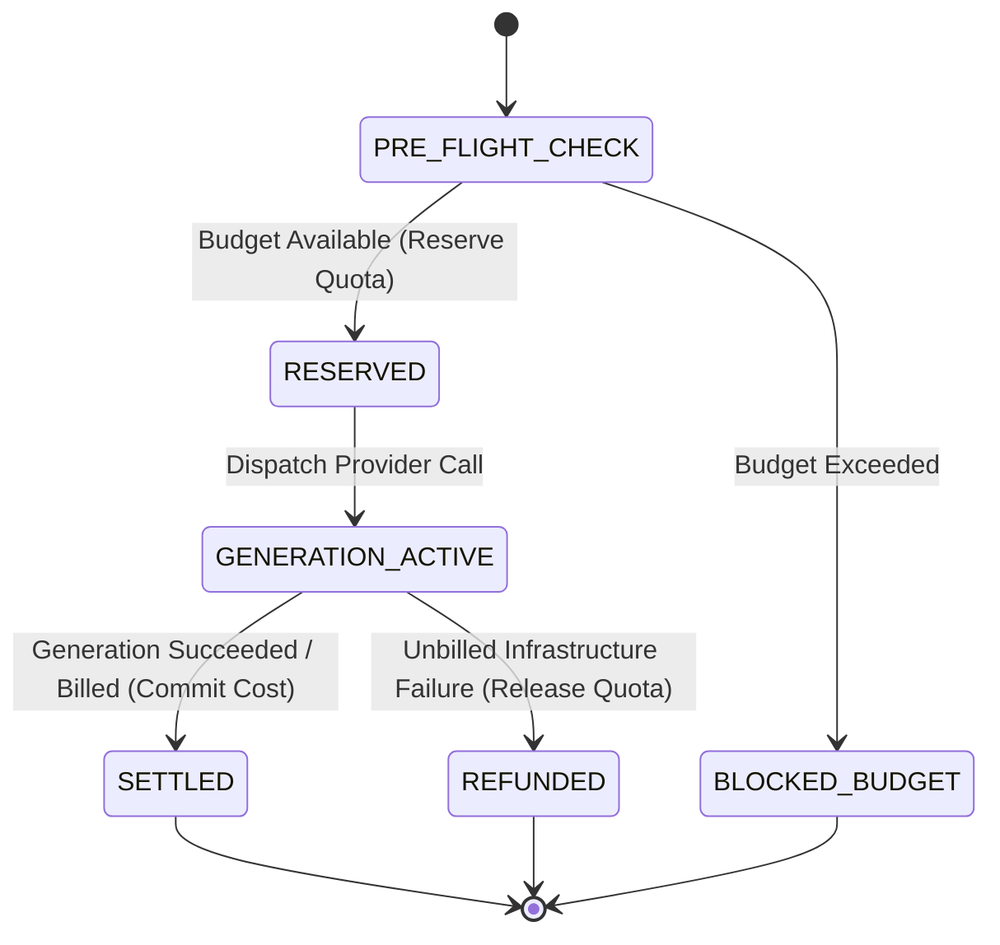

# R14 — Performance / Cost / Capacity Review (Round C01)

**Reviewer Role:** R14_PERF_COST (Performance / Cost / Capacity Reviewer)  
**Round:** C01 Independent Blind Review  
**Session ID:** 82338259-add1-4c63-8553-9f4fee313d1a  
**Model / Agent:** Google DeepMind Antigravity (Advanced Agentic Coding)  
**Timestamp:** 2026-08-15T11:29:00+07:00  

---

## 1. Executive Summary & Review Scope

As the Performance, Cost, and Capacity Reviewer (R14) for Round C01, this independent review evaluates the AI Video Factory architectural baseline (`v0.9.0` Blueprint Kit and `C00_FINAL` baseline) through the quantitative lens of:
- **Generation Latency & Bottlenecks:** End-to-end pipeline latency across prompt compilation, browser orchestration, asset staging, video generation, download, technical/semantic QC, and media assembly.
- **Rate Limits & Anti-Abuse Pacing:** Provider and proxy concurrency constraints, quota management, and jittered exponential backoff mechanics.
- **Browser & Proxy Concurrency Scalability:** Memory/CPU footprints of Chrome MV3/Playwright sessions, process recycling, loopback WebSocket vs Native Messaging transport saturation, and worker node capacity limits.
- **CostUsageRecord Accounting & Budgeting:** Completeness of the cost ledger schema, multi-stage cost attribution (LLM tokens, provider credits, proxy bandwidth, MLLM QC inference, storage, compute), pre-flight budget reservation (`INV-018`), and failure/retry accounting.
- **Total Cost of Ownership (TCO) & Unit Economics:** Effective cost per approved video minute under realistic retry/rejection distributions.
- **Phase 0 Benchmark Protocol Rigor:** Completeness of the 100-run single-shot benchmark protocol (`PHASE_0_BENCHMARK.md`, `REQ-053`).
- **Resolution of Assigned Gap Seed GAP-009:** Standardizing OpenTelemetry metric naming conventions, Prometheus metric types, latency bucket boundaries, and label dimensions.

---

## 2. Enumeration of Inspected Specification Files

The following files from the specification repository and review baseline were thoroughly inspected:

1. `AI_VIDEO_FACTORY_BLUEPRINT_KIT_v0.9.0/05_phases/PHASE_0_BENCHMARK.md` (Assigned Primary)
2. `AI_VIDEO_FACTORY_BLUEPRINT_KIT_v0.9.0/05_phases/PHASE_ROADMAP.md` (Assigned Primary)
3. `AI_VIDEO_FACTORY_BLUEPRINT_KIT_v0.9.0/01_master/DATA_MODEL.md` (Assigned Primary - `CostUsageRecord` & core entities)
4. `AI_VIDEO_FACTORY_BLUEPRINT_KIT_v0.9.0/01_master/SYSTEM_INVARIANTS.md` (INV-001 through INV-020, specifically INV-003, INV-009, INV-010, INV-011, INV-015, INV-018, INV-019, INV-020)
5. `AI_VIDEO_FACTORY_BLUEPRINT_KIT_v0.9.0/01_master/MASTER_BLUEPRINT.md`
6. `AI_VIDEO_FACTORY_BLUEPRINT_KIT_v0.9.0/02_contracts/CONTRACTS_OVERVIEW.md`
7. `AI_VIDEO_FACTORY_BLUEPRINT_KIT_v0.9.0/02_contracts/STATUS_STATE_MACHINES.md`
8. `AI_VIDEO_FACTORY_BLUEPRINT_KIT_v0.9.0/02_contracts/domain-entities.schema.json`
9. `AI_VIDEO_FACTORY_BLUEPRINT_KIT_v0.9.0/02_contracts/provider-request.schema.json`
10. `AI_VIDEO_FACTORY_BLUEPRINT_KIT_v0.9.0/02_contracts/provider-result.schema.json`
11. `AI_VIDEO_FACTORY_BLUEPRINT_KIT_v0.9.0/02_contracts/browser-command.schema.json`
12. `AI_VIDEO_FACTORY_BLUEPRINT_KIT_v0.9.0/02_contracts/event-envelope.schema.json`
13. `AI_VIDEO_FACTORY_BLUEPRINT_KIT_v0.9.0/02_contracts/API_COMPATIBILITY_POLICY.md`
14. `AI_VIDEO_FACTORY_BLUEPRINT_KIT_v0.9.0/03_repo_blueprints/R02_CORE_STATE.md`
15. `AI_VIDEO_FACTORY_BLUEPRINT_KIT_v0.9.0/03_repo_blueprints/R06_WORKFLOW.md`
16. `AI_VIDEO_FACTORY_BLUEPRINT_KIT_v0.9.0/03_repo_blueprints/R07_PROVIDER_SDK.md`
17. `AI_VIDEO_FACTORY_BLUEPRINT_KIT_v0.9.0/03_repo_blueprints/R08_GOOGLE_FLOW_ADAPTER.md`
18. `AI_VIDEO_FACTORY_BLUEPRINT_KIT_v0.9.0/03_repo_blueprints/R09_BROWSER_WORKER.md`
19. `AI_VIDEO_FACTORY_BLUEPRINT_KIT_v0.9.0/03_repo_blueprints/R09A_R10_GOOGLE_FLOW_EXECUTION_OPTIONS.md`
20. `AI_VIDEO_FACTORY_BLUEPRINT_KIT_v0.9.0/03_repo_blueprints/R10_FLOWKIT_BRIDGE.md`
21. `AI_VIDEO_FACTORY_BLUEPRINT_KIT_v0.9.0/03_repo_blueprints/R11_QC.md`
22. `AI_VIDEO_FACTORY_BLUEPRINT_KIT_v0.9.0/03_repo_blueprints/R12_MEDIA.md`
23. `AI_VIDEO_FACTORY_BLUEPRINT_KIT_v0.9.0/03_repo_blueprints/R14_PLATFORM_OBSERVABILITY.md`
24. `AI_VIDEO_FACTORY_BLUEPRINT_KIT_v0.9.0/04_integration/COMMAND_EVENT_CATALOG.md`
25. `AI_VIDEO_FACTORY_BLUEPRINT_KIT_v0.9.0/04_integration/SECURITY_MODEL.md`
26. `AI_VIDEO_FACTORY_BLUEPRINT_KIT_v0.9.0/04_integration/TEST_STRATEGY.md`
27. `AI_VIDEO_FACTORY_BLUEPRINT_KIT_v0.9.0/06_adrs/ADR-002_CANONICAL_STATE.md`, `ADR-003_PROVIDER_ABSTRACTION.md`, `ADR-004_DUAL_FLOW_EXECUTION.md`, `ADR-006_RETRY_POLICY.md`, `ADR-008_WORKFLOW_ENGINE.md`
28. `AI_VIDEO_FACTORY_BLUEPRINT_KIT_v0.9.0/07_risk/RISK_REGISTER.md`
29. `review-session/C00_FINAL/C00_GAP_TO_C01_SEED_REGISTER.md` (Assigned GAP-009)
30. `review-session/C00_FINAL/REQUIREMENT_TRACEABILITY_MATRIX.md` (REQ-012, REQ-047, REQ-053, REQ-002, REQ-006, REQ-008, REQ-009, REQ-014)
31. `review-session/C00_FINAL/SYSTEM_INVARIANT_INVENTORY.md`

---

## 3. Relevant System Invariants and Contract Traceability

The primary and secondary invariants and requirements governing performance, capacity, and cost accounting include:

| ID | Specification Source | Invariant / Contract Rule | R14 Performance / Cost / Capacity Lens |
|---|---|---|---|
| **INV-018** | `SYSTEM_INVARIANTS.md` | Budget limits are enforced by deterministic policy before external generation requests. | Requires pre-flight estimation, hard budget gates, reservation locks, and append-only ledger settlement. |
| **INV-015** | `SYSTEM_INVARIANTS.md` | Correlation IDs must propagate across workflow, provider, browser execution, QC, and media processing. | Essential for distributed trace latency attribution and end-to-end stage duration profiling. |
| **INV-003** | `SYSTEM_INVARIANTS.md` | Every external side effect has an idempotency key or documented exception. | Prevents duplicate generation submissions and eliminates accidental double-billing of expensive provider credits. |
| **INV-009** | `SYSTEM_INVARIANTS.md` | QC models recommend; deterministic policy decides retry/approval escalation. | Prevents runaway autonomous LLM retry loops from exhausting project budget. |
| **INV-010** | `SYSTEM_INVARIANTS.md` | Technical retries do not create new PromptVersions. | Prevents redundant upstream LLM token expenditure on transient browser/transport blips. |
| **INV-011** | `SYSTEM_INVARIANTS.md` | Creative retries create a new attempt and PromptVersion. | Distinguishes creative evolution costs from infrastructure transient failures. |
| **INV-019** | `SYSTEM_INVARIANTS.md` | Browser worker can crash without losing canonical queue truth. | Ensures crashed worker nodes do not leak orphaned generation locks or corrupt capacity leases. |
| **REQ-047** | `REQUIREMENT_TRACEABILITY_MATRIX.md` | Pre-generation budget enforcement by deterministic policy. | Mandates strict pre-flight budget calculation before triggering external generation calls. |
| **REQ-053** | `REQUIREMENT_TRACEABILITY_MATRIX.md` | Phase 0 100-run benchmark protocol for execution track selection. | Requires statistically sound protocol measuring latency percentiles, memory leak slope, and credit drift. |
| **REQ-014** | `REQUIREMENT_TRACEABILITY_MATRIX.md` | Platform Observability metrics naming and tracing standards. | Mandates canonical OpenTelemetry / Prometheus metric taxonomy (resolves GAP-009). |

---

## 4. Deep Architectural Analysis

### 4.1 Generation Latency Bottlenecks & Critical Path Breakdown

A thorough analysis of the vertical generation pipeline reveals significant latency variance across stages. The table below profiles single-shot latency across standard text-to-video and reference-to-video operations:

| Pipeline Stage | Responsible Component | Typical Duration (p50) | Tail Latency (p95) | Dominant Latency Bottlenecks & Risk Factors |
|---|---|---:|---:|---|
| **1. Prompt Compilation & Asset Resolution** | `R05_PROMPT_COMPILER` / `R04` | 150 ms | 600 ms | Local hashing, asset reference resolution, LLM enrichment (if enabled). |
| **2. Worker Lease & Session Check** | `R06_WORKFLOW` / `R09_BROWSER_WORKER` | 300 ms | 2,500 ms | Worker queue wait, loopback WS authentication handshake, browser tab readiness check. |
| **3. Asset Staging & Upload** | `R09_BROWSER_WORKER` | 1,200 ms | 8,500 ms | File I/O transfer from object store to worker host disk, DOM `<input type="file">` injection in Flow UI. |
| **4. Prompt Injection & Submit** | `R09_BROWSER_WORKER` | 800 ms | 3,000 ms | DOM textarea population, button click dispatch, submission acknowledgement verification. |
| **5. Provider Video Generation (Wait)** | Google Flow Remote Servers | 90,000 ms | 240,000 ms | Remote GPU queue depth, generation progress polling loop, provider-side throttling. |
| **6. Output Download & Validation** | `R09_BROWSER_WORKER` / `R12` | 2,500 ms | 12,000 ms | Flow UI video download completion, local file hash verification, temporary staging. |
| **7. Media Ingest & Object Storage** | `R12_MEDIA` / `R02_CORE_STATE` | 1,000 ms | 4,500 ms | S3/MinIO upload, SHA-256 calculation, `AssetVersion` / `Take` metadata creation. |
| **8. Tier 1 Technical QC** | `R11_QC` (ffprobe / decode) | 350 ms | 1,200 ms | Frame sampling, container integrity check, black frame / freeze frame scan. |
| **9. Tier 2 Semantic QC (MLLM)** | `R11_QC` (Multimodal LLM) | 4,000 ms | 18,000 ms | Frame image extraction, MLLM API round-trip, structured evaluation parsing. |
| **Total Single-Shot Wall-Clock** | **Complete System** | **~100 s (1.6 min)** | **~290 s (4.8 min)** | **Remote generation wait constitutes >85% of total elapsed time.** |

**Key Latency Architectural Flaws Identified:**
1. *Synchronous Idle Polling:* Pinning an entire dedicated Chrome process/tab in an active 1-second DOM poll loop during the 2–4 minute remote generation wait wastes substantial CPU/memory capacity on worker nodes.
2. *Unoptimized QC Sequencing:* If Tier 2 MLLM evaluation is triggered simultaneously with or prior to Tier 1 technical checks, corrupted takes waste expensive MLLM API calls and 10–20 seconds of unnecessary latency before failing.

---

### 4.2 Rate Limits, Pacing, and Anti-Abuse Backoff

Google Flow is a web-interface system with strict client-side behavioral heuristics, cloud-edge rate limits, and anti-abuse safeguards. The architectural specifications currently lack a concrete rate-limiting and pacing engine.

**Capacity & Rate-Limiting Dimensions:**
- **Account-Level Concurrency:** Google Flow permits at most 1–2 concurrent active generation jobs per Google user account before queueing or triggering anti-bot hurdles.
- **IP / Proxy Concurrency:** Multiple parallel browser sessions sharing a single datacenter/residential egress IP will trigger Google Cloud Armor / reCAPTCHA challenges (`SECURITY_CHALLENGE`).
- **Submission Frequency (Pacing):** Bursting prompt submissions faster than 1 every 15–30 seconds from a single profile/IP trips automated rate limiting (`PROVIDER_RATE_LIMIT`).

**Required Backoff & Pacing Mechanics:**
- An explicit token-bucket / leaky-bucket rate limiter must be enforced at the provider adapter (`R08_GOOGLE_FLOW_ADAPTER`) partitioned by `account_profile_alias` and `proxy_pool_id`.
- On encountering `PROVIDER_RATE_LIMIT`, the system must execute **Exponential Backoff with Full Jitter**:
  $$T_{backoff} = \text{random}(0, \min(T_{max}, T_{base} \cdot 2^{\text{attempt}}))$$
  with $T_{base} = 5\text{ s}$, $T_{max} = 120\text{ s}$.

---

### 4.3 Proxy & Browser Concurrency Scalability & Memory Footprint

The physical resource constraints of browser automation represent the strictest capacity bottleneck on worker nodes.

**Resource Consumption Benchmark Model:**
- **Single Chrome Instance / Profile Footprint:**
  - Base Memory (Idle Chrome MV3): ~350 MB – 500 MB RAM.
  - Active Generation / WebGL / Canvas / Video Playback: ~800 MB – 1.4 GB RAM.
  - Idle CPU during DOM polling: 2% – 8% of a modern CPU core.
  - Active CPU during asset upload / video download: 25% – 60% of a core.
- **Node Capacity Limits (e.g., 16 GB RAM / 8 vCPU Worker):**
  - Maximum safe concurrent Chrome sessions: **6 to 8 sessions** (leaving 4 GB RAM headroom for OS, Node/Python runtime, and local FFmpeg transcoding).
  - Exceeding 8 concurrent browser sessions on a 16 GB node leads to page swapping, Chrome renderer process crashes, and IPC timeout cascades.
- **Process Lifecycle & Memory Leaks:**
  - Chromium processes executing dynamic single-page web applications accumulate DOM tree nodes, detached canvas contexts, and media buffer memory leaks over time.
  - Continuous execution of 50+ runs in a single browser session without recycling will grow process RSS beyond 2.5 GB, causing unpredictable crash loops.
  - **Mandatory Lifecycle Policy:** Browser worker must enforce a *Tab/Process Recycling Threshold* (recycle Chrome browser context every 25 completed jobs or whenever memory RSS exceeds 1.5 GB).

---

### 4.4 CostUsageRecord Accounting & Pre-Flight Budget Model

The specification in `01_master/DATA_MODEL.md` (lines 123–125) provides only an informal one-sentence summary for `CostUsageRecord`, and `02_contracts/domain-entities.schema.json` completely omits a formal JSON Schema definition. Furthermore, the contract fails to define a multi-dimensional cost unit taxonomy and pre-flight budget reservation mechanics.

**Multi-Dimensional Cost Model Required:**
Every vertical generation pipeline execution incurs costs across five distinct dimensions:
1. **LLM Cognitive Tokens:** Script / scene generation (R03) and prompt compiler enrichment (R05) measured in `prompt_tokens` and `completion_tokens`.
2. **Provider Generation Credits / Billed Units:** Google Flow compute credits or third-party commercial API units ($/video or credits/generation).
3. **Proxy & Data Transfer Bandwidth:** Residential proxy data consumed during asset upload and video download (measured in `bytes_transferred`).
4. **Multimodal QC Inference Tokens / Compute:** Vision LLM tokens (R11) and GPU compute seconds for semantic quality scoring.
5. **Storage & Media Compute:** Object store capacity (GB-months) and local transcode CPU seconds (R12).

**Pre-Flight Budget Reservation Lifecycle (`INV-018`):**
To prevent race conditions where concurrent jobs exceed project budget ceilings:
1. `RESERVE`: Before job dispatch, Core State calculates estimated maximum cost and creates a `CostUsageRecord` with `settlement_status: "RESERVED"`. If `accumulated_cost + reserved_cost > project_budget_limit`, the job is halted immediately with `BLOCKED_BUDGET`.
2. `SETTLE`: Upon job completion, actual usage (credits, tokens, durations) is recorded and status transitions to `settlement_status: "SETTLED"`.
3. `RELEASE / REFUND`: If a job fails due to an unbilled infrastructure error (e.g., `TRANSIENT_BROWSER` before submission), the reserved amount is released (`settlement_status: "REFUNDED"`).



---

### 4.5 Total Cost of Ownership (TCO) & Unit Economics Model

The unit economics of automated AI video production are heavily determined by retry rates and QC rejection loops.

**Unit Economics Formulation:**
Let:
- $C_{shot\_attempt}$ = Raw cost per single generation attempt (LLM prompt + Provider credits + Proxy transfer + QC evaluation + Transcode).
- $R_{tech}$ = Technical transient failure rate (e.g., browser disconnect, upload timeout) $\approx 5\% - 10\%$.
- $R_{qc\_reject}$ = Semantic / creative QC rejection rate $\approx 20\% - 35\%$.
- $Y$ = Yield rate per attempt $= (1 - R_{tech}) \cdot (1 - R_{qc\_reject}) \approx 0.90 \times 0.70 = 0.63$ (63% yield).
- $N_{eff}$ = Effective attempts required per approved shot $= \frac{1}{Y} \approx 1.59$ attempts.

**Cost Breakdown for a 1-Minute Finished Video (12 Approved Shots @ 5s each):**
- Total approved shots: 12.
- Total generation attempts required: $12 \times 1.59 \approx 19.1$ attempts.
- If $C_{shot\_attempt} = \$0.15$ (Provider: \$0.08, LLM/Prompt: \$0.02, QC MLLM: \$0.03, Proxy/Compute: \$0.02):
  - Base raw cost (12 shots $\times \$0.15$): **\$1.80**
  - Actual effective TCO (19.1 attempts $\times \$0.15$): **\$2.87** (+59% over raw nominal cost).
- If retry policies are unbounded or false-rejection rate in QC rises to 50%, effective attempts rise to 28+ attempts, driving cost above **\$4.50/minute**.
- **Economic Architectural Safeguard:** Deterministic retry policy (`ADR-006`, `INV-009`) with hard per-shot attempt limits (`max_attempts: 3`) and fast-fail technical QC is essential to guarantee bounded TCO.

---

### 4.6 Phase 0 Benchmark Protocol Rigor & Statistical Analysis

Review of `PHASE_0_BENCHMARK.md` confirms a solid conceptual foundation (100-run sample size, Track A vs B comparison, fault injection subset), but identifies critical missing metrics necessary for conclusive architectural selection:
1. **Absence of Latency Percentile Profiles:** The current text mentions only "median/p95 control-plane overhead excluding generation time". It fails to mandate tracking p50, p90, p95, and p99 for *total end-to-end latency*, *submit latency*, *time-in-generation*, and *download latency*.
2. **Missing Process RSS / Memory Leak Slope:** The benchmark protocol does not record browser worker memory growth over the 100-run trajectory. A candidate that succeeds 98% of the time but leaks 40 MB of RAM per run will cause production host OOM crashes after 200 runs.
3. **Payload / Asset Complexity Sizing Tiers:** The benchmark only runs a single prompt fixture. It must mandate tiered fixtures:
   - Tier 1: Text-to-video (no reference assets).
   - Tier 2: Single image-to-video (1 reference image, ~5 MB).
   - Tier 3: Multi-reference / character continuity (3 reference images, ~15 MB).
4. **Pacing and Account Cooldown Specification:** Unregulated back-to-back execution will artificially trip provider anti-abuse controls. The benchmark must specify a controlled Poisson arrival distribution or fixed inter-run cooldown (e.g., 45s).

---

### 4.7 Phase Roadmap Capacity Progression Analysis

In `PHASE_ROADMAP.md`:
- Phase 1 focuses on single-shot core (`ShotVersion -> PromptVersion -> GenerationJob -> Take`).
- Phase 2 introduces multi-shot project queues and budget records.
- Concurrency, worker pools, and distributed deployment are deferred to **Phase 7 (Scale)**.
- **Architectural Risk:** Deferring all concurrency handling to Phase 7 creates a severe usability bottleneck in Phase 2. A 15-shot project running strictly sequentially with a 3-minute generation time per shot requires **45 to 60 minutes** per project run.
- **Recommendation:** Bounded *local* concurrency ($N=2..4$ concurrent browser sessions / workers on a single host) must be introduced in Phase 2, while Phase 7 retains ownership of distributed multi-node fleet clustering.

---

## 5. GAP-009 Resolution: Canonical Metric Tracking Standards

To formally resolve **GAP-009** (Cost and performance metric tracking standards), the following OpenTelemetry and Prometheus metric taxonomy is specified as the normative standard for `R14_PLATFORM_OBSERVABILITY` and `avf-contracts`:

### 5.1 Canonical Metric Catalog

```text
# -----------------------------------------------------------------------------
# LATENCY HISTOGRAMS (Unit: seconds)
# -----------------------------------------------------------------------------
avf_generation_job_duration_seconds
  Type: Histogram
  Description: Total end-to-end wall-clock duration of a GenerationJob from creation to terminal state.
  Buckets: [1.0, 5.0, 10.0, 30.0, 60.0, 120.0, 180.0, 300.0, 600.0, 1200.0]
  Labels: [provider, capability, status, attempt_no]

avf_provider_submission_duration_seconds
  Type: Histogram
  Description: Latency from dispatching generation request to provider UI/API acknowledgement.
  Buckets: [0.1, 0.25, 0.5, 1.0, 2.5, 5.0, 10.0, 30.0]
  Labels: [provider, track, status]

avf_provider_generation_wait_duration_seconds
  Type: Histogram
  Description: Time spent waiting for remote provider generation to complete.
  Buckets: [10.0, 30.0, 60.0, 90.0, 120.0, 180.0, 240.0, 360.0, 480.0, 600.0]
  Labels: [provider, capability]

avf_browser_command_duration_seconds
  Type: Histogram
  Description: Execution latency of individual FlowExecutionCommand operations in browser worker.
  Buckets: [0.05, 0.1, 0.25, 0.5, 1.0, 2.5, 5.0, 10.0, 30.0]
  Labels: [command_type, status]

avf_qc_evaluation_duration_seconds
  Type: Histogram
  Description: Latency of QC evaluation per Take.
  Buckets: [0.1, 0.5, 1.0, 2.5, 5.0, 10.0, 20.0, 30.0]
  Labels: [evaluator_type (technical|semantic), evaluator_version, recommendation]

avf_media_transcode_duration_seconds
  Type: Histogram
  Description: Latency of FFmpeg media probing, normalization, and timeline assembly.
  Buckets: [0.5, 1.0, 2.5, 5.0, 10.0, 30.0, 60.0, 120.0]
  Labels: [operation (probe|transcode|concat), resolution]

# -----------------------------------------------------------------------------
# COUNTERS
# -----------------------------------------------------------------------------
avf_generation_jobs_total
  Type: Counter
  Description: Total count of GenerationJobs processed.
  Labels: [provider, capability, status, error_class]

avf_provider_requests_total
  Type: Counter
  Description: Total provider invocation attempts.
  Labels: [provider, track, capability, status]

avf_provider_errors_total
  Type: Counter
  Description: Total normalized errors encountered during generation.
  Labels: [provider, error_class, error_code]

avf_cost_llm_tokens_total
  Type: Counter
  Description: Total LLM tokens consumed across creative, compiler, and QC components.
  Labels: [model, activity (script|scene|prompt_compiler|semantic_qc), token_type (prompt|completion)]

avf_cost_provider_credits_total
  Type: Counter
  Description: Total provider generation credits consumed.
  Labels: [provider, capability]

avf_cost_estimated_usd_total
  Type: Counter
  Description: Cumulative estimated financial cost in USD.
  Labels: [project_id, cost_category (llm|provider|proxy|compute|storage)]

avf_browser_session_events_total
  Type: Counter
  Description: Operational browser worker lifecycle events.
  Labels: [event_type (restart|crash|reconnect|challenge_detected|rate_limited), track]

# -----------------------------------------------------------------------------
# GAUGES
# -----------------------------------------------------------------------------
avf_queue_pending_jobs
  Type: Gauge
  Description: Current number of jobs waiting in workflow / execution queues.
  Labels: [queue_name, priority]

avf_queue_oldest_job_age_seconds
  Type: Gauge
  Description: Age in seconds of the oldest unassigned job in queue.
  Labels: [queue_name]

avf_browser_active_sessions
  Type: Gauge
  Description: Number of currently active Chrome sessions / tabs.
  Labels: [worker_id, track]

avf_browser_memory_rss_bytes
  Type: Gauge
  Description: Resident set size memory consumed by browser worker processes.
  Labels: [worker_id, process_type (browser|extension|worker)]

avf_budget_remaining_credits
  Type: Gauge
  Description: Remaining balance of credits/budget for active projects.
  Labels: [project_id]
```

---

## 6. Council Findings (Standard Finding Format)

### FINDING F-R14-001: Lack of Canonical OpenTelemetry Metric Taxonomy, Metric Types, and Latency Bucket Specifications (GAP-009 Resolution)

```text
FINDING_ID: F-R14-001
ROLE: R14_PERF_COST
SEVERITY: MAJOR
CATEGORY: OBSERVABILITY
AFFECTED_FILES:
  - AI_VIDEO_FACTORY_BLUEPRINT_KIT_v0.9.0/03_repo_blueprints/R14_PLATFORM_OBSERVABILITY.md
  - AI_VIDEO_FACTORY_BLUEPRINT_KIT_v0.9.0/02_contracts/CONTRACTS_OVERVIEW.md
  - review-session/C00_FINAL/C00_GAP_TO_C01_SEED_REGISTER.md
AFFECTED_CONTRACTS:
  - CONTRACTS_OVERVIEW (Contract Family 7: Observability / Correlation Context)
  - REQ-014, REQ-044, INV-015
EVIDENCE:
  - C00_GAP_TO_C01_SEED_REGISTER.md lines 13 identifies GAP-009: "OpenTelemetry metric naming standards and Prometheus exposition format for generation latency and queue depth... R14 defines responsibility for metrics naming standards but does not enumerate canonical metric names."
  - 03_repo_blueprints/R14_PLATFORM_OBSERVABILITY.md lines 14-15 lists "metrics naming" under RESPONSIBILITY but contains zero metric definitions, types, or label conventions.
  - 02_contracts/CONTRACTS_OVERVIEW.md lists "Observability/correlation context" under Contract families but omits metric contracts.
FAILURE_SCENARIO:
  During Phase 1/2 development, R02 emits 'db_latency_ms', R08 emits 'flow_gen_time_sec', R09 emits 'browser_cmd_duration', and R11 emits 'qc_time'. Dashboards cannot aggregate generation latencies across services, Prometheus histogram bucket boundaries mismatch across workers, alerting rules for queue saturation fail to trigger, and effective cost/latency attribution cannot be computed across multi-shot project workflows.
WHY_IT_MATTERS:
  Without a frozen canonical metric catalogue, instrumentation becomes fragmented and ad-hoc. Cross-component SLA monitoring, queue backpressure management, auto-scaling triggers, and cost per approved video calculations become technically impossible.
PROPOSED_SOLUTION:
  Formally adopt the metric catalog defined in Section 5 of this review into 'avf-contracts' as 'metrics.schema.json' or a dedicated 'METRICS_CATALOG.md' in R14_PLATFORM_OBSERVABILITY. Enforce standard prefix 'avf_', explicit SI units (seconds, bytes, counts), standardized label keys, and Prometheus histogram bucket boundaries.
ALTERNATIVES_CONSIDERED:
  Allow each service to define internal metric names and map them in Grafana dashboard queries. Rejected: high maintenance overhead, high cardinality explosion risk, and broken cross-repo consistency.
CAPABILITY_IMPACT:
  Full end-to-end visibility into generation latency percentiles, queue bottlenecks, and resource consumption.
COMPATIBILITY_IMPACT:
  Backwards-compatible; establishes additive telemetry contract before Phase 1 code freeze.
MIGRATION_IMPACT:
  All repositories instrument using the shared 'avf-contracts' metric constants package.
TEST_OR_BENCHMARK_REQUIRED:
  Telemetry contract test in R15 verifying mock runs emit all required metric names with compliant labels and SI units.
RESIDUAL_RISK:
  High cardinality if high-entropy labels (e.g. shot UUIDs) are accidentally added to Prometheus labels (mitigated by requiring shot/project correlation only in OTel traces, not high-frequency metric labels).
CONFIDENCE: HIGH
```

---

### FINDING F-R14-002: Incomplete `CostUsageRecord` Specification and Absence of JSON Schema Contract in `domain-entities.schema.json`

```text
FINDING_ID: F-R14-002
ROLE: R14_PERF_COST
SEVERITY: MAJOR
CATEGORY: COST
AFFECTED_FILES:
  - AI_VIDEO_FACTORY_BLUEPRINT_KIT_v0.9.0/01_master/DATA_MODEL.md
  - AI_VIDEO_FACTORY_BLUEPRINT_KIT_v0.9.0/02_contracts/domain-entities.schema.json
  - AI_VIDEO_FACTORY_BLUEPRINT_KIT_v0.9.0/03_repo_blueprints/R02_CORE_STATE.md
AFFECTED_CONTRACTS:
  - domain-entities.schema.json
  - REQ-002, REQ-047, INV-018
EVIDENCE:
  - 01_master/DATA_MODEL.md lines 123-125 provides only a single sentence: "CostUsageRecord: Append-only record containing provider/model/activity, units/credits/tokens where measurable, attempt, duration, timestamp, and related generation/workflow IDs."
  - 02_contracts/domain-entities.schema.json contains definitions for '$defs.versionRef', '$defs.shotVersion', and '$defs.promptVersion', but completely omits '$defs.costUsageRecord'.
  - 03_repo_blueprints/R02_CORE_STATE.md lists 'budget/usage ledger' under ownership and 'AppendUsageRecord' under public API, but has no typed contract definition.
FAILURE_SCENARIO:
  R06 Workflow attempts to enforce Invariant 18 ("Budget limits are enforced by deterministic policy before external generation requests") before dispatching a generation job. Because CostUsageRecord does not have a formal schema or settlement status ('RESERVED' vs 'SETTLED'), parallel generation jobs for 10 shots in a project all check the current settled balance simultaneously, all pass the budget check, and all execute in parallel—overrunning the project budget by 10x before usage records are appended.
WHY_IT_MATTERS:
  Without a typed schema and pre-flight reservation mechanics, budget enforcement is vulnerable to race conditions, leading to unexpected financial overrun and inability to account for multi-stage costs (LLM tokens, provider credits, proxy bandwidth, QC inference).
PROPOSED_SOLUTION:
  1. Add '$defs.costUsageRecord' to 'domain-entities.schema.json' with explicit fields: 'record_id', 'project_id', 'workflow_run_id', 'generation_job_id', 'shot_id', 'activity', 'provider', 'model', 'units_consumed', 'unit_type' (enum: [PROVIDER_CREDIT, LLM_PROMPT_TOKEN, LLM_COMPLETION_TOKEN, PROXY_BYTES, QC_MLLM_TOKEN, COMPUTE_CPU_SEC]), 'estimated_usd', 'settlement_status' (enum: [RESERVED, SETTLED, REFUNDED]), 'occurred_at'.
  2. Specify the two-phase budget reservation protocol in R02 / R06 (Reserve before external call -> Settle on result -> Refund on unbilled failure).
ALTERNATIVES_CONSIDERED:
  Record cost usage only in external billing logs. Rejected: violates INV-018 which requires deterministic application-level budget enforcement prior to dispatch.
CAPABILITY_IMPACT:
  Guarantees robust, race-free budget enforcement and granular financial auditability.
COMPATIBILITY_IMPACT:
  Additive contract enhancement in 'domain-entities.schema.json'.
MIGRATION_IMPACT:
  R02 PostgreSQL schema includes 'cost_usage_records' table and 'AppendUsageRecord' command handler.
TEST_OR_BENCHMARK_REQUIRED:
  Concurrent budget exhaustion test verifying 5 parallel jobs correctly halt on the 3rd job when budget cap is reached.
RESIDUAL_RISK:
  Small variance between estimated pre-flight cost and final settled cost for providers that bill dynamically.
CONFIDENCE: HIGH
```

---

### FINDING F-R14-003: Synchronous Long-Polling During Generation Wait Causes Browser Worker Memory and Tab Starvation

```text
FINDING_ID: F-R14-003
ROLE: R14_PERF_COST
SEVERITY: MAJOR
CATEGORY: CAPACITY
AFFECTED_FILES:
  - AI_VIDEO_FACTORY_BLUEPRINT_KIT_v0.9.0/03_repo_blueprints/R09_BROWSER_WORKER.md
  - AI_VIDEO_FACTORY_BLUEPRINT_KIT_v0.9.0/03_repo_blueprints/R08_GOOGLE_FLOW_ADAPTER.md
  - AI_VIDEO_FACTORY_BLUEPRINT_KIT_v0.9.0/05_phases/PHASE_ROADMAP.md
AFFECTED_CONTRACTS:
  - browser-command.schema.json (READ_GENERATION_STATE)
  - REQ-009, REQ-048, INV-019
EVIDENCE:
  - 03_repo_blueprints/R09_BROWSER_WORKER.md lines 48-49 lists 'READ_GENERATION_STATE' and 'DOWNLOAD_OUTPUT'.
  - 05_phases/PHASE_ROADMAP.md lines 71-76 defers concurrency and worker pooling to Phase 7.
  - Video generation in Google Flow takes 60 to 300 seconds. Holding an active Playwright/Chrome browser tab in continuous 1s polling locks ~1 GB of RAM and worker thread capacity per active shot.
FAILURE_SCENARIO:
  A project with 5 concurrent shots attempts execution on a worker host with 8 GB RAM. Each Chrome session consumes 1.2 GB RAM while polling Google Flow DOM. System RAM reaches 100% utilization, swap thrashing begins, Chrome browser processes crash with SIGSEGV/SIGKILL, and active generation jobs are aborted mid-flight.
WHY_IT_MATTERS:
  Chrome automation is memory-heavy. Inefficient long-polling ties up expensive browser worker resources during remote cloud compute time, artificially capping system throughput and causing instability.
PROPOSED_SOLUTION:
  1. Decouple prompt submission from status polling in R08/R09.
  2. Implement an adaptive polling interval in 'READ_GENERATION_STATE' (start at 5s, back off to 15s/30s during generation wait).
  3. Enforce a strict worker process recycling policy: terminate and re-launch browser tab contexts every 25 completed jobs or when memory RSS exceeds 1.5 GB.
  4. Define explicit host concurrency limits based on available memory (e.g. 1 worker slot per 2 GB system RAM).
ALTERNATIVES_CONSIDERED:
  Close browser tab entirely during generation and reopen by URL. Risk: Google Flow session state or project view may not reliably recover generated video element upon fresh reload.
CAPABILITY_IMPACT:
  Multiplies worker node throughput by 3x-4x and prevents OOM crashes.
COMPATIBILITY_IMPACT:
  Internal to R08 adapter polling loop and R09 worker lease manager; contracts preserved.
MIGRATION_IMPACT:
  Configurable polling intervals in R08/R09 worker configuration.
TEST_OR_BENCHMARK_REQUIRED:
  Load test running 20 sequential generation jobs through a single worker while tracking memory RSS growth and polling frequency.
RESIDUAL_RISK:
  Slow polling (e.g., 30s) adds up to 15s average latency to completion detection (mitigated by tightening poll interval to 3s when progress indicator nears 90%).
CONFIDENCE: HIGH
```

---

### FINDING F-R14-004: Lack of Account-Level Rate-Limiting & Pacing Engine Risks Provider Account Bans and Cascade Failures

```text
FINDING_ID: F-R14-004
ROLE: R14_PERF_COST
SEVERITY: MAJOR
CATEGORY: PERFORMANCE
AFFECTED_FILES:
  - AI_VIDEO_FACTORY_BLUEPRINT_KIT_v0.9.0/03_repo_blueprints/R07_PROVIDER_SDK.md
  - AI_VIDEO_FACTORY_BLUEPRINT_KIT_v0.9.0/03_repo_blueprints/R08_GOOGLE_FLOW_ADAPTER.md
  - AI_VIDEO_FACTORY_BLUEPRINT_KIT_v0.9.0/07_risk/RISK_REGISTER.md
AFFECTED_CONTRACTS:
  - CONTRACTS_OVERVIEW (Error Taxonomy: PROVIDER_RATE_LIMIT, SECURITY_CHALLENGE)
  - REQ-007, REQ-008, INV-012
EVIDENCE:
  - 07_risk/RISK_REGISTER.md Risk R5 marks "Provider rate limiting" as High Probability / High Impact, with mitigation "pacing/backoff/budget".
  - Neither R07_PROVIDER_SDK nor R08_GOOGLE_FLOW_ADAPTER defines the rate-limiting algorithm, maximum submissions per minute, or account-level queue partitioning.
FAILURE_SCENARIO:
  A user launches a 10-shot video project. Workflow engine dispatches 10 parallel generation commands across worker threads. All 10 requests hit the same Google Flow account / proxy IP within 2 seconds. Google Cloud Armor detects bot-like request bursts, issues a CAPTCHA challenge (`SECURITY_CHALLENGE`) or 24-hour IP rate limit (`PROVIDER_RATE_LIMIT`), halting all project production and requiring manual operator intervention.
WHY_IT_MATTERS:
  Without client-side rate limiting and pacing, automated execution will trigger third-party anti-abuse mechanisms, destroying pipeline reliability and locking user accounts.
PROPOSED_SOLUTION:
  1. Implement a Token-Bucket Rate Limiter in `avf-provider-sdk` / `avf-google-flow-adapter`.
  2. Partition rate limits by `account_profile_alias` (e.g. max 1 concurrent active generation per account, minimum 20-second spacing between submissions).
  3. Enforce exponential backoff with full jitter on all `PROVIDER_RATE_LIMIT` responses.
ALTERNATIVES_CONSIDERED:
  Rely on workflow retry mechanism. Rejected: raw retries without coordinated account-level pacing exacerbate rate-limiting and cause permanent account blocks.
CAPABILITY_IMPACT:
  Guarantees smooth request pacing and protects Google accounts from automated abuse flags.
COMPATIBILITY_IMPACT:
  Transparent to upstream workflow; jobs simply queue cleanly in adapter pacing layer.
MIGRATION_IMPACT:
  Add rate limit configuration schema to R08 provider profile.
TEST_OR_BENCHMARK_REQUIRED:
  Burst test submitting 10 simultaneous generation requests to a mock adapter and verifying requests are paced at configured intervals.
RESIDUAL_RISK:
  Google Flow unannounced reduction of rate limits (mitigated by dynamic backoff tuning).
CONFIDENCE: HIGH
```

---

### FINDING F-R14-005: Phase 0 Benchmark Protocol Omits Memory Leakage Tracking, Latency Distribution Percentiles, and Pacing Controls

```text
FINDING_ID: F-R14-005
ROLE: R14_PERF_COST
SEVERITY: MAJOR
CATEGORY: BENCHMARK
AFFECTED_FILES:
  - AI_VIDEO_FACTORY_BLUEPRINT_KIT_v0.9.0/05_phases/PHASE_0_BENCHMARK.md
  - review-session/C00_FINAL/REQUIREMENT_TRACEABILITY_MATRIX.md (REQ-053)
AFFECTED_CONTRACTS:
  - REQ-053
  - ADR-004
EVIDENCE:
  - 05_phases/PHASE_0_BENCHMARK.md lines 18-37 enumerates the standard scenario recording fields, and lines 43-54 enumerates proposed benchmark metrics.
  - The metrics specify "median/p95 control-plane overhead excluding generation time", but omit:
    1. Overall end-to-end latency distribution percentiles (p50, p90, p95, p99, max, stddev).
    2. Sub-stage latency breakdowns (asset upload time, submit time, generation wait time, download time).
    3. Process memory RSS / VMS growth slope across the 100 runs.
    4. Multi-asset payload variation tiers (text-only vs image-to-video vs reference-continuity).
    5. Controlled inter-run pacing / cooldown intervals.
FAILURE_SCENARIO:
  A 100-run benchmark is executed for Track A. All 100 runs succeed functionally (meeting the >=95% gate). However, because memory leak slope was not measured, the fact that Chrome accumulated 3.8 GB of uncollected memory by run 85 was unnoticed. In production 24/7 operation, the worker crashes every 120 runs, causing intermittent lost jobs. Additionally, because runs were executed without asset upload fixtures, asset staging latency bottlenecks in Track B remain undiscovered until Phase 4.
WHY_IT_MATTERS:
  Phase 0 is the foundational architectural gate that selects the MVP execution track. Incomplete benchmark metrics risk selecting a track that appears viable in short tests but suffers catastrophic memory exhaustion or latency degradation under sustained production workloads.
PROPOSED_SOLUTION:
  Update `PHASE_0_BENCHMARK.md` to mandate:
  1. Recording stage-level timestamps: `t_start`, `t_asset_uploaded`, `t_submitted`, `t_generation_detected`, `t_download_complete`.
  2. Measuring latency distribution percentiles: p50, p90, p95, p99 for each stage.
  3. Recording worker process memory RSS before and after every run to compute memory growth slope ($\Delta\text{MB}/\text{run}$).
  4. Splitting the 100 runs into payload tiers: 50 text-to-video runs, 30 image-to-video runs (single asset ~5MB), 20 reference-to-video runs (multi-asset ~15MB).
  5. Mandating a 30-60 second inter-run pacing interval to prevent artificial rate limiting.
ALTERNATIVES_CONSIDERED:
  Defer memory and payload benchmarks to Phase 7. Rejected: choosing between Track A and Track B must be based on complete physical evidence before investing in Phase 1-6 development.
CAPABILITY_IMPACT:
  Provides definitive, scientifically rigorous evidence for the Phase 0 track selection ADR.
COMPATIBILITY_IMPACT:
  Specification refinement in 'PHASE_0_BENCHMARK.md'; no contract breaking changes.
MIGRATION_IMPACT:
  Benchmark test runner in R15 records additional telemetry fields.
TEST_OR_BENCHMARK_REQUIRED:
  Execution of the revised 100-run benchmark protocol during Phase 0 spike.
RESIDUAL_RISK:
  Extended elapsed time to execute the 100-run benchmark due to pacing (estimated ~4-6 hours per candidate track).
CONFIDENCE: HIGH
```

---

### FINDING F-R14-006: Missing Two-Tier Fast-Fail QC Pipeline Exposes System to Runaway Multimodal LLM Costs

```text
FINDING_ID: F-R14-006
ROLE: R14_PERF_COST
SEVERITY: MINOR
CATEGORY: COST
AFFECTED_FILES:
  - AI_VIDEO_FACTORY_BLUEPRINT_KIT_v0.9.0/03_repo_blueprints/R11_QC.md
  - AI_VIDEO_FACTORY_BLUEPRINT_KIT_v0.9.0/06_adrs/ADR-006_RETRY_POLICY.md
  - AI_VIDEO_FACTORY_BLUEPRINT_KIT_v0.9.0/01_master/DATA_MODEL.md
AFFECTED_CONTRACTS:
  - domain-entities.schema.json (QCResult)
  - REQ-011, REQ-038, INV-009
EVIDENCE:
  - 03_repo_blueprints/R11_QC.md lines 42-44 lists 'EvaluateTechnical', 'EvaluateSemantic', and 'EvaluateTake'.
  - The specification does not mandate an explicit short-circuit evaluation pipeline where deterministic technical checks MUST complete and pass before multimodal vision models are invoked.
FAILURE_SCENARIO:
  A generated video output is corrupted, has 0 bytes, or consists entirely of black frames due to a browser download glitch. R11 executes 'EvaluateTake', which dispatches frame extraction and sends 8 black frames to an expensive Multimodal LLM (e.g. Gemini 1.5 Pro / GPT-4o) for semantic scoring. The MLLM returns a failure score after 15 seconds, costing \$0.04 in API fees. If 50 corrupted takes occur during a network outage, \$2.00 in wasted API fees and 12+ minutes of useless GPU inference time are incurred.
WHY_IT_MATTERS:
  Deterministic technical QC (FFprobe / OpenCV) is essentially free (0 API cost, <200ms compute). Semantic multimodal evaluation is expensive (\$0.02 - \$0.06 per evaluation, 5-15s latency). Failing to short-circuit technical failures inflates TCO and slows failure recovery.
PROPOSED_SOLUTION:
  Explicitly specify a Two-Tier sequential QC pipeline in R11 and workflow:
  - **Tier 1 (Deterministic Fast-Fail):** Check container validity, video decodability, duration, resolution, black frame ratio, and audio loudness using local FFmpeg/FFprobe. If Tier 1 fails, emit `QCResult(status: FAILED_TECHNICAL)` immediately and skip Tier 2.
  - **Tier 2 (Semantic Multimodal Evaluation):** Executed ONLY if Tier 1 status is `PASSED`. Evaluates prompt adherence, character consistency, and visual artifacts.
ALTERNATIVES_CONSIDERED:
  Run Tier 1 and Tier 2 in parallel to minimize latency on valid takes. Rejected: marginal latency saving (~200ms) does not justify financial cost of running MLLM evaluations on invalid takes.
CAPABILITY_IMPACT:
  Reduces QC operational API costs by 15-25% and accelerates technical failure recovery.
COMPATIBILITY_IMPACT:
  Internal execution optimization in R11; output `QCResult` schema remains compatible.
MIGRATION_IMPACT:
  R11 implementation organizes evaluation pipeline into sequential stages.
TEST_OR_BENCHMARK_REQUIRED:
  Unit test passing a 0-byte or black video file to R11 and asserting that zero external MLLM API calls are made.
RESIDUAL_RISK:
  None.
CONFIDENCE: HIGH
```

---

### FINDING F-R14-007: Deferring All Concurrency and Worker Pools to Phase 7 Creates Severe Project Latency Bottleneck in Phase 2

```text
FINDING_ID: F-R14-007
ROLE: R14_PERF_COST
SEVERITY: MINOR
CATEGORY: CAPACITY
AFFECTED_FILES:
  - AI_VIDEO_FACTORY_BLUEPRINT_KIT_v0.9.0/05_phases/PHASE_ROADMAP.md
  - AI_VIDEO_FACTORY_BLUEPRINT_KIT_v0.9.0/03_repo_blueprints/R06_WORKFLOW.md
AFFECTED_CONTRACTS:
  - REQ-006, REQ-019
EVIDENCE:
  - 05_phases/PHASE_ROADMAP.md lines 35-43 (Phase 2 Multi-shot durable project) introduces project queue and workflow resume.
  - 05_phases/PHASE_ROADMAP.md lines 71-76 defers "concurrency; worker pools; multi-provider routing; distributed deployment" strictly to Phase 7.
FAILURE_SCENARIO:
  In Phase 2 through Phase 6, an operator generates a standard 15-shot video project. Because all concurrency is deferred to Phase 7, the workflow engine executes the 15 shots in strict serial sequence. With an average generation and QC time of 3.5 minutes per shot, the project takes **52.5 minutes** to complete. If 3 shots require a retry, the project runtime exceeds 1 hour, making development testing and human review workflows painfully slow.
WHY_IT_MATTERS:
  While distributed fleet scaling is rightfully a Phase 7 concern, running multi-shot projects purely serially in Phases 2–6 severely impairs developer feedback loops and end-to-end integration testing efficiency.
PROPOSED_SOLUTION:
  Clarify Phase 2 in `PHASE_ROADMAP.md` to support **Bounded Local Concurrency** (e.g., configurable worker pool of $N=2..4$ browser sessions / worker threads on a single development machine). Reserve distributed multi-node clustering, dynamic multi-provider load balancing, and auto-scaling fleets for Phase 7.
ALTERNATIVES_CONSIDERED:
  Keep Phase 2 strictly single-threaded ($N=1$). Rejected: makes multi-shot workflow integration tests unnecessarily long to execute in CI and local dev.
CAPABILITY_IMPACT:
  Reduces multi-shot project turnaround time by 60–75% during Phase 2–6 development and testing.
COMPATIBILITY_IMPACT:
  Workflow activity dispatch accommodates bounded parallel branches.
MIGRATION_IMPACT:
  Add `max_concurrent_jobs` setting to local workflow worker config.
TEST_OR_BENCHMARK_REQUIRED:
  Integration test in Phase 2 verifying 3 shots in a project execute concurrently without state collisions.
RESIDUAL_RISK:
  Developer machines with <16 GB RAM may experience memory pressure if concurrency is set higher than 2.
CONFIDENCE: HIGH
```

---

## 7. Concrete Failure Scenarios & Edge Case Walkthroughs

### Scenario A: The Thundering Herd Account Lock
- **Initial State:** User triggers "Generate Project" containing 12 shots. Core State creates 12 `GenerationJob` records in `READY` status.
- **Trigger:** Workflow engine spawns 12 parallel activities without an account-level rate limiter.
- **Sequence:**
  1. 12 HTTP/WebSocket commands hit the browser worker within a 500ms window.
  2. Browser worker attempts to open 12 tabs or rapid-fire submits 12 prompts into Google Flow.
  3. Google Flow Cloud Armor detects rapid automated submissions from a single IP/account.
  4. Google Flow returns a modal challenge: "Please verify you are human" (reCAPTCHA) and blocks further generation requests for 1 hour.
  5. Browser worker detects the challenge and transitions to `BLOCKED_SECURITY` (`INV-012`).
  6. All 12 jobs are blocked; project fails; operator must manually solve CAPTCHA in browser.
- **Architectural Fix (F-R14-004):** Provider adapter token-bucket paces submissions to 1 every 20 seconds, maintaining a max active generation concurrency of 2 per account.

### Scenario B: Parallel Budget Overrun Race Condition
- **Initial State:** Project has a budget cap of \$5.00 remaining. Cost per shot is \$1.00.
- **Trigger:** 8 shots are submitted simultaneously.
- **Sequence:**
  1. All 8 workflow instances query current settled `CostUsageRecord` sum (\$0.00 spent).
  2. All 8 instances evaluate `0.00 + 1.00 <= 5.00` as TRUE.
  3. All 8 jobs dispatch external generation calls.
  4. All 8 jobs complete successfully and append settled records of \$1.00 each.
  5. Final project cost is \$8.00 (\$3.00 over the \$5.00 budget limit).
- **Architectural Fix (F-R14-002):** Implement atomic pre-flight `RESERVED` status locks in `CostUsageRecord`. Job 6 fails pre-flight check because reserved total reaches \$5.00, halting jobs 6, 7, and 8 with `BLOCKED_BUDGET`.

---

## 8. Capability, Compatibility, and Migration Assessment

- **Protected Capabilities:** No proposed changes reduce system capability or compromise the core vision. All proposals enhance system stability, quantitative transparency, and operational predictability.
- **API & Contract Compatibility:**
  - `metrics.schema.json` / OTel catalog is additive (Resolves GAP-009).
  - Adding `$defs.costUsageRecord` to `domain-entities.schema.json` formalizes an existing data model entity without breaking existing schemas.
  - Pacing and two-tier QC are internal component optimizations that preserve public contracts.
- **Migration Path:**
  1. C01/C02: Add `costUsageRecord` schema to `domain-entities.schema.json` and metric catalog to `R14_PLATFORM_OBSERVABILITY.md`.
  2. Phase 0: Update `PHASE_0_BENCHMARK.md` to incorporate memory and latency distribution profiling.
  3. Phase 1: Implement pre-flight budget reservation in `avf-core-state` and pacing in `avf-google-flow-adapter`.

---

## 9. Residual Uncertainties & Recommended Spikes

1. **Google Flow Web UI Session Concurrency Limit Spike (Phase 0):**
   - *Uncertainty:* What is the exact maximum number of concurrent active video generations supported per Google account before server-side throttling occurs (1 vs 2 vs 3)?
   - *Spike Required:* Execute a 10-run concurrency spike in Phase 0 testing 1, 2, and 3 simultaneous active submissions on a single account.
2. **Loopback WS vs Native Messaging IPC Latency & CPU Overhead (Phase 0):**
   - *Uncertainty:* Does loopback WebSocket transport incur measurable latency or CPU overhead compared to Chrome Native Messaging when transferring 10MB+ video binaries?
   - *Spike Required:* Benchmark binary transfer throughput over loopback WS vs Native Messaging in Phase 0.
3. **Multimodal LLM Token Consumption Variance for QC (Phase 5):**
   - *Uncertainty:* How many video frames (e.g. 4 vs 8 vs 16 frames) are required for reliable semantic QC without excessive MLLM token consumption?
   - *Spike Required:* Frame sampling resolution spike in Phase 5 comparing 4, 8, and 12 sampled frames against human ground truth.

---

## 10. Reviewer Signature & Metadata

- **Reviewer:** R14_PERF_COST (Performance / Cost / Capacity Reviewer)
- **Role Authority:** Independent Voting Reviewer (Round C01)
- **Model:** Google DeepMind Antigravity (Advanced Agentic Coding)
- **Skills Active:** `modern-web-guidance`, `antigravity-guide`, `a11y-debugging`
- **Session ID:** `82338259-add1-4c63-8553-9f4fee313d1a`
- **Timestamp:** 2026-08-15T11:29:00+07:00
- **Status:** Review Completed & Raw Output Frozen for Council Aggregation
