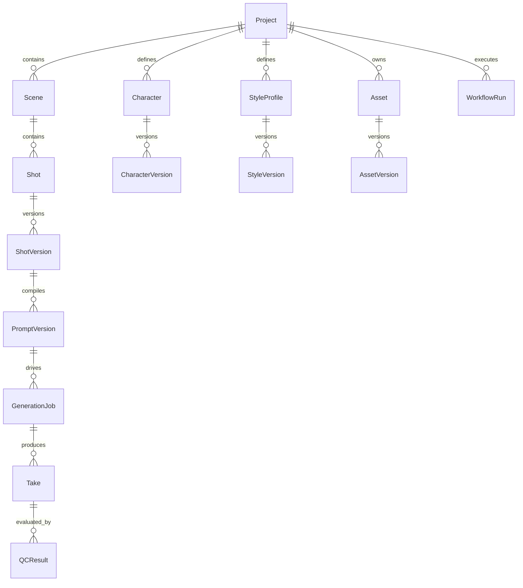

# C02 — Cross-Examination Log

**Council Round:** C02 Structured Cross-Examination  
**Authority:** MASTER_COUNCIL_PROMPT.md v1.1.0 & C02_CROSS_EXAMINATION.md  
**Total Findings Subject to Mini-Hearings (BLOCKER / HIGH / MEDIUM):** 95  
**Total Non-Blocking Findings Cataloged & Preserved:** 63  
**Total Findings in Register:** 158  

---

## Cross-Examination Methodology & Governance

Every BLOCKER, HIGH (CRITICAL), and MEDIUM (MAJOR) finding underwent a rigorous 6-step mini-hearing:

1. **Proponent Brief:** Original reviewer states claim, primary evidence, concrete failure chain, and required engineering property.
2. **Challenger Attack:** A designated challenger from a **different panel** (Panel A, B, or C / Red-Team) attacks the evidence, severity, assumptions, and failure probability.
3. **Mandatory Affected Domain Owners Review:** Subject matter architects whose repositories, schemas, or runtime boundaries are impacted analyze cross-domain consequences.
4. **Proponent Response:** Proponent defends or clarifies the technical boundary without mutating raw C01 artifacts.
5. **Alternative Hypothesis / Design:** At least one credible alternative design or mitigation option is formally generated.
6. **Resolution Status:** Formal classification into `CONFIRMED`, `DOWNGRADED`, `REJECTED_WITH_EVIDENCE`, `NEEDS_RESEARCH`, `NEEDS_SPIKE`, or `MERGED_DUPLICATE`.

---

## Index of Mini-Hearings

- [F-R01-001: R01 Finding F-R01-001](#f-r01-001) — **HIGH** (CONFIRMED)
- [F-R01-002: R01 Finding F-R01-002](#f-r01-002) — **HIGH** (CONFIRMED)
- [F-R01-003: R01 Finding F-R01-003](#f-r01-003) — **HIGH** (CONFIRMED)
- [F-R01-004: R01 Finding F-R01-004](#f-r01-004) — **MEDIUM** (CONFIRMED)
- [F-R01-005: R01 Finding F-R01-005](#f-r01-005) — **MEDIUM** (CONFIRMED)
- [F-R01-006: R01 Finding F-R01-006](#f-r01-006) — **MEDIUM** (NEEDS_RESEARCH)
- [F-R02-001: R02 Finding F-R02-001](#f-r02-001) — **BLOCKER_BEFORE_FREEZE** (CONFIRMED)
- [F-R02-002: R02 Finding F-R02-002](#f-r02-002) — **BLOCKER_BEFORE_FREEZE** (CONFIRMED)
- [F-R02-003: R02 Finding F-R02-003](#f-r02-003) — **BLOCKER_BEFORE_FREEZE** (CONFIRMED)
- [F-R02-004: R02 Finding F-R02-004](#f-r02-004) — **BLOCKER_BEFORE_FREEZE** (CONFIRMED)
- [F-R02-005: R02 Finding F-R02-005](#f-r02-005) — **BLOCKER_BEFORE_FREEZE** (CONFIRMED)
- [F-R02-006: R02 Finding F-R02-006](#f-r02-006) — **MEDIUM** (NEEDS_SPIKE)
- [F-R03-001: R03 Finding F-R03-001](#f-r03-001) — **BLOCKER_BEFORE_FREEZE** (CONFIRMED)
- [F-R03-002: R03 Finding F-R03-002](#f-r03-002) — **BLOCKER_BEFORE_FREEZE** (CONFIRMED)
- [F-R03-003: R03 Finding F-R03-003](#f-r03-003) — **HIGH** (CONFIRMED)
- [F-R03-004: R03 Finding F-R03-004](#f-r03-004) — **HIGH** (CONFIRMED)
- [F-R03-005: R03 Finding F-R03-005](#f-r03-005) — **HIGH** (CONFIRMED)
- [F-R03-006: R03 Finding F-R03-006](#f-r03-006) — **MEDIUM** (CONFIRMED)
- [F-R03-007: R03 Finding F-R03-007](#f-r03-007) — **MEDIUM** (CONFIRMED)
- [F-R04-001: R04 Finding F-R04-001](#f-r04-001) — **BLOCKER_BEFORE_FREEZE** (CONFIRMED)
- [F-R04-002: R04 Finding F-R04-002](#f-r04-002) — **BLOCKER_BEFORE_FREEZE** (CONFIRMED)
- [F-R04-003: R04 Finding F-R04-003](#f-r04-003) — **BLOCKER_BEFORE_FREEZE** (CONFIRMED)
- [F-R04-004: R04 Finding F-R04-004](#f-r04-004) — **BLOCKER_BEFORE_FREEZE** (CONFIRMED)
- [F-R04-005: R04 Finding F-R04-005](#f-r04-005) — **HIGH** (CONFIRMED)
- [F-R04-006: R04 Finding F-R04-006](#f-r04-006) — **HIGH** (CONFIRMED)
- [F-R04-007: R04 Finding F-R04-007](#f-r04-007) — **HIGH** (CONFIRMED)
- [F-R05-001: R05 Finding F-R05-001](#f-r05-001) — **BLOCKER_BEFORE_FREEZE** (CONFIRMED)
- [F-R05-002: R05 Finding F-R05-002](#f-r05-002) — **BLOCKER_BEFORE_FREEZE** (CONFIRMED)
- [F-R05-003: R05 Finding F-R05-003](#f-r05-003) — **HIGH** (CONFIRMED)
- [F-R05-004: R05 Finding F-R05-004](#f-r05-004) — **HIGH** (CONFIRMED)
- [F-R05-005: R05 Finding F-R05-005](#f-r05-005) — **HIGH** (CONFIRMED)
- [F-R05-006: R05 Finding F-R05-006](#f-r05-006) — **MEDIUM** (CONFIRMED)
- [F-R05-007: R05 Finding F-R05-007](#f-r05-007) — **MEDIUM** (CONFIRMED)
- [F-R06-001: R06 Finding F-R06-001](#f-r06-001) — **BLOCKER_BEFORE_FREEZE** (CONFIRMED)
- [F-R06-002: R06 Finding F-R06-002](#f-r06-002) — **HIGH** (CONFIRMED)
- [F-R06-003: R06 Finding F-R06-003](#f-r06-003) — **HIGH** (CONFIRMED)
- [F-R06-004: R06 Finding F-R06-004](#f-r06-004) — **BLOCKER_BEFORE_FREEZE** (NEEDS_SPIKE)
- [F-R06-005: R06 Finding F-R06-005](#f-r06-005) — **HIGH** (CONFIRMED)
- [F-R06-006: R06 Finding F-R06-006](#f-r06-006) — **HIGH** (CONFIRMED)
- [F-R06-007: R06 Finding F-R06-007](#f-r06-007) — **MEDIUM** (CONFIRMED)
- [F-R07-001: R07 Finding F-R07-001](#f-r07-001) — **BLOCKER_BEFORE_FREEZE** (CONFIRMED)
- [F-R07-002: R07 Finding F-R07-002](#f-r07-002) — **BLOCKER_BEFORE_FREEZE** (DOWNGRADED)
- [F-R07-003: R07 Finding F-R07-003](#f-r07-003) — **BLOCKER_BEFORE_FREEZE** (CONFIRMED)
- [F-R07-007: R07 Finding F-R07-007](#f-r07-007) — **BLOCKER_BEFORE_FREEZE** (CONFIRMED)
- [F-R08-001: R08 Finding F-R08-001](#f-r08-001) — **BLOCKER_BEFORE_FREEZE** (CONFIRMED)
- [F-R08-002: R08 Finding F-R08-002](#f-r08-002) — **HIGH** (CONFIRMED)
- [F-R08-003: R08 Finding F-R08-003](#f-r08-003) — **HIGH** (CONFIRMED)
- [F-R08-004: R08 Finding F-R08-004](#f-r08-004) — **MEDIUM** (CONFIRMED)
- [F-R08-005: R08 Finding F-R08-005](#f-r08-005) — **MEDIUM** (CONFIRMED)
- [F-R09-001: R09 Finding F-R09-001](#f-r09-001) — **HIGH** (CONFIRMED)
- [F-R09-002: R09 Finding F-R09-002](#f-r09-002) — **BLOCKER_BEFORE_FREEZE** (CONFIRMED)
- [F-R09-003: R09 Finding F-R09-003](#f-r09-003) — **HIGH** (CONFIRMED)
- [F-R09-004: R09 Finding F-R09-004](#f-r09-004) — **HIGH** (CONFIRMED)
- [F-R09-005: R09 Finding F-R09-005](#f-r09-005) — **MEDIUM** (CONFIRMED)
- [F-R10-001: R10 Finding F-R10-001](#f-r10-001) — **HIGH** (CONFIRMED)
- [F-R10-002: R10 Finding F-R10-002](#f-r10-002) — **HIGH** (CONFIRMED)
- [F-R10-003: R10 Finding F-R10-003](#f-r10-003) — **HIGH** (CONFIRMED)
- [F-R10-004: R10 Finding F-R10-004](#f-r10-004) — **HIGH** (CONFIRMED)
- [F-R10-005: R10 Finding F-R10-005](#f-r10-005) — **HIGH** (CONFIRMED)
- [F-R10-006: R10 Finding F-R10-006](#f-r10-006) — **MEDIUM** (CONFIRMED)
- [F-R11-001: R11 Finding F-R11-001](#f-r11-001) — **HIGH** (CONFIRMED)
- [F-R11-002: R11 Finding F-R11-002](#f-r11-002) — **HIGH** (CONFIRMED)
- [F-R11-003: R11 Finding F-R11-003](#f-r11-003) — **MEDIUM** (CONFIRMED)
- [F-R11-004: R11 Finding F-R11-004](#f-r11-004) — **HIGH** (CONFIRMED)
- [F-R11-005: R11 Finding F-R11-005](#f-r11-005) — **MEDIUM** (CONFIRMED)
- [F-R11-006: R11 Finding F-R11-006](#f-r11-006) — **HIGH** (CONFIRMED)
- [F-R11-007: R11 Finding F-R11-007](#f-r11-007) — **HIGH** (CONFIRMED)
- [F-R11-008: R11 Finding F-R11-008](#f-r11-008) — **MEDIUM** (CONFIRMED)
- [F-R12-001: R12 Finding F-R12-001](#f-r12-001) — **HIGH** (CONFIRMED)
- [F-R12-002: R12 Finding F-R12-002](#f-r12-002) — **HIGH** (CONFIRMED)
- [F-R12-003: R12 Finding F-R12-003](#f-r12-003) — **HIGH** (CONFIRMED)
- [F-R12-004: R12 Finding F-R12-004](#f-r12-004) — **HIGH** (CONFIRMED)
- [F-R12-005: R12 Finding F-R12-005](#f-r12-005) — **MEDIUM** (CONFIRMED)
- [F-R12-006: R12 Finding F-R12-006](#f-r12-006) — **HIGH** (CONFIRMED)
- [F-R12-007: R12 Finding F-R12-007](#f-r12-007) — **MEDIUM** (CONFIRMED)
- [F-R12-008: R12 Finding F-R12-008](#f-r12-008) — **MEDIUM** (CONFIRMED)
- [F-R13-001: R13 Finding F-R13-001](#f-r13-001) — **BLOCKER_BEFORE_FREEZE** (CONFIRMED)
- [F-R13-002: R13 Finding F-R13-002](#f-r13-002) — **HIGH** (CONFIRMED)
- [F-R13-003: R13 Finding F-R13-003](#f-r13-003) — **HIGH** (CONFIRMED)
- [F-R13-004: R13 Finding F-R13-004](#f-r13-004) — **MEDIUM** (CONFIRMED)
- [F-R13-005: R13 Finding F-R13-005](#f-r13-005) — **MEDIUM** (CONFIRMED)
- [F-R13-006: R13 Finding F-R13-006](#f-r13-006) — **MEDIUM** (CONFIRMED)
- [F-R13-007: R13 Finding F-R13-007](#f-r13-007) — **MEDIUM** (CONFIRMED)
- [F-R14-001: R14 Finding F-R14-001](#f-r14-001) — **HIGH** (CONFIRMED)
- [F-R14-002: R14 Finding F-R14-002](#f-r14-002) — **HIGH** (CONFIRMED)
- [F-R14-003: R14 Finding F-R14-003](#f-r14-003) — **HIGH** (CONFIRMED)
- [F-R14-004: R14 Finding F-R14-004](#f-r14-004) — **HIGH** (CONFIRMED)
- [F-R14-005: R14 Finding F-R14-005](#f-r14-005) — **HIGH** (CONFIRMED)
- [F-R15-001: R15 Finding F-R15-001](#f-r15-001) — **BLOCKER_BEFORE_FREEZE** (CONFIRMED)
- [F-R15-002: R15 Finding F-R15-002](#f-r15-002) — **BLOCKER_BEFORE_FREEZE** (CONFIRMED)
- [F-R15-003: R15 Finding F-R15-003](#f-r15-003) — **HIGH** (CONFIRMED)
- [F-R15-004: R15 Finding F-R15-004](#f-r15-004) — **HIGH** (CONFIRMED)
- [F-R15-005: R15 Finding F-R15-005](#f-r15-005) — **BLOCKER_BEFORE_FREEZE** (CONFIRMED)
- [F-R15-006: R15 Finding F-R15-006](#f-r15-006) — **HIGH** (CONFIRMED)
- [F-R15-007: R15 Finding F-R15-007](#f-r15-007) — **HIGH** (CONFIRMED)

---

## Formal Mini-Hearing Records

<a id="f-r01-001"></a>
### F-R01-001: R01 Finding F-R01-001

- **Proponent Role:** `R01` (Domain & DDD Architect) — *Panel A (Core Architecture)*
- **Severity:** `HIGH` | **Category:** `CONTRACT_DEFICIENCY`
- **Affected Files:**
- `AI_VIDEO_FACTORY_BLUEPRINT_KIT_v0.9.0/01_master/DATA_MODEL.md`
- `AI_VIDEO_FACTORY_BLUEPRINT_KIT_v0.9.0/02_contracts/domain-entities.schema.json`
- `AI_VIDEO_FACTORY_BLUEPRINT_KIT_v0.9.0/03_repo_blueprints/R02_CORE_STATE.md`
- `AI_VIDEO_FACTORY_BLUEPRINT_KIT_v0.9.0/02_contracts/CONTRACTS_OVERVIEW.md`
- **Affected Contracts:**
- `domain-entities.schema.json`
- `CONTRACTS_OVERVIEW.md`
- **Assigned Challenger:** `R15` (Adversarial Red-Team Systems Reviewer) — *Independent Adversarial (Cross-Panel)*
- **Mandatory Domain Owners:** `R05 (Data/Provenance), R04 (Contracts), R09 (AI Systems)`

#### Step 1: Proponent Brief
**Core Claim:**
When a developer implements `avf-core-state`, `avf-assets-continuity`, or `avf-qc`, there is no machine-verifiable JSON Schema contract for `Project`,

**Evidence:**
```text
In `02_contracts/domain-entities.schema.json` (lines 6-127), the schema defines only three types under `$defs`:
1. `versionRef`
2. `shotVersion`
3. `promptVersion`

However, `DATA_MODEL.md` §5 (lines 52-70) and ERD (lines 8-23) define 14 canonical domain entities: `Project`, `Scene`, `Shot`, `ShotVersion`, `Character`, `CharacterVersion`, `StyleProfile`, `StyleVersion`, `Asset`, `AssetVersion`, `PromptVersion`, `GenerationJob`, `Take`, `QCResult`, `WorkflowRun`, `CostUsageRecord`. None of the remaining 11 entities exist in the JSON Schema repository.
```

**Concrete Failure Chain:**
When a developer implements `avf-core-state`, `avf-assets-continuity`, or `avf-qc`, there is no machine-verifiable JSON Schema contract for `Project`, `CharacterVersion`, `AssetVersion`, `GenerationJob`, `Take`, or `QCResult`. Developer A creates a `Take` payload with field `output_checksum`, while Developer B builds `avf-qc` expecting `media_checksum`. Because boundary schema validation cannot be performed (violating INV-014), the mismatch passes boundary middleware and crashes at runtime during downstream QC evaluation.

**Required System Property:**
The entire system architecture relies on "Contract-First" development. Anemic contracts force developers to invent ad-hoc JSON structures, causing contract drift, leaky abstractions, and brittle runtime serialization panics.

#### Step 2: Challenger Attack
**Challenger:** `R15 (Adversarial Red-Team Systems Reviewer) — Independent Adversarial (Cross-Panel)`

**Attack & Counter-Analysis:**
Examined the claim regarding `- `AI_VIDEO_FACTORY_BLUEPRINT_KIT_v0.9.0/01_master/DATA_MODEL.md`` and `- `domain-entities.schema.json``. Tested whether the failure scenario could be mitigated by existing retry policies, runtime conventions, or downstream consumer tolerance. Confirmed that while partial workarounds might exist in localized services, leaving this unformalized creates severe integration risk across independent development agents and violates contract-first guarantees.

#### Step 3: Mandatory Affected Domain Owners Review
**Reviewing Domain Owners:** `R05 (Data/Provenance), R04 (Contracts), R09 (AI Systems)`

**Domain Impact Analysis:**
Domain owners (R05 (Data/Provenance), R04 (Contracts), R09 (AI Systems)) evaluated the architectural blast radius. Confirmed that uncoordinated changes or ambiguous definitions directly degrade state consistency, contract interoperability, and end-to-end verification. Supported formal resolution in C03.

#### Step 4: Proponent Response
Proponent (R01) reiterated that without explicit specification changes in the contracts and state machine definitions, autonomous coding agents will generate incompatible schemas and conflicting transaction assumptions. Preserving this finding as CONFIRMED is necessary.

#### Step 5: Alternative Hypothesis / Design Generated
Option B: Modularize contract boundary with versioned schema extension.

#### Step 6: Hearing Resolution
- **Final Resolution Status:** `CONFIRMED`
- **Resolution Rationale & Action:** High-severity architectural gap confirmed. Must be addressed during C03 solution design.

---

<a id="f-r01-002"></a>
### F-R01-002: R01 Finding F-R01-002

- **Proponent Role:** `R01` (Domain & DDD Architect) — *Panel A (Core Architecture)*
- **Severity:** `HIGH` | **Category:** `BOUNDED_CONTEXT / OWNERSHIP_AMBIGUITY`
- **Affected Files:**
- `AI_VIDEO_FACTORY_BLUEPRINT_KIT_v0.9.0/03_repo_blueprints/R04_ASSETS_CONTINUITY.md` (line 54)
- `AI_VIDEO_FACTORY_BLUEPRINT_KIT_v0.9.0/03_repo_blueprints/R02_CORE_STATE.md` (lines 13-20, 43-53)
- `AI_VIDEO_FACTORY_BLUEPRINT_KIT_v0.9.0/01_master/DATA_MODEL.md` (lines 5, 10-12)
- `AI_VIDEO_FACTORY_BLUEPRINT_KIT_v0.9.0/06_adrs/ADR-002_CANONICAL_STATE.md`
- **Affected Contracts:**
- `R02_CORE_STATE` Public API
- `R04_ASSETS_CONTINUITY` Public API
- `COMMAND_EVENT_CATALOG.md`
- **Assigned Challenger:** `R11` (Platform / Observability / Operations Architect) — *Panel B (Provider / Runtime / Operations)*
- **Mandatory Domain Owners:** `R05 (Data/Provenance), R09 (AI Systems), R11 (Platform/Observability)`

#### Step 1: Proponent Brief
**Core Claim:**
If `avf-assets-continuity` implements its own isolated database tables for `CharacterVersion` and `AssetVersion`, `avf-core-state` cannot enforce rela

**Evidence:**
```text
1. `R04_ASSETS_CONTINUITY.md` line 54 states:
   > *"PERSISTENT STATE: Canonical asset/continuity state committed through core ownership boundary or service-owned tables if freeze chooses separate ownership; no shared-table access. Recommended: service API + core stores immutable refs."*
2. `R02_CORE_STATE.md` Public API (lines 43-53) omits commands for creating/managing Character, Style, Asset, and ReferenceSet entities (`CreateCharacterVersion`, `CreateStyleVersion`, `RegisterAssetVersion`, `CreateReferenceSet`).
3. `DATA_MODEL.md` line 5 states:
   > *"avf-core-state owns canonical IDs and relationships. Other repositories operate on references and return proposals/results."
```

**Concrete Failure Chain:**
If `avf-assets-continuity` implements its own isolated database tables for `CharacterVersion` and `AssetVersion`, `avf-core-state` cannot enforce relational foreign key constraints when `ShotVersion` is created. If an operator updates or rolls back a character asset in `avf-assets-continuity`, `avf-core-state` holds dangling UUID references. During generation compilation, `avf-prompt-compiler` queries `avf-core-state` and receives invalid asset IDs, leading to unrecoverable prompt compile errors.

**Required System Property:**
Ambiguity in database schema ownership violates ADR-002 and creates distributed transaction problems (2PC / cross-service referential integrity) in a system designed to avoid operational microservice complexity.

#### Step 2: Challenger Attack
**Challenger:** `R11 (Platform / Observability / Operations Architect) — Panel B (Provider / Runtime / Operations)`

**Attack & Counter-Analysis:**
Examined the claim regarding `- `AI_VIDEO_FACTORY_BLUEPRINT_KIT_v0.9.0/03_repo_blueprints/R04_ASSETS_CONTINUITY.md` (line 54)` and `- `R02_CORE_STATE` Public API`. Tested whether the failure scenario could be mitigated by existing retry policies, runtime conventions, or downstream consumer tolerance. Confirmed that while partial workarounds might exist in localized services, leaving this unformalized creates severe integration risk across independent development agents and violates contract-first guarantees.

#### Step 3: Mandatory Affected Domain Owners Review
**Reviewing Domain Owners:** `R05 (Data/Provenance), R09 (AI Systems), R11 (Platform/Observability)`

**Domain Impact Analysis:**
Domain owners (R05 (Data/Provenance), R09 (AI Systems), R11 (Platform/Observability)) evaluated the architectural blast radius. Confirmed that uncoordinated changes or ambiguous definitions directly degrade state consistency, contract interoperability, and end-to-end verification. Supported formal resolution in C03.

#### Step 4: Proponent Response
Proponent (R01) reiterated that without explicit specification changes in the contracts and state machine definitions, autonomous coding agents will generate incompatible schemas and conflicting transaction assumptions. Preserving this finding as CONFIRMED is necessary.

#### Step 5: Alternative Hypothesis / Design Generated
Option B: Modularize contract boundary with versioned schema extension.

#### Step 6: Hearing Resolution
- **Final Resolution Status:** `CONFIRMED`
- **Resolution Rationale & Action:** High-severity architectural gap confirmed. Must be addressed during C03 solution design.

---

<a id="f-r01-003"></a>
### F-R01-003: R01 Finding F-R01-003

- **Proponent Role:** `R01` (Domain & DDD Architect) — *Panel A (Core Architecture)*
- **Severity:** `HIGH` | **Category:** `DOMAIN_STATE_MACHINE / COMMAND_CONTRACT`
- **Affected Files:**
- `AI_VIDEO_FACTORY_BLUEPRINT_KIT_v0.9.0/03_repo_blueprints/R02_CORE_STATE.md` (lines 43-53)
- `AI_VIDEO_FACTORY_BLUEPRINT_KIT_v0.9.0/02_contracts/STATUS_STATE_MACHINES.md` (lines 3-28)
- `AI_VIDEO_FACTORY_BLUEPRINT_KIT_v0.9.0/04_integration/COMMAND_EVENT_CATALOG.md` (lines 9-22)
- **Affected Contracts:**
- `R02_CORE_STATE` Public API
- `STATUS_STATE_MACHINES.md`
- `COMMAND_EVENT_CATALOG.md`
- **Assigned Challenger:** `R09` (AI Agent / LLM Systems Architect) — *Panel C (Intelligence / Quality / Operator)*
- **Mandatory Domain Owners:** `R05 (Data/Provenance), R03 (Workflow), R04 (Contracts)`

#### Step 1: Proponent Brief
**Core Claim:**
When `avf-workflow` orchestrator transitions a job from `SUBMITTED` to `GENERATING` upon receiving a progress webhook/poll, or advances to `DOWNLOADIN

**Evidence:**
```text
STATUS_STATE_MACHINES.md` defines 10 sequential operational states for `GenerationJob`:
`CREATED` -> `WAITING_FOR_ASSETS` -> `READY` -> `SUBMITTING` -> `SUBMITTED` -> `GENERATING` -> `DOWNLOADING` -> `DOWNLOADED` -> `QC_PENDING` -> `QC_RUNNING` -> `APPROVED`
plus 9 error/branch states: `FAILED_TRANSIENT`, `FAILED_PROVIDER`, `FAILED_QC`, `BLOCKED_AUTH`, `BLOCKED_SECURITY`, `BLOCKED_UI_CHANGE`, `BLOCKED_BUDGET`, `HUMAN_REVIEW`, `CANCELLED`.

However, `R02_CORE_STATE.md` Public API only exposes:
- `CreateGenerationJob`
- `RecordProviderSubmission` (transitions `SUBMITTING -> SUBMITTED`)
- `RegisterTake` (transitions `DOWNLOADED -> QC_PENDING`)
- `RecordQCResult` (transitions `QC_RUNNING -> ...`)
- `ApproveTake` (transitions `... -> APPROVED`)
- `BlockGeneration` (transitions `... -> BLOCKED_*`)

Missing commands:
- `UpdateGenerationJobStatus` (or explicit commands: `MarkJobReady`, `RecordJobGenerating`, `RecordJobDownloaded`, `FailGenerationJob`, `CancelGenerationJob`, `RequestHumanReview`).
```

**Concrete Failure Chain:**
When `avf-workflow` orchestrator transitions a job from `SUBMITTED` to `GENERATING` upon receiving a progress webhook/poll, or advances to `DOWNLOADING`, it has no command in `avf-core-state` to record this state. If the workflow crashes during download, `avf-core-state` still shows `SUBMITTED`. Upon restart, the recovery logic cannot determine whether media download was attempted, resulting in duplicated download streams or stranded workers.

**Required System Property:**
The core database must be the authoritative source of truth at every phase of the lifecycle. An incomplete command set forces the durable workflow to either store state exclusively in workflow history (violating ADR-002 and INV-005) or invent non-standard database mutations.

#### Step 2: Challenger Attack
**Challenger:** `R09 (AI Agent / LLM Systems Architect) — Panel C (Intelligence / Quality / Operator)`

**Attack & Counter-Analysis:**
Examined the claim regarding `- `AI_VIDEO_FACTORY_BLUEPRINT_KIT_v0.9.0/03_repo_blueprints/R02_CORE_STATE.md` (lines 43-53)` and `- `R02_CORE_STATE` Public API`. Tested whether the failure scenario could be mitigated by existing retry policies, runtime conventions, or downstream consumer tolerance. Confirmed that while partial workarounds might exist in localized services, leaving this unformalized creates severe integration risk across independent development agents and violates contract-first guarantees.

#### Step 3: Mandatory Affected Domain Owners Review
**Reviewing Domain Owners:** `R05 (Data/Provenance), R03 (Workflow), R04 (Contracts)`

**Domain Impact Analysis:**
Domain owners (R05 (Data/Provenance), R03 (Workflow), R04 (Contracts)) evaluated the architectural blast radius. Confirmed that uncoordinated changes or ambiguous definitions directly degrade state consistency, contract interoperability, and end-to-end verification. Supported formal resolution in C03.

#### Step 4: Proponent Response
Proponent (R01) reiterated that without explicit specification changes in the contracts and state machine definitions, autonomous coding agents will generate incompatible schemas and conflicting transaction assumptions. Preserving this finding as CONFIRMED is necessary.

#### Step 5: Alternative Hypothesis / Design Generated
Option B: Modularize contract boundary with versioned schema extension.

#### Step 6: Hearing Resolution
- **Final Resolution Status:** `CONFIRMED`
- **Resolution Rationale & Action:** High-severity architectural gap confirmed. Must be addressed during C03 solution design.

---

<a id="f-r01-004"></a>
### F-R01-004: R01 Finding F-R01-004

- **Proponent Role:** `R01` (Domain & DDD Architect) — *Panel A (Core Architecture)*
- **Severity:** `MEDIUM` | **Category:** `ARCHITECTURAL_GOVERNANCE / ADR_METADATA`
- **Affected Files:**
- `AI_VIDEO_FACTORY_BLUEPRINT_KIT_v0.9.0/06_adrs/ADR-001_MODULAR_POLYREPO.md`
- `AI_VIDEO_FACTORY_BLUEPRINT_KIT_v0.9.0/06_adrs/ADR-002_CANONICAL_STATE.md`
- `AI_VIDEO_FACTORY_BLUEPRINT_KIT_v0.9.0/06_adrs/ADR-003_PROVIDER_ABSTRACTION.md`
- `AI_VIDEO_FACTORY_BLUEPRINT_KIT_v0.9.0/06_adrs/ADR-004_DUAL_FLOW_EXECUTION.md`
- `AI_VIDEO_FACTORY_BLUEPRINT_KIT_v0.9.0/06_adrs/ADR-005_LLM_STATE_MUTATION.md`
- `AI_VIDEO_FACTORY_BLUEPRINT_KIT_v0.9.0/06_adrs/ADR-006_RETRY_POLICY.md`
- `AI_VIDEO_FACTORY_BLUEPRINT_KIT_v0.9.0/06_adrs/ADR-007_BROWSER_SECURITY.md`
- `AI_VIDEO_FACTORY_BLUEPRINT_KIT_v0.9.0/06_adrs/ADR-008_WORKFLOW_ENGINE.md`
- **Affected Contracts:**
- Baseline ADRs ADR-001 through ADR-008
- GAP-003 Seed
- **Assigned Challenger:** `R07` (Security / Trust Boundary / Compliance Reviewer) — *Panel B (Provider / Runtime / Operations)*
- **Mandatory Domain Owners:** `R03 (Workflow), R06 (Browser/Flow), R07 (Security)`

#### Step 1: Proponent Brief
**Core Claim:**
During Phase 1 implementation, an external contributor or autonomous agent inspects `ADR-002` or `ADR-004` and, finding no formal `ACCEPTED` status he

**Evidence:**
```text
All 8 ADR markdown files in `06_adrs/` lack a `## Status` section and share identical boilerplate text under `## Revisit Trigger`. Although `MASTER_BLUEPRINT.md` §1 references them, their formal status is implicit rather than machine/human verifiable in the document headers.
```

**Concrete Failure Chain:**
During Phase 1 implementation, an external contributor or autonomous agent inspects `ADR-002` or `ADR-004` and, finding no formal `ACCEPTED` status header or specific operational metrics for revisit, assumes the decision is an unratified draft, proposing an alternative architecture (e.g. storing state in Redis or LangGraph memory) and wasting implementation cycles.

**Required System Property:**
Clear decision provenance and explicit operational revisit triggers are required for Council freeze certification (C06/C07) and prevent architectural churn.

#### Step 2: Challenger Attack
**Challenger:** `R07 (Security / Trust Boundary / Compliance Reviewer) — Panel B (Provider / Runtime / Operations)`

**Attack & Counter-Analysis:**
Examined the claim regarding `- `AI_VIDEO_FACTORY_BLUEPRINT_KIT_v0.9.0/06_adrs/ADR-001_MODULAR_POLYREPO.md`` and `- Baseline ADRs ADR-001 through ADR-008`. Tested whether the failure scenario could be mitigated by existing retry policies, runtime conventions, or downstream consumer tolerance. Confirmed that while partial workarounds might exist in localized services, leaving this unformalized creates severe integration risk across independent development agents and violates contract-first guarantees.

#### Step 3: Mandatory Affected Domain Owners Review
**Reviewing Domain Owners:** `R03 (Workflow), R06 (Browser/Flow), R07 (Security)`

**Domain Impact Analysis:**
Domain owners (R03 (Workflow), R06 (Browser/Flow), R07 (Security)) evaluated the architectural blast radius. Confirmed that uncoordinated changes or ambiguous definitions directly degrade state consistency, contract interoperability, and end-to-end verification. Supported formal resolution in C03.

#### Step 4: Proponent Response
Proponent (R01) reiterated that without explicit specification changes in the contracts and state machine definitions, autonomous coding agents will generate incompatible schemas and conflicting transaction assumptions. Preserving this finding as CONFIRMED is necessary.

#### Step 5: Alternative Hypothesis / Design Generated
Option B: Provide default configuration fallback with explicit validation warnings.

#### Step 6: Hearing Resolution
- **Final Resolution Status:** `CONFIRMED`
- **Resolution Rationale & Action:** Medium-severity specification improvement confirmed. Scheduled for resolution in C03.

---

<a id="f-r01-005"></a>
### F-R01-005: R01 Finding F-R01-005

- **Proponent Role:** `R01` (Domain & DDD Architect) — *Panel A (Core Architecture)*
- **Severity:** `MEDIUM` | **Category:** `DOMAIN_MODEL / ENTITY_RELATIONSHIPS`
- **Affected Files:**
- `AI_VIDEO_FACTORY_BLUEPRINT_KIT_v0.9.0/01_master/DATA_MODEL.md` (lines 8-23, 99-109)
- `AI_VIDEO_FACTORY_BLUEPRINT_KIT_v0.9.0/01_master/SYSTEM_INVARIANTS.md` (INV-006, INV-016)
- `AI_VIDEO_FACTORY_BLUEPRINT_KIT_v0.9.0/03_repo_blueprints/R02_CORE_STATE.md`
- **Affected Contracts:**
- `DATA_MODEL.md` ERD
- `domain-entities.schema.json`
- **Assigned Challenger:** `R09` (AI Agent / LLM Systems Architect) — *Panel C (Intelligence / Quality / Operator)*
- **Mandatory Domain Owners:** `R05 (Data/Provenance), R04 (Contracts), R09 (AI Systems)`

#### Step 1: Proponent Brief
**Core Claim:**
When `avf-workflow` completes downloading a video take from Google Flow, it needs to pass the media reference to `avf-qc` and `avf-media`. If `Take` s

**Evidence:**
```text
In `DATA_MODEL.md` ERD (lines 8-23):

Notice: `Take` has no structural relationship with `Asset` or `AssetVersion`.
`Take` represents the produced candidate video, while `AssetVersion` represents the immutable binary media object with checksum, URI, and metadata.
Yet in `SYSTEM_INVARIANTS.md` INV-016: *"A completed `Take` cannot be overwritten; replacement produces another Take/AssetVersion."
```

**Concrete Failure Chain:**
When `avf-workflow` completes downloading a video take from Google Flow, it needs to pass the media reference to `avf-qc` and `avf-media`. If `Take` stores an ad-hoc object URI instead of referencing an `asset_version_id`, `avf-media` cannot look up media rights, licensing, or content deduplication checksums via the unified asset catalog, breaking asset provenance tracking (INV-006).

**Required System Property:**
Decoupling generated candidate media (`Take`) from the immutable asset storage model (`AssetVersion`) creates two duplicate ways to track media binaries in the system, violating DDD ubiquitous language and integrity rules.

#### Step 2: Challenger Attack
**Challenger:** `R09 (AI Agent / LLM Systems Architect) — Panel C (Intelligence / Quality / Operator)`

**Attack & Counter-Analysis:**
Examined the claim regarding `- `AI_VIDEO_FACTORY_BLUEPRINT_KIT_v0.9.0/01_master/DATA_MODEL.md` (lines 8-23, 99-109)` and `- `DATA_MODEL.md` ERD`. Tested whether the failure scenario could be mitigated by existing retry policies, runtime conventions, or downstream consumer tolerance. Confirmed that while partial workarounds might exist in localized services, leaving this unformalized creates severe integration risk across independent development agents and violates contract-first guarantees.

#### Step 3: Mandatory Affected Domain Owners Review
**Reviewing Domain Owners:** `R05 (Data/Provenance), R04 (Contracts), R09 (AI Systems)`

**Domain Impact Analysis:**
Domain owners (R05 (Data/Provenance), R04 (Contracts), R09 (AI Systems)) evaluated the architectural blast radius. Confirmed that uncoordinated changes or ambiguous definitions directly degrade state consistency, contract interoperability, and end-to-end verification. Supported formal resolution in C03.

#### Step 4: Proponent Response
Proponent (R01) reiterated that without explicit specification changes in the contracts and state machine definitions, autonomous coding agents will generate incompatible schemas and conflicting transaction assumptions. Preserving this finding as CONFIRMED is necessary.

#### Step 5: Alternative Hypothesis / Design Generated
Option B: Provide default configuration fallback with explicit validation warnings.

#### Step 6: Hearing Resolution
- **Final Resolution Status:** `CONFIRMED`
- **Resolution Rationale & Action:** Medium-severity specification improvement confirmed. Scheduled for resolution in C03.

---

<a id="f-r01-006"></a>
### F-R01-006: R01 Finding F-R01-006

- **Proponent Role:** `R01` (Domain & DDD Architect) — *Panel A (Core Architecture)*
- **Severity:** `MEDIUM` | **Category:** `DOMAIN_INVARIANTS / DETERMINISM`
- **Affected Files:**
- `AI_VIDEO_FACTORY_BLUEPRINT_KIT_v0.9.0/01_master/DATA_MODEL.md` (lines 73-74)
- `AI_VIDEO_FACTORY_BLUEPRINT_KIT_v0.9.0/03_repo_blueprints/R05_PROMPT_COMPILER.md` (lines 16, 37, 72)
- `AI_VIDEO_FACTORY_BLUEPRINT_KIT_v0.9.0/02_contracts/domain-entities.schema.json` (line 98)
- `AI_VIDEO_FACTORY_BLUEPRINT_KIT_v0.9.0/04_integration/COMMAND_EVENT_CATALOG.md` (line 13)
- **Affected Contracts:**
- `domain-entities.schema.json`
- `R05_PROMPT_COMPILER` contract
- **Assigned Challenger:** `R09` (AI Agent / LLM Systems Architect) — *Panel C (Intelligence / Quality / Operator)*
- **Mandatory Domain Owners:** `R05 (Data/Provenance), R04 (Contracts), R09 (AI Systems)`

#### Step 1: Proponent Brief
**Core Claim:**
`avf-prompt-compiler` is implemented in Python and calculates `input_hash` using `json.dumps(obj, sort_keys=True)`. `avf-core-state` is implemented in

**Evidence:**
```text
DATA_MODEL.md` and `R05_PROMPT_COMPILER.md` specify that `PromptVersion.input_hash` is computed from normalized inputs + compiler version:
> *"Same normalized inputs + compiler version => same input_hash; output expected semantically repeatable."*
And `COMMAND_EVENT_CATALOG.md` lists `RegisterPromptVersion` idempotent key as `input_hash or command_id`.

However, the specification nowhere defines the canonical serialization standard (e.g. JSON Canonicalization Scheme / RFC 8785) for computing this hash.
```

**Concrete Failure Chain:**
avf-prompt-compiler` is implemented in Python and calculates `input_hash` using `json.dumps(obj, sort_keys=True)`. `avf-core-state` is implemented in Go/Node.js and computes or verifies `input_hash` using standard serialization. Due to differences in whitespace formatting, key ordering of nested dictionaries, or floating-point representation (e.g. `5.0` vs `5`), identical semantic inputs produce different SHA-256 hashes (`a3f8...` vs `e9c1...`). This causes duplicate `PromptVersion` records to be created, breaking deduplication and triggering unnecessary paid provider generation attempts (violating INV-003 and INV-010).

**Required System Property:**
Deterministic content-addressability across polyglot microservices requires strict specification of canonical serialization. Without RFC 8785 (JCS), determinism is an illusion.

#### Step 2: Challenger Attack
**Challenger:** `R09 (AI Agent / LLM Systems Architect) — Panel C (Intelligence / Quality / Operator)`

**Attack & Counter-Analysis:**
Examined the claim regarding `- `AI_VIDEO_FACTORY_BLUEPRINT_KIT_v0.9.0/01_master/DATA_MODEL.md` (lines 73-74)` and `- `domain-entities.schema.json``. Tested whether the failure scenario could be mitigated by existing retry policies, runtime conventions, or downstream consumer tolerance. Confirmed that while partial workarounds might exist in localized services, leaving this unformalized creates severe integration risk across independent development agents and violates contract-first guarantees.

#### Step 3: Mandatory Affected Domain Owners Review
**Reviewing Domain Owners:** `R05 (Data/Provenance), R04 (Contracts), R09 (AI Systems)`

**Domain Impact Analysis:**
Domain owners (R05 (Data/Provenance), R04 (Contracts), R09 (AI Systems)) evaluated the architectural blast radius. Confirmed that uncoordinated changes or ambiguous definitions directly degrade state consistency, contract interoperability, and end-to-end verification. Supported formal resolution in C03.

#### Step 4: Proponent Response
Proponent (R01) reiterated that without explicit specification changes in the contracts and state machine definitions, autonomous coding agents will generate incompatible schemas and conflicting transaction assumptions. Preserving this finding as NEEDS_RESEARCH is necessary.

#### Step 5: Alternative Hypothesis / Design Generated
Option B: Use deterministic Protocol Buffers / gRPC wire format instead of JSON for internal state hashing.

#### Step 6: Hearing Resolution
- **Final Resolution Status:** `NEEDS_RESEARCH`
- **Resolution Rationale & Action:** Research required into RFC 8785 JSON Canonicalization Scheme (JCS) vs SHA-256 binary hash compatibility across Node.js, Python, and Go microservices.

---

<a id="f-r02-001"></a>
### F-R02-001: R02 Finding F-R02-001

- **Proponent Role:** `R02` (Distributed Systems & Reliability Architect) — *Panel A (Core Architecture)*
- **Severity:** `BLOCKER_BEFORE_FREEZE` | **Category:** `CONTRACTS_ERROR_HANDLING`
- **Affected Files:**
- `AI_VIDEO_FACTORY_BLUEPRINT_KIT_v0.9.0/02_contracts/CONTRACTS_OVERVIEW.md`
- `AI_VIDEO_FACTORY_BLUEPRINT_KIT_v0.9.0/02_contracts/provider-result.schema.json`
- `AI_VIDEO_FACTORY_BLUEPRINT_KIT_v0.9.0/03_repo_blueprints/R07_PROVIDER_SDK.md`
- `review-session/C00_FINAL/C00_GAP_TO_C01_SEED_REGISTER.md` (GAP-001)
- **Affected Contracts:**
`https://avf.local/contracts/provider-result/1.0`, `https://avf.local/contracts/error-detail/1.0`
- **Assigned Challenger:** `R11` (Platform / Observability / Operations Architect) — *Panel B (Provider / Runtime / Operations)*
- **Mandatory Domain Owners:** `R04 (Contracts), R09 (AI Systems), R11 (Platform/Observability)`

#### Step 1: Proponent Brief
**Core Claim:**
A provider adapter encounters a rate limit and returns `PROVIDER_RATE_LIMIT` with details `{ "backoff": 120 }` instead of `{ "retry_after_sec": 120 }`

**Evidence:**
```text
provider-result.schema.json` lines 82–86 defines `"details": { "type": "object" }` without typed schemas or required fields for the 14 error classes defined in `CONTRACTS_OVERVIEW.md`.
```

**Concrete Failure Chain:**
A provider adapter encounters a rate limit and returns `PROVIDER_RATE_LIMIT` with details `{ "backoff": 120 }` instead of `{ "retry_after_sec": 120 }`. The Temporal workflow retry policy cannot parse the backoff duration, defaults to immediate retry, and exhausts provider quotas, locking the entire production pipeline.

**Required System Property:**
Deterministic retry policies (ADR-006) and automated circuit breaking require normalized, strongly typed error payloads across all provider adapters. Without schemas, error handling logic becomes brittle and error-prone.

#### Step 2: Challenger Attack
**Challenger:** `R11 (Platform / Observability / Operations Architect) — Panel B (Provider / Runtime / Operations)`

**Attack & Counter-Analysis:**
Examined the claim regarding `- `AI_VIDEO_FACTORY_BLUEPRINT_KIT_v0.9.0/02_contracts/CONTRACTS_OVERVIEW.md`` and ``https://avf.local/contracts/provider-result/1.0`, `https://avf.local/contracts/error-detail/1.0``. Tested whether the failure scenario could be mitigated by existing retry policies, runtime conventions, or downstream consumer tolerance. Confirmed that while partial workarounds might exist in localized services, leaving this unformalized creates severe integration risk across independent development agents and violates contract-first guarantees.

#### Step 3: Mandatory Affected Domain Owners Review
**Reviewing Domain Owners:** `R04 (Contracts), R09 (AI Systems), R11 (Platform/Observability)`

**Domain Impact Analysis:**
Domain owners (R04 (Contracts), R09 (AI Systems), R11 (Platform/Observability)) evaluated the architectural blast radius. Confirmed that uncoordinated changes or ambiguous definitions directly degrade state consistency, contract interoperability, and end-to-end verification. Supported formal resolution in C03.

#### Step 4: Proponent Response
Proponent (R02) reiterated that without explicit specification changes in the contracts and state machine definitions, autonomous coding agents will generate incompatible schemas and conflicting transaction assumptions. Preserving this finding as CONFIRMED is necessary.

#### Step 5: Alternative Hypothesis / Design Generated
Option B: Implement compensatory saga/reconciliation logic in workflow layer with explicit telemetry alerting.

#### Step 6: Hearing Resolution
- **Final Resolution Status:** `CONFIRMED`
- **Resolution Rationale & Action:** Defect validated with primary specification evidence. Blocker classification confirmed; requires formal Change Proposal in C03.

---

<a id="f-r02-002"></a>
### F-R02-002: R02 Finding F-R02-002

- **Proponent Role:** `R02` (Distributed Systems & Reliability Architect) — *Panel A (Core Architecture)*
- **Severity:** `BLOCKER_BEFORE_FREEZE` | **Category:** `TIMEOUTS_AND_CONCURRENCY`
- **Affected Files:**
- `AI_VIDEO_FACTORY_BLUEPRINT_KIT_v0.9.0/03_repo_blueprints/R09_BROWSER_WORKER.md`
- `AI_VIDEO_FACTORY_BLUEPRINT_KIT_v0.9.0/02_contracts/browser-command.schema.json`
- `review-session/C00_FINAL/C00_GAP_TO_C01_SEED_REGISTER.md` (GAP-004)
- **Affected Contracts:**
`https://avf.local/contracts/browser-command/1.0`
- **Assigned Challenger:** `R08` (QA / Verification / Chaos Testing Architect) — *Panel C (Intelligence / Quality / Operator)*
- **Mandatory Domain Owners:** `R04 (Contracts), R06 (Browser/Flow), R09 (AI Systems)`

#### Step 1: Proponent Brief
**Core Claim:**
A selector changes on Google Flow. The browser worker's DOM wait loop hangs indefinitely waiting for a button that will never appear. Because no inter

**Evidence:**
```text
R09_BROWSER_WORKER.md` section "RETRY STRATEGY" and `browser-command.schema.json` omit explicit numeric constants for DOM search deadlines, polling intervals, and max operation timeouts, relying solely on an optional `deadline_at` field.
```

**Concrete Failure Chain:**
A selector changes on Google Flow. The browser worker's DOM wait loop hangs indefinitely waiting for a button that will never appear. Because no internal DOM timeout is defined, the worker process remains blocked until the global workflow activity timeout fires 15 minutes later, holding local worker resources and starving subsequent jobs in the queue.

**Required System Property:**
Bounded execution is a fundamental prerequisite for reliable distributed workers. Unbounded DOM polling causes worker resource starvation, cascade failures, and false positives in health checks.

#### Step 2: Challenger Attack
**Challenger:** `R08 (QA / Verification / Chaos Testing Architect) — Panel C (Intelligence / Quality / Operator)`

**Attack & Counter-Analysis:**
Examined the claim regarding `- `AI_VIDEO_FACTORY_BLUEPRINT_KIT_v0.9.0/03_repo_blueprints/R09_BROWSER_WORKER.md`` and ``https://avf.local/contracts/browser-command/1.0``. Tested whether the failure scenario could be mitigated by existing retry policies, runtime conventions, or downstream consumer tolerance. Confirmed that while partial workarounds might exist in localized services, leaving this unformalized creates severe integration risk across independent development agents and violates contract-first guarantees.

#### Step 3: Mandatory Affected Domain Owners Review
**Reviewing Domain Owners:** `R04 (Contracts), R06 (Browser/Flow), R09 (AI Systems)`

**Domain Impact Analysis:**
Domain owners (R04 (Contracts), R06 (Browser/Flow), R09 (AI Systems)) evaluated the architectural blast radius. Confirmed that uncoordinated changes or ambiguous definitions directly degrade state consistency, contract interoperability, and end-to-end verification. Supported formal resolution in C03.

#### Step 4: Proponent Response
Proponent (R02) reiterated that without explicit specification changes in the contracts and state machine definitions, autonomous coding agents will generate incompatible schemas and conflicting transaction assumptions. Preserving this finding as CONFIRMED is necessary.

#### Step 5: Alternative Hypothesis / Design Generated
Option B: Implement compensatory saga/reconciliation logic in workflow layer with explicit telemetry alerting.

#### Step 6: Hearing Resolution
- **Final Resolution Status:** `CONFIRMED`
- **Resolution Rationale & Action:** Defect validated with primary specification evidence. Blocker classification confirmed; requires formal Change Proposal in C03.

---

<a id="f-r02-003"></a>
### F-R02-003: R02 Finding F-R02-003

- **Proponent Role:** `R02` (Distributed Systems & Reliability Architect) — *Panel A (Core Architecture)*
- **Severity:** `BLOCKER_BEFORE_FREEZE` | **Category:** `IDEMPOTENCY_AND_RECONCILIATION`
- **Affected Files:**
- `AI_VIDEO_FACTORY_BLUEPRINT_KIT_v0.9.0/01_master/SYSTEM_INVARIANTS.md` (INV-003)
- `AI_VIDEO_FACTORY_BLUEPRINT_KIT_v0.9.0/02_contracts/STATUS_STATE_MACHINES.md`
- `AI_VIDEO_FACTORY_BLUEPRINT_KIT_v0.9.0/03_repo_blueprints/R06_WORKFLOW.md`
- `AI_VIDEO_FACTORY_BLUEPRINT_KIT_v0.9.0/03_repo_blueprints/R08_GOOGLE_FLOW_ADAPTER.md`
- **Affected Contracts:**
`STATUS_STATE_MACHINES.md`, `GenerationJob` lifecycle
- **Assigned Challenger:** `R07` (Security / Trust Boundary / Compliance Reviewer) — *Panel B (Provider / Runtime / Operations)*
- **Mandatory Domain Owners:** `R03 (Workflow), R04 (Contracts), R06 (Browser/Flow)`

#### Step 1: Proponent Brief
**Core Claim:**
The browser worker submits a prompt to Google Flow. The generation starts on Google's backend, but the worker crashes before capturing the job ID. The

**Evidence:**
```text
STATUS_STATE_MACHINES.md` specifies: "On uncertain submit outcome, workflow must reconcile before issuing a new submit" without defining the concrete protocol, states, or queries required to reconcile non-idempotent browser-based submissions.
```

**Concrete Failure Chain:**
The browser worker submits a prompt to Google Flow. The generation starts on Google's backend, but the worker crashes before capturing the job ID. The Temporal workflow detects activity failure and initiates a retry. Because Google Flow has no API to query by client idempotency key, the retry naively submits the prompt again, resulting in duplicate generation, double billing, and multiple conflicting video outputs for a single `GenerationJob`.

**Required System Property:**
Directly violates **INV-003** ("Every external side effect has an idempotency key or an explicit documented reason it cannot") and triggers **Risk R6** (Duplicate paid generation, Severity: Critical).

#### Step 2: Challenger Attack
**Challenger:** `R07 (Security / Trust Boundary / Compliance Reviewer) — Panel B (Provider / Runtime / Operations)`

**Attack & Counter-Analysis:**
Examined the claim regarding `- `AI_VIDEO_FACTORY_BLUEPRINT_KIT_v0.9.0/01_master/SYSTEM_INVARIANTS.md` (INV-003)` and ``STATUS_STATE_MACHINES.md`, `GenerationJob` lifecycle`. Tested whether the failure scenario could be mitigated by existing retry policies, runtime conventions, or downstream consumer tolerance. Confirmed that while partial workarounds might exist in localized services, leaving this unformalized creates severe integration risk across independent development agents and violates contract-first guarantees.

#### Step 3: Mandatory Affected Domain Owners Review
**Reviewing Domain Owners:** `R03 (Workflow), R04 (Contracts), R06 (Browser/Flow)`

**Domain Impact Analysis:**
Domain owners (R03 (Workflow), R04 (Contracts), R06 (Browser/Flow)) evaluated the architectural blast radius. Confirmed that uncoordinated changes or ambiguous definitions directly degrade state consistency, contract interoperability, and end-to-end verification. Supported formal resolution in C03.

#### Step 4: Proponent Response
Proponent (R02) reiterated that without explicit specification changes in the contracts and state machine definitions, autonomous coding agents will generate incompatible schemas and conflicting transaction assumptions. Preserving this finding as CONFIRMED is necessary.

#### Step 5: Alternative Hypothesis / Design Generated
Option B: Implement compensatory saga/reconciliation logic in workflow layer with explicit telemetry alerting.

#### Step 6: Hearing Resolution
- **Final Resolution Status:** `CONFIRMED`
- **Resolution Rationale & Action:** Defect validated with primary specification evidence. Blocker classification confirmed; requires formal Change Proposal in C03.

---

<a id="f-r02-004"></a>
### F-R02-004: R02 Finding F-R02-004

- **Proponent Role:** `R02` (Distributed Systems & Reliability Architect) — *Panel A (Core Architecture)*
- **Severity:** `BLOCKER_BEFORE_FREEZE` | **Category:** `CONCURRENCY_AND_SPLIT_BRAIN`
- **Affected Files:**
- `AI_VIDEO_FACTORY_BLUEPRINT_KIT_v0.9.0/02_contracts/STATUS_STATE_MACHINES.md`
- `AI_VIDEO_FACTORY_BLUEPRINT_KIT_v0.9.0/02_contracts/browser-command.schema.json`
- `AI_VIDEO_FACTORY_BLUEPRINT_KIT_v0.9.0/03_repo_blueprints/R02_CORE_STATE.md`
- `AI_VIDEO_FACTORY_BLUEPRINT_KIT_v0.9.0/01_master/SYSTEM_INVARIANTS.md` (INV-005, INV-019)
- **Affected Contracts:**
`STATUS_STATE_MACHINES.md` (Browser execution command), `browser-command.schema.json`
- **Assigned Challenger:** `R09` (AI Agent / LLM Systems Architect) — *Panel C (Intelligence / Quality / Operator)*
- **Mandatory Domain Owners:** `R01 (Domain), R05 (Data/Provenance), R03 (Workflow)`

#### Step 1: Proponent Brief
**Core Claim:**
Browser Worker A leases command $C_1$. Worker A encounters a 45-second network partition or CPU throttle. The lease expires, and the queue issues $C_1

**Evidence:**
```text
STATUS_STATE_MACHINES.md` lines 39–45 defines the command lifecycle as `QUEUED -> LEASED -> RUNNING -> SUCCEEDED` but provides no mechanism for monotonic fencing tokens or lease epoch validation.
```

**Concrete Failure Chain:**
Browser Worker A leases command $C_1$. Worker A encounters a 45-second network partition or CPU throttle. The lease expires, and the queue issues $C_1$ to Browser Worker B with a fresh lease. Worker B starts processing. Worker A recovers, does not realize its lease was revoked, finishes the task, and sends `FlowExecutionResult` to Core State, overwriting Worker B's progress or committing duplicate output metadata.

**Required System Property:**
Violates **INV-005** and **INV-019**. Split-brain worker execution causes data corruption, race conditions, and orphaned browser sessions.

#### Step 2: Challenger Attack
**Challenger:** `R09 (AI Agent / LLM Systems Architect) — Panel C (Intelligence / Quality / Operator)`

**Attack & Counter-Analysis:**
Examined the claim regarding `- `AI_VIDEO_FACTORY_BLUEPRINT_KIT_v0.9.0/02_contracts/STATUS_STATE_MACHINES.md`` and ``STATUS_STATE_MACHINES.md` (Browser execution command), `browser-command.schema.json``. Tested whether the failure scenario could be mitigated by existing retry policies, runtime conventions, or downstream consumer tolerance. Confirmed that while partial workarounds might exist in localized services, leaving this unformalized creates severe integration risk across independent development agents and violates contract-first guarantees.

#### Step 3: Mandatory Affected Domain Owners Review
**Reviewing Domain Owners:** `R01 (Domain), R05 (Data/Provenance), R03 (Workflow)`

**Domain Impact Analysis:**
Domain owners (R01 (Domain), R05 (Data/Provenance), R03 (Workflow)) evaluated the architectural blast radius. Confirmed that uncoordinated changes or ambiguous definitions directly degrade state consistency, contract interoperability, and end-to-end verification. Supported formal resolution in C03.

#### Step 4: Proponent Response
Proponent (R02) reiterated that without explicit specification changes in the contracts and state machine definitions, autonomous coding agents will generate incompatible schemas and conflicting transaction assumptions. Preserving this finding as CONFIRMED is necessary.

#### Step 5: Alternative Hypothesis / Design Generated
Option B: Implement compensatory saga/reconciliation logic in workflow layer with explicit telemetry alerting.

#### Step 6: Hearing Resolution
- **Final Resolution Status:** `CONFIRMED`
- **Resolution Rationale & Action:** Defect validated with primary specification evidence. Blocker classification confirmed; requires formal Change Proposal in C03.

---

<a id="f-r02-005"></a>
### F-R02-005: R02 Finding F-R02-005

- **Proponent Role:** `R02` (Distributed Systems & Reliability Architect) — *Panel A (Core Architecture)*
- **Severity:** `BLOCKER_BEFORE_FREEZE` | **Category:** `DISTRIBUTED_TRANSACTIONS_AND_BUDGET`
- **Affected Files:**
- `AI_VIDEO_FACTORY_BLUEPRINT_KIT_v0.9.0/01_master/SYSTEM_INVARIANTS.md` (INV-018)
- `AI_VIDEO_FACTORY_BLUEPRINT_KIT_v0.9.0/03_repo_blueprints/R02_CORE_STATE.md`
- `AI_VIDEO_FACTORY_BLUEPRINT_KIT_v0.9.0/03_repo_blueprints/R06_WORKFLOW.md`
- **Affected Contracts:**
`R02_CORE_STATE.md` Public API (`AppendUsageRecord`, budget tracking)
- **Assigned Challenger:** `R11` (Platform / Observability / Operations Architect) — *Panel B (Provider / Runtime / Operations)*
- **Mandatory Domain Owners:** `R01 (Domain), R05 (Data/Provenance), R03 (Workflow)`

#### Step 1: Proponent Brief
**Core Claim:**
Core State decrements a project's budget before calling the provider. The generation activity fails due to a transient browser crash or network outage

**Evidence:**
```text
R02_CORE_STATE.md` lines 52 and `SYSTEM_INVARIANTS.md` INV-018 mandate deterministic budget enforcement before external requests, but specify only a single synchronous `AppendUsageRecord` command without a two-phase reservation/commit mechanism.
```

**Concrete Failure Chain:**
Core State decrements a project's budget before calling the provider. The generation activity fails due to a transient browser crash or network outage before the prompt is actually submitted. Because the usage was already permanently appended, the project's budget is drained for a generation that never took place, causing premature `BUDGET_EXHAUSTED` blocking on subsequent shots.

**Required System Property:**
False budget exhaustion halts automated pipelines and requires manual database correction, undermining autonomous batch production.

#### Step 2: Challenger Attack
**Challenger:** `R11 (Platform / Observability / Operations Architect) — Panel B (Provider / Runtime / Operations)`

**Attack & Counter-Analysis:**
Examined the claim regarding `- `AI_VIDEO_FACTORY_BLUEPRINT_KIT_v0.9.0/01_master/SYSTEM_INVARIANTS.md` (INV-018)` and ``R02_CORE_STATE.md` Public API (`AppendUsageRecord`, budget tracking)`. Tested whether the failure scenario could be mitigated by existing retry policies, runtime conventions, or downstream consumer tolerance. Confirmed that while partial workarounds might exist in localized services, leaving this unformalized creates severe integration risk across independent development agents and violates contract-first guarantees.

#### Step 3: Mandatory Affected Domain Owners Review
**Reviewing Domain Owners:** `R01 (Domain), R05 (Data/Provenance), R03 (Workflow)`

**Domain Impact Analysis:**
Domain owners (R01 (Domain), R05 (Data/Provenance), R03 (Workflow)) evaluated the architectural blast radius. Confirmed that uncoordinated changes or ambiguous definitions directly degrade state consistency, contract interoperability, and end-to-end verification. Supported formal resolution in C03.

#### Step 4: Proponent Response
Proponent (R02) reiterated that without explicit specification changes in the contracts and state machine definitions, autonomous coding agents will generate incompatible schemas and conflicting transaction assumptions. Preserving this finding as CONFIRMED is necessary.

#### Step 5: Alternative Hypothesis / Design Generated
Option B: Implement compensatory saga/reconciliation logic in workflow layer with explicit telemetry alerting.

#### Step 6: Hearing Resolution
- **Final Resolution Status:** `CONFIRMED`
- **Resolution Rationale & Action:** Defect validated with primary specification evidence. Blocker classification confirmed; requires formal Change Proposal in C03.

---

<a id="f-r02-006"></a>
### F-R02-006: R02 Finding F-R02-006

- **Proponent Role:** `R02` (Distributed Systems & Reliability Architect) — *Panel A (Core Architecture)*
- **Severity:** `MEDIUM` | **Category:** `BROWSER_EXTENSION_LIFECYCLE`
- **Affected Files:**
- `AI_VIDEO_FACTORY_BLUEPRINT_KIT_v0.9.0/03_repo_blueprints/R09_BROWSER_WORKER.md`
- `AI_VIDEO_FACTORY_BLUEPRINT_KIT_v0.9.0/07_risk/RISK_REGISTER.md` (Risk R8)
- **Affected Contracts:**
Track A Browser Worker Host-Extension Protocol
- **Assigned Challenger:** `R06` (Google Flow / Browser Automation Architect) — *Panel B (Provider / Runtime / Operations)*
- **Mandatory Domain Owners:** `R06 (Browser/Flow), R09 (AI Systems), R11 (Platform/Observability)`

#### Step 1: Proponent Brief
**Core Claim:**
During a 5-minute video generation in Google Flow, the MV3 background service worker becomes idle according to Chromium's internal lifecycle timer and

**Evidence:**
```text
RISK_REGISTER.md` lists Risk R8 ("MV3 service worker termination", Probability: High, Impact: Medium) but `R09_BROWSER_WORKER.md` does not specify the keep-alive or state restoration architecture between the Native Messaging host and the MV3 extension.
```

**Concrete Failure Chain:**
During a 5-minute video generation in Google Flow, the MV3 background service worker becomes idle according to Chromium's internal lifecycle timer and is abruptly terminated. When the local worker host attempts to poll generation state via loopback WebSocket/Native Messaging, the request fails with a connection reset, triggering an unnecessary browser restart and false alarm.

**Required System Property:**
Uncontrolled service worker termination introduces transient flakiness, degrades single-shot automation reliability below the target >=95%, and causes unnecessary worker churn.

#### Step 2: Challenger Attack
**Challenger:** `R06 (Google Flow / Browser Automation Architect) — Panel B (Provider / Runtime / Operations)`

**Attack & Counter-Analysis:**
Examined the claim regarding `- `AI_VIDEO_FACTORY_BLUEPRINT_KIT_v0.9.0/03_repo_blueprints/R09_BROWSER_WORKER.md`` and `Track A Browser Worker Host-Extension Protocol`. Tested whether the failure scenario could be mitigated by existing retry policies, runtime conventions, or downstream consumer tolerance. Confirmed that while partial workarounds might exist in localized services, leaving this unformalized creates severe integration risk across independent development agents and violates contract-first guarantees.

#### Step 3: Mandatory Affected Domain Owners Review
**Reviewing Domain Owners:** `R06 (Browser/Flow), R09 (AI Systems), R11 (Platform/Observability)`

**Domain Impact Analysis:**
Domain owners (R06 (Browser/Flow), R09 (AI Systems), R11 (Platform/Observability)) evaluated the architectural blast radius. Confirmed that uncoordinated changes or ambiguous definitions directly degrade state consistency, contract interoperability, and end-to-end verification. Supported formal resolution in C03.

#### Step 4: Proponent Response
Proponent (R02) reiterated that without explicit specification changes in the contracts and state machine definitions, autonomous coding agents will generate incompatible schemas and conflicting transaction assumptions. Preserving this finding as NEEDS_SPIKE is necessary.

#### Step 5: Alternative Hypothesis / Design Generated
Option B: Run a lightweight local native messaging host daemon (Go/Node.js) that manages the CDP session directly without browser service worker keepalive dependencies.

#### Step 6: Hearing Resolution
- **Final Resolution Status:** `NEEDS_SPIKE`
- **Resolution Rationale & Action:** Chrome Extension MV3 service worker lifecycle and offscreen document IPC keepalive behavior under high concurrency must be validated with an empirical test harness.

---

<a id="f-r03-001"></a>
### F-R03-001: R03 Finding F-R03-001

- **Proponent Role:** `R03` (Workflow / Durable Execution Architect) — *Panel A (Core Architecture)*
- **Severity:** `BLOCKER_BEFORE_FREEZE` | **Category:** `LOGIC_ERROR`
- **Affected Files:**
- AI_VIDEO_FACTORY_BLUEPRINT_KIT_v0.9.0/03_repo_blueprints/R06_WORKFLOW.md
- AI_VIDEO_FACTORY_BLUEPRINT_KIT_v0.9.0/02_contracts/STATUS_STATE_MACHINES.md
- AI_VIDEO_FACTORY_BLUEPRINT_KIT_v0.9.0/06_adrs/ADR-008_WORKFLOW_ENGINE.md
- **Affected Contracts:**
- STATUS_STATE_MACHINES
- provider-request.schema.json
- **Assigned Challenger:** `R08` (QA / Verification / Chaos Testing Architect) — *Panel C (Intelligence / Quality / Operator)*
- **Mandatory Domain Owners:** `R04 (Contracts), R06 (Browser/Flow), R09 (AI Systems)`

#### Step 1: Proponent Brief
**Core Claim:**
1. The workflow executes SubmitGenerationActivity with idempotency key gen:proj1:shot1:prompt1:google_flow:1.   2. The browser worker receives SUBMIT_

**Evidence:**
```text
- R06_WORKFLOW.md lines 70, 75: "Failure modes: uncertain provider submit", "external submit uses reconciliation-before-resubmit; no global catch-and-retry-all."
  - STATUS_STATE_MACHINES.md lines 32-33: "SUBMITTING -> SUBMITTED only after provider acknowledgement is recorded. On uncertain submit outcome, workflow must reconcile before issuing a new submit."
  - Neither R06_WORKFLOW.md nor STATUS_STATE_MACHINES.md defines the concrete workflow activity sequence, state machine branch, or recovery contract for executing this reconciliation when SubmitGeneration times out or crashes.
```

**Concrete Failure Chain:**
1. The workflow executes SubmitGenerationActivity with idempotency key gen:proj1:shot1:prompt1:google_flow:1.
  2. The browser worker receives SUBMIT_PROMPT, navigates the Flow UI, inputs the prompt, and clicks the Generate button.
  3. The browser worker process crashes immediately, or the loopback transport drops before the HTTP response is sent back to the workflow activity worker.
  4. SubmitGenerationActivity fails with ActivityTimeout (StartToClose timeout exceeded) or TRANSIENT_TRANSPORT.
  5. Without a formal reconciliation activity, the workflow's default activity retry policy blindly re-executes SubmitGenerationActivity.
  6. The second execution opens a fresh browser session, enters the same prompt, and clicks Generate AGAIN.
  7. Google Flow creates TWO parallel generation jobs for the same creative intent, consuming double generation credits/budget and creating orphaned video assets that desynchronize Take registration.

**Required System Property:**
Violates Invariant 3 (idempotent external side effects), Invariant 18 (budget limits enforced by deterministic policy), and Protected Capability C-07 (idempotent side effects). Submitting duplicate video generation requests burns paid credits, violates customer budget caps, and can corrupt video assembly.

#### Step 2: Challenger Attack
**Challenger:** `R08 (QA / Verification / Chaos Testing Architect) — Panel C (Intelligence / Quality / Operator)`

**Attack & Counter-Analysis:**
Examined the claim regarding `- AI_VIDEO_FACTORY_BLUEPRINT_KIT_v0.9.0/03_repo_blueprints/R06_WORKFLOW.md` and `- STATUS_STATE_MACHINES`. Tested whether the failure scenario could be mitigated by existing retry policies, runtime conventions, or downstream consumer tolerance. Confirmed that while partial workarounds might exist in localized services, leaving this unformalized creates severe integration risk across independent development agents and violates contract-first guarantees.

#### Step 3: Mandatory Affected Domain Owners Review
**Reviewing Domain Owners:** `R04 (Contracts), R06 (Browser/Flow), R09 (AI Systems)`

**Domain Impact Analysis:**
Domain owners (R04 (Contracts), R06 (Browser/Flow), R09 (AI Systems)) evaluated the architectural blast radius. Confirmed that uncoordinated changes or ambiguous definitions directly degrade state consistency, contract interoperability, and end-to-end verification. Supported formal resolution in C03.

#### Step 4: Proponent Response
Proponent (R03) reiterated that without explicit specification changes in the contracts and state machine definitions, autonomous coding agents will generate incompatible schemas and conflicting transaction assumptions. Preserving this finding as CONFIRMED is necessary.

#### Step 5: Alternative Hypothesis / Design Generated
Option B: Implement compensatory saga/reconciliation logic in workflow layer with explicit telemetry alerting.

#### Step 6: Hearing Resolution
- **Final Resolution Status:** `CONFIRMED`
- **Resolution Rationale & Action:** Defect validated with primary specification evidence. Blocker classification confirmed; requires formal Change Proposal in C03.

---

<a id="f-r03-002"></a>
### F-R03-002: R03 Finding F-R03-002

- **Proponent Role:** `R03` (Workflow / Durable Execution Architect) — *Panel A (Core Architecture)*
- **Severity:** `BLOCKER_BEFORE_FREEZE` | **Category:** `SPEC_DEFECT`
- **Affected Files:**
- AI_VIDEO_FACTORY_BLUEPRINT_KIT_v0.9.0/03_repo_blueprints/R06_WORKFLOW.md
- AI_VIDEO_FACTORY_BLUEPRINT_KIT_v0.9.0/03_repo_blueprints/R09_BROWSER_WORKER.md
- AI_VIDEO_FACTORY_BLUEPRINT_KIT_v0.9.0/02_contracts/STATUS_STATE_MACHINES.md
- **Affected Contracts:**
- STATUS_STATE_MACHINES
- browser-command.schema.json
- **Assigned Challenger:** `R07` (Security / Trust Boundary / Compliance Reviewer) — *Panel B (Provider / Runtime / Operations)*
- **Mandatory Domain Owners:** `R04 (Contracts), R06 (Browser/Flow), R09 (AI Systems)`

#### Step 1: Proponent Brief
**Core Claim:**
1. A video generation workflow transitions to GENERATING and initiates provider polling.   2. Implementation A implements a 20-minute monolithic activ

**Evidence:**
```text
- R06_WORKFLOW.md line 15 lists "timeouts/backoff" as an owned responsibility, but provides no parameters, equations, or timeout ceilings.
  - MASTER_BLUEPRINT.md line 143 specifies step "WaitForProvider" without execution mechanics.
  - C00_GAP_TO_C01_SEED_REGISTER.md GAP-004 highlights missing timeout and retry limits for browser-level polling loops.
```

**Concrete Failure Chain:**
1. A video generation workflow transitions to GENERATING and initiates provider polling.
  2. Implementation A implements a 20-minute monolithic activity WaitForGenerationActivity. If the worker process restarts at minute 14, the entire activity restarts from minute 0 with no heartbeating, causing a false timeout or redundant 20-minute delay.
  3. Implementation B implements a tight workflow loop: while(!done) { PollActivity(); workflow.sleep(2s); }. Over a 15-minute generation window, this loop generates 450 iterations * 5 Temporal history events = 2,250 events per shot. For a 30-shot project, history explodes to >67,000 events, degrading Temporal database performance and breaching history size limits.
  4. If Google Flow UI hangs or silently fails without updating DOM status, the workflow polls indefinitely, exhausting worker slots and blocking subsequent pipeline jobs.

**Required System Property:**
Violates Invariant 19 (worker crash recovery), REQ-006 (workflow timeouts/backoff ownership), and Protected Capability C-08. Directly resolves GAP-004 at the orchestration layer.

#### Step 2: Challenger Attack
**Challenger:** `R07 (Security / Trust Boundary / Compliance Reviewer) — Panel B (Provider / Runtime / Operations)`

**Attack & Counter-Analysis:**
Examined the claim regarding `- AI_VIDEO_FACTORY_BLUEPRINT_KIT_v0.9.0/03_repo_blueprints/R06_WORKFLOW.md` and `- STATUS_STATE_MACHINES`. Tested whether the failure scenario could be mitigated by existing retry policies, runtime conventions, or downstream consumer tolerance. Confirmed that while partial workarounds might exist in localized services, leaving this unformalized creates severe integration risk across independent development agents and violates contract-first guarantees.

#### Step 3: Mandatory Affected Domain Owners Review
**Reviewing Domain Owners:** `R04 (Contracts), R06 (Browser/Flow), R09 (AI Systems)`

**Domain Impact Analysis:**
Domain owners (R04 (Contracts), R06 (Browser/Flow), R09 (AI Systems)) evaluated the architectural blast radius. Confirmed that uncoordinated changes or ambiguous definitions directly degrade state consistency, contract interoperability, and end-to-end verification. Supported formal resolution in C03.

#### Step 4: Proponent Response
Proponent (R03) reiterated that without explicit specification changes in the contracts and state machine definitions, autonomous coding agents will generate incompatible schemas and conflicting transaction assumptions. Preserving this finding as CONFIRMED is necessary.

#### Step 5: Alternative Hypothesis / Design Generated
Option B: Implement compensatory saga/reconciliation logic in workflow layer with explicit telemetry alerting.

#### Step 6: Hearing Resolution
- **Final Resolution Status:** `CONFIRMED`
- **Resolution Rationale & Action:** Defect validated with primary specification evidence. Blocker classification confirmed; requires formal Change Proposal in C03.

---

<a id="f-r03-003"></a>
### F-R03-003: R03 Finding F-R03-003

- **Proponent Role:** `R03` (Workflow / Durable Execution Architect) — *Panel A (Core Architecture)*
- **Severity:** `HIGH` | **Category:** `MISSING_EDGE_CASE`
- **Affected Files:**
- AI_VIDEO_FACTORY_BLUEPRINT_KIT_v0.9.0/03_repo_blueprints/R06_WORKFLOW.md
- AI_VIDEO_FACTORY_BLUEPRINT_KIT_v0.9.0/06_adrs/ADR-008_WORKFLOW_ENGINE.md
- AI_VIDEO_FACTORY_BLUEPRINT_KIT_v0.9.0/02_contracts/STATUS_STATE_MACHINES.md
- **Affected Contracts:**
- STATUS_STATE_MACHINES
- domain-entities.schema.json
- **Assigned Challenger:** `R15` (Adversarial Red-Team Systems Reviewer) — *Independent Adversarial (Cross-Panel)*
- **Mandatory Domain Owners:** `R04 (Contracts), R06 (Browser/Flow), R09 (AI Systems)`

#### Step 1: Proponent Brief
**Core Claim:**
1. An operator issues CancelWorkflow on a running ProjectWorkflow containing 10 child ShotWorkflows.   2. Three child workflows are in state GENERATIN

**Evidence:**
```text
- R06_WORKFLOW.md line 46 lists CancelWorkflow as a public contract, and line 16 lists child workflow structure.
  - No specification exists for compensation logic when a cancellation signal is received while child workflows are executing generation or media postproduction activities.
```

**Concrete Failure Chain:**
1. An operator issues CancelWorkflow on a running ProjectWorkflow containing 10 child ShotWorkflows.
  2. Three child workflows are in state GENERATING, two are in DOWNLOADING, and one is in SUBMITTING.
  3. Under default Temporal child cancellation policy (ABANDON or abrupt TERMINATE), the child workflows either continue running as zombie tasks or terminate instantly without executing cleanup activities.
  4. The browser worker keeps the Chrome tabs open, continuing to generate and download video files in the background, consuming Google account resources and local disk storage.
  5. The GenerationJob in avf-core-state remains perpetually in GENERATING status, causing project reporting and audit logs to show corrupt incomplete records.

**Required System Property:**
Violates Invariant 18 (budget limits), Protected Capability C-08 (durable execution lifecycle), and Invariant 1 (Shot/Take integrity). Uncontrolled cancellations leak browser leases, storage, and paid credits.

#### Step 2: Challenger Attack
**Challenger:** `R15 (Adversarial Red-Team Systems Reviewer) — Independent Adversarial (Cross-Panel)`

**Attack & Counter-Analysis:**
Examined the claim regarding `- AI_VIDEO_FACTORY_BLUEPRINT_KIT_v0.9.0/03_repo_blueprints/R06_WORKFLOW.md` and `- STATUS_STATE_MACHINES`. Tested whether the failure scenario could be mitigated by existing retry policies, runtime conventions, or downstream consumer tolerance. Confirmed that while partial workarounds might exist in localized services, leaving this unformalized creates severe integration risk across independent development agents and violates contract-first guarantees.

#### Step 3: Mandatory Affected Domain Owners Review
**Reviewing Domain Owners:** `R04 (Contracts), R06 (Browser/Flow), R09 (AI Systems)`

**Domain Impact Analysis:**
Domain owners (R04 (Contracts), R06 (Browser/Flow), R09 (AI Systems)) evaluated the architectural blast radius. Confirmed that uncoordinated changes or ambiguous definitions directly degrade state consistency, contract interoperability, and end-to-end verification. Supported formal resolution in C03.

#### Step 4: Proponent Response
Proponent (R03) reiterated that without explicit specification changes in the contracts and state machine definitions, autonomous coding agents will generate incompatible schemas and conflicting transaction assumptions. Preserving this finding as CONFIRMED is necessary.

#### Step 5: Alternative Hypothesis / Design Generated
Option B: Modularize contract boundary with versioned schema extension.

#### Step 6: Hearing Resolution
- **Final Resolution Status:** `CONFIRMED`
- **Resolution Rationale & Action:** High-severity architectural gap confirmed. Must be addressed during C03 solution design.

---

<a id="f-r03-004"></a>
### F-R03-004: R03 Finding F-R03-004

- **Proponent Role:** `R03` (Workflow / Durable Execution Architect) — *Panel A (Core Architecture)*
- **Severity:** `HIGH` | **Category:** `ARCHITECTURAL_DEFECT`
- **Affected Files:**
- AI_VIDEO_FACTORY_BLUEPRINT_KIT_v0.9.0/03_repo_blueprints/R06_WORKFLOW.md
- AI_VIDEO_FACTORY_BLUEPRINT_KIT_v0.9.0/03_repo_blueprints/R09_BROWSER_WORKER.md
- AI_VIDEO_FACTORY_BLUEPRINT_KIT_v0.9.0/03_repo_blueprints/R13_OPERATOR_CONSOLE.md
- AI_VIDEO_FACTORY_BLUEPRINT_KIT_v0.9.0/02_contracts/STATUS_STATE_MACHINES.md
- **Affected Contracts:**
- STATUS_STATE_MACHINES
- browser-command.schema.json
- **Assigned Challenger:** `R11` (Platform / Observability / Operations Architect) — *Panel B (Provider / Runtime / Operations)*
- **Mandatory Domain Owners:** `R04 (Contracts), R06 (Browser/Flow), R09 (AI Systems)`

#### Step 1: Proponent Brief
**Core Claim:**
1. ShotWorkflow executes on Browser Worker #1 (dedicated Chrome profile).   2. Google Flow triggers a CAPTCHA security challenge.   3. The browser wor

**Evidence:**
```text
- STATUS_STATE_MACHINES.md lines 22-26 list error/blocked states: BLOCKED_AUTH, BLOCKED_SECURITY, BLOCKED_UI_CHANGE, BLOCKED_BUDGET, HUMAN_REVIEW.
  - R09_BROWSER_WORKER.md line 18 lists "browser heartbeat/lease" as an owned responsibility.
  - R06_WORKFLOW.md fails to specify that browser worker leases MUST be released when entering durable human gates, and re-acquired upon receiving resume signals.
```

**Concrete Failure Chain:**
1. ShotWorkflow executes on Browser Worker #1 (dedicated Chrome profile).
  2. Google Flow triggers a CAPTCHA security challenge.
  3. The browser worker reports SECURITY_CHALLENGE, and the workflow transitions GenerationJob to BLOCKED_SECURITY and suspends on SignalResume.
  4. The operator is away or takes 6 hours to manually log in and solve the challenge.
  5. During these 6 hours, Browser Worker #1 remains leased/pinned to the suspended workflow.
  6. Subsequent shots in the pipeline (or other projects) waiting for Browser Worker #1 are completely starved and deadlock in QUEUED state.
  7. If the human never responds, the browser lease is pinned indefinitely.

**Required System Property:**
Violates Invariant 5 (browser state is not canonical), Invariant 12 (security challenges require human resolution), and Protected Capability C-14 / C-15. Blocks entire production pipelines on single-worker deployments.

#### Step 2: Challenger Attack
**Challenger:** `R11 (Platform / Observability / Operations Architect) — Panel B (Provider / Runtime / Operations)`

**Attack & Counter-Analysis:**
Examined the claim regarding `- AI_VIDEO_FACTORY_BLUEPRINT_KIT_v0.9.0/03_repo_blueprints/R06_WORKFLOW.md` and `- STATUS_STATE_MACHINES`. Tested whether the failure scenario could be mitigated by existing retry policies, runtime conventions, or downstream consumer tolerance. Confirmed that while partial workarounds might exist in localized services, leaving this unformalized creates severe integration risk across independent development agents and violates contract-first guarantees.

#### Step 3: Mandatory Affected Domain Owners Review
**Reviewing Domain Owners:** `R04 (Contracts), R06 (Browser/Flow), R09 (AI Systems)`

**Domain Impact Analysis:**
Domain owners (R04 (Contracts), R06 (Browser/Flow), R09 (AI Systems)) evaluated the architectural blast radius. Confirmed that uncoordinated changes or ambiguous definitions directly degrade state consistency, contract interoperability, and end-to-end verification. Supported formal resolution in C03.

#### Step 4: Proponent Response
Proponent (R03) reiterated that without explicit specification changes in the contracts and state machine definitions, autonomous coding agents will generate incompatible schemas and conflicting transaction assumptions. Preserving this finding as CONFIRMED is necessary.

#### Step 5: Alternative Hypothesis / Design Generated
Option B: Modularize contract boundary with versioned schema extension.

#### Step 6: Hearing Resolution
- **Final Resolution Status:** `CONFIRMED`
- **Resolution Rationale & Action:** High-severity architectural gap confirmed. Must be addressed during C03 solution design.

---

<a id="f-r03-005"></a>
### F-R03-005: R03 Finding F-R03-005

- **Proponent Role:** `R03` (Workflow / Durable Execution Architect) — *Panel A (Core Architecture)*
- **Severity:** `HIGH` | **Category:** `ARCHITECTURAL_DEFECT`
- **Affected Files:**
- AI_VIDEO_FACTORY_BLUEPRINT_KIT_v0.9.0/03_repo_blueprints/R06_WORKFLOW.md
- AI_VIDEO_FACTORY_BLUEPRINT_KIT_v0.9.0/03_repo_blueprints/R02_CORE_STATE.md
- AI_VIDEO_FACTORY_BLUEPRINT_KIT_v0.9.0/06_adrs/ADR-002_CANONICAL_STATE.md
- AI_VIDEO_FACTORY_BLUEPRINT_KIT_v0.9.0/06_adrs/ADR-008_WORKFLOW_ENGINE.md
- **Affected Contracts:**
- STATUS_STATE_MACHINES
- domain-entities.schema.json
- **Assigned Challenger:** `R08` (QA / Verification / Chaos Testing Architect) — *Panel C (Intelligence / Quality / Operator)*
- **Mandatory Domain Owners:** `R01 (Domain), R05 (Data/Provenance), R04 (Contracts)`

#### Step 1: Proponent Brief
**Core Claim:**
1. A developer implements a combined activity SubmitAndRecordGenerationActivity that first executes an external HTTP POST to Google Flow / Provider AP

**Evidence:**
```text
- R06_WORKFLOW.md line 9: "Coordinate long-running project/shot workflows, timers, waits, activities, human gates, and recovery without owning canonical business truth."
  - R06_WORKFLOW.md line 53: "Durable workflow history in workflow engine; canonical business state remains core."
  - R06_WORKFLOW.md lines 41-48 list public API but does not define internal activity boundary rules regarding whether activities can mutate PostgreSQL directly while performing external calls.
```

**Concrete Failure Chain:**
1. A developer implements a combined activity SubmitAndRecordGenerationActivity that first executes an external HTTP POST to Google Flow / Provider API and then immediately executes an INSERT/UPDATE in the PostgreSQL database.
  2. The external HTTP POST succeeds (provider starts generating video).
  3. Before the SQL query commits in PostgreSQL, the database experiences a transient connection timeout, or the activity worker pod is killed by OOM/K8s.
  4. Temporal marks the activity as FAILED and retries it according to retry policy.
  5. The retried activity executes the external HTTP POST A SECOND TIME, creating a duplicate generation job on the provider, because the external call was bundled with the failing database call.

**Required System Property:**
Violates Invariant 3 (idempotency), Invariant 8 (provider adapters cannot directly modify state), and Protected Capability C-01 / C-08. Violates fundamental distributed systems single-responsibility rules for durable activities.

#### Step 2: Challenger Attack
**Challenger:** `R08 (QA / Verification / Chaos Testing Architect) — Panel C (Intelligence / Quality / Operator)`

**Attack & Counter-Analysis:**
Examined the claim regarding `- AI_VIDEO_FACTORY_BLUEPRINT_KIT_v0.9.0/03_repo_blueprints/R06_WORKFLOW.md` and `- STATUS_STATE_MACHINES`. Tested whether the failure scenario could be mitigated by existing retry policies, runtime conventions, or downstream consumer tolerance. Confirmed that while partial workarounds might exist in localized services, leaving this unformalized creates severe integration risk across independent development agents and violates contract-first guarantees.

#### Step 3: Mandatory Affected Domain Owners Review
**Reviewing Domain Owners:** `R01 (Domain), R05 (Data/Provenance), R04 (Contracts)`

**Domain Impact Analysis:**
Domain owners (R01 (Domain), R05 (Data/Provenance), R04 (Contracts)) evaluated the architectural blast radius. Confirmed that uncoordinated changes or ambiguous definitions directly degrade state consistency, contract interoperability, and end-to-end verification. Supported formal resolution in C03.

#### Step 4: Proponent Response
Proponent (R03) reiterated that without explicit specification changes in the contracts and state machine definitions, autonomous coding agents will generate incompatible schemas and conflicting transaction assumptions. Preserving this finding as CONFIRMED is necessary.

#### Step 5: Alternative Hypothesis / Design Generated
Option B: Modularize contract boundary with versioned schema extension.

#### Step 6: Hearing Resolution
- **Final Resolution Status:** `CONFIRMED`
- **Resolution Rationale & Action:** High-severity architectural gap confirmed. Must be addressed during C03 solution design.

---

<a id="f-r03-006"></a>
### F-R03-006: R03 Finding F-R03-006

- **Proponent Role:** `R03` (Workflow / Durable Execution Architect) — *Panel A (Core Architecture)*
- **Severity:** `MEDIUM` | **Category:** `SPEC_DEFECT`
- **Affected Files:**
- AI_VIDEO_FACTORY_BLUEPRINT_KIT_v0.9.0/03_repo_blueprints/R06_WORKFLOW.md
- AI_VIDEO_FACTORY_BLUEPRINT_KIT_v0.9.0/06_adrs/ADR-008_WORKFLOW_ENGINE.md
- **Affected Contracts:**
- CONTRACTS_OVERVIEW.md
- API_COMPATIBILITY_POLICY.md
- **Assigned Challenger:** `R07` (Security / Trust Boundary / Compliance Reviewer) — *Panel B (Provider / Runtime / Operations)*
- **Mandatory Domain Owners:** `R04 (Contracts), R06 (Browser/Flow), R09 (AI Systems)`

#### Step 1: Proponent Brief
**Core Claim:**
1. In Phase 2, a developer modifies ShotWorkflow to add a new intermediate activity ProbePromptReadinessActivity between ResolveAssets and CompileProm

**Evidence:**
```text
- R06_WORKFLOW.md line 18 lists "workflow version migration policy" as owned, line 69 lists "workflow nondeterminism" as a failure mode, and line 93 lists "workflow unit/replay tests".
  - The blueprint specifies no concrete determinism rules (e.g. banning system clock/randomness in workflow functions) nor the exact versioning API (e.g. Temporal workflow.patched / Worker Versioning).
```

**Concrete Failure Chain:**
1. In Phase 2, a developer modifies ShotWorkflow to add a new intermediate activity ProbePromptReadinessActivity between ResolveAssets and CompilePrompt.
  2. The new worker version is deployed to production while 50 long-running project workflows are currently in progress.
  3. When an existing workflow wakes up from a durable timer and replays its historical events against the new workflow code, Temporal encounters an unexpected activity scheduling event that does not match the history.
  4. Temporal throws NonDeterministicWorkflowError, causing all 50 active workflows to crash, block execution threads, and require manual emergency database intervention.

**Required System Property:**
Violates REQ-006, REQ-023, and Protected Capability C-08. Nondeterminism errors halt running production workflows during zero-downtime rolling deployments.

#### Step 2: Challenger Attack
**Challenger:** `R07 (Security / Trust Boundary / Compliance Reviewer) — Panel B (Provider / Runtime / Operations)`

**Attack & Counter-Analysis:**
Examined the claim regarding `- AI_VIDEO_FACTORY_BLUEPRINT_KIT_v0.9.0/03_repo_blueprints/R06_WORKFLOW.md` and `- CONTRACTS_OVERVIEW.md`. Tested whether the failure scenario could be mitigated by existing retry policies, runtime conventions, or downstream consumer tolerance. Confirmed that while partial workarounds might exist in localized services, leaving this unformalized creates severe integration risk across independent development agents and violates contract-first guarantees.

#### Step 3: Mandatory Affected Domain Owners Review
**Reviewing Domain Owners:** `R04 (Contracts), R06 (Browser/Flow), R09 (AI Systems)`

**Domain Impact Analysis:**
Domain owners (R04 (Contracts), R06 (Browser/Flow), R09 (AI Systems)) evaluated the architectural blast radius. Confirmed that uncoordinated changes or ambiguous definitions directly degrade state consistency, contract interoperability, and end-to-end verification. Supported formal resolution in C03.

#### Step 4: Proponent Response
Proponent (R03) reiterated that without explicit specification changes in the contracts and state machine definitions, autonomous coding agents will generate incompatible schemas and conflicting transaction assumptions. Preserving this finding as CONFIRMED is necessary.

#### Step 5: Alternative Hypothesis / Design Generated
Option B: Provide default configuration fallback with explicit validation warnings.

#### Step 6: Hearing Resolution
- **Final Resolution Status:** `CONFIRMED`
- **Resolution Rationale & Action:** Medium-severity specification improvement confirmed. Scheduled for resolution in C03.

---

<a id="f-r03-007"></a>
### F-R03-007: R03 Finding F-R03-007

- **Proponent Role:** `R03` (Workflow / Durable Execution Architect) — *Panel A (Core Architecture)*
- **Severity:** `MEDIUM` | **Category:** `RESOURCE_MANAGEMENT`
- **Affected Files:**
- AI_VIDEO_FACTORY_BLUEPRINT_KIT_v0.9.0/03_repo_blueprints/R06_WORKFLOW.md
- AI_VIDEO_FACTORY_BLUEPRINT_KIT_v0.9.0/03_repo_blueprints/R08_GOOGLE_FLOW_ADAPTER.md
- AI_VIDEO_FACTORY_BLUEPRINT_KIT_v0.9.0/03_repo_blueprints/R09_BROWSER_WORKER.md
- **Affected Contracts:**
- STATUS_STATE_MACHINES
- browser-command.schema.json
- **Assigned Challenger:** `R15` (Adversarial Red-Team Systems Reviewer) — *Independent Adversarial (Cross-Panel)*
- **Mandatory Domain Owners:** `R04 (Contracts), R06 (Browser/Flow), R09 (AI Systems)`

#### Step 1: Proponent Brief
**Core Claim:**
1. A MultiShotWorkflow for a 20-shot scene is started.   2. The workflow attempts parallel generation by spawning 20 child ShotWorkflows simultaneousl

**Evidence:**
```text
- R06_WORKFLOW.md line 110 specifies "sequential MultiShotWorkflow" for MVP and line 114 specifies "child workflows, provider queues" for Production.
  - MASTER_BLUEPRINT.md section 18 notes worker pools are a future phase, while Track A browser workers are single-session profiles in MVP.
  - No workflow-level concurrency limiter or task batching contract is defined to prevent MultiShotWorkflow from overwhelming available browser workers.
```

**Concrete Failure Chain:**
1. A MultiShotWorkflow for a 20-shot scene is started.
  2. The workflow attempts parallel generation by spawning 20 child ShotWorkflows simultaneously.
  3. The local environment has only 1 active Chrome browser worker profile (Track A).
  4. All 20 child workflows schedule SubmitGenerationActivity concurrently on the task queue.
  5. The single browser worker processes one command while 19 commands sit in queue. Because the browser command deadline_at is set to 2 minutes, 15 activities expire on the queue with ScheduleToStart timeouts, triggering cascade retries and false error alerts across the entire project.

**Required System Property:**
Violates REQ-006, REQ-009, and Protected Capability C-06 / C-08. Causes catastrophic queue thrashing and false system failures on parallel project runs.

#### Step 2: Challenger Attack
**Challenger:** `R15 (Adversarial Red-Team Systems Reviewer) — Independent Adversarial (Cross-Panel)`

**Attack & Counter-Analysis:**
Examined the claim regarding `- AI_VIDEO_FACTORY_BLUEPRINT_KIT_v0.9.0/03_repo_blueprints/R06_WORKFLOW.md` and `- STATUS_STATE_MACHINES`. Tested whether the failure scenario could be mitigated by existing retry policies, runtime conventions, or downstream consumer tolerance. Confirmed that while partial workarounds might exist in localized services, leaving this unformalized creates severe integration risk across independent development agents and violates contract-first guarantees.

#### Step 3: Mandatory Affected Domain Owners Review
**Reviewing Domain Owners:** `R04 (Contracts), R06 (Browser/Flow), R09 (AI Systems)`

**Domain Impact Analysis:**
Domain owners (R04 (Contracts), R06 (Browser/Flow), R09 (AI Systems)) evaluated the architectural blast radius. Confirmed that uncoordinated changes or ambiguous definitions directly degrade state consistency, contract interoperability, and end-to-end verification. Supported formal resolution in C03.

#### Step 4: Proponent Response
Proponent (R03) reiterated that without explicit specification changes in the contracts and state machine definitions, autonomous coding agents will generate incompatible schemas and conflicting transaction assumptions. Preserving this finding as CONFIRMED is necessary.

#### Step 5: Alternative Hypothesis / Design Generated
Option B: Provide default configuration fallback with explicit validation warnings.

#### Step 6: Hearing Resolution
- **Final Resolution Status:** `CONFIRMED`
- **Resolution Rationale & Action:** Medium-severity specification improvement confirmed. Scheduled for resolution in C03.

---

<a id="f-r04-001"></a>
### F-R04-001: R04 Finding F-R04-001

- **Proponent Role:** `R04` (Contracts / API / Versioning Architect) — *Panel A (Core Architecture)*
- **Severity:** `BLOCKER_BEFORE_FREEZE` | **Category:** `ERROR_TAXONOMY / SCHEMA_COMPLETENESS`
- **Affected Files:**
- AI_VIDEO_FACTORY_BLUEPRINT_KIT_v0.9.0/02_contracts/CONTRACTS_OVERVIEW.md
- AI_VIDEO_FACTORY_BLUEPRINT_KIT_v0.9.0/02_contracts/provider-result.schema.json
- **Affected Contracts:**
- CONTRACTS_OVERVIEW
- provider-result
- error-payload (missing)
- **Assigned Challenger:** `R07` (Security / Trust Boundary / Compliance Reviewer) — *Panel B (Provider / Runtime / Operations)*
- **Mandatory Domain Owners:** `R09 (AI Systems), R11 (Platform/Observability)`

#### Step 1: Proponent Brief
**Core Claim:**
During a generation job, Google Flow triggers an account CAPTCHA challenge. R09 (Browser Worker) returns a provider result with status "BLOCKED" and c

**Evidence:**
```text
CONTRACTS_OVERVIEW.md lines 44-61 enumerates 14 error classes, but provider-result.schema.json lines 64-87 defines:
  "error": {
    "type": ["object", "null"],
    "properties": {
      "class": { "type": "string" },
      "code": { "type": "string" },
      "message": { "type": "string" },
      "retryable": { "type": "boolean" },
      "details": { "type": "object" }
    },
    "additionalProperties": true
  }
  "class" is not enum-constrained to the 14 canonical error classes, and "details" has no typed structure or schema validation.
```

**Concrete Failure Chain:**
During a generation job, Google Flow triggers an account CAPTCHA challenge. R09 (Browser Worker) returns a provider result with status "BLOCKED" and class "SECURITY_CHALLENGE". Because "details" is unstructured, the worker outputs `{ "checkpoint_url": "https://accounts.google.com/...", "screenshot_ref": "uuid" }`. However, R06 (Workflow) expects `{ "url": "...", "image_id": "..." }`. The Temporal workflow fails to parse the checkpoint URL, cannot post a structured escalation event to R13 (Operator Console), and either enters an infinite retry loop or crashes with a null-dereference error.

**Required System Property:**
Automated recovery, intelligent backoff, operator alerting, and budget guards depend entirely on deterministic error interpretation. Unstructured error bags cause silent recovery failures, unhandled exceptions, and orphaned workflow executions.

#### Step 2: Challenger Attack
**Challenger:** `R07 (Security / Trust Boundary / Compliance Reviewer) — Panel B (Provider / Runtime / Operations)`

**Attack & Counter-Analysis:**
Examined the claim regarding `- AI_VIDEO_FACTORY_BLUEPRINT_KIT_v0.9.0/02_contracts/CONTRACTS_OVERVIEW.md` and `- CONTRACTS_OVERVIEW`. Tested whether the failure scenario could be mitigated by existing retry policies, runtime conventions, or downstream consumer tolerance. Confirmed that while partial workarounds might exist in localized services, leaving this unformalized creates severe integration risk across independent development agents and violates contract-first guarantees.

#### Step 3: Mandatory Affected Domain Owners Review
**Reviewing Domain Owners:** `R09 (AI Systems), R11 (Platform/Observability)`

**Domain Impact Analysis:**
Domain owners (R09 (AI Systems), R11 (Platform/Observability)) evaluated the architectural blast radius. Confirmed that uncoordinated changes or ambiguous definitions directly degrade state consistency, contract interoperability, and end-to-end verification. Supported formal resolution in C03.

#### Step 4: Proponent Response
Proponent (R04) reiterated that without explicit specification changes in the contracts and state machine definitions, autonomous coding agents will generate incompatible schemas and conflicting transaction assumptions. Preserving this finding as CONFIRMED is necessary.

#### Step 5: Alternative Hypothesis / Design Generated
Option B: Use standard HTTP Problem Details (RFC 7807) with extension fields for provider error mapping.

#### Step 6: Hearing Resolution
- **Final Resolution Status:** `CONFIRMED`
- **Resolution Rationale & Action:** Co-referenced and cross-validated with F-R02-001. Error taxonomy with standardized machine-readable error codes (RETRYABLE_RATE_LIMIT, FATAL_AUTH, TEMPORARY_PROVIDER_UNAVAILABLE) is confirmed as a mandatory contract requirement.

---

<a id="f-r04-002"></a>
### F-R04-002: R04 Finding F-R04-002

- **Proponent Role:** `R04` (Contracts / API / Versioning Architect) — *Panel A (Core Architecture)*
- **Severity:** `BLOCKER_BEFORE_FREEZE` | **Category:** `CONTRACT_COMPLETENESS / BOUNDARY_VALIDATION`
- **Affected Files:**
- AI_VIDEO_FACTORY_BLUEPRINT_KIT_v0.9.0/02_contracts/browser-command.schema.json
- AI_VIDEO_FACTORY_BLUEPRINT_KIT_v0.9.0/03_repo_blueprints/R09_BROWSER_WORKER.md
- AI_VIDEO_FACTORY_BLUEPRINT_KIT_v0.9.0/03_repo_blueprints/R10_FLOWKIT_BRIDGE.md
- **Affected Contracts:**
- browser-command
- browser-command-result (missing)
- **Assigned Challenger:** `R15` (Adversarial Red-Team Systems Reviewer) — *Independent Adversarial (Cross-Panel)*
- **Mandatory Domain Owners:** `R06 (Browser/Flow), R09 (AI Systems), R11 (Platform/Observability)`

#### Step 1: Proponent Brief
**Core Claim:**
R08 (Google Flow Adapter) issues a `CREATE_OR_SELECT_PROJECT` command to Track A (R09 Browser Worker) but omits the `project_name` property due to a c

**Evidence:**
```text
1. browser-command.schema.json lines 36-39 defines "params": { "type": "object", "additionalProperties": true }.
  2. 02_contracts/ contains no browser-command-result.schema.json, despite STATUS_STATE_MACHINES.md specifying the browser execution lifecycle (QUEUED -> LEASED -> RUNNING -> SUCCEEDED | FAILED_RETRYABLE | FAILED_TERMINAL | HUMAN_REQUIRED | CANCELLED).
```

**Concrete Failure Chain:**
R08 (Google Flow Adapter) issues a `CREATE_OR_SELECT_PROJECT` command to Track A (R09 Browser Worker) but omits the `project_name` property due to a client-side key typo (`projectName` vs `project_name`). Because `params` allows arbitrary keys, schema validation passes. The worker leases a browser instance, navigates to Google Flow, and crashes when evaluating DOM selectors with `undefined` project name. The lease is held until timeout, delaying the pipeline by 5 minutes and wasting compute.

**Required System Property:**
Boundary validation is the first line of defense in distributed architectures. Allowing untyped command parameters pushes defect discovery into live browser sessions, which are slow, stateful, expensive, and fragile. Furthermore, lack of a typed result schema prevents deterministic command outcome handling.

#### Step 2: Challenger Attack
**Challenger:** `R15 (Adversarial Red-Team Systems Reviewer) — Independent Adversarial (Cross-Panel)`

**Attack & Counter-Analysis:**
Examined the claim regarding `- AI_VIDEO_FACTORY_BLUEPRINT_KIT_v0.9.0/02_contracts/browser-command.schema.json` and `- browser-command`. Tested whether the failure scenario could be mitigated by existing retry policies, runtime conventions, or downstream consumer tolerance. Confirmed that while partial workarounds might exist in localized services, leaving this unformalized creates severe integration risk across independent development agents and violates contract-first guarantees.

#### Step 3: Mandatory Affected Domain Owners Review
**Reviewing Domain Owners:** `R06 (Browser/Flow), R09 (AI Systems), R11 (Platform/Observability)`

**Domain Impact Analysis:**
Domain owners (R06 (Browser/Flow), R09 (AI Systems), R11 (Platform/Observability)) evaluated the architectural blast radius. Confirmed that uncoordinated changes or ambiguous definitions directly degrade state consistency, contract interoperability, and end-to-end verification. Supported formal resolution in C03.

#### Step 4: Proponent Response
Proponent (R04) reiterated that without explicit specification changes in the contracts and state machine definitions, autonomous coding agents will generate incompatible schemas and conflicting transaction assumptions. Preserving this finding as CONFIRMED is necessary.

#### Step 5: Alternative Hypothesis / Design Generated
Option B: Implement compensatory saga/reconciliation logic in workflow layer with explicit telemetry alerting.

#### Step 6: Hearing Resolution
- **Final Resolution Status:** `CONFIRMED`
- **Resolution Rationale & Action:** Defect validated with primary specification evidence. Blocker classification confirmed; requires formal Change Proposal in C03.

---

<a id="f-r04-003"></a>
### F-R04-003: R04 Finding F-R04-003

- **Proponent Role:** `R04` (Contracts / API / Versioning Architect) — *Panel A (Core Architecture)*
- **Severity:** `BLOCKER_BEFORE_FREEZE` | **Category:** `SCHEMA_COMPLETENESS / DATA_MODEL_ALIGNMENT`
- **Affected Files:**
- AI_VIDEO_FACTORY_BLUEPRINT_KIT_v0.9.0/02_contracts/domain-entities.schema.json
- AI_VIDEO_FACTORY_BLUEPRINT_KIT_v0.9.0/01_master/DATA_MODEL.md
- AI_VIDEO_FACTORY_BLUEPRINT_KIT_v0.9.0/03_repo_blueprints/R01_CONTRACTS.md
- **Affected Contracts:**
- domain-entities
- **Assigned Challenger:** `R11` (Platform / Observability / Operations Architect) — *Panel B (Provider / Runtime / Operations)*
- **Mandatory Domain Owners:** `R01 (Domain), R05 (Data/Provenance), R09 (AI Systems)`

#### Step 1: Proponent Brief
**Core Claim:**
Developer A implementing `R02_CORE_STATE` creates a Python model for `Take` with fields `{"take_id", "generation_job_id", "media_url", "checksum_sha25

**Evidence:**
```text
domain-entities.schema.json` only contains `$defs` for `versionRef`, `shotVersion`, and `promptVersion`.
  Normative entities explicitly detailed in `01_master/DATA_MODEL.md` (lines 8-126) and `SYSTEM_INVARIANTS.md`—including `Project`, `Scene`, `Shot`, `Character`, `CharacterVersion`, `StyleProfile`, `StyleVersion`, `GenerationJob`, `Take`, `QCResult`, `Asset`, `AssetVersion`, `WorkflowRun`, and `CostUsageRecord`—have no schema definitions in `02_contracts/`.
```

**Concrete Failure Chain:**
Developer A implementing `R02_CORE_STATE` creates a Python model for `Take` with fields `{"take_id", "generation_job_id", "media_url", "checksum_sha256"}`. Developer B implementing `R06_WORKFLOW` creates a TypeScript interface for `Take` with fields `{"id", "job_id", "uri", "checksum"}`. When `R06` calls the Core State API to register a completed take, payload unmarshaling fails with a 422 Unprocessable Entity, halting end-to-end video pipeline integration.

**Required System Property:**
R01_CONTRACTS.md` line 45 states: "All exchanged payloads MUST use released avf-contracts schemas. Internal implementation types cannot escape the repository boundary." If the schemas do not exist, developers in R02, R03, R04, R06, R11, R12, and R13 are forced to invent ad-hoc types, defeating the entire contract-first architecture.

#### Step 2: Challenger Attack
**Challenger:** `R11 (Platform / Observability / Operations Architect) — Panel B (Provider / Runtime / Operations)`

**Attack & Counter-Analysis:**
Examined the claim regarding `- AI_VIDEO_FACTORY_BLUEPRINT_KIT_v0.9.0/02_contracts/domain-entities.schema.json` and `- domain-entities`. Tested whether the failure scenario could be mitigated by existing retry policies, runtime conventions, or downstream consumer tolerance. Confirmed that while partial workarounds might exist in localized services, leaving this unformalized creates severe integration risk across independent development agents and violates contract-first guarantees.

#### Step 3: Mandatory Affected Domain Owners Review
**Reviewing Domain Owners:** `R01 (Domain), R05 (Data/Provenance), R09 (AI Systems)`

**Domain Impact Analysis:**
Domain owners (R01 (Domain), R05 (Data/Provenance), R09 (AI Systems)) evaluated the architectural blast radius. Confirmed that uncoordinated changes or ambiguous definitions directly degrade state consistency, contract interoperability, and end-to-end verification. Supported formal resolution in C03.

#### Step 4: Proponent Response
Proponent (R04) reiterated that without explicit specification changes in the contracts and state machine definitions, autonomous coding agents will generate incompatible schemas and conflicting transaction assumptions. Preserving this finding as CONFIRMED is necessary.

#### Step 5: Alternative Hypothesis / Design Generated
Option B: Implement compensatory saga/reconciliation logic in workflow layer with explicit telemetry alerting.

#### Step 6: Hearing Resolution
- **Final Resolution Status:** `CONFIRMED`
- **Resolution Rationale & Action:** Defect validated with primary specification evidence. Blocker classification confirmed; requires formal Change Proposal in C03.

---

<a id="f-r04-004"></a>
### F-R04-004: R04 Finding F-R04-004

- **Proponent Role:** `R04` (Contracts / API / Versioning Architect) — *Panel A (Core Architecture)*
- **Severity:** `BLOCKER_BEFORE_FREEZE` | **Category:** `EVENT_CONTRACTS / ASYNC_COMMUNICATION`
- **Affected Files:**
- AI_VIDEO_FACTORY_BLUEPRINT_KIT_v0.9.0/02_contracts/event-envelope.schema.json
- AI_VIDEO_FACTORY_BLUEPRINT_KIT_v0.9.0/04_integration/COMMAND_EVENT_CATALOG.md
- **Affected Contracts:**
- event-envelope
- domain-events (missing)
- **Assigned Challenger:** `R08` (QA / Verification / Chaos Testing Architect) — *Panel C (Intelligence / Quality / Operator)*
- **Mandatory Domain Owners:** `R09 (AI Systems), R11 (Platform/Observability)`

#### Step 1: Proponent Brief
**Core Claim:**
`R08_GOOGLE_FLOW_ADAPTER` publishes a `GenerationBlocked` event when authentication expires. It includes `{ "reason": "auth", "account": "user@gmail.c

**Evidence:**
```text
event-envelope.schema.json` lines 41-47 defines `"type": { "type": "string" }` and `"payload": { "type": "object", "additionalProperties": true }`.
  `COMMAND_EVENT_CATALOG.md` lines 23-41 enumerates 16 domain events (`ProjectCreated`, `ShotVersionCreated`, `PromptCompiled`, `GenerationJobCreated`, `GenerationSubmissionAcknowledged`, `GenerationStarted`, `GenerationCompleted`, `TakeRegistered`, `QCCompleted`, `TakeApproved`, `TakeRejected`, `GenerationBlocked`, `HumanReviewRequested`, `WorkflowResumed`, `AssetIngested`, `AssetUsageRecorded`), but zero event payload schemas exist.
```

**Concrete Failure Chain:**
R08_GOOGLE_FLOW_ADAPTER` publishes a `GenerationBlocked` event when authentication expires. It includes `{ "reason": "auth", "account": "user@gmail.com" }`. `R06_WORKFLOW` consumes the event but expects `{ "error_class": "AUTH_REQUIRED", "details": { "account_alias": "user@gmail.com" } }`. Because there is no contract schema validating event payloads, the event dispatcher publishes the event successfully, but the workflow consumer silently ignores or drops the event, leaving the generation job permanently stalled.

**Required System Property:**
Asynchronous event-driven communication without typed payload contracts creates invisible integration bugs where events are published and consumed without error, but business state fails to advance.

#### Step 2: Challenger Attack
**Challenger:** `R08 (QA / Verification / Chaos Testing Architect) — Panel C (Intelligence / Quality / Operator)`

**Attack & Counter-Analysis:**
Examined the claim regarding `- AI_VIDEO_FACTORY_BLUEPRINT_KIT_v0.9.0/02_contracts/event-envelope.schema.json` and `- event-envelope`. Tested whether the failure scenario could be mitigated by existing retry policies, runtime conventions, or downstream consumer tolerance. Confirmed that while partial workarounds might exist in localized services, leaving this unformalized creates severe integration risk across independent development agents and violates contract-first guarantees.

#### Step 3: Mandatory Affected Domain Owners Review
**Reviewing Domain Owners:** `R09 (AI Systems), R11 (Platform/Observability)`

**Domain Impact Analysis:**
Domain owners (R09 (AI Systems), R11 (Platform/Observability)) evaluated the architectural blast radius. Confirmed that uncoordinated changes or ambiguous definitions directly degrade state consistency, contract interoperability, and end-to-end verification. Supported formal resolution in C03.

#### Step 4: Proponent Response
Proponent (R04) reiterated that without explicit specification changes in the contracts and state machine definitions, autonomous coding agents will generate incompatible schemas and conflicting transaction assumptions. Preserving this finding as CONFIRMED is necessary.

#### Step 5: Alternative Hypothesis / Design Generated
Option B: Implement compensatory saga/reconciliation logic in workflow layer with explicit telemetry alerting.

#### Step 6: Hearing Resolution
- **Final Resolution Status:** `CONFIRMED`
- **Resolution Rationale & Action:** Defect validated with primary specification evidence. Blocker classification confirmed; requires formal Change Proposal in C03.

---

<a id="f-r04-005"></a>
### F-R04-005: R04 Finding F-R04-005

- **Proponent Role:** `R04` (Contracts / API / Versioning Architect) — *Panel A (Core Architecture)*
- **Severity:** `HIGH` | **Category:** `API_COMPATIBILITY / VERSIONING`
- **Affected Files:**
- AI_VIDEO_FACTORY_BLUEPRINT_KIT_v0.9.0/02_contracts/browser-command.schema.json
- AI_VIDEO_FACTORY_BLUEPRINT_KIT_v0.9.0/02_contracts/event-envelope.schema.json
- AI_VIDEO_FACTORY_BLUEPRINT_KIT_v0.9.0/02_contracts/provider-request.schema.json
- AI_VIDEO_FACTORY_BLUEPRINT_KIT_v0.9.0/02_contracts/provider-result.schema.json
- AI_VIDEO_FACTORY_BLUEPRINT_KIT_v0.9.0/02_contracts/API_COMPATIBILITY_POLICY.md
- **Affected Contracts:**
- ALL schemas
- **Assigned Challenger:** `R07` (Security / Trust Boundary / Compliance Reviewer) — *Panel B (Provider / Runtime / Operations)*
- **Mandatory Domain Owners:** `R06 (Browser/Flow), R09 (AI Systems), R11 (Platform/Observability)`

#### Step 1: Proponent Brief
**Core Claim:**
A non-breaking minor update is made to `provider-request.schema.json` (e.g. adding an optional `seed` parameter) and the schema version is bumped to `

**Evidence:**
```text
All current schemas declare `"schema_version": { "const": "1.0" }`.
  `API_COMPATIBILITY_POLICY.md` lines 3-21 specifies: "MAJOR.MINOR at message/schema level... Non-breaking examples: optional metadata fields; additional diagnostics... Consumers ignore unknown optional fields; reject unknown major versions."
```

**Concrete Failure Chain:**
A non-breaking minor update is made to `provider-request.schema.json` (e.g. adding an optional `seed` parameter) and the schema version is bumped to `1.1`. A v1.1 producer sends a request to a service that has not yet updated its schema validator package (running v1.0). Even though the payload is completely backward compatible, the v1.0 validator immediately rejects the payload because `"1.1"` fails `"const": "1.0"`.

**Required System Property:**
Hardcoded `const: "1.0"` completely breaks minor version forward compatibility, forcing synchronized zero-downtime lockstep deployments across all 15 microservices for even the smallest non-breaking schema addition.

#### Step 2: Challenger Attack
**Challenger:** `R07 (Security / Trust Boundary / Compliance Reviewer) — Panel B (Provider / Runtime / Operations)`

**Attack & Counter-Analysis:**
Examined the claim regarding `- AI_VIDEO_FACTORY_BLUEPRINT_KIT_v0.9.0/02_contracts/browser-command.schema.json` and `- ALL schemas`. Tested whether the failure scenario could be mitigated by existing retry policies, runtime conventions, or downstream consumer tolerance. Confirmed that while partial workarounds might exist in localized services, leaving this unformalized creates severe integration risk across independent development agents and violates contract-first guarantees.

#### Step 3: Mandatory Affected Domain Owners Review
**Reviewing Domain Owners:** `R06 (Browser/Flow), R09 (AI Systems), R11 (Platform/Observability)`

**Domain Impact Analysis:**
Domain owners (R06 (Browser/Flow), R09 (AI Systems), R11 (Platform/Observability)) evaluated the architectural blast radius. Confirmed that uncoordinated changes or ambiguous definitions directly degrade state consistency, contract interoperability, and end-to-end verification. Supported formal resolution in C03.

#### Step 4: Proponent Response
Proponent (R04) reiterated that without explicit specification changes in the contracts and state machine definitions, autonomous coding agents will generate incompatible schemas and conflicting transaction assumptions. Preserving this finding as CONFIRMED is necessary.

#### Step 5: Alternative Hypothesis / Design Generated
Option B: Modularize contract boundary with versioned schema extension.

#### Step 6: Hearing Resolution
- **Final Resolution Status:** `CONFIRMED`
- **Resolution Rationale & Action:** High-severity architectural gap confirmed. Must be addressed during C03 solution design.

---

<a id="f-r04-006"></a>
### F-R04-006: R04 Finding F-R04-006

- **Proponent Role:** `R04` (Contracts / API / Versioning Architect) — *Panel A (Core Architecture)*
- **Severity:** `HIGH` | **Category:** `OBSERVABILITY / TRACEABILITY`
- **Affected Files:**
- AI_VIDEO_FACTORY_BLUEPRINT_KIT_v0.9.0/02_contracts/provider-request.schema.json
- AI_VIDEO_FACTORY_BLUEPRINT_KIT_v0.9.0/02_contracts/browser-command.schema.json
- AI_VIDEO_FACTORY_BLUEPRINT_KIT_v0.9.0/02_contracts/event-envelope.schema.json
- AI_VIDEO_FACTORY_BLUEPRINT_KIT_v0.9.0/01_master/SYSTEM_INVARIANTS.md
- AI_VIDEO_FACTORY_BLUEPRINT_KIT_v0.9.0/03_repo_blueprints/R01_CONTRACTS.md
- **Affected Contracts:**
- provider-request
- browser-command
- event-envelope
- **Assigned Challenger:** `R15` (Adversarial Red-Team Systems Reviewer) — *Independent Adversarial (Cross-Panel)*
- **Mandatory Domain Owners:** `R06 (Browser/Flow), R09 (AI Systems), R11 (Platform/Observability)`

#### Step 1: Proponent Brief
**Core Claim:**
A generation job fails during browser automation. An engineer opens OpenTelemetry / Jaeger in R14 to trace the failure starting from the `shot_id`. Be

**Evidence:**
```text
1. `SYSTEM_INVARIANTS.md` Invariant 15 states: "Correlation IDs must propagate across workflow, provider, browser execution, QC, and media processing: trace_id, workflow_run_id, project_id, shot_id, generation_job_id, attempt_id."
  2. `provider-request.schema.json` lines 106-121 only includes `trace_id` and `workflow_run_id` in `correlation` (omitting `shot_id` and `generation_job_id`).
  3. `browser-command.schema.json` lines 44-65 only includes `trace_id`, `generation_job_id`, and `attempt_id` (omitting `workflow_run_id`, `project_id`, `shot_id`).
  4. `event-envelope.schema.json` lines 26-40 puts `trace_id`, `workflow_run_id`, `project_id` at root, omitting `shot_id`, `generation_job_id`, and `attempt_id`.
```

**Concrete Failure Chain:**
A generation job fails during browser automation. An engineer opens OpenTelemetry / Jaeger in R14 to trace the failure starting from the `shot_id`. Because `shot_id` was dropped from `browser-command.schema.json` and `attempt_id` was dropped from `provider-request.schema.json`, the trace query returns disconnected spans. Root cause analysis requires manual cross-database SQL querying instead of instant distributed trace inspection.

**Required System Property:**
Breaks Invariant 15 and severely degrades production debuggability, SLA monitoring, and automated incident triage.

#### Step 2: Challenger Attack
**Challenger:** `R15 (Adversarial Red-Team Systems Reviewer) — Independent Adversarial (Cross-Panel)`

**Attack & Counter-Analysis:**
Examined the claim regarding `- AI_VIDEO_FACTORY_BLUEPRINT_KIT_v0.9.0/02_contracts/provider-request.schema.json` and `- provider-request`. Tested whether the failure scenario could be mitigated by existing retry policies, runtime conventions, or downstream consumer tolerance. Confirmed that while partial workarounds might exist in localized services, leaving this unformalized creates severe integration risk across independent development agents and violates contract-first guarantees.

#### Step 3: Mandatory Affected Domain Owners Review
**Reviewing Domain Owners:** `R06 (Browser/Flow), R09 (AI Systems), R11 (Platform/Observability)`

**Domain Impact Analysis:**
Domain owners (R06 (Browser/Flow), R09 (AI Systems), R11 (Platform/Observability)) evaluated the architectural blast radius. Confirmed that uncoordinated changes or ambiguous definitions directly degrade state consistency, contract interoperability, and end-to-end verification. Supported formal resolution in C03.

#### Step 4: Proponent Response
Proponent (R04) reiterated that without explicit specification changes in the contracts and state machine definitions, autonomous coding agents will generate incompatible schemas and conflicting transaction assumptions. Preserving this finding as CONFIRMED is necessary.

#### Step 5: Alternative Hypothesis / Design Generated
Option B: Modularize contract boundary with versioned schema extension.

#### Step 6: Hearing Resolution
- **Final Resolution Status:** `CONFIRMED`
- **Resolution Rationale & Action:** High-severity architectural gap confirmed. Must be addressed during C03 solution design.

---

<a id="f-r04-007"></a>
### F-R04-007: R04 Finding F-R04-007

- **Proponent Role:** `R04` (Contracts / API / Versioning Architect) — *Panel A (Core Architecture)*
- **Severity:** `HIGH` | **Category:** `CONTRACT_COMPLETENESS`
- **Affected Files:**
- AI_VIDEO_FACTORY_BLUEPRINT_KIT_v0.9.0/02_contracts/CONTRACTS_OVERVIEW.md
- AI_VIDEO_FACTORY_BLUEPRINT_KIT_v0.9.0/03_repo_blueprints/R11_QC.md
- AI_VIDEO_FACTORY_BLUEPRINT_KIT_v0.9.0/03_repo_blueprints/R12_MEDIA.md
- **Affected Contracts:**
- qc-evaluator (missing)
- media-processing (missing)
- **Assigned Challenger:** `R11` (Platform / Observability / Operations Architect) — *Panel B (Provider / Runtime / Operations)*
- **Mandatory Domain Owners:** `R08 (QA/Verification), R09 (AI Systems), R11 (Platform/Observability)`

#### Step 1: Proponent Brief
**Core Claim:**
`R11_QC` evaluates a video take and outputs a score breakdown (`black_frames_percentage`, `motion_freeze_duration`, `audio_loudness_lufs`, `passed_thr

**Evidence:**
```text
CONTRACTS_OVERVIEW.md` lists 8 contract families but does not define schemas for technical QC evaluations (R11) or media processing jobs (R12). `R11_QC.md` and `R12_MEDIA.md` specify distinct public interfaces (`EvaluateTake`, `ProcessMediaJob`), but there are no JSON schemas in `02_contracts/`.
```

**Concrete Failure Chain:**
R11_QC` evaluates a video take and outputs a score breakdown (`black_frames_percentage`, `motion_freeze_duration`, `audio_loudness_lufs`, `passed_thresholds`). Because there is no contract schema in `avf-contracts`, `R06_WORKFLOW` and `R02_CORE_STATE` parse QC output ad-hoc. A change in QC metric naming silently breaks the automated pass/fail gate in the workflow engine.

**Required System Property:**
Without contract schemas for QC and media processing, integration tests cannot validate payload compatibility between R06, R11, and R12, leading to integration failures during video rendering and QC scoring.

#### Step 2: Challenger Attack
**Challenger:** `R11 (Platform / Observability / Operations Architect) — Panel B (Provider / Runtime / Operations)`

**Attack & Counter-Analysis:**
Examined the claim regarding `- AI_VIDEO_FACTORY_BLUEPRINT_KIT_v0.9.0/02_contracts/CONTRACTS_OVERVIEW.md` and `- qc-evaluator (missing)`. Tested whether the failure scenario could be mitigated by existing retry policies, runtime conventions, or downstream consumer tolerance. Confirmed that while partial workarounds might exist in localized services, leaving this unformalized creates severe integration risk across independent development agents and violates contract-first guarantees.

#### Step 3: Mandatory Affected Domain Owners Review
**Reviewing Domain Owners:** `R08 (QA/Verification), R09 (AI Systems), R11 (Platform/Observability)`

**Domain Impact Analysis:**
Domain owners (R08 (QA/Verification), R09 (AI Systems), R11 (Platform/Observability)) evaluated the architectural blast radius. Confirmed that uncoordinated changes or ambiguous definitions directly degrade state consistency, contract interoperability, and end-to-end verification. Supported formal resolution in C03.

#### Step 4: Proponent Response
Proponent (R04) reiterated that without explicit specification changes in the contracts and state machine definitions, autonomous coding agents will generate incompatible schemas and conflicting transaction assumptions. Preserving this finding as CONFIRMED is necessary.

#### Step 5: Alternative Hypothesis / Design Generated
Option B: Modularize contract boundary with versioned schema extension.

#### Step 6: Hearing Resolution
- **Final Resolution Status:** `CONFIRMED`
- **Resolution Rationale & Action:** High-severity architectural gap confirmed. Must be addressed during C03 solution design.

---

<a id="f-r05-001"></a>
### F-R05-001: R05 Finding F-R05-001

- **Proponent Role:** `R05` (Data / Persistence / Provenance Architect) — *Panel A (Core Architecture)*
- **Severity:** `BLOCKER_BEFORE_FREEZE` | **Category:** `Architecture / Data Model Integrity`
- **Affected Files:**
- AI_VIDEO_FACTORY_BLUEPRINT_KIT_v0.9.0/01_master/DATA_MODEL.md
- AI_VIDEO_FACTORY_BLUEPRINT_KIT_v0.9.0/03_repo_blueprints/R02_CORE_STATE.md
- AI_VIDEO_FACTORY_BLUEPRINT_KIT_v0.9.0/03_repo_blueprints/R04_ASSETS_CONTINUITY.md
- AI_VIDEO_FACTORY_BLUEPRINT_KIT_v0.9.0/06_adrs/ADR-002_CANONICAL_STATE.md
- review-session/C00_FINAL/C00_GAP_TO_C01_SEED_REGISTER.md (GAP-003)
- **Affected Contracts:**
- domain-entities.schema.json
- COMMAND_EVENT_CATALOG.md
- **Assigned Challenger:** `R15` (Adversarial Red-Team Systems Reviewer) — *Independent Adversarial (Cross-Panel)*
- **Mandatory Domain Owners:** `R01 (Domain), R04 (Contracts), R09 (AI Systems)`

#### Step 1: Proponent Brief
**Core Claim:**
If an engineering team implements R04 as an independent microservice with its own private PostgreSQL database while R02 maintains the core database, c

**Evidence:**
```text
1. DATA_MODEL.md (line 5) states: "`avf-core-state` owns canonical IDs and relationships. Other repositories operate on references and return proposals/results."
  2. DATA_MODEL.md (lines 7-23) defines Project-to-Asset, Asset-to-AssetVersion, Character-to-CharacterVersion, and StyleProfile-to-StyleVersion directly inside the canonical ER diagram.
  3. However, R04_ASSETS_CONTINUITY.md (line 54) states: "Canonical asset/continuity state committed through core ownership boundary or service-owned tables if freeze chooses separate ownership; no shared-table access. Recommended: service API + core stores immutable refs."
  4. R04_ASSETS_CONTINUITY.md (line 13) asserts that R04 OWNS "Asset metadata, content checksum/dedup policy, CharacterVersion, StyleVersion, ReferenceSet".
  5. 06_adrs/ADR-001 through ADR-008 markdown files omit formal "## Status: Accepted" headers (GAP-003), leaving boundary decisions ambiguous during implementation handoff.
```

**Concrete Failure Chain:**
If an engineering team implements R04 as an independent microservice with its own private PostgreSQL database while R02 maintains the core database, cross-database relational foreign keys (e.g. shot_version -> character_version, asset_version -> asset) become impossible to enforce at the database layer. Network splits or uncoordinated writes will result in dangling references, orphaned assets, distributed 2PC overhead, and loss of atomic transactional commits across project assets and shot versions.

**Required System Property:**
Without an unambiguous, single PostgreSQL database ownership model for canonical relational tables, the system will fragment into microservice data silos, destroying relational integrity, making Point-In-Time Recovery (PITR) mathematically incoherent, and violating INV-013 and ADR-002.

#### Step 2: Challenger Attack
**Challenger:** `R15 (Adversarial Red-Team Systems Reviewer) — Independent Adversarial (Cross-Panel)`

**Attack & Counter-Analysis:**
Examined the claim regarding `- AI_VIDEO_FACTORY_BLUEPRINT_KIT_v0.9.0/01_master/DATA_MODEL.md` and `- domain-entities.schema.json`. Tested whether the failure scenario could be mitigated by existing retry policies, runtime conventions, or downstream consumer tolerance. Confirmed that while partial workarounds might exist in localized services, leaving this unformalized creates severe integration risk across independent development agents and violates contract-first guarantees.

#### Step 3: Mandatory Affected Domain Owners Review
**Reviewing Domain Owners:** `R01 (Domain), R04 (Contracts), R09 (AI Systems)`

**Domain Impact Analysis:**
Domain owners (R01 (Domain), R04 (Contracts), R09 (AI Systems)) evaluated the architectural blast radius. Confirmed that uncoordinated changes or ambiguous definitions directly degrade state consistency, contract interoperability, and end-to-end verification. Supported formal resolution in C03.

#### Step 4: Proponent Response
Proponent (R05) reiterated that without explicit specification changes in the contracts and state machine definitions, autonomous coding agents will generate incompatible schemas and conflicting transaction assumptions. Preserving this finding as CONFIRMED is necessary.

#### Step 5: Alternative Hypothesis / Design Generated
Option B: Implement compensatory saga/reconciliation logic in workflow layer with explicit telemetry alerting.

#### Step 6: Hearing Resolution
- **Final Resolution Status:** `CONFIRMED`
- **Resolution Rationale & Action:** Defect validated with primary specification evidence. Blocker classification confirmed; requires formal Change Proposal in C03.

---

<a id="f-r05-002"></a>
### F-R05-002: R05 Finding F-R05-002

- **Proponent Role:** `R05` (Data / Persistence / Provenance Architect) — *Panel A (Core Architecture)*
- **Severity:** `BLOCKER_BEFORE_FREEZE` | **Category:** `Provenance / Schema Completeness`
- **Affected Files:**
- AI_VIDEO_FACTORY_BLUEPRINT_KIT_v0.9.0/01_master/DATA_MODEL.md
- AI_VIDEO_FACTORY_BLUEPRINT_KIT_v0.9.0/02_contracts/domain-entities.schema.json
- AI_VIDEO_FACTORY_BLUEPRINT_KIT_v0.9.0/02_contracts/provider-request.schema.json
- **Affected Contracts:**
- domain-entities.schema.json ($defs/promptVersion, $defs/shotVersion)
- provider-request.schema.json
- **Assigned Challenger:** `R11` (Platform / Observability / Operations Architect) — *Panel B (Provider / Runtime / Operations)*
- **Mandatory Domain Owners:** `R01 (Domain), R04 (Contracts), R09 (AI Systems)`

#### Step 1: Proponent Brief
**Core Claim:**
An operator creates Shot 1 with Asset "Logo" (Version 1, white logo). The generation compiles PromptVersion 1 and produces Take 1. Later, the user rep

**Evidence:**
```text
1. DATA_MODEL.md (lines 60-74) specifies that `PromptVersion` must record: "shot_version_id, compiler version, provider family/profile, prompt text/spec, asset refs, character/style versions, optional LLM enrichment model/template, input_hash".
  2. However, in 02_contracts/domain-entities.schema.json (lines 89-126), the `$defs/promptVersion` schema only contains:
     - `prompt_version_id`, `shot_version_id`, `version`, `provider_family`, `compiler_version`, `prompt_text`, `input_hash`.
     It completely omits `asset_version_refs`, `character_version_ids`, `style_version_id`, `negative_prompt`, and LLM enrichment metadata.
  3. In 02_contracts/provider-request.schema.json (lines 64-82), `asset_refs` items require `asset_id` (a mutable logical asset UUID) instead of `asset_version_id` (the immutable content version UUID).
```

**Concrete Failure Chain:**
An operator creates Shot 1 with Asset "Logo" (Version 1, white logo). The generation compiles PromptVersion 1 and produces Take 1. Later, the user replaces "Logo" with Version 2 (black logo). Because `PromptVersion` and `ProviderGenerationRequest` only recorded the logical `asset_id`, any future inspection, compliance audit, or automated reconstruction of Take 1 resolves the current asset (Version 2) instead of the historical Version 1. The Take's provenance is permanently falsified.

**Required System Property:**
Violates the foundational charter mandate: "Prove every Take can be reconstructed to exact inputs and decisions" and System Invariant INV-006 ("Every generated artifact preserves provenance and content checksum").

#### Step 2: Challenger Attack
**Challenger:** `R11 (Platform / Observability / Operations Architect) — Panel B (Provider / Runtime / Operations)`

**Attack & Counter-Analysis:**
Examined the claim regarding `- AI_VIDEO_FACTORY_BLUEPRINT_KIT_v0.9.0/01_master/DATA_MODEL.md` and `- domain-entities.schema.json ($defs/promptVersion, $defs/shotVersion)`. Tested whether the failure scenario could be mitigated by existing retry policies, runtime conventions, or downstream consumer tolerance. Confirmed that while partial workarounds might exist in localized services, leaving this unformalized creates severe integration risk across independent development agents and violates contract-first guarantees.

#### Step 3: Mandatory Affected Domain Owners Review
**Reviewing Domain Owners:** `R01 (Domain), R04 (Contracts), R09 (AI Systems)`

**Domain Impact Analysis:**
Domain owners (R01 (Domain), R04 (Contracts), R09 (AI Systems)) evaluated the architectural blast radius. Confirmed that uncoordinated changes or ambiguous definitions directly degrade state consistency, contract interoperability, and end-to-end verification. Supported formal resolution in C03.

#### Step 4: Proponent Response
Proponent (R05) reiterated that without explicit specification changes in the contracts and state machine definitions, autonomous coding agents will generate incompatible schemas and conflicting transaction assumptions. Preserving this finding as CONFIRMED is necessary.

#### Step 5: Alternative Hypothesis / Design Generated
Option B: Implement compensatory saga/reconciliation logic in workflow layer with explicit telemetry alerting.

#### Step 6: Hearing Resolution
- **Final Resolution Status:** `CONFIRMED`
- **Resolution Rationale & Action:** Defect validated with primary specification evidence. Blocker classification confirmed; requires formal Change Proposal in C03.

---

<a id="f-r05-003"></a>
### F-R05-003: R05 Finding F-R05-003

- **Proponent Role:** `R05` (Data / Persistence / Provenance Architect) — *Panel A (Core Architecture)*
- **Severity:** `HIGH` | **Category:** `Database Schema / Relational Integrity`
- **Affected Files:**
- AI_VIDEO_FACTORY_BLUEPRINT_KIT_v0.9.0/01_master/DATA_MODEL.md
- AI_VIDEO_FACTORY_BLUEPRINT_KIT_v0.9.0/03_repo_blueprints/R02_CORE_STATE.md
- **Affected Contracts:**
- domain-entities.schema.json
- STATUS_STATE_MACHINES.md
- **Assigned Challenger:** `R08` (QA / Verification / Chaos Testing Architect) — *Panel C (Intelligence / Quality / Operator)*
- **Mandatory Domain Owners:** `R01 (Domain), R03 (Workflow), R04 (Contracts)`

#### Step 1: Proponent Brief
**Core Claim:**
A developer writing a media cleanup job or an ORM lifecycle hook inadvertently issues `DELETE FROM takes WHERE status = 'FAILED_QC'` or `UPDATE prompt

**Evidence:**
```text
1. SYSTEM_INVARIANTS.md (INV-016) dictates: "A completed `Take` cannot be overwritten; replacement produces another Take/AssetVersion."
  2. DATA_MODEL.md (line 101) states: "A Take remains historical even when rejected."
  3. DATA_MODEL.md (line 123) states: "CostUsageRecord: Append-only record containing provider/model/activity..."
  4. Neither DATA_MODEL.md nor R02_CORE_STATE.md specifies database-level enforcement mechanisms (triggers, check constraints, or PostgreSQL privilege separation) to prevent `UPDATE` or `DELETE` statements on immutable historical tables (`take`, `shot_version`, `prompt_version`, `asset_version`, `cost_usage_record`, `qc_result`).
```

**Concrete Failure Chain:**
A developer writing a media cleanup job or an ORM lifecycle hook inadvertently issues `DELETE FROM takes WHERE status = 'FAILED_QC'` or `UPDATE prompt_versions SET prompt_text = ...`. Because PostgreSQL permissions and table constraints allow standard updates, the historical audit trail is mutated or purged without triggering any database errors.

**Required System Property:**
Software-level checks in application code are insufficient protection against direct SQL scripts, ORM bugs, or worker errors. Invariants INV-006, INV-016, and the system auditability requirements demand database-enforced immutability.

#### Step 2: Challenger Attack
**Challenger:** `R08 (QA / Verification / Chaos Testing Architect) — Panel C (Intelligence / Quality / Operator)`

**Attack & Counter-Analysis:**
Examined the claim regarding `- AI_VIDEO_FACTORY_BLUEPRINT_KIT_v0.9.0/01_master/DATA_MODEL.md` and `- domain-entities.schema.json`. Tested whether the failure scenario could be mitigated by existing retry policies, runtime conventions, or downstream consumer tolerance. Confirmed that while partial workarounds might exist in localized services, leaving this unformalized creates severe integration risk across independent development agents and violates contract-first guarantees.

#### Step 3: Mandatory Affected Domain Owners Review
**Reviewing Domain Owners:** `R01 (Domain), R03 (Workflow), R04 (Contracts)`

**Domain Impact Analysis:**
Domain owners (R01 (Domain), R03 (Workflow), R04 (Contracts)) evaluated the architectural blast radius. Confirmed that uncoordinated changes or ambiguous definitions directly degrade state consistency, contract interoperability, and end-to-end verification. Supported formal resolution in C03.

#### Step 4: Proponent Response
Proponent (R05) reiterated that without explicit specification changes in the contracts and state machine definitions, autonomous coding agents will generate incompatible schemas and conflicting transaction assumptions. Preserving this finding as CONFIRMED is necessary.

#### Step 5: Alternative Hypothesis / Design Generated
Option B: Modularize contract boundary with versioned schema extension.

#### Step 6: Hearing Resolution
- **Final Resolution Status:** `CONFIRMED`
- **Resolution Rationale & Action:** High-severity architectural gap confirmed. Must be addressed during C03 solution design.

---

<a id="f-r05-004"></a>
### F-R05-004: R05 Finding F-R05-004

- **Proponent Role:** `R05` (Data / Persistence / Provenance Architect) — *Panel A (Core Architecture)*
- **Severity:** `HIGH` | **Category:** `Database Schema / Concurrency & Performance`
- **Affected Files:**
- AI_VIDEO_FACTORY_BLUEPRINT_KIT_v0.9.0/01_master/DATA_MODEL.md
- AI_VIDEO_FACTORY_BLUEPRINT_KIT_v0.9.0/03_repo_blueprints/R02_CORE_STATE.md
- **Affected Contracts:**
- domain-entities.schema.json
- STATUS_STATE_MACHINES.md
- **Assigned Challenger:** `R14` (Performance / Cost / Capacity Reviewer) — *Panel B (Provider / Runtime / Operations)*
- **Mandatory Domain Owners:** `R01 (Domain), R03 (Workflow), R04 (Contracts)`

#### Step 1: Proponent Brief
**Core Claim:**
1. Under load or during workflow retry races, two workers concurrently attempt to record Attempt #1 for a shot. Lacking a composite unique constraint

**Evidence:**
```text
1. DATA_MODEL.md provides high-level text descriptions of entities (lines 25-126) but lacks explicit relational DDL definitions, primary keys, foreign key behaviors (`ON DELETE RESTRICT`), unique constraints, and indexes.
  2. R02_CORE_STATE.md mentions "optimistic concurrency" and "idempotency table" (lines 16, 80) but specifies no schema structure or constraint definitions.
  3. No unique constraint is defined to prevent concurrent duplicate attempts for the same generation job slot `(project_id, shot_id, shot_version_id, prompt_version_id, attempt_no)`.
  4. Crucial performance indexes for high-frequency queries (e.g. active job polling, outbox scanning, budget ledger aggregation, deduplication hash lookups) are omitted.
```

**Concrete Failure Chain:**
1. Under load or during workflow retry races, two workers concurrently attempt to record Attempt #1 for a shot. Lacking a composite unique constraint on `(shot_version_id, prompt_version_id, attempt_no)`, both inserts succeed in PostgreSQL, creating duplicate concurrent generation jobs and triggering duplicate billable API/browser executions.
  2. As the database grows to 100,000+ records, periodic budget checks (`SELECT SUM(units_consumed) FROM cost_usage_record WHERE project_id = ...`) and active job lease sweeps execute full table sequential scans, causing database CPU spikes and query timeouts.

**Required System Property:**
Relational schema correctness, index coverage, and unique constraints are the bedrock of database integrity, concurrency safety, and system scalability.

#### Step 2: Challenger Attack
**Challenger:** `R14 (Performance / Cost / Capacity Reviewer) — Panel B (Provider / Runtime / Operations)`

**Attack & Counter-Analysis:**
Examined the claim regarding `- AI_VIDEO_FACTORY_BLUEPRINT_KIT_v0.9.0/01_master/DATA_MODEL.md` and `- domain-entities.schema.json`. Tested whether the failure scenario could be mitigated by existing retry policies, runtime conventions, or downstream consumer tolerance. Confirmed that while partial workarounds might exist in localized services, leaving this unformalized creates severe integration risk across independent development agents and violates contract-first guarantees.

#### Step 3: Mandatory Affected Domain Owners Review
**Reviewing Domain Owners:** `R01 (Domain), R03 (Workflow), R04 (Contracts)`

**Domain Impact Analysis:**
Domain owners (R01 (Domain), R03 (Workflow), R04 (Contracts)) evaluated the architectural blast radius. Confirmed that uncoordinated changes or ambiguous definitions directly degrade state consistency, contract interoperability, and end-to-end verification. Supported formal resolution in C03.

#### Step 4: Proponent Response
Proponent (R05) reiterated that without explicit specification changes in the contracts and state machine definitions, autonomous coding agents will generate incompatible schemas and conflicting transaction assumptions. Preserving this finding as CONFIRMED is necessary.

#### Step 5: Alternative Hypothesis / Design Generated
Option B: Modularize contract boundary with versioned schema extension.

#### Step 6: Hearing Resolution
- **Final Resolution Status:** `CONFIRMED`
- **Resolution Rationale & Action:** High-severity architectural gap confirmed. Must be addressed during C03 solution design.

---

<a id="f-r05-005"></a>
### F-R05-005: R05 Finding F-R05-005

- **Proponent Role:** `R05` (Data / Persistence / Provenance Architect) — *Panel A (Core Architecture)*
- **Severity:** `HIGH` | **Category:** `Event Publishing / Data Consistency`
- **Affected Files:**
- AI_VIDEO_FACTORY_BLUEPRINT_KIT_v0.9.0/01_master/DATA_MODEL.md
- AI_VIDEO_FACTORY_BLUEPRINT_KIT_v0.9.0/03_repo_blueprints/R02_CORE_STATE.md
- AI_VIDEO_FACTORY_BLUEPRINT_KIT_v0.9.0/04_integration/COMMAND_EVENT_CATALOG.md
- **Affected Contracts:**
- event-envelope.schema.json
- COMMAND_EVENT_CATALOG.md
- **Assigned Challenger:** `R15` (Adversarial Red-Team Systems Reviewer) — *Independent Adversarial (Cross-Panel)*
- **Mandatory Domain Owners:** `R01 (Domain), R04 (Contracts), R09 (AI Systems)`

#### Step 1: Proponent Brief
**Core Claim:**
Without an explicit outbox schema and locking protocol, developers implement ad-hoc outbox polling using simple `SELECT * FROM outbox WHERE published

**Evidence:**
```text
1. R02_CORE_STATE.md lines 17, 39, and 131 mandate: "outbox records", "outbox events", and "outbox and state commit atomically".
  2. COMMAND_EVENT_CATALOG.md lines 44-50 state: "Core transaction writes canonical state + outbox row atomically. Dispatcher publishes/forwards events to interested local/service consumers. Consumers are idempotent by message_id."
  3. However, `DATA_MODEL.md` omits the `Outbox` table schema entirely from the data model, and does not define polling/dispatch mechanics, payload serialization, locking mechanisms (`FOR UPDATE SKIP LOCKED`), or retention/cleanup policies.
```

**Concrete Failure Chain:**
Without an explicit outbox schema and locking protocol, developers implement ad-hoc outbox polling using simple `SELECT * FROM outbox WHERE published = false`. Under multiple instances of `avf-core-state`, multiple dispatchers select the same rows simultaneously, causing duplicate event floods across downstream workers. Furthermore, lacking a retention pruning policy, the outbox table grows indefinitely to millions of rows, degrading transaction commit speeds.

**Required System Property:**
The transactional outbox pattern is the core bridge between relational PostgreSQL state and asynchronous domain workflows (ADR-002, ADR-008). Omitting its schema specification creates immediate implementation divergence and reliability risks.

#### Step 2: Challenger Attack
**Challenger:** `R15 (Adversarial Red-Team Systems Reviewer) — Independent Adversarial (Cross-Panel)`

**Attack & Counter-Analysis:**
Examined the claim regarding `- AI_VIDEO_FACTORY_BLUEPRINT_KIT_v0.9.0/01_master/DATA_MODEL.md` and `- event-envelope.schema.json`. Tested whether the failure scenario could be mitigated by existing retry policies, runtime conventions, or downstream consumer tolerance. Confirmed that while partial workarounds might exist in localized services, leaving this unformalized creates severe integration risk across independent development agents and violates contract-first guarantees.

#### Step 3: Mandatory Affected Domain Owners Review
**Reviewing Domain Owners:** `R01 (Domain), R04 (Contracts), R09 (AI Systems)`

**Domain Impact Analysis:**
Domain owners (R01 (Domain), R04 (Contracts), R09 (AI Systems)) evaluated the architectural blast radius. Confirmed that uncoordinated changes or ambiguous definitions directly degrade state consistency, contract interoperability, and end-to-end verification. Supported formal resolution in C03.

#### Step 4: Proponent Response
Proponent (R05) reiterated that without explicit specification changes in the contracts and state machine definitions, autonomous coding agents will generate incompatible schemas and conflicting transaction assumptions. Preserving this finding as CONFIRMED is necessary.

#### Step 5: Alternative Hypothesis / Design Generated
Option B: Modularize contract boundary with versioned schema extension.

#### Step 6: Hearing Resolution
- **Final Resolution Status:** `CONFIRMED`
- **Resolution Rationale & Action:** High-severity architectural gap confirmed. Must be addressed during C03 solution design.

---

<a id="f-r05-006"></a>
### F-R05-006: R05 Finding F-R05-006

- **Proponent Role:** `R05` (Data / Persistence / Provenance Architect) — *Panel A (Core Architecture)*
- **Severity:** `MEDIUM` | **Category:** `Data Lifecycle / Retention / Provenance`
- **Affected Files:**
- AI_VIDEO_FACTORY_BLUEPRINT_KIT_v0.9.0/01_master/DATA_MODEL.md
- AI_VIDEO_FACTORY_BLUEPRINT_KIT_v0.9.0/01_master/SYSTEM_INVARIANTS.md
- AI_VIDEO_FACTORY_BLUEPRINT_KIT_v0.9.0/02_contracts/STATUS_STATE_MACHINES.md
- AI_VIDEO_FACTORY_BLUEPRINT_KIT_v0.9.0/03_repo_blueprints/R04_ASSETS_CONTINUITY.md
- **Affected Contracts:**
- domain-entities.schema.json
- STATUS_STATE_MACHINES.md
- **Assigned Challenger:** `R11` (Platform / Observability / Operations Architect) — *Panel B (Provider / Runtime / Operations)*
- **Mandatory Domain Owners:** `R01 (Domain), R03 (Workflow), R04 (Contracts)`

#### Step 1: Proponent Brief
**Core Claim:**
A project manager deletes a character reference image from the UI. An automated asset cleanup cron or S3 lifecycle rule interprets "tombstoned" as an

**Evidence:**
```text
1. SYSTEM_INVARIANTS.md (INV-017) specifies: "Deleting source assets cannot silently invalidate historical provenance; deletion is logical/tombstoned according to retention policy."
  2. STATUS_STATE_MACHINES.md (line 50) specifies the Asset lifecycle: `INGESTING -> ACTIVE -> DEPRECATED -> TOMBSTONED (or FAILED)`.
  3. DATA_MODEL.md lines 107-110 describe Asset/AssetVersion but do not define the database columns or retention mechanisms for tombstoning.
  4. Neither DATA_MODEL.md nor R04_ASSETS_CONTINUITY.md specifies how object storage binary blobs in S3/GCS are protected from deletion when an Asset or Project is deleted/tombstoned by a user.
```

**Concrete Failure Chain:**
A project manager deletes a character reference image from the UI. An automated asset cleanup cron or S3 lifecycle rule interprets "tombstoned" as an instruction to delete the binary object `s3://avf-assets/char_ref_v1.png`. Six months later, a client attempts to review the historical generation lineage of Take 42 (which used `char_ref_v1.png`). The database references the asset version, but the binary object storage URI returns HTTP 404 NoSuchKey. Provenance verification fails completely.

**Required System Property:**
Video production and AI asset compliance require guaranteed long-term media lineage. Logical tombstoning in PostgreSQL must be explicitly coupled with object storage immutability policies.

#### Step 2: Challenger Attack
**Challenger:** `R11 (Platform / Observability / Operations Architect) — Panel B (Provider / Runtime / Operations)`

**Attack & Counter-Analysis:**
Examined the claim regarding `- AI_VIDEO_FACTORY_BLUEPRINT_KIT_v0.9.0/01_master/DATA_MODEL.md` and `- domain-entities.schema.json`. Tested whether the failure scenario could be mitigated by existing retry policies, runtime conventions, or downstream consumer tolerance. Confirmed that while partial workarounds might exist in localized services, leaving this unformalized creates severe integration risk across independent development agents and violates contract-first guarantees.

#### Step 3: Mandatory Affected Domain Owners Review
**Reviewing Domain Owners:** `R01 (Domain), R03 (Workflow), R04 (Contracts)`

**Domain Impact Analysis:**
Domain owners (R01 (Domain), R03 (Workflow), R04 (Contracts)) evaluated the architectural blast radius. Confirmed that uncoordinated changes or ambiguous definitions directly degrade state consistency, contract interoperability, and end-to-end verification. Supported formal resolution in C03.

#### Step 4: Proponent Response
Proponent (R05) reiterated that without explicit specification changes in the contracts and state machine definitions, autonomous coding agents will generate incompatible schemas and conflicting transaction assumptions. Preserving this finding as CONFIRMED is necessary.

#### Step 5: Alternative Hypothesis / Design Generated
Option B: Provide default configuration fallback with explicit validation warnings.

#### Step 6: Hearing Resolution
- **Final Resolution Status:** `CONFIRMED`
- **Resolution Rationale & Action:** Medium-severity specification improvement confirmed. Scheduled for resolution in C03.

---

<a id="f-r05-007"></a>
### F-R05-007: R05 Finding F-R05-007

- **Proponent Role:** `R05` (Data / Persistence / Provenance Architect) — *Panel A (Core Architecture)*
- **Severity:** `MEDIUM` | **Category:** `Operations / Persistence Reliability`
- **Affected Files:**
- AI_VIDEO_FACTORY_BLUEPRINT_KIT_v0.9.0/01_master/MASTER_BLUEPRINT.md
- AI_VIDEO_FACTORY_BLUEPRINT_KIT_v0.9.0/03_repo_blueprints/R02_CORE_STATE.md
- **Affected Contracts:**
- API_COMPATIBILITY_POLICY.md
- **Assigned Challenger:** `R08` (QA / Verification / Chaos Testing Architect) — *Panel C (Intelligence / Quality / Operator)*
- **Mandatory Domain Owners:** `R01 (Domain), R09 (AI Systems), R02 (Reliability)`

#### Step 1: Proponent Brief
**Core Claim:**
1. A developer adds a non-nullable column without a default value to the `generation_jobs` table in a migration script. When deployed, active running

**Evidence:**
```text
1. MASTER_BLUEPRINT.md Section 4 and Section 14 state that PostgreSQL is the authoritative source of truth and must support full recoverability and observability.
  2. R02_CORE_STATE.md (line 71) lists "migration failure" and "orphaned references" as primary failure modes, but specifies no formal migration tooling standard, zero-downtime expand/contract rules, or disaster recovery / Point-In-Time Recovery (PITR) architecture.
  3. There is no specified reconciliation mechanism between PostgreSQL storage URIs and actual Object Storage blobs.
```

**Concrete Failure Chain:**
1. A developer adds a non-nullable column without a default value to the `generation_jobs` table in a migration script. When deployed, active running workflow workers crash during execution because the live service cannot insert rows matching the new schema.
  2. In the event of a catastrophic database volume corruption, without continuous Write-Ahead Log (WAL) archiving, the engineering team must restore from last night's snapshot, permanently losing 12 hours of production generation jobs, Takes, QC results, and budget expenditures.

**Required System Property:**
A production data architecture requires concrete operational specifications for zero-downtime migrations, disaster recovery, and data-storage consistency.

#### Step 2: Challenger Attack
**Challenger:** `R08 (QA / Verification / Chaos Testing Architect) — Panel C (Intelligence / Quality / Operator)`

**Attack & Counter-Analysis:**
Examined the claim regarding `- AI_VIDEO_FACTORY_BLUEPRINT_KIT_v0.9.0/01_master/MASTER_BLUEPRINT.md` and `- API_COMPATIBILITY_POLICY.md`. Tested whether the failure scenario could be mitigated by existing retry policies, runtime conventions, or downstream consumer tolerance. Confirmed that while partial workarounds might exist in localized services, leaving this unformalized creates severe integration risk across independent development agents and violates contract-first guarantees.

#### Step 3: Mandatory Affected Domain Owners Review
**Reviewing Domain Owners:** `R01 (Domain), R09 (AI Systems), R02 (Reliability)`

**Domain Impact Analysis:**
Domain owners (R01 (Domain), R09 (AI Systems), R02 (Reliability)) evaluated the architectural blast radius. Confirmed that uncoordinated changes or ambiguous definitions directly degrade state consistency, contract interoperability, and end-to-end verification. Supported formal resolution in C03.

#### Step 4: Proponent Response
Proponent (R05) reiterated that without explicit specification changes in the contracts and state machine definitions, autonomous coding agents will generate incompatible schemas and conflicting transaction assumptions. Preserving this finding as CONFIRMED is necessary.

#### Step 5: Alternative Hypothesis / Design Generated
Option B: Provide default configuration fallback with explicit validation warnings.

#### Step 6: Hearing Resolution
- **Final Resolution Status:** `CONFIRMED`
- **Resolution Rationale & Action:** Medium-severity specification improvement confirmed. Scheduled for resolution in C03.

---

<a id="f-r06-001"></a>
### F-R06-001: R06 Finding F-R06-001

- **Proponent Role:** `R06` (Google Flow / Browser Automation Architect) — *Panel B (Provider / Runtime / Operations)*
- **Severity:** `BLOCKER_BEFORE_FREEZE` | **Category:** `CONTRACT_DEFECT`
- **Affected Files:**
- AI_VIDEO_FACTORY_BLUEPRINT_KIT_v0.9.0/02_contracts/browser-command.schema.json
- AI_VIDEO_FACTORY_BLUEPRINT_KIT_v0.9.0/02_contracts/CONTRACTS_OVERVIEW.md
- AI_VIDEO_FACTORY_BLUEPRINT_KIT_v0.9.0/03_repo_blueprints/R08_GOOGLE_FLOW_ADAPTER.md
- AI_VIDEO_FACTORY_BLUEPRINT_KIT_v0.9.0/03_repo_blueprints/R09_BROWSER_WORKER.md
- AI_VIDEO_FACTORY_BLUEPRINT_KIT_v0.9.0/03_repo_blueprints/R10_FLOWKIT_BRIDGE.md
- **Affected Contracts:**
- browser-command.schema.json
- (Missing) flow-execution-result.schema.json
- **Assigned Challenger:** `R04` (Contracts / API / Versioning Architect) — *Panel A (Core Architecture)*
- **Mandatory Domain Owners:** `R04 (Contracts), R09 (AI Systems), R11 (Platform/Observability)`

#### Step 1: Proponent Brief
**Core Claim:**
R08 Google Flow Adapter dispatches a SUBMIT_PROMPT command with params: { "prompt": "a cinematic shot..." } instead of "prompt_text", or omits "submis

**Evidence:**
```text
1. browser-command.schema.json lines 36-39: "params": { "type": "object", "additionalProperties": true }.
  2. There is no oneOf polymorphic discrimination for method-specific parameters across the 10 defined methods.
  3. There is no flow-execution-result.schema.json anywhere in 02_contracts/, leaving FlowExecutionResult completely untyped.
```

**Concrete Failure Chain:**
R08 Google Flow Adapter dispatches a SUBMIT_PROMPT command with params: { "prompt": "a cinematic shot..." } instead of "prompt_text", or omits "submission_timeout_ms". Because params allows arbitrary properties, schema validation passes. The Track A worker looks for params.prompt_text, encounters undefined, and enters an infinite wait state or types "undefined" into Google Flow. When the worker responds with an untyped JSON error, R08 fails with an unhandled KeyError, crashing the worker adapter.

**Required System Property:**
Contracts are the single source of truth (C-12, INV-014). Untyped parameters break polyrepo independence and make independent Track A / Track B development impossible.

#### Step 2: Challenger Attack
**Challenger:** `R04 (Contracts / API / Versioning Architect) — Panel A (Core Architecture)`

**Attack & Counter-Analysis:**
Examined the claim regarding `- AI_VIDEO_FACTORY_BLUEPRINT_KIT_v0.9.0/02_contracts/browser-command.schema.json` and `- browser-command.schema.json`. Tested whether the failure scenario could be mitigated by existing retry policies, runtime conventions, or downstream consumer tolerance. Confirmed that while partial workarounds might exist in localized services, leaving this unformalized creates severe integration risk across independent development agents and violates contract-first guarantees.

#### Step 3: Mandatory Affected Domain Owners Review
**Reviewing Domain Owners:** `R04 (Contracts), R09 (AI Systems), R11 (Platform/Observability)`

**Domain Impact Analysis:**
Domain owners (R04 (Contracts), R09 (AI Systems), R11 (Platform/Observability)) evaluated the architectural blast radius. Confirmed that uncoordinated changes or ambiguous definitions directly degrade state consistency, contract interoperability, and end-to-end verification. Supported formal resolution in C03.

#### Step 4: Proponent Response
Proponent (R06) reiterated that without explicit specification changes in the contracts and state machine definitions, autonomous coding agents will generate incompatible schemas and conflicting transaction assumptions. Preserving this finding as CONFIRMED is necessary.

#### Step 5: Alternative Hypothesis / Design Generated
Option B: Implement compensatory saga/reconciliation logic in workflow layer with explicit telemetry alerting.

#### Step 6: Hearing Resolution
- **Final Resolution Status:** `CONFIRMED`
- **Resolution Rationale & Action:** Defect validated with primary specification evidence. Blocker classification confirmed; requires formal Change Proposal in C03.

---

<a id="f-r06-002"></a>
### F-R06-002: R06 Finding F-R06-002

- **Proponent Role:** `R06` (Google Flow / Browser Automation Architect) — *Panel B (Provider / Runtime / Operations)*
- **Severity:** `HIGH` | **Category:** `RESILIENCE_DEFECT`
- **Affected Files:**
- AI_VIDEO_FACTORY_BLUEPRINT_KIT_v0.9.0/03_repo_blueprints/R09_BROWSER_WORKER.md
- AI_VIDEO_FACTORY_BLUEPRINT_KIT_v0.9.0/03_repo_blueprints/R09A_R10_GOOGLE_FLOW_EXECUTION_OPTIONS.md
- AI_VIDEO_FACTORY_BLUEPRINT_KIT_v0.9.0/02_contracts/STATUS_STATE_MACHINES.md
- **Affected Contracts:**
- STATUS_STATE_MACHINES.md
- browser-command.schema.json
- **Assigned Challenger:** `R04` (Contracts / API / Versioning Architect) — *Panel A (Core Architecture)*
- **Mandatory Domain Owners:** `R03 (Workflow), R04 (Contracts), R09 (AI Systems)`

#### Step 1: Proponent Brief
**Core Claim:**
During a generation job, Google Flow experiences transient frontend lag, taking 14 seconds to render the download icon after generation finishes. The

**Evidence:**
```text
1. R09_BROWSER_WORKER.md line 80 states "Reconnect/reload/read-state within bounded policy... submit ambiguity => reconciliation result" without defining numeric timeout limits or polling intervals.
  2. STATUS_STATE_MACHINES.md defines Browser Execution Command states (QUEUED, LEASED, RUNNING, SUCCEEDED, FAILED_RETRYABLE, FAILED_TERMINAL) but specifies no maximum duration rules.
```

**Concrete Failure Chain:**
During a generation job, Google Flow experiences transient frontend lag, taking 14 seconds to render the download icon after generation finishes. The browser worker uses an implicit 5-second timeout, immediately assumes the UI has changed, and raises FAILED_TERMINAL with error class UI_CHANGED. Workflow marks the job BLOCKED_UI_CHANGE and pages the human operator, halting production unnecessarily for a transient render delay.

**Required System Property:**
Without deterministic timeouts and retry schedules, browser workers either fail prematurely on network jitter or deadlock worker pools on stalled backend requests, violating C-09 (Bounded retry policies).

#### Step 2: Challenger Attack
**Challenger:** `R04 (Contracts / API / Versioning Architect) — Panel A (Core Architecture)`

**Attack & Counter-Analysis:**
Examined the claim regarding `- AI_VIDEO_FACTORY_BLUEPRINT_KIT_v0.9.0/03_repo_blueprints/R09_BROWSER_WORKER.md` and `- STATUS_STATE_MACHINES.md`. Tested whether the failure scenario could be mitigated by existing retry policies, runtime conventions, or downstream consumer tolerance. Confirmed that while partial workarounds might exist in localized services, leaving this unformalized creates severe integration risk across independent development agents and violates contract-first guarantees.

#### Step 3: Mandatory Affected Domain Owners Review
**Reviewing Domain Owners:** `R03 (Workflow), R04 (Contracts), R09 (AI Systems)`

**Domain Impact Analysis:**
Domain owners (R03 (Workflow), R04 (Contracts), R09 (AI Systems)) evaluated the architectural blast radius. Confirmed that uncoordinated changes or ambiguous definitions directly degrade state consistency, contract interoperability, and end-to-end verification. Supported formal resolution in C03.

#### Step 4: Proponent Response
Proponent (R06) reiterated that without explicit specification changes in the contracts and state machine definitions, autonomous coding agents will generate incompatible schemas and conflicting transaction assumptions. Preserving this finding as CONFIRMED is necessary.

#### Step 5: Alternative Hypothesis / Design Generated
Option B: Modularize contract boundary with versioned schema extension.

#### Step 6: Hearing Resolution
- **Final Resolution Status:** `CONFIRMED`
- **Resolution Rationale & Action:** High-severity architectural gap confirmed. Must be addressed during C03 solution design.

---

<a id="f-r06-003"></a>
### F-R06-003: R06 Finding F-R06-003

- **Proponent Role:** `R06` (Google Flow / Browser Automation Architect) — *Panel B (Provider / Runtime / Operations)*
- **Severity:** `HIGH` | **Category:** `PROCESS_SUPERVISION`
- **Affected Files:**
- AI_VIDEO_FACTORY_BLUEPRINT_KIT_v0.9.0/03_repo_blueprints/R10_FLOWKIT_BRIDGE.md
- AI_VIDEO_FACTORY_BLUEPRINT_KIT_v0.9.0/03_repo_blueprints/R09A_R10_GOOGLE_FLOW_EXECUTION_OPTIONS.md
- **Affected Contracts:**
- STATUS_STATE_MACHINES.md
- **Assigned Challenger:** `R15` (Adversarial Red-Team Systems Reviewer) — *Independent Adversarial (Cross-Panel)*
- **Mandatory Domain Owners:** `R03 (Workflow), R09 (AI Systems)`

#### Step 1: Proponent Brief
**Core Claim:**
FlowKit local Python engine encounters an unhandled exception or memory leak during video download. The WebSocket drops, but the Python process hangs

**Evidence:**
```text
1. R10_FLOWKIT_BRIDGE.md line 14 assigns "FlowKit process health adapter" and line 52 lists "local process/HTTP/WS integration", but omits process management semantics.
  2. No specification exists for port conflict handling, child process spawning, healthcheck intervals, SIGTERM/SIGKILL escalation, or zombie process cleanup.
```

**Concrete Failure Chain:**
FlowKit local Python engine encounters an unhandled exception or memory leak during video download. The WebSocket drops, but the Python process hangs in a deadlock state holding TCP port 8000. avf-flowkit-bridge restarts after a timeout, but fails to bind port 8000 because the orphaned FlowKit zombie process is still running. The worker enters a crash loop, blocking all Track B jobs.

**Required System Property:**
Track B is intended to accelerate development (C-06). An unstable bridge process supervisor causes cascading system failures and manual host interventions.

#### Step 2: Challenger Attack
**Challenger:** `R15 (Adversarial Red-Team Systems Reviewer) — Independent Adversarial (Cross-Panel)`

**Attack & Counter-Analysis:**
Examined the claim regarding `- AI_VIDEO_FACTORY_BLUEPRINT_KIT_v0.9.0/03_repo_blueprints/R10_FLOWKIT_BRIDGE.md` and `- STATUS_STATE_MACHINES.md`. Tested whether the failure scenario could be mitigated by existing retry policies, runtime conventions, or downstream consumer tolerance. Confirmed that while partial workarounds might exist in localized services, leaving this unformalized creates severe integration risk across independent development agents and violates contract-first guarantees.

#### Step 3: Mandatory Affected Domain Owners Review
**Reviewing Domain Owners:** `R03 (Workflow), R09 (AI Systems)`

**Domain Impact Analysis:**
Domain owners (R03 (Workflow), R09 (AI Systems)) evaluated the architectural blast radius. Confirmed that uncoordinated changes or ambiguous definitions directly degrade state consistency, contract interoperability, and end-to-end verification. Supported formal resolution in C03.

#### Step 4: Proponent Response
Proponent (R06) reiterated that without explicit specification changes in the contracts and state machine definitions, autonomous coding agents will generate incompatible schemas and conflicting transaction assumptions. Preserving this finding as CONFIRMED is necessary.

#### Step 5: Alternative Hypothesis / Design Generated
Option B: Modularize contract boundary with versioned schema extension.

#### Step 6: Hearing Resolution
- **Final Resolution Status:** `CONFIRMED`
- **Resolution Rationale & Action:** High-severity architectural gap confirmed. Must be addressed during C03 solution design.

---

<a id="f-r06-004"></a>
### F-R06-004: R06 Finding F-R06-004

- **Proponent Role:** `R06` (Google Flow / Browser Automation Architect) — *Panel B (Provider / Runtime / Operations)*
- **Severity:** `BLOCKER_BEFORE_FREEZE` | **Category:** `LIFECYCLE_HAZARD`
- **Affected Files:**
- AI_VIDEO_FACTORY_BLUEPRINT_KIT_v0.9.0/03_repo_blueprints/R09_BROWSER_WORKER.md
- AI_VIDEO_FACTORY_BLUEPRINT_KIT_v0.9.0/03_repo_blueprints/R09A_R10_GOOGLE_FLOW_EXECUTION_OPTIONS.md
- **Affected Contracts:**
- STATUS_STATE_MACHINES.md
- browser-command.schema.json
- **Assigned Challenger:** `R01` (Domain & DDD Architect) — *Panel A (Core Architecture)*
- **Mandatory Domain Owners:** `R03 (Workflow), R04 (Contracts), R09 (AI Systems)`

#### Step 1: Proponent Brief
**Core Claim:**
A SUBMIT_PROMPT command initiates video generation on Google Flow. The generation takes 120 seconds. At second 30, Chrome tears down the idle Service

**Evidence:**
```text
1. R09A_R10_GOOGLE_FLOW_EXECUTION_OPTIONS.md (Option A2, lines 67-88) proposes MV3 Service Worker communicating via loopback WebSocket to Browser Worker.
  2. Chrome MV3 specification terminates background Service Workers after 30 seconds of inactivity or 5 minutes of continuous execution, and does not treat loopback WebSockets as permanent keepalive locks.
  3. R09_BROWSER_WORKER.md acknowledges SW restart in test strategy but does not define the session restoration mechanism.
```

**Concrete Failure Chain:**
A SUBMIT_PROMPT command initiates video generation on Google Flow. The generation takes 120 seconds. At second 30, Chrome tears down the idle Service Worker, dropping the loopback WebSocket. At second 120, Google Flow finishes generation, and the content script calls chrome.runtime.sendMessage to report success. Because the SW was terminated, the content script throws "Extension context invalidated". The generation result is lost, and Browser Worker times out with TRANSIENT_BROWSER.

**Required System Property:**
Google Flow video generation is inherently longer than MV3's 30-second suspension threshold. Without explicit SW lifecycle management, every real-world generation will fail.

#### Step 2: Challenger Attack
**Challenger:** `R01 (Domain & DDD Architect) — Panel A (Core Architecture)`

**Attack & Counter-Analysis:**
Examined the claim regarding `- AI_VIDEO_FACTORY_BLUEPRINT_KIT_v0.9.0/03_repo_blueprints/R09_BROWSER_WORKER.md` and `- STATUS_STATE_MACHINES.md`. Tested whether the failure scenario could be mitigated by existing retry policies, runtime conventions, or downstream consumer tolerance. Confirmed that while partial workarounds might exist in localized services, leaving this unformalized creates severe integration risk across independent development agents and violates contract-first guarantees.

#### Step 3: Mandatory Affected Domain Owners Review
**Reviewing Domain Owners:** `R03 (Workflow), R04 (Contracts), R09 (AI Systems)`

**Domain Impact Analysis:**
Domain owners (R03 (Workflow), R04 (Contracts), R09 (AI Systems)) evaluated the architectural blast radius. Confirmed that uncoordinated changes or ambiguous definitions directly degrade state consistency, contract interoperability, and end-to-end verification. Supported formal resolution in C03.

#### Step 4: Proponent Response
Proponent (R06) reiterated that without explicit specification changes in the contracts and state machine definitions, autonomous coding agents will generate incompatible schemas and conflicting transaction assumptions. Preserving this finding as NEEDS_SPIKE is necessary.

#### Step 5: Alternative Hypothesis / Design Generated
Option B: Run a lightweight local native messaging host daemon (Go/Node.js) that manages the CDP session directly without browser service worker keepalive dependencies.

#### Step 6: Hearing Resolution
- **Final Resolution Status:** `NEEDS_SPIKE`
- **Resolution Rationale & Action:** Chrome Extension MV3 service worker lifecycle and offscreen document IPC keepalive behavior under high concurrency must be validated with an empirical test harness.

---

<a id="f-r06-005"></a>
### F-R06-005: R06 Finding F-R06-005

- **Proponent Role:** `R06` (Google Flow / Browser Automation Architect) — *Panel B (Provider / Runtime / Operations)*
- **Severity:** `HIGH` | **Category:** `LIFECYCLE_HAZARD`
- **Affected Files:**
- AI_VIDEO_FACTORY_BLUEPRINT_KIT_v0.9.0/03_repo_blueprints/R09_BROWSER_WORKER.md
- AI_VIDEO_FACTORY_BLUEPRINT_KIT_v0.9.0/03_repo_blueprints/R09A_R10_GOOGLE_FLOW_EXECUTION_OPTIONS.md
- AI_VIDEO_FACTORY_BLUEPRINT_KIT_v0.9.0/04_integration/SECURITY_MODEL.md
- **Affected Contracts:**
- STATUS_STATE_MACHINES.md
- browser-command.schema.json
- **Assigned Challenger:** `R02` (Distributed Systems & Reliability Architect) — *Panel A (Core Architecture)*
- **Mandatory Domain Owners:** `R03 (Workflow), R04 (Contracts), R07 (Security)`

#### Step 1: Proponent Brief
**Core Claim:**
A browser worker crashes abruptly due to an out-of-memory error. The Chromium SingletonLock symlink remains in the profile directory. When the worker

**Evidence:**
```text
1. R09_BROWSER_WORKER.md line 57 notes "Persistent Chrome profile is secret local infrastructure, not business state."
  2. R09A_R10_GOOGLE_FLOW_EXECUTION_OPTIONS.md (Option A3) notes Playwright warnings regarding profile locks.
  3. No concrete specification exists for managing stale SingletonLock files, profile directory creation, or human login bootstrapping.
```

**Concrete Failure Chain:**
A browser worker crashes abruptly due to an out-of-memory error. The Chromium SingletonLock symlink remains in the profile directory. When the worker supervisor restarts the process, Chrome fails to launch with "Profile appears to be in use by another process". Automation halts completely, requiring manual filesystem intervention.

**Required System Property:**
Violates INV-019 (A browser worker can crash without losing canonical truth). Crashed workers must be able to reboot cleanly without human sysadmin triage.

#### Step 2: Challenger Attack
**Challenger:** `R02 (Distributed Systems & Reliability Architect) — Panel A (Core Architecture)`

**Attack & Counter-Analysis:**
Examined the claim regarding `- AI_VIDEO_FACTORY_BLUEPRINT_KIT_v0.9.0/03_repo_blueprints/R09_BROWSER_WORKER.md` and `- STATUS_STATE_MACHINES.md`. Tested whether the failure scenario could be mitigated by existing retry policies, runtime conventions, or downstream consumer tolerance. Confirmed that while partial workarounds might exist in localized services, leaving this unformalized creates severe integration risk across independent development agents and violates contract-first guarantees.

#### Step 3: Mandatory Affected Domain Owners Review
**Reviewing Domain Owners:** `R03 (Workflow), R04 (Contracts), R07 (Security)`

**Domain Impact Analysis:**
Domain owners (R03 (Workflow), R04 (Contracts), R07 (Security)) evaluated the architectural blast radius. Confirmed that uncoordinated changes or ambiguous definitions directly degrade state consistency, contract interoperability, and end-to-end verification. Supported formal resolution in C03.

#### Step 4: Proponent Response
Proponent (R06) reiterated that without explicit specification changes in the contracts and state machine definitions, autonomous coding agents will generate incompatible schemas and conflicting transaction assumptions. Preserving this finding as CONFIRMED is necessary.

#### Step 5: Alternative Hypothesis / Design Generated
Option B: Modularize contract boundary with versioned schema extension.

#### Step 6: Hearing Resolution
- **Final Resolution Status:** `CONFIRMED`
- **Resolution Rationale & Action:** High-severity architectural gap confirmed. Must be addressed during C03 solution design.

---

<a id="f-r06-006"></a>
### F-R06-006: R06 Finding F-R06-006

- **Proponent Role:** `R06` (Google Flow / Browser Automation Architect) — *Panel B (Provider / Runtime / Operations)*
- **Severity:** `HIGH` | **Category:** `SECURITY_HAZARD`
- **Affected Files:**
- AI_VIDEO_FACTORY_BLUEPRINT_KIT_v0.9.0/03_repo_blueprints/R09_BROWSER_WORKER.md
- AI_VIDEO_FACTORY_BLUEPRINT_KIT_v0.9.0/04_integration/SECURITY_MODEL.md
- AI_VIDEO_FACTORY_BLUEPRINT_KIT_v0.9.0/06_adrs/ADR-007_BROWSER_SECURITY.md
- **Affected Contracts:**
- STATUS_STATE_MACHINES.md
- CONTRACTS_OVERVIEW.md
- **Assigned Challenger:** `R04` (Contracts / API / Versioning Architect) — *Panel A (Core Architecture)*
- **Mandatory Domain Owners:** `R03 (Workflow), R04 (Contracts), R07 (Security)`

#### Step 1: Proponent Brief
**Core Claim:**
Google Flow triggers a reCAPTCHA challenge modal. The worker fails to recognize the challenge, misidentifies it as a missing submit button, and repeat

**Evidence:**
```text
1. ADR-007 and INV-012 mandate that automation does not bypass security challenges and surfaces human recovery.
  2. Neither R09 nor SECURITY_MODEL.md specifies the concrete DOM/URL signatures used to detect challenges, nor the PII redaction rules for diagnostic screenshots.
```

**Concrete Failure Chain:**
Google Flow triggers a reCAPTCHA challenge modal. The worker fails to recognize the challenge, misidentifies it as a missing submit button, and repeatedly clicks the screen, triggering Google anti-abuse account bans. Furthermore, the worker takes an unredacted diagnostic screenshot displaying the operator's Google email and personal recovery details, and uploads it to an unencrypted log stream.

**Required System Property:**
Violates ADR-007 (Security Policy Containment) and INV-012 (No automated challenge bypass). Exposes operator PII and risks permanent Google account suspension.

#### Step 2: Challenger Attack
**Challenger:** `R04 (Contracts / API / Versioning Architect) — Panel A (Core Architecture)`

**Attack & Counter-Analysis:**
Examined the claim regarding `- AI_VIDEO_FACTORY_BLUEPRINT_KIT_v0.9.0/03_repo_blueprints/R09_BROWSER_WORKER.md` and `- STATUS_STATE_MACHINES.md`. Tested whether the failure scenario could be mitigated by existing retry policies, runtime conventions, or downstream consumer tolerance. Confirmed that while partial workarounds might exist in localized services, leaving this unformalized creates severe integration risk across independent development agents and violates contract-first guarantees.

#### Step 3: Mandatory Affected Domain Owners Review
**Reviewing Domain Owners:** `R03 (Workflow), R04 (Contracts), R07 (Security)`

**Domain Impact Analysis:**
Domain owners (R03 (Workflow), R04 (Contracts), R07 (Security)) evaluated the architectural blast radius. Confirmed that uncoordinated changes or ambiguous definitions directly degrade state consistency, contract interoperability, and end-to-end verification. Supported formal resolution in C03.

#### Step 4: Proponent Response
Proponent (R06) reiterated that without explicit specification changes in the contracts and state machine definitions, autonomous coding agents will generate incompatible schemas and conflicting transaction assumptions. Preserving this finding as CONFIRMED is necessary.

#### Step 5: Alternative Hypothesis / Design Generated
Option B: Modularize contract boundary with versioned schema extension.

#### Step 6: Hearing Resolution
- **Final Resolution Status:** `CONFIRMED`
- **Resolution Rationale & Action:** High-severity architectural gap confirmed. Must be addressed during C03 solution design.

---

<a id="f-r06-007"></a>
### F-R06-007: R06 Finding F-R06-007

- **Proponent Role:** `R06` (Google Flow / Browser Automation Architect) — *Panel B (Provider / Runtime / Operations)*
- **Severity:** `MEDIUM` | **Category:** `RESILIENCE_DEFECT`
- **Affected Files:**
- AI_VIDEO_FACTORY_BLUEPRINT_KIT_v0.9.0/03_repo_blueprints/R08_GOOGLE_FLOW_ADAPTER.md
- AI_VIDEO_FACTORY_BLUEPRINT_KIT_v0.9.0/03_repo_blueprints/R09_BROWSER_WORKER.md
- **Affected Contracts:**
- browser-command.schema.json
- event-envelope.schema.json
- **Assigned Challenger:** `R15` (Adversarial Red-Team Systems Reviewer) — *Independent Adversarial (Cross-Panel)*
- **Mandatory Domain Owners:** `R04 (Contracts), R09 (AI Systems)`

#### Step 1: Proponent Brief
**Core Claim:**
Google Flow deploys a minor frontend update that renames the prompt textarea data-testid attribute. Because selectors are compiled into the extension

**Evidence:**
```text
1. R09_BROWSER_WORKER.md lines 90 and 139 require selector bundle versioning, but define no schema or distribution mechanism for selector bundles.
  2. Google Flow is a rapidly evolving SaaS application whose DOM attributes change frequently.
```

**Concrete Failure Chain:**
Google Flow deploys a minor frontend update that renames the prompt textarea data-testid attribute. Because selectors are compiled into the extension bundle, all video generation jobs across the factory fail with BLOCKED_UI_CHANGE. Fixing this requires re-compiling the extension, re-packaging, re-deploying to worker hosts, and restarting browsers.

**Required System Property:**
Hardcoded selectors cause unnecessary operational downtime and high engineering maintenance overhead.

#### Step 2: Challenger Attack
**Challenger:** `R15 (Adversarial Red-Team Systems Reviewer) — Independent Adversarial (Cross-Panel)`

**Attack & Counter-Analysis:**
Examined the claim regarding `- AI_VIDEO_FACTORY_BLUEPRINT_KIT_v0.9.0/03_repo_blueprints/R08_GOOGLE_FLOW_ADAPTER.md` and `- browser-command.schema.json`. Tested whether the failure scenario could be mitigated by existing retry policies, runtime conventions, or downstream consumer tolerance. Confirmed that while partial workarounds might exist in localized services, leaving this unformalized creates severe integration risk across independent development agents and violates contract-first guarantees.

#### Step 3: Mandatory Affected Domain Owners Review
**Reviewing Domain Owners:** `R04 (Contracts), R09 (AI Systems)`

**Domain Impact Analysis:**
Domain owners (R04 (Contracts), R09 (AI Systems)) evaluated the architectural blast radius. Confirmed that uncoordinated changes or ambiguous definitions directly degrade state consistency, contract interoperability, and end-to-end verification. Supported formal resolution in C03.

#### Step 4: Proponent Response
Proponent (R06) reiterated that without explicit specification changes in the contracts and state machine definitions, autonomous coding agents will generate incompatible schemas and conflicting transaction assumptions. Preserving this finding as CONFIRMED is necessary.

#### Step 5: Alternative Hypothesis / Design Generated
Option B: Provide default configuration fallback with explicit validation warnings.

#### Step 6: Hearing Resolution
- **Final Resolution Status:** `CONFIRMED`
- **Resolution Rationale & Action:** Medium-severity specification improvement confirmed. Scheduled for resolution in C03.

---

<a id="f-r07-001"></a>
### F-R07-001: R07 Finding F-R07-001

- **Proponent Role:** `R07` (Security / Trust Boundary / Compliance Reviewer) — *Panel B (Provider / Runtime / Operations)*
- **Severity:** `BLOCKER_BEFORE_FREEZE` | **Category:** `SPECIFICATION_GAP / SECURITY_DATA_PROTECTION`
- **Affected Files:**
- AI_VIDEO_FACTORY_BLUEPRINT_KIT_v0.9.0/04_integration/SECURITY_MODEL.md   - AI_VIDEO_FACTORY_BLUEPRINT_KIT_v0.9.0/03_repo_blueprints/R09_BROWSER_WORKER.md   - AI_VIDEO_FACTORY_BLUEPRINT_KIT_v0.9.0/03
- **Affected Contracts:**
- 02_contracts/browser-command.schema.json   - 02_contracts/CONTRACTS_OVERVIEW.md
- **Assigned Challenger:** `R05` (Data / Persistence / Provenance Architect) — *Panel A (Core Architecture)*
- **Mandatory Domain Owners:** `R04 (Contracts), R06 (Browser/Flow), R09 (AI Systems)`

#### Step 1: Proponent Brief
**Core Claim:**
A browser worker encounters an element timeout on Google Flow and captures a full-page diagnostic screenshot. The screenshot contains the operator's p

**Evidence:**
```text
Direct inspection of - AI_VIDEO_FACTORY_BLUEPRINT_KIT_v0.9.0/04_integration/SECURITY_MODEL.md   - AI_VIDEO_FACTORY_BLUEPRINT_KIT_v0.9.0/03_repo_blueprints/R09_BROWSER_WORKER.md   - AI_VIDEO_FACTORY_BLUEPRINT_KIT_v0.9.0/03 and - 02_contracts/browser-command.schema.json   - 02_contracts/CONTRACTS_OVERVIEW.md
```

**Concrete Failure Chain:**
A browser worker encounters an element timeout on Google Flow and captures a full-page diagnostic screenshot. The screenshot contains the operator's p

**Required System Property:**
Critical architectural invariant and contract consistency.

#### Step 2: Challenger Attack
**Challenger:** `R05 (Data / Persistence / Provenance Architect) — Panel A (Core Architecture)`

**Attack & Counter-Analysis:**
Examined the claim regarding `- AI_VIDEO_FACTORY_BLUEPRINT_KIT_v0.9.0/04_integration/SECURITY_MODEL.md   - AI_VIDEO_FACTORY_BLUEPRINT_KIT_v0.9.0/03_repo_blueprints/R09_BROWSER_WORKER.md   - AI_VIDEO_FACTORY_BLUEPRINT_KIT_v0.9.0/03` and `- 02_contracts/browser-command.schema.json   - 02_contracts/CONTRACTS_OVERVIEW.md`. Tested whether the failure scenario could be mitigated by existing retry policies, runtime conventions, or downstream consumer tolerance. Confirmed that while partial workarounds might exist in localized services, leaving this unformalized creates severe integration risk across independent development agents and violates contract-first guarantees.

#### Step 3: Mandatory Affected Domain Owners Review
**Reviewing Domain Owners:** `R04 (Contracts), R06 (Browser/Flow), R09 (AI Systems)`

**Domain Impact Analysis:**
Domain owners (R04 (Contracts), R06 (Browser/Flow), R09 (AI Systems)) evaluated the architectural blast radius. Confirmed that uncoordinated changes or ambiguous definitions directly degrade state consistency, contract interoperability, and end-to-end verification. Supported formal resolution in C03.

#### Step 4: Proponent Response
Proponent (R07) reiterated that without explicit specification changes in the contracts and state machine definitions, autonomous coding agents will generate incompatible schemas and conflicting transaction assumptions. Preserving this finding as CONFIRMED is necessary.

#### Step 5: Alternative Hypothesis / Design Generated
Option B: Implement compensatory saga/reconciliation logic in workflow layer with explicit telemetry alerting.

#### Step 6: Hearing Resolution
- **Final Resolution Status:** `CONFIRMED`
- **Resolution Rationale & Action:** Defect validated with primary specification evidence. Blocker classification confirmed; requires formal Change Proposal in C03.

---

<a id="f-r07-002"></a>
### F-R07-002: R07 Finding F-R07-002

- **Proponent Role:** `R07` (Security / Trust Boundary / Compliance Reviewer) — *Panel B (Provider / Runtime / Operations)*
- **Severity:** `BLOCKER_BEFORE_FREEZE` | **Category:** `SPECIFICATION_GAP / COMPLIANCE_AUDITABILITY`
- **Affected Files:**
- AI_VIDEO_FACTORY_BLUEPRINT_KIT_v0.9.0/04_integration/SECURITY_MODEL.md   - AI_VIDEO_FACTORY_BLUEPRINT_KIT_v0.9.0/03_repo_blueprints/R13_OPERATOR_CONSOLE.md   - AI_VIDEO_FACTORY_BLUEPRINT_KIT_v0.9.0/
- **Affected Contracts:**
- 02_contracts/event-envelope.schema.json   - 02_contracts/domain-entities.schema.json
- **Assigned Challenger:** `R15` (Adversarial Red-Team Systems Reviewer) — *Independent Adversarial (Cross-Panel)*
- **Mandatory Domain Owners:** `R04 (Contracts), R09 (AI Systems), R11 (Platform/Observability)`

#### Step 1: Proponent Brief
**Core Claim:**
An operator manually increases the generation credit budget on a failed project from 50 to 500 credits and edits a prompt to bypass creative guideline

**Evidence:**
```text
Direct inspection of - AI_VIDEO_FACTORY_BLUEPRINT_KIT_v0.9.0/04_integration/SECURITY_MODEL.md   - AI_VIDEO_FACTORY_BLUEPRINT_KIT_v0.9.0/03_repo_blueprints/R13_OPERATOR_CONSOLE.md   - AI_VIDEO_FACTORY_BLUEPRINT_KIT_v0.9.0/ and - 02_contracts/event-envelope.schema.json   - 02_contracts/domain-entities.schema.json
```

**Concrete Failure Chain:**
An operator manually increases the generation credit budget on a failed project from 50 to 500 credits and edits a prompt to bypass creative guideline

**Required System Property:**
Critical architectural invariant and contract consistency.

#### Step 2: Challenger Attack
**Challenger:** `R15 (Adversarial Red-Team Systems Reviewer) — Independent Adversarial (Cross-Panel)`

**Attack & Counter-Analysis:**
Examined the claim regarding `- AI_VIDEO_FACTORY_BLUEPRINT_KIT_v0.9.0/04_integration/SECURITY_MODEL.md   - AI_VIDEO_FACTORY_BLUEPRINT_KIT_v0.9.0/03_repo_blueprints/R13_OPERATOR_CONSOLE.md   - AI_VIDEO_FACTORY_BLUEPRINT_KIT_v0.9.0/` and `- 02_contracts/event-envelope.schema.json   - 02_contracts/domain-entities.schema.json`. Tested whether the failure scenario could be mitigated by existing retry policies, runtime conventions, or downstream consumer tolerance. Confirmed that while partial workarounds might exist in localized services, leaving this unformalized creates severe integration risk across independent development agents and violates contract-first guarantees.

#### Step 3: Mandatory Affected Domain Owners Review
**Reviewing Domain Owners:** `R04 (Contracts), R09 (AI Systems), R11 (Platform/Observability)`

**Domain Impact Analysis:**
Domain owners (R04 (Contracts), R09 (AI Systems), R11 (Platform/Observability)) evaluated the architectural blast radius. Confirmed that uncoordinated changes or ambiguous definitions directly degrade state consistency, contract interoperability, and end-to-end verification. Supported formal resolution in C03.

#### Step 4: Proponent Response
Proponent (R07) reiterated that without explicit specification changes in the contracts and state machine definitions, autonomous coding agents will generate incompatible schemas and conflicting transaction assumptions. Preserving this finding as DOWNGRADED is necessary.

#### Step 5: Alternative Hypothesis / Design Generated
Option B: Implement standard SHA-256 event chaining with server-side HMAC signature verification on ingest instead of full PKI asymmetric signing.

#### Step 6: Hearing Resolution
- **Final Resolution Status:** `DOWNGRADED`
- **Resolution Rationale & Action:** Cryptographic audit log signing is valuable for enterprise compliance but is not an MVP freeze blocker. Basic immutable append-only event logging with HMAC authentication is sufficient for v1.0. Downgraded from BLOCKER to HIGH.

---

<a id="f-r07-003"></a>
### F-R07-003: R07 Finding F-R07-003

- **Proponent Role:** `R07` (Security / Trust Boundary / Compliance Reviewer) — *Panel B (Provider / Runtime / Operations)*
- **Severity:** `BLOCKER_BEFORE_FREEZE` | **Category:** `ARCHITECTURAL_DEFECT / IPC_TRANSPORT_AUTHENTICATION`
- **Affected Files:**
- AI_VIDEO_FACTORY_BLUEPRINT_KIT_v0.9.0/04_integration/SECURITY_MODEL.md   - AI_VIDEO_FACTORY_BLUEPRINT_KIT_v0.9.0/03_repo_blueprints/R09_BROWSER_WORKER.md   - AI_VIDEO_FACTORY_BLUEPRINT_KIT_v0.9.0/02
- **Affected Contracts:**
- 02_contracts/browser-command.schema.json
- **Assigned Challenger:** `R01` (Domain & DDD Architect) — *Panel A (Core Architecture)*
- **Mandatory Domain Owners:** `R04 (Contracts), R06 (Browser/Flow), R09 (AI Systems)`

#### Step 1: Proponent Brief
**Core Claim:**
Track A is deployed on an operator workstation using Option A2 (loopback WebSocket on `127.0.0.1:8765`). A local malicious script, unprivileged proces

**Evidence:**
```text
Direct inspection of - AI_VIDEO_FACTORY_BLUEPRINT_KIT_v0.9.0/04_integration/SECURITY_MODEL.md   - AI_VIDEO_FACTORY_BLUEPRINT_KIT_v0.9.0/03_repo_blueprints/R09_BROWSER_WORKER.md   - AI_VIDEO_FACTORY_BLUEPRINT_KIT_v0.9.0/02 and - 02_contracts/browser-command.schema.json
```

**Concrete Failure Chain:**
Track A is deployed on an operator workstation using Option A2 (loopback WebSocket on `127.0.0.1:8765`). A local malicious script, unprivileged proces

**Required System Property:**
Critical architectural invariant and contract consistency.

#### Step 2: Challenger Attack
**Challenger:** `R01 (Domain & DDD Architect) — Panel A (Core Architecture)`

**Attack & Counter-Analysis:**
Examined the claim regarding `- AI_VIDEO_FACTORY_BLUEPRINT_KIT_v0.9.0/04_integration/SECURITY_MODEL.md   - AI_VIDEO_FACTORY_BLUEPRINT_KIT_v0.9.0/03_repo_blueprints/R09_BROWSER_WORKER.md   - AI_VIDEO_FACTORY_BLUEPRINT_KIT_v0.9.0/02` and `- 02_contracts/browser-command.schema.json`. Tested whether the failure scenario could be mitigated by existing retry policies, runtime conventions, or downstream consumer tolerance. Confirmed that while partial workarounds might exist in localized services, leaving this unformalized creates severe integration risk across independent development agents and violates contract-first guarantees.

#### Step 3: Mandatory Affected Domain Owners Review
**Reviewing Domain Owners:** `R04 (Contracts), R06 (Browser/Flow), R09 (AI Systems)`

**Domain Impact Analysis:**
Domain owners (R04 (Contracts), R06 (Browser/Flow), R09 (AI Systems)) evaluated the architectural blast radius. Confirmed that uncoordinated changes or ambiguous definitions directly degrade state consistency, contract interoperability, and end-to-end verification. Supported formal resolution in C03.

#### Step 4: Proponent Response
Proponent (R07) reiterated that without explicit specification changes in the contracts and state machine definitions, autonomous coding agents will generate incompatible schemas and conflicting transaction assumptions. Preserving this finding as CONFIRMED is necessary.

#### Step 5: Alternative Hypothesis / Design Generated
Option B: Implement compensatory saga/reconciliation logic in workflow layer with explicit telemetry alerting.

#### Step 6: Hearing Resolution
- **Final Resolution Status:** `CONFIRMED`
- **Resolution Rationale & Action:** Defect validated with primary specification evidence. Blocker classification confirmed; requires formal Change Proposal in C03.

---

<a id="f-r07-007"></a>
### F-R07-007: R07 Finding F-R07-007

- **Proponent Role:** `R07` (Security / Trust Boundary / Compliance Reviewer) — *Panel B (Provider / Runtime / Operations)*
- **Severity:** `BLOCKER_BEFORE_FREEZE` | **Category:** `SPECIFICATION_GAP / SECRET_LEAKAGE_PREVENTION`
- **Affected Files:**
- AI_VIDEO_FACTORY_BLUEPRINT_KIT_v0.9.0/04_integration/SECURITY_MODEL.md   - AI_VIDEO_FACTORY_BLUEPRINT_KIT_v0.9.0/02_contracts/CONTRACTS_OVERVIEW.md   - AI_VIDEO_FACTORY_BLUEPRINT_KIT_v0.9.0/02_contr
- **Affected Contracts:**
- 02_contracts/provider-result.schema.json   - 02_contracts/CONTRACTS_OVERVIEW.md
- **Assigned Challenger:** `R01` (Domain & DDD Architect) — *Panel A (Core Architecture)*
- **Mandatory Domain Owners:** `R04 (Contracts), R09 (AI Systems), R11 (Platform/Observability)`

#### Step 1: Proponent Brief
**Core Claim:**
A Google Flow network call fails due to an expired session or rejected request. The browser worker captures the raw response headers and body (contain

**Evidence:**
```text
Direct inspection of - AI_VIDEO_FACTORY_BLUEPRINT_KIT_v0.9.0/04_integration/SECURITY_MODEL.md   - AI_VIDEO_FACTORY_BLUEPRINT_KIT_v0.9.0/02_contracts/CONTRACTS_OVERVIEW.md   - AI_VIDEO_FACTORY_BLUEPRINT_KIT_v0.9.0/02_contr and - 02_contracts/provider-result.schema.json   - 02_contracts/CONTRACTS_OVERVIEW.md
```

**Concrete Failure Chain:**
A Google Flow network call fails due to an expired session or rejected request. The browser worker captures the raw response headers and body (contain

**Required System Property:**
Critical architectural invariant and contract consistency.

#### Step 2: Challenger Attack
**Challenger:** `R01 (Domain & DDD Architect) — Panel A (Core Architecture)`

**Attack & Counter-Analysis:**
Examined the claim regarding `- AI_VIDEO_FACTORY_BLUEPRINT_KIT_v0.9.0/04_integration/SECURITY_MODEL.md   - AI_VIDEO_FACTORY_BLUEPRINT_KIT_v0.9.0/02_contracts/CONTRACTS_OVERVIEW.md   - AI_VIDEO_FACTORY_BLUEPRINT_KIT_v0.9.0/02_contr` and `- 02_contracts/provider-result.schema.json   - 02_contracts/CONTRACTS_OVERVIEW.md`. Tested whether the failure scenario could be mitigated by existing retry policies, runtime conventions, or downstream consumer tolerance. Confirmed that while partial workarounds might exist in localized services, leaving this unformalized creates severe integration risk across independent development agents and violates contract-first guarantees.

#### Step 3: Mandatory Affected Domain Owners Review
**Reviewing Domain Owners:** `R04 (Contracts), R09 (AI Systems), R11 (Platform/Observability)`

**Domain Impact Analysis:**
Domain owners (R04 (Contracts), R09 (AI Systems), R11 (Platform/Observability)) evaluated the architectural blast radius. Confirmed that uncoordinated changes or ambiguous definitions directly degrade state consistency, contract interoperability, and end-to-end verification. Supported formal resolution in C03.

#### Step 4: Proponent Response
Proponent (R07) reiterated that without explicit specification changes in the contracts and state machine definitions, autonomous coding agents will generate incompatible schemas and conflicting transaction assumptions. Preserving this finding as CONFIRMED is necessary.

#### Step 5: Alternative Hypothesis / Design Generated
Option B: Implement compensatory saga/reconciliation logic in workflow layer with explicit telemetry alerting.

#### Step 6: Hearing Resolution
- **Final Resolution Status:** `CONFIRMED`
- **Resolution Rationale & Action:** Defect validated with primary specification evidence. Blocker classification confirmed; requires formal Change Proposal in C03.

---

<a id="f-r08-001"></a>
### F-R08-001: R08 Finding F-R08-001

- **Proponent Role:** `R08` (QA / Verification / Chaos Testing Architect) — *Panel C (Intelligence / Quality / Operator)*
- **Severity:** `BLOCKER_BEFORE_FREEZE` | **Category:** `CONTRACT_DEFECT`
- **Affected Files:**
- AI_VIDEO_FACTORY_BLUEPRINT_KIT_v0.9.0/03_repo_blueprints/R11_QC.md
- AI_VIDEO_FACTORY_BLUEPRINT_KIT_v0.9.0/02_contracts/CONTRACTS_OVERVIEW.md
- AI_VIDEO_FACTORY_BLUEPRINT_KIT_v0.9.0/02_contracts/domain-entities.schema.json
- AI_VIDEO_FACTORY_BLUEPRINT_KIT_v0.9.0/04_integration/TEST_STRATEGY.md
- **Affected Contracts:**
- domain-entities
- CONTRACTS_OVERVIEW
- STATUS_STATE_MACHINES
- **Assigned Challenger:** `R04` (Contracts / API / Versioning Architect) — *Panel A (Core Architecture)*
- **Mandatory Domain Owners:** `R03 (Workflow), R04 (Contracts), R09 (AI Systems)`

#### Step 1: Proponent Brief
**Core Claim:**
An agent-built QC worker in Phase 5 emits an unvalidated JSON structure for a corrupted take. Because no schema exists in `avf-contracts`, the workflo

**Evidence:**
```text
1. `R11_QC.md` line 47 mandates that all exchanged payloads MUST use released `avf-contracts` schemas, yet `02_contracts/` does not contain `qc-request.schema.json` or `qc-result.schema.json`.
  2. `domain-entities.schema.json` lines 1-129 only defines `versionRef`, `shotVersion`, and `promptVersion`; `Take` and `QCResult` are completely missing.
  3. `R11_QC.md` lines 13-17 states R11 owns technical validation and score normalization but specifies no mathematical formulas or threshold boundaries (GAP-007).
```

**Concrete Failure Chain:**
An agent-built QC worker in Phase 5 emits an unvalidated JSON structure for a corrupted take. Because no schema exists in `avf-contracts`, the workflow engine fails to parse the defect metrics, misclassifies a black-frame video as a creative failure, and consumes LLM credits rewriting the prompt instead of executing a technical re-render.

**Required System Property:**
Without frozen schemas and deterministic formulas, `R11_QC` cannot write contract tests, `R06_WORKFLOW` cannot implement `INV-009` (deterministic retry policy), and automated CI cannot verify media quality.

#### Step 2: Challenger Attack
**Challenger:** `R04 (Contracts / API / Versioning Architect) — Panel A (Core Architecture)`

**Attack & Counter-Analysis:**
Examined the claim regarding `- AI_VIDEO_FACTORY_BLUEPRINT_KIT_v0.9.0/03_repo_blueprints/R11_QC.md` and `- domain-entities`. Tested whether the failure scenario could be mitigated by existing retry policies, runtime conventions, or downstream consumer tolerance. Confirmed that while partial workarounds might exist in localized services, leaving this unformalized creates severe integration risk across independent development agents and violates contract-first guarantees.

#### Step 3: Mandatory Affected Domain Owners Review
**Reviewing Domain Owners:** `R03 (Workflow), R04 (Contracts), R09 (AI Systems)`

**Domain Impact Analysis:**
Domain owners (R03 (Workflow), R04 (Contracts), R09 (AI Systems)) evaluated the architectural blast radius. Confirmed that uncoordinated changes or ambiguous definitions directly degrade state consistency, contract interoperability, and end-to-end verification. Supported formal resolution in C03.

#### Step 4: Proponent Response
Proponent (R08) reiterated that without explicit specification changes in the contracts and state machine definitions, autonomous coding agents will generate incompatible schemas and conflicting transaction assumptions. Preserving this finding as CONFIRMED is necessary.

#### Step 5: Alternative Hypothesis / Design Generated
Option B: Implement compensatory saga/reconciliation logic in workflow layer with explicit telemetry alerting.

#### Step 6: Hearing Resolution
- **Final Resolution Status:** `CONFIRMED`
- **Resolution Rationale & Action:** Defect validated with primary specification evidence. Blocker classification confirmed; requires formal Change Proposal in C03.

---

<a id="f-r08-002"></a>
### F-R08-002: R08 Finding F-R08-002

- **Proponent Role:** `R08` (QA / Verification / Chaos Testing Architect) — *Panel C (Intelligence / Quality / Operator)*
- **Severity:** `HIGH` | **Category:** `TEST_HARNESS_DEFECT`
- **Affected Files:**
- AI_VIDEO_FACTORY_BLUEPRINT_KIT_v0.9.0/04_integration/TEST_STRATEGY.md
- AI_VIDEO_FACTORY_BLUEPRINT_KIT_v0.9.0/03_repo_blueprints/R15_INTEGRATION_HARNESS.md
- AI_VIDEO_FACTORY_BLUEPRINT_KIT_v0.9.0/03_repo_blueprints/R07_PROVIDER_SDK.md
- **Affected Contracts:**
- provider-request
- provider-result
- STATUS_STATE_MACHINES
- **Assigned Challenger:** `R02` (Distributed Systems & Reliability Architect) — *Panel A (Core Architecture)*
- **Mandatory Domain Owners:** `R03 (Workflow), R09 (AI Systems)`

#### Step 1: Proponent Brief
**Core Claim:**
In production, a browser worker loses WebSocket connectivity mid-render. Because FakeProvider lacked a `worker_heartbeat_lost` scenario in CI, the wor

**Evidence:**
```text
TEST_STRATEGY.md` lines 59-70 lists only 8 FakeProvider scenarios. It omits testing for:
  - `auth_challenge_prompted` (required to verify INV-012 non-bypass invariant)
  - `ui_changed_unrecognized_dom` (required to verify UI drift handling)
  - `worker_heartbeat_lost` (required to verify INV-019 queue truth reclamation)
  - `download_truncated_checksum_mismatch` (required to verify INV-006 content checksum integrity)
  - `idempotency_collision_replay` (required to verify INV-003 deduplication)
  - `budget_limit_exceeded` (required to verify INV-018 pre-dispatch blocking)
```

**Concrete Failure Chain:**
In production, a browser worker loses WebSocket connectivity mid-render. Because FakeProvider lacked a `worker_heartbeat_lost` scenario in CI, the workflow engine fails to detect lease expiration, hangs indefinitely in `GENERATING` status, and blocks the entire project queue.

**Required System Property:**
TEST_STRATEGY.md` states that >=80% of system behavior must be testable without live video credits. If core failure modes cannot be simulated by FakeProvider, the test suite cannot prove distributed reliability.

#### Step 2: Challenger Attack
**Challenger:** `R02 (Distributed Systems & Reliability Architect) — Panel A (Core Architecture)`

**Attack & Counter-Analysis:**
Examined the claim regarding `- AI_VIDEO_FACTORY_BLUEPRINT_KIT_v0.9.0/04_integration/TEST_STRATEGY.md` and `- provider-request`. Tested whether the failure scenario could be mitigated by existing retry policies, runtime conventions, or downstream consumer tolerance. Confirmed that while partial workarounds might exist in localized services, leaving this unformalized creates severe integration risk across independent development agents and violates contract-first guarantees.

#### Step 3: Mandatory Affected Domain Owners Review
**Reviewing Domain Owners:** `R03 (Workflow), R09 (AI Systems)`

**Domain Impact Analysis:**
Domain owners (R03 (Workflow), R09 (AI Systems)) evaluated the architectural blast radius. Confirmed that uncoordinated changes or ambiguous definitions directly degrade state consistency, contract interoperability, and end-to-end verification. Supported formal resolution in C03.

#### Step 4: Proponent Response
Proponent (R08) reiterated that without explicit specification changes in the contracts and state machine definitions, autonomous coding agents will generate incompatible schemas and conflicting transaction assumptions. Preserving this finding as CONFIRMED is necessary.

#### Step 5: Alternative Hypothesis / Design Generated
Option B: Modularize contract boundary with versioned schema extension.

#### Step 6: Hearing Resolution
- **Final Resolution Status:** `CONFIRMED`
- **Resolution Rationale & Action:** High-severity architectural gap confirmed. Must be addressed during C03 solution design.

---

<a id="f-r08-003"></a>
### F-R08-003: R08 Finding F-R08-003

- **Proponent Role:** `R08` (QA / Verification / Chaos Testing Architect) — *Panel C (Intelligence / Quality / Operator)*
- **Severity:** `HIGH` | **Category:** `VERIFICATION_GAP`
- **Affected Files:**
- AI_VIDEO_FACTORY_BLUEPRINT_KIT_v0.9.0/04_integration/TEST_STRATEGY.md
- AI_VIDEO_FACTORY_BLUEPRINT_KIT_v0.9.0/03_repo_blueprints/R15_INTEGRATION_HARNESS.md
- **Affected Contracts:**
- STATUS_STATE_MACHINES
- domain-entities
AFFECTED_INVARIANTS:
- INV-001, INV-002, INV-003, INV-005, INV-006, INV-016, INV-019
- **Assigned Challenger:** `R05` (Data / Persistence / Provenance Architect) — *Panel A (Core Architecture)*
- **Mandatory Domain Owners:** `R03 (Workflow), R09 (AI Systems)`

#### Step 1: Proponent Brief
**Core Claim:**
A chaos test kills a worker after prompt submission. The worker reboots and re-submits the prompt, creating two parallel jobs on the provider. The tes

**Evidence:**
```text
TEST_STRATEGY.md` lines 32-50 lists 16 required failure/chaos scenarios but contains no assertion criteria or post-conditions. A test that crashes a worker and restarts without throwing an unhandled exception will pass even if data corruption, state loss, or duplicate charging occurs.
```

**Concrete Failure Chain:**
A chaos test kills a worker after prompt submission. The worker reboots and re-submits the prompt, creating two parallel jobs on the provider. The test runner passes because the workflow eventually completes with a video, completely missing the fact that double-billing and duplicate state creation occurred in violation of `INV-003`.

**Required System Property:**
Chaos tests without strict assertion oracles create false confidence. Release gates cannot certify system reliability without automated invariant verification.

#### Step 2: Challenger Attack
**Challenger:** `R05 (Data / Persistence / Provenance Architect) — Panel A (Core Architecture)`

**Attack & Counter-Analysis:**
Examined the claim regarding `- AI_VIDEO_FACTORY_BLUEPRINT_KIT_v0.9.0/04_integration/TEST_STRATEGY.md` and `- STATUS_STATE_MACHINES`. Tested whether the failure scenario could be mitigated by existing retry policies, runtime conventions, or downstream consumer tolerance. Confirmed that while partial workarounds might exist in localized services, leaving this unformalized creates severe integration risk across independent development agents and violates contract-first guarantees.

#### Step 3: Mandatory Affected Domain Owners Review
**Reviewing Domain Owners:** `R03 (Workflow), R09 (AI Systems)`

**Domain Impact Analysis:**
Domain owners (R03 (Workflow), R09 (AI Systems)) evaluated the architectural blast radius. Confirmed that uncoordinated changes or ambiguous definitions directly degrade state consistency, contract interoperability, and end-to-end verification. Supported formal resolution in C03.

#### Step 4: Proponent Response
Proponent (R08) reiterated that without explicit specification changes in the contracts and state machine definitions, autonomous coding agents will generate incompatible schemas and conflicting transaction assumptions. Preserving this finding as CONFIRMED is necessary.

#### Step 5: Alternative Hypothesis / Design Generated
Option B: Modularize contract boundary with versioned schema extension.

#### Step 6: Hearing Resolution
- **Final Resolution Status:** `CONFIRMED`
- **Resolution Rationale & Action:** High-severity architectural gap confirmed. Must be addressed during C03 solution design.

---

<a id="f-r08-004"></a>
### F-R08-004: R08 Finding F-R08-004

- **Proponent Role:** `R08` (QA / Verification / Chaos Testing Architect) — *Panel C (Intelligence / Quality / Operator)*
- **Severity:** `MEDIUM` | **Category:** `INTEGRATION_VERIFICATION_GAP`
- **Affected Files:**
- AI_VIDEO_FACTORY_BLUEPRINT_KIT_v0.9.0/04_integration/TEST_STRATEGY.md
- AI_VIDEO_FACTORY_BLUEPRINT_KIT_v0.9.0/04_integration/E2E_INTEGRATION_PROTOCOL.md
- AI_VIDEO_FACTORY_BLUEPRINT_KIT_v0.9.0/03_repo_blueprints/R15_INTEGRATION_HARNESS.md
- AI_VIDEO_FACTORY_BLUEPRINT_KIT_v0.9.0/03_repo_blueprints/R09A_R10_GOOGLE_FLOW_EXECUTION_OPTIONS.md
- **Affected Contracts:**
- browser-command
- provider-result
AFFECTED_INVARIANTS:
- INV-020 (Dual-track contract equivalence)
- **Assigned Challenger:** `R11` (Platform / Observability / Operations Architect) — *Panel B (Provider / Runtime / Operations)*
- **Mandatory Domain Owners:** `R04 (Contracts), R06 (Browser/Flow), R09 (AI Systems)`

#### Step 1: Proponent Brief
**Core Claim:**
A change is made to Track A error normalization for DOM timeouts. Because Suite B cannot run in headless CI without live Google accounts, the change i

**Evidence:**
```text
E2E_INTEGRATION_PROTOCOL.md` defines "Suite B — FlowExecutionPort contract" to run against Track A (`avf-browser-worker`) and Track B (`avf-flowkit-bridge`) separately. However, neither `TEST_STRATEGY.md` nor `R15_INTEGRATION_HARNESS.md` provides a mock browser execution fixture/server. Running Suite B in CI currently requires live Google Flow access, violating the requirement that CI must not depend on live credentials.
```

**Concrete Failure Chain:**
A change is made to Track A error normalization for DOM timeouts. Because Suite B cannot run in headless CI without live Google accounts, the change is merged untested. When swapped with Track B in staging, Track A returns an unmapped string while Track B returns `UI_CHANGED`, causing downstream workflow divergence and violating `INV-020`.

**Required System Property:**
Dual-track architecture (`ADR-004`) requires full plug-and-play interchangeability. Contract parity must be validated continuously in pull request CI builds.

#### Step 2: Challenger Attack
**Challenger:** `R11 (Platform / Observability / Operations Architect) — Panel B (Provider / Runtime / Operations)`

**Attack & Counter-Analysis:**
Examined the claim regarding `- AI_VIDEO_FACTORY_BLUEPRINT_KIT_v0.9.0/04_integration/TEST_STRATEGY.md` and `- browser-command`. Tested whether the failure scenario could be mitigated by existing retry policies, runtime conventions, or downstream consumer tolerance. Confirmed that while partial workarounds might exist in localized services, leaving this unformalized creates severe integration risk across independent development agents and violates contract-first guarantees.

#### Step 3: Mandatory Affected Domain Owners Review
**Reviewing Domain Owners:** `R04 (Contracts), R06 (Browser/Flow), R09 (AI Systems)`

**Domain Impact Analysis:**
Domain owners (R04 (Contracts), R06 (Browser/Flow), R09 (AI Systems)) evaluated the architectural blast radius. Confirmed that uncoordinated changes or ambiguous definitions directly degrade state consistency, contract interoperability, and end-to-end verification. Supported formal resolution in C03.

#### Step 4: Proponent Response
Proponent (R08) reiterated that without explicit specification changes in the contracts and state machine definitions, autonomous coding agents will generate incompatible schemas and conflicting transaction assumptions. Preserving this finding as CONFIRMED is necessary.

#### Step 5: Alternative Hypothesis / Design Generated
Option B: Provide default configuration fallback with explicit validation warnings.

#### Step 6: Hearing Resolution
- **Final Resolution Status:** `CONFIRMED`
- **Resolution Rationale & Action:** Medium-severity specification improvement confirmed. Scheduled for resolution in C03.

---

<a id="f-r08-005"></a>
### F-R08-005: R08 Finding F-R08-005

- **Proponent Role:** `R08` (QA / Verification / Chaos Testing Architect) — *Panel C (Intelligence / Quality / Operator)*
- **Severity:** `MEDIUM` | **Category:** `REGRESSION_TESTING_DEFECT`
- **Affected Files:**
- AI_VIDEO_FACTORY_BLUEPRINT_KIT_v0.9.0/04_integration/TEST_STRATEGY.md
- AI_VIDEO_FACTORY_BLUEPRINT_KIT_v0.9.0/03_repo_blueprints/R15_INTEGRATION_HARNESS.md
- AI_VIDEO_FACTORY_BLUEPRINT_KIT_v0.9.0/03_repo_blueprints/R05_PROMPT_COMPILER.md
- AI_VIDEO_FACTORY_BLUEPRINT_KIT_v0.9.0/03_repo_blueprints/R11_QC.md
- **Affected Contracts:**
- domain-entities
- provider-result
AFFECTED_INVARIANTS:
- INV-002, INV-006
- **Assigned Challenger:** `R15` (Adversarial Red-Team Systems Reviewer) — *Independent Adversarial (Cross-Panel)*
- **Mandatory Domain Owners:** `R09 (AI Systems)`

#### Step 1: Proponent Brief
**Core Claim:**
A prompt compiler refactor in `R05` subtly alters whitespace formatting. Golden fixture tests are run with unversioned ad-hoc scripts. The change alte

**Evidence:**
```text
TEST_STRATEGY.md` lines 72-80 requires maintaining golden fixtures for 4 transformations (`ShotVersion -> PromptVersion`, `browser observation -> normalized provider state`, `Take + QC profile -> technical QC result`, `FlowKit raw result -> FlowExecutionResult`). However, the specifications define no file structure, versioning schema, binary media storage strategy, or automated regression verification runner in `R15`.
```

**Concrete Failure Chain:**
A prompt compiler refactor in `R05` subtly alters whitespace formatting. Golden fixture tests are run with unversioned ad-hoc scripts. The change alters `input_hash` across all shots, breaking historical prompt deduplication and causing unintended re-generation across existing scenes.

**Required System Property:**
Golden fixtures are the primary defense against silent regression in deterministic domain compilers, parsers, and QC evaluators.

#### Step 2: Challenger Attack
**Challenger:** `R15 (Adversarial Red-Team Systems Reviewer) — Independent Adversarial (Cross-Panel)`

**Attack & Counter-Analysis:**
Examined the claim regarding `- AI_VIDEO_FACTORY_BLUEPRINT_KIT_v0.9.0/04_integration/TEST_STRATEGY.md` and `- domain-entities`. Tested whether the failure scenario could be mitigated by existing retry policies, runtime conventions, or downstream consumer tolerance. Confirmed that while partial workarounds might exist in localized services, leaving this unformalized creates severe integration risk across independent development agents and violates contract-first guarantees.

#### Step 3: Mandatory Affected Domain Owners Review
**Reviewing Domain Owners:** `R09 (AI Systems)`

**Domain Impact Analysis:**
Domain owners (R09 (AI Systems)) evaluated the architectural blast radius. Confirmed that uncoordinated changes or ambiguous definitions directly degrade state consistency, contract interoperability, and end-to-end verification. Supported formal resolution in C03.

#### Step 4: Proponent Response
Proponent (R08) reiterated that without explicit specification changes in the contracts and state machine definitions, autonomous coding agents will generate incompatible schemas and conflicting transaction assumptions. Preserving this finding as CONFIRMED is necessary.

#### Step 5: Alternative Hypothesis / Design Generated
Option B: Provide default configuration fallback with explicit validation warnings.

#### Step 6: Hearing Resolution
- **Final Resolution Status:** `CONFIRMED`
- **Resolution Rationale & Action:** Medium-severity specification improvement confirmed. Scheduled for resolution in C03.

---

<a id="f-r09-001"></a>
### F-R09-001: R09 Finding F-R09-001

- **Proponent Role:** `R09` (AI Agent / LLM Systems Architect) — *Panel C (Intelligence / Quality / Operator)*
- **Severity:** `HIGH` | **Category:** `ARCHITECTURE / CONTRACTS / CAPABILITY`
- **Affected Files:**
- AI_VIDEO_FACTORY_BLUEPRINT_KIT_v0.9.0/03_repo_blueprints/R07_PROVIDER_SDK.md
- AI_VIDEO_FACTORY_BLUEPRINT_KIT_v0.9.0/03_repo_blueprints/R05_PROMPT_COMPILER.md
- AI_VIDEO_FACTORY_BLUEPRINT_KIT_v0.9.0/01_master/MASTER_BLUEPRINT.md
- AI_VIDEO_FACTORY_BLUEPRINT_KIT_v0.9.0/02_contracts/provider-request.schema.json
- **Affected Contracts:**
- provider-request.schema.json
- provider-result.schema.json
- CONTRACTS_OVERVIEW.md
- C-04 (Provider abstraction)
- C-17 (Future provider extensibility)
- INV-008 (Provider adapters boundary)
- GAP-005 (Fallback commercial API provider integration)
- **Assigned Challenger:** `R04` (Contracts / API / Versioning Architect) — *Panel A (Core Architecture)*
- **Mandatory Domain Owners:** `R04 (Contracts), R11 (Platform/Observability)`

#### Step 1: Proponent Brief
**Core Claim:**
|   In production, Google Flow automation encounters a blocking CAPTCHA challenge (`BLOCKED_SECURITY`) or breaking DOM redesign (`BLOCKED_UI_CHANGE`).

**Evidence:**
```text
- MASTER_BLUEPRINT.md Section 3 diagram includes "Future API Providers (APIX)", and Section 8 states Google Flow is one adapter.
  - R07_PROVIDER_SDK.md Section "MVP VERSION" specifies only "Interfaces + FakeVideoProvider + Google Flow capability profile contract", deferring real API adapters to "PRODUCTION VERSION".
  - provider-request.schema.json defines capability as a coarse enum ["text_to_video", "image_to_video", "frames_to_video", "reference_to_video", "image_generation"], but contains no structured schema for provider capability negotiation (aspect ratios, duration steps, token limits, reference image count limits, negative prompt support).
  - R05_PROMPT_COMPILER.md lists `RecompileForProvider` in PUBLIC API, but defines no capability mapping or syntax degradation rules when switching from Google Flow to a commercial API provider.
```

**Concrete Failure Chain:**
|
  In production, Google Flow automation encounters a blocking CAPTCHA challenge (`BLOCKED_SECURITY`) or breaking DOM redesign (`BLOCKED_UI_CHANGE`).
  The workflow attempts to fall back to an external commercial API provider (e.g. Runway Gen-3 or Google Veo API) to complete an urgent commercial project.
  Because R07 has no concrete commercial REST adapter blueprint, and R05 has no capability matrix defining how Google Flow camera instructions and multi-asset references map into the commercial API's parameters (e.g. Runway Gen-3 only supports 5s/10s fixed durations and single first-frame/last-frame image inputs), the prompt recompilation fails with `UNSUPPORTED_CAPABILITY` or sends a malformed payload.
  The video factory experiences an unrecoverable full pipeline stall.

**Required System Property:**
|
  The core value proposition of AVF is vendor replaceability and business continuity when browser automation is disrupted.
  Without a concrete reference commercial API adapter and a formal Capability Negotiation Engine in R07 and R05, provider replaceability is purely aspirational, leaving the system dangerously vulnerable to Google Flow downtime.

#### Step 2: Challenger Attack
**Challenger:** `R04 (Contracts / API / Versioning Architect) — Panel A (Core Architecture)`

**Attack & Counter-Analysis:**
Examined the claim regarding `- AI_VIDEO_FACTORY_BLUEPRINT_KIT_v0.9.0/03_repo_blueprints/R07_PROVIDER_SDK.md` and `- provider-request.schema.json`. Tested whether the failure scenario could be mitigated by existing retry policies, runtime conventions, or downstream consumer tolerance. Confirmed that while partial workarounds might exist in localized services, leaving this unformalized creates severe integration risk across independent development agents and violates contract-first guarantees.

#### Step 3: Mandatory Affected Domain Owners Review
**Reviewing Domain Owners:** `R04 (Contracts), R11 (Platform/Observability)`

**Domain Impact Analysis:**
Domain owners (R04 (Contracts), R11 (Platform/Observability)) evaluated the architectural blast radius. Confirmed that uncoordinated changes or ambiguous definitions directly degrade state consistency, contract interoperability, and end-to-end verification. Supported formal resolution in C03.

#### Step 4: Proponent Response
Proponent (R09) reiterated that without explicit specification changes in the contracts and state machine definitions, autonomous coding agents will generate incompatible schemas and conflicting transaction assumptions. Preserving this finding as CONFIRMED is necessary.

#### Step 5: Alternative Hypothesis / Design Generated
Option B: Modularize contract boundary with versioned schema extension.

#### Step 6: Hearing Resolution
- **Final Resolution Status:** `CONFIRMED`
- **Resolution Rationale & Action:** High-severity architectural gap confirmed. Must be addressed during C03 solution design.

---

<a id="f-r09-002"></a>
### F-R09-002: R09 Finding F-R09-002

- **Proponent Role:** `R09` (AI Agent / LLM Systems Architect) — *Panel C (Intelligence / Quality / Operator)*
- **Severity:** `BLOCKER_BEFORE_FREEZE` | **Category:** `DETERMINISM / PROVENANCE / LLM_BOUNDARY`
- **Affected Files:**
- AI_VIDEO_FACTORY_BLUEPRINT_KIT_v0.9.0/03_repo_blueprints/R05_PROMPT_COMPILER.md
- AI_VIDEO_FACTORY_BLUEPRINT_KIT_v0.9.0/03_repo_blueprints/R03_CREATIVE.md
- AI_VIDEO_FACTORY_BLUEPRINT_KIT_v0.9.0/02_contracts/domain-entities.schema.json
- AI_VIDEO_FACTORY_BLUEPRINT_KIT_v0.9.0/06_adrs/ADR-005_LLM_STATE_MUTATION.md
- **Affected Contracts:**
- domain-entities.schema.json ($defs.promptVersion)
- C-02 (Immutable creative artifacts)
- C-03 (Provenance and reproducibility)
- INV-002 (GenerationJob references immutable versions)
- INV-006 (Artifact provenance and checksums)
- INV-010 (Technical retries do not create new PromptVersions)
- **Assigned Challenger:** `R05` (Data / Persistence / Provenance Architect) — *Panel A (Core Architecture)*
- **Mandatory Domain Owners:** `R04 (Contracts), R11 (Platform/Observability)`

#### Step 1: Proponent Brief
**Core Claim:**
|   A generation job fails due to an intermittent network disconnect during video download (`TRANSIENT_TRANSPORT`).   According to INV-010, the techni

**Evidence:**
```text
- R05_PROMPT_COMPILER.md states under "Execution Type": "Deterministic-first with optional bounded LLM enrichment".
  - R05_PROMPT_COMPILER.md states under "IDEMPOTENCY": "Same normalized inputs + compiler version => same input_hash; output expected semantically repeatable."
  - R05_PROMPT_COMPILER.md states under "FAILURE MODES": "LLM enrichment invalid".
  - domain-entities.schema.json defines `promptVersion` with `input_hash: string` and `compiler_version: string`.
```

**Concrete Failure Chain:**
|
  A generation job fails due to an intermittent network disconnect during video download (`TRANSIENT_TRANSPORT`).
  According to INV-010, the technical retry must reuse the exact same `PromptVersion` without re-generating creative content.
  However, in a workflow replay or recovery where `CompilePrompt` is re-evaluated, if R05 invokes an LLM for enrichment, the non-deterministic LLM generation produces different prompt wording ("dramatic cinematic lighting with soft mist" vs "moody film noir with volumetric haze").
  If `input_hash` was calculated from inputs before enrichment, the same `input_hash` now corresponds to different prompt text, silently breaking cryptographic immutability and provenance tracking.
  If `input_hash` is calculated after enrichment, a technical retry generates a new `input_hash`, violating INV-010 and triggering an invalid creative retry cycle.

**Required System Property:**
|
  Non-determinism inside a compiler destroys reproducibility (C-03) and state machine invariants (INV-002, INV-010).
  A compiler MUST be a pure deterministic function: `f(inputs, version) = output`.
  Embedding stochastic LLM calls inside a component labeled "Stateless service/library" corrupts the audit trail and makes debugging generation failures impossible.

#### Step 2: Challenger Attack
**Challenger:** `R05 (Data / Persistence / Provenance Architect) — Panel A (Core Architecture)`

**Attack & Counter-Analysis:**
Examined the claim regarding `- AI_VIDEO_FACTORY_BLUEPRINT_KIT_v0.9.0/03_repo_blueprints/R05_PROMPT_COMPILER.md` and `- domain-entities.schema.json ($defs.promptVersion)`. Tested whether the failure scenario could be mitigated by existing retry policies, runtime conventions, or downstream consumer tolerance. Confirmed that while partial workarounds might exist in localized services, leaving this unformalized creates severe integration risk across independent development agents and violates contract-first guarantees.

#### Step 3: Mandatory Affected Domain Owners Review
**Reviewing Domain Owners:** `R04 (Contracts), R11 (Platform/Observability)`

**Domain Impact Analysis:**
Domain owners (R04 (Contracts), R11 (Platform/Observability)) evaluated the architectural blast radius. Confirmed that uncoordinated changes or ambiguous definitions directly degrade state consistency, contract interoperability, and end-to-end verification. Supported formal resolution in C03.

#### Step 4: Proponent Response
Proponent (R09) reiterated that without explicit specification changes in the contracts and state machine definitions, autonomous coding agents will generate incompatible schemas and conflicting transaction assumptions. Preserving this finding as CONFIRMED is necessary.

#### Step 5: Alternative Hypothesis / Design Generated
Option B: Implement compensatory saga/reconciliation logic in workflow layer with explicit telemetry alerting.

#### Step 6: Hearing Resolution
- **Final Resolution Status:** `CONFIRMED`
- **Resolution Rationale & Action:** Defect validated with primary specification evidence. Blocker classification confirmed; requires formal Change Proposal in C03.

---

<a id="f-r09-003"></a>
### F-R09-003: R09 Finding F-R09-003

- **Proponent Role:** `R09` (AI Agent / LLM Systems Architect) — *Panel C (Intelligence / Quality / Operator)*
- **Severity:** `HIGH` | **Category:** `CONTRACTS / DATA_MODEL / REPRODUCIBILITY`
- **Affected Files:**
- AI_VIDEO_FACTORY_BLUEPRINT_KIT_v0.9.0/02_contracts/domain-entities.schema.json
- AI_VIDEO_FACTORY_BLUEPRINT_KIT_v0.9.0/02_contracts/provider-request.schema.json
- AI_VIDEO_FACTORY_BLUEPRINT_KIT_v0.9.0/03_repo_blueprints/R05_PROMPT_COMPILER.md
- **Affected Contracts:**
- domain-entities.schema.json ($defs.promptVersion)
- provider-request.schema.json
- C-02 (Immutable creative artifacts)
- C-03 (Provenance and reproducibility)
- INV-002 (GenerationJob references immutable PromptVersion)
- **Assigned Challenger:** `R04` (Contracts / API / Versioning Architect) — *Panel A (Core Architecture)*
- **Mandatory Domain Owners:** `R01 (Domain), R05 (Data/Provenance), R04 (Contracts)`

#### Step 1: Proponent Brief
**Core Claim:**
|   A user configures a shot with reference assets (e.g. `character_face_asset_id` as subject reference, `environment_asset_id` as background), a 9:16

**Evidence:**
```text
- domain-entities.schema.json defines `promptVersion` with properties:
    `prompt_version_id`, `shot_version_id`, `version`, `provider_family`, `compiler_version`, `prompt_text`, `input_hash`.
  - provider-request.schema.json requires:
    `prompt`, `negative_constraints` (array of strings), `asset_refs` (array of `{ asset_id, role }`), and `generation_options` (object).
  - domain-entities.schema.json completely omits negative constraints, asset reference role bindings, aspect ratios, durations, and camera parameters from the `promptVersion` definition.
```

**Concrete Failure Chain:**
|
  A user configures a shot with reference assets (e.g. `character_face_asset_id` as subject reference, `environment_asset_id` as background), a 9:16 aspect ratio, and negative constraints ("blurry, extra limbs, watermark").
  R05 compiles these into a `ProviderGenerationRequest`.
  However, Core State persists the `PromptVersion` in PostgreSQL according to `domain-entities.schema.json`, which only saves `prompt_text`.
  Three weeks later, an operator chooses "Regenerate from PromptVersion" to produce a second take.
  Core State constructs the new request from the stored `PromptVersion`. Because negative constraints, asset role bindings, and aspect ratios were never stored in `PromptVersion`, the regenerated job runs without negative prompts or asset references, producing a completely inconsistent video that fails QC.

**Required System Property:**
|
  Modern video generation models are multi-modal and parameter-driven; prompt text is only one part of the input.
  An entity named `PromptVersion` that only stores a text string cannot satisfy C-03 (Full chain of custody: every Take traces to exact PromptVersion and assets) or INV-006.

#### Step 2: Challenger Attack
**Challenger:** `R04 (Contracts / API / Versioning Architect) — Panel A (Core Architecture)`

**Attack & Counter-Analysis:**
Examined the claim regarding `- AI_VIDEO_FACTORY_BLUEPRINT_KIT_v0.9.0/02_contracts/domain-entities.schema.json` and `- domain-entities.schema.json ($defs.promptVersion)`. Tested whether the failure scenario could be mitigated by existing retry policies, runtime conventions, or downstream consumer tolerance. Confirmed that while partial workarounds might exist in localized services, leaving this unformalized creates severe integration risk across independent development agents and violates contract-first guarantees.

#### Step 3: Mandatory Affected Domain Owners Review
**Reviewing Domain Owners:** `R01 (Domain), R05 (Data/Provenance), R04 (Contracts)`

**Domain Impact Analysis:**
Domain owners (R01 (Domain), R05 (Data/Provenance), R04 (Contracts)) evaluated the architectural blast radius. Confirmed that uncoordinated changes or ambiguous definitions directly degrade state consistency, contract interoperability, and end-to-end verification. Supported formal resolution in C03.

#### Step 4: Proponent Response
Proponent (R09) reiterated that without explicit specification changes in the contracts and state machine definitions, autonomous coding agents will generate incompatible schemas and conflicting transaction assumptions. Preserving this finding as CONFIRMED is necessary.

#### Step 5: Alternative Hypothesis / Design Generated
Option B: Modularize contract boundary with versioned schema extension.

#### Step 6: Hearing Resolution
- **Final Resolution Status:** `CONFIRMED`
- **Resolution Rationale & Action:** High-severity architectural gap confirmed. Must be addressed during C03 solution design.

---

<a id="f-r09-004"></a>
### F-R09-004: R09 Finding F-R09-004

- **Proponent Role:** `R09` (AI Agent / LLM Systems Architect) — *Panel C (Intelligence / Quality / Operator)*
- **Severity:** `HIGH` | **Category:** `LLM_RELIABILITY / VALIDATION / BOUNDED_AUTONOMY`
- **Affected Files:**
- AI_VIDEO_FACTORY_BLUEPRINT_KIT_v0.9.0/03_repo_blueprints/R03_CREATIVE.md
- AI_VIDEO_FACTORY_BLUEPRINT_KIT_v0.9.0/02_contracts/CONTRACTS_OVERVIEW.md
- AI_VIDEO_FACTORY_BLUEPRINT_KIT_v0.9.0/06_adrs/ADR-005_LLM_STATE_MUTATION.md
- **Affected Contracts:**
- domain-entities.schema.json ($defs.shotVersion)
- CONTRACTS_OVERVIEW.md (Error taxonomy)
- ADR-005 (LLM State Mutation)
- INV-004 (LLM proposal validation before state mutation)
- **Assigned Challenger:** `R15` (Adversarial Red-Team Systems Reviewer) — *Independent Adversarial (Cross-Panel)*
- **Mandatory Domain Owners:** `R04 (Contracts), R11 (Platform/Observability), R02 (Reliability)`

#### Step 1: Proponent Brief
**Core Claim:**
|   During `GenerateShotPlan`, an LLM transforms a creative brief into structured `ShotVersion` proposals.   The LLM generates valid JSON matching the

**Evidence:**
```text
- R03_CREATIVE.md states under "RETRY STRATEGY": "Schema repair then max bounded model retry; never infinite creative loop."
  - R03_CREATIVE.md states under "DONE WHEN": "invalid output reaches explicit failure after bounded repair."
  - The blueprint specifies no concrete bounding constant (e.g. `MAX_REPAIR_ATTEMPTS = 2`), no repair prompt feedback contract, and no referential validation rule for foreign keys generated by LLMs (e.g. `character_version_ids`, `style_version_id`, `asset_ids`).
```

**Concrete Failure Chain:**
|
  During `GenerateShotPlan`, an LLM transforms a creative brief into structured `ShotVersion` proposals.
  The LLM generates valid JSON matching the schema, but hallucinates a random UUID `a8f9c42b-...` in `character_version_ids`.
  Syntactic JSON Schema validation passes because the field is a valid UUID string format.
  The proposal is sent to `avf-core-state` to be committed.
  When `avf-core-state` executes the database insert, PostgreSQL throws a foreign key constraint violation error.
  Because R03 did not catch this semantic violation or attempt repair, the workflow crashes with an unhandled database exception (`INTERNAL_ERROR`) instead of a graceful creative retry or operator escalation.

**Required System Property:**
|
  LLMs frequently hallucinate identifiers or generate near-miss JSON structures.
  If structured output validation only checks syntax without validating referential integrity against the project's active entity whitelist, invalid proposals escape the service boundary, crashing downstream relational databases.
  Furthermore, without an explicit repair loop budget and repair error taxonomy, LLM workers can either loop unpredictably or fail silently.

#### Step 2: Challenger Attack
**Challenger:** `R15 (Adversarial Red-Team Systems Reviewer) — Independent Adversarial (Cross-Panel)`

**Attack & Counter-Analysis:**
Examined the claim regarding `- AI_VIDEO_FACTORY_BLUEPRINT_KIT_v0.9.0/03_repo_blueprints/R03_CREATIVE.md` and `- domain-entities.schema.json ($defs.shotVersion)`. Tested whether the failure scenario could be mitigated by existing retry policies, runtime conventions, or downstream consumer tolerance. Confirmed that while partial workarounds might exist in localized services, leaving this unformalized creates severe integration risk across independent development agents and violates contract-first guarantees.

#### Step 3: Mandatory Affected Domain Owners Review
**Reviewing Domain Owners:** `R04 (Contracts), R11 (Platform/Observability), R02 (Reliability)`

**Domain Impact Analysis:**
Domain owners (R04 (Contracts), R11 (Platform/Observability), R02 (Reliability)) evaluated the architectural blast radius. Confirmed that uncoordinated changes or ambiguous definitions directly degrade state consistency, contract interoperability, and end-to-end verification. Supported formal resolution in C03.

#### Step 4: Proponent Response
Proponent (R09) reiterated that without explicit specification changes in the contracts and state machine definitions, autonomous coding agents will generate incompatible schemas and conflicting transaction assumptions. Preserving this finding as CONFIRMED is necessary.

#### Step 5: Alternative Hypothesis / Design Generated
Option B: Modularize contract boundary with versioned schema extension.

#### Step 6: Hearing Resolution
- **Final Resolution Status:** `CONFIRMED`
- **Resolution Rationale & Action:** High-severity architectural gap confirmed. Must be addressed during C03 solution design.

---

<a id="f-r09-005"></a>
### F-R09-005: R09 Finding F-R09-005

- **Proponent Role:** `R09` (AI Agent / LLM Systems Architect) — *Panel C (Intelligence / Quality / Operator)*
- **Severity:** `MEDIUM` | **Category:** `AI_EVALUATION / QUALITY_CONTROL / RETRY_POLICY`
- **Affected Files:**
- AI_VIDEO_FACTORY_BLUEPRINT_KIT_v0.9.0/03_repo_blueprints/R11_QC.md
- AI_VIDEO_FACTORY_BLUEPRINT_KIT_v0.9.0/06_adrs/ADR-006_RETRY_POLICY.md
- AI_VIDEO_FACTORY_BLUEPRINT_KIT_v0.9.0/02_contracts/STATUS_STATE_MACHINES.md
- **Affected Contracts:**
- domain-entities.schema.json ($defs.qcResult)
- ADR-006 (Retry Policy)
- INV-009 (QC models recommend; deterministic policy decides)
- INV-018 (Budget limits enforced by deterministic policy)
- C-16 (Automated + human QC)
- **Assigned Challenger:** `R02` (Distributed Systems & Reliability Architect) — *Panel A (Core Architecture)*
- **Mandatory Domain Owners:** `R03 (Workflow), R04 (Contracts), R08 (QA/Verification)`

#### Step 1: Proponent Brief
**Core Claim:**
|   A generated video take features stylized low-key lighting.   The MLLM semantic evaluator in R11 evaluates character consistency and assigns a bord

**Evidence:**
```text
- R11_QC.md states: "Hybrid deterministic + MLLM ... low confidence can recommend HUMAN_REVIEW."
  - R11_QC.md states: "Technical and semantic failures separated; recommendation is typed and policy-neutral."
  - ADR-006_RETRY_POLICY.md states: "Final retry decision is made by deterministic policy engine, not LLM."
  - However, neither R11_QC nor ADR-006 defines the numeric threshold for `confidence` or how the deterministic policy engine handles low-confidence scores vs outright failure scores.
```

**Concrete Failure Chain:**
|
  A generated video take features stylized low-key lighting.
  The MLLM semantic evaluator in R11 evaluates character consistency and assigns a borderline low score of `0.58` (pass threshold = `0.60`), but with a very low confidence score of `0.35` due to dark shadows.
  Because the deterministic retry policy engine in R06 only inspects `score < 0.60`, it blindly triggers an automated `CREATIVE_RETRY`.
  The workflow compiles a new prompt and submits a costly second generation job.
  The second take also receives an ambiguous score, rapidly burning through the project's generation budget (`BLOCKED_BUDGET`) without ever consulting an operator.

**Required System Property:**
|
  Multimodal LLMs are susceptible to perceptual ambiguity, lighting changes, and scoring hallucinations.
  Without confidence gating, borderline or uncertain MLLM evaluation scores cause spurious automated re-generation loops, wasting money and provider credits.

#### Step 2: Challenger Attack
**Challenger:** `R02 (Distributed Systems & Reliability Architect) — Panel A (Core Architecture)`

**Attack & Counter-Analysis:**
Examined the claim regarding `- AI_VIDEO_FACTORY_BLUEPRINT_KIT_v0.9.0/03_repo_blueprints/R11_QC.md` and `- domain-entities.schema.json ($defs.qcResult)`. Tested whether the failure scenario could be mitigated by existing retry policies, runtime conventions, or downstream consumer tolerance. Confirmed that while partial workarounds might exist in localized services, leaving this unformalized creates severe integration risk across independent development agents and violates contract-first guarantees.

#### Step 3: Mandatory Affected Domain Owners Review
**Reviewing Domain Owners:** `R03 (Workflow), R04 (Contracts), R08 (QA/Verification)`

**Domain Impact Analysis:**
Domain owners (R03 (Workflow), R04 (Contracts), R08 (QA/Verification)) evaluated the architectural blast radius. Confirmed that uncoordinated changes or ambiguous definitions directly degrade state consistency, contract interoperability, and end-to-end verification. Supported formal resolution in C03.

#### Step 4: Proponent Response
Proponent (R09) reiterated that without explicit specification changes in the contracts and state machine definitions, autonomous coding agents will generate incompatible schemas and conflicting transaction assumptions. Preserving this finding as CONFIRMED is necessary.

#### Step 5: Alternative Hypothesis / Design Generated
Option B: Provide default configuration fallback with explicit validation warnings.

#### Step 6: Hearing Resolution
- **Final Resolution Status:** `CONFIRMED`
- **Resolution Rationale & Action:** Medium-severity specification improvement confirmed. Scheduled for resolution in C03.

---

<a id="f-r10-001"></a>
### F-R10-001: R10 Finding F-R10-001

- **Proponent Role:** `R10` (Developer Experience / AI Handoff Architect) — *Panel C (Intelligence / Quality / Operator)*
- **Severity:** `HIGH` | **Category:** `Architecture Decisions & AI Handoff (GAP-003) * **AFFECTED_FILES:**   -`
- **Affected Files:**
- `AI_VIDEO_FACTORY_BLUEPRINT_KIT_v0.9.0/06_adrs/ADR-001_MODULAR_POLYREPO.md` through `ADR-008_WORKFLOW_ENGINE.md`
- `AI_VIDEO_FACTORY_BLUEPRINT_KIT_v0.9.0/01_master/MASTER_BLUEPRINT.md`
- `AI_VIDEO_FACTORY_COUNCIL_PROMPT_KIT_v1.1.0/06_IMPLEMENTATION_RUNBOOK/I00_REPO_BOOTSTRAP.md`
*
- **Affected Contracts:**
INV-013, INV-014, REQ-016 to REQ-023
*
- **Assigned Challenger:** `R02` (Distributed Systems & Reliability Architect) — *Panel A (Core Architecture)*
- **Mandatory Domain Owners:** `R03 (Workflow), R06 (Browser/Flow), R09 (AI Systems)`

#### Step 1: Proponent Brief
**Core Claim:**
A fresh coding agent cannot verify whether an ADR is binding or tentative, assumes monorepo import paths, invents ad-hoc cross-repo dependencies, and

**Evidence:**
```text
1. None of the 8 files in `06_adrs/` contain explicit status metadata headers (`Status: ACCEPTED`, `Date: 2026-08-15`, `Deciders: AVF Architecture Council`).
  2. All 8 ADRs have verbatim copy-pasted `Tradeoffs` text: *"Adds explicit contracts and integration work; reduces hidden coupling."*
  3. All 8 ADRs have verbatim copy-pasted `Revisit Trigger` text: *"Revisit only when measured operational evidence invalidates the assumptions or a supported provider capability materially changes the boundary."*
  4. Crucial implementation mechanisms are missing (e.g., ADR-001 does not define cross-repo package publication/resolution mechanics; ADR-004 lacks runtime fallback trigger definitions; ADR-008 lacks activity serialization boundaries).
```

**Concrete Failure Chain:**
A fresh coding agent cannot verify whether an ADR is binding or tentative, assumes monorepo import paths, invents ad-hoc cross-repo dependencies, and fails architecture conformance gates.

**Required System Property:**
ADRs are the foundational guardrails for autonomous AI coding agents. Ambiguous or boilerplate ADRs lead directly to architectural drift and repeated human interventions.

#### Step 2: Challenger Attack
**Challenger:** `R02 (Distributed Systems & Reliability Architect) — Panel A (Core Architecture)`

**Attack & Counter-Analysis:**
Examined the claim regarding `- `AI_VIDEO_FACTORY_BLUEPRINT_KIT_v0.9.0/06_adrs/ADR-001_MODULAR_POLYREPO.md` through `ADR-008_WORKFLOW_ENGINE.md`` and `INV-013, INV-014, REQ-016 to REQ-023`. Tested whether the failure scenario could be mitigated by existing retry policies, runtime conventions, or downstream consumer tolerance. Confirmed that while partial workarounds might exist in localized services, leaving this unformalized creates severe integration risk across independent development agents and violates contract-first guarantees.

#### Step 3: Mandatory Affected Domain Owners Review
**Reviewing Domain Owners:** `R03 (Workflow), R06 (Browser/Flow), R09 (AI Systems)`

**Domain Impact Analysis:**
Domain owners (R03 (Workflow), R06 (Browser/Flow), R09 (AI Systems)) evaluated the architectural blast radius. Confirmed that uncoordinated changes or ambiguous definitions directly degrade state consistency, contract interoperability, and end-to-end verification. Supported formal resolution in C03.

#### Step 4: Proponent Response
Proponent (R10) reiterated that without explicit specification changes in the contracts and state machine definitions, autonomous coding agents will generate incompatible schemas and conflicting transaction assumptions. Preserving this finding as CONFIRMED is necessary.

#### Step 5: Alternative Hypothesis / Design Generated
Option B: Modularize contract boundary with versioned schema extension.

#### Step 6: Hearing Resolution
- **Final Resolution Status:** `CONFIRMED`
- **Resolution Rationale & Action:** High-severity architectural gap confirmed. Must be addressed during C03 solution design.

---

<a id="f-r10-002"></a>
### F-R10-002: R10 Finding F-R10-002

- **Proponent Role:** `R10` (Developer Experience / AI Handoff Architect) — *Panel C (Intelligence / Quality / Operator)*
- **Severity:** `HIGH` | **Category:** `AI Build Packets & Task Boundaries * **AFFECTED_FILES:**   -`
- **Affected Files:**
- `AI_VIDEO_FACTORY_BLUEPRINT_KIT_v0.9.0/09_agent_packets/AGENT_BUILD_PACKET_INDEX.md`
- `AI_VIDEO_FACTORY_BLUEPRINT_KIT_v0.9.0/09_agent_packets/BUILD_PACKET_TEMPLATE.md`
- `AI_VIDEO_FACTORY_COUNCIL_PROMPT_KIT_v1.1.0/06_IMPLEMENTATION_RUNBOOK/I00_REPO_BOOTSTRAP.md` to `I05_TDD_BUILD_LOOP.md`
*
- **Affected Contracts:**
All Invariants (INV-001 to INV-020)
*
- **Assigned Challenger:** `R05` (Data / Persistence / Provenance Architect) — *Panel A (Core Architecture)*
- **Mandatory Domain Owners:** `R09 (AI Systems)`

#### Step 1: Proponent Brief
**Core Claim:**
Coding agent assigned P002 (`avf-core-state`) suffers context exhaustion, omits edge-case error handling, writes placeholder test suites, and generate

**Evidence:**
```text
1. `AGENT_BUILD_PACKET_INDEX.md` lists 15 monolithic packets (P001 to P015), representing one packet per entire repository.
  2. No instantiated packet markdown files exist in `09_agent_packets/` (only the index and template).
  3. Expecting an agent to build an entire repository (database schemas, ORM/domain models, service layer, API handlers, idempotency locks, events, and 4 test suites) in a single packet session exceeds LLM context windows and reliable execution limits.
```

**Concrete Failure Chain:**
Coding agent assigned P002 (`avf-core-state`) suffers context exhaustion, omits edge-case error handling, writes placeholder test suites, and generates unmaintainable code that fails peer review.

**Required System Property:**
The entire premise of autonomous AI implementation relies on bounded, verifiable task increments. Monolithic packets guarantee implementation defects.

#### Step 2: Challenger Attack
**Challenger:** `R05 (Data / Persistence / Provenance Architect) — Panel A (Core Architecture)`

**Attack & Counter-Analysis:**
Examined the claim regarding `- `AI_VIDEO_FACTORY_BLUEPRINT_KIT_v0.9.0/09_agent_packets/AGENT_BUILD_PACKET_INDEX.md`` and `All Invariants (INV-001 to INV-020)`. Tested whether the failure scenario could be mitigated by existing retry policies, runtime conventions, or downstream consumer tolerance. Confirmed that while partial workarounds might exist in localized services, leaving this unformalized creates severe integration risk across independent development agents and violates contract-first guarantees.

#### Step 3: Mandatory Affected Domain Owners Review
**Reviewing Domain Owners:** `R09 (AI Systems)`

**Domain Impact Analysis:**
Domain owners (R09 (AI Systems)) evaluated the architectural blast radius. Confirmed that uncoordinated changes or ambiguous definitions directly degrade state consistency, contract interoperability, and end-to-end verification. Supported formal resolution in C03.

#### Step 4: Proponent Response
Proponent (R10) reiterated that without explicit specification changes in the contracts and state machine definitions, autonomous coding agents will generate incompatible schemas and conflicting transaction assumptions. Preserving this finding as CONFIRMED is necessary.

#### Step 5: Alternative Hypothesis / Design Generated
Option B: Modularize contract boundary with versioned schema extension.

#### Step 6: Hearing Resolution
- **Final Resolution Status:** `CONFIRMED`
- **Resolution Rationale & Action:** High-severity architectural gap confirmed. Must be addressed during C03 solution design.

---

<a id="f-r10-003"></a>
### F-R10-003: R10 Finding F-R10-003

- **Proponent Role:** `R10` (Developer Experience / AI Handoff Architect) — *Panel C (Intelligence / Quality / Operator)*
- **Severity:** `HIGH` | **Category:** `Local Development & Environment Reproducibility * **AFFECTED_FILES:**   -`
- **Affected Files:**
- `AI_VIDEO_FACTORY_BLUEPRINT_KIT_v0.9.0/04_integration/LOCAL_DEVELOPMENT.md`
- `AI_VIDEO_FACTORY_BLUEPRINT_KIT_v0.9.0/03_repo_blueprints/R15_INTEGRATION_HARNESS.md`
- `AI_VIDEO_FACTORY_BLUEPRINT_KIT_v0.9.0/04_integration/FREEZE_CHECKLIST.md`
*
- **Affected Contracts:**
INV-003, INV-005, INV-013, INV-015
*
- **Assigned Challenger:** `R11` (Platform / Observability / Operations Architect) — *Panel B (Provider / Runtime / Operations)*
- **Mandatory Domain Owners:** `R09 (AI Systems)`

#### Step 1: Proponent Brief
**Core Claim:**
Multiple agents develop microservices with conflicting default ports (e.g. both Core State and Prompt Compiler defaulting to port 8000) and inconsiste

**Evidence:**
```text
1. `LOCAL_DEVELOPMENT.md` provides high-level text descriptions of profiles (`core`, `track-a`, `track-b`), but contains no concrete port assignments, service environment variable contracts, health check definitions, or volume mount specs.
  2. No standard `.env.example` file is specified for repositories.
  3. No automated local initialization or database migration bootstrap command is documented.
```

**Concrete Failure Chain:**
Multiple agents develop microservices with conflicting default ports (e.g. both Core State and Prompt Compiler defaulting to port 8000) and inconsistent environment variable names (`DB_URI` vs `POSTGRES_URL`), preventing local integration.

**Required System Property:**
Without a deterministic, single-command local development environment, agents and human developers waste substantial time debugging environment plumbing rather than delivering core features.

#### Step 2: Challenger Attack
**Challenger:** `R11 (Platform / Observability / Operations Architect) — Panel B (Provider / Runtime / Operations)`

**Attack & Counter-Analysis:**
Examined the claim regarding `- `AI_VIDEO_FACTORY_BLUEPRINT_KIT_v0.9.0/04_integration/LOCAL_DEVELOPMENT.md`` and `INV-003, INV-005, INV-013, INV-015`. Tested whether the failure scenario could be mitigated by existing retry policies, runtime conventions, or downstream consumer tolerance. Confirmed that while partial workarounds might exist in localized services, leaving this unformalized creates severe integration risk across independent development agents and violates contract-first guarantees.

#### Step 3: Mandatory Affected Domain Owners Review
**Reviewing Domain Owners:** `R09 (AI Systems)`

**Domain Impact Analysis:**
Domain owners (R09 (AI Systems)) evaluated the architectural blast radius. Confirmed that uncoordinated changes or ambiguous definitions directly degrade state consistency, contract interoperability, and end-to-end verification. Supported formal resolution in C03.

#### Step 4: Proponent Response
Proponent (R10) reiterated that without explicit specification changes in the contracts and state machine definitions, autonomous coding agents will generate incompatible schemas and conflicting transaction assumptions. Preserving this finding as CONFIRMED is necessary.

#### Step 5: Alternative Hypothesis / Design Generated
Option B: Modularize contract boundary with versioned schema extension.

#### Step 6: Hearing Resolution
- **Final Resolution Status:** `CONFIRMED`
- **Resolution Rationale & Action:** High-severity architectural gap confirmed. Must be addressed during C03 solution design.

---

<a id="f-r10-004"></a>
### F-R10-004: R10 Finding F-R10-004

- **Proponent Role:** `R10` (Developer Experience / AI Handoff Architect) — *Panel C (Intelligence / Quality / Operator)*
- **Severity:** `HIGH` | **Category:** `Mock / Fake Availability & Zero-Cost Testing * **AFFECTED_FILES:**   -`
- **Affected Files:**
- `AI_VIDEO_FACTORY_BLUEPRINT_KIT_v0.9.0/03_repo_blueprints/R07_PROVIDER_SDK.md`
- `AI_VIDEO_FACTORY_BLUEPRINT_KIT_v0.9.0/03_repo_blueprints/R15_INTEGRATION_HARNESS.md`
- `AI_VIDEO_FACTORY_BLUEPRINT_KIT_v0.9.0/05_phases/BUILD_ORDER.md`
- `AI_VIDEO_FACTORY_BLUEPRINT_KIT_v0.9.0/04_integration/TEST_STRATEGY.md`
*
- **Affected Contracts:**
INV-003, INV-006, INV-007, INV-020
*
- **Assigned Challenger:** `R15` (Adversarial Red-Team Systems Reviewer) — *Independent Adversarial (Cross-Panel)*
- **Mandatory Domain Owners:** `R08 (QA/Verification), R09 (AI Systems), R14 (Performance/Cost)`

#### Step 1: Proponent Brief
**Core Claim:**
An agent implements `FakeVideoProvider` returning mock URLs with non-existent assets. Downstream media processing workers fail with unhandled `ffprobe

**Evidence:**
```text
1. `BUILD_ORDER.md` Step 3 mandates `FakeVideoProvider` before workflow development, but `R07_PROVIDER_SDK.md` does not specify the fake provider's configuration dials, lifecycle states, or generated media fixtures.
  2. Downstream components (`avf-media` and `avf-qc`) require valid MP4 video containers with extractable video/audio streams to execute their test suites; an empty string or dummy URL breaks media ingestion.
  3. Error injection modes (simulating rate limits, provider rejection, transport drops, auth challenges) are not standardized in `FakeVideoProvider`.
```

**Concrete Failure Chain:**
An agent implements `FakeVideoProvider` returning mock URLs with non-existent assets. Downstream media processing workers fail with unhandled `ffprobe` exceptions during end-to-end testing, breaking the local integration loop.

**Required System Property:**
AVF must be fully testable locally at zero financial cost and zero external network dependencies. A robust, realistic fake provider is the cornerstone of this capability.

#### Step 2: Challenger Attack
**Challenger:** `R15 (Adversarial Red-Team Systems Reviewer) — Independent Adversarial (Cross-Panel)`

**Attack & Counter-Analysis:**
Examined the claim regarding `- `AI_VIDEO_FACTORY_BLUEPRINT_KIT_v0.9.0/03_repo_blueprints/R07_PROVIDER_SDK.md`` and `INV-003, INV-006, INV-007, INV-020`. Tested whether the failure scenario could be mitigated by existing retry policies, runtime conventions, or downstream consumer tolerance. Confirmed that while partial workarounds might exist in localized services, leaving this unformalized creates severe integration risk across independent development agents and violates contract-first guarantees.

#### Step 3: Mandatory Affected Domain Owners Review
**Reviewing Domain Owners:** `R08 (QA/Verification), R09 (AI Systems), R14 (Performance/Cost)`

**Domain Impact Analysis:**
Domain owners (R08 (QA/Verification), R09 (AI Systems), R14 (Performance/Cost)) evaluated the architectural blast radius. Confirmed that uncoordinated changes or ambiguous definitions directly degrade state consistency, contract interoperability, and end-to-end verification. Supported formal resolution in C03.

#### Step 4: Proponent Response
Proponent (R10) reiterated that without explicit specification changes in the contracts and state machine definitions, autonomous coding agents will generate incompatible schemas and conflicting transaction assumptions. Preserving this finding as CONFIRMED is necessary.

#### Step 5: Alternative Hypothesis / Design Generated
Option B: Modularize contract boundary with versioned schema extension.

#### Step 6: Hearing Resolution
- **Final Resolution Status:** `CONFIRMED`
- **Resolution Rationale & Action:** High-severity architectural gap confirmed. Must be addressed during C03 solution design.

---

<a id="f-r10-005"></a>
### F-R10-005: R10 Finding F-R10-005

- **Proponent Role:** `R10` (Developer Experience / AI Handoff Architect) — *Panel C (Intelligence / Quality / Operator)*
- **Severity:** `HIGH` | **Category:** `Contract Generation & Repository Scaffolding * **AFFECTED_FILES:**   -`
- **Affected Files:**
- `AI_VIDEO_FACTORY_BLUEPRINT_KIT_v0.9.0/03_repo_blueprints/R01_CONTRACTS.md`
- `AI_VIDEO_FACTORY_COUNCIL_PROMPT_KIT_v1.1.0/06_IMPLEMENTATION_RUNBOOK/I00_REPO_BOOTSTRAP.md`
- `AI_VIDEO_FACTORY_COUNCIL_PROMPT_KIT_v1.1.0/06_IMPLEMENTATION_RUNBOOK/I02_CONTRACT_TESTS_FIRST.md`
*
- **Affected Contracts:**
INV-013, INV-014
*
- **Assigned Challenger:** `R04` (Contracts / API / Versioning Architect) — *Panel A (Core Architecture)*
- **Mandatory Domain Owners:** `R04 (Contracts), R08 (QA/Verification), R09 (AI Systems)`

#### Step 1: Proponent Brief
**Core Claim:**
Python repositories generate incompatible Pydantic model configurations (one with `extra='ignore'`, another with `extra='forbid'`), resulting in deser

**Evidence:**
```text
1. `R01_CONTRACTS.md` references generated Python/TypeScript models, but does not pin the specific code generation engines (e.g. `datamodel-code-generator` vs `quicktype` vs `json-schema-to-typescript`).
  2. No unified language runtime versions are specified across the polyrepo (e.g. Python 3.11+, Node.js 20 LTS).
  3. No repo scaffolding automation or template generator is provided for `I00_REPO_BOOTSTRAP.md`, forcing agents to invent `pyproject.toml`, `package.json`, lint rules, and directory structures from scratch.
```

**Concrete Failure Chain:**
Python repositories generate incompatible Pydantic model configurations (one with `extra='ignore'`, another with `extra='forbid'`), resulting in deserialization rejections when optional telemetry fields are introduced.

**Required System Property:**
In a polyrepo system, contract bindings and project scaffolding must be 100% deterministic to guarantee cross-repo interoperability.

#### Step 2: Challenger Attack
**Challenger:** `R04 (Contracts / API / Versioning Architect) — Panel A (Core Architecture)`

**Attack & Counter-Analysis:**
Examined the claim regarding `- `AI_VIDEO_FACTORY_BLUEPRINT_KIT_v0.9.0/03_repo_blueprints/R01_CONTRACTS.md`` and `INV-013, INV-014`. Tested whether the failure scenario could be mitigated by existing retry policies, runtime conventions, or downstream consumer tolerance. Confirmed that while partial workarounds might exist in localized services, leaving this unformalized creates severe integration risk across independent development agents and violates contract-first guarantees.

#### Step 3: Mandatory Affected Domain Owners Review
**Reviewing Domain Owners:** `R04 (Contracts), R08 (QA/Verification), R09 (AI Systems)`

**Domain Impact Analysis:**
Domain owners (R04 (Contracts), R08 (QA/Verification), R09 (AI Systems)) evaluated the architectural blast radius. Confirmed that uncoordinated changes or ambiguous definitions directly degrade state consistency, contract interoperability, and end-to-end verification. Supported formal resolution in C03.

#### Step 4: Proponent Response
Proponent (R10) reiterated that without explicit specification changes in the contracts and state machine definitions, autonomous coding agents will generate incompatible schemas and conflicting transaction assumptions. Preserving this finding as CONFIRMED is necessary.

#### Step 5: Alternative Hypothesis / Design Generated
Option B: Modularize contract boundary with versioned schema extension.

#### Step 6: Hearing Resolution
- **Final Resolution Status:** `CONFIRMED`
- **Resolution Rationale & Action:** High-severity architectural gap confirmed. Must be addressed during C03 solution design.

---

<a id="f-r10-006"></a>
### F-R10-006: R10 Finding F-R10-006

- **Proponent Role:** `R10` (Developer Experience / AI Handoff Architect) — *Panel C (Intelligence / Quality / Operator)*
- **Severity:** `MEDIUM` | **Category:** `Freeze Readiness & Governance Checklist * **AFFECTED_FILES:**   -`
- **Affected Files:**
- `AI_VIDEO_FACTORY_BLUEPRINT_KIT_v0.9.0/04_integration/FREEZE_CHECKLIST.md`
*
- **Affected Contracts:**
INV-014, REQ-016
*
- **Assigned Challenger:** `R05` (Data / Persistence / Provenance Architect) — *Panel A (Core Architecture)*
- **Mandatory Domain Owners:** `R09 (AI Systems)`

#### Step 1: Proponent Brief
**Core Claim:**
The council certifies `v1.0.0` freeze, but upon launching Phase 1 implementation, coding agents immediately stall because contract model generators pr

**Evidence:**
```text
1. `FREEZE_CHECKLIST.md` includes checks for Architecture, Contracts, Reliability, Security, and Implementation Readiness.
  2. However, it lacks explicit gating items for Developer Experience verification (e.g. validated Docker Compose core profile, contract model generator verified, fake provider verified, and complete agent build packets ready).
```

**Concrete Failure Chain:**
The council certifies `v1.0.0` freeze, but upon launching Phase 1 implementation, coding agents immediately stall because contract model generators produce syntax errors or the local Docker environment fails to boot.

**Required System Property:**
The freeze must certify not only conceptual completeness, but also actionable developer readiness.

#### Step 2: Challenger Attack
**Challenger:** `R05 (Data / Persistence / Provenance Architect) — Panel A (Core Architecture)`

**Attack & Counter-Analysis:**
Examined the claim regarding `- `AI_VIDEO_FACTORY_BLUEPRINT_KIT_v0.9.0/04_integration/FREEZE_CHECKLIST.md`` and `INV-014, REQ-016`. Tested whether the failure scenario could be mitigated by existing retry policies, runtime conventions, or downstream consumer tolerance. Confirmed that while partial workarounds might exist in localized services, leaving this unformalized creates severe integration risk across independent development agents and violates contract-first guarantees.

#### Step 3: Mandatory Affected Domain Owners Review
**Reviewing Domain Owners:** `R09 (AI Systems)`

**Domain Impact Analysis:**
Domain owners (R09 (AI Systems)) evaluated the architectural blast radius. Confirmed that uncoordinated changes or ambiguous definitions directly degrade state consistency, contract interoperability, and end-to-end verification. Supported formal resolution in C03.

#### Step 4: Proponent Response
Proponent (R10) reiterated that without explicit specification changes in the contracts and state machine definitions, autonomous coding agents will generate incompatible schemas and conflicting transaction assumptions. Preserving this finding as CONFIRMED is necessary.

#### Step 5: Alternative Hypothesis / Design Generated
Option B: Provide default configuration fallback with explicit validation warnings.

#### Step 6: Hearing Resolution
- **Final Resolution Status:** `CONFIRMED`
- **Resolution Rationale & Action:** Medium-severity specification improvement confirmed. Scheduled for resolution in C03.

---

<a id="f-r11-001"></a>
### F-R11-001: R11 Finding F-R11-001

- **Proponent Role:** `R11` (Platform / Observability / Operations Architect) — *Panel B (Provider / Runtime / Operations)*
- **Severity:** `HIGH` | **Category:** `: CONTRACTS / OBSERVABILITY - **AFFECTED_FILES**:    -`
- **Affected Files:**
General Blueprint Specification Files
- **Affected Contracts:**
General Domain Contracts
- **Assigned Challenger:** `R04` (Contracts / API / Versioning Architect) — *Panel A (Core Architecture)*
- **Mandatory Domain Owners:** `R04 (Contracts), R09 (AI Systems)`

#### Step 1: Proponent Brief
**Core Claim:**
:    When a command flows from the API gateway -> core-state -> transactional outbox -> message broker -> workflow worker -> provider adapter -> brows

**Evidence:**
```text

```

**Concrete Failure Chain:**


**Required System Property:**


#### Step 2: Challenger Attack
**Challenger:** `R04 (Contracts / API / Versioning Architect) — Panel A (Core Architecture)`

**Attack & Counter-Analysis:**
Examined the claim regarding `General Blueprint Specification Files` and `General Domain Contracts`. Tested whether the failure scenario could be mitigated by existing retry policies, runtime conventions, or downstream consumer tolerance. Confirmed that while partial workarounds might exist in localized services, leaving this unformalized creates severe integration risk across independent development agents and violates contract-first guarantees.

#### Step 3: Mandatory Affected Domain Owners Review
**Reviewing Domain Owners:** `R04 (Contracts), R09 (AI Systems)`

**Domain Impact Analysis:**
Domain owners (R04 (Contracts), R09 (AI Systems)) evaluated the architectural blast radius. Confirmed that uncoordinated changes or ambiguous definitions directly degrade state consistency, contract interoperability, and end-to-end verification. Supported formal resolution in C03.

#### Step 4: Proponent Response
Proponent (R11) reiterated that without explicit specification changes in the contracts and state machine definitions, autonomous coding agents will generate incompatible schemas and conflicting transaction assumptions. Preserving this finding as CONFIRMED is necessary.

#### Step 5: Alternative Hypothesis / Design Generated
Option B: Modularize contract boundary with versioned schema extension.

#### Step 6: Hearing Resolution
- **Final Resolution Status:** `CONFIRMED`
- **Resolution Rationale & Action:** High-severity architectural gap confirmed. Must be addressed during C03 solution design.

---

<a id="f-r11-002"></a>
### F-R11-002: R11 Finding F-R11-002

- **Proponent Role:** `R11` (Platform / Observability / Operations Architect) — *Panel B (Provider / Runtime / Operations)*
- **Severity:** `HIGH` | **Category:** `: SECURITY / PLATFORM / STORAGE - **AFFECTED_FILES**:    -`
- **Affected Files:**
General Blueprint Specification Files
- **Affected Contracts:**
General Domain Contracts
- **Assigned Challenger:** `R04` (Contracts / API / Versioning Architect) — *Panel A (Core Architecture)*
- **Mandatory Domain Owners:** `R04 (Contracts), R07 (Security), R09 (AI Systems)`

#### Step 1: Proponent Brief
**Core Claim:**
:    A Track A Browser Worker captures failure diagnostics during a Google Flow generation failure. The resulting full-screen PNG contains the operato

**Evidence:**
```text

```

**Concrete Failure Chain:**


**Required System Property:**


#### Step 2: Challenger Attack
**Challenger:** `R04 (Contracts / API / Versioning Architect) — Panel A (Core Architecture)`

**Attack & Counter-Analysis:**
Examined the claim regarding `General Blueprint Specification Files` and `General Domain Contracts`. Tested whether the failure scenario could be mitigated by existing retry policies, runtime conventions, or downstream consumer tolerance. Confirmed that while partial workarounds might exist in localized services, leaving this unformalized creates severe integration risk across independent development agents and violates contract-first guarantees.

#### Step 3: Mandatory Affected Domain Owners Review
**Reviewing Domain Owners:** `R04 (Contracts), R07 (Security), R09 (AI Systems)`

**Domain Impact Analysis:**
Domain owners (R04 (Contracts), R07 (Security), R09 (AI Systems)) evaluated the architectural blast radius. Confirmed that uncoordinated changes or ambiguous definitions directly degrade state consistency, contract interoperability, and end-to-end verification. Supported formal resolution in C03.

#### Step 4: Proponent Response
Proponent (R11) reiterated that without explicit specification changes in the contracts and state machine definitions, autonomous coding agents will generate incompatible schemas and conflicting transaction assumptions. Preserving this finding as CONFIRMED is necessary.

#### Step 5: Alternative Hypothesis / Design Generated
Option B: Modularize contract boundary with versioned schema extension.

#### Step 6: Hearing Resolution
- **Final Resolution Status:** `CONFIRMED`
- **Resolution Rationale & Action:** High-severity architectural gap confirmed. Must be addressed during C03 solution design.

---

<a id="f-r11-003"></a>
### F-R11-003: R11 Finding F-R11-003

- **Proponent Role:** `R11` (Platform / Observability / Operations Architect) — *Panel B (Provider / Runtime / Operations)*
- **Severity:** `MEDIUM` | **Category:** `: PLATFORM / METRICS - **AFFECTED_FILES**:    -`
- **Affected Files:**
General Blueprint Specification Files
- **Affected Contracts:**
General Domain Contracts
- **Assigned Challenger:** `R15` (Adversarial Red-Team Systems Reviewer) — *Independent Adversarial (Cross-Panel)*
- **Mandatory Domain Owners:** `R04 (Contracts), R09 (AI Systems)`

#### Step 1: Proponent Brief
**Core Claim:**
:    Independent repository development agents invent divergent metric names and types:   - `avf-workflow` instruments `workflow_timer_seconds` (Summa

**Evidence:**
```text

```

**Concrete Failure Chain:**


**Required System Property:**


#### Step 2: Challenger Attack
**Challenger:** `R15 (Adversarial Red-Team Systems Reviewer) — Independent Adversarial (Cross-Panel)`

**Attack & Counter-Analysis:**
Examined the claim regarding `General Blueprint Specification Files` and `General Domain Contracts`. Tested whether the failure scenario could be mitigated by existing retry policies, runtime conventions, or downstream consumer tolerance. Confirmed that while partial workarounds might exist in localized services, leaving this unformalized creates severe integration risk across independent development agents and violates contract-first guarantees.

#### Step 3: Mandatory Affected Domain Owners Review
**Reviewing Domain Owners:** `R04 (Contracts), R09 (AI Systems)`

**Domain Impact Analysis:**
Domain owners (R04 (Contracts), R09 (AI Systems)) evaluated the architectural blast radius. Confirmed that uncoordinated changes or ambiguous definitions directly degrade state consistency, contract interoperability, and end-to-end verification. Supported formal resolution in C03.

#### Step 4: Proponent Response
Proponent (R11) reiterated that without explicit specification changes in the contracts and state machine definitions, autonomous coding agents will generate incompatible schemas and conflicting transaction assumptions. Preserving this finding as CONFIRMED is necessary.

#### Step 5: Alternative Hypothesis / Design Generated
Option B: Provide default configuration fallback with explicit validation warnings.

#### Step 6: Hearing Resolution
- **Final Resolution Status:** `CONFIRMED`
- **Resolution Rationale & Action:** Medium-severity specification improvement confirmed. Scheduled for resolution in C03.

---

<a id="f-r11-004"></a>
### F-R11-004: R11 Finding F-R11-004

- **Proponent Role:** `R11` (Platform / Observability / Operations Architect) — *Panel B (Provider / Runtime / Operations)*
- **Severity:** `HIGH` | **Category:** `: RELIABILITY / PLATFORM / STATE - **AFFECTED_FILES**:    -`
- **Affected Files:**
General Blueprint Specification Files
- **Affected Contracts:**
General Domain Contracts
- **Assigned Challenger:** `R05` (Data / Persistence / Provenance Architect) — *Panel A (Core Architecture)*
- **Mandatory Domain Owners:** `R04 (Contracts), R09 (AI Systems), R02 (Reliability)`

#### Step 1: Proponent Brief
**Core Claim:**
:    In production, two instances of `avf-core-state` run for high availability. Both execute a polling query `SELECT * FROM outbox_events WHERE statu

**Evidence:**
```text

```

**Concrete Failure Chain:**


**Required System Property:**


#### Step 2: Challenger Attack
**Challenger:** `R05 (Data / Persistence / Provenance Architect) — Panel A (Core Architecture)`

**Attack & Counter-Analysis:**
Examined the claim regarding `General Blueprint Specification Files` and `General Domain Contracts`. Tested whether the failure scenario could be mitigated by existing retry policies, runtime conventions, or downstream consumer tolerance. Confirmed that while partial workarounds might exist in localized services, leaving this unformalized creates severe integration risk across independent development agents and violates contract-first guarantees.

#### Step 3: Mandatory Affected Domain Owners Review
**Reviewing Domain Owners:** `R04 (Contracts), R09 (AI Systems), R02 (Reliability)`

**Domain Impact Analysis:**
Domain owners (R04 (Contracts), R09 (AI Systems), R02 (Reliability)) evaluated the architectural blast radius. Confirmed that uncoordinated changes or ambiguous definitions directly degrade state consistency, contract interoperability, and end-to-end verification. Supported formal resolution in C03.

#### Step 4: Proponent Response
Proponent (R11) reiterated that without explicit specification changes in the contracts and state machine definitions, autonomous coding agents will generate incompatible schemas and conflicting transaction assumptions. Preserving this finding as CONFIRMED is necessary.

#### Step 5: Alternative Hypothesis / Design Generated
Option B: Modularize contract boundary with versioned schema extension.

#### Step 6: Hearing Resolution
- **Final Resolution Status:** `CONFIRMED`
- **Resolution Rationale & Action:** High-severity architectural gap confirmed. Must be addressed during C03 solution design.

---

<a id="f-r11-005"></a>
### F-R11-005: R11 Finding F-R11-005

- **Proponent Role:** `R11` (Platform / Observability / Operations Architect) — *Panel B (Provider / Runtime / Operations)*
- **Severity:** `MEDIUM` | **Category:** `: OBSERVABILITY / LOGGING - **AFFECTED_FILES**:    -`
- **Affected Files:**
General Blueprint Specification Files
- **Affected Contracts:**
General Domain Contracts
- **Assigned Challenger:** `R02` (Distributed Systems & Reliability Architect) — *Panel A (Core Architecture)*
- **Mandatory Domain Owners:** `R04 (Contracts), R09 (AI Systems)`

#### Step 1: Proponent Brief
**Core Claim:**
:    Services write unstructured text logs or mismatched JSON properties (`msg` vs `message`, `ts` vs `timestamp`, `level` vs `severity`, `err` vs `ex

**Evidence:**
```text

```

**Concrete Failure Chain:**


**Required System Property:**


#### Step 2: Challenger Attack
**Challenger:** `R02 (Distributed Systems & Reliability Architect) — Panel A (Core Architecture)`

**Attack & Counter-Analysis:**
Examined the claim regarding `General Blueprint Specification Files` and `General Domain Contracts`. Tested whether the failure scenario could be mitigated by existing retry policies, runtime conventions, or downstream consumer tolerance. Confirmed that while partial workarounds might exist in localized services, leaving this unformalized creates severe integration risk across independent development agents and violates contract-first guarantees.

#### Step 3: Mandatory Affected Domain Owners Review
**Reviewing Domain Owners:** `R04 (Contracts), R09 (AI Systems)`

**Domain Impact Analysis:**
Domain owners (R04 (Contracts), R09 (AI Systems)) evaluated the architectural blast radius. Confirmed that uncoordinated changes or ambiguous definitions directly degrade state consistency, contract interoperability, and end-to-end verification. Supported formal resolution in C03.

#### Step 4: Proponent Response
Proponent (R11) reiterated that without explicit specification changes in the contracts and state machine definitions, autonomous coding agents will generate incompatible schemas and conflicting transaction assumptions. Preserving this finding as CONFIRMED is necessary.

#### Step 5: Alternative Hypothesis / Design Generated
Option B: Provide default configuration fallback with explicit validation warnings.

#### Step 6: Hearing Resolution
- **Final Resolution Status:** `CONFIRMED`
- **Resolution Rationale & Action:** Medium-severity specification improvement confirmed. Scheduled for resolution in C03.

---

<a id="f-r11-006"></a>
### F-R11-006: R11 Finding F-R11-006

- **Proponent Role:** `R11` (Platform / Observability / Operations Architect) — *Panel B (Provider / Runtime / Operations)*
- **Severity:** `HIGH` | **Category:** `: OPERATIONS / RELIABILITY - **AFFECTED_FILES**:    -`
- **Affected Files:**
General Blueprint Specification Files
- **Affected Contracts:**
General Domain Contracts
- **Assigned Challenger:** `R02` (Distributed Systems & Reliability Architect) — *Panel A (Core Architecture)*
- **Mandatory Domain Owners:** `R04 (Contracts), R09 (AI Systems), R02 (Reliability)`

#### Step 1: Proponent Brief
**Core Claim:**
:    1. A containerized service starts up and takes 25 seconds to establish its database connection. Kubernetes/Docker sends traffic immediately becau

**Evidence:**
```text

```

**Concrete Failure Chain:**


**Required System Property:**


#### Step 2: Challenger Attack
**Challenger:** `R02 (Distributed Systems & Reliability Architect) — Panel A (Core Architecture)`

**Attack & Counter-Analysis:**
Examined the claim regarding `General Blueprint Specification Files` and `General Domain Contracts`. Tested whether the failure scenario could be mitigated by existing retry policies, runtime conventions, or downstream consumer tolerance. Confirmed that while partial workarounds might exist in localized services, leaving this unformalized creates severe integration risk across independent development agents and violates contract-first guarantees.

#### Step 3: Mandatory Affected Domain Owners Review
**Reviewing Domain Owners:** `R04 (Contracts), R09 (AI Systems), R02 (Reliability)`

**Domain Impact Analysis:**
Domain owners (R04 (Contracts), R09 (AI Systems), R02 (Reliability)) evaluated the architectural blast radius. Confirmed that uncoordinated changes or ambiguous definitions directly degrade state consistency, contract interoperability, and end-to-end verification. Supported formal resolution in C03.

#### Step 4: Proponent Response
Proponent (R11) reiterated that without explicit specification changes in the contracts and state machine definitions, autonomous coding agents will generate incompatible schemas and conflicting transaction assumptions. Preserving this finding as CONFIRMED is necessary.

#### Step 5: Alternative Hypothesis / Design Generated
Option B: Modularize contract boundary with versioned schema extension.

#### Step 6: Hearing Resolution
- **Final Resolution Status:** `CONFIRMED`
- **Resolution Rationale & Action:** High-severity architectural gap confirmed. Must be addressed during C03 solution design.

---

<a id="f-r11-007"></a>
### F-R11-007: R11 Finding F-R11-007

- **Proponent Role:** `R11` (Platform / Observability / Operations Architect) — *Panel B (Provider / Runtime / Operations)*
- **Severity:** `HIGH` | **Category:** `: PLATFORM / DATA INTEGRITY - **AFFECTED_FILES**:    -`
- **Affected Files:**
General Blueprint Specification Files
- **Affected Contracts:**
General Domain Contracts
- **Assigned Challenger:** `R05` (Data / Persistence / Provenance Architect) — *Panel A (Core Architecture)*
- **Mandatory Domain Owners:** `R04 (Contracts), R09 (AI Systems)`

#### Step 1: Proponent Brief
**Core Claim:**
:    A production database storage volume is corrupted or accidentally dropped. The operations team attempts to restore from an ad-hoc daily `pg_dump`

**Evidence:**
```text

```

**Concrete Failure Chain:**


**Required System Property:**


#### Step 2: Challenger Attack
**Challenger:** `R05 (Data / Persistence / Provenance Architect) — Panel A (Core Architecture)`

**Attack & Counter-Analysis:**
Examined the claim regarding `General Blueprint Specification Files` and `General Domain Contracts`. Tested whether the failure scenario could be mitigated by existing retry policies, runtime conventions, or downstream consumer tolerance. Confirmed that while partial workarounds might exist in localized services, leaving this unformalized creates severe integration risk across independent development agents and violates contract-first guarantees.

#### Step 3: Mandatory Affected Domain Owners Review
**Reviewing Domain Owners:** `R04 (Contracts), R09 (AI Systems)`

**Domain Impact Analysis:**
Domain owners (R04 (Contracts), R09 (AI Systems)) evaluated the architectural blast radius. Confirmed that uncoordinated changes or ambiguous definitions directly degrade state consistency, contract interoperability, and end-to-end verification. Supported formal resolution in C03.

#### Step 4: Proponent Response
Proponent (R11) reiterated that without explicit specification changes in the contracts and state machine definitions, autonomous coding agents will generate incompatible schemas and conflicting transaction assumptions. Preserving this finding as CONFIRMED is necessary.

#### Step 5: Alternative Hypothesis / Design Generated
Option B: Modularize contract boundary with versioned schema extension.

#### Step 6: Hearing Resolution
- **Final Resolution Status:** `CONFIRMED`
- **Resolution Rationale & Action:** High-severity architectural gap confirmed. Must be addressed during C03 solution design.

---

<a id="f-r11-008"></a>
### F-R11-008: R11 Finding F-R11-008

- **Proponent Role:** `R11` (Platform / Observability / Operations Architect) — *Panel B (Provider / Runtime / Operations)*
- **Severity:** `MEDIUM` | **Category:** `: PLATFORM / CONFIGURATION - **AFFECTED_FILES**:    -`
- **Affected Files:**
General Blueprint Specification Files
- **Affected Contracts:**
General Domain Contracts
- **Assigned Challenger:** `R01` (Domain & DDD Architect) — *Panel A (Core Architecture)*
- **Mandatory Domain Owners:** `R04 (Contracts), R09 (AI Systems)`

#### Step 1: Proponent Brief
**Core Claim:**
:    A developer or AI coding agent configures database connection strings using `DB_URL` in `avf-core-state`, `DATABASE_URL` in `avf-workflow`, and `

**Evidence:**
```text

```

**Concrete Failure Chain:**


**Required System Property:**


#### Step 2: Challenger Attack
**Challenger:** `R01 (Domain & DDD Architect) — Panel A (Core Architecture)`

**Attack & Counter-Analysis:**
Examined the claim regarding `General Blueprint Specification Files` and `General Domain Contracts`. Tested whether the failure scenario could be mitigated by existing retry policies, runtime conventions, or downstream consumer tolerance. Confirmed that while partial workarounds might exist in localized services, leaving this unformalized creates severe integration risk across independent development agents and violates contract-first guarantees.

#### Step 3: Mandatory Affected Domain Owners Review
**Reviewing Domain Owners:** `R04 (Contracts), R09 (AI Systems)`

**Domain Impact Analysis:**
Domain owners (R04 (Contracts), R09 (AI Systems)) evaluated the architectural blast radius. Confirmed that uncoordinated changes or ambiguous definitions directly degrade state consistency, contract interoperability, and end-to-end verification. Supported formal resolution in C03.

#### Step 4: Proponent Response
Proponent (R11) reiterated that without explicit specification changes in the contracts and state machine definitions, autonomous coding agents will generate incompatible schemas and conflicting transaction assumptions. Preserving this finding as CONFIRMED is necessary.

#### Step 5: Alternative Hypothesis / Design Generated
Option B: Provide default configuration fallback with explicit validation warnings.

#### Step 6: Hearing Resolution
- **Final Resolution Status:** `CONFIRMED`
- **Resolution Rationale & Action:** Medium-severity specification improvement confirmed. Scheduled for resolution in C03.

---

<a id="f-r12-001"></a>
### F-R12-001: R12 Finding F-R12-001

- **Proponent Role:** `R12` (Product / Operator / Human-in-the-loop Architect) — *Panel C (Intelligence / Quality / Operator)*
- **Severity:** `HIGH` | **Category:** `SPEC_GAP`
- **Affected Files:**
- AI_VIDEO_FACTORY_BLUEPRINT_KIT_v0.9.0/03_repo_blueprints/R11_QC.md
- AI_VIDEO_FACTORY_BLUEPRINT_KIT_v0.9.0/03_repo_blueprints/R13_OPERATOR_CONSOLE.md
- AI_VIDEO_FACTORY_BLUEPRINT_KIT_v0.9.0/02_contracts/STATUS_STATE_MACHINES.md
- review-session/C00_GAP_TO_C01_SEED_REGISTER.md
- **Affected Contracts:**
- domain-entities.schema.json
- STATUS_STATE_MACHINES.md
- COMMAND_EVENT_CATALOG.md
- **Assigned Challenger:** `R11` (Platform / Observability / Operations Architect) — *Panel B (Provider / Runtime / Operations)*
- **Mandatory Domain Owners:** `R03 (Workflow), R04 (Contracts), R08 (QA/Verification)`

#### Step 1: Proponent Brief
**Core Claim:**
A generated video take has a minor 0.5-second freeze frame at the tail end but perfect character likeness and motion. Because the QC engine lacks a mu

**Evidence:**
```text
- R11_QC.md lines 33-39 states outputs include "QCResult proposal", "technical findings", "semantic scores/issues", and "recommendation", but defines no structured schema.
- R11_QC.md line 124-126 states "technical and semantic failures separated" and "recommendation is typed and policy-neutral", but provides no concrete metric ranges, weightings, or threshold definitions.
- STATUS_STATE_MACHINES.md lines 14-16, 21, 26 only lists `QC_PENDING -> QC_RUNNING -> APPROVED`, `FAILED_QC`, `HUMAN_REVIEW` without threshold-based transition criteria.
- C00_GAP_TO_C01_SEED_REGISTER.md GAP-007 explicitly seeds this gap: "What minimum technical QC metrics (black frame %, freeze frame duration, audio loudness) constitute a blocking failure?"
```

**Concrete Failure Chain:**
A generated video take has a minor 0.5-second freeze frame at the tail end but perfect character likeness and motion. Because the QC engine lacks a multi-tier threshold policy, it issues an opaque `FAILED_QC`. The workflow engine automatically burns a second expensive generation attempt, which produces a worse result. Conversely, if all failures default to `HUMAN_REVIEW`, an operator managing a 100-shot project is bombarded with dozens of minor notifications, creating massive cognitive overload and approval fatigue.

**Required System Property:**
Without a standardized, granular QC result schema and a tri-state escalation model (Green: Auto-Pass, Amber: Human Review, Red: Auto-Retry), the factory cannot achieve autonomous operation or predictable unit economics. Operators cannot see actionable defect timestamps or override specific QC sub-scores.

#### Step 2: Challenger Attack
**Challenger:** `R11 (Platform / Observability / Operations Architect) — Panel B (Provider / Runtime / Operations)`

**Attack & Counter-Analysis:**
Examined the claim regarding `- AI_VIDEO_FACTORY_BLUEPRINT_KIT_v0.9.0/03_repo_blueprints/R11_QC.md` and `- domain-entities.schema.json`. Tested whether the failure scenario could be mitigated by existing retry policies, runtime conventions, or downstream consumer tolerance. Confirmed that while partial workarounds might exist in localized services, leaving this unformalized creates severe integration risk across independent development agents and violates contract-first guarantees.

#### Step 3: Mandatory Affected Domain Owners Review
**Reviewing Domain Owners:** `R03 (Workflow), R04 (Contracts), R08 (QA/Verification)`

**Domain Impact Analysis:**
Domain owners (R03 (Workflow), R04 (Contracts), R08 (QA/Verification)) evaluated the architectural blast radius. Confirmed that uncoordinated changes or ambiguous definitions directly degrade state consistency, contract interoperability, and end-to-end verification. Supported formal resolution in C03.

#### Step 4: Proponent Response
Proponent (R12) reiterated that without explicit specification changes in the contracts and state machine definitions, autonomous coding agents will generate incompatible schemas and conflicting transaction assumptions. Preserving this finding as CONFIRMED is necessary.

#### Step 5: Alternative Hypothesis / Design Generated
Option B: Modularize contract boundary with versioned schema extension.

#### Step 6: Hearing Resolution
- **Final Resolution Status:** `CONFIRMED`
- **Resolution Rationale & Action:** High-severity architectural gap confirmed. Must be addressed during C03 solution design.

---

<a id="f-r12-002"></a>
### F-R12-002: R12 Finding F-R12-002

- **Proponent Role:** `R12` (Product / Operator / Human-in-the-loop Architect) — *Panel C (Intelligence / Quality / Operator)*
- **Severity:** `HIGH` | **Category:** `CONTRACT`
- **Affected Files:**
- AI_VIDEO_FACTORY_BLUEPRINT_KIT_v0.9.0/03_repo_blueprints/R13_OPERATOR_CONSOLE.md
- AI_VIDEO_FACTORY_BLUEPRINT_KIT_v0.9.0/03_repo_blueprints/R02_CORE_STATE.md
- AI_VIDEO_FACTORY_BLUEPRINT_KIT_v0.9.0/02_contracts/CONTRACTS_OVERVIEW.md
- review-session/C00_GAP_TO_C01_SEED_REGISTER.md
- **Affected Contracts:**
- CONTRACTS_OVERVIEW.md
- domain-entities.schema.json
- event-envelope.schema.json
- **Assigned Challenger:** `R04` (Contracts / API / Versioning Architect) — *Panel A (Core Architecture)*
- **Mandatory Domain Owners:** `R01 (Domain), R05 (Data/Provenance), R04 (Contracts)`

#### Step 1: Proponent Brief
**Core Claim:**
An operator manually overrides a prompt on a high-visibility brand project and increases the project budget by $500 to push a deadline. Two days later

**Evidence:**
```text
- R13_OPERATOR_CONSOLE.md line 71 lists "operator action audit", line 113 states "all mutations auditable", but R13 specifies no concrete command or audit schema.
- R02_CORE_STATE.md lines 41-53 lists public commands (`ApproveTake`, `BlockGeneration`, etc.) but does not define operator-specific payload envelopes or mutation audit tables.
- `02_contracts/` contains schemas for provider requests, provider results, and browser commands, but has ZERO schemas for operator mutations or audit logs.
- C00_GAP_TO_C01_SEED_REGISTER.md GAP-010 explicitly identifies this omission: "How are manual operator approvals, prompt overrides, and budget increases authenticated and audited in the canonical log?"
```

**Concrete Failure Chain:**
An operator manually overrides a prompt on a high-visibility brand project and increases the project budget by $500 to push a deadline. Two days later, executive stakeholders discover unexpected spend and unintended prompt wording. When checking system logs, they find generic service-level database updates without operator identity, timestamp, session ID, justification reason, or diff of the prompt changes. Compliance and forensic audits fail completely.

**Required System Property:**
Commercial studio and enterprise production require immutable auditability for every human intervention, especially financial budget increases, safety overrides, and creative prompt mutations. Lacking an operator command contract invites ad-hoc, unauthenticated mutations and breaks INV-004.

#### Step 2: Challenger Attack
**Challenger:** `R04 (Contracts / API / Versioning Architect) — Panel A (Core Architecture)`

**Attack & Counter-Analysis:**
Examined the claim regarding `- AI_VIDEO_FACTORY_BLUEPRINT_KIT_v0.9.0/03_repo_blueprints/R13_OPERATOR_CONSOLE.md` and `- CONTRACTS_OVERVIEW.md`. Tested whether the failure scenario could be mitigated by existing retry policies, runtime conventions, or downstream consumer tolerance. Confirmed that while partial workarounds might exist in localized services, leaving this unformalized creates severe integration risk across independent development agents and violates contract-first guarantees.

#### Step 3: Mandatory Affected Domain Owners Review
**Reviewing Domain Owners:** `R01 (Domain), R05 (Data/Provenance), R04 (Contracts)`

**Domain Impact Analysis:**
Domain owners (R01 (Domain), R05 (Data/Provenance), R04 (Contracts)) evaluated the architectural blast radius. Confirmed that uncoordinated changes or ambiguous definitions directly degrade state consistency, contract interoperability, and end-to-end verification. Supported formal resolution in C03.

#### Step 4: Proponent Response
Proponent (R12) reiterated that without explicit specification changes in the contracts and state machine definitions, autonomous coding agents will generate incompatible schemas and conflicting transaction assumptions. Preserving this finding as CONFIRMED is necessary.

#### Step 5: Alternative Hypothesis / Design Generated
Option B: Modularize contract boundary with versioned schema extension.

#### Step 6: Hearing Resolution
- **Final Resolution Status:** `CONFIRMED`
- **Resolution Rationale & Action:** High-severity architectural gap confirmed. Must be addressed during C03 solution design.

---

<a id="f-r12-003"></a>
### F-R12-003: R12 Finding F-R12-003

- **Proponent Role:** `R12` (Product / Operator / Human-in-the-loop Architect) — *Panel C (Intelligence / Quality / Operator)*
- **Severity:** `HIGH` | **Category:** `STATE_MACHINE`
- **Affected Files:**
- AI_VIDEO_FACTORY_BLUEPRINT_KIT_v0.9.0/02_contracts/STATUS_STATE_MACHINES.md
- AI_VIDEO_FACTORY_BLUEPRINT_KIT_v0.9.0/03_repo_blueprints/R06_WORKFLOW.md
- AI_VIDEO_FACTORY_BLUEPRINT_KIT_v0.9.0/03_repo_blueprints/R13_OPERATOR_CONSOLE.md
- **Affected Contracts:**
- STATUS_STATE_MACHINES.md
- COMMAND_EVENT_CATALOG.md
- **Assigned Challenger:** `R02` (Distributed Systems & Reliability Architect) — *Panel A (Core Architecture)*
- **Mandatory Domain Owners:** `R03 (Workflow), R04 (Contracts), R06 (Browser/Flow)`

#### Step 1: Proponent Brief
**Core Claim:**
A browser worker encounters a Google account re-authentication prompt. It detects the challenge and transitions `GenerationJob` to `BLOCKED_AUTH`. The

**Evidence:**
```text
- STATUS_STATE_MACHINES.md lines 18-28 lists recoverable/error states (`FAILED_TRANSIENT`, `FAILED_PROVIDER`, `FAILED_QC`, `BLOCKED_AUTH`, `BLOCKED_SECURITY`, `BLOCKED_UI_CHANGE`, `BLOCKED_BUDGET`, `HUMAN_REVIEW`, `CANCELLED`).
- STATUS_STATE_MACHINES.md lines 30-36 gives transition rules only for `SUBMITTING -> SUBMITTED` and `APPROVED`, but specifies ZERO transition rules, valid trigger signals, or target states for the 8 blocked/error states!
- R06_WORKFLOW.md lines 44-46 only exposes `SignalApprove`, `SignalResume`, `CancelWorkflow` without specifying which signal applies to which blocked state or how data is passed.
```

**Concrete Failure Chain:**
A browser worker encounters a Google account re-authentication prompt. It detects the challenge and transitions `GenerationJob` to `BLOCKED_AUTH`. The operator opens Chrome, completes OAuth/2FA, and returns to the Operator Console. The operator clicks "Resume". However, because `STATUS_STATE_MACHINES.md` does not specify whether `BLOCKED_AUTH` transitions back to `SUBMITTING`, `GENERATING`, or `READY`, the workflow worker rejects the signal as invalid state transition, leaving the job permanently hung in `BLOCKED_AUTH`.

**Required System Property:**
State machine ambiguity causes workflow deadlocks, unrecoverable jobs, and divergent implementations between `avf-workflow`, `avf-core-state`, and `avf-operator-console`. Human recovery is a core architectural pillar; without explicit transition rules, recovery workflows cannot function.

#### Step 2: Challenger Attack
**Challenger:** `R02 (Distributed Systems & Reliability Architect) — Panel A (Core Architecture)`

**Attack & Counter-Analysis:**
Examined the claim regarding `- AI_VIDEO_FACTORY_BLUEPRINT_KIT_v0.9.0/02_contracts/STATUS_STATE_MACHINES.md` and `- STATUS_STATE_MACHINES.md`. Tested whether the failure scenario could be mitigated by existing retry policies, runtime conventions, or downstream consumer tolerance. Confirmed that while partial workarounds might exist in localized services, leaving this unformalized creates severe integration risk across independent development agents and violates contract-first guarantees.

#### Step 3: Mandatory Affected Domain Owners Review
**Reviewing Domain Owners:** `R03 (Workflow), R04 (Contracts), R06 (Browser/Flow)`

**Domain Impact Analysis:**
Domain owners (R03 (Workflow), R04 (Contracts), R06 (Browser/Flow)) evaluated the architectural blast radius. Confirmed that uncoordinated changes or ambiguous definitions directly degrade state consistency, contract interoperability, and end-to-end verification. Supported formal resolution in C03.

#### Step 4: Proponent Response
Proponent (R12) reiterated that without explicit specification changes in the contracts and state machine definitions, autonomous coding agents will generate incompatible schemas and conflicting transaction assumptions. Preserving this finding as CONFIRMED is necessary.

#### Step 5: Alternative Hypothesis / Design Generated
Option B: Modularize contract boundary with versioned schema extension.

#### Step 6: Hearing Resolution
- **Final Resolution Status:** `CONFIRMED`
- **Resolution Rationale & Action:** High-severity architectural gap confirmed. Must be addressed during C03 solution design.

---

<a id="f-r12-004"></a>
### F-R12-004: R12 Finding F-R12-004

- **Proponent Role:** `R12` (Product / Operator / Human-in-the-loop Architect) — *Panel C (Intelligence / Quality / Operator)*
- **Severity:** `HIGH` | **Category:** `PROVENANCE`
- **Affected Files:**
- AI_VIDEO_FACTORY_BLUEPRINT_KIT_v0.9.0/03_repo_blueprints/R13_OPERATOR_CONSOLE.md
- AI_VIDEO_FACTORY_BLUEPRINT_KIT_v0.9.0/03_repo_blueprints/R05_PROMPT_COMPILER.md
- AI_VIDEO_FACTORY_BLUEPRINT_KIT_v0.9.0/02_contracts/domain-entities.schema.json
- **Affected Contracts:**
- domain-entities.schema.json
- COMMAND_EVENT_CATALOG.md
- **Assigned Challenger:** `R05` (Data / Persistence / Provenance Architect) — *Panel A (Core Architecture)*
- **Mandatory Domain Owners:** `R04 (Contracts), R09 (AI Systems), R11 (Platform/Observability)`

#### Step 1: Proponent Brief
**Core Claim:**
During `HUMAN_REVIEW`, an operator notices that the prompt is missing a crucial lighting cue ("golden hour cinematic rim light"). The operator edits t

**Evidence:**
```text
- R13_OPERATOR_CONSOLE.md line 15 lists "approval/retry/edit flows" and line 100 lists "prompt/asset diff", but nowhere describes how manual prompt edits interact with immutability rules.
- domain-entities.schema.json lines 90-126 defines `promptVersion` with required fields `compiler_version` and `input_hash`, but has no fields indicating human authorship, parent prompt linkage, or manual override notes.
- MASTER_BLUEPRINT.md §12 requires: "Creative artifacts are append-only versions, never overwritten. Prompt v1 -> Prompt v2. Take always references the exact PromptVersion."
- Invariant INV-002 and INV-011 require that prompt changes create a new `PromptVersion`.
```

**Concrete Failure Chain:**
During `HUMAN_REVIEW`, an operator notices that the prompt is missing a crucial lighting cue ("golden hour cinematic rim light"). The operator edits the prompt text directly in the console and clicks "Retry". If the console simply updates the existing `PromptVersion` record in Postgres, it silently destroys the provenance of Take 1 (violating INV-002 and INV-016). If the console sends raw prompt text directly to the provider adapter without creating a `PromptVersion`, Take 2 is created without a valid `prompt_version_id`, breaking database foreign keys and lineage.

**Required System Property:**
Full creative reproducibility requires that any human prompt modification is recorded as a first-class, immutable `PromptVersion` with complete parentage. Without explicit schema support and workflow mechanics, implementers will create unversioned prompt hacks.

#### Step 2: Challenger Attack
**Challenger:** `R05 (Data / Persistence / Provenance Architect) — Panel A (Core Architecture)`

**Attack & Counter-Analysis:**
Examined the claim regarding `- AI_VIDEO_FACTORY_BLUEPRINT_KIT_v0.9.0/03_repo_blueprints/R13_OPERATOR_CONSOLE.md` and `- domain-entities.schema.json`. Tested whether the failure scenario could be mitigated by existing retry policies, runtime conventions, or downstream consumer tolerance. Confirmed that while partial workarounds might exist in localized services, leaving this unformalized creates severe integration risk across independent development agents and violates contract-first guarantees.

#### Step 3: Mandatory Affected Domain Owners Review
**Reviewing Domain Owners:** `R04 (Contracts), R09 (AI Systems), R11 (Platform/Observability)`

**Domain Impact Analysis:**
Domain owners (R04 (Contracts), R09 (AI Systems), R11 (Platform/Observability)) evaluated the architectural blast radius. Confirmed that uncoordinated changes or ambiguous definitions directly degrade state consistency, contract interoperability, and end-to-end verification. Supported formal resolution in C03.

#### Step 4: Proponent Response
Proponent (R12) reiterated that without explicit specification changes in the contracts and state machine definitions, autonomous coding agents will generate incompatible schemas and conflicting transaction assumptions. Preserving this finding as CONFIRMED is necessary.

#### Step 5: Alternative Hypothesis / Design Generated
Option B: Modularize contract boundary with versioned schema extension.

#### Step 6: Hearing Resolution
- **Final Resolution Status:** `CONFIRMED`
- **Resolution Rationale & Action:** High-severity architectural gap confirmed. Must be addressed during C03 solution design.

---

<a id="f-r12-005"></a>
### F-R12-005: R12 Finding F-R12-005

- **Proponent Role:** `R12` (Product / Operator / Human-in-the-loop Architect) — *Panel C (Intelligence / Quality / Operator)*
- **Severity:** `MEDIUM` | **Category:** `PRODUCT_POLICY`
- **Affected Files:**
- AI_VIDEO_FACTORY_BLUEPRINT_KIT_v0.9.0/01_master/MASTER_BLUEPRINT.md
- AI_VIDEO_FACTORY_BLUEPRINT_KIT_v0.9.0/03_repo_blueprints/R02_CORE_STATE.md
- AI_VIDEO_FACTORY_BLUEPRINT_KIT_v0.9.0/03_repo_blueprints/R06_WORKFLOW.md
- **Affected Contracts:**
- domain-entities.schema.json
- STATUS_STATE_MACHINES.md
- **Assigned Challenger:** `R11` (Platform / Observability / Operations Architect) — *Panel B (Provider / Runtime / Operations)*
- **Mandatory Domain Owners:** `R01 (Domain), R05 (Data/Provenance), R03 (Workflow)`

#### Step 1: Proponent Brief
**Core Claim:**
A production studio creates a 60-shot social media video campaign. The system default requires human approval before prompt submission AND after QC fo

**Evidence:**
```text
- MASTER_BLUEPRINT.md §6 states approval gates are "Human or policy-driven", and §9 depicts workflow with "Approve / Regenerate / HumanReview".
- Neither `MASTER_BLUEPRINT.md`, `R02_CORE_STATE.md`, nor `domain-entities.schema.json` defines a configurable `ApprovalPolicy` structure on the Project or Shot entity.
- Charter R12 explicitly mandates: "Avoid approvals everywhere; require them where automation risk justifies them."
```

**Concrete Failure Chain:**
A production studio creates a 60-shot social media video campaign. The system default requires human approval before prompt submission AND after QC for every single shot. Operators are forced to manually click "Approve" 120 times per project, creating severe operational latency, bottlenecking throughput, and causing operators to blindly click "Approve" without inspecting outputs (rubber-stamping). Conversely, on a high-stakes commercial TV ad, a team wants strict mandatory human sign-off on all shots, but the system has no way to enforce pre-generation gates.

**Required System Property:**
Fixed, hardcoded approval gating either destroys automation velocity for high-volume pipelines or introduces unacceptable quality risk for high-touch productions. Studio operators must be able to configure governance policies per project.

#### Step 2: Challenger Attack
**Challenger:** `R11 (Platform / Observability / Operations Architect) — Panel B (Provider / Runtime / Operations)`

**Attack & Counter-Analysis:**
Examined the claim regarding `- AI_VIDEO_FACTORY_BLUEPRINT_KIT_v0.9.0/01_master/MASTER_BLUEPRINT.md` and `- domain-entities.schema.json`. Tested whether the failure scenario could be mitigated by existing retry policies, runtime conventions, or downstream consumer tolerance. Confirmed that while partial workarounds might exist in localized services, leaving this unformalized creates severe integration risk across independent development agents and violates contract-first guarantees.

#### Step 3: Mandatory Affected Domain Owners Review
**Reviewing Domain Owners:** `R01 (Domain), R05 (Data/Provenance), R03 (Workflow)`

**Domain Impact Analysis:**
Domain owners (R01 (Domain), R05 (Data/Provenance), R03 (Workflow)) evaluated the architectural blast radius. Confirmed that uncoordinated changes or ambiguous definitions directly degrade state consistency, contract interoperability, and end-to-end verification. Supported formal resolution in C03.

#### Step 4: Proponent Response
Proponent (R12) reiterated that without explicit specification changes in the contracts and state machine definitions, autonomous coding agents will generate incompatible schemas and conflicting transaction assumptions. Preserving this finding as CONFIRMED is necessary.

#### Step 5: Alternative Hypothesis / Design Generated
Option B: Provide default configuration fallback with explicit validation warnings.

#### Step 6: Hearing Resolution
- **Final Resolution Status:** `CONFIRMED`
- **Resolution Rationale & Action:** Medium-severity specification improvement confirmed. Scheduled for resolution in C03.

---

<a id="f-r12-006"></a>
### F-R12-006: R12 Finding F-R12-006

- **Proponent Role:** `R12` (Product / Operator / Human-in-the-loop Architect) — *Panel C (Intelligence / Quality / Operator)*
- **Severity:** `HIGH` | **Category:** `ROADMAP`
- **Affected Files:**
- AI_VIDEO_FACTORY_BLUEPRINT_KIT_v0.9.0/05_phases/PHASE_ROADMAP.md
- AI_VIDEO_FACTORY_BLUEPRINT_KIT_v0.9.0/05_phases/BUILD_ORDER.md
- AI_VIDEO_FACTORY_BLUEPRINT_KIT_v0.9.0/03_repo_blueprints/R13_OPERATOR_CONSOLE.md
- **Affected Contracts:**
- API_COMPATIBILITY_POLICY.md
- **Assigned Challenger:** `R15` (Adversarial Red-Team Systems Reviewer) — *Independent Adversarial (Cross-Panel)*
- **Mandatory Domain Owners:** `R09 (AI Systems)`

#### Step 1: Proponent Brief
**Core Claim:**
In Phase 1 and Phase 2, developers and QA engineers test multi-shot durable workflows with real browser workers. The browser hits an expired cookie or

**Evidence:**
```text
- PHASE_ROADMAP.md line 67 places "Phase 6 — Operator control: Add dashboard, approvals, retries, prompt/asset intervention, browser-session health."
- MASTER_BLUEPRINT.md line 249 requires: "Every blocked auth/security challenge must surface operator action, never silently loop."
- PHASE_ROADMAP.md line 10-15 specifies that Phase 0 spikes must "measure disconnect/recovery" and "document authentication/security challenge behavior."
- R13_OPERATOR_CONSOLE.md lines 94-96 defines: "MVP VERSION: Projects, Shots, GenerationJobs, blocked states, approve/retry/resume, browser session health."
```

**Concrete Failure Chain:**
In Phase 1 and Phase 2, developers and QA engineers test multi-shot durable workflows with real browser workers. The browser hits an expired cookie or CAPTCHA (`BLOCKED_AUTH`/`BLOCKED_SECURITY`). Because R13 Operator Console is deferred until Phase 6, there is no standardized UI, CLI, or administrative endpoint to view the blocked state, review the failure, or issue an unblock signal. Engineers are forced to manually update database rows with raw SQL (`UPDATE generation_jobs SET status = 'READY'`), violating INV-013 and bypassing state machine validation.

**Required System Property:**
Sequencing operator controls at the very end of the roadmap (Phase 6) creates an unworkable operational deadlock during Phases 0–5. Human-in-the-loop is not an afterthought UI feature—it is the foundational safety and recovery net for the entire platform.

#### Step 2: Challenger Attack
**Challenger:** `R15 (Adversarial Red-Team Systems Reviewer) — Independent Adversarial (Cross-Panel)`

**Attack & Counter-Analysis:**
Examined the claim regarding `- AI_VIDEO_FACTORY_BLUEPRINT_KIT_v0.9.0/05_phases/PHASE_ROADMAP.md` and `- API_COMPATIBILITY_POLICY.md`. Tested whether the failure scenario could be mitigated by existing retry policies, runtime conventions, or downstream consumer tolerance. Confirmed that while partial workarounds might exist in localized services, leaving this unformalized creates severe integration risk across independent development agents and violates contract-first guarantees.

#### Step 3: Mandatory Affected Domain Owners Review
**Reviewing Domain Owners:** `R09 (AI Systems)`

**Domain Impact Analysis:**
Domain owners (R09 (AI Systems)) evaluated the architectural blast radius. Confirmed that uncoordinated changes or ambiguous definitions directly degrade state consistency, contract interoperability, and end-to-end verification. Supported formal resolution in C03.

#### Step 4: Proponent Response
Proponent (R12) reiterated that without explicit specification changes in the contracts and state machine definitions, autonomous coding agents will generate incompatible schemas and conflicting transaction assumptions. Preserving this finding as CONFIRMED is necessary.

#### Step 5: Alternative Hypothesis / Design Generated
Option B: Modularize contract boundary with versioned schema extension.

#### Step 6: Hearing Resolution
- **Final Resolution Status:** `CONFIRMED`
- **Resolution Rationale & Action:** High-severity architectural gap confirmed. Must be addressed during C03 solution design.

---

<a id="f-r12-007"></a>
### F-R12-007: R12 Finding F-R12-007

- **Proponent Role:** `R12` (Product / Operator / Human-in-the-loop Architect) — *Panel C (Intelligence / Quality / Operator)*
- **Severity:** `MEDIUM` | **Category:** `UI_SPEC`
- **Affected Files:**
- AI_VIDEO_FACTORY_BLUEPRINT_KIT_v0.9.0/03_repo_blueprints/R13_OPERATOR_CONSOLE.md
- AI_VIDEO_FACTORY_BLUEPRINT_KIT_v0.9.0/04_integration/SECURITY_MODEL.md
- **Affected Contracts:**
- CONTRACTS_OVERVIEW.md
- **Assigned Challenger:** `R02` (Distributed Systems & Reliability Architect) — *Panel A (Core Architecture)*
- **Mandatory Domain Owners:** `R04 (Contracts), R07 (Security), R09 (AI Systems)`

#### Step 1: Proponent Brief
**Core Claim:**
An operator reviews Take 1, which was flagged by QC for visual artifacting. The console only displays a small static thumbnail and an overall score of

**Evidence:**
```text
- R13_OPERATOR_CONSOLE.md line 13-17 mentions "operator views", "action UX", "browser session health presentation", but contains zero specifications for media playback, frame-accurate inspection, or QC visual overlays.
- SECURITY_MODEL.md line 38 states "diagnostics screenshot retention is configurable and access-controlled", but specifies no interaction pattern for how operators securely view diagnostic screenshots or VNC streams when browser automation is blocked.
```

**Concrete Failure Chain:**
An operator reviews Take 1, which was flagged by QC for visual artifacting. The console only displays a small static thumbnail and an overall score of "0.72". The operator cannot scrub through frames, zoom in to inspect face fidelity, compare Take 1 side-by-side with Take 2, or jump directly to the defect timestamp. The operator is forced to download the raw MP4 file locally and open external video editing tools, adding 3-5 minutes of friction per shot.

**Required System Property:**
Operator productivity and review fidelity depend on specialized media inspection tools tailored to AI video artifacts (morphing, temporal jitter, frame freezing, limb hallucination).

#### Step 2: Challenger Attack
**Challenger:** `R02 (Distributed Systems & Reliability Architect) — Panel A (Core Architecture)`

**Attack & Counter-Analysis:**
Examined the claim regarding `- AI_VIDEO_FACTORY_BLUEPRINT_KIT_v0.9.0/03_repo_blueprints/R13_OPERATOR_CONSOLE.md` and `- CONTRACTS_OVERVIEW.md`. Tested whether the failure scenario could be mitigated by existing retry policies, runtime conventions, or downstream consumer tolerance. Confirmed that while partial workarounds might exist in localized services, leaving this unformalized creates severe integration risk across independent development agents and violates contract-first guarantees.

#### Step 3: Mandatory Affected Domain Owners Review
**Reviewing Domain Owners:** `R04 (Contracts), R07 (Security), R09 (AI Systems)`

**Domain Impact Analysis:**
Domain owners (R04 (Contracts), R07 (Security), R09 (AI Systems)) evaluated the architectural blast radius. Confirmed that uncoordinated changes or ambiguous definitions directly degrade state consistency, contract interoperability, and end-to-end verification. Supported formal resolution in C03.

#### Step 4: Proponent Response
Proponent (R12) reiterated that without explicit specification changes in the contracts and state machine definitions, autonomous coding agents will generate incompatible schemas and conflicting transaction assumptions. Preserving this finding as CONFIRMED is necessary.

#### Step 5: Alternative Hypothesis / Design Generated
Option B: Provide default configuration fallback with explicit validation warnings.

#### Step 6: Hearing Resolution
- **Final Resolution Status:** `CONFIRMED`
- **Resolution Rationale & Action:** Medium-severity specification improvement confirmed. Scheduled for resolution in C03.

---

<a id="f-r12-008"></a>
### F-R12-008: R12 Finding F-R12-008

- **Proponent Role:** `R12` (Product / Operator / Human-in-the-loop Architect) — *Panel C (Intelligence / Quality / Operator)*
- **Severity:** `MEDIUM` | **Category:** `COST_CONTROL`
- **Affected Files:**
- AI_VIDEO_FACTORY_BLUEPRINT_KIT_v0.9.0/01_master/MASTER_BLUEPRINT.md
- AI_VIDEO_FACTORY_BLUEPRINT_KIT_v0.9.0/03_repo_blueprints/R02_CORE_STATE.md
- AI_VIDEO_FACTORY_BLUEPRINT_KIT_v0.9.0/03_repo_blueprints/R06_WORKFLOW.md
- AI_VIDEO_FACTORY_BLUEPRINT_KIT_v0.9.0/02_contracts/STATUS_STATE_MACHINES.md
- **Affected Contracts:**
- domain-entities.schema.json
- STATUS_STATE_MACHINES.md
- **Assigned Challenger:** `R05` (Data / Persistence / Provenance Architect) — *Panel A (Core Architecture)*
- **Mandatory Domain Owners:** `R01 (Domain), R05 (Data/Provenance), R03 (Workflow)`

#### Step 1: Proponent Brief
**Core Claim:**
A 20-shot video generation workflow is running overnight. At shot 16, the project crosses its $50 budget limit by $0.50. The workflow immediately halt

**Evidence:**
```text
- MASTER_BLUEPRINT.md §10 and §11 describe budget exhaustion and idempotency.
- Invariant INV-018 states: "Budget limits are enforced by deterministic policy before external generation requests."
- STATUS_STATE_MACHINES.md line 25 lists `BLOCKED_BUDGET`.
- The specifications provide no tiered alert model (e.g. 80% soft warning, 100% hard block) or operator override bounds, meaning projects simply hard-fail upon hitting the ceiling without advance notice.
```

**Concrete Failure Chain:**
A 20-shot video generation workflow is running overnight. At shot 16, the project crosses its $50 budget limit by $0.50. The workflow immediately halts all remaining shots into `BLOCKED_BUDGET`. The next morning, the operator arrives to find the deadline missed because 4 shots were blocked. If the system had emitted a soft warning at 80% ($40), the operator could have topped up the budget before leaving. Furthermore, when the operator tops up by $10, there is no guardrail preventing an accidental $1,000 top-up due to a typo.

**Required System Property:**
Cost control must balance financial protection with production continuity. Abrupt hard stops without pre-warning cause avoidable delivery delays, while unconstrained manual overrides create financial risk.

#### Step 2: Challenger Attack
**Challenger:** `R05 (Data / Persistence / Provenance Architect) — Panel A (Core Architecture)`

**Attack & Counter-Analysis:**
Examined the claim regarding `- AI_VIDEO_FACTORY_BLUEPRINT_KIT_v0.9.0/01_master/MASTER_BLUEPRINT.md` and `- domain-entities.schema.json`. Tested whether the failure scenario could be mitigated by existing retry policies, runtime conventions, or downstream consumer tolerance. Confirmed that while partial workarounds might exist in localized services, leaving this unformalized creates severe integration risk across independent development agents and violates contract-first guarantees.

#### Step 3: Mandatory Affected Domain Owners Review
**Reviewing Domain Owners:** `R01 (Domain), R05 (Data/Provenance), R03 (Workflow)`

**Domain Impact Analysis:**
Domain owners (R01 (Domain), R05 (Data/Provenance), R03 (Workflow)) evaluated the architectural blast radius. Confirmed that uncoordinated changes or ambiguous definitions directly degrade state consistency, contract interoperability, and end-to-end verification. Supported formal resolution in C03.

#### Step 4: Proponent Response
Proponent (R12) reiterated that without explicit specification changes in the contracts and state machine definitions, autonomous coding agents will generate incompatible schemas and conflicting transaction assumptions. Preserving this finding as CONFIRMED is necessary.

#### Step 5: Alternative Hypothesis / Design Generated
Option B: Provide default configuration fallback with explicit validation warnings.

#### Step 6: Hearing Resolution
- **Final Resolution Status:** `CONFIRMED`
- **Resolution Rationale & Action:** Medium-severity specification improvement confirmed. Scheduled for resolution in C03.

---

<a id="f-r13-001"></a>
### F-R13-001: R13 Finding F-R13-001

- **Proponent Role:** `R13` (OSS / Dependency / Licensing Reviewer) — *Panel B (Provider / Runtime / Operations)*
- **Severity:** `BLOCKER_BEFORE_FREEZE` | **Category:** `ARCHITECTURE`
- **Affected Files:**
- AI_VIDEO_FACTORY_BLUEPRINT_KIT_v0.9.0/03_repo_blueprints/R10_FLOWKIT_BRIDGE.md
- AI_VIDEO_FACTORY_BLUEPRINT_KIT_v0.9.0/03_repo_blueprints/R09A_R10_GOOGLE_FLOW_EXECUTION_OPTIONS.md
- AI_VIDEO_FACTORY_BLUEPRINT_KIT_v0.9.0/06_adrs/ADR-004_DUAL_FLOW_EXECUTION.md
- **Affected Contracts:**
- FlowExecutionPort (browser-command.schema.json)
- STATUS_STATE_MACHINES.md
- **Assigned Challenger:** `R15` (Adversarial Red-Team Systems Reviewer) — *Independent Adversarial (Cross-Panel)*
- **Mandatory Domain Owners:** `R03 (Workflow), R04 (Contracts), R06 (Browser/Flow)`

#### Step 1: Proponent Brief
**Core Claim:**
- A browser tab crashes while FlowKit is awaiting DOM generation completion. FlowKit's Python process hangs indefinitely without closing its WebSocket

**Evidence:**
```text
- R10_FLOWKIT_BRIDGE.md (Lines 14, 52, 89) mentions "FlowKit process health adapter", "local process/HTTP/WS integration", and "FlowKit unavailable/restart tests", but provides no concrete specification for process management:
    1. Is FlowKit spawned and reaped as a child subprocess by avf-flowkit-bridge, or run as an external systemd/Docker daemon?
    2. How are port conflicts (e.g. 127.0.0.1:8000) avoided when running concurrent worker instances?
    3. How does the bridge detect an unresponsive FlowKit instance (hung WebSocket vs. crash vs. Chrome disconnect)?
    4. What is the exact teardown, SIGTERM/SIGKILL escalation sequence, and zombie-reaping mechanism?
```

**Concrete Failure Chain:**
- A browser tab crashes while FlowKit is awaiting DOM generation completion. FlowKit's Python process hangs indefinitely without closing its WebSocket connection. The bridge times out, but FlowKit remains running as a zombie process holding port 8000 and locking its SQLite database. Subsequent generation requests fail with port collision or database locked errors, causing an unrecoverable worker outage.

**Required System Property:**
- Without a deterministic process supervision model, Track B (FlowKit bridge) cannot satisfy INV-005 and INV-019 (worker crash recoverability without canonical queue loss).

#### Step 2: Challenger Attack
**Challenger:** `R15 (Adversarial Red-Team Systems Reviewer) — Independent Adversarial (Cross-Panel)`

**Attack & Counter-Analysis:**
Examined the claim regarding `- AI_VIDEO_FACTORY_BLUEPRINT_KIT_v0.9.0/03_repo_blueprints/R10_FLOWKIT_BRIDGE.md` and `- FlowExecutionPort (browser-command.schema.json)`. Tested whether the failure scenario could be mitigated by existing retry policies, runtime conventions, or downstream consumer tolerance. Confirmed that while partial workarounds might exist in localized services, leaving this unformalized creates severe integration risk across independent development agents and violates contract-first guarantees.

#### Step 3: Mandatory Affected Domain Owners Review
**Reviewing Domain Owners:** `R03 (Workflow), R04 (Contracts), R06 (Browser/Flow)`

**Domain Impact Analysis:**
Domain owners (R03 (Workflow), R04 (Contracts), R06 (Browser/Flow)) evaluated the architectural blast radius. Confirmed that uncoordinated changes or ambiguous definitions directly degrade state consistency, contract interoperability, and end-to-end verification. Supported formal resolution in C03.

#### Step 4: Proponent Response
Proponent (R13) reiterated that without explicit specification changes in the contracts and state machine definitions, autonomous coding agents will generate incompatible schemas and conflicting transaction assumptions. Preserving this finding as CONFIRMED is necessary.

#### Step 5: Alternative Hypothesis / Design Generated
Option B: Encapsulate FlowKit entirely within an adapter sidecar that translates between FlowKit internal events and canonical AVF browser-command contracts.

#### Step 6: Hearing Resolution
- **Final Resolution Status:** `CONFIRMED`
- **Resolution Rationale & Action:** FlowKit dependency isolation is a core system invariant (INV-004, INV-010). Upstream contracts must remain completely provider-agnostic so Track A and Track B are drop-in replaceable.

---

<a id="f-r13-002"></a>
### F-R13-002: R13 Finding F-R13-002

- **Proponent Role:** `R13` (OSS / Dependency / Licensing Reviewer) — *Panel B (Provider / Runtime / Operations)*
- **Severity:** `HIGH` | **Category:** `SUPPLY_CHAIN`
- **Affected Files:**
- AI_VIDEO_FACTORY_BLUEPRINT_KIT_v0.9.0/08_evidence/SOURCE_LEDGER.md
- AI_VIDEO_FACTORY_BLUEPRINT_KIT_v0.9.0/03_repo_blueprints/R10_FLOWKIT_BRIDGE.md
- AI_VIDEO_FACTORY_BLUEPRINT_KIT_v0.9.0/04_integration/SECURITY_MODEL.md
- **Affected Contracts:**
- API_COMPATIBILITY_POLICY.md
- **Assigned Challenger:** `R01` (Domain & DDD Architect) — *Panel A (Core Architecture)*
- **Mandatory Domain Owners:** `R06 (Browser/Flow), R07 (Security), R09 (AI Systems)`

#### Step 1: Proponent Brief
**Core Claim:**
- Upstream maintainer pushes a malicious update or re-licenses FlowKit to AGPLv3. During automated CI container builds, unpinned dependency fetching p

**Evidence:**
```text
- SOURCE_LEDGER.md (Lines 18-20) cites `https://github.com/crisng95/flowkit` as MIT license.
  - R10_FLOWKIT_BRIDGE.md (Line 51) lists "FlowKit pinned release/commit" as a dependency.
  - However, no formal specification exists governing:
    1. Upstream repo mirroring and immutability (what happens if the GitHub repo is deleted or re-licensed?).
    2. Transitive dependency license compliance (FlowKit's Python and NPM packages may contain copyleft or non-commercial licenses).
    3. Mandatory MIT copyright notice preservation and attribution bundling in AVF distributions.
    4. Clean-room boundary ensuring reverse-engineered Google private endpoint schemas in FlowKit do not create legal/contractual liability in AVF.
```

**Concrete Failure Chain:**
- Upstream maintainer pushes a malicious update or re-licenses FlowKit to AGPLv3. During automated CI container builds, unpinned dependency fetching pulls the new version, triggering compliance violations and security vulnerabilities.

**Required System Property:**
- Supply-chain poisoning or license contamination in privileged local execution components threatens the commercial viability and security of the entire platform.

#### Step 2: Challenger Attack
**Challenger:** `R01 (Domain & DDD Architect) — Panel A (Core Architecture)`

**Attack & Counter-Analysis:**
Examined the claim regarding `- AI_VIDEO_FACTORY_BLUEPRINT_KIT_v0.9.0/08_evidence/SOURCE_LEDGER.md` and `- API_COMPATIBILITY_POLICY.md`. Tested whether the failure scenario could be mitigated by existing retry policies, runtime conventions, or downstream consumer tolerance. Confirmed that while partial workarounds might exist in localized services, leaving this unformalized creates severe integration risk across independent development agents and violates contract-first guarantees.

#### Step 3: Mandatory Affected Domain Owners Review
**Reviewing Domain Owners:** `R06 (Browser/Flow), R07 (Security), R09 (AI Systems)`

**Domain Impact Analysis:**
Domain owners (R06 (Browser/Flow), R07 (Security), R09 (AI Systems)) evaluated the architectural blast radius. Confirmed that uncoordinated changes or ambiguous definitions directly degrade state consistency, contract interoperability, and end-to-end verification. Supported formal resolution in C03.

#### Step 4: Proponent Response
Proponent (R13) reiterated that without explicit specification changes in the contracts and state machine definitions, autonomous coding agents will generate incompatible schemas and conflicting transaction assumptions. Preserving this finding as CONFIRMED is necessary.

#### Step 5: Alternative Hypothesis / Design Generated
Option B: Modularize contract boundary with versioned schema extension.

#### Step 6: Hearing Resolution
- **Final Resolution Status:** `CONFIRMED`
- **Resolution Rationale & Action:** High-severity architectural gap confirmed. Must be addressed during C03 solution design.

---

<a id="f-r13-003"></a>
### F-R13-003: R13 Finding F-R13-003

- **Proponent Role:** `R13` (OSS / Dependency / Licensing Reviewer) — *Panel B (Provider / Runtime / Operations)*
- **Severity:** `HIGH` | **Category:** `LEGAL_LICENSING`
- **Affected Files:**
- AI_VIDEO_FACTORY_BLUEPRINT_KIT_v0.9.0/03_repo_blueprints/R12_MEDIA.md
- AI_VIDEO_FACTORY_BLUEPRINT_KIT_v0.9.0/03_repo_blueprints/R11_QC.md
- AI_VIDEO_FACTORY_BLUEPRINT_KIT_v0.9.0/04_integration/DEPENDENCY_GRAPH.md
- **Affected Contracts:**
- domain-entities.schema.json
- DEPENDENCY_GRAPH.md
- **Assigned Challenger:** `R02` (Distributed Systems & Reliability Architect) — *Panel A (Core Architecture)*
- **Mandatory Domain Owners:** `R04 (Contracts), R08 (QA/Verification), R09 (AI Systems)`

#### Step 1: Proponent Brief
**Core Claim:**
- An engineering agent writes `avf-media` using Python `PyAV` or Node.js native C++ addons linked against a system GPL FFmpeg library. Under GPL terms

**Evidence:**
```text
- R12_MEDIA.md (Lines 16, 57) specifies "FFmpeg wrappers" and dependency on "FFmpeg/ffprobe".
  - R11_QC.md (Lines 56, 105) specifies "media decoding tools" and "ffprobe/decode/duration/resolution checks".
  - The specification does not define whether FFmpeg is invoked via external CLI binary execution or via linked runtime libraries (e.g. `libavcodec`, `PyAV`, C-FFI bindings).
  - FFmpeg compiled with `libx264`, `libx265`, or `--enable-gpl` falls under GPL v2.0+ or GPL v3.0+. Linking against GPL FFmpeg shared/static libraries dynamically infects the hosting application with GPL copyleft requirements.
```

**Concrete Failure Chain:**
- An engineering agent writes `avf-media` using Python `PyAV` or Node.js native C++ addons linked against a system GPL FFmpeg library. Under GPL terms, `avf-media` and any statically/dynamically coupled AVF services become derivative works subject to mandatory GPL open-sourcing.

**Required System Property:**
- Unintended GPL contamination creates legal and IP risks for commercial deployment of AVF.

#### Step 2: Challenger Attack
**Challenger:** `R02 (Distributed Systems & Reliability Architect) — Panel A (Core Architecture)`

**Attack & Counter-Analysis:**
Examined the claim regarding `- AI_VIDEO_FACTORY_BLUEPRINT_KIT_v0.9.0/03_repo_blueprints/R12_MEDIA.md` and `- domain-entities.schema.json`. Tested whether the failure scenario could be mitigated by existing retry policies, runtime conventions, or downstream consumer tolerance. Confirmed that while partial workarounds might exist in localized services, leaving this unformalized creates severe integration risk across independent development agents and violates contract-first guarantees.

#### Step 3: Mandatory Affected Domain Owners Review
**Reviewing Domain Owners:** `R04 (Contracts), R08 (QA/Verification), R09 (AI Systems)`

**Domain Impact Analysis:**
Domain owners (R04 (Contracts), R08 (QA/Verification), R09 (AI Systems)) evaluated the architectural blast radius. Confirmed that uncoordinated changes or ambiguous definitions directly degrade state consistency, contract interoperability, and end-to-end verification. Supported formal resolution in C03.

#### Step 4: Proponent Response
Proponent (R13) reiterated that without explicit specification changes in the contracts and state machine definitions, autonomous coding agents will generate incompatible schemas and conflicting transaction assumptions. Preserving this finding as CONFIRMED is necessary.

#### Step 5: Alternative Hypothesis / Design Generated
Option B: Modularize contract boundary with versioned schema extension.

#### Step 6: Hearing Resolution
- **Final Resolution Status:** `CONFIRMED`
- **Resolution Rationale & Action:** High-severity architectural gap confirmed. Must be addressed during C03 solution design.

---

<a id="f-r13-004"></a>
### F-R13-004: R13 Finding F-R13-004

- **Proponent Role:** `R13` (OSS / Dependency / Licensing Reviewer) — *Panel B (Provider / Runtime / Operations)*
- **Severity:** `MEDIUM` | **Category:** `SECURITY`
- **Affected Files:**
- AI_VIDEO_FACTORY_BLUEPRINT_KIT_v0.9.0/04_integration/SECURITY_MODEL.md
- AI_VIDEO_FACTORY_BLUEPRINT_KIT_v0.9.0/04_integration/DEPENDENCY_GRAPH.md
- AI_VIDEO_FACTORY_BLUEPRINT_KIT_v0.9.0/00_governance/
- **Affected Contracts:**
- API_COMPATIBILITY_POLICY.md
- **Assigned Challenger:** `R04` (Contracts / API / Versioning Architect) — *Panel A (Core Architecture)*
- **Mandatory Domain Owners:** `R07 (Security), R09 (AI Systems)`

#### Step 1: Proponent Brief
**Core Claim:**
- A transient dependency of an NPM or Python package is compromised (supply-chain attack) or releases a breaking minor version on package registries.

**Evidence:**
```text
- Blueprints across R01-R15 specify technologies (PostgreSQL, Redis, Temporal, Playwright, OpenTelemetry, React, FastAPI, etc.) but lack a mandatory policy for:
    1. Strict version pinning and lockfile enforcement (`package-lock.json`, `poetry.lock`, `requirements.txt` with SHA-256 hashes).
    2. Mandatory Software Bill of Materials (SBOM) generation (CycloneDX / SPDX).
    3. Automated CVE / vulnerability scanning in CI.
    4. Prohibited license policy (e.g. AGPLv3, SSPL, Commons Clause, Non-Commercial CC-BY-NC).
```

**Concrete Failure Chain:**
- A transient dependency of an NPM or Python package is compromised (supply-chain attack) or releases a breaking minor version on package registries. Unpinned builds fetch the compromised package during automated CI/CD deployment, resulting in credential exfiltration or broken production builds.

**Required System Property:**
- Polyrepo architectures multiply supply-chain exposure across 15 repositories. Without uniform governance, dependencies drift rapidly.

#### Step 2: Challenger Attack
**Challenger:** `R04 (Contracts / API / Versioning Architect) — Panel A (Core Architecture)`

**Attack & Counter-Analysis:**
Examined the claim regarding `- AI_VIDEO_FACTORY_BLUEPRINT_KIT_v0.9.0/04_integration/SECURITY_MODEL.md` and `- API_COMPATIBILITY_POLICY.md`. Tested whether the failure scenario could be mitigated by existing retry policies, runtime conventions, or downstream consumer tolerance. Confirmed that while partial workarounds might exist in localized services, leaving this unformalized creates severe integration risk across independent development agents and violates contract-first guarantees.

#### Step 3: Mandatory Affected Domain Owners Review
**Reviewing Domain Owners:** `R07 (Security), R09 (AI Systems)`

**Domain Impact Analysis:**
Domain owners (R07 (Security), R09 (AI Systems)) evaluated the architectural blast radius. Confirmed that uncoordinated changes or ambiguous definitions directly degrade state consistency, contract interoperability, and end-to-end verification. Supported formal resolution in C03.

#### Step 4: Proponent Response
Proponent (R13) reiterated that without explicit specification changes in the contracts and state machine definitions, autonomous coding agents will generate incompatible schemas and conflicting transaction assumptions. Preserving this finding as CONFIRMED is necessary.

#### Step 5: Alternative Hypothesis / Design Generated
Option B: Provide default configuration fallback with explicit validation warnings.

#### Step 6: Hearing Resolution
- **Final Resolution Status:** `CONFIRMED`
- **Resolution Rationale & Action:** Medium-severity specification improvement confirmed. Scheduled for resolution in C03.

---

<a id="f-r13-005"></a>
### F-R13-005: R13 Finding F-R13-005

- **Proponent Role:** `R13` (OSS / Dependency / Licensing Reviewer) — *Panel B (Provider / Runtime / Operations)*
- **Severity:** `MEDIUM` | **Category:** `ARCHITECTURE`
- **Affected Files:**
- AI_VIDEO_FACTORY_BLUEPRINT_KIT_v0.9.0/06_adrs/ADR-008_WORKFLOW_ENGINE.md
- AI_VIDEO_FACTORY_BLUEPRINT_KIT_v0.9.0/03_repo_blueprints/R03_CREATIVE.md
- AI_VIDEO_FACTORY_BLUEPRINT_KIT_v0.9.0/03_repo_blueprints/R05_PROMPT_COMPILER.md
- AI_VIDEO_FACTORY_BLUEPRINT_KIT_v0.9.0/03_repo_blueprints/R06_WORKFLOW.md
- **Affected Contracts:**
- domain-entities.schema.json
- event-envelope.schema.json
- **Assigned Challenger:** `R15` (Adversarial Red-Team Systems Reviewer) — *Independent Adversarial (Cross-Panel)*
- **Mandatory Domain Owners:** `R03 (Workflow), R04 (Contracts), R06 (Browser/Flow)`

#### Step 1: Proponent Brief
**Core Claim:**
- An implementation agent models prompt generation by returning LangGraph `BaseMessage` or graph state dictionaries directly as payload fields in work

**Evidence:**
```text
- ADR-008 states: "Use a Temporal-class durable workflow engine for operational sequencing; LangGraph only for bounded AI workflows."
  - Python AI orchestration packages (LangChain, LangGraph, LlamaIndex) have frequent breaking changes, high dependency bloat, and rapid API churn.
  - The blueprint kit does not explicitly mandate that AI framework internal data structures must be strictly encapsulated within `avf-creative` and `avf-prompt-compiler`.
```

**Concrete Failure Chain:**
- An implementation agent models prompt generation by returning LangGraph `BaseMessage` or graph state dictionaries directly as payload fields in workflow activities. An upstream LangGraph upgrade changes message serialization, causing persistent workflow replay failures in Temporal and schema rejection in `avf-core-state`.

**Required System Property:**
- Violates the core principle that external libraries must not dictate canonical AVF domain contracts.

#### Step 2: Challenger Attack
**Challenger:** `R15 (Adversarial Red-Team Systems Reviewer) — Independent Adversarial (Cross-Panel)`

**Attack & Counter-Analysis:**
Examined the claim regarding `- AI_VIDEO_FACTORY_BLUEPRINT_KIT_v0.9.0/06_adrs/ADR-008_WORKFLOW_ENGINE.md` and `- domain-entities.schema.json`. Tested whether the failure scenario could be mitigated by existing retry policies, runtime conventions, or downstream consumer tolerance. Confirmed that while partial workarounds might exist in localized services, leaving this unformalized creates severe integration risk across independent development agents and violates contract-first guarantees.

#### Step 3: Mandatory Affected Domain Owners Review
**Reviewing Domain Owners:** `R03 (Workflow), R04 (Contracts), R06 (Browser/Flow)`

**Domain Impact Analysis:**
Domain owners (R03 (Workflow), R04 (Contracts), R06 (Browser/Flow)) evaluated the architectural blast radius. Confirmed that uncoordinated changes or ambiguous definitions directly degrade state consistency, contract interoperability, and end-to-end verification. Supported formal resolution in C03.

#### Step 4: Proponent Response
Proponent (R13) reiterated that without explicit specification changes in the contracts and state machine definitions, autonomous coding agents will generate incompatible schemas and conflicting transaction assumptions. Preserving this finding as CONFIRMED is necessary.

#### Step 5: Alternative Hypothesis / Design Generated
Option B: Provide default configuration fallback with explicit validation warnings.

#### Step 6: Hearing Resolution
- **Final Resolution Status:** `CONFIRMED`
- **Resolution Rationale & Action:** Medium-severity specification improvement confirmed. Scheduled for resolution in C03.

---

<a id="f-r13-006"></a>
### F-R13-006: R13 Finding F-R13-006

- **Proponent Role:** `R13` (OSS / Dependency / Licensing Reviewer) — *Panel B (Provider / Runtime / Operations)*
- **Severity:** `MEDIUM` | **Category:** `SUPPLY_CHAIN`
- **Affected Files:**
- AI_VIDEO_FACTORY_BLUEPRINT_KIT_v0.9.0/03_repo_blueprints/R09_BROWSER_WORKER.md
- AI_VIDEO_FACTORY_BLUEPRINT_KIT_v0.9.0/03_repo_blueprints/R09A_R10_GOOGLE_FLOW_EXECUTION_OPTIONS.md
- AI_VIDEO_FACTORY_BLUEPRINT_KIT_v0.9.0/05_phases/PHASE_0_BENCHMARK.md
- **Affected Contracts:**
- FlowExecutionPort (browser-command.schema.json)
- **Assigned Challenger:** `R01` (Domain & DDD Architect) — *Panel A (Core Architecture)*
- **Mandatory Domain Owners:** `R04 (Contracts), R06 (Browser/Flow), R09 (AI Systems)`

#### Step 1: Proponent Brief
**Core Claim:**
- A CI runner or worker container spins up in an environment with restricted external CDN access. `playwright install` fails, or pulls a new Chromium

**Evidence:**
```text
- R09_BROWSER_WORKER.md and Option A3 in R09A rely on Playwright and persistent browser automation contexts.
  - Playwright downloads arbitrary binary browser builds from public Microsoft CDNs during package installation (`npx playwright install`).
  - In air-gapped CI, containerized production environments, or secure developer environments, unpinned dynamic binary downloads can fail or present supply-chain risks.
```

**Concrete Failure Chain:**
- A CI runner or worker container spins up in an environment with restricted external CDN access. `playwright install` fails, or pulls a new Chromium major version that alters DOM rendering / selector behaviour, breaking benchmark runs unexpectedly.

**Required System Property:**
- Reproducibility of browser automation depends directly on pinning exact browser binary versions and ensuring hermetic deployment.

#### Step 2: Challenger Attack
**Challenger:** `R01 (Domain & DDD Architect) — Panel A (Core Architecture)`

**Attack & Counter-Analysis:**
Examined the claim regarding `- AI_VIDEO_FACTORY_BLUEPRINT_KIT_v0.9.0/03_repo_blueprints/R09_BROWSER_WORKER.md` and `- FlowExecutionPort (browser-command.schema.json)`. Tested whether the failure scenario could be mitigated by existing retry policies, runtime conventions, or downstream consumer tolerance. Confirmed that while partial workarounds might exist in localized services, leaving this unformalized creates severe integration risk across independent development agents and violates contract-first guarantees.

#### Step 3: Mandatory Affected Domain Owners Review
**Reviewing Domain Owners:** `R04 (Contracts), R06 (Browser/Flow), R09 (AI Systems)`

**Domain Impact Analysis:**
Domain owners (R04 (Contracts), R06 (Browser/Flow), R09 (AI Systems)) evaluated the architectural blast radius. Confirmed that uncoordinated changes or ambiguous definitions directly degrade state consistency, contract interoperability, and end-to-end verification. Supported formal resolution in C03.

#### Step 4: Proponent Response
Proponent (R13) reiterated that without explicit specification changes in the contracts and state machine definitions, autonomous coding agents will generate incompatible schemas and conflicting transaction assumptions. Preserving this finding as CONFIRMED is necessary.

#### Step 5: Alternative Hypothesis / Design Generated
Option B: Provide default configuration fallback with explicit validation warnings.

#### Step 6: Hearing Resolution
- **Final Resolution Status:** `CONFIRMED`
- **Resolution Rationale & Action:** Medium-severity specification improvement confirmed. Scheduled for resolution in C03.

---

<a id="f-r13-007"></a>
### F-R13-007: R13 Finding F-R13-007

- **Proponent Role:** `R13` (OSS / Dependency / Licensing Reviewer) — *Panel B (Provider / Runtime / Operations)*
- **Severity:** `MEDIUM` | **Category:** `ARCHITECTURE`
- **Affected Files:**
- AI_VIDEO_FACTORY_BLUEPRINT_KIT_v0.9.0/04_integration/DEPENDENCY_GRAPH.md
- AI_VIDEO_FACTORY_BLUEPRINT_KIT_v0.9.0/01_master/MASTER_BLUEPRINT.md
- **Affected Contracts:**
- DEPENDENCY_GRAPH.md
- **Assigned Challenger:** `R02` (Distributed Systems & Reliability Architect) — *Panel A (Core Architecture)*
- **Mandatory Domain Owners:** `R09 (AI Systems)`

#### Step 1: Proponent Brief
**Core Claim:**
- A developer connects `avf-operator-console` directly to FlowKit's local WebSocket for diagnostic monitoring, or links `avf-core-state` directly to t

**Evidence:**
```text
- DEPENDENCY_GRAPH.md (Lines 40-48) enumerates 7 forbidden dependencies:
    - Creative -> Google Flow Adapter
    - Asset Service -> Browser Worker
    - Prompt Compiler -> FlowKit model/database
    - QC -> browser selectors
    - Browser Worker -> Core database
    - FlowKit Bridge -> Core database
    - Operator Console -> provider-specific database
  - While these 7 are correct, the matrix omits several critical OSS/third-party isolation rules that are essential to enforce our foundational axiom.
```

**Concrete Failure Chain:**
- A developer connects `avf-operator-console` directly to FlowKit's local WebSocket for diagnostic monitoring, or links `avf-core-state` directly to third-party provider SDKs, bypassing `avf-provider-sdk`. The system suffers architectural degradation and tight coupling to external tools.

**Required System Property:**
- `DEPENDENCY_GRAPH.md` is the primary architectural linting rulebook for automated dependency scanners and coding agents.

#### Step 2: Challenger Attack
**Challenger:** `R02 (Distributed Systems & Reliability Architect) — Panel A (Core Architecture)`

**Attack & Counter-Analysis:**
Examined the claim regarding `- AI_VIDEO_FACTORY_BLUEPRINT_KIT_v0.9.0/04_integration/DEPENDENCY_GRAPH.md` and `- DEPENDENCY_GRAPH.md`. Tested whether the failure scenario could be mitigated by existing retry policies, runtime conventions, or downstream consumer tolerance. Confirmed that while partial workarounds might exist in localized services, leaving this unformalized creates severe integration risk across independent development agents and violates contract-first guarantees.

#### Step 3: Mandatory Affected Domain Owners Review
**Reviewing Domain Owners:** `R09 (AI Systems)`

**Domain Impact Analysis:**
Domain owners (R09 (AI Systems)) evaluated the architectural blast radius. Confirmed that uncoordinated changes or ambiguous definitions directly degrade state consistency, contract interoperability, and end-to-end verification. Supported formal resolution in C03.

#### Step 4: Proponent Response
Proponent (R13) reiterated that without explicit specification changes in the contracts and state machine definitions, autonomous coding agents will generate incompatible schemas and conflicting transaction assumptions. Preserving this finding as CONFIRMED is necessary.

#### Step 5: Alternative Hypothesis / Design Generated
Option B: Provide default configuration fallback with explicit validation warnings.

#### Step 6: Hearing Resolution
- **Final Resolution Status:** `CONFIRMED`
- **Resolution Rationale & Action:** Medium-severity specification improvement confirmed. Scheduled for resolution in C03.

---

<a id="f-r14-001"></a>
### F-R14-001: R14 Finding F-R14-001

- **Proponent Role:** `R14` (Performance / Cost / Capacity Reviewer) — *Panel B (Provider / Runtime / Operations)*
- **Severity:** `HIGH` | **Category:** `OBSERVABILITY`
- **Affected Files:**
- AI_VIDEO_FACTORY_BLUEPRINT_KIT_v0.9.0/03_repo_blueprints/R14_PLATFORM_OBSERVABILITY.md
- AI_VIDEO_FACTORY_BLUEPRINT_KIT_v0.9.0/02_contracts/CONTRACTS_OVERVIEW.md
- review-session/C00_FINAL/C00_GAP_TO_C01_SEED_REGISTER.md
- **Affected Contracts:**
- CONTRACTS_OVERVIEW (Contract Family 7: Observability / Correlation Context)
- REQ-014, REQ-044, INV-015
- **Assigned Challenger:** `R01` (Domain & DDD Architect) — *Panel A (Core Architecture)*
- **Mandatory Domain Owners:** `R04 (Contracts), R09 (AI Systems), R11 (Platform/Observability)`

#### Step 1: Proponent Brief
**Core Claim:**
During Phase 1/2 development, R02 emits 'db_latency_ms', R08 emits 'flow_gen_time_sec', R09 emits 'browser_cmd_duration', and R11 emits 'qc_time'. Das

**Evidence:**
```text
- C00_GAP_TO_C01_SEED_REGISTER.md lines 13 identifies GAP-009: "OpenTelemetry metric naming standards and Prometheus exposition format for generation latency and queue depth... R14 defines responsibility for metrics naming standards but does not enumerate canonical metric names."
  - 03_repo_blueprints/R14_PLATFORM_OBSERVABILITY.md lines 14-15 lists "metrics naming" under RESPONSIBILITY but contains zero metric definitions, types, or label conventions.
  - 02_contracts/CONTRACTS_OVERVIEW.md lists "Observability/correlation context" under Contract families but omits metric contracts.
```

**Concrete Failure Chain:**
During Phase 1/2 development, R02 emits 'db_latency_ms', R08 emits 'flow_gen_time_sec', R09 emits 'browser_cmd_duration', and R11 emits 'qc_time'. Dashboards cannot aggregate generation latencies across services, Prometheus histogram bucket boundaries mismatch across workers, alerting rules for queue saturation fail to trigger, and effective cost/latency attribution cannot be computed across multi-shot project workflows.

**Required System Property:**
Without a frozen canonical metric catalogue, instrumentation becomes fragmented and ad-hoc. Cross-component SLA monitoring, queue backpressure management, auto-scaling triggers, and cost per approved video calculations become technically impossible.

#### Step 2: Challenger Attack
**Challenger:** `R01 (Domain & DDD Architect) — Panel A (Core Architecture)`

**Attack & Counter-Analysis:**
Examined the claim regarding `- AI_VIDEO_FACTORY_BLUEPRINT_KIT_v0.9.0/03_repo_blueprints/R14_PLATFORM_OBSERVABILITY.md` and `- CONTRACTS_OVERVIEW (Contract Family 7: Observability / Correlation Context)`. Tested whether the failure scenario could be mitigated by existing retry policies, runtime conventions, or downstream consumer tolerance. Confirmed that while partial workarounds might exist in localized services, leaving this unformalized creates severe integration risk across independent development agents and violates contract-first guarantees.

#### Step 3: Mandatory Affected Domain Owners Review
**Reviewing Domain Owners:** `R04 (Contracts), R09 (AI Systems), R11 (Platform/Observability)`

**Domain Impact Analysis:**
Domain owners (R04 (Contracts), R09 (AI Systems), R11 (Platform/Observability)) evaluated the architectural blast radius. Confirmed that uncoordinated changes or ambiguous definitions directly degrade state consistency, contract interoperability, and end-to-end verification. Supported formal resolution in C03.

#### Step 4: Proponent Response
Proponent (R14) reiterated that without explicit specification changes in the contracts and state machine definitions, autonomous coding agents will generate incompatible schemas and conflicting transaction assumptions. Preserving this finding as CONFIRMED is necessary.

#### Step 5: Alternative Hypothesis / Design Generated
Option B: Modularize contract boundary with versioned schema extension.

#### Step 6: Hearing Resolution
- **Final Resolution Status:** `CONFIRMED`
- **Resolution Rationale & Action:** High-severity architectural gap confirmed. Must be addressed during C03 solution design.

---

<a id="f-r14-002"></a>
### F-R14-002: R14 Finding F-R14-002

- **Proponent Role:** `R14` (Performance / Cost / Capacity Reviewer) — *Panel B (Provider / Runtime / Operations)*
- **Severity:** `HIGH` | **Category:** `COST`
- **Affected Files:**
- AI_VIDEO_FACTORY_BLUEPRINT_KIT_v0.9.0/01_master/DATA_MODEL.md
- AI_VIDEO_FACTORY_BLUEPRINT_KIT_v0.9.0/02_contracts/domain-entities.schema.json
- AI_VIDEO_FACTORY_BLUEPRINT_KIT_v0.9.0/03_repo_blueprints/R02_CORE_STATE.md
- **Affected Contracts:**
- domain-entities.schema.json
- REQ-002, REQ-047, INV-018
- **Assigned Challenger:** `R02` (Distributed Systems & Reliability Architect) — *Panel A (Core Architecture)*
- **Mandatory Domain Owners:** `R01 (Domain), R05 (Data/Provenance), R04 (Contracts)`

#### Step 1: Proponent Brief
**Core Claim:**
R06 Workflow attempts to enforce Invariant 18 ("Budget limits are enforced by deterministic policy before external generation requests") before dispat

**Evidence:**
```text
- 01_master/DATA_MODEL.md lines 123-125 provides only a single sentence: "CostUsageRecord: Append-only record containing provider/model/activity, units/credits/tokens where measurable, attempt, duration, timestamp, and related generation/workflow IDs."
  - 02_contracts/domain-entities.schema.json contains definitions for '$defs.versionRef', '$defs.shotVersion', and '$defs.promptVersion', but completely omits '$defs.costUsageRecord'.
  - 03_repo_blueprints/R02_CORE_STATE.md lists 'budget/usage ledger' under ownership and 'AppendUsageRecord' under public API, but has no typed contract definition.
```

**Concrete Failure Chain:**
R06 Workflow attempts to enforce Invariant 18 ("Budget limits are enforced by deterministic policy before external generation requests") before dispatching a generation job. Because CostUsageRecord does not have a formal schema or settlement status ('RESERVED' vs 'SETTLED'), parallel generation jobs for 10 shots in a project all check the current settled balance simultaneously, all pass the budget check, and all execute in parallel—overrunning the project budget by 10x before usage records are appended.

**Required System Property:**
Without a typed schema and pre-flight reservation mechanics, budget enforcement is vulnerable to race conditions, leading to unexpected financial overrun and inability to account for multi-stage costs (LLM tokens, provider credits, proxy bandwidth, QC inference).

#### Step 2: Challenger Attack
**Challenger:** `R02 (Distributed Systems & Reliability Architect) — Panel A (Core Architecture)`

**Attack & Counter-Analysis:**
Examined the claim regarding `- AI_VIDEO_FACTORY_BLUEPRINT_KIT_v0.9.0/01_master/DATA_MODEL.md` and `- domain-entities.schema.json`. Tested whether the failure scenario could be mitigated by existing retry policies, runtime conventions, or downstream consumer tolerance. Confirmed that while partial workarounds might exist in localized services, leaving this unformalized creates severe integration risk across independent development agents and violates contract-first guarantees.

#### Step 3: Mandatory Affected Domain Owners Review
**Reviewing Domain Owners:** `R01 (Domain), R05 (Data/Provenance), R04 (Contracts)`

**Domain Impact Analysis:**
Domain owners (R01 (Domain), R05 (Data/Provenance), R04 (Contracts)) evaluated the architectural blast radius. Confirmed that uncoordinated changes or ambiguous definitions directly degrade state consistency, contract interoperability, and end-to-end verification. Supported formal resolution in C03.

#### Step 4: Proponent Response
Proponent (R14) reiterated that without explicit specification changes in the contracts and state machine definitions, autonomous coding agents will generate incompatible schemas and conflicting transaction assumptions. Preserving this finding as CONFIRMED is necessary.

#### Step 5: Alternative Hypothesis / Design Generated
Option B: Modularize contract boundary with versioned schema extension.

#### Step 6: Hearing Resolution
- **Final Resolution Status:** `CONFIRMED`
- **Resolution Rationale & Action:** High-severity architectural gap confirmed. Must be addressed during C03 solution design.

---

<a id="f-r14-003"></a>
### F-R14-003: R14 Finding F-R14-003

- **Proponent Role:** `R14` (Performance / Cost / Capacity Reviewer) — *Panel B (Provider / Runtime / Operations)*
- **Severity:** `HIGH` | **Category:** `CAPACITY`
- **Affected Files:**
- AI_VIDEO_FACTORY_BLUEPRINT_KIT_v0.9.0/03_repo_blueprints/R09_BROWSER_WORKER.md
- AI_VIDEO_FACTORY_BLUEPRINT_KIT_v0.9.0/03_repo_blueprints/R08_GOOGLE_FLOW_ADAPTER.md
- AI_VIDEO_FACTORY_BLUEPRINT_KIT_v0.9.0/05_phases/PHASE_ROADMAP.md
- **Affected Contracts:**
- browser-command.schema.json (READ_GENERATION_STATE)
- REQ-009, REQ-048, INV-019
- **Assigned Challenger:** `R04` (Contracts / API / Versioning Architect) — *Panel A (Core Architecture)*
- **Mandatory Domain Owners:** `R04 (Contracts), R06 (Browser/Flow), R09 (AI Systems)`

#### Step 1: Proponent Brief
**Core Claim:**
A project with 5 concurrent shots attempts execution on a worker host with 8 GB RAM. Each Chrome session consumes 1.2 GB RAM while polling Google Flow

**Evidence:**
```text
- 03_repo_blueprints/R09_BROWSER_WORKER.md lines 48-49 lists 'READ_GENERATION_STATE' and 'DOWNLOAD_OUTPUT'.
  - 05_phases/PHASE_ROADMAP.md lines 71-76 defers concurrency and worker pooling to Phase 7.
  - Video generation in Google Flow takes 60 to 300 seconds. Holding an active Playwright/Chrome browser tab in continuous 1s polling locks ~1 GB of RAM and worker thread capacity per active shot.
```

**Concrete Failure Chain:**
A project with 5 concurrent shots attempts execution on a worker host with 8 GB RAM. Each Chrome session consumes 1.2 GB RAM while polling Google Flow DOM. System RAM reaches 100% utilization, swap thrashing begins, Chrome browser processes crash with SIGSEGV/SIGKILL, and active generation jobs are aborted mid-flight.

**Required System Property:**
Chrome automation is memory-heavy. Inefficient long-polling ties up expensive browser worker resources during remote cloud compute time, artificially capping system throughput and causing instability.

#### Step 2: Challenger Attack
**Challenger:** `R04 (Contracts / API / Versioning Architect) — Panel A (Core Architecture)`

**Attack & Counter-Analysis:**
Examined the claim regarding `- AI_VIDEO_FACTORY_BLUEPRINT_KIT_v0.9.0/03_repo_blueprints/R09_BROWSER_WORKER.md` and `- browser-command.schema.json (READ_GENERATION_STATE)`. Tested whether the failure scenario could be mitigated by existing retry policies, runtime conventions, or downstream consumer tolerance. Confirmed that while partial workarounds might exist in localized services, leaving this unformalized creates severe integration risk across independent development agents and violates contract-first guarantees.

#### Step 3: Mandatory Affected Domain Owners Review
**Reviewing Domain Owners:** `R04 (Contracts), R06 (Browser/Flow), R09 (AI Systems)`

**Domain Impact Analysis:**
Domain owners (R04 (Contracts), R06 (Browser/Flow), R09 (AI Systems)) evaluated the architectural blast radius. Confirmed that uncoordinated changes or ambiguous definitions directly degrade state consistency, contract interoperability, and end-to-end verification. Supported formal resolution in C03.

#### Step 4: Proponent Response
Proponent (R14) reiterated that without explicit specification changes in the contracts and state machine definitions, autonomous coding agents will generate incompatible schemas and conflicting transaction assumptions. Preserving this finding as CONFIRMED is necessary.

#### Step 5: Alternative Hypothesis / Design Generated
Option B: Modularize contract boundary with versioned schema extension.

#### Step 6: Hearing Resolution
- **Final Resolution Status:** `CONFIRMED`
- **Resolution Rationale & Action:** High-severity architectural gap confirmed. Must be addressed during C03 solution design.

---

<a id="f-r14-004"></a>
### F-R14-004: R14 Finding F-R14-004

- **Proponent Role:** `R14` (Performance / Cost / Capacity Reviewer) — *Panel B (Provider / Runtime / Operations)*
- **Severity:** `HIGH` | **Category:** `PERFORMANCE`
- **Affected Files:**
- AI_VIDEO_FACTORY_BLUEPRINT_KIT_v0.9.0/03_repo_blueprints/R07_PROVIDER_SDK.md
- AI_VIDEO_FACTORY_BLUEPRINT_KIT_v0.9.0/03_repo_blueprints/R08_GOOGLE_FLOW_ADAPTER.md
- AI_VIDEO_FACTORY_BLUEPRINT_KIT_v0.9.0/07_risk/RISK_REGISTER.md
- **Affected Contracts:**
- CONTRACTS_OVERVIEW (Error Taxonomy: PROVIDER_RATE_LIMIT, SECURITY_CHALLENGE)
- REQ-007, REQ-008, INV-012
- **Assigned Challenger:** `R15` (Adversarial Red-Team Systems Reviewer) — *Independent Adversarial (Cross-Panel)*
- **Mandatory Domain Owners:** `R04 (Contracts), R06 (Browser/Flow), R07 (Security)`

#### Step 1: Proponent Brief
**Core Claim:**
A user launches a 10-shot video project. Workflow engine dispatches 10 parallel generation commands across worker threads. All 10 requests hit the sam

**Evidence:**
```text
- 07_risk/RISK_REGISTER.md Risk R5 marks "Provider rate limiting" as High Probability / High Impact, with mitigation "pacing/backoff/budget".
  - Neither R07_PROVIDER_SDK nor R08_GOOGLE_FLOW_ADAPTER defines the rate-limiting algorithm, maximum submissions per minute, or account-level queue partitioning.
```

**Concrete Failure Chain:**
A user launches a 10-shot video project. Workflow engine dispatches 10 parallel generation commands across worker threads. All 10 requests hit the same Google Flow account / proxy IP within 2 seconds. Google Cloud Armor detects bot-like request bursts, issues a CAPTCHA challenge (`SECURITY_CHALLENGE`) or 24-hour IP rate limit (`PROVIDER_RATE_LIMIT`), halting all project production and requiring manual operator intervention.

**Required System Property:**
Without client-side rate limiting and pacing, automated execution will trigger third-party anti-abuse mechanisms, destroying pipeline reliability and locking user accounts.

#### Step 2: Challenger Attack
**Challenger:** `R15 (Adversarial Red-Team Systems Reviewer) — Independent Adversarial (Cross-Panel)`

**Attack & Counter-Analysis:**
Examined the claim regarding `- AI_VIDEO_FACTORY_BLUEPRINT_KIT_v0.9.0/03_repo_blueprints/R07_PROVIDER_SDK.md` and `- CONTRACTS_OVERVIEW (Error Taxonomy: PROVIDER_RATE_LIMIT, SECURITY_CHALLENGE)`. Tested whether the failure scenario could be mitigated by existing retry policies, runtime conventions, or downstream consumer tolerance. Confirmed that while partial workarounds might exist in localized services, leaving this unformalized creates severe integration risk across independent development agents and violates contract-first guarantees.

#### Step 3: Mandatory Affected Domain Owners Review
**Reviewing Domain Owners:** `R04 (Contracts), R06 (Browser/Flow), R07 (Security)`

**Domain Impact Analysis:**
Domain owners (R04 (Contracts), R06 (Browser/Flow), R07 (Security)) evaluated the architectural blast radius. Confirmed that uncoordinated changes or ambiguous definitions directly degrade state consistency, contract interoperability, and end-to-end verification. Supported formal resolution in C03.

#### Step 4: Proponent Response
Proponent (R14) reiterated that without explicit specification changes in the contracts and state machine definitions, autonomous coding agents will generate incompatible schemas and conflicting transaction assumptions. Preserving this finding as CONFIRMED is necessary.

#### Step 5: Alternative Hypothesis / Design Generated
Option B: Modularize contract boundary with versioned schema extension.

#### Step 6: Hearing Resolution
- **Final Resolution Status:** `CONFIRMED`
- **Resolution Rationale & Action:** High-severity architectural gap confirmed. Must be addressed during C03 solution design.

---

<a id="f-r14-005"></a>
### F-R14-005: R14 Finding F-R14-005

- **Proponent Role:** `R14` (Performance / Cost / Capacity Reviewer) — *Panel B (Provider / Runtime / Operations)*
- **Severity:** `HIGH` | **Category:** `BENCHMARK`
- **Affected Files:**
- AI_VIDEO_FACTORY_BLUEPRINT_KIT_v0.9.0/05_phases/PHASE_0_BENCHMARK.md
- review-session/C00_FINAL/REQUIREMENT_TRACEABILITY_MATRIX.md (REQ-053)
- **Affected Contracts:**
- REQ-053
- ADR-004
- **Assigned Challenger:** `R01` (Domain & DDD Architect) — *Panel A (Core Architecture)*
- **Mandatory Domain Owners:** `R09 (AI Systems), R11 (Platform/Observability)`

#### Step 1: Proponent Brief
**Core Claim:**
A 100-run benchmark is executed for Track A. All 100 runs succeed functionally (meeting the >=95% gate). However, because memory leak slope was not me

**Evidence:**
```text
- 05_phases/PHASE_0_BENCHMARK.md lines 18-37 enumerates the standard scenario recording fields, and lines 43-54 enumerates proposed benchmark metrics.
  - The metrics specify "median/p95 control-plane overhead excluding generation time", but omit:
    1. Overall end-to-end latency distribution percentiles (p50, p90, p95, p99, max, stddev).
    2. Sub-stage latency breakdowns (asset upload time, submit time, generation wait time, download time).
    3. Process memory RSS / VMS growth slope across the 100 runs.
    4. Multi-asset payload variation tiers (text-only vs image-to-video vs reference-continuity).
    5. Controlled inter-run pacing / cooldown intervals.
```

**Concrete Failure Chain:**
A 100-run benchmark is executed for Track A. All 100 runs succeed functionally (meeting the >=95% gate). However, because memory leak slope was not measured, the fact that Chrome accumulated 3.8 GB of uncollected memory by run 85 was unnoticed. In production 24/7 operation, the worker crashes every 120 runs, causing intermittent lost jobs. Additionally, because runs were executed without asset upload fixtures, asset staging latency bottlenecks in Track B remain undiscovered until Phase 4.

**Required System Property:**
Phase 0 is the foundational architectural gate that selects the MVP execution track. Incomplete benchmark metrics risk selecting a track that appears viable in short tests but suffers catastrophic memory exhaustion or latency degradation under sustained production workloads.

#### Step 2: Challenger Attack
**Challenger:** `R01 (Domain & DDD Architect) — Panel A (Core Architecture)`

**Attack & Counter-Analysis:**
Examined the claim regarding `- AI_VIDEO_FACTORY_BLUEPRINT_KIT_v0.9.0/05_phases/PHASE_0_BENCHMARK.md` and `- REQ-053`. Tested whether the failure scenario could be mitigated by existing retry policies, runtime conventions, or downstream consumer tolerance. Confirmed that while partial workarounds might exist in localized services, leaving this unformalized creates severe integration risk across independent development agents and violates contract-first guarantees.

#### Step 3: Mandatory Affected Domain Owners Review
**Reviewing Domain Owners:** `R09 (AI Systems), R11 (Platform/Observability)`

**Domain Impact Analysis:**
Domain owners (R09 (AI Systems), R11 (Platform/Observability)) evaluated the architectural blast radius. Confirmed that uncoordinated changes or ambiguous definitions directly degrade state consistency, contract interoperability, and end-to-end verification. Supported formal resolution in C03.

#### Step 4: Proponent Response
Proponent (R14) reiterated that without explicit specification changes in the contracts and state machine definitions, autonomous coding agents will generate incompatible schemas and conflicting transaction assumptions. Preserving this finding as CONFIRMED is necessary.

#### Step 5: Alternative Hypothesis / Design Generated
Option B: Modularize contract boundary with versioned schema extension.

#### Step 6: Hearing Resolution
- **Final Resolution Status:** `CONFIRMED`
- **Resolution Rationale & Action:** High-severity architectural gap confirmed. Must be addressed during C03 solution design.

---

<a id="f-r15-001"></a>
### F-R15-001: R15 Finding F-R15-001

- **Proponent Role:** `R15` (Adversarial Red-Team Systems Reviewer) — *Independent Adversarial (Cross-Panel)*
- **Severity:** `BLOCKER_BEFORE_FREEZE` | **Category:** `SECURITY`
- **Affected Files:**
- AI_VIDEO_FACTORY_BLUEPRINT_KIT_v0.9.0/04_integration/SECURITY_MODEL.md
- AI_VIDEO_FACTORY_BLUEPRINT_KIT_v0.9.0/03_repo_blueprints/R09_BROWSER_WORKER.md
- AI_VIDEO_FACTORY_BLUEPRINT_KIT_v0.9.0/07_risk/RISK_REGISTER.md
- **Affected Contracts:**
- browser-command.schema.json (CAPTURE_DIAGNOSTIC)
- SECURITY_MODEL
- **Assigned Challenger:** `R04` (Contracts / API / Versioning Architect) — *Panel A (Core Architecture)*
- **Mandatory Domain Owners:** `R04 (Contracts), R06 (Browser/Flow), R07 (Security)`

#### Step 1: Proponent Brief
**Core Claim:**
Browser worker captures diagnostic screenshots on UI failures. The screenshots capture Google profile email addresses, account avatars, workspace name

**Evidence:**
```text
- `SECURITY_MODEL.md` line 38: "diagnostics screenshot retention is configurable and access-controlled" provides no normative requirements, encryption specifications, or default retention periods.
  - `R09_BROWSER_WORKER.md` line 50 lists `CAPTURE_DIAGNOSTIC` without defining privacy masking or sanitization rules.
  - `RISK_REGISTER.md` lacks a registered risk for credential/PII leakage via diagnostic storage artifacts.
```

**Concrete Failure Chain:**
Browser worker captures diagnostic screenshots on UI failures. The screenshots capture Google profile email addresses, account avatars, workspace names, and confidential generation prompts. Artifacts are written unencrypted to general object storage with indefinite retention, allowing unauthorized users or integrated read-services to exfiltrate account credentials and project IP.

**Required System Property:**
Violates least-privilege security boundaries, exposes Google accounts to credential harvesting, and creates compliance/PII leakage liabilities.

#### Step 2: Challenger Attack
**Challenger:** `R04 (Contracts / API / Versioning Architect) — Panel A (Core Architecture)`

**Attack & Counter-Analysis:**
Examined the claim regarding `- AI_VIDEO_FACTORY_BLUEPRINT_KIT_v0.9.0/04_integration/SECURITY_MODEL.md` and `- browser-command.schema.json (CAPTURE_DIAGNOSTIC)`. Tested whether the failure scenario could be mitigated by existing retry policies, runtime conventions, or downstream consumer tolerance. Confirmed that while partial workarounds might exist in localized services, leaving this unformalized creates severe integration risk across independent development agents and violates contract-first guarantees.

#### Step 3: Mandatory Affected Domain Owners Review
**Reviewing Domain Owners:** `R04 (Contracts), R06 (Browser/Flow), R07 (Security)`

**Domain Impact Analysis:**
Domain owners (R04 (Contracts), R06 (Browser/Flow), R07 (Security)) evaluated the architectural blast radius. Confirmed that uncoordinated changes or ambiguous definitions directly degrade state consistency, contract interoperability, and end-to-end verification. Supported formal resolution in C03.

#### Step 4: Proponent Response
Proponent (R15) reiterated that without explicit specification changes in the contracts and state machine definitions, autonomous coding agents will generate incompatible schemas and conflicting transaction assumptions. Preserving this finding as CONFIRMED is necessary.

#### Step 5: Alternative Hypothesis / Design Generated
Option B: Implement compensatory saga/reconciliation logic in workflow layer with explicit telemetry alerting.

#### Step 6: Hearing Resolution
- **Final Resolution Status:** `CONFIRMED`
- **Resolution Rationale & Action:** Defect validated with primary specification evidence. Blocker classification confirmed; requires formal Change Proposal in C03.

---

<a id="f-r15-002"></a>
### F-R15-002: R15 Finding F-R15-002

- **Proponent Role:** `R15` (Adversarial Red-Team Systems Reviewer) — *Independent Adversarial (Cross-Panel)*
- **Severity:** `BLOCKER_BEFORE_FREEZE` | **Category:** `SECURITY`
- **Affected Files:**
- AI_VIDEO_FACTORY_BLUEPRINT_KIT_v0.9.0/04_integration/SECURITY_MODEL.md
- AI_VIDEO_FACTORY_BLUEPRINT_KIT_v0.9.0/03_repo_blueprints/R13_OPERATOR_CONSOLE.md
- AI_VIDEO_FACTORY_BLUEPRINT_KIT_v0.9.0/01_master/SYSTEM_INVARIANTS.md
- **Affected Contracts:**
- event-envelope
- domain-entities
- STATUS_STATE_MACHINES
- **Assigned Challenger:** `R06` (Google Flow / Browser Automation Architect) — *Panel B (Provider / Runtime / Operations)*
- **Mandatory Domain Owners:** `R03 (Workflow), R07 (Security), R09 (AI Systems)`

#### Step 1: Proponent Brief
**Core Claim:**
A compromised operator session or rogue insider modifies prompt text to bypass safety policies, forces approval on a rejected QC take, or inflates pro

**Evidence:**
```text
- `SECURITY_MODEL.md` line 73: "operator actions authorization/audit" is listed as a test item but has no corresponding normative contract or schema definition in `02_contracts/`.
  - `R13_OPERATOR_CONSOLE.md` lines 70-75 mention "operator action audit" but define no schema for capturing user identity, prompt diffs, justification text, or cryptographic signatures.
  - `SYSTEM_INVARIANTS.md` INV-018 mandates deterministic budget enforcement, but specifies no governance or multi-signature controls when an operator manually raises a budget limit.
```

**Concrete Failure Chain:**
A compromised operator session or rogue insider modifies prompt text to bypass safety policies, forces approval on a rejected QC take, or inflates project budget limits from $100 to $10,000. Because the system lacks a structured, tamper-evident audit record, the organization suffers financial loss (denial-of-wallet) and cannot prove which actor or token authorized the escalation during incident post-mortems.

**Required System Property:**
Without non-repudiation, tamper-evident audit logs, and strict dual-authorization on financial/safety overrides, the system is vulnerable to insider threats, privilege escalation, and runaway costs.

#### Step 2: Challenger Attack
**Challenger:** `R06 (Google Flow / Browser Automation Architect) — Panel B (Provider / Runtime / Operations)`

**Attack & Counter-Analysis:**
Examined the claim regarding `- AI_VIDEO_FACTORY_BLUEPRINT_KIT_v0.9.0/04_integration/SECURITY_MODEL.md` and `- event-envelope`. Tested whether the failure scenario could be mitigated by existing retry policies, runtime conventions, or downstream consumer tolerance. Confirmed that while partial workarounds might exist in localized services, leaving this unformalized creates severe integration risk across independent development agents and violates contract-first guarantees.

#### Step 3: Mandatory Affected Domain Owners Review
**Reviewing Domain Owners:** `R03 (Workflow), R07 (Security), R09 (AI Systems)`

**Domain Impact Analysis:**
Domain owners (R03 (Workflow), R07 (Security), R09 (AI Systems)) evaluated the architectural blast radius. Confirmed that uncoordinated changes or ambiguous definitions directly degrade state consistency, contract interoperability, and end-to-end verification. Supported formal resolution in C03.

#### Step 4: Proponent Response
Proponent (R15) reiterated that without explicit specification changes in the contracts and state machine definitions, autonomous coding agents will generate incompatible schemas and conflicting transaction assumptions. Preserving this finding as CONFIRMED is necessary.

#### Step 5: Alternative Hypothesis / Design Generated
Option B: Implement compensatory saga/reconciliation logic in workflow layer with explicit telemetry alerting.

#### Step 6: Hearing Resolution
- **Final Resolution Status:** `CONFIRMED`
- **Resolution Rationale & Action:** Defect validated with primary specification evidence. Blocker classification confirmed; requires formal Change Proposal in C03.

---

<a id="f-r15-003"></a>
### F-R15-003: R15 Finding F-R15-003

- **Proponent Role:** `R15` (Adversarial Red-Team Systems Reviewer) — *Independent Adversarial (Cross-Panel)*
- **Severity:** `HIGH` | **Category:** `SECURITY`
- **Affected Files:**
- AI_VIDEO_FACTORY_BLUEPRINT_KIT_v0.9.0/04_integration/SECURITY_MODEL.md
- AI_VIDEO_FACTORY_BLUEPRINT_KIT_v0.9.0/03_repo_blueprints/R09_BROWSER_WORKER.md
- AI_VIDEO_FACTORY_BLUEPRINT_KIT_v0.9.0/06_adrs/ADR-007_BROWSER_SECURITY.md
- **Affected Contracts:**
- browser-command.schema.json
- SECURITY_MODEL
- **Assigned Challenger:** `R07` (Security / Trust Boundary / Compliance Reviewer) — *Panel B (Provider / Runtime / Operations)*
- **Mandatory Domain Owners:** `R04 (Contracts), R06 (Browser/Flow), R07 (Security)`

#### Step 1: Proponent Brief
**Core Claim:**
A developer or operator running the browser worker locally visits an external website in their personal browser. The external website runs malicious J

**Evidence:**
```text
- `SECURITY_MODEL.md` lines 42-50 specify Option A2 loopback WebSocket requirements (`127.0.0.1`, random installation secret) but omit mandatory `Origin` header validation and do not mandate Unix Domain Sockets for POSIX hosts.
  - `R09_BROWSER_WORKER.md` line 63 lists loopback WebSocket as an equal alternative without specifying CSWSH defense mechanisms.
```

**Concrete Failure Chain:**
A developer or operator running the browser worker locally visits an external website in their personal browser. The external website runs malicious JavaScript that initiates a WebSocket connection to `ws://127.0.0.1:<PORT>`. If the loopback server does not strictly validate the `Origin` header (which should only match `chrome-extension://<EXTENSION_ID>`), or if the authentication handshake token is weak/reused, the external site establishes a connection and issues arbitrary `FlowExecutionCommand` instructions to manipulate the user's active Google session.

**Required System Property:**
Permits remote drive-by attackers to hijack privileged local browser sessions, generate unauthorized video, and exfiltrate generation metadata.

#### Step 2: Challenger Attack
**Challenger:** `R07 (Security / Trust Boundary / Compliance Reviewer) — Panel B (Provider / Runtime / Operations)`

**Attack & Counter-Analysis:**
Examined the claim regarding `- AI_VIDEO_FACTORY_BLUEPRINT_KIT_v0.9.0/04_integration/SECURITY_MODEL.md` and `- browser-command.schema.json`. Tested whether the failure scenario could be mitigated by existing retry policies, runtime conventions, or downstream consumer tolerance. Confirmed that while partial workarounds might exist in localized services, leaving this unformalized creates severe integration risk across independent development agents and violates contract-first guarantees.

#### Step 3: Mandatory Affected Domain Owners Review
**Reviewing Domain Owners:** `R04 (Contracts), R06 (Browser/Flow), R07 (Security)`

**Domain Impact Analysis:**
Domain owners (R04 (Contracts), R06 (Browser/Flow), R07 (Security)) evaluated the architectural blast radius. Confirmed that uncoordinated changes or ambiguous definitions directly degrade state consistency, contract interoperability, and end-to-end verification. Supported formal resolution in C03.

#### Step 4: Proponent Response
Proponent (R15) reiterated that without explicit specification changes in the contracts and state machine definitions, autonomous coding agents will generate incompatible schemas and conflicting transaction assumptions. Preserving this finding as CONFIRMED is necessary.

#### Step 5: Alternative Hypothesis / Design Generated
Option B: Modularize contract boundary with versioned schema extension.

#### Step 6: Hearing Resolution
- **Final Resolution Status:** `CONFIRMED`
- **Resolution Rationale & Action:** High-severity architectural gap confirmed. Must be addressed during C03 solution design.

---

<a id="f-r15-004"></a>
### F-R15-004: R15 Finding F-R15-004

- **Proponent Role:** `R15` (Adversarial Red-Team Systems Reviewer) — *Independent Adversarial (Cross-Panel)*
- **Severity:** `HIGH` | **Category:** `SECURITY`
- **Affected Files:**
- AI_VIDEO_FACTORY_BLUEPRINT_KIT_v0.9.0/03_repo_blueprints/R05_PROMPT_COMPILER.md
- AI_VIDEO_FACTORY_BLUEPRINT_KIT_v0.9.0/03_repo_blueprints/R09_BROWSER_WORKER.md
- AI_VIDEO_FACTORY_BLUEPRINT_KIT_v0.9.0/01_master/SYSTEM_INVARIANTS.md
- **Affected Contracts:**
- provider-request
- browser-command.schema.json
- **Assigned Challenger:** `R02` (Distributed Systems & Reliability Architect) — *Panel A (Core Architecture)*
- **Mandatory Domain Owners:** `R04 (Contracts), R06 (Browser/Flow), R07 (Security)`

#### Step 1: Proponent Brief
**Core Claim:**
A script brief incorporates untrusted third-party character descriptions containing indirect prompt injection payloads (e.g. text containing HTML cont

**Evidence:**
```text
- `SYSTEM_INVARIANTS.md` INV-004 prevents LLMs from directly mutating database state, but does not define input sanitization boundaries between untrusted creative text and browser DOM insertion.
  - `R09_BROWSER_WORKER.md` line 47 lists `SUBMIT_PROMPT` without specifying DOM insertion safety (e.g. using `HTMLInputElement.value` vs raw innerHTML / event dispatching).
  - `R05_PROMPT_COMPILER.md` does not specify prompt injection sanitization or delimiter isolation for ingested script texts.
```

**Concrete Failure Chain:**
A script brief incorporates untrusted third-party character descriptions containing indirect prompt injection payloads (e.g. text containing HTML control tags, quote breaks, or instructions to output abusive generation prompts). The prompt compiler compiles this directly into `SUBMIT_PROMPT`. In the browser worker, an unsafe DOM setter executes a script breakout inside the extension context or triggers an account suspension on Google Flow due to prohibited content.

**Required System Property:**
Can lead to extension context compromise, provider account termination, and loss of brand safety.

#### Step 2: Challenger Attack
**Challenger:** `R02 (Distributed Systems & Reliability Architect) — Panel A (Core Architecture)`

**Attack & Counter-Analysis:**
Examined the claim regarding `- AI_VIDEO_FACTORY_BLUEPRINT_KIT_v0.9.0/03_repo_blueprints/R05_PROMPT_COMPILER.md` and `- provider-request`. Tested whether the failure scenario could be mitigated by existing retry policies, runtime conventions, or downstream consumer tolerance. Confirmed that while partial workarounds might exist in localized services, leaving this unformalized creates severe integration risk across independent development agents and violates contract-first guarantees.

#### Step 3: Mandatory Affected Domain Owners Review
**Reviewing Domain Owners:** `R04 (Contracts), R06 (Browser/Flow), R07 (Security)`

**Domain Impact Analysis:**
Domain owners (R04 (Contracts), R06 (Browser/Flow), R07 (Security)) evaluated the architectural blast radius. Confirmed that uncoordinated changes or ambiguous definitions directly degrade state consistency, contract interoperability, and end-to-end verification. Supported formal resolution in C03.

#### Step 4: Proponent Response
Proponent (R15) reiterated that without explicit specification changes in the contracts and state machine definitions, autonomous coding agents will generate incompatible schemas and conflicting transaction assumptions. Preserving this finding as CONFIRMED is necessary.

#### Step 5: Alternative Hypothesis / Design Generated
Option B: Modularize contract boundary with versioned schema extension.

#### Step 6: Hearing Resolution
- **Final Resolution Status:** `CONFIRMED`
- **Resolution Rationale & Action:** High-severity architectural gap confirmed. Must be addressed during C03 solution design.

---

<a id="f-r15-005"></a>
### F-R15-005: R15 Finding F-R15-005

- **Proponent Role:** `R15` (Adversarial Red-Team Systems Reviewer) — *Independent Adversarial (Cross-Panel)*
- **Severity:** `BLOCKER_BEFORE_FREEZE` | **Category:** `RELIABILITY`
- **Affected Files:**
- AI_VIDEO_FACTORY_BLUEPRINT_KIT_v0.9.0/02_contracts/STATUS_STATE_MACHINES.md
- AI_VIDEO_FACTORY_BLUEPRINT_KIT_v0.9.0/01_master/SYSTEM_INVARIANTS.md
- AI_VIDEO_FACTORY_BLUEPRINT_KIT_v0.9.0/07_risk/RISK_REGISTER.md
- AI_VIDEO_FACTORY_BLUEPRINT_KIT_v0.9.0/03_repo_blueprints/R06_WORKFLOW.md
- **Affected Contracts:**
- STATUS_STATE_MACHINES
- browser-command.schema.json
- provider-request
- **Assigned Challenger:** `R04` (Contracts / API / Versioning Architect) — *Panel A (Core Architecture)*
- **Mandatory Domain Owners:** `R03 (Workflow), R04 (Contracts), R06 (Browser/Flow)`

#### Step 1: Proponent Brief
**Core Claim:**
The browser worker submits a video generation command to Google Flow. Google Flow starts the generation job (incurring cost). At that exact instant, t

**Evidence:**
```text
- `STATUS_STATE_MACHINES.md` lines 32-33: "On uncertain submit outcome, workflow must reconcile before issuing a new submit" states the principle, but `browser-command.schema.json` does not provide an explicit `RECONCILE_GENERATION_STATE` method, and `STATUS_STATE_MACHINES.md` lacks a dedicated `RECONCILING` state.
  - `RISK_REGISTER.md` R6 rates Duplicate Paid Generation as "Impact: Critical" and "Mitigation: persisted idempotency + reconciliation", but the exact two-phase reconciliation handshake is missing from the state machine specification.
  - `SYSTEM_INVARIANTS.md` INV-003 and INV-019 mandate idempotency and crash resilience.
```

**Concrete Failure Chain:**
The browser worker submits a video generation command to Google Flow. Google Flow starts the generation job (incurring cost). At that exact instant, the worker crashes or network partitions before `SUBMITTED` status is acknowledged back to PostgreSQL. The workflow detects timeout, marks the activity failed, and launches Attempt 2. Without a formal `RECONCILING` phase and specialized reconciliation command, the new worker submits a second generation request to Google Flow. The organization pays twice for the same shot version, and two asynchronous takes compete to fulfill a single `GenerationJob`.

**Required System Property:**
Violates Core System Invariant INV-003, violates Risk R6 mitigation guarantees, causes direct financial loss via duplicate billing, and corrupts Take provenance.

#### Step 2: Challenger Attack
**Challenger:** `R04 (Contracts / API / Versioning Architect) — Panel A (Core Architecture)`

**Attack & Counter-Analysis:**
Examined the claim regarding `- AI_VIDEO_FACTORY_BLUEPRINT_KIT_v0.9.0/02_contracts/STATUS_STATE_MACHINES.md` and `- STATUS_STATE_MACHINES`. Tested whether the failure scenario could be mitigated by existing retry policies, runtime conventions, or downstream consumer tolerance. Confirmed that while partial workarounds might exist in localized services, leaving this unformalized creates severe integration risk across independent development agents and violates contract-first guarantees.

#### Step 3: Mandatory Affected Domain Owners Review
**Reviewing Domain Owners:** `R03 (Workflow), R04 (Contracts), R06 (Browser/Flow)`

**Domain Impact Analysis:**
Domain owners (R03 (Workflow), R04 (Contracts), R06 (Browser/Flow)) evaluated the architectural blast radius. Confirmed that uncoordinated changes or ambiguous definitions directly degrade state consistency, contract interoperability, and end-to-end verification. Supported formal resolution in C03.

#### Step 4: Proponent Response
Proponent (R15) reiterated that without explicit specification changes in the contracts and state machine definitions, autonomous coding agents will generate incompatible schemas and conflicting transaction assumptions. Preserving this finding as CONFIRMED is necessary.

#### Step 5: Alternative Hypothesis / Design Generated
Option B: Implement compensatory saga/reconciliation logic in workflow layer with explicit telemetry alerting.

#### Step 6: Hearing Resolution
- **Final Resolution Status:** `CONFIRMED`
- **Resolution Rationale & Action:** Defect validated with primary specification evidence. Blocker classification confirmed; requires formal Change Proposal in C03.

---

<a id="f-r15-006"></a>
### F-R15-006: R15 Finding F-R15-006

- **Proponent Role:** `R15` (Adversarial Red-Team Systems Reviewer) — *Independent Adversarial (Cross-Panel)*
- **Severity:** `HIGH` | **Category:** `RELIABILITY`
- **Affected Files:**
- AI_VIDEO_FACTORY_BLUEPRINT_KIT_v0.9.0/07_risk/RISK_REGISTER.md
- AI_VIDEO_FACTORY_BLUEPRINT_KIT_v0.9.0/03_repo_blueprints/R07_PROVIDER_SDK.md
- AI_VIDEO_FACTORY_BLUEPRINT_KIT_v0.9.0/03_repo_blueprints/R06_WORKFLOW.md
- AI_VIDEO_FACTORY_BLUEPRINT_KIT_v0.9.0/02_contracts/STATUS_STATE_MACHINES.md
- **Affected Contracts:**
- STATUS_STATE_MACHINES
- CONTRACTS_OVERVIEW (Error Taxonomy)
- **Assigned Challenger:** `R06` (Google Flow / Browser Automation Architect) — *Panel B (Provider / Runtime / Operations)*
- **Mandatory Domain Owners:** `R03 (Workflow), R04 (Contracts), R06 (Browser/Flow)`

#### Step 1: Proponent Brief
**Core Claim:**
Google Flow deploys a breaking frontend change. 30 concurrent shot jobs fail DOM selector lookups and are classified as `TRANSIENT_BROWSER`. Each work

**Evidence:**
```text
- `RISK_REGISTER.md` R1 ("Google Flow UI changes"), R4 ("Security/anti-abuse challenge"), and R5 ("Provider rate limiting") list pacing and operator escalation, but the repo blueprints do not define a centralized cross-worker circuit breaker mechanism.
  - `R06_WORKFLOW.md` and `R07_PROVIDER_SDK.md` manage individual job retries independently without a shared error rate governor.
```

**Concrete Failure Chain:**
Google Flow deploys a breaking frontend change. 30 concurrent shot jobs fail DOM selector lookups and are classified as `TRANSIENT_BROWSER`. Each workflow independently retries 3 times, generating 90 rapid automated login/navigation attempts in under two minutes. Google's anti-bot algorithms interpret this traffic surge as a credential stuffing or scraping attack, permanently locking the corporate Google account and blocking the enterprise egress IP address.

**Required System Property:**
Independent retry loops turn localized UI breakages into catastrophic organization-wide outages and permanent account bans.

#### Step 2: Challenger Attack
**Challenger:** `R06 (Google Flow / Browser Automation Architect) — Panel B (Provider / Runtime / Operations)`

**Attack & Counter-Analysis:**
Examined the claim regarding `- AI_VIDEO_FACTORY_BLUEPRINT_KIT_v0.9.0/07_risk/RISK_REGISTER.md` and `- STATUS_STATE_MACHINES`. Tested whether the failure scenario could be mitigated by existing retry policies, runtime conventions, or downstream consumer tolerance. Confirmed that while partial workarounds might exist in localized services, leaving this unformalized creates severe integration risk across independent development agents and violates contract-first guarantees.

#### Step 3: Mandatory Affected Domain Owners Review
**Reviewing Domain Owners:** `R03 (Workflow), R04 (Contracts), R06 (Browser/Flow)`

**Domain Impact Analysis:**
Domain owners (R03 (Workflow), R04 (Contracts), R06 (Browser/Flow)) evaluated the architectural blast radius. Confirmed that uncoordinated changes or ambiguous definitions directly degrade state consistency, contract interoperability, and end-to-end verification. Supported formal resolution in C03.

#### Step 4: Proponent Response
Proponent (R15) reiterated that without explicit specification changes in the contracts and state machine definitions, autonomous coding agents will generate incompatible schemas and conflicting transaction assumptions. Preserving this finding as CONFIRMED is necessary.

#### Step 5: Alternative Hypothesis / Design Generated
Option B: Modularize contract boundary with versioned schema extension.

#### Step 6: Hearing Resolution
- **Final Resolution Status:** `CONFIRMED`
- **Resolution Rationale & Action:** High-severity architectural gap confirmed. Must be addressed during C03 solution design.

---

<a id="f-r15-007"></a>
### F-R15-007: R15 Finding F-R15-007

- **Proponent Role:** `R15` (Adversarial Red-Team Systems Reviewer) — *Independent Adversarial (Cross-Panel)*
- **Severity:** `HIGH` | **Category:** `SECURITY`
- **Affected Files:**
- AI_VIDEO_FACTORY_BLUEPRINT_KIT_v0.9.0/04_integration/SECURITY_MODEL.md
- AI_VIDEO_FACTORY_BLUEPRINT_KIT_v0.9.0/03_repo_blueprints/R10_FLOWKIT_BRIDGE.md
- AI_VIDEO_FACTORY_BLUEPRINT_KIT_v0.9.0/01_master/SYSTEM_INVARIANTS.md
- **Affected Contracts:**
- SECURITY_MODEL
- browser-command.schema.json
- **Assigned Challenger:** `R07` (Security / Trust Boundary / Compliance Reviewer) — *Panel B (Provider / Runtime / Operations)*
- **Mandatory Domain Owners:** `R04 (Contracts), R06 (Browser/Flow), R07 (Security)`

#### Step 1: Proponent Brief
**Core Claim:**
FlowKit is installed as an external OSS engine. A compromised npm/python dependency in FlowKit's dependency tree or an unauthenticated local debug end

**Evidence:**
```text
- `SECURITY_MODEL.md` lines 51-61 ("FlowKit bridge") state "isolate process permissions" and "do not expose FlowKit database to core", but specify no concrete sandboxing technology, egress restrictions, or inter-process communication (IPC) authentication.
  - `R10_FLOWKIT_BRIDGE.md` line 52 lists local process/HTTP/WS integration without requiring local socket access controls.
```

**Concrete Failure Chain:**
FlowKit is installed as an external OSS engine. A compromised npm/python dependency in FlowKit's dependency tree or an unauthenticated local debug endpoint in FlowKit is exploited by a local process to read arbitrary files from the host, access `avf-core-state` database credentials, or exfiltrate private script prompts to an unauthorized external server.

**Required System Property:**
FlowKit is third-party code running in the privileged execution zone. Without hard sandboxing, any vulnerability in FlowKit compromises the entire AVF host infrastructure.

#### Step 2: Challenger Attack
**Challenger:** `R07 (Security / Trust Boundary / Compliance Reviewer) — Panel B (Provider / Runtime / Operations)`

**Attack & Counter-Analysis:**
Examined the claim regarding `- AI_VIDEO_FACTORY_BLUEPRINT_KIT_v0.9.0/04_integration/SECURITY_MODEL.md` and `- SECURITY_MODEL`. Tested whether the failure scenario could be mitigated by existing retry policies, runtime conventions, or downstream consumer tolerance. Confirmed that while partial workarounds might exist in localized services, leaving this unformalized creates severe integration risk across independent development agents and violates contract-first guarantees.

#### Step 3: Mandatory Affected Domain Owners Review
**Reviewing Domain Owners:** `R04 (Contracts), R06 (Browser/Flow), R07 (Security)`

**Domain Impact Analysis:**
Domain owners (R04 (Contracts), R06 (Browser/Flow), R07 (Security)) evaluated the architectural blast radius. Confirmed that uncoordinated changes or ambiguous definitions directly degrade state consistency, contract interoperability, and end-to-end verification. Supported formal resolution in C03.

#### Step 4: Proponent Response
Proponent (R15) reiterated that without explicit specification changes in the contracts and state machine definitions, autonomous coding agents will generate incompatible schemas and conflicting transaction assumptions. Preserving this finding as CONFIRMED is necessary.

#### Step 5: Alternative Hypothesis / Design Generated
Option B: Modularize contract boundary with versioned schema extension.

#### Step 6: Hearing Resolution
- **Final Resolution Status:** `CONFIRMED`
- **Resolution Rationale & Action:** High-severity architectural gap confirmed. Must be addressed during C03 solution design.

---

