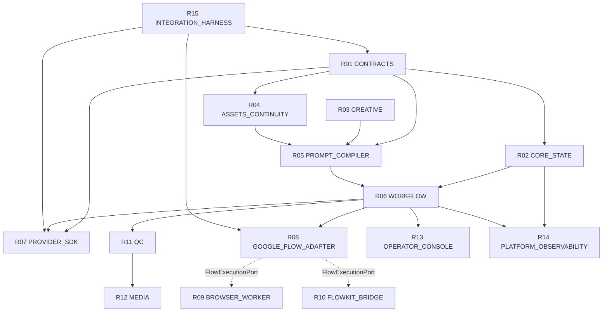

# Final Repository Dependency Graph (v1.0.0 DAG)

## Dependency Direction Invariants
- **INV-014 / G05:** Strict Unidirectional DAG (Zero Cycles).
- **CP-005 / G11:** FlowExecutionPort cleanly encapsulates Track A (R09) and Track B (R10) without upward dependency leakage.
