# C02R PROPONENT TECHNICAL BRIEF: CLUSTER 01 — CANONICAL DOMAIN PROVENANCE & ENTITY MODEL

**ROLE:** R01 Domain DDD Specialist (Domain-Driven Design & Contracts Architecture)  
**DECISION_CLUSTER:** CLUSTER-01 (Canonical Domain Provenance & Entity Model)  
**STAGE:** C02R Genuine Adversarial Cross-Examination (Proponent Opening Brief)  
**FINDINGS COVERED:** FINDING_001, FINDING_004, FINDING_018, FINDING_042, TECH-004 (B04), TECH-013 (M01), TECH-014 (M02), TECH-015 (M03), TECH-016 (M04), TECH-017 (M05)  
**DATE:** 2026-08-15  
**STATUS:** FORMAL_SUBMISSION  

---

## 1. Executive Position & Core Thesis

As the Domain-Driven Design (DDD) Specialist representing the core contracts boundary (`avf-contracts` / R01), I formally submit that the canonical domain entity model for the AI Video Factory (AVF) must strictly codify the unidirectional, immutable creative-to-execution lineage:

$$\mathbf{ShotVersion} \longrightarrow \mathbf{PromptVersion} \longrightarrow \mathbf{GenerationJob} \longrightarrow \mathbf{Take}$$

The prior draft specification (`domain-entities.schema.json` v1.0.0-rc) contained structural anti-patterns, circular dependencies, domain inversion, and engine-specific leakage. Specifically:
1. **Provenance Inversion & Circularity:** `ShotVersion` erroneously required `prompt_version_id`, making it impossible to author a creative shot prior to prompt compilation, and destroying shot revision integrity when multiple candidate prompts are evaluated.
2. **De-contextualized Compilation:** `PromptVersion` failed to link directly to `shot_version_id`, severing the immutable semantic trace between creative intent and provider-targeted prompt artifacts.
3. **Execution Blindness:** `GenerationJob` omitted critical provenance fields (`shot_id`, `shot_version_id`, `prompt_version_id`, `attempt_index`, normalized error structures, and lifecycle timestamps), crippling out-of-band auditability and distributed event correlation.
4. **Anemic Domain Models:** `ShotVersion` was stripped of creative intent properties (duration, action, camera motion, environment, reference sets, and constraints), reducing it to an empty shell.
5. **Asset Metadata & Legal Vulnerability:** `AssetVersion` omitted cryptographic checksums, MIME types, source classifications, and rights/licensing provenance metadata required for content authentication and asset reuse.
6. **Technology Leakage:** Base entities (`CharacterVersion`, `StyleVersion`) hardcoded diffusion-specific fields (`lora_weights_uri`, `face_embedding_hash`), violating bounded context separation and breaking non-diffusion or external API providers (e.g., Google Flow, Sora, Gen-3).
7. **Schema Laxity:** Identifier properties lacked strict RFC 4122 UUID validation patterns, introducing boundary corruption risks.

This brief establishes the rigorous domain justification, aggregate boundaries, relational integrity constraints, failure modes, and contract definitions necessary to resolve these defects completely under **CP-001 (SOL-01)**.

---

## 2. Deep Domain Analysis & Technical Evaluation

```mermaid
classDiagram
    direction TB
    class Shot {
        +UUID shot_id
        +UUID project_id
        +UUID scene_id
        +string shot_name
        +int current_version
        +RFC3339 created_at
    }
    class ShotVersion {
        +UUID shot_version_id
        +UUID shot_id
        +int version
        +number duration_sec
        +object action
        +object camera
        +object environment
        +UUID[] character_version_ids
        +UUID style_version_id
        +UUID[] asset_ids
        +string[] constraints
        +UUID[] continuity_refs
        +RFC3339 created_at
    }
    class PromptVersion {
        +UUID prompt_version_id
        +UUID shot_version_id
        +UUID shot_id
        +int version
        +string provider_family
        +string compiler_version
        +string prompt_text
        +string negative_prompt
        +object parameters
        +object ast_snapshot
        +string input_hash
        +RFC3339 created_at
    }
    class GenerationJob {
        +UUID generation_job_id
        +UUID project_id
        +UUID shot_id
        +UUID shot_version_id
        +UUID prompt_version_id
        +string provider_id
        +string provider_capability
        +string flow_execution_track
        +string idempotency_key
        +int attempt_index
        +int max_attempts
        +string status
        +string provider_job_id
        +string lease_token
        +RFC3339 lease_expires_at
        +object normalized_error
        +RFC3339 requested_at
        +RFC3339 submitted_at
        +RFC3339 completed_at
        +int entity_version
    }
    class Take {
        +UUID take_id
        +UUID project_id
        +UUID shot_id
        +UUID shot_version_id
        +UUID prompt_version_id
        +UUID generation_job_id
        +int take_number
        +string storage_uri
        +string mime_type
        +int byte_size
        +string checksum_sha256
        +number duration_sec
        +string qc_status
        +object qc_summary
        +RFC3339 created_at
    }
    class AssetVersion {
        +UUID asset_version_id
        +UUID asset_id
        +int version
        +string storage_uri
        +string checksum_sha256
        +string mime_type
        +int byte_size
        +string source_type
        +string license_type
        +string rights_attribution
        +string origin_uri
        +object custom_attributes
        +RFC3339 created_at
    }

    Shot "1" *-- "1..*" ShotVersion : versions
    ShotVersion "1" *-- "0..*" PromptVersion : compiles_to
    PromptVersion "1" *-- "0..*" GenerationJob : targets
    GenerationJob "1" *-- "0..*" Take : produces
    AssetVersion "1" <-- "0..*" ShotVersion : references
```



---

### 2.1. ShotVersion $\to$ PromptVersion $\to$ GenerationJob $\to$ Take Immutable Lineage

#### Domain Problem
In filmmaking and multi-modal generative video production, the business process follows a strictly hierarchical lifecycle:
1. **Creative Direction:** A director/screenwriter defines the dramatic beats, visual composition, camera movement, and pacing of a shot. This intent is versioned as a `ShotVersion`.
2. **Prompt Compilation:** A prompt compiler (R05) translates that creative intent, together with resolved character visual anchors and style constraints, into a concrete provider-specific syntax payload (`PromptVersion`).
3. **Generation Dispatch:** A distributed workflow engine (R06) leases execution capacity and dispatches the compiled prompt to a specific provider adapter (R07/R08/R09), instantiating a `GenerationJob`.
4. **Media Materialization:** The provider materializes video frames/clips, which are ingested, hashed, validated, and persisted as an immutable `Take`.

#### Architectural Breakdown & Invariants
- **Immutability of Creative Intent:** Once created, a `ShotVersion` cannot mutate. If the director changes the camera angle from a `PAN_LEFT_TO_RIGHT` to an `ORBIT_360`, a new `ShotVersion` ($V_{k+1}$) must be minted.
- **Independence of Prompt Compilation:** Multiple competing `PromptVersion` artifacts (e.g., Prompt A targeting Google Flow Veo-2, Prompt B targeting Runway Gen-3, Prompt C testing a different LLM enrichment template) can be compiled against the *exact same* `ShotVersion`. If `ShotVersion` contained a mandatory `prompt_version_id`, the system would be forced to mutate the shot or create synthetic duplicate shot versions, completely destroying shot version semantics.
- **Decoupled Execution Retries:** If a `GenerationJob` fails due to an upstream API timeout or transient worker crash (a technical retry), a new `GenerationJob` attempt is dispatched referencing the *same* `PromptVersion` and `ShotVersion`. If a generation produces a bad video requiring a prompt rewrite (a creative retry), a new `PromptVersion` is compiled referencing the same `ShotVersion`.
- **Take Lineage Preservation:** Every `Take` generated in the factory must carry an unbreakable cryptographic and relational audit trail back through its originating `GenerationJob`, `PromptVersion`, `ShotVersion`, and `Shot`. Even when a take is rejected by automated QC (R11) or discarded by a human operator (R13), the take record and its lineage remain permanent in R02 Core State to satisfy **System Invariant 10, 11, and 16**.

---

### 2.2. ShotVersion Creative Intent Completeness

#### Domain Problem
The prior draft stripped `ShotVersion` of its domain-specific fields, treating it merely as an empty envelope with arbitrary metadata blobs. This violated the core principle of Ubiquitous Language in DDD and crippled R05 (Prompt Compiler) and R03 (Creative), which depend on strongly-typed semantic fields.

#### Required Normative Schema for `ShotVersion`
A `ShotVersion` aggregate value MUST contain:
1. `shot_version_id` (UUIDv4) & `shot_id` (UUIDv4): Canonical primary and aggregate root identifiers.
2. `version` (int $\ge 1$): Sequential version index per shot.
3. `duration_sec` (float $> 0.0$): Explicit creative duration target in seconds (e.g., `4.5`), providing sub-second precision for video generation windows.
4. `action` (object): Structured action representation:
   - `description` (string, required): Prose description of the physical actions, subject movement, and dramatic beats occurring within the shot.
   - `action_beats` (array of objects, optional): Ordered micro-timeline of sub-actions (e.g., `[{"timestamp_sec": 0.0, "beat": "Character draws sword"}, {"timestamp_sec": 2.5, "beat": "Strikes crystal shield"}]`).
5. `camera` (object): Formal cinematography parameters:
   - `motion` (enum/string): e.g., `STATIC`, `PAN_LEFT`, `PAN_RIGHT`, `TILT_UP`, `TILT_DOWN`, `DOLLY_IN`, `DOLLY_OUT`, `CRANE_UP`, `TRACKING`, `ORBIT_CW`, `ORBIT_CCW`, `HANDHELD`.
   - `framing` (enum/string): e.g., `EXTREME_WIDE`, `WIDE`, `MEDIUM_FULL`, `MEDIUM_CLOSE_UP`, `CLOSE_UP`, `EXTREME_CLOSE_UP`.
   - `lens` (string/object): Focal length, aperture, and depth of field specification (e.g., `35mm anamorphic, f/1.8, shallow DOF`).
   - `speed` (string): Relative motion speed (e.g., `SLOW`, `NORMAL`, `FAST`, `WHIP`).
6. `environment` (object): Scene spatial and atmospheric context:
   - `location` (string): e.g., `Cyberpunk alleyway, neon-lit, rain-slicked pavement`.
   - `lighting` (string): e.g., `High-contrast chiaroscuro, cyan and magenta rim lights`.
   - `weather_atmosphere` (string): e.g., `Heavy rainfall, low-hanging mist, steam rising from grates`.
   - `time_of_day` (string): e.g., `MIDNIGHT`, `GOLDEN_HOUR`, `DUSK`.
7. `character_version_ids` (array of UUIDv4): Explicit foreign keys to the immutable `CharacterVersion` entities participating in this shot.
8. `style_version_id` (UUIDv4, nullable): Explicit foreign key to the `StyleVersion` defining the art direction and visual language.
9. `asset_ids` (array of UUIDv4): Explicit foreign keys to input/reference assets (e.g., background plates, storyboards, 3D roughs).
10. `constraints` (array of strings): Hard and soft negative/positive constraints (e.g., `"no motion blur"`, `"avoid modern vehicles"`, `"maintain facial scar on left cheek"`).
11. `continuity_refs` (array of UUIDv4): Direct references to preceding `ShotVersion` or `Take` entities to enforce visual/temporal continuity across scene transitions.

---

### 2.3. PromptVersion Linkage to `shot_version_id` and `shot_id`

#### Domain Problem
Prior schemas either omitted `shot_version_id` from `PromptVersion` (linking only to `shot_id`) or created a bidirectional cyclic reference. In DDD, a `PromptVersion` is a downstream bounded artifact compiled from an upstream `ShotVersion`.

#### Relational & DDD Rationale for Dual Linkage (`shot_version_id` + `shot_id`)
1. **Direct Lineage Anchor (`shot_version_id`):** `PromptVersion` cannot compile abstractly for a logical `Shot`; it compiles against a specific, immutable set of creative parameters defined in a specific `ShotVersion`. Storing `shot_version_id` guarantees that every prompt artifact is 100% reproducible.
2. **Denormalized Aggregate Partitioning (`shot_id`):** Including `shot_id` in `PromptVersion` provides immediate partition alignment in PostgreSQL and horizontal query filtering without executing multi-table joins across `shot_versions`.
3. **Compound Relational Invariant in R02:** In the relational storage layer of R02 Core State, referential integrity is guaranteed via compound foreign keys:
   ```sql
   CONSTRAINT fk_prompt_shot_version 
     FOREIGN KEY (shot_id, shot_version_id) 
     REFERENCES shot_versions(shot_id, shot_version_id) 
     ON DELETE RESTRICT
   ```
4. **Compiler Traceability:** In R05 (Prompt Compiler), the compilation record requires:
   - `input_hash`: SHA-256 hash of the concatenated normalized inputs (`ShotVersion` payload + `CharacterVersion` visual specs + `StyleVersion` rules + `compiler_version`).
   - `ast_snapshot`: Serialized Abstract Syntax Tree of the prompt before final provider syntax generation.
   - `provider_family`: Target generator class (e.g., `GOOGLE_FLOW`, `RUNWAY_GEN3`, `LUMA_DREAM_MACHINE`, `OPENAI_SORA`).

---

### 2.4. AssetVersion Storage, Checksum, MIME Type, and Rights Provenance Metadata

#### Domain Problem
The initial data model defined `Asset` as a monolithic entity, ignoring versioning and legal compliance. In professional production pipelines, assets undergo revisions (e.g., concept art retouching, upscale passes, audio remasters), and every asset binary used in AI generation carries significant legal, copyright, and provenance liabilities.

#### Entity Separation: `Asset` vs. `AssetVersion`
- **`Asset` (Logical Identity):** Represents the abstract business concept (e.g., "Sarah Connor Concept Portrait", `asset_id`).
- **`AssetVersion` (Immutable Content Snapshot):** Represents an exact binary payload stored in object storage with immutable metadata:

```json
{
  "asset_version_id": "8f3d1b22-54a8-4c91-a1b7-9e63e7c80210",
  "asset_id": "3a7b8e11-12c4-4a56-b789-0123456789ab",
  "version": 2,
  "storage_uri": "s3://avf-media-bucket/assets/characters/sarah_concept_v2.png",
  "checksum_sha256": "e3b0c44298fc1c149afbf4c8996fb92427ae41e4649b934ca495991b7852b855",
  "mime_type": "image/png",
  "byte_size": 4194304,
  "source_type": "ORIGINAL_UPLOAD",
  "license_type": "PROPRIETARY_INTERNAL",
  "rights_attribution": "Studio Art Department / Artist ID #4092",
  "origin_uri": "https://internal.dam.studio.com/assets/4092/sarah_v2.png",
  "custom_attributes": {
    "resolution_width": 3840,
    "resolution_height": 2160,
    "color_space": "sRGB",
    "embedding_model": "clip-vit-large-patch14"
  },
  "created_at": "2026-08-15T21:00:00Z"
}
```

#### Verification & Compliance Invariants
- **Content Deduplication (CAS):** `checksum_sha256` enables strict Content-Addressable Storage (CAS) semantics in R04 (Assets & Continuity). Duplicate uploads are detected deterministically.
- **MIME Type Whitelisting:** Strict RFC 6838 validation prevents unsupported binary execution or injection attacks across bounded worker services.
- **Rights & Provenance Enforcement:** Before R05 compiles an asset into a provider reference set or before R07 uploads an image anchor to an external AI API, R04 must validate `license_type` against project compliance policy, preventing accidental copyright infringement.

---

### 2.5. Removal of Mandatory LoRA and Face Embedding Fields into Extensible Custom Attributes

#### Domain Problem
The previous schema draft mandated fields such as `face_embedding_hash` on `CharacterVersion` and `lora_weights_uri` on `StyleVersion`. This was a catastrophic architectural error:
1. **Technology Coupling:** It bound the entire AVF domain model to local Stable Diffusion / ComfyUI / InsightFace paradigms.
2. **Provider Incompatibility:** Modern cloud video foundation models (e.g., Google Flow Veo-2, Sora, Gen-3) do not accept arbitrary `.safetensors` LoRA weights or 512-d float vectors over their public or web interfaces.
3. **Data Pollution:** Forcing these fields to be required forced upstream clients to inject placeholder garbage (`"face_embedding_hash": "0000000000000000"`) to pass schema validation.

#### DDD Solution: Core Semantics + Extensible Namespaced Attributes
- **Base Entities are Pure:** `CharacterVersion` defines canonical visual attributes (physical traits, hair, eye color, facial hair, costume constraints, canonical reference images). `StyleVersion` defines art direction (film stock, lighting palette, rendering medium, prohibited aesthetics).
- **Extensible Adaptation:** Technology-specific artifacts belong in `custom_attributes` (or provider-specific adapter registries). For a local SDXL pipeline, `custom_attributes` contains `{"lora_weights_uri": "...", "lora_scale": 0.85}`. For an InsightFace pipeline, it contains `{"face_embedding_hash": "..."}`. For Google Flow, it contains `{"prompt_style_tag": "cinematic_veo2"}`.

This preserves domain model generality across all past, present, and future AI generation engines.

---

### 2.6. Strict RFC 4122 UUID Validation

#### Domain Problem
Lax schema patterns (such as `"type": "string"` without formatting, or allowing arbitrary non-UUID mock strings like `"shot_001"`) allow malformed identifiers to traverse bounded contexts, resulting in:
- Runtime SQL casting exceptions (`ERROR: invalid input syntax for type uuid`) in R02 Core State PostgreSQL.
- Distributed tracing disconnections across message brokers where UUID binary representations or strict string validators are used.
- Collisions in distributed worker nodes generating concurrent records.

#### Formal Contract Specification
All canonical entity IDs, foreign keys, and correlation tokens in `02_contracts/domain-entities.schema.json` and associated schemas MUST use the standardized `$defs/UUID` definition:

```json
"UUID": {
  "type": "string",
  "format": "uuid",
  "pattern": "^[0-9a-fA-F]{8}-[0-9a-fA-F]{4}-[1-5][0-9a-fA-F]{3}-[89abAB][0-9a-fA-F]{3}-[0-9a-fA-F]{12}$"
}
```

This enforces strict RFC 4122 compliance across all 15 AVF repositories. Test harnesses and mock generators in R15 are required to use deterministic UUIDv5 (derived from namespace + seed) or standard UUIDv4, eliminating ad-hoc string hacks.

---

## 3. Concrete Failure Modes & Boundary Leak Analysis

| ID | Failure Mode Scenario | Boundary / Contract Leak | Severity | Mitigation via Proponent Model |
|---|---|---|---|---|
| **FM-01** | **Circular Dependency Deadlock:** User creates a new shot in R13 Console. If `ShotVersion` requires `prompt_version_id`, R02 rejects the write because no prompt has been compiled. R05 cannot compile a prompt because no `shot_version_id` exists. | `ShotVersion` $\leftrightarrow$ `PromptVersion` schema circularity | CRITICAL | Remove `prompt_version_id` from `ShotVersion`. Prompt compilation strictly follows Shot creation. |
| **FM-02** | **Multi-Prompt Trace Loss:** R05 compiles 3 distinct prompt variations (exploring different camera descriptors) for Shot 4, Version 1. Under inverted lineage, creating prompt 2 and 3 overwrites the reference in ShotVersion or requires creating synthetic ShotVersions 2 and 3. | Schema mismatch in R02 state persistence | HIGH | `PromptVersion` references `shot_version_id`. Multiple `PromptVersion` records cleanly associate with a single `ShotVersion`. |
| **FM-03** | **Generation Job State Blindness:** A browser worker running Google Flow crashes mid-generation. During recovery, the orchestrator inspects `GenerationJob`. Because `shot_id`, `shot_version_id`, and `prompt_version_id` were omitted in legacy drafts, the recovery worker cannot determine which prompt was executing. | Orchestrator state reconstruction failure | HIGH | `GenerationJob` holds the full tuple (`shot_id`, `shot_version_id`, `prompt_version_id`, `attempt_index`). State is 100% self-describing. |
| **FM-04** | **CAS Collision & Media Tampering:** A rogue worker or failing disk corrupts a generated MP4 file. R11 QC processes the corrupted media without verifying its checksum. | Media integrity boundary breach | HIGH | `Take` and `AssetVersion` enforce mandatory `checksum_sha256`. QC and storage adapters fail fast on hash mismatch. |
| **FM-05** | **Provider Incompatibility Rejection:** An operator dispatches a generation job to Google Flow Veo-2. The legacy schema rejects the request because Google Flow has no `lora_weights_uri`. | Domain model pollution by adapter details | HIGH | Decouple LoRA and face embedding into optional `custom_attributes`. |
| **FM-06** | **Database Cast Failure on Ingest:** A test runner submits `"shot_id": "shot-intro-01"`. R02 PostgreSQL executes `INSERT INTO shots (id) VALUES ('shot-intro-01')`, triggering a database driver crash. | Type safety leakage at API boundary | MEDIUM | Enforce strict RFC 4122 regex in JSON Schema at API gateway / ingress validation. |

---

## 4. Contractual Invariants & State Persistence Specifications

To ensure exact implementation across repositories, the following normative invariants are established:

### 4.1. Core State (R02) Relational Schema Invariants
1. **Primary & Foreign Key Hierarchy:**
   - Table `shots`: `PRIMARY KEY (shot_id)`
   - Table `shot_versions`: `PRIMARY KEY (shot_id, shot_version_id)`, `UNIQUE (shot_version_id)`
   - Table `prompt_versions`: `PRIMARY KEY (prompt_version_id)`, `FOREIGN KEY (shot_id, shot_version_id) REFERENCES shot_versions(shot_id, shot_version_id)`
   - Table `generation_jobs`: `PRIMARY KEY (generation_job_id)`, `FOREIGN KEY (shot_id, shot_version_id) REFERENCES shot_versions(shot_id, shot_version_id)`, `FOREIGN KEY (prompt_version_id) REFERENCES prompt_versions(prompt_version_id)`
   - Table `takes`: `PRIMARY KEY (take_id)`, `FOREIGN KEY (generation_job_id) REFERENCES generation_jobs(generation_job_id)`
2. **Append-Only Immutability:**
   - Rows in `shot_versions`, `prompt_versions`, and `takes` are immutable. `UPDATE` statements are prohibited by database-level triggers; changes require inserting a new version record.
   - Rows in `generation_jobs` follow strict state machine transitions (`REQUESTED` $\to$ `SUBMITTED` $\to$ `RUNNING` $\to$ `COMPLETED` | `FAILED`) with optimistic locking via `entity_version`.

### 4.2. Schema Entrypoints and Fragment Exports (TECH-017)
`02_contracts/domain-entities.schema.json` must expose clear `$defs` entrypoints for individual code generators and runtime validators:
- `#/$defs/Project`
- `#/$defs/Shot`
- `#/$defs/ShotVersion`
- `#/$defs/PromptVersion`
- `#/$defs/GenerationJob`
- `#/$defs/Take`
- `#/$defs/Asset`
- `#/$defs/AssetVersion`
- `#/$defs/Character`
- `#/$defs/CharacterVersion`
- `#/$defs/StyleProfile`
- `#/$defs/StyleVersion`
- `#/$defs/UUID`

---

## 5. Defense Against Anticipated Challenger Objections

### Objection 1: "Denormalizing `shot_id` and `shot_version_id` onto `GenerationJob` and `Take` violates database normalization (3NF) and risks data anomaly."
**Proponent Rebuttal:**  
In high-throughput event-driven microservice architectures, pure 3NF normalization introduces prohibitive join overhead on critical query paths (such as real-time dashboard rendering in R13 and state polling in R06). More critically, in event-driven messaging, event payloads (e.g., `GenerationCompletedEvent`, `TakeCreatedEvent`) must be self-contained so downstream consumers (e.g., R11 QC, R12 Media Processing) do not have to perform synchronous distributed query call-backs to R02 Core State to discover the parent `shot_id`. Relational integrity is rigorously maintained in R02 via compound foreign keys, ensuring zero risk of orphaned or mismatched records.

### Objection 2: "Enforcing strict RFC 4122 UUID regex creates friction in unit and contract testing where developers prefer readable string identifiers like `'test-shot-1'`."
**Proponent Rebuttal:**  
Permitting lax string patterns in contracts creates a severe boundary vulnerability. If testing environments accept arbitrary strings while production PostgreSQL databases enforce native 128-bit `uuid` column types, contract testing is rendered invalid and cannot detect real integration failures. Standard testing libraries (e.g., Python `uuid.uuid4()`, `uuid.uuid5()`, or deterministic UUID v5 fixtures) generate valid RFC 4122 UUIDs instantaneously. Type rigor at the contract level is non-negotiable.

### Objection 3: "Moving LoRA and face embedding fields to `custom_attributes` weakens type safety for diffusion-based workflows."
**Proponent Rebuttal:**  
The canonical domain model (`domain-entities.schema.json`) must remain universal across all video generation backends. Bounding the core schema to LoRA weights destroys its utility for non-diffusion models (e.g., Google Flow, OpenAI Sora). Type safety for specific model architectures is maintained by defining specialized adapter schema extensions within R04 (Assets) and R07/R08 (Provider SDK / Google Flow Adapter) that validate `custom_attributes` when a diffusion pipeline is selected.

---

## 6. Exact Normative Changes Required

Upon confirmation of this brief in C02R, the following files will be updated in C03R / Remediation:
1. `02_contracts/domain-entities.schema.json`:
   - Re-anchor `ShotVersion` as independent creative intent entity.
   - Update `PromptVersion` to require `shot_version_id` and `shot_id`.
   - Update `GenerationJob` to require `shot_id`, `shot_version_id`, `prompt_version_id`, `attempt_index`, `normalized_error`, and lifecycle timestamps.
   - Update `Take` to include full lineage references, `checksum_sha256`, and `mime_type`.
   - Expand `AssetVersion` with storage, checksum, MIME, and licensing fields.
   - Standardize all UUID definitions on strict RFC 4122 regex.
   - Move `lora_weights_uri` and `face_embedding_hash` to optional `custom_attributes`.
2. `01_master/DATA_MODEL.md`: Update ER diagrams and entity text to reflect this exact lineage.
3. `02_contracts/CONTRACTS_OVERVIEW.md`: Document JSON Schema `$defs` fragment entrypoints.
4. `03_repo_blueprints/R01_CONTRACTS.md` & `R02_CORE_STATE.md`: Update responsibilities and relational constraints.

---

## 7. Conclusion

The proposed canonical provenance model eliminates circular dependencies, restores rich creative intent, guarantees end-to-end auditability, isolates technology-specific variables, and establishes absolute contract strictness. I urge the Architecture Council to confirm and adopt this model without reservation.
