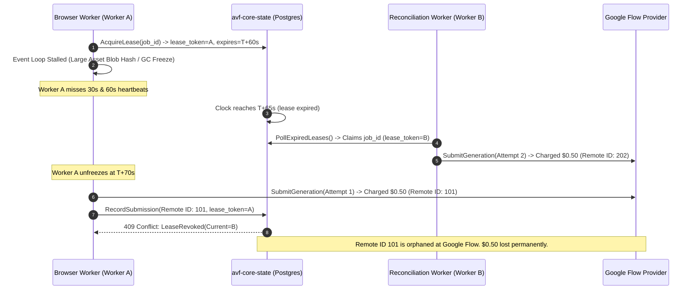
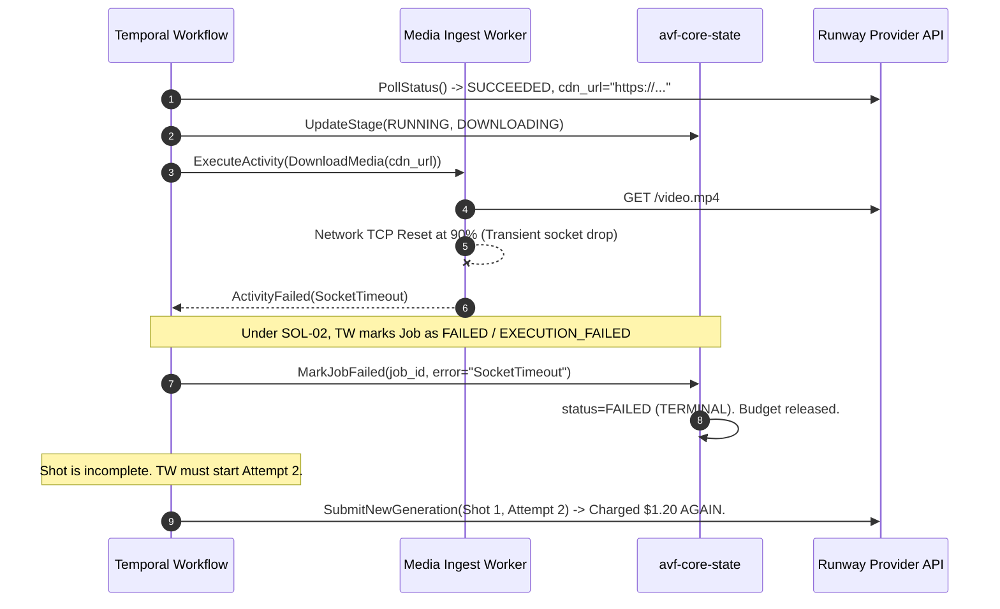

# C02R GENUINE CHALLENGER ATTACK: DECISION CLUSTER 02
**DOMAIN:** GenerationJob Lifecycle, Two-Tier State Machine & Distributed Orchestration  
**ROLE:** R03 (Workflow Specialist)  
**TARGET PROPOSAL:** CP-002 / SOL-02 (Hierarchical Two-Tier GenerationJob Lifecycle State Machine)  
**STATUS:** ACTIVE_CHALLENGE  
**DATE:** 2026-08-15  

---

## 1. Executive Stance & Core Critique

The proposed hierarchical two-tier state model (CP-002 / SOL-02)—which maps 7 coarse-grained database lifecycle states (`status`) to 11 fine-grained execution stages (`execution_stage`)—is structurally inadequate for mission-critical video generation workloads. While it addresses basic query ergonomics for top-level status reporting, it introduces severe architectural vulnerabilities:

1. **Dual-Authority Split-Brain:** Temporal workflow history and PostgreSQL core state operate under asynchronous dual-write conditions without distributed transaction coordination or deterministic bi-directional fencing.
2. **Zombie Worker & Financial Side-Effect Leaks:** The database lease heartbeat mechanism protects only PostgreSQL record mutations via optimistic concurrency; it provides zero fencing against external, non-transactional provider API calls (Google Flow, Runway, Luma). A stalled worker whose lease expires will continue executing third-party browser/API commands concurrently with a takeover worker, resulting in duplicate generation costs and exhausted provider quotas.
3. **Catastrophic Error Provenance Erasure:** Modeling failures during downstream stages (`DOWNLOADING`, `QC_RUNNING`) as terminal `FAILED` states destroys critical distinctions between provider billing outcomes, transport network faults, evaluator infrastructure crashes (e.g., CUDA OOM), and genuine semantic quality rejections. This triggers corrupted cost ledgers and destructive, erroneous prompt re-compilation feedback loops.

---

## 2. Deep Attack Vector 1: Split-Brain Conditions (PostgreSQL vs Temporal History)

### 2.1 Dual-Write Asynchrony and the "Activity Success / DB Commit Failure" Gap
In the AVF architecture, `avf-workflow` (R06) runs durable orchestrations in Temporal, while `avf-core-state` (R02) owns canonical business truth in PostgreSQL (`ADR-002`, `ADR-008`). Every state change in a generation pipeline involves two distinct state engines:

```
[Temporal Workflow] --(Execute Activity)--> [Worker Activity] --(HTTP/gRPC RPC)--> [avf-core-state (PostgreSQL)]
```

This model is inherently susceptible to dual-write partial failures:

1. **Failure Mode 1: DB Write Succeeds, Temporal Activity Completion Crashes**
   - The worker activity executes `avf-core-state.UpdateExecutionStage(job_id, stage='DOWNLOADING', entity_version=3)`. PostgreSQL commits the transaction (`status = RUNNING`, `execution_stage = DOWNLOADING`, `entity_version = 4`).
   - Before the worker can return the activity result to the Temporal server, the worker container suffers a SIGKILL or network partition.
   - Temporal detects activity worker loss and re-dispatches the activity to a new worker.
   - The new worker attempts to execute the same activity from the beginning, calling `avf-core-state.UpdateExecutionStage(job_id, stage='DOWNLOADING', entity_version=3)`.
   - **Result:** PostgreSQL rejects the call with `409 Conflict: expected_version 3, current_version 4`. The Temporal workflow crashes with an unhandled non-retryable activity failure, leaving the workflow stuck indefinitely while PostgreSQL marks the job as `RUNNING / DOWNLOADING`.

2. **Failure Mode 2: External Action Commits, DB State Update Fails**
   - In `SUBMITTING`, the worker successfully invokes the provider API (e.g. Google Flow submit) and obtains a remote `provider_job_id = "gen_abc123"`.
   - The worker immediately attempts to persist `execution_stage = SUBMITTED` and `provider_job_id` to PostgreSQL.
   - PostgreSQL is experiencing a transient connection pool exhaustion or deadlock, returning `503 Service Unavailable`.
   - Temporal retries the activity. If the activity does not implement strict provider query reconciliation before resubmitting, it invokes the provider API a second time with a new remote task, generating two videos and charging the user twice.

### 2.2 Out-of-Band Cancellation Divergence
The specification allows cancellations to originate from either the Operator Console (`R13_OPERATOR_CONSOLE.md` via `avf-core-state` REST API) or Temporal Workflow signals (`SignalApprove`, `CancelWorkflow`).

- **Scenario:** An operator cancels a runaway generation job via `POST /api/v1/jobs/{id}/cancel`.
- `avf-core-state` sets `status = CANCELLED`, `execution_stage = ABORTED_BY_USER`, releases the budget reservation, and increments `entity_version`.
- Meanwhile, a Temporal activity `ExecuteGoogleFlowBrowserTask` is actively running on a headless browser worker.
- Because Temporal does not poll PostgreSQL, the browser worker continues rendering for another 4 minutes.
- Upon completion, the browser worker calls `avf-core-state.RecordGenerationSuccess(take_payload)`.
- `avf-core-state` rejects the write because `status = CANCELLED` is immutable (`STATUS_STATE_MACHINES.md#3.2`).
- The worker drops the generated video. The video was fully generated and billed by the external provider, but no `Take` or `CostUsageRecord` is persisted, causing an irreconcilable financial discrepancy between external vendor invoices and AVF internal ledger.

### 2.3 Event Re-ordering & Outbox Telemetry Race
`avf-core-state` emits domain events via a transactional outbox table. Telemetry workers consume the outbox to publish events (`JobStageChanged`).
- Under heavy load or partition rebalancing, event publication order is not guaranteed across multiple event workers unless strictly partitioned by `job_id`.
- If an operator dashboard consumes `JobStageChanged(DOWNLOADING)` followed immediately by an out-of-order `JobStageChanged(SUBMITTING)`, the UI displays an invalid regression from `DOWNLOADING` to `SUBMITTING`.
- The two-tier model has no monotonic sequence counter or `vector_clock` inside `ExecutionStage` events, making out-of-order stage updates undetectable by downstream consumers.

---

## 3. Deep Attack Vector 2: Heartbeat Expiration & Lease Takeover Races

### 3.1 The Asymmetric Heartbeat & Local Fencing Defect
CP-018 and SOL-02 define a 90-minute safety lease with 30-second worker heartbeats (`lease_expires_at = NOW() + 90s`, renewed every 30s).
However, this lease mechanism lacks **distributed fencing tokens** at the point of external execution:

```
Timeline:
T0: Worker A acquires Job (lease_token_A, entity_version=1). Begins Google Flow browser automation.
T30: Worker A experiences thread starvation / CPU stall / synchronous FFmpeg probe blocking event loop.
T60: Worker A misses heartbeat.
T90: PostgreSQL lease_expires_at expires.
T91: Reconciliation Worker B polls DB, detects expired lease, takes over lease (lease_token_B, entity_version=2).
T92: Worker B dispatches new browser worker to start generation attempt.
T93: Worker A unfreezes. Worker A is completely unaware that its lease was revoked because it does not validate lease status prior to third-party I/O.
T94: Worker A clicks "Generate" on Google Flow tab -> Remote render 1 starts (Costs $0.50).
T95: Worker B clicks "Generate" on Google Flow tab -> Remote render 2 starts (Costs $0.50).
T120: Worker A completes and attempts to write Take to DB -> REJECTED (lease_token_A != lease_token_B).
T130: Worker B completes and writes Take to DB -> ACCEPTED.
```

**The Core Defect:** Database-level optimistic locking (`entity_version`, `lease_token`) is a *write-fence*, not an *execution-fence*. It prevents dirty writes to PostgreSQL, but it **cannot prevent external side-effects**. The system incurs double billing and quota starvation because the worker does not check lease validity against a fast local heartbeat cache before executing unrecoverable provider operations.

### 3.2 Reconciliation Worker vs In-Flight Temporal Workflow Desynchronization
When a lease expires and the Reconciliation Worker (in `avf-core-state`) takes over:
- R02 transitions the DB record: `status = RECONCILED, execution_stage = RECONCILED_TERMINAL`.
- However, the Temporal workflow orchestrating this generation attempt is still blocked inside `workflow.ExecuteActivity(RunGenerationJobActivity)`.
- Temporal's activity timeout is configured for the full task duration (e.g. 15–30 minutes).
- **The Split-Brain:** R02 Core State considers the job `RECONCILED` (terminal), while Temporal Workflow considers the job actively `RUNNING`.
- Unless the Reconciliation Worker explicitly invokes `TemporalClient.SignalWorkflowExecution(workflow_id, "ReconciliationSignal", ...)` or terminates the workflow execution, the Temporal workflow will hang until its activity timeout fires, creating ghost workflows and exhausting Temporal execution slots.

---

## 4. Deep Attack Vector 3: Pipeline Failure Provenance (Downloading vs QC Execution)

### 4.1 Downloader Failure: Ingestion I/O vs Remote Provider Failure
A generation job passes through `SUBMITTED -> GENERATING -> DOWNLOADING -> DOWNLOADED -> QC_RUNNING -> APPROVED`.

Consider a failure during `DOWNLOADING`:
- The provider successfully synthesized the video. Remote `provider_job_id = "runway_9988"` completed with HTTP 200.
- The AVF media worker attempts to download the binary MP4 stream from the provider's signed CDN URL to ingest it into local S3-compatible storage.
- The download fails mid-stream (e.g., CDN TCP reset at 85%, disk full on media worker, or S3 ingress network timeout).

**Under the Proposed Two-Tier Model:**
1. The transition matrix moves the job to `status = FAILED, execution_stage = EXECUTION_FAILED`.
2. `STATUS_STATE_MACHINES.md` states: *"Terminal Immutability: Once a job enters COMPLETED, FAILED, CANCELLED, or RECONCILED, its state is immutable."*
3. Because `FAILED` is terminal for `GenerationJob`, the Temporal workflow cannot simply retry the `DownloadMediaActivity`.
4. To fulfill the shot, the workflow is forced to spawn a brand new `GenerationJob` (Attempt 2), which compiles a new prompt, contacts the provider, and triggers a full re-generation!
5. **Impact:** The system burns 100% additional provider credits and incurs an unnecessary 2-5 minute delay for a failure that was strictly a transient ingress transport glitch.
6. **Financial Ledger Corruption:** When `GenerationJob` transitions to `FAILED`, the reservation settlement logic releases reserved credits without recording `actual_cost_credits`, even though the provider already billed for `provider_job_id = "runway_9988"`.

### 4.2 QC Execution Failure: Evaluator Crash vs Creative Quality Rejection
When a job enters `QC_RUNNING`, the media binary is fully downloaded and registered as a candidate `Take`.

Consider two radically different failure modes during `QC_RUNNING`:

| Dimension | Scenario 1: Semantic QC Rejection | Scenario 2: Evaluator Infrastructure Crash |
|---|---|---|
| **Root Cause** | Video has severe temporal flicker and character face distortion (Semantic Score = 0.32 < 0.70 threshold). | MLLM Evaluator worker runs out of VRAM (`CUDA Out of Memory`) or Python FFprobe worker segfaults. |
| **Domain Meaning** | Creative output is defective; prompt or seed parameters need variation. | System infrastructure failed; media file is unverified. |
| **Correct System Action** | Feed QC failure issues into `PromptCompiler.refine_prompt()` and generate a new Take with modified parameters. | Retry the QC evaluation activity on another worker without modifying prompts or re-generating video. |
| **Proposed Two-Tier Behavior** | `status = FAILED`, `execution_stage = QC_REJECTED`. | `status = FAILED`, `execution_stage = QC_REJECTED` or `EXECUTION_FAILED`. |

**The Destruction of Error Provenance:**
- The proposed `ExecutionStage` enum has only `EXECUTION_FAILED`, `QC_REJECTED`, and `TIMEOUT`.
- The `NormalizedError` enum contains only generic codes (`NETWORK_TIMEOUT`, `BAD_REQUEST`, `PROVIDER_INTERNAL_ERROR`, etc.).
- When an evaluator worker crashes on CUDA OOM, it cannot be categorized as `QC_REJECTED` (which implies creative rejection) without poisoning the upstream LLM prompt compiler.
- If the workflow receives `QC_REJECTED`, the creative feedback loop interprets the evaluator crash as an artistic defect in the prompt, instructing the LLM to rewrite the prompt. The original, perfectly valid prompt is discarded due to an infrastructure OOM!
- Furthermore, marking the entire `GenerationJob` as `FAILED` invalidates the `Take`, even though the media was successfully produced and may be completely flawless.

---

## 5. Concrete Failure Scenarios & Sequence Walkthroughs

### Scenario A: The Stalled Browser Worker Zombie Submission


### Scenario B: Download Glitch Forcing Expensive Provider Re-generation


---

## 6. Mandatory Specification Remediation Requirements

To close these critical gaps before v1.0 freeze, the specification must be amended with the following normative invariants:

### Requirement 1: Three-Tier State Architecture with Recoverable Activity Retries
`STATUS_STATE_MACHINES.md` and `domain-entities.schema.json` must decouple **Activity Execution Steps** from **Canonical Job Status**:
- `DOWNLOADING` and `QC_RUNNING` must be modeled as **downstream pipeline phases** of an existing generation attempt, not immutable traps where transient I/O forces full re-generation.
- If `DOWNLOADING` fails, the activity retries against the existing `provider_job_id` without transitioning `GenerationJob` to `FAILED`.
- If the CDN URL expires before download completes, a dedicated `REFRESH_DOWNLOAD_URL` activity must be executed prior to any re-generation escalation.

### Requirement 2: Strict Error Domain Separation in `NormalizedError`
`NormalizedError` must introduce a mandatory `error_domain` discriminator:
```json
{
  "error_domain": {
    "type": "string",
    "enum": [
      "PROVIDER_EXECUTION",
      "INGEST_TRANSPORT",
      "QC_EVALUATOR_INFRASTRUCTURE",
      "QC_SEMANTIC_REJECTION",
      "ORCHESTRATION_LEASE"
    ]
  }
}
```
- Failures with `error_domain = QC_EVALUATOR_INFRASTRUCTURE` must **never** trigger prompt mutation in `R05_PROMPT_COMPILER`.
- Failures with `error_domain = INGEST_TRANSPORT` must **never** cancel or invalidate provider credit settlement.

### Requirement 3: Local Pre-Execution Fencing & Heartbeat Validation
`R09_BROWSER_WORKER.md` and `R07_PROVIDER_SDK.md` must mandate:
- Workers must maintain a local heartbeat timer thread.
- Before issuing any non-idempotent external HTTP request or browser click, the worker MUST evaluate:
  $$\text{NOW}() < \text{local\_lease\_expires\_at} - \text{SAFETY\_MARGIN\_MS (5000ms)}$$
- If the lease is within 5 seconds of expiration or heartbeat renewal failed, the worker must abort execution locally *before* triggering the remote side effect.

### Requirement 4: Bi-Directional Temporal Signaling for Reconciliation Takeover
`R02_CORE_STATE.md` and `R06_WORKFLOW.md` must specify:
- When a Reconciliation Worker claims an expired lease, it MUST issue a `SignalWorkflowExecution(workflow_id, "LeaseRevokedSignal", {new_lease_token})` or `TerminateWorkflowExecution` to Temporal.
- Temporal workflow definitions must listen for `LeaseRevokedSignal` and immediately cancel running child activities to prevent zombie operations.

### Requirement 5: Two-Phase Financial Settlement on Partial Pipeline Failures
If a `GenerationJob` fails during `DOWNLOADING` or `QC_RUNNING` after provider generation has succeeded:
- `actual_cost_credits` MUST be finalized and committed to `CostUsageRecord` in PostgreSQL.
- The `GenerationJob` status must transition to `FAILED_DOWNSTREAM` (preserving `provider_job_id` and cost records), rather than a generic `FAILED` that releases reservations without billing.

---

## 7. Challenger Conclusion

The two-tier state machine proposed in CP-002 / SOL-02 provides only a cosmetic taxonomy without solving the underlying distributed systems challenges of dual authority, zombie execution, financial leakage, and error provenance destruction. 

Unless the remediation requirements above (three-tier retry boundaries, local execution fencing, discriminated error domains, and bi-directional reconciliation signaling) are normatively codified, the state machine will fail under production load, resulting in double-billed generation jobs, orphaned browser processes, and corrupted creative feedback loops.
