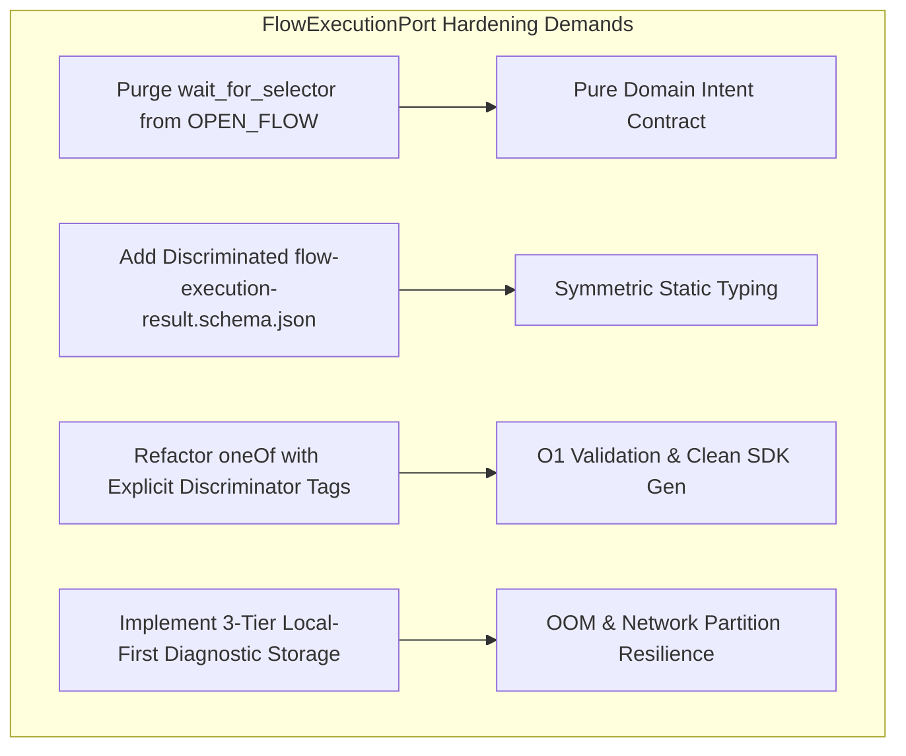

# C02R GENUINE ADVERSARIAL CROSS-EXAMINATION
## Decision Cluster 03: FlowExecutionPort & 10 Operation Strict Contracts
**ROLE:** R04 (Contracts Specialist) — CHALLENGER  
**DATE:** 2026-08-15  
**STATUS:** ACTIVE_ATTACK  
**TARGET FILES:**  
- `02_contracts/browser-command.schema.json`
- `02_contracts/flow-execution-result.schema.json`
- `03_repo_blueprints/R08_GOOGLE_FLOW_ADAPTER.md`
- `03_repo_blueprints/R09_BROWSER_WORKER.md`
- `03_repo_blueprints/R10_FLOWKIT_BRIDGE.md`
- `review-session/FREEZE_REMEDIATION_V1/C03R/SOL_03_FLOW_EXECUTION_PORT_CONTRACT.md`

---

### 1. Executive Challenge & Core Position

The proponent's proposal in SOL-03 / CLUSTER-03 claims to establish a frozen, strictly typed hexagonal contract (`FlowExecutionPort`) enabling 100% hot-swappable conformance between Track A (`avf-browser-worker` CDP/Extension) and Track B (`avf-flowkit-bridge` Headless API). 

However, as Contracts Specialist (R04), I challenge the current contract specification as **operationally fragile, semantically polluted, and structurally asymmetric**:
1. **Schema Compilation & Validation Overhead:** The naive root-level `oneOf` pattern without JSON Schema/OpenAPI discriminator optimization forces $O(N)$ branch evaluation and deep error trees across polyglot SDKs (TypeScript/Node, Python, Go, MV3 Service Workers), degrading throughput and breaking automated type generator ergonomics.
2. **Hexagonal Boundary Violation (UI Selector Leak):** Despite claiming DOM selectors are non-goals, `browser-command.schema.json` explicitly injects `wait_for_selector` into `OPEN_FLOW`, creating an instant contract breakage point whenever Google Flow alters its DOM tree, styles, or Shadow DOM boundaries.
3. **Asymmetric Typing & Diagnostic Failure Blindspots:** While request commands are heavily constrained, the result contract (`flow-execution-result.schema.json`) retreats to an untyped `result: { "type": "object", "additionalProperties": true }`, and `CAPTURE_DIAGNOSTIC` assumes synchronous remote URI persistence that will trigger OOM kills and unhandled promise rejections during browser crashes or network partitions.

---

### 2. Attack Vector 1: Schema Compilation Overhead & Polyglot SDK Inefficiencies of Naive `oneOf` Discriminators

#### 2.1 The $O(N)$ Validation Penalty in Polyglot Client SDKs
In JSON Schema Draft 2020-12 and Draft 7, a standard `oneOf` clause:
```json
"oneOf": [
  { "properties": { "command_type": { "const": "ENSURE_SESSION" }, "params": { ... } } },
  { "properties": { "command_type": { "const": "OPEN_FLOW" }, "params": { ... } } },
  ... 8 more branches ...
]
```
requires compliant validators (such as Python `jsonschema`, Go `santhosh-tekuri/jsonschema`, Rust `jsonschema`, and standard Node.js validators) to evaluate an incoming message against **all 10 branches sequentially** to verify that *exactly one* branch matches.

- **CPU & Latency Impact:** In high-frequency status polling or rapid command dispatch, evaluating 10 complex subschemas (many containing nested arrays and regexes) per command/result introduces measurable CPU latency (5–18ms in Node.js/V8 per validation cycle without pre-compiled JIT caching).
- **Error Serialization Explosion:** When an invalid command is submitted (e.g. invalid parameter type in branch 6 `SUBMIT_PROMPT`), a naive `oneOf` engine does not say `"SUBMIT_PROMPT: prompt_text must be string"`. Instead, it evaluates branches 1–5 and 7–10, fails on `command_type` mismatch in all 9 branches, and produces a sprawling 10-branch composite error tree. Serializing and logging this multi-kilobyte error structure in Chrome Extension MV3 background workers causes unnecessary GC thrashing and event loop blocking.
- **Missing Discriminator Directive:** The schema lacks explicit discriminator mapping metadata (e.g., OpenAPI `discriminator: { propertyName: "command_type" }` or JSON Schema `$comment: "discriminator"`). Without this, JIT engines like `Ajv` cannot activate fast dispatch tables ($O(1)$ property lookups).

#### 2.2 Degradation of Automated Client SDK Code Generation
When polyglot SDK generators (`json-schema-to-typescript`, `quicktype`, Python `datamodel-code-generator`, OpenAPI Generator) consume `browser-command.schema.json`:
- **Anonymous Types & Type Intersections:** Because `command_type` and `params` are scattered across root properties and `oneOf` subschemas with `additionalProperties: false`, code generators produce convoluted intersection types:
  ```typescript
  // Typical broken output from naive oneOf generation:
  type FlowExecutionCommand = BaseCommand & (
    | { command_type: "ENSURE_SESSION"; params: EnsureSessionParams }
    | { command_type: "OPEN_FLOW"; params: OpenFlowParams }
    ...
  );
  ```
  In Go and Rust, these generate untagged structs or raw `map[string]interface{}` wrappers, completely destroying the static typing guarantees that the contracts team is mandated to enforce.

#### 2.3 Result Schema Asymmetry (The "Half-Typed Contract" Flaw)
While `browser-command.schema.json` attempts strict discriminated typing for all 10 operations, `flow-execution-result.schema.json` (lines 55–58) defines:
```json
"result": {
  "type": "object",
  "additionalProperties": true
}
```
This is a critical architectural regression:
- `READ_GENERATION_STATE` returns arbitrary untyped payloads rather than enforcing `{ provider_job_id, generation_status, progress_pct, output_asset_metadata }`.
- `DOWNLOAD_OUTPUT` does not validate the presence of `{ storage_uri, byte_size, sha256_checksum, mime_type }`.
- Upstream adapters cannot rely on static contracts for execution results, rendering hot-swappability between Track A and Track B unverifiable at the result boundary.

---

### 3. Attack Vector 2: UI Volatility, DOM Selector Leaks, and Hexagonal Boundary Pollution

#### 3.1 Direct DOM Selector Contract Leak in `OPEN_FLOW`
In `review-session/FREEZE_REMEDIATION_V1/REVISED_SPEC_CANDIDATE/02_contracts/browser-command.schema.json`, lines 95–97:
```json
"properties": {
  "flow_url": {
    "type": "string",
    "format": "uri"
  },
  "wait_for_selector": {
    "type": "string"
  }
}
```
This is a **blatant violation** of R08 Blueprint's non-goals ("DOES NOT OWN: DOM selectors") and hexagonal port isolation:
1. **Contract Fragility:** By exposing `wait_for_selector` in `browser-command.schema.json`, the orchestrator or upstream adapter is encouraged to pass DOM query selectors (e.g. `div.flow-prompt-input`, `[data-testid='generate-btn']`).
2. **Breaking Change Blast Radius:** The moment Google Flow engineers push a Webpack rebuild with obfuscated class hashes (e.g. `.css-7x8z9q`), rotate data attributes, migrate to Lit/Polymer Shadow DOM, or render components inside an off-screen HTML5 Canvas/WebGL context, the upstream caller's contract breaks. Updating this selector requires modifying the caller instead of isolating the fix inside `avf-browser-worker` (R09).
3. **Track Incompatibility:** Track B (`avf-flowkit-bridge` Headless API) has no concept of DOM selectors. If an orchestrator relies on `wait_for_selector`, Track B will either fail schema validation or ignore the parameter, causing behavioral divergence between tracks.

#### 3.2 Inadequate Semantic UI State Abstraction
The FlowExecutionPort contract must operate strictly on **Domain Intent & Semantic Milestones**, not UI mechanics:
- `OPEN_FLOW` should only specify `target_surface: "STUDIO_WORKSPACE" | "PROJECT_GALLERY"` and timeout bounds.
- Readiness should be represented by semantic states (e.g., `READY_FOR_PROMPT`, `AUTH_REQUIRED`, `RATE_LIMITED`), resolved internally by R09's internal selector catalog or R10's API session check.

#### 3.3 Missing Structured Diagnostics for UI Churn (`UI_CHANGED`)
`flow-execution-result.schema.json` lists `UI_CHANGED` in `error.code`. However:
- The error schema provides only a generic `raw_details: { "type": "object" }`.
- When a selector fails in production, how does R09 safely report DOM drift without leaking sensitive user data or PII in `raw_details`? 
- There is no standardized schema for selector telemetry (e.g., `expected_element_role`, `failed_strategy`, `dom_hierarchy_snippet_sanitized`, `viewport_dimensions`). Without this, automated self-healing agents or observability pipelines cannot classify whether the failure was a minor button rename or a complete UI redesign.

---

### 4. Attack Vector 3: Diagnostic Capture & Artifact Handling Under Severe Resource Constraints & Partitions

#### 4.1 Synchronous Remote URI Assumption Under Network Disconnects
In `browser-command.schema.json` (lines 307–315), `CAPTURE_DIAGNOSTIC` mandates:
```json
"required": [ "destination_diagnostic_uri" ],
"properties": {
  "destination_diagnostic_uri": {
    "type": "string",
    "format": "uri"
  }
}
```
This exhibits a naive synchronous operational model:
- When a worker encounters an error (e.g., Google Flow session hung, socket timeout, proxy failure), the orchestrator immediately issues `CAPTURE_DIAGNOSTIC` with an S3/GCS destination URI (e.g., `s3://avf-diagnostics/run-123/diag.zip`).
- **The Failure Mode:** If the host node or worker container is experiencing network degradation, DNS failure, or credentials expiry, the worker *cannot reach* the remote object storage. Because the schema requires a remote `uri` and returns failure if upload fails, the critical diagnostic data (console logs, stack trace, local DOM state) is completely lost!
- The contract lacks a **local-first staging protocol** (e.g. writing to a local POSIX staging path `file:///tmp/avf/diag-...` and returning local artifact metadata for asynchronous background upload).

#### 4.2 Out-Of-Memory (OOM) Catastrophe in Constrained Environments
`CAPTURE_DIAGNOSTIC` allows requesting:
- `include_screenshot: true`
- `include_har: true`
- `include_console_logs: true`

Consider the runtime constraints:
1. In Chrome Extension MV3, the background service worker runs with strict memory quotas (max ~256MB–512MB RAM before V8 termination).
2. Generating a complete HTTP Archive (HAR) file for a complex web application like Google Flow (which streams WebM video chunks, high-res canvas buffers, and hundreds of telemetry calls) produces a raw JSON string of **50MB–200MB**.
3. Attempting to parse, compress, or base64-encode this HAR bundle in a JavaScript/Node.js event loop will spike heap usage by $3\times$ to $5\times$ the file size (due to V8 string allocation overhead), instantly triggering an uncatchable **OOM process crash** (`SIGKILL`).
4. The worker dies, the CDP connection drops, no result envelope is sent, and the orchestrator hangs until the outer workflow deadline expires.

#### 4.3 Lack of Tiered Diagnostic Fallback in Result Schema
The contract fails to specify tiered diagnostic degradation:
- What happens when HAR capture fails due to memory limits? Does `CAPTURE_DIAGNOSTIC` fail the entire command, or does it return a partial result with `degradation_reason: "HAR_MEMORY_LIMIT_EXCEEDED"` and provide only console logs and a downscaled screenshot?
- `flow-execution-result.schema.json` has no fields to describe partial diagnostic bundles or capture metrics (e.g. `captured_components: ["CONSOLE_LOGS", "SCREENSHOT_LOWRES"]`, `dropped_components: ["HAR"]`).

---

### 5. Prescriptive Remediation Demands for C03R / CP-003

To remedy these critical defects before freeze certification, the following contract and blueprint modifications are strictly required:



1. **Schema Refactoring & Discriminator Optimization:**
   - Add explicit OpenAPI/JSON-Schema discriminator metadata: `"discriminator": { "propertyName": "command_type" }` to `browser-command.schema.json`.
   - Separate the 10 command schemas into modular definitions (`EnsureSessionCommand`, `SubmitPromptCommand`, etc.) referenced via `$defs` to enable clean tagged union generation in TypeScript, Go, and Python.

2. **Full Result Schema Discrimination:**
   - Eliminate `additionalProperties: true` from `flow-execution-result.schema.json#properties/result`.
   - Implement strict `oneOf` result definitions matching each of the 10 operations (e.g., `SubmitPromptResult` returning `{ provider_job_id, initial_status }`, `DownloadOutputResult` returning `{ storage_uri, byte_size, sha256_checksum, mime_type }`).

3. **Total DOM Selector Elimination:**
   - Remove `"wait_for_selector"` from `OPEN_FLOW` in `browser-command.schema.json`.
   - Mandate in R08/R09 blueprints that all DOM traversal, CSS/XPath selectors, and Shadow DOM piercing logic remain 100% private to R09, configured via internal adapter profiles rather than cross-boundary contracts.

4. **Resilient Local-First Diagnostic Contract:**
   - Change `CAPTURE_DIAGNOSTIC` parameter `destination_diagnostic_uri` to support `file://` local staging URIs.
   - Introduce a maximum payload cap (e.g. `max_bundle_size_bytes: 52428800` / 50MB) and capture strategy flags (`har_capture_mode: "METADATA_ONLY" | "FULL"`).
   - Add partial diagnostic result typing to `flow-execution-result.schema.json` with explicit `diagnostics_summary: { screenshot_captured: bool, har_captured: bool, logs_captured: bool, truncated: bool }`.

---

### 6. Challenger Conclusion

The current FlowExecutionPort specification in Candidate v1.0 fails basic contract durability principles. It creates unnecessary CPU/validation overhead, violates hexagonal encapsulation by leaking DOM selector parameters, leaves execution results dangerously untyped, and invites catastrophic OOM crashes during diagnostic capture.

**I urge the Council to REJECT Candidate v1.0 of `browser-command.schema.json` and `flow-execution-result.schema.json` until the 4 remediation demands above are fully implemented and verified.**
