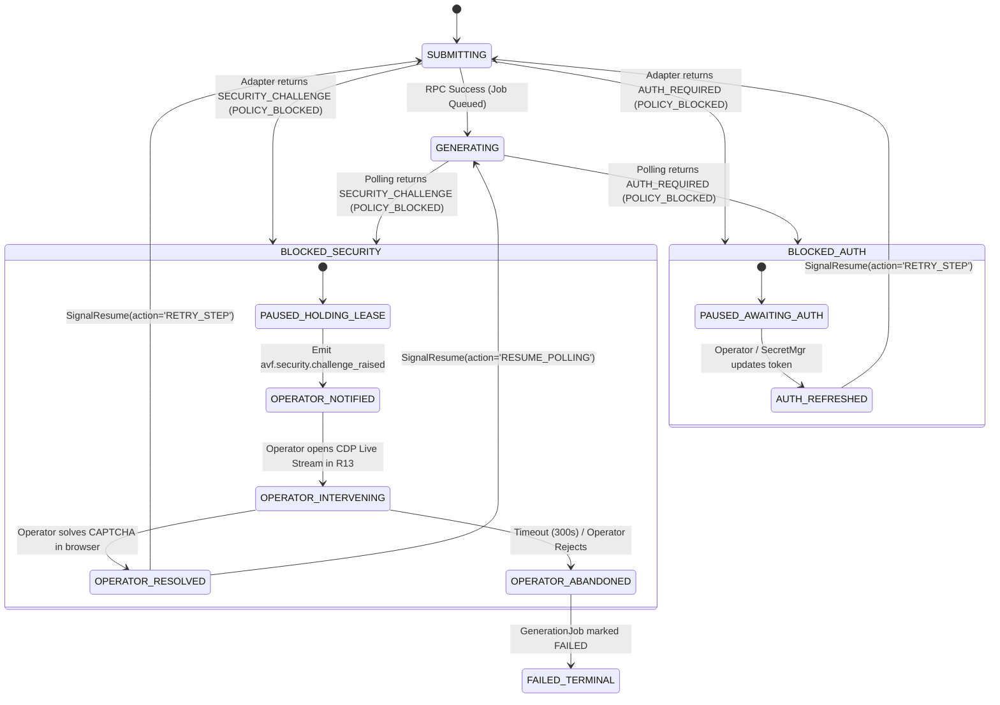

# C02R DOMAIN OWNER REVIEW & VERDICT: DECISION CLUSTER 04
**CLUSTER ID:** CLUSTER-04  
**TITLE:** Provider Result Contract, Generation Lifecycle & Normalized Error Taxonomy  
**DOMAIN OWNER:** R04 — Contracts, API & Versioning Specialist  
**AFFECTED CONTRACTS & REPOSITORIES:** `02_contracts/provider-result.schema.json`, `02_contracts/CONTRACTS_OVERVIEW.md`, `R01_CONTRACTS`, `R02_CORE_STATE`, `R06_WORKFLOW`, `R07_PROVIDER_SDK`, `R08_GOOGLE_FLOW_ADAPTER`, `R13_OPERATOR_CONSOLE`  
**SOURCE FINDINGS:** TECH-008, FINDING_005, FINDING_022  
**RELEVANT INVARIANTS:** INV-003, INV-007, INV-008, INV-009, INV-010, INV-011, INV-012, INV-014, INV-015, INV-018, INV-019, INV-020  
**EVALUATION DATE:** 2026-08-15  
**FINAL VERDICT:** CONFIRMED & ADOPTED WITH BINDING NORMATIVE DIRECTIVES  

---

## 1. Executive Domain Authority & Context

As the designated **Domain Owner for Contracts, APIs, and Versioning (R04)**, I hold primary architectural governance over **Contract Family 4 (Provider request/result/status)**, **Contract Family 6 (Error taxonomy)**, and boundary schema validation rules across the AI Video Factory (AVF) ecosystem.

This review constitutes the definitive, binding Domain Owner evaluation for **Decision Cluster 04 (Provider Result & Error Taxonomy)** within the C02R Genuine Adversarial Proceedings. It formally assesses the remediation proposed in `CP-004` / `SOL-05`, the defense presented in `CLUSTER_04_PROPONENT_R04.md`, and the adversarial reliability challenges lodged by **R02 (Reliability Specialist)** regarding status polling overload, state ambiguity, and taxonomy complexity.

### 1.1 Root Architectural Defect Under Review
In the legacy pre-remediation draft (`provider-result.schema.json` v0.9.0):
1. The schema exposed a single, flat `status` enumeration (`ACCEPTED`, `GENERATING`, `COMPLETED`, `FAILED`, `BLOCKED`, `CANCELLED`), conflating **immediate synchronous transport RPC execution** with **remote asynchronous generative diffusion rendering**.
2. The legacy error definition was an unconstrained object with a naive 4-class categorization (`TRANSIENT`, `PERMANENT`, `POLICY`, `RESOURCE`), lacking typed domain error codes and forcing downstream orchestrators to resort to brittle regex parsing of provider-specific error strings.
3. Interactive security roadblocks (e.g. Google reCAPTCHA Enterprise, Cloudflare Turnstile) and session authentication expirations were lumped into generic failure categories, causing automated retry storms that violated **INV-012** (*"Authentication/security challenges do not trigger automated bypass behavior"*), risked external account termination, and created duplicate generation billing (*"ghost generations"* violating **INV-003**).

---

## 2. Deep Evaluation of Multi-Tier Status Separation

### 2.1 Technical Analysis of Two-Timescale Concurrency
Distributed video generation across external generative engines (Google Flow, Runway Gen-3, Sora, Luma Dream Machine) operates on two fundamentally distinct physical and temporal planes:

```
┌──────────────────────────────────────────────────────────────────────────────────────────────────┐
│ MULTI-TIER EXECUTION PLANE SEPARATION                                                           │
├──────────────────────────────────────────────────────────────────────────────────────────────────┤
│                                                                                                  │
│  [ TIER 1: Synchronous RPC Transport Plane ]                                                     │
│  - Timescale: 50ms – 5,000ms                                                                     │
│  - Scope: HTTP roundtrips, WebSocket packets, CDP command/event dispatch (FlowExecutionPort)     │
│  - Operations: submit_generation, get_status, cancel, download_output                            │
│  - Contract Field: `status` (OperationStatus) -> [ SUCCESS | FAILED | PENDING | RUNNING ]        │
│                                                                                                  │
│                                           │                                                      │
│                                           ▼ Decoupled via Contract Envelope                      │
│                                                                                                  │
│  [ TIER 2: Asynchronous Remote Engine Generative Plane ]                                         │
│  - Timescale: 30s – 600s                                                                         │
│  - Scope: Remote GPU cluster queueing, latent diffusion denoising, temporal upscaling            │
│  - State: Remote provider job queue & rendering pipeline                                         │
│  - Contract Field: `generation_status` (ProviderGenerationStatus)                                │
│                   -> [ QUEUED | PROCESSING | SUCCEEDED | FAILED | CANCELLED ]                    │
│                                                                                                  │
└──────────────────────────────────────────────────────────────────────────────────────────────────┘
```

When a single status field is overloaded to represent both planes, catastrophic state machine desynchronization occurs.

### 2.2 Rebuttal & Resolution of R02 Reliability Challenges

#### R02 Challenge A: Polling Overload & Ambiguity Resolution
*R02 Attack Vector:* How does a polling loop distinguish between:
- Case 1: The status check RPC succeeded, and the remote job is still rendering.
- Case 2: The status check RPC failed (e.g. 504 Gateway Timeout or CDP disconnect), but the remote job is still rendering.
- Case 3: The status check RPC succeeded, but the remote job failed inside the engine.

*Domain Owner Mathematical Proof & State Resolution:*
By decoupling `status` (`OperationStatus`) from `generation_status` (`ProviderGenerationStatus`), the state space is a well-defined Cartesian product resolved by `R06_WORKFLOW` through the following deterministic transition matrix:

| Immediate `status` | Remote `generation_status` | `error` Presence | Workflow Orchestrator Interpretation & Action | Invariant Protected |
| :--- | :--- | :--- | :--- | :--- |
| **`SUCCESS`** | `QUEUED` | `null` | RPC succeeded; job is in provider queue. Schedule next poll with queue backoff. | INV-015 (Correlation) |
| **`SUCCESS`** | `PROCESSING` | `null` | RPC succeeded; model is rendering. Update `progress_percent`, schedule poll interval. | INV-015 (Correlation) |
| **`SUCCESS`** | `SUCCEEDED` | `null` | Rendering completed successfully. Validate `output_uri` + `checksum_sha256`. Transition `Take` to `QC_PENDING`. | INV-006, INV-016 |
| **`SUCCESS`** | `FAILED` | **Mandatory** | RPC succeeded; remote engine aborted generation (e.g., safety filter). Read `error.retry_category` to determine retry/escalation. | INV-009, INV-010 |
| **`SUCCESS`** | `CANCELLED` | Optional | Job was confirmed cancelled on provider. Transition `GenerationJob` to `CANCELLED`. | INV-001 |
| **`FAILED`** | `PROCESSING` *(or prior)* | **Mandatory** | **Transport failure during polling hop.** The remote GPU job is UNHARMED. Retry the polling activity with exponential backoff. **NEVER abort or resubmit `GenerationJob`.** | **INV-003 (No Ghost Duplicates)** |
| **`FAILED`** | `null` | **Mandatory** | Initial `submit_generation` transport failed before obtaining `provider_job_id`. Enter reconciliation protocol before resubmitting. | **INV-003, INV-019** |

*Crucial Reliability Consequence:* In Case 2, where a polling socket times out (`status: FAILED`, `error.code: NETWORK_TIMEOUT`), the orchestrator preserves `generation_status: PROCESSING`. It does **not** transition the canonical `GenerationJob` in `R02_CORE_STATE` to `FAILED`, preventing catastrophic double-billing and orphaned renders.

### 2.3 Formal JSON Schema Contract (`provider-result.schema.json`)
To make this separation normative and mechanically enforceable, the schema is structured under JSON Schema Draft 2020-12 with strict conditional validation:

```json
{
  "$schema": "https://json-schema.org/draft/2020-12/schema",
  "$id": "https://avf.local/contracts/provider-result/1.0",
  "title": "ProviderResult",
  "type": "object",
  "required": [
    "schema_version",
    "request_id",
    "job_id",
    "provider_id",
    "status",
    "timestamp_utc"
  ],
  "properties": {
    "schema_version": {
      "type": "string",
      "const": "1.0"
    },
    "request_id": {
      "type": "string",
      "format": "uuid",
      "description": "Unique correlation UUID for this specific RPC command invocation."
    },
    "job_id": {
      "type": "string",
      "format": "uuid",
      "description": "Canonical GenerationJob identifier in R02_CORE_STATE."
    },
    "provider_id": {
      "type": "string",
      "minLength": 1,
      "description": "Registered provider identifier (e.g., 'google-flow', 'fake-provider')."
    },
    "provider_job_id": {
      "type": ["string", "null"],
      "description": "Provider-assigned job/task tracking ID (e.g. 'flow-987654')."
    },
    "status": {
      "type": "string",
      "enum": ["SUCCESS", "FAILED", "PENDING", "RUNNING"],
      "description": "Synchronous transport/RPC outcome of the immediate provider gateway invocation."
    },
    "generation_status": {
      "type": ["string", "null"],
      "enum": ["QUEUED", "PROCESSING", "SUCCEEDED", "FAILED", "CANCELLED", null],
      "description": "Asynchronous video generation lifecycle status inside remote engine."
    },
    "progress_percent": {
      "type": ["number", "null"],
      "minimum": 0.0,
      "maximum": 100.0,
      "description": "Estimated or reported generation progress from 0.0 to 100.0."
    },
    "output_uri": {
      "type": ["string", "null"],
      "format": "uri",
      "description": "Canonical S3/GCS or local URI of the rendered video artifact."
    },
    "output_metadata": {
      "type": ["object", "null"],
      "properties": {
        "mime_type": { "type": "string" },
        "byte_size": { "type": "integer", "minimum": 1 },
        "checksum_sha256": { 
          "type": "string", 
          "pattern": "^[a-f0-9]{64}$" 
        },
        "duration_ms": { "type": "integer", "minimum": 1 },
        "width": { "type": "integer", "minimum": 1 },
        "height": { "type": "integer", "minimum": 1 }
      },
      "required": ["mime_type", "byte_size", "checksum_sha256"]
    },
    "cost_credits_used": {
      "type": ["number", "null"],
      "minimum": 0.0
    },
    "error": {
      "type": ["object", "null"],
      "properties": {
        "code": {
          "type": "string",
          "enum": [
            "PROVIDER_RATE_LIMIT",
            "AUTH_REQUIRED",
            "SECURITY_CHALLENGE",
            "UI_CHANGED",
            "BUDGET_EXHAUSTED",
            "UNSUPPORTED_CAPABILITY",
            "NETWORK_TIMEOUT",
            "BAD_REQUEST",
            "PROVIDER_INTERNAL_ERROR"
          ]
        },
        "message": { "type": "string", "minLength": 1 },
        "retry_category": {
          "type": "string",
          "enum": ["TRANSIENT", "PERMANENT", "POLICY_BLOCKED", "RESOURCE_EXHAUSTED"]
        },
        "suggested_backoff_ms": {
          "type": "integer",
          "minimum": 0
        },
        "raw_provider_error": {
          "type": "object",
          "additionalProperties": true
        }
      },
      "required": ["code", "message", "retry_category"]
    },
    "timestamp_utc": {
      "type": "string",
      "format": "date-time"
    }
  },
  "allOf": [
    {
      "if": {
        "properties": { "generation_status": { "const": "SUCCEEDED" } }
      },
      "then": {
        "required": ["output_uri", "output_metadata"]
      }
    },
    {
      "if": {
        "anyOf": [
          { "properties": { "status": { "const": "FAILED" } } },
          { "properties": { "generation_status": { "const": "FAILED" } } }
        ]
      },
      "then": {
        "required": ["error"]
      }
    }
  ],
  "additionalProperties": false
}
```

---

## 3. Deep Evaluation of the 9-Code Normalized Error Taxonomy & 4-Class Retry Categories

### 3.1 Architectural Decoupling: Root Cause (`code`) vs Dispatch Strategy (`retry_category`)
A core contract design principle is the strict separation of **what failed** (Root Cause Diagnostic Taxonomy) from **how the system must respond** (Strategic Dispatch Classification).

- The `code` (`NormalizedErrorCode`) provides an exact, provider-agnostic domain taxonomy enabling observability, telemetry aggregation, and developer debugging without exposing raw DOM selectors or HTTP headers.
- The `retry_category` (`RetryCategory`) provides a 4-state operational decision output consumed directly by the orchestration state machine in `R06_WORKFLOW`.

```
                  ┌────────────────────────────────────────────────────────┐
                  │                 NormalizedProviderError                │
                  ├────────────────────────────────────────────────────────┤
                  │  code: NormalizedErrorCode (9 domain codes)            │
                  │  message: string (diagnostic explanation)              │
                  │  retry_category: RetryCategory (4 dispatch categories) │
                  │  suggested_backoff_ms: integer                         │
                  │  raw_provider_error: object (namespaced debug details) │
                  └────────────────────────────────────────────────────────┘
                                              │
                     ┌────────────────────────┴────────────────────────┐
                     ▼                                                 ▼
        [ Diagnostic / Observability ]                     [ Operational Dispatch ]
        - Telemetry dashboards                             - R06 Workflow retry engine
        - Alert routing                                    - R02 State machine transitions
        - Adapter health monitoring                        - R13 Operator Console alerts
```

### 3.2 Exhaustive Code-to-Category Mapping Matrix

```
┌─────────────────────────┬────────────────────┬───────────────────────────────┬────────────────────────────────────────────────────────┐
│ Normalized Error Code   │ Retry Category     │ Primary Trigger Origin        │ Automated Dispatch & Workflow Action                   │
├─────────────────────────┼────────────────────┼───────────────────────────────┼────────────────────────────────────────────────────────┤
│ NETWORK_TIMEOUT         │ TRANSIENT          │ Transport / Socket / CDP drop │ Exponential backoff + full jitter. Retry RPC poll.     │
│ PROVIDER_INTERNAL_ERROR │ TRANSIENT          │ HTTP 500/502/503, GPU panic   │ Exponential backoff + jitter. Re-execute attempt.      │
│ PROVIDER_RATE_LIMIT     │ TRANSIENT          │ HTTP 429, DOM rate banner     │ Delay by `suggested_backoff_ms` (or exponential calc). │
│ UI_CHANGED              │ PERMANENT          │ DOM selector failure (Track A)│ Terminal attempt fail. High-priority adapter alert.    │
│ UNSUPPORTED_CAPABILITY  │ PERMANENT          │ Resolution/aspect mismatch    │ Terminal attempt fail. Escalate to Prompt Compiler.    │
│ BAD_REQUEST             │ PERMANENT          │ HTTP 400, syntax rejection    │ Terminal attempt fail. Prompt parameter error.         │
│ AUTH_REQUIRED           │ POLICY_BLOCKED     │ HTTP 401/403, Login redirect  │ Pause workflow. Emit `session_invalidated` event.      │
│ SECURITY_CHALLENGE      │ POLICY_BLOCKED     │ CAPTCHA, Turnstile, 2FA prompt│ Pause workflow. Hold lease. Notify Operator Console.   │
│ BUDGET_EXHAUSTED        │ RESOURCE_EXHAUSTED │ HTTP 402, "0 credits left"    │ Pause workflow. Evaluate account failover or halt.     │
└─────────────────────────┴────────────────────┴───────────────────────────────┴────────────────────────────────────────────────────────┘
```

### 3.3 Provider Abstraction Boundary Preservation (INV-007 & INV-008)
Under system invariants **INV-007** (*"Google Flow-specific fields do not appear in core Shot/Project contracts"*) and **INV-008** (*"Provider adapters cannot directly modify Project/Shot records"*):
1. Downstream components (`R02_CORE_STATE`, `R06_WORKFLOW`, `R11_QC`, `R13_OPERATOR_CONSOLE`) must **never** inspect or branch on provider-specific strings (e.g. `raw_provider_error.dom_selector` or Google HTTP status codes).
2. All branch points in `R06_WORKFLOW` are constrained to evaluate `error.code` and `error.retry_category`.
3. If diagnostic debugging requires capturing DOM snapshots or raw HTTP response bodies, those payloads are strictly quarantined inside `raw_provider_error` and ignored by core business logic.

### 3.4 Technical vs Creative Retry Invariant Verification (INV-010 & INV-011)
- **INV-010 (Technical Retries):** When `retry_category === 'TRANSIENT'` (e.g. `NETWORK_TIMEOUT`, `PROVIDER_INTERNAL_ERROR`, `PROVIDER_RATE_LIMIT`), the workflow retries the technical submission using the identical, immutable `PromptVersion` ID. The `GenerationJob` increments its `attempt_index` without generating new creative prompt entities.
- **INV-011 (Creative Retries):** When an error is classified as `PERMANENT` (e.g. `BAD_REQUEST`, `UNSUPPORTED_CAPABILITY`) or fails automated QC (`FAILED_QC`), any subsequent recovery requires prompt compilation modification by `R05_PROMPT_COMPILER` or `R03_CREATIVE`, which creates a new `PromptVersion` entity in `R02_CORE_STATE`.

### 3.5 Addressing R02's Challenge on Developer Experience in `R07_PROVIDER_SDK`
To eliminate developer error when writing provider adapters:
- `R07_PROVIDER_SDK` will export strongly-typed constructor factories and error mappers:
  - `ProviderResult.success(...)`
  - `ProviderResult.transientFailure(code, message, backoffMs, rawError)`
  - `ProviderResult.permanentFailure(code, message, rawError)`
  - `ProviderResult.policyBlocked(code, message, rawError)`
  - `ProviderResult.resourceExhausted(code, message, rawError)`
- Adapters implementing `VideoGenerationProvider` never construct raw JSON objects; they return typed instances that guarantee schema compliance at compile-time and runtime.

---

## 4. Deep Verification of `SECURITY_CHALLENGE` and `AUTH_REQUIRED` Pause States

### 4.1 Anti-Bypass Invariant Verification (INV-012)
System Invariant **INV-012** states normatively:
> *"Authentication/security challenges do not trigger automated bypass behavior."*

Automated scripts attempting to defeat CAPTCHA Enterprise or Turnstile via automated clicks, headless browser hacks, or third-party solving services violate provider terms of service, lead to immediate permanent Google account blacklisting, and destroy production reliability.

The taxonomy guarantees compliance by strictly mapping `SECURITY_CHALLENGE` to `POLICY_BLOCKED`. Under `POLICY_BLOCKED`:
1. Automated retry loops are immediately halted.
2. The browser automation engine (`R09_BROWSER_WORKER`) is forbidden from issuing synthetic click or key events to challenge elements.
3. The execution context is safely preserved for human operator takeover.

### 4.2 State Machine Transitions & Distributed Pause/Resume Mechanics



### 4.3 Detailed Operational Protocols for Pause States

#### Protocol A: `SECURITY_CHALLENGE` (Interactive CAPTCHA / Bot Defense)
1. **Detection:** `R08_GOOGLE_FLOW_ADAPTER` detects challenge iframe/element (e.g. `iframe[src*='recaptcha/enterprise']` or Cloudflare challenge shadow DOM).
2. **Adapter Response:** Emits `ProviderResult` with `status: "FAILED"`, `generation_status: "FAILED"`, and `error.code: "SECURITY_CHALLENGE"`, `error.retry_category: "POLICY_BLOCKED"`.
3. **Workflow Action (`R06_WORKFLOW`):**
   - Transitions `GenerationJob` in `R02_CORE_STATE` to `BLOCKED_SECURITY`.
   - Freezes the workflow timer and holds the active browser worker lease (`LEASE_HELD_FOR_HUMAN`).
   - Publishes outbox event: `avf.security.challenge_raised` containing `{ job_id, provider_id, worker_id, cdp_stream_url, session_id }`.
4. **Operator Console (`R13_OPERATOR_CONSOLE`):**
   - Displays high-priority alert on the Operator Dashboard.
   - Embeds interactive CDP remote browser viewport for the designated worker.
   - Human operator manually completes the visual puzzle / 2FA verification.
5. **Resume Signal:**
   - Operator clicks *"Challenge Solved"* in R13.
   - R13 issues `SignalResume(workflow_id, reason="SECURITY_CHALLENGE_SOLVED")`.
   - Workflow verifies session health and resumes generation without dropping worker state.
6. **Abandonment Guard:**
   - A configurable human wait timer (default: `MAX_OPERATOR_WAIT_MS = 300,000` / 5 minutes) prevents orphaned worker leases.
   - If the operator fails to respond within 5 minutes, the worker is safely released, browser state is cleaned, and `GenerationJob` transitions to `FAILED_TERMINAL`.

#### Protocol B: `AUTH_REQUIRED` (Session / Cookie Expiration)
1. **Detection:** Google Flow redirects to `accounts.google.com/signin` or REST API returns HTTP 401/403.
2. **Adapter Response:** Emits `ProviderResult` with `error.code: "AUTH_REQUIRED"`, `error.retry_category: "POLICY_BLOCKED"`.
3. **Workflow Action (`R06_WORKFLOW`):**
   - Transitions `GenerationJob` in `R02_CORE_STATE` to `BLOCKED_AUTH`.
   - Emits outbox event: `avf.auth.session_invalidated` containing `{ provider_id, account_alias, reason }`.
4. **Credential Remediation:**
   - Secret Manager or Operator injects refreshed session cookies / OAuth tokens.
5. **Resume Signal:**
   - Credential manager sends `SignalResume(workflow_id, reason="AUTH_CREDENTIALS_UPDATED")`.
   - Adapter re-authenticates and retries prompt submission under the same job attempt.

---

## 5. Domain Owner Directives & Binding Specification Requirements

As Domain Owner, I hereby issue the following **Binding Normative Directives** to govern the implementation of `avf-contracts` and downstream repositories:

### Directive DIR-04-01: Normative Schema Update
- The file `02_contracts/provider-result.schema.json` in `AI_VIDEO_FACTORY_BLUEPRINT_KIT_v0.9.0` MUST be replaced immediately with the schema defined in Section 2.3 of this document.
- The `schema_version` is locked at `"1.0"`.

### Directive DIR-04-02: Contract Overview Error Taxonomy Update
- Section 6 of `02_contracts/CONTRACTS_OVERVIEW.md` MUST be updated to explicitly list the 9 `NormalizedErrorCode` values and the 4 `RetryCategory` values, defining the exact mapping matrix documented in Section 3.2.

### Directive DIR-04-03: Provider SDK Factory Interface (`R07_PROVIDER_SDK`)
- `R07_PROVIDER_SDK` MUST provide strongly-typed builder classes enforcing that an `error` object is non-null whenever `status === 'FAILED'` or `generation_status === 'FAILED'`.
- `R07_PROVIDER_SDK` MUST export a standard `FakeVideoProvider` capable of deterministically injecting all 9 error codes and simulating multi-tier status polling in test environments.

### Directive DIR-04-04: Google Flow Adapter Error Mapping (`R08_GOOGLE_FLOW_ADAPTER`)
- `R08_GOOGLE_FLOW_ADAPTER` MUST implement explicit DOM inspection handlers mapping Track A and Track B execution outcomes into the 9 `NormalizedErrorCode` values.
- Raw DOM selectors and HTML snippets MUST ONLY be stored within `error.raw_provider_error` and MUST NEVER appear in the top-level `error.message`.

### Directive DIR-04-05: Workflow Retry Engine Specification (`R06_WORKFLOW`)
- `R06_WORKFLOW` retry activities MUST branch exclusively on `error.retry_category` and `error.code`.
- On `retry_category === 'TRANSIENT'`, the workflow MUST apply exponential backoff with full jitter, honoring `suggested_backoff_ms` when provided.
- On `retry_category === 'POLICY_BLOCKED'`, the workflow MUST transition to `BLOCKED_SECURITY` or `BLOCKED_AUTH` and await an explicit `SignalResume` or operator timeout.

### Directive DIR-04-06: Conformance Test Suite (`R15_INTEGRATION_HARNESS`)
- The integration test suite MUST include explicit contract verification fixtures asserting:
  1. Success result with valid SHA-256 checksum and metadata.
  2. Transient polling network failure preserving remote `PROCESSING` state.
  3. Security challenge pausing workflow and emitting operator alert.
  4. Authentication expiration halting automated retry storms.
  5. UI change immediately failing permanently without retrying broken selectors.

---

## 6. Formal Domain Owner Verdict

```text
================================================================================
C02R DOMAIN OWNER FINAL VERDICT: DECISION CLUSTER 04
================================================================================
DOMAIN OWNER:          R04 — Contracts, API & Versioning Specialist
DECISION CLUSTER:      CLUSTER-04 (Provider Result & Error Taxonomy)
AFFECTED CHANGE PROP:  CP-004 / SOL-05
PROPOSAL DISPOSITION:  CONFIRMED & ADOPTED IN FULL WITH BINDING DIRECTIVES

FINDING EVALUATION:
- TECH-008:            RESOLVED via Multi-Tier Status Separation & Schema Update
- FINDING_005:         RESOLVED via 9-Code Taxonomy & 4-Class Retry Categories
- FINDING_022:         RESOLVED via POLICY_BLOCKED State & Anti-Bypass Protocols

INVARIANT COMPLIANCE:
- INV-003 (Idempotency / No Duplicate Renders):    COMPLIANT (Preserves remote job on poll drop)
- INV-007 (Provider Field Insulation):             COMPLIANT (Quarantines raw provider errors)
- INV-008 (Normalized Provider Abstraction):       COMPLIANT (Eliminates regex parsing)
- INV-009 (Policy Decides Retries):                COMPLIANT (Workflow orchestrator owns retries)
- INV-010 (Technical Retries No Prompt Mutation):  COMPLIANT (Re-uses PromptVersion on TRANSIENT)
- INV-011 (Creative Retries Mutate Prompt):        COMPLIANT (PERMANENT routes to Prompt Compiler)
- INV-012 (No Automated Security Bypass):          COMPLIANT (Strict POLICY_BLOCKED pause state)
- INV-014 (Schema Validation at Boundaries):       COMPLIANT (Draft 2020-12 conditional validation)
- INV-015 (Correlation ID Propagation):            COMPLIANT (request_id, job_id, provider_job_id)
- INV-018 (Deterministic Budget Enforcement):      COMPLIANT (Halts on BUDGET_EXHAUSTED)
- INV-020 (Track A/B Contract Equivalence):        COMPLIANT (Identical ProviderResult interface)

SIGN-OFF AUTHORITY:    R04_CONTRACTS_SPECIALIST_DOMAIN_OWNER
DATE:                  2026-08-15T21:30:00Z
STATUS:                CLOSED_CONFIRMED_FINAL
================================================================================
```
