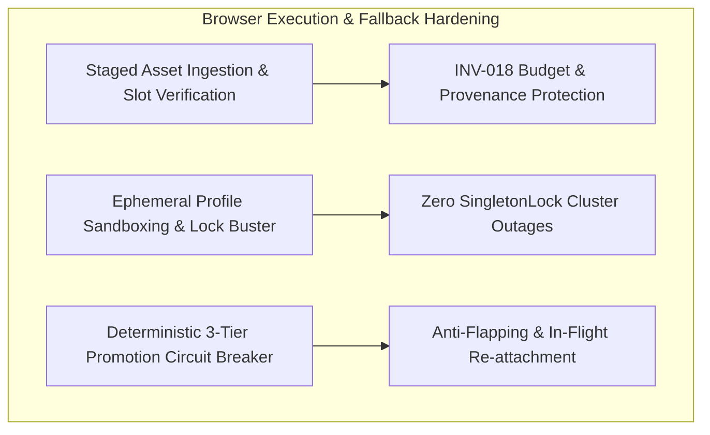

# C02R GENUINE ADVERSARIAL CROSS-EXAMINATION
## Decision Cluster 07: Browser Execution, MV3 Lifecycle & Fallback Hierarchy
**ROLE:** R02 (Reliability Specialist / Distributed Systems Architect) — CHALLENGER  
**DATE:** 2026-08-15  
**STATUS:** ACTIVE_ATTACK  
**TARGET FILES:**  
- `03_repo_blueprints/R09_BROWSER_WORKER.md`
- `03_repo_blueprints/R09A_R10_GOOGLE_FLOW_EXECUTION_OPTIONS.md`
- `03_repo_blueprints/R08_GOOGLE_FLOW_ADAPTER.md`
- `03_repo_blueprints/R10_FLOWKIT_BRIDGE.md`
- `06_adrs/ADR-004_DUAL_FLOW_EXECUTION.md`
- `02_contracts/browser-command.schema.json`
- `02_contracts/flow-execution-result.schema.json`
- `review-session/SPIKES/SPK-001_MV3_LIFECYCLE_KEEPALIVE.md`
- `review-session/FREEZE_REMEDIATION_V1/C03R/SOL_07_BROWSER_MV3_FALLBACK_RISK.md`

---

### 1. Executive Challenge & Core Position

The proponent's brief for Cluster 07 (and solution package SOL-07) argues that empirical unreliability in Chrome Manifest V3 (MV3) service worker keepalive mechanisms is a **"NON-BLOCKING FOR FREEZE"** issue. The justification rests entirely on a promised three-tier execution hierarchy:
1. **Tier A1/A2 (Primary):** Chrome MV3 Extension with Offscreen Document keepalive and Native Messaging / loopback WebSocket.
2. **Tier A3 (Local Fallback):** Playwright controlling a dedicated persistent Chrome user profile via CDP.
3. **Tier B (Headless Fallback):** Headless FlowKit bridge bypassing browser UI automation.

As Reliability Specialist (R02), I formally challenge this defense as **operationally naive and architecturally unsound**. Pointing to downstream fallback options does not excuse a broken primary execution engine, nor does having fallback options automatically guarantee high availability if the transitions between them are ill-defined, state-destructive, and uncoordinated.

Specifically, the current specification exhibits three fatal reliability vulnerabilities:
1. **Unchecked Mid-Upload Service Worker Termination (`ATTACH_ASSETS` Ingestion Rupture):** The contract assumes asset attachment is an instantaneous atomic command. When an MV3 service worker terminates during multi-part file transfers of high-resolution character turnaround sheets and reference frames, it leaves Google Flow's DOM in a corrupted, half-attached state. Subsequent `SUBMIT_PROMPT` commands execute against partial references, silently generating hallucinated junk video, draining user generation budgets (violating **INV-018**), and corrupting Shot-Take lineage without triggering an error.
2. **Persistent Profile Lock Contention and Cluster Concurrency Hazards:** The reliance on "dedicated persistent Chrome user profiles" across distributed worker clusters ignores Chromium's filesystem locking mechanics (`SingletonLock`), rolling session cookie invalidation across geographically dispersed worker nodes, catastrophic disk bloat from unpruned browser caches (15GB–40GB per node), and the high risk of automated security challenge escalation (`SECURITY_CHALLENGE`) when Google detects concurrent session cloning.
3. **Undefined Fallback Promotion Thresholds & Thundering Herd Cascades:** The specification provides zero concrete numerical thresholds, time windows, or circuit-breaker policies for promoting a failed MV3 session to A3 Playwright or Track B. A minor transient pause will trigger instant, unthrottled Playwright browser spawns, inducing CPU and RAM exhaustion cascades across worker pools, stealing active session locks from running generations, and creating split-brain browser executions (violating **INV-005** and **INV-019**).

---

### 2. Attack Vector 1: Mid-Upload Service Worker Termination During Multi-Part Asset Ingestion (`ATTACH_ASSETS`)

#### 2.1 The Multi-Megabyte Asset Transfer Reality
Video generation in modern workflows (specifically Google Flow / Veo / Imagen 3) is rarely pure text-to-video; it depends on image-to-video, character continuity consistency, style transfer seeds, and start/end frame interpolation. In `browser-command.schema.json` (lines 127–177), `ATTACH_ASSETS` defines an array of asset references:
```json
"assets": [
  { "asset_id": "uuid", "storage_uri": "s3://...", "mime_type": "image/png", "role": "CHARACTER" },
  { "asset_id": "uuid", "storage_uri": "s3://...", "mime_type": "image/png", "role": "STYLE" },
  { "asset_id": "uuid", "storage_uri": "s3://...", "mime_type": "video/mp4", "role": "START_FRAME" }
]
```
These payloads range from 15MB to over 250MB (especially when attaching 4K source PNGs or short reference video clips). In Track A (Chrome Extension MV3), attaching these assets requires:
1. The Native Host / Browser Worker streaming the binary file from local storage to the extension or writing it to the local filesystem.
2. The MV3 background worker or content script setting file inputs via simulated drag-and-drop (`DataTransfer` API) or CDP `DOM.setFileInputFiles`.
3. Google Flow's frontend performing client-side chunking, canvas hashing, and uploading multipart payloads to Google's media ingest endpoints (`/upload/storage/v1/...`).

#### 2.2 The Service Worker Lifecycle Cliff During Ingestion
Chromium's MV3 lifecycle manager strictly terminates background service workers when:
- No message port event occurs within **30 seconds**;
- A single synchronous or asynchronous task occupies the worker event loop for longer than **5 minutes**;
- System memory pressure triggers Chromium's renderer watchdog.

```text
[Core / Adapter]        [Browser Worker Host]         [MV3 Service Worker]       [Flow DOM & Upload XHR]      [Google Backend]
       |                          |                            |                           |                          |
       |--- ATTACH_ASSETS ------->|                            |                           |                          |
       |    (3 Assets, 80MB)      |--- Stream Chunk 1 (20MB) ->|                           |                          |
       |                          |                            |--- DataTransfer.files --->|                          |
       |                          |                            |                           |--- POST Chunk 1 (20MB) ->| (200 OK)
       |                          |                            |                           |                          |
       |                          |                            |=== [CHROME MV3 SUSPEND] ==|                          |
       |                          |                            |    (Worker Killed by OS)  |                          |
       |                          |                            X                           |                          |
       |                          |--- Stream Chunk 2 (30MB) ->|                           |                          |
       |                          |    (Pipe Broken / EOF)     |                           | [HANGING / STALLED]      |
       |                          |                            |                           | (Asset slot 2 loading..) |
       |<-- TIMEOUT / CRASH ------|                            |                           |                          |
```

#### 2.3 Concrete Failure Sequence: Silent Hallucination & Budget Drain
1. **The Rupture:** During the transfer of Asset 2 (e.g. `CHARACTER` reference sheet), the MV3 service worker is terminated by Chrome's lifecycle manager due to network throttling on the upload pipe. The native messaging port abruptly closes with `EOF`.
2. **Ghost DOM State in Flow:** Google Flow's DOM is now in an undefined, dirty intermediate state:
   - Asset 1 (`CHARACTER` image) is fully uploaded and checked in the UI slot.
   - Asset 2 (`STYLE` image) is frozen in a 45% "Uploading..." circular progress spinner.
   - Asset 3 (`START_FRAME` video) was never injected.
3. **The Unchecked Resubmit Trap:**
   - The worker host detects the pipe disconnect and issues a reconnect or restart.
   - Because `browser-command.schema.json` contains **no upload idempotency key**, **no chunk-level tracking**, and **no DOM slot validation pre-conditions**, the workflow orchestrator either retries `ATTACH_ASSETS` or proceeds to `SUBMIT_PROMPT`.
   - If `ATTACH_ASSETS` is naively retried, Google Flow's asset drawer now contains duplicate conflicting uploads (Asset 1 attached twice, Asset 2 stuck in error state), breaking UI layout selectors.
   - If the retry bypasses `ATTACH_ASSETS` and attempts `SUBMIT_PROMPT`, Google Flow's "Generate" button becomes enabled because at least one image is present. The prompt executes **without the required style and continuity constraints**.
4. **The System Breakdown:**
   - Google Flow generates a video without the character model and style references.
   - The video passes technical QC (`FFprobe` frame check) because it is a valid `.mp4`, but completely fails creative intent.
   - **Cost:** Non-refundable Google Flow generation credits are burned ($0.20–$1.50 per generation), directly violating **INV-018** ("Budget limits are enforced by deterministic policy before external generation requests").
   - **Provenance:** The generated Take is permanently bound to `ShotVersion` metadata in `domain-entities.schema.json` that claims 3 assets were used, creating a silent domain lie that corrupts downstream timeline assembly.

---

### 3. Attack Vector 2: Operational Complexity & Concurrency Hazards of Dedicated Persistent Chrome Profiles

#### 3.1 The Myth of the "Disposable" Persistent User Profile
The R09 blueprint states:
> *"Persistent Chrome profile is secret local infrastructure, not business state."*  
> *(R09_BROWSER_WORKER.md line 57)*

And SOL-07 proposes A3 Playwright using:
> *"a dedicated persistent Chrome profile with saved Google session cookies."*  
> *(SOL_07 line 19)*

This architectural premise is completely broken when scaled to a production distributed worker cluster (e.g., Kubernetes pods or multi-node worker pools).

#### 3.2 Failure Mode A: POSIX Filesystem Lock Collision (`SingletonLock` Deadlock)
Chromium enforces strict single-process access to its `user-data-dir` via POSIX symlinks (`SingletonLock` pointing to `hostname-pid`) and SQLite lock files (`Cookies-journal`, `Web Data-journal`):
- When a worker container crashes abnormally (`SIGKILL`, node preemption, OOM killer during video rendering), the `SingletonLock` file is **not cleaned up**.
- Upon container restart or when an A3 Playwright fallback worker attempts to mount the profile volume, Chromium encounters the stale `SingletonLock`.
- Chromium fails to launch with exit code 1 or displays a blocking crash recovery modal:  
  `"Google Chrome closed unexpectedly. Restore pages? [Restore] [Cancel]"`
- Because the browser is running headless or without human interaction in a worker pod, this modal dialog **blocks the main thread forever**. All subsequent commands timeout at the 600-second outer limit, completely bricking that worker node until manual operator intervention occurs.

```text
[Worker Pod A]                              [Shared Profile Storage]                [Worker Pod B (Fallback)]
      |                                                |                                        |
      |-- Mounts profile & creates SingletonLock ----->|                                        |
      |   (Runs MV3 Generation)                        |                                        |
      |                                                |                                        |
      |=== [OOM KILL / POD CRASH] =====================|                                        |
      X   (SingletonLock remains on disk!)             |                                        |
                                                       |                                        |
                                                       |<-- Mounts profile via Playwright ------|
                                                       |    (Reads stale SingletonLock)         |
                                                       |                                        |
                                                       |-- CRASH: "Profile in use by PID 412" ->|
                                                       |   OR HANGS ON "RESTORE PAGES?" MODAL   |
```

#### 3.3 Failure Mode B: Distributed Session Invalidation & Google Risk Engine Ban
Google Flow authentication relies on rolling session cookies (`__Secure-1PSID`, `__Secure-3PSID`, `SAPISID`, `APISID`, `HSID`, `SSID`) and WebAuthn / device trust tokens bound to client TLS fingerprints and IP subnets:
1. **Multi-Node Session Cloning:** If a cluster administrator distributes a pre-authenticated Chrome profile directory across 10 distributed worker nodes to achieve parallel generation throughput, Google's risk engine observes:
   - 10 distinct TCP client connections from different IP addresses (or different container MAC addresses) presenting the **exact same session ticket and cookie secret**.
   - Immediate detection of concurrent session reuse and token hijacking signatures.
2. **Cascading `SECURITY_CHALLENGE` / Account Lockout:**
   - Google immediately revokes the session across all 10 instances.
   - Every single running job across the entire cluster simultaneously receives an unbypassable Google ReCAPTCHA Enterprise or 2-Factor Authentication prompt.
   - All 10 workers fail simultaneously with `SECURITY_CHALLENGE`, halting the entire studio production pipeline.

#### 3.4 Failure Mode C: Unbounded Disk Bloat (`ENOSPC` Storage Outage)
Google Flow is a heavy single-page application utilizing WebAssembly, WebGL, Service Workers, and streaming media caches:
- Every generation job loads multi-megabyte canvas buffers, WebM preview streams, and IndexedDB model state.
- In Chromium, the `Default/Service Worker/CacheStorage`, `Default/GPUCache`, and `Default/Code Cache` directories grow monotonically by **500MB–1.5GB per hour of active operation**.
- Within 48 hours of continuous batch generation, a single persistent profile expands to **25GB–50GB**.
- Neither `R09_BROWSER_WORKER.md` nor `04_integration/` specifies an atomic cache pruning policy. When the container's root or mounted volume reaches 100% disk usage (`ENOSPC`), SQLite transactions in Chromium fail, tearing down the browser and corrupting the profile database beyond recovery.

---

### 4. Attack Vector 3: Undefined Fallback Trigger Thresholds & Thundering Herd Cascades

#### 4.1 The Missing Fallback Contract
In SOL-07, the proponent claims:
> *"If MV3 extension experiences worker lifecycle disruption, R09 automatically falls back to Playwright controlling a dedicated persistent Chrome profile via CDP. If browser automation is unavailable, R08 routes traffic to R10 FlowKit bridge."*

Nowhere in the specification, contracts, or ADRs is there a definition of:
- **How many failed connection attempts** constitute a "lifecycle disruption"? (1? 3? 5?)
- **What is the failure time window** ($T_{window}$)?
- **What error taxonomy triggers fallback** vs retry?
- **How is circuit breaking implemented** to prevent thundering herds?

#### 4.2 The Cascading Thundering Herd Collapse
Consider what happens when the threshold is left undefined or set to a naive default (e.g. 1 failed WebSocket ping / Native Messaging timeout):
1. **The Transient Blip:** Chrome performs an internal V8 garbage collection cycle or a background tab throttle, delaying an MV3 WebSocket pong by 3,500ms (exceeding a naive 3-second heartbeat deadline).
2. **The Uncoordinated Promotion:** The worker declares Tier A1 dead and immediately triggers Tier A3 (Playwright).
3. **Resource Exhaustion:** Playwright launches a full, unthrottled Chromium browser binary:
   - Spikes host CPU to 100% across all cores during process initialization and GPU shader compilation.
   - Allocates 800MB–1.2GB of additional RAM.
4. **The Cascade:** This massive CPU/RAM spike on the host starves neighboring MV3 worker processes running on the same node.
   - Neighboring MV3 workers miss *their* heartbeats.
   - They *also* trigger A3 Playwright fallbacks.
   - The host enters an unrecoverable OOM death spiral, crashing all containerized workers.

```text
[Host Node: 4 Active MV3 Workers]
Worker 1: Transient 3.5s GC pause ---> Misses Heartbeat ---> Spawns Heavy Playwright Browser (+1.2GB RAM, 100% CPU)
                                                                 |
                                                                 v
Worker 2: Starved of CPU cycles ------> Misses Heartbeat ---> Spawns Heavy Playwright Browser (+1.2GB RAM, 100% CPU)
                                                                 |
                                                                 v
Worker 3: Starved of RAM -------------> Misses Heartbeat ---> Spawns Heavy Playwright Browser (+1.2GB RAM, 100% CPU)
                                                                 |
                                                                 v
==================================== [TOTAL HOST OOM CRASH / SIGKILL] ====================================
```

#### 4.3 In-Flight Execution Hijacking & Split-Brain Generation
What happens to a video generation job that is **currently rendering on Google Flow's backend** (which takes 3 to 8 minutes) when MV3 drops its connection?
- The video prompt was successfully submitted; Google Flow is rendering `provider_job_id = "flow-9988"`.
- At minute 4, the MV3 service worker goes dormant.
- The worker host times out and promotes the session to A3 Playwright.
- The new Playwright instance opens Chrome with the persistent profile.
- **The Conflict:**
  1. The new Playwright browser forcibly kicks the existing Chrome tab or crashes due to `SingletonLock`.
  2. If it opens a new tab, it navigates to Google Flow home. It has **no awareness of the active generation modal/card** in the previous tab unless the exact URL was persisted.
  3. If Playwright attempts to "recover" by re-executing `SUBMIT_PROMPT`, it submits a **duplicate generation**, burning another budget credit and producing two competing takes for the same shot!
  4. The original generation finishes on Google Flow's servers, but its output is orphaned and never downloaded, permanently leaking credits.

#### 4.4 Architectural Layer Leak: Who Orchestrates Track B?
Under Hexagonal Architecture principles:
- `avf-browser-worker` (R09) is an execution peripheral. It implements `FlowExecutionPort`. It **MUST NOT** know about `avf-flowkit-bridge` (R10) or Track B!
- Therefore, fallback from Track A to Track B can only be decided by `avf-google-flow-adapter` (R08) or the workflow engine (R06).
- However, Track B uses reverse-engineered FlowKit internal gRPC/JSON endpoints requiring Google internal account bearer tokens (`at` tokens and API authorization headers), whereas Track A uses browser cookies.
- If R08 decides to fail over to Track B after 3 failed Track A attempts, **where does Track B get its authentication tokens?**
  - Track A's Chrome profile stores cookies in an encrypted SQLite database (`Cookies`), not exposed to Track B.
  - If Track B cannot authenticate, the fallback fails instantly with `AUTH_REQUIRED`, rendering the entire Tier 3 fallback hierarchy a theoretical illusion.

---

### 5. Concrete Evidence & Invariant Violation Summary

| System Invariant / Contract | Requirement in Candidate Spec | Actual Failure Mode Under Challenger Attack | Severity |
|---|---|---|---|
| **INV-003** (Idempotent Side Effects) | Every external side effect has an idempotency key or documented reconciliation. | Mid-upload MV3 crash corrupts DOM asset drawer; uncoordinated Playwright fallback resubmits prompts without reconciliation, creating duplicate paid generations. | **CRITICAL** |
| **INV-005** (Browser State Ephemeral) | Browser/extension state is never canonical business state. | Google Flow in-flight generation state is trapped in dropped MV3 tabs; Playwright fallback cannot recover active `provider_job_id` without breaking locks. | **HIGH** |
| **INV-018** (Deterministic Budget Limits) | Budget limits enforced before generation requests; zero credit leaks. | Aborted multi-part uploads result in partial reference submissions, burning paid credits on broken/hallucinated videos. | **CRITICAL** |
| **INV-019** (Browser Crash Isolation) | Browser worker can crash without losing canonical queue truth. | Stale `SingletonLock` and crash recovery modals permanently deadlock worker containers upon restart. | **HIGH** |
| **FlowExecutionPort Contract** | Symmetric, hot-swappable 10-operation interface between Track A and Track B. | Track B requires separate token authentication that cannot be extracted from Track A's persistent profile, breaking hot-swappability. | **HIGH** |

---

### 6. Prescriptive Remediation Demands for C03R / C04R / CP-007

To eliminate these reliability hazards before final freeze certification, the Architecture Council must mandate the following normative protocol specifications in `R09_BROWSER_WORKER.md`, `R08_GOOGLE_FLOW_ADAPTER.md`, and `02_contracts/`:



#### Remediation 1: Staged Asset Ingestion & Pre-Submission Slot Verification
1. **Pre-Flight Ingestion Staging:**
   - `ATTACH_ASSETS` must execute as a two-phase command:
     - Phase 1 (`STAGE`): Stream and stage assets into local worker cache.
     - Phase 2 (`VERIFY_ATTACHMENT`): Verify DOM slot accessibility and hash validation before acknowledging success.
2. **DOM Attachment Pre-Condition Check in `SUBMIT_PROMPT`:**
   - Before clicking "Generate", R09 MUST verify that the count and roles of attached DOM chips match the requested `assets` manifest in the original command.
   - If a mismatch is detected (e.g. Asset 2 missing or stuck in uploading state), `SUBMIT_PROMPT` MUST refuse to click generate, abort immediately, and return `TRANSIENT_BROWSER` with `error_subcode: "ASSET_ATTACHMENT_INCOMPLETE"`. Under no circumstances may a partial prompt be submitted to Google Flow.

#### Remediation 2: Ephemeral Profile Sandboxing & Profile Lock Management
1. **Isolated Ephemeral Profile Workspaces:**
   - Prohibit shared, long-lived profile directories across distributed nodes.
   - Every worker pod must initialize a pristine, ephemeral Chrome user data directory (`/tmp/chrome-profile-<session_id>`) per leased command session.
2. **Dynamic Cookie Injection via Vault / Core State:**
   - Worker hosts must inject authenticated Google session cookies via CDP (`Network.setCookies`) or Native Messaging at session initialization (`ENSURE_SESSION`), using encrypted credentials sourced from `R02_CORE_STATE` / Vault.
3. **Automated Lock Buster & Crash Modal Suppression:**
   - R09 launcher MUST pass `--disable-session-crashed-bubble`, `--no-first-run`, `--no-default-browser-check`, and `--disable-component-update`.
   - On container startup, the entrypoint script MUST execute an atomic cleanup of any orphaned `SingletonLock` or `SingletonCookie` symlinks before invoking Chromium.
4. **Mandatory Cache Eviction Policy:**
   - Ephemeral profiles must be completely purged from local disk upon session teardown (`CANCEL` / completion / terminal failure), maintaining zero disk growth across batch runs.

#### Remediation 3: Normative 3-Tier Fallback Promotion Matrix & Circuit Breaker
1. **Deterministic Trigger Thresholds:**
   - **Tier A1 (MV3 Extension) -> Tier A3 (Playwright):**
     - Trigger condition: Exactly **3 consecutive missed heartbeats** (15 seconds total) OR **2 consecutive unhandled socket disconnects** during idle/polling within a 60-second window.
     - Rate limit / Throttling: Maximum of **1 Playwright fallback spawn per node per 30 seconds** (exponential token-bucket limiter to prevent thundering herd host collapse).
2. **In-Flight Session Re-Attachment Guarantee:**
   - If Tier A1 fails while a generation is in `GENERATING` state:
     - The worker MUST NOT submit a new generation.
     - The promoted Tier A3 Playwright worker MUST navigate directly to the specific project URL (`flow_url/project/<project_id>`) and execute `READ_GENERATION_STATE` using the existing `provider_job_id`.
3. **Tier A -> Tier B Fallback Boundary:**
   - Tier B promotion is owned exclusively by `avf-google-flow-adapter` (R08), never R09.
   - Promotion to Track B occurs only if:
     - R09 returns permanent `TRANSIENT_BROWSER` exhaustion (all Tier A retries exhausted), AND
     - Valid Track B FlowKit API credentials (`bearer_token`) are available in Vault.
   - If Google Flow returns `SECURITY_CHALLENGE` or `AUTH_REQUIRED`, all automated fallbacks MUST immediately halt and surface `HUMAN_REQUIRED`. Retrying across tiers during a security challenge is strictly prohibited.

---

### 7. Challenger Conclusion & Call to Action

The proponent's attempt to dismiss MV3 lifecycle instability by pointing to untested, unspecified fallback tiers is an unacceptable risk to system freeze certification. An unhardened browser execution layer will lead to silent media hallucination, phantom budget drain, distributed worker deadlocks, and cascading host crashes.

**I demand that the Architecture Council refuse to certify Decision Cluster 07 until the 3 prescriptive remediation demands—Staged Asset Verification, Ephemeral Profile Sandboxing, and the Normative Promotion Circuit Breaker—are formally written into `R09_BROWSER_WORKER.md`, `R08_GOOGLE_FLOW_ADAPTER.md`, and `02_contracts/browser-command.schema.json`.**
