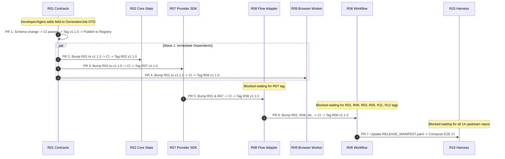
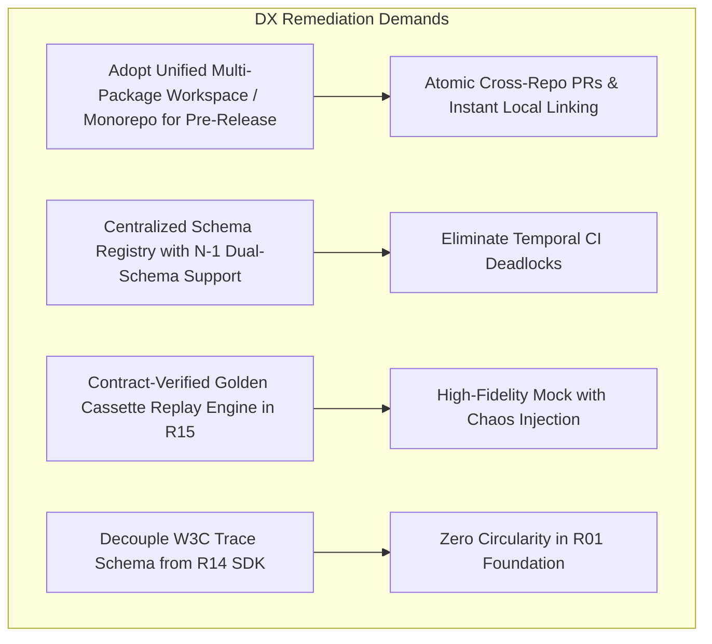

# C02R GENUINE ADVERSARIAL CROSS-EXAMINATION
## Decision Cluster 08: Repository Dependency Architecture & DAG
**ROLE:** R10 (Developer Experience / DX Specialist) — CHALLENGER  
**DATE:** 2026-08-15  
**STATUS:** ACTIVE_ATTACK  
**TARGET FILES & ARTIFACTS:**  
- `01_master/REPOSITORY_STRATEGY.md`
- `04_integration/DEPENDENCY_GRAPH.md`
- `04_integration/LOCAL_DEVELOPMENT.md`
- `06_adrs/ADR-001_MODULAR_POLYREPO.md`
- `03_repo_blueprints/R01_CONTRACTS.md` through `R15_INTEGRATION_HARNESS.md`
- `review-session/FREEZE_REMEDIATION_V1/C02R_GENUINE_RAW/CLUSTER_08_PROPONENT_R01.md`
- `review-session/FREEZE_REMEDIATION_V1/CHANGE_PROPOSALS/CP-010_REPOSITORY_DEPENDENCY_DAG.md`

---

### 1. Executive Challenge & Core Position

The proponent's defense for Decision Cluster 08 ([`CLUSTER_08_PROPONENT_R01.md`](file:///Applications/XAMPP/xamppfiles/htdocs/AGENTIC/AVF_SPEC_REVIEW/review-session/FREEZE_REMEDIATION_V1/C02R_GENUINE_RAW/CLUSTER_08_PROPONENT_R01.md)) presents an elegant, mathematically idealized 6-layer Directed Acyclic Graph (DAG) for 15 repositories. It asserts that strict layer hierarchy and a codified Forbidden Dependency Matrix will safeguard domain boundaries and ensure seamless parallel execution by autonomous AI coding agents.

However, as **Developer Experience (DX) and AI Handoff Specialist (R10)**, I challenge the proponent's architecture as **operationally unworkable, friction-heavy, and plagued by severe integration blindspots**:

1. **The 15-Polyrepo Version Bump Avalanche & Pre-Release Paralysis:** Mandating 15 separate, physically isolated git repositories governed by strict SemVer ranges during rapid Phase 0/Phase 1 pre-release iteration imposes massive release choreography overhead. A single schema change in `R01_CONTRACTS` cascades into a 6-wave sequential PR avalanche, 15 CI build queues, and lockfile synchronization nightmares that will stall autonomous coding agents and human developers alike. Furthermore, the proponent's brief exhibits an embarrassing structural hypocrisy: proposing a polyrepo architecture while specifying monorepo-only tooling configurations (`packages/avf-*`).
2. **Temporal CI Deadlocks & False-Green Isolation During Contract Evolution:** When contracts evolve across consumer-producer boundaries (e.g. `R08 Google Flow Adapter` calling `R09 Browser Worker` / `R10 FlowKit Bridge`), isolated per-repo CI pipelines face mutual dependency deadlocks. Repositories cannot merge breaking updates without breaking peer CI pipelines. Moreover, hidden circularities between `R01 Contracts` and `R14 Observability` trace contexts create build-time traps, while isolated CI testing creates a dangerous "green in isolation, broken on compose" illusion.
3. **Mock Fidelity Illusion & Dangerous Fragility of `FakeProvider`:** The integration strategy relies entirely on `R15 Integration Harness` providing a naive `FakeProvider` / `FakeVideoProvider`. This mock completely fails to simulate the brutal runtime realities of `R08`, `R09`, and `R10`—including non-linear asynchronous polling drift, Cloudflare/Turnstile security challenges, MV3 service worker lifecycle terminations, CDP WebSocket drops, and multi-megabyte media streaming backpressure. Systems tested against this mock will achieve 100% test coverage in CI while instantly collapsing upon deployment against live providers.

---

### 2. Attack Vector 1: The 15-Polyrepo Build Overhead & Version Bump Friction During Pre-Release Iteration

#### 2.1 The $O(N)$ Cascading Release Avalanche
ADR-001 ([`ADR-001_MODULAR_POLYREPO.md`](file:///Applications/XAMPP/xamppfiles/htdocs/AGENTIC/AVF_SPEC_REVIEW/review-session/FREEZE_REMEDIATION_V1/REVISED_SPEC_CANDIDATE/06_adrs/ADR-001_MODULAR_POLYREPO.md)) mandates 15 distinct repositories under the claim of "AI-agent build isolation and replaceability." In [`REPOSITORY_STRATEGY.md`](file:///Applications/XAMPP/xamppfiles/htdocs/AGENTIC/AVF_SPEC_REVIEW/review-session/FREEZE_REMEDIATION_V1/REVISED_SPEC_CANDIDATE/01_master/REPOSITORY_STRATEGY.md), it enforces:
```yaml
contracts:
  avf-contracts: ">=1.0,<2.0"
  provider-sdk: ">=1.0,<2.0"
# Rule: No repository consumes main branch of another repo in production.
```

Consider the concrete operational lifecycle during pre-release iteration (Phase 0 and Phase 1), when domain models, prompt AST nodes, and provider error codes change daily:



**The Cost Analysis of Polyrepo Choreography:**
- A single atomic field addition in `R01` requires **14 downstream PRs**, **15 independent CI pipeline runs**, **15 git tags**, and **15 package registry publish events**.
- Because the DAG has 6 topological layers, these PRs **cannot be executed in parallel**. They must be staged across at least **4 to 6 sequential release waves**.
- If a typical CI pipeline takes 4 minutes (running lint, typecheck, unit tests, container packaging), end-to-end propagation of a single contract field takes over **25–40 minutes of wall-clock time**, even with zero merge conflicts!

#### 2.2 Autonomous Coding Agent Paralysis & Context Stalls
The fundamental premise of ADR-001 is that "coding agents can own bounded repos." But how does an autonomous coding agent actually work in this environment?
1. **Context Fragmentation:** An agent assigned to implement `R06 Workflow` has its context window restricted to `R06`. If it discovers that `R05 Prompt Compiler` lacks a necessary AST property or `R08 Google Flow Adapter` returns an unhandled error code, the agent **cannot fix it**.
2. **Agent Deadlock:** The agent is forced to halt, raise a `SPEC_CLARIFICATION_REQUEST`, and abort its execution loop. A human operator or meta-orchestrator must then spin up an agent for `R01`, wait for publish, spin up an agent for `R05`, wait for publish, and finally re-trigger the `R06` agent.
3. **Local Linking (`npm link` / `pip -e`) Fragility:** If developers attempt to work around this by using local package symlinks (`npm link`, `yarn link`, `poetry add --editable ../R01`), symlinks fail inside Docker Compose build contexts (which cannot follow symlinks pointing outside the build context root) and cause subtle path-resolution crashes in Node.js/Python module loaders.

#### 2.3 The Monorepo/Polyrepo Spec Contradiction
In Section 7.1 of [`CLUSTER_08_PROPONENT_R01.md`](file:///Applications/XAMPP/xamppfiles/htdocs/AGENTIC/AVF_SPEC_REVIEW/review-session/FREEZE_REMEDIATION_V1/C02R_GENUINE_RAW/CLUSTER_08_PROPONENT_R01.md#L442-L477), the proponent provides the exact `.dependency-cruiser.js` configuration intended to enforce DAG boundaries:

```javascript
// From CLUSTER_08_PROPONENT_R01.md lines 451-473:
module.exports = {
  forbidden: [
    {
      name: 'no-direct-core-db-access',
      from: { pathNot: '^packages/avf-core-state' },
      to: { path: '(pg|typeorm|prisma|knex|@avf/core-state/internal)' }
    },
    {
      name: 'no-provider-in-domain-engines',
      from: { path: '^packages/(avf-creative|avf-assets-continuity|avf-prompt-compiler|avf-qc)' },
      to: { path: '^packages/(avf-google-flow-adapter|avf-browser-worker|avf-flowkit-bridge)' }
    }
  ]
};
```

> [!CAUTION]
> **Fatal Spec Contradiction:** `dependency-cruiser` matching paths like `^packages/avf-core-state` is exclusively valid in a **single monorepo repository with a shared root filesystem**. In a true 15-repository polyrepo, `avf-creative` lives in its own git repository (`git@github.com:avf/avf-creative.git`). It does not have a `packages/` prefix, nor does it contain source code from peer packages for AST linters to inspect. 
> 
> The proponent is designing CI verification rules that assume a Monorepo workspace while simultaneously enforcing a 15-Polyrepo deployment architecture. This reveals that the polyrepo model was never validated against actual developer workflows or tooling.

---

### 3. Attack Vector 2: Circular Dependency Risks & CI Coordination Deadlock During Contract Schema Updates

#### 3.1 The Two-Sided Contract Coordination Deadlock
Consider a real-world contract evolution between Layer 2 (`R08 Google Flow Adapter`) and Layer 1 (`R09 Browser Worker` / `R10 FlowKit Bridge`):

```text
[SCENARIO: Contract Evolution in FlowExecutionPort]
1. R01 updates browser-command.schema.json: changes OPEN_FLOW payload from { flow_url } to { flow_id, target_workspace }.
2. R01 publishes v2.0.0.
3. R08 needs to send new command payload.
4. R09 needs to receive and execute new command payload.
```

In the polyrepo CI architecture:
- **Case A (R08 PR submitted first):** `R08` updates dependency to `R01@2.0.0`. `R08`'s contract conformance tests in CI run against the current published `R09` container (`R09@1.0.0`). The test fails because `R09@1.0.0` rejects the new schema! **CI FAILS. PR BLOCKED.**
- **Case B (R09 PR submitted first):** `R09` updates dependency to `R01@2.0.0`. `R09`'s incoming command validator now expects `{ flow_id, target_workspace }`. Its integration test runs against published `R08` (`R08@1.0.0`), which still sends `{ flow_url }`. Schema validation throws `400 BAD_REQUEST`. **CI FAILS. PR BLOCKED.**

Neither repository can merge without the other already being merged and published. This is a classic **distributed CI coordination deadlock**. 

The specification provides **zero mechanism** for:
- Dual-schema transition windows (e.g. N-1 schema tolerance).
- Atomic cross-repo PR testing environments (e.g. testing `R08#PR-42` against `R09#PR-88` before merging either).
- Contract capability negotiation at runtime.

#### 3.2 The Observability & Trace Context Circularity Trap
The proponent argues in Section 5.1 of [`CLUSTER_08_PROPONENT_R01.md`](file:///Applications/XAMPP/xamppfiles/htdocs/AGENTIC/AVF_SPEC_REVIEW/review-session/FREEZE_REMEDIATION_V1/C02R_GENUINE_RAW/CLUSTER_08_PROPONENT_R01.md#L285-L325) that `R14 Platform Observability` is strictly acyclic because `R14` imports `R01`, while `R01` has zero dependencies.

However, examining the actual schemas reveals a deep architectural leak:
1. `02_contracts/event-envelope.schema.json` requires:
   ```json
   "properties": {
     "trace_id": { "type": "string" },
     "span_id": { "type": "string" },
     "baggage": { "type": "object" },
     "telemetry_context": { "$ref": "..." }
   }
   ```
2. Who defines the structure, formatting, and validation rules of `telemetry_context` and distributed W3C trace propagation? 
   - If `R01 Contracts` defines the OpenTelemetry serialization schemas, `R01` is duplicating OpenTelemetry semantic conventions and must be manually synchronized whenever `R14` updates its telemetry instrumentation or log redaction filters.
   - If `R14` defines the telemetry schema, then `R01` cannot validate `event-envelope.schema.json` without importing `R14`, instantly creating the forbidden circular dependency:
     $$R01 \xrightarrow{\text{imports trace types}} R14 \xrightarrow{\text{imports domain schemas}} R01$$
3. Furthermore, when `R14` publishes an updated logging middleware that automatically sanitizes error payloads based on `ProviderErrorCode` enum values from `R01`, any new error code introduced in `R01` causes compile-time warnings or unhandled enum branches in `R14`'s log formatters until `R14` is bumped and republished.

#### 3.3 The "Green in Isolation, Broken on Compose" Integration Illusion
Because each of the 15 polyrepos runs its unit tests against locked mock payloads, local CI passes with 100% green builds.
- `R02 Core State` passes CI with `R01@1.2.0`.
- `R06 Workflow` passes CI with `R01@1.1.0`.
- `R11 QC Engine` passes CI with `R01@1.0.0`.

Each team/agent sees a green checkmark and merges to `main`. 
Only when `R15 Integration Harness` runs its nightly release build (`docker compose up --build`) does the entire system shatter due to subtle JSON field name shifts, enum additions, and state transition mismatches. 

This shifts bug discovery from **fast, shift-left pull request time** to **slow, post-merge release gate time**, which is the exact anti-pattern modern Developer Experience seeks to eradicate.

---

### 4. Attack Vector 3: Mock Fidelity & The Catastrophic Fragility of `FakeProvider` in R15

#### 4.1 The Mock Reality Distortion Gap
[`REPOSITORY_STRATEGY.md`](file:///Applications/XAMPP/xamppfiles/htdocs/AGENTIC/AVF_SPEC_REVIEW/review-session/FREEZE_REMEDIATION_V1/REVISED_SPEC_CANDIDATE/01_master/REPOSITORY_STRATEGY.md#L68-L72) and [`LOCAL_DEVELOPMENT.md`](file:///Applications/XAMPP/xamppfiles/htdocs/AGENTIC/AVF_SPEC_REVIEW/review-session/FREEZE_REMEDIATION_V1/REVISED_SPEC_CANDIDATE/04_integration/LOCAL_DEVELOPMENT.md#L15) state that developers and CI run using `FakeVideoProvider` / `FakeProvider` so that:
> "A developer/agent should run most of the system without Google Flow or generation credits."

While laudable in theory, in practice `FakeProvider` as defined is a trivial in-memory mock that returns immediate `200 OK` responses or advances progress on a predictable 1-second timer. 

This creates a **massive mock fidelity gap** between local test suites and the real execution paths of `R08 Google Flow Adapter`, `R09 Browser Worker` (Playwright), and `R10 FlowKit Bridge` (Reverse-Engineered HTTP):

| Runtime Execution Reality | Real Production Worker (`R08` / `R09` / `R10`) | Naive `FakeProvider` in `R15` | DX / Testing Failure Mode |
|---|---|---|---|
| **Asynchronous Generation Timing** | Video generation takes 60s–180s. Progress frequently stalls at 99% for 45s, drops to 90%, or fails abruptly with internal server error. | Emits linear progress increments ($10\% \to 20\% \dots \to 100\%$) every 500ms deterministically. | Workflows in `R06` never test lease extension heartbeats, polling backoff jitter, or workflow timeouts under real generation delays. |
| **Bot Detection & Security Challenges** | Google Cloudflare / Turnstile / reCAPTCHA Enterprise injects interactive challenges (`SECURITY_CHALLENGE`) mid-session. | Never triggers security challenges; returns clean generation tokens. | Zero code paths in `R06` / `R13` for operator challenge escalation or proxy rotation are ever exercised in CI. |
| **MV3 Service Worker Lifecycle & Cold Boots** | Chrome MV3 background service workers terminate after 30s of inactivity. Inbound CDP connections drop; WebSocket pipes disconnect. | Runs inside a persistent Node.js/Go process that never dies or drops connections. | Playwright worker reconnection logic, dangling CDP handles, and state recovery on cold boot are completely unverified. |
| **DOM Mutation & Protocol Churn** | Google Flow Webpack builds push minified class updates and DOM tree mutations (`UI_CHANGED`) without notice. | Static JSON responses; 0% DOM interaction. | UI selector drift and fallback recovery mechanisms in `R09` are never exercised. |
| **Media Blob Streaming & Memory Pressure** | Outputs high-resolution WebM/MP4 byte streams (50MB–200MB) requiring disk spooling and chunked S3 multipart uploads. | Returns a tiny 2KB dummy MP4 fixture or mock string URI (`http://localhost/fake.mp4`). | Fails to expose Node.js buffer memory leaks, S3 network throttling, disk space exhaustion, or FFmpeg probe OOM crashes in `R12 Media` and `R11 QC`. |
| **Idempotency & Concurrent Lease Collisions** | Submitting the same seed and prompt concurrently triggers HTTP 409 Conflict or provider session lock. | Accepts concurrent requests without simulating provider-level session contention. | Race conditions in saga dispatchers and outbox processors remain undetected until production. |

#### 4.2 The Danger of Unverified Test Coverage
Because `FakeProvider` does not undergo automated contract conformance testing against real recorded provider interactions, it drifts rapidly from reality. 
- When an AI coding agent implements a new saga in `R06 Workflow`, it runs the test suite against `FakeProvider`.
- The test passes with 100% green coverage.
- The PR merges with high confidence.
- When deployed to staging with live `R08/R09`, the worker immediately crashes on the first real generation because the live provider emitted a slightly different progress payload structure or took 75 seconds instead of 5 seconds, causing a workflow activity lease timeout!

---

### 5. Concrete Failure Scenarios

To demonstrate the severity of these defects, we present three concrete failure scenarios encountered during developer iteration:

#### Scenario FS-DX-01: The Lockfile Desynchronization & PR Storm
1. An agent working on `R04 Assets/Continuity` needs an extra field `embedding_dimensions` added to `domain-entities.schema.json`.
2. Agent opens PR #12 in `R01 Contracts`. It merges and publishes `@avf/contracts@1.4.0`.
3. Agent opens PR #15 in `R04` updating `package.json` to `"@avf/contracts": "^1.4.0"`. CI passes and merges.
4. Meanwhile, another agent working on `R06 Workflow` opens PR #44 updating a saga. Its local lockfile pinned `@avf/contracts` to `1.3.0`.
5. When `R06` workflow invokes `R04` activity, the activity returns an entity containing `embedding_dimensions`. `R06`'s validator (running against `1.3.0` schema where `additionalProperties: false`) rejects the payload and aborts the entire generation pipeline.
6. **Result:** Production workflow crashes due to silent lockfile drift across polyrepos.

#### Scenario FS-DX-02: Circular Type Ingestion in Observability Middleware
1. `R01` introduces a new structured diagnostic interface `ExecutionDiagnosticData` containing OpenTelemetry span context.
2. Developer in `R01` imports `@avf/platform-observability` types to avoid duplicating the W3C trace schema.
3. `R14 Platform Observability` is updated to implement a custom serializer for `ExecutionDiagnosticData` and imports `@avf/contracts`.
4. The build pipeline attempts to execute `npm publish` in `R01`. `R01` fails to install dependencies because `@avf/platform-observability@1.2.0` depends on `@avf/contracts@^1.2.0`, which does not exist in the npm registry yet!
5. **Result:** Complete build deadlock; neither package can be built or published.

#### Scenario FS-DX-03: The Mock Green False-Positive Crash
1. Developer tests multi-shot video generation locally using `docker compose --profile core up` (running `FakeVideoProvider`).
2. Sagas in `R06` execute 10 consecutive shot generations in 5 seconds. All tests pass.
3. Operator runs the same workflow on staging against `Track A (R09 Browser Worker)`.
4. On Shot #3, Chrome MV3 service worker goes idle and terminates. The CDP connection drops. R08 receives `ECONNRESET`.
5. Because `R06`'s retry logic was only tested against `FakeProvider` (which never emits network drops), the workflow treats `ECONNRESET` as an unretryable `PROVIDER_INTERNAL_ERROR` and fails the entire project take, wasting 20 minutes of rendering time.

---

### 6. Prescriptive Remediation Demands for C03R / CP-010

To transform this fragile, high-friction architecture into a robust, high-velocity developer platform without compromising domain isolation, the following architectural remediations must be incorporated into CP-010 and related blueprints:



#### Remediation 1: Unified Multi-Package Workspace Strategy (or Automated Cross-Repo CI Orchestrator)
- **Mandate:** For pre-release (Phase 0 and Phase 1), consolidate the 15 repositories into a **unified multi-package workspace** (e.g. `pnpm` workspaces + Turborepo, or Cargo/Poetry multi-package root) OR provide an official multi-repo orchestration tool (`changesets` + automated cross-repo branch linking via GitHub Actions).
- **Justification:** Allows developers and AI coding agents to make atomic, multi-package changes in a single branch and PR. Eliminates the 14-PR cascading bump avalanche, guarantees synchronized lockfiles, and restores the validity of the proponent's `.dependency-cruiser.js` configurations.

#### Remediation 2: Schema Versioning & N-1 Backward Compatibility Rule
- **Mandate:** Codify in `02_contracts/API_COMPATIBILITY_POLICY.md` that all public contract updates across `FlowExecutionPort` (`R08` $\leftrightarrow$ `R09`/`R10`) and Core State (`R02` $\leftrightarrow$ `R06`) must support **N-1 schema tolerance**:
  - A consumer must accept both version $N$ and version $N-1$ payloads during a transition window.
  - Breaking schema changes must use additive schema fields and explicit deprecation periods rather than abrupt breaking edits.
- **Justification:** Resolves two-sided CI deadlocks, allowing `R08` and `R09` PRs to merge in any order without breaking peer CI.

#### Remediation 3: Zero-Dependency W3C Context Primitives in R01
- **Mandate:** Explicitly define raw W3C TraceContext and Baggage string schemas directly in `R01_CONTRACTS` as standard primitive types without importing external runtime libraries.
- **Mandate:** Codify that `R14 Platform Observability` is an adapter that wraps standard OpenTelemetry SDKs around `R01` primitives, with zero static import of `R14` permitted inside `R01`.

#### Remediation 4: High-Fidelity `FakeProvider` with Golden Cassettes & Chaos Engine
- **Mandate in R15 Blueprint:** Upgrade `FakeProvider` from a naive mock to a **Contract-Verified Virtual Provider**:
  1. **Golden Cassette Replay:** Support recording real `R08/R09/R10` network and CDP sessions into sanitized JSON/YAML cassettes that can be replayed deterministically in CI.
  2. **Deterministic Chaos Injection:** Allow tests to inject configurable failure modes via headers/environment variables:
     - `CHAOS_RATE_LIMIT=true` (emits HTTP 429 after 2 calls).
     - `CHAOS_SECURITY_CHALLENGE=true` (simulates Cloudflare interstitial).
     - `CHAOS_POLLING_STALL_SECS=45` (simulates 99% generation freeze).
     - `CHAOS_DISCONNECT_CDP=true` (drops WebSocket mid-execution).
  3. **Realistic Media Fixtures:** Ensure `FakeProvider` generates valid, multi-megabyte H.264/AAC test video files (with SMPTE colorbars and timestamp overlays) to accurately test FFmpeg probe and transcoding pipelines in `R12 Media` and `R11 QC`.

---

### 7. Challenger Conclusion & Call to Action

The 15-repository DAG proposed in Candidate v1.0 / CLUSTER-08 is architecturally pristine on paper, but operationally crippled in practice. It inflicts severe version bump friction on developers and AI agents, induces CI deadlocks during schema updates, and fosters a dangerous false-green testing culture through an unrealistic `FakeProvider`.

**I move that the Architecture Council CONDITIONALLY APPROVE Decision Cluster 08 ONLY UPON the formal adoption of the 4 DX Remediation Demands detailed above.**

---
**SIGNATURE:**  
*R10 Developer Experience / AI Handoff Specialist — AI Video Factory Architecture Council*
