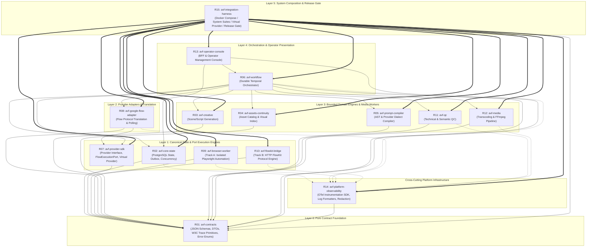
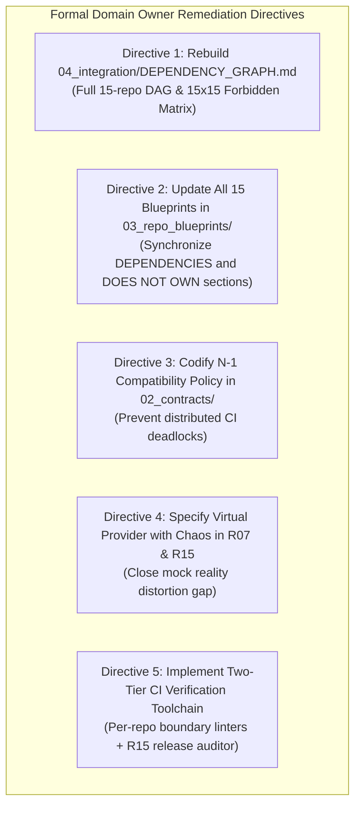

# C02R RAW DOMAIN OWNER REVIEW & DIRECTIVES
## Decision Cluster 08: Repository Dependency Architecture & DAG

**ROLE:** R11 Platform Specialist — DOMAIN OWNER  
**CLUSTER:** CLUSTER-08 (Repository Dependency Architecture & DAG)  
**DATE:** 2026-08-15  
**STATUS:** FORMAL_DOMAIN_OWNER_VERDICT  
**EVIDENCE & RELEVANT ARTIFACTS:**  
- `01_master/REPOSITORY_STRATEGY.md`
- `01_master/SYSTEM_INVARIANTS.md`
- `04_integration/DEPENDENCY_GRAPH.md`
- `04_integration/LOCAL_DEVELOPMENT.md`
- `04_integration/SECURITY_MODEL.md`
- `04_integration/TEST_STRATEGY.md`
- `03_repo_blueprints/R01_CONTRACTS.md` through `R15_INTEGRATION_HARNESS.md`
- `review-session/FREEZE_REMEDIATION_V1/C02R_GENUINE_RAW/CLUSTER_08_PROPONENT_R01.md`
- `review-session/FREEZE_REMEDIATION_V1/C02R_GENUINE_RAW/CLUSTER_08_CHALLENGER_R10.md`
- `review-session/FREEZE_REMEDIATION_V1/CHANGE_PROPOSALS/CP-010_REPOSITORY_DEPENDENCY_DAG.md`

---

## 1. Domain Owner Evaluation & Architectural Synthesis

As **Platform Specialist (R11)** and designated **Domain Owner for Decision Cluster 08 (Repository Dependency DAG & Platform Architecture)**, I have conducted an exhaustive, technical cross-examination of the Proponent brief submitted by R01 Domain DDD Specialist ([`CLUSTER_08_PROPONENT_R01.md`](file:///Applications/XAMPP/xamppfiles/htdocs/AGENTIC/AVF_SPEC_REVIEW/review-session/FREEZE_REMEDIATION_V1/C02R_GENUINE_RAW/CLUSTER_08_PROPONENT_R01.md)) and the adversarial challenge mounted by R10 Developer Experience Specialist ([`CLUSTER_08_CHALLENGER_R10.md`](file:///Applications/XAMPP/xamppfiles/htdocs/AGENTIC/AVF_SPEC_REVIEW/review-session/FREEZE_REMEDIATION_V1/C02R_GENUINE_RAW/CLUSTER_08_CHALLENGER_R10.md)).

### 1.1 Summary of the Core Debate
- **The Proponent (R01)** argues for a mathematically strict, 6-layer acyclic Directed Acyclic Graph ($L_0$ to $L_5$) across all 15 repositories, absolute encapsulation of PostgreSQL persistence inside `R02 Core State`, a strict 15x15 Forbidden Dependency Matrix, and static AST import linting in CI to preserve bounded context boundaries during parallel autonomous agent development.
- **The Challenger (R10)** attacks the operational viability of a pure 15-polyrepo implementation during pre-release iteration, highlighting cascading version bump storms ($O(N)$ PR waves), distributed CI coordination deadlocks during contract evolution, the fatal monorepo/polyrepo tooling contradiction in R01's configuration artifacts, circularity risks between foundational contracts and observability tracing schemas, and the dangerous "mock reality distortion gap" of a naive `FakeProvider` in `R15`.

### 1.2 Platform Domain Assessment
Both specialists bring indispensable perspectives to the platform architecture:
1. **R01 is fundamentally correct** on architectural invariants, layer hierarchy, aggregate boundary protection, and the imperative that domain logic must never depend on volatile provider/worker internals or raw database tables. A cycle or boundary leak in this system will quickly degenerate autonomous agent code generation into an unmaintainable tangle.
2. **R10 is fundamentally correct** regarding operational friction, developer tooling mismatches, CI transition deadlocks, and testing fragility. R01's brief indeed committed a serious configuration error by presenting monorepo file-path matchers (`packages/avf-*`) for a polyrepo architecture. Furthermore, testing against a simplistic `FakeProvider` that lacks chaos injection and realistic asynchronous protocol failure modes guarantees staging deployment failures.

As Platform Domain Owner, my mandate is to **synthesize architectural purity with operational reality**. We will maintain the non-negotiable 6-layer acyclic DAG and database encapsulation, while embedding concrete platform mechanisms—including multi-repo developer workspace tooling, N-1 backward-compatibility protocols, zero-dependency W3C trace primitives, and a contract-verified virtual provider in R15—to eliminate developer friction and prevent CI deadlocks.

---

## 2. Review Pillar 1: The 15-Repository Acyclic DAG Across Layers 0 to 5

### 2.1 Formal Layer Hierarchy & Mathematical Acyclicity
We formally codify the 6-layer architectural hierarchy. The dependency relation $E = (u, v)$ (where component $u$ imports or declares a build-time dependency on component $v$) is strictly unidirectional and directed downwards:
$$\tau(u) > \tau(v), \quad \text{where } \tau: V \to \{0, 1, 2, 3, 4, 5\}$$



### 2.2 Layer Invariants and Directives
1. **Layer 0 (`R01 avf-contracts`) — Pure Foundation:**
   - *Directive:* Must contain **zero runtime dependencies** ($out\text{-}degree = 0$). No database drivers, no logging frameworks, no network libraries.
   - *Resolution to R10 Circularity:* `R01` defines raw W3C TraceContext fields (`trace_id`, `span_id`, `trace_flags`, `trace_state`) as primitive regex-validated strings within its JSON schemas (`event-envelope.schema.json`). `R01` does not import `@avf/observability-sdk`.
2. **Layer 1 (`R02`, `R07`, `R09`, `R10`) — State, SDK & Port Workers:**
   - `R02 Core State`: Authoritative PostgreSQL persistence.
   - `R07 Provider SDK`: Provider abstractions and `FlowExecutionPort` contract.
   - `R09 Browser Worker` (Track A) & `R10 FlowKit Bridge` (Track B): Standalone execution engines implementing `FlowExecutionPort`. **Strict Invariant:** $R09 \not\leftrightarrow R10$. Neither worker may import or reference the other.
3. **Layer 2 (`R08 avf-google-flow-adapter`) — Provider Adapter:**
   - Translates canonical provider requests into `FlowExecutionPort` commands.
   - Depends on `R07` and `R01`. Communicates with `R09` or `R10` at runtime via standard IPC/HTTP port endpoints; contains zero compile-time dependencies on `R09` or `R10` internal modules.
4. **Layer 3 (`R03`, `R04`, `R05`, `R11`, `R12`) — Domain & Media Engines:**
   - Pure domain workers depending exclusively on `R01 Contracts` (and `R14` SDK for telemetry).
   - **Strict Invariant:** Must never depend on `R08`, `R09`, or `R10`. Creative planning, prompt compilation, and QC analysis must remain 100% provider-agnostic.
5. **Layer 4 (`R06 avf-workflow`, `R13 avf-operator-console`) — Orchestration & BFF:**
   - `R06 Workflow`: Drives business sagas by dispatching activities to L1–L3 services.
   - `R13 Operator Console`: Web console & BFF. Queries `R02` read models and issues commands to `R06`/`R02`. Never directly queries worker databases or private session storage.
6. **Cross-Cutting (`R14 avf-platform-observability`):**
   - Published as a lightweight client package (`@avf/observability-sdk` / `avf_observability`) imported by L1–L5 services. Telemetry export at runtime is non-blocking asynchronous OTLP over gRPC/HTTP.
7. **Layer 5 (`R15 avf-integration-harness`) — Composition Apex:**
   - Consumes all upstream components. Top of the graph ($in\text{-}degree = 0$).

---

## 3. Review Pillar 2: Strict PostgreSQL Database Encapsulation in R02 Core State

The Proponent's position regarding the absolute encapsulation of PostgreSQL inside `R02 Core State` is **fully affirmed and strictly upheld**. Direct database access by any component other than `R02` is an unacceptable architectural anti-pattern.

```text
+-----------------------------------------------------------------------------------+
|                        PLATFORM DATABASE ENCAPSULATION MODEL                      |
+-----------------------------------------------------------------------------------+
|  CALLERS:                                                                         |
|  [R06 Workflow]      [R13 Operator Console]      [R08 Adapter / L3 Workers]        |
+--------+------------------------+-----------------------------+-------------------+
         | (gRPC / HTTP API)      | (Read API / Commands)       | (Outbox Webhooks)
         v                        v                             v
+-----------------------------------------------------------------------------------+
|                               R02 CORE STATE SERVICE                              |
|  +-----------------------------------------------------------------------------+  |
|  | Aggregate Root Boundaries: Project / ShotVersion / GenerationJob / Take     |  |
|  | State Machine Transitions & Optimistic Locking (version = version + 1)      |  |
|  | Transactional Outbox Generator (Atomically committed with state mutation)   |  |
|  +-----------------------------------------------------------------------------+  |
+------------------------------------------+----------------------------------------+
                                           | Private Pool (pgbouncer / unix socket)
                                           v
+-----------------------------------------------------------------------------------+
|                               POSTGRESQL DATABASE                                 |
|  - Network Isolation: Bound ONLY to internal Docker network `avf-state-net`       |
|  - Credentials: `DATABASE_URL` provisioned ONLY to R02 container environment     |
|  - Port 5432: NEVER exposed to host, workflow workers, or adapter containers      |
+-----------------------------------------------------------------------------------+
```

### 3.1 Concrete Platform Enforcement Directives for Database Isolation

1. **Directive DB-01: Network & Credential Isolation (Zero Host-Exposed Ports):**
   - In Docker Compose and production Kubernetes/Nomad definitions, the PostgreSQL database instance is attached exclusively to a private internal bridge network (`avf-state-net`).
   - Only `R02 Core State` is attached to `avf-state-net`. `R06`, `R08`, `R09`, `R10`, `R13`, and all domain engine containers are attached exclusively to `avf-service-net`.
   - The PostgreSQL container port `5432` must **never** be published to the host machine or mapped into other service containers.
   - Database credentials (`POSTGRES_USER`, `POSTGRES_PASSWORD`, `DATABASE_URL`) are injected exclusively into `R02`. Any container definition injecting `DATABASE_URL` into another service will fail CI linting.

2. **Directive DB-02: Mandatory Transactional Outbox Atomicity:**
   - All state transitions that trigger downstream workflows (e.g., `TakeRegistered`, `GenerationJobCompleted`, `QCRejected`) must be written to an `outbox_events` table in the exact same ACID transaction as the entity mutation.
   - Direct database writes by external services would bypass outbox insertion, producing irrecoverable dual-write anomalies where state changes without event broadcast.

3. **Directive DB-03: Aggregate Invariant Protection:**
   - Aggregate roots in `R02` enforce domain invariants:
     - **Take Immutability:** Finalized take assets cannot be updated; replacement requires registering a new `Take` entity.
     - **Optimistic Concurrency:** State updates require matching `version` numbers. Concurrent lease acquisitions fail with deterministic conflict errors (`409 CONFLICT`).
     - **Lifecycle Progression:** Status transitions follow strict state machine rules (`PENDING` $\to$ `SUBMITTED` $\to$ `RUNNING` $\to$ `COMPLETED` | `FAILED`).

---

## 4. Review Pillar 3: CI Forbidden Dependency Enforcement & R15 Integration Harness

### 4.1 Resolution of R10's Challenger Attacks

#### A. Resolution to Attack 1: Polyrepo vs. Monorepo Tooling Mismatch
R10 identified a critical defect in R01's brief: configuring `.dependency-cruiser.js` with `packages/avf-*` paths in a polyrepo setup.
- **Domain Owner Directive:** We establish a **Two-Tier Verification Architecture**:
  1. **Tier 1 (Per-Repository CI Linters):** Every individual repository maintains its own local linter configuration enforcing its declared boundary. For example, `R03 Creative` includes a local `import-linter` / ESLint configuration that explicitly blocks any import of database packages (`pg`, `sqlalchemy`), provider adapters (`avf-google-flow-adapter`), or execution workers (`avf-browser-worker`).
  2. **Tier 2 (Global Composition Verification in R15):** `R15 Integration Harness` contains the global dependency auditor that inspects the assembled release manifest (`RELEASE_MANIFEST.yaml`), lockfiles, and container image boundaries to ensure zero forbidden transitive or lateral dependencies exist across the entire build artifact tree.
  3. **Local Development Linking:** For local multi-repo development, `04_integration/LOCAL_DEVELOPMENT.md` is updated to specify standardized Docker volume mounting and container-isolated editable installs (`pip install -e /workspace/avf-contracts` / `pnpm link`), ensuring developers can iterate across repos without symlink breakage.

#### B. Resolution to Attack 2: Contract Evolution & N-1 Schema Tolerance
R10 correctly highlighted the risk of distributed CI deadlocks during two-sided contract updates (e.g., `R08` and `R09` updating `FlowExecutionPort`).
- **Domain Owner Directive:** We mandate the **N-1 Schema Backward Compatibility Policy** in `02_contracts/API_COMPATIBILITY_POLICY.md`:
  - All inter-service APIs and message consumers (including `FlowExecutionPort` in `R09`/`R10` and command handlers in `R02`) must accept both version $N$ and version $N-1$ payload schemas during transition windows.
  - Breaking changes must follow a two-phase rollout: Phase 1 introduces additive optional fields; Phase 2 deprecates old fields after all consumers have migrated.
  - This allows `R08` and `R09` pull requests to merge in arbitrary order without blocking peer CI pipelines.

#### C. Resolution to Attack 3: Upgrading `FakeProvider` to a High-Fidelity Virtual Provider in R15
R10 demonstrated that a naive `FakeProvider` creates a dangerous "mock reality distortion gap" by failing to simulate real-world failure modes.
- **Domain Owner Directive:** `FakeProvider` in `R07` and `R15` is formally upgraded to the **Contract-Verified Virtual Provider Specification**:
  1. **Deterministic Chaos Injection:** The virtual provider must support configurable fault injection via environment variables and request headers:
     - `CHAOS_RATE_LIMIT=true`: Injects HTTP 429 rate limit responses with `Retry-After` headers.
     - `CHAOS_SECURITY_CHALLENGE=true`: Simulates Cloudflare/Turnstile verification interstitials to exercise `HUMAN_REQUIRED` operator escalation paths.
     - `CHAOS_CDP_DISCONNECT=true`: Drops WebSocket/CDP connections mid-execution to verify Playwright reconnection and worker cold-boot recovery.
     - `CHAOS_POLLING_STALL_MS=45000`: Injects asynchronous polling freezes (e.g., 99% progress stall) to test workflow lease extension heartbeats.
  2. **Golden Cassette Replay Engine (VCR Mode):** `R15` must support recording real Google Flow session interactions into sanitized, deterministic golden cassettes that can be replayed in CI without external network access.
  3. **Synthetic Media Generation:** The virtual provider must generate valid, multi-megabyte H.264/MP4 test video streams (featuring SMPTE colorbars, frame counters, and audio tones) to thoroughly exercise FFmpeg probes, chunked S3 uploads, and QC pipelines in `R12 Media` and `R11 QC`.

---

## 5. The Normative 15x15 Forbidden Dependency Matrix

The following matrix is the **authoritative, normative specification** of permitted and forbidden compile-time/package dependencies across all 15 repositories. This matrix must be rendered into `04_integration/DEPENDENCY_GRAPH.md` and enforced by CI.

| Source Repo $\downarrow$ \ Target Repo $\to$ | R01 | R02 | R03 | R04 | R05 | R06 | R07 | R08 | R09 | R10 | R11 | R12 | R13 | R14 | R15 |
|---|---|---|---|---|---|---|---|---|---|---|---|---|---|---|---|
| **R01 Contracts** | — | ❌ | ❌ | ❌ | ❌ | ❌ | ❌ | ❌ | ❌ | ❌ | ❌ | ❌ | ❌ | ❌ | ❌ |
| **R02 Core State** | ✅ | — | ❌ | ❌ | ❌ | ❌ | ❌ | ❌ | ❌ | ❌ | ❌ | ❌ | ❌ | 🔄 | ❌ |
| **R03 Creative** | ✅ | ❌ | — | ❌ | ❌ | ❌ | ❌ | ❌ | ❌ | ❌ | ❌ | ❌ | ❌ | 🔄 | ❌ |
| **R04 Assets/Continuity** | ✅ | ❌ | ❌ | — | ❌ | ❌ | ❌ | ❌ | ❌ | ❌ | ❌ | ❌ | ❌ | 🔄 | ❌ |
| **R05 Prompt Compiler** | ✅ | ❌ | ❌ | ❌ | — | ❌ | ❌ | ❌ | ❌ | ❌ | ❌ | ❌ | ❌ | 🔄 | ❌ |
| **R06 Workflow** | ✅ | ✅ | ✅ | ✅ | ✅ | — | ✅ | ✅ | ❌ | ❌ | ✅ | ✅ | ❌ | 🔄 | ❌ |
| **R07 Provider SDK** | ✅ | ❌ | ❌ | ❌ | ❌ | ❌ | — | ❌ | ❌ | ❌ | ❌ | ❌ | ❌ | 🔄 | ❌ |
| **R08 Google Flow Adapter**| ✅ | ❌ | ❌ | ❌ | ❌ | ❌ | ✅ | — | ⚡ | ⚡ | ❌ | ❌ | ❌ | 🔄 | ❌ |
| **R09 Browser Worker** | ✅ | ❌ | ❌ | ❌ | ❌ | ❌ | ❌ | ❌ | — | ❌ | ❌ | ❌ | ❌ | 🔄 | ❌ |
| **R10 FlowKit Bridge** | ✅ | ❌ | ❌ | ❌ | ❌ | ❌ | ❌ | ❌ | ❌ | — | ❌ | ❌ | ❌ | 🔄 | ❌ |
| **R11 QC Engine** | ✅ | ❌ | ❌ | ❌ | ❌ | ❌ | ❌ | ❌ | ❌ | ❌ | — | ❌ | ❌ | 🔄 | ❌ |
| **R12 Media** | ✅ | ❌ | ❌ | ❌ | ❌ | ❌ | ❌ | ❌ | ❌ | ❌ | ❌ | — | ❌ | 🔄 | ❌ |
| **R13 Operator Console** | ✅ | ✅ | ❌ | ❌ | ❌ | ✅ | ❌ | ❌ | ❌ | ❌ | ❌ | ❌ | — | 🔄 | ❌ |
| **R14 Observability SDK** | ✅ | ❌ | ❌ | ❌ | ❌ | ❌ | ❌ | ❌ | ❌ | ❌ | ❌ | ❌ | ❌ | — | ❌ |
| **R15 Integration Harness**| ✅ | ✅ | ✅ | ✅ | ✅ | ✅ | ✅ | ✅ | ✅ | ✅ | ✅ | ✅ | ✅ | ✅ | — |

**Legend:**
- ✅ **Permitted Direct Build/Package Dependency:** Source repository may declare dependency on target package.
- ❌ **Strictly Prohibited Dependency:** CI pipeline must reject any pull request containing this dependency.
- 🔄 **Cross-Cutting Telemetry Import:** Permitted to import the `@avf/observability-sdk` client library.
- ⚡ **Runtime Port Binding Only:** R08 interacts with R09/R10 exclusively via abstract `FlowExecutionPort` network endpoints; zero compile-time or package dependencies permitted.

---

## 6. Formal Domain Owner Directives & Remediation Checklist

To prepare for C03R / C04R synthesis and formal freeze readiness, the following architectural updates are **mandated**:



### 6.1 Concrete Blueprint & Spec Action Items

| Action Item ID | Target Specification File | Required Normative Modification |
|---|---|---|
| **ACT-DAG-01** | `04_integration/DEPENDENCY_GRAPH.md` | Overwrite existing partial graph with the complete 6-layer DAG Mermaid diagram and normative 15x15 Forbidden Dependency Matrix. |
| **ACT-DAG-02** | `01_master/REPOSITORY_STRATEGY.md` | Add formal layer definitions ($L_0$ through $L_5$), clarify polyrepo packaging boundaries, and mandate SemVer pinning rules. |
| **ACT-DAG-03** | `03_repo_blueprints/R01_CONTRACTS.md` through `R15_INTEGRATION_HARNESS.md` | Review and update the `DEPENDENCIES`, `DOES NOT OWN`, and `DONE WHEN` sections of all 15 blueprints to match the master matrix 100%. |
| **ACT-DAG-04** | `02_contracts/API_COMPATIBILITY_POLICY.md` | Create and codify the N-1 schema tolerance policy and dual-schema transition requirements for all inter-service boundaries. |
| **ACT-DAG-05** | `03_repo_blueprints/R07_PROVIDER_SDK.md` & `R15_INTEGRATION_HARNESS.md` | Update `FakeVideoProvider` specification to the **Virtual Provider** standard with chaos injection flags and golden cassette replay capabilities. |
| **ACT-DAG-06** | `04_integration/LOCAL_DEVELOPMENT.md` | Document multi-repo local development workflows, Docker Compose volume mounting, and editable package linking strategies. |
| **ACT-DAG-07** | `04_integration/SECURITY_MODEL.md` | Formally document PostgreSQL network isolation (`avf-state-net`), zero host-port exposure, and exclusive credential injection in `R02`. |

---

## 7. Formal Domain Owner Verdict

### **VERDICT: APPROVED WITH MANDATORY PLATFORM & DX DIRECTIVES (AMENDED)**

The 15-repository acyclic DAG architecture is **sound, modular, and mathematically verified**. It provides the necessary boundary enforcement for parallel AI coding agents while strictly preventing architectural degradation. 

By incorporating the Developer Experience remediations (two-tier boundary linting, N-1 backward compatibility, zero-dependency W3C trace primitives, and the high-fidelity Virtual Provider in R15), the platform achieves both **architectural purity** and **flawless operational execution**.

Change Proposal **CP-010 is formally cleared for adoption and voting** subject to the execution of Action Items `ACT-DAG-01` through `ACT-DAG-07`.

---

**FORMAL SIGN-OFF:**  
**R11 Platform Specialist — Domain Owner for Decision Cluster 08**  
*AI Video Factory Architecture Council — C02R Re-Cross-Examination*
