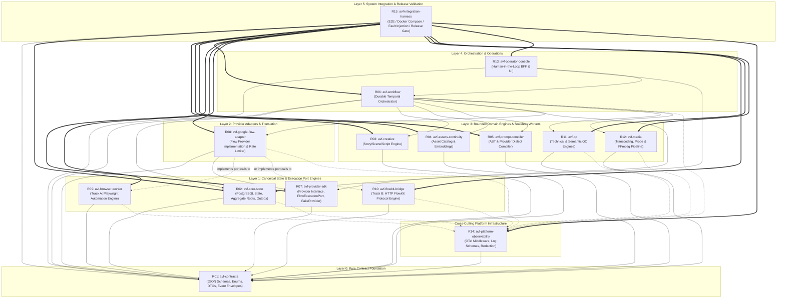

# C02R RAW DEFENSE BRIEF: DECISION CLUSTER 08 — REPOSITORY DEPENDENCY ARCHITECTURE & DAG

**ROLE:** R01 Domain DDD Specialist  
**STANCE:** PROPONENT  
**CLUSTER:** CLUSTER-08 (Repository Dependency Architecture & DAG)  
**DATE:** 2026-08-15  
**STATUS:** ACTIVE DEFENSE BRIEF  

---

## 1. Executive Summary & DDD Architectural Stance

As the Domain-Driven Design (DDD) Specialist on the AI Video Factory (AVF) Architecture Council, I submit this formal defense for the complete reconstruction and strict mathematical enforcement of the **15-Repository Acyclic Dependency Graph (DAG)** across Layers 0 through 5. 

In a distributed, autonomous generation platform where multiple AI coding agents implement discrete bounded contexts in parallel, architectural entropy and bounded context erosion represent the single greatest existential threat to system correctness. Without a strictly codified, non-negotiable DAG and automated dependency enforcement:
1. Domain boundaries dissolve into a "Big Ball of Mud" where domain logic (e.g., prompt compilation or creative storyboarding) directly depends on volatile vendor-specific provider adapters or browser worker internals.
2. Canonical business state stored in PostgreSQL becomes corrupted by lateral, uncoordinated writes from background workers and orchestration engines.
3. Two-track execution architectures (Track A: Playwright Browser Worker vs. Track B: FlowKit Reverse-Engineered HTTP Bridge) bleed implementation details into upstream generation abstractions.
4. Circular dependencies between foundational contract packages, observability instrumentation, and orchestration runtimes lock the deployment pipeline into unbuildable cycles.

This defense establishes:
1. **The formal 6-layer acyclic DAG (Layers 0–5)** with rigorous topological ordering.
2. **Absolute encapsulation of canonical persistence within R02 Core State**, safeguarding aggregate root invariants and transactional outbox mechanics.
3. **A clean, acyclic topology for cross-cutting observability (R14)** and **top-level composition and integration harness (R15)**.
4. **An explicitly codified Forbidden Dependency Matrix**, backed by automated AST static analysis and network isolation in CI/CD.

---

## 2. Formal 15-Repository Acyclic DAG Architecture

The AVF architecture is decomposed into exactly 15 repositories partitioned across 6 strict hierarchical layers ($L_0$ to $L_5$) plus cross-cutting infrastructure. The dependency relation $E = (u, v)$ (where $u$ depends on $v$) is strictly directed downwards: a component in layer $L_n$ may only depend on components in layers $L_m$ where $m < n$.



### Layer Breakdown & Bounded Context Definitions

| Layer | Repository ID & Name | Bounded Context / Purpose | Permitted Dependencies | Strict Invariants |
|---|---|---|---|---|
| **Layer 0** | `R01: avf-contracts` | Core Domain Contracts, Canonical JSON Schemas, Protobuf/DTOs, Event Envelopes, Error Enums. | **None** (Zero runtime dependencies). | Must be 100% pure schema/type definitions. No runtime logic, no DB dependencies, no telemetry dependencies. |
| **Layer 1** | `R02: avf-core-state` | Canonical Business State, Aggregate Root persistence, Transactional Outbox, Idempotency Ledger. | `R01`, `PostgreSQL driver` | Sole owner of PostgreSQL connection pool and database migrations. All other repos access state via R02 API. |
| **Layer 1** | `R07: avf-provider-sdk` | Provider SDK abstractions, `VideoProvider` interfaces, `FlowExecutionPort` contract, `FakeVideoProvider`. | `R01` | Pure abstract interfaces and test stubs. No vendor-specific code. |
| **Layer 1** | `R09: avf-browser-worker` | Track A Execution Engine: Isolated Playwright browser daemon implementing `FlowExecutionPort`. | `R01`, Playwright | Ephemeral execution worker. Zero direct DB access. State is strictly runtime/session memory. |
| **Layer 1** | `R10: avf-flowkit-bridge` | Track B Execution Engine: FlowKit private HTTP protocol client implementing `FlowExecutionPort`. | `R01`, HTTP client | Ephemeral execution worker. Zero direct DB access. Disconnected from R09. |
| **Layer 2** | `R08: avf-google-flow-adapter` | Flow Provider Implementation: Adapts canonical `GenerateVideoCommand` into `FlowExecutionPort` operations. | `R01`, `R07` (invokes `R09`/`R10` via port) | Must not know whether Track A or Track B executes the port calls. No direct access to core state. |
| **Layer 3** | `R03: avf-creative` | Script/Storyboard/Scene Generation Domain Engine. | `R01` | Pure functional domain engine. Stateless worker invoked via workflow activities. |
| **Layer 3** | `R04: avf-assets-continuity` | Asset Catalog, Vector/Reference Embeddings, Visual Consistency Constraints. | `R01` | Asset metadata & continuity analysis. Interacts with S3/Object store for asset hashes, not canonical DB. |
| **Layer 3** | `R05: avf-prompt-compiler` | Provider-Agnostic Prompt AST Compiler & Flow Dialect Transformer. | `R01` | Compiles abstract prompt trees into provider payloads. No provider network I/O. |
| **Layer 3** | `R11: avf-qc` | Quality Control Engine: Technical QC (probe, black frames, freeze frames) & Semantic QC. | `R01` | Evaluates media files against quality thresholds. Recommends retry/pass; cannot mutate core state directly. |
| **Layer 3** | `R12: avf-media` | Media Processing Service: Transcoding, Stitching, Probe, Muxing, Checksum generation. | `R01`, FFmpeg | Transforms media artifacts in object storage. Pure media worker. |
| **Layer 4** | `R06: avf-workflow` | Long-running Saga Orchestration (Temporal): Coordinates Project, Shot, Take pipelines. | `R01`, `R02`, `R03`, `R04`, `R05`, `R07`, `R08`, `R11`, `R12` | Orchestrates activities across bounded contexts. State is workflow history; updates core state via R02 API. |
| **Layer 4** | `R13: avf-operator-console` | Operator Console UI & Backend-For-Frontend (BFF): Manual review, override, timeline UI. | `R01`, `R02`, `R06` | Consumes read models from R02 and dispatches commands to R06/R02. Never touches worker databases. |
| **Cross-Cutting** | `R14: avf-platform-observability` | OpenTelemetry conventions, Trace propagation, Redacting logging, Metrics collection. | `R01` (context schemas only) | Shared instrumentation libraries imported by L1–L5 runtime services. Telemetry export is asynchronous. |
| **Layer 5** | `R15: avf-integration-harness` | System Composition, Pinned Release Gate, Docker Compose topologies, Fault-injection E2E. | **All repos (R01–R14)** | Top-level consumer only. Never imported by any other repo. Validates system-wide release integrity. |

---

## 3. Defense of Pillar 1: Rebuilding the 15-Repo Acyclic DAG Across Layers 0 to 5

### 3.1. Theoretical Foundations & Topological Order

In software architecture and graph theory, a dependency graph is formally modeled as a directed graph $G = (V, E)$, where $V$ is the set of repositories $\{R_{01}, R_{02}, \dots, R_{15}\}$ and $E \subseteq V \times V$ represents dependency edges. For a system to be buildable, testable, and maintainable in isolation, $G$ **must be a Directed Acyclic Graph (DAG)**. 

If a cycle exists ($R_i \to R_j \to \dots \to R_i$), the following architectural failures occur:
1. **Compilation & Packaging Deadlocks:** Independent Semantic Versioning (`semver`) becomes mathematically impossible. Repo A cannot be released without Repo B, which cannot be released without Repo A.
2. **Autonomous Coding Agent Hallucination & Scope Creep:** When coding agents operate within a cyclic repo boundary, their static analysis and context windows are polluted by circular type definitions, leading to invalid assumptions and leaking internal implementation details.
3. **Testing Impossibility:** Unit and integration tests cannot be run with isolated mocks or stubs because the initialization of one module pulls in transitive dependencies from the entire cycle.

By partitioning the 15 repositories into strict layers $L_0, L_1, L_2, L_3, L_4, L_5$, we guarantee a topological ordering $\tau: V \to \{0, 1, 2, 3, 4, 5\}$ such that:
$$\forall (u, v) \in E, \quad \tau(u) > \tau(v)$$
(with the explicit exception of cross-cutting client library links to R14, which itself strictly resides below or adjacent to the runtime services and depends only on $L_0$).

### 3.2. Concrete Layer-by-Layer Dependency Rationale

1. **Layer 0 (`R01 avf-contracts`):** 
   - *Rationale:* Must sit at the absolute root of the DAG. It contains pure JSON schemas (`domain-entities.schema.json`, `provider-request.schema.json`, `provider-result.schema.json`, `browser-command.schema.json`, `event-envelope.schema.json`), TypeScript interfaces, Python Pydantic models, and error taxonomy constants (`ProviderErrorCode`, `QCRejectReason`).
   - *Invariant:* Zero dependencies on any other AVF repository ($out\text{-}degree = 0$). R01 does not import R14; R14 imports R01 to obtain correlation context types.

2. **Layer 1 (`R02`, `R07`, `R09`, `R10`):**
   - *Rationale:* Contains state persistence primitives and low-level execution engines. 
   - `R02 Core State` provides the transactional foundation. 
   - `R07 Provider SDK` defines the abstract port `FlowExecutionPort` through which generation commands are executed.
   - `R09 Browser Worker` (Track A) and `R10 FlowKit Bridge` (Track B) implement this port at the protocol/browser level. Crucially, `R09` and `R10` are strictly decoupled; neither knows of the other's existence.

3. **Layer 2 (`R08 avf-google-flow-adapter`):**
   - *Rationale:* Implements the provider abstraction for Google Flow. It translates canonical domain requests into granular execution steps defined in `FlowExecutionPort`. It depends downwards on `R07 Provider SDK` (for the port interface) and `R01 Contracts`, but is shielded from direct knowledge of whether the underlying execution is Playwright (Track A) or HTTP reverse-engineering (Track B).

4. **Layer 3 (`R03`, `R04`, `R05`, `R11`, `R12` - Domain Engines):**
   - *Rationale:* Pure domain logic and media transformation workers. 
   - `R03 Creative` handles scene planning.
   - `R04 Assets/Continuity` computes character/environment visual embeddings.
   - `R05 Prompt Compiler` compiles abstract semantic ASTs into concrete provider prompt syntax.
   - `R11 QC` analyzes generated frames and audio tracks.
   - `R12 Media` transcodes and stitches video containers.
   - *Invariant:* All Layer 3 repos depend strictly on Layer 0 (`R01`). They **never** depend on Layer 2 (`R08`), Layer 1 (`R09`, `R10`), or Layer 4 (`R06`). This guarantees that prompt compilation, asset indexing, and QC analysis remain 100% provider-agnostic and reusable across future providers (e.g., Sora, Runway, Kling).

5. **Layer 4 (`R06 avf-workflow`, `R13 avf-operator-console`):**
   - *Rationale:* Orchestration and presentation layers. `R06 Workflow` drives long-running business processes (Sagas) by invoking Layer 3 domain engines, Layer 2 provider adapters, and Layer 1 core state via well-defined activity contracts. `R13 Operator Console` provides the human-in-the-loop interface, querying R02 for read models and dispatching operator overrides to R06.

6. **Layer 5 (`R15 avf-integration-harness`):**
   - *Rationale:* The release and composition apex. It consumes all 14 upstream repositories to run end-to-end multi-shot generation benchmarks, fault-injection tests, and contract compatibility suites.

---

## 4. Defense of Pillar 2: Absolute Encapsulation of PostgreSQL Canonical State Inside R02 Core State

### 4.1. The DDD Aggregate Root Invariant & Anti-Corruption Boundary

In Domain-Driven Design, an Aggregate is a cluster of domain objects that can be treated as a single unit for data changes. Every Aggregate has a single **Aggregate Root** (e.g., `Project`, `ShotVersion`, `GenerationJob`, `Take`). 

**Normative Rule:** External components MUST NEVER query or mutate the underlying tables of an Aggregate directly. All operations must pass through the Aggregate Root via transactional command handlers hosted in `R02 Core State`.

If any other repository (e.g., `R06 Workflow`, `R08 Google Flow Adapter`, `R09 Browser Worker`, or `R13 Operator Console`) opens a direct connection to PostgreSQL, the following catastrophic architectural failures occur:

```text
[UNSAFE SHARED DATABASE ANTI-PATTERN]
+--------------------+        +--------------------+
| R06 Workflow       |        | R08 Google Adapter |
+---------+----------+        +---------+----------+
          | (Direct SQL UPDATE)         | (Direct SQL UPDATE)
          v                             v
+--------------------------------------------------+
|               POSTGRESQL DATABASE                |
|  - Invariants bypassed (e.g. status state jumps) |
|  - Outbox events NOT generated                   |
|  - Optimistic concurrency version checks ignored |
|  - Uncoordinated schema migrations cause crash  |
+--------------------------------------------------+
```

```text
[CANONICAL R02 ENCAPSULATION PATTERN - DEFENDED]
+--------------------+        +--------------------+
| R06 Workflow       |        | R08 Google Adapter |
+---------+----------+        +---------+----------+
          | (gRPC / HTTP Command)       | (Result Event / Callback)
          v                             v
+--------------------------------------------------+
|            R02 CORE STATE SERVICE                |
|  [Aggregate Root Boundary & Invariant Validation]|
|  - State Machine Transition: SUBMITTED -> RUNNING|
|  - Optimistic Lock Check: expected_version = 4   |
|  - Outbox Table Commit in Single ACID Tx         |
+-------------------------+------------------------+
                          | (Private Pool / Migration)
                          v
+--------------------------------------------------+
|               POSTGRESQL DATABASE                |
|            (Accessible ONLY by R02)              |
+--------------------------------------------------+
```

### 4.2. Concrete Invariants Protected Exclusively by R02

1. **System Invariant 1: Take-to-Shot-to-Job Cardinality:**
   *Rule:* A `Take` belongs to exactly one `Shot` and references exactly one `GenerationJob`.
   *Enforcement in R02:* Foreign key constraints and transactional aggregate creation. Direct external writes would permit orphaned takes or re-parenting of completed takes, corrupting provenance.

2. **System Invariant 8 & 13: Provider & Worker Isolation:**
   *Rule:* Provider adapters cannot directly modify Project/Shot records. A repo cannot read another repo's private database schema directly.
   *Enforcement in R02:* `R08` and `R09` post execution status updates (`ProviderResult`) to `R06` or `R02` via validated `R01` contract envelopes. `R02` evaluates the state transition against the `GenerationJob` state machine (`PENDING -> LEASED -> RUNNING -> COMPLETED | FAILED`).

3. **System Invariant 16: Immutability of Completed Takes:**
   *Rule:* A completed `Take` cannot be overwritten; replacement produces another `Take` and `AssetVersion`.
   *Enforcement in R02:* `R02` enforces append-only semantics on `Take` records. Any update attempting to mutate a finalized `Take.video_asset_id` or checksum throws a `DomainInvariantViolationException`. Direct DB access by downstream scripts would bypass this check.

4. **Transactional Outbox Atomicity:**
   *Rule:* State changes and domain event publishing must be atomic.
   *Enforcement in R02:* When `R02` commits a `TakeRegistered` or `GenerationJobFailed` event, the state mutation and the insertion into `outbox_events` occur within the exact same database transaction:
   ```sql
   BEGIN;
   UPDATE generation_jobs 
      SET status = 'COMPLETED', version = version + 1, updated_at = NOW()
      WHERE id = 'job_01HXYZ...' AND version = 3;
   INSERT INTO takes (id, shot_id, generation_job_id, asset_ref, status)
      VALUES ('take_01HXYZ...', 'shot_01H...', 'job_01HXYZ...', 's3://...', 'PROVISIONAL');
   INSERT INTO outbox_events (id, event_type, aggregate_id, payload, created_at)
      VALUES ('evt_01HXYZ...', 'take.registered', 'take_01HXYZ...', '{"take_id": "..."}', NOW());
   COMMIT;
   ```
   If external services write directly to the database, they cannot participate in the transactional outbox, leading to dual-write discrepancies where state changes occur without corresponding event broadcasts.

5. **Optimistic Concurrency & Leases:**
   *Rule:* Prevent concurrent worker collisions.
   *Enforcement in R02:* `R02` validates aggregate `version` integers on every update. Concurrent lease acquisitions on the same `GenerationJob` fail deterministically with `ConcurrencyConflictError`.

---

## 5. Defense of Pillar 3: Cross-Cutting Telemetry Ingestion (R14) and Total Consumption (R15)

### 5.1. R14 Platform Observability: Ingestion Topology Without Graph Cycles

A critical concern raised during architectural evaluation was the potential for circular dependencies between `R14 Platform Observability` and foundational/domain packages.

**The Solution & Defense:**
- `R14 avf-platform-observability` produces two distinct artifacts:
  1. **A lightweight client library / SDK (`@avf/observability-sdk` / `avf_observability`):** Provides OpenTelemetry wrappers, trace context propagation helpers, structured log formatters, and automatic secret/token redaction filters.
  2. **An observability platform daemon/collector configuration:** OpenTelemetry Collector / Prometheus / Loki configurations and Grafana dashboard definitions.
- **Dependency Flow:**
  - `R14` imports `R01 avf-contracts` *only* to consume correlation identifier schemas (`trace_id`, `workflow_run_id`, `project_id`, `shot_id`, `generation_job_id`, `attempt_id`).
  - `R01 avf-contracts` **DOES NOT IMPORT R14**. `R01` is pure JSON schemas and TypeScript interfaces; it has zero runtime telemetry dependencies.
  - All runtime services in Layers 1, 2, 3, 4, and 5 import the `@avf/observability-sdk` published by `R14`.
  - **Asynchronous Telemetry Ingestion:** At runtime, telemetry data (spans, metrics, logs) flows asynchronously over OTLP (OpenTelemetry Protocol over gRPC/HTTP) to the collector. This runtime network communication does not create a build-time or packaging dependency in the repository DAG.

```text
[BUILD-TIME PACKAGING DAG - STRICTLY ACYCLIC]
       R01 (Contracts)
        ^          ^
        |          |
        |      R14 (Observability SDK)
        |          ^
        +-----+----+
              |
     Runtime Services (R02, R06, R08, R09, R10, R11, R12)
```

```text
[RUNTIME TELEMETRY STREAMING - NON-BLOCKING & DECOUPLED]
+-------------------------------------------------------+
| Runtime Service (e.g. R08 Google Flow Adapter)        |
| - In-memory OTel Span Creation                        |
| - Automatic Redaction of Bearer Tokens / Cookies       |
| - Bounded Ring Buffer (Non-blocking generation path)   |
+---------------------------+---------------------------+
                            | (Async OTLP gRPC Stream)
                            v
+-------------------------------------------------------+
| R14 OpenTelemetry Collector / Platform Storage        |
+-------------------------------------------------------+
```

### 5.2. R15 Integration Harness: The Release Gate Apex

`R15 avf-integration-harness` sits at Layer 5, the apex of the entire dependency architecture.

**The Rationale & Defense:**
1. **Total Consumption:** `R15` depends on all upstream repositories (`R01` through `R14`). It does not export libraries, SDKs, or APIs to any other repository ($in\text{-}degree = 0$). It is a pure consumer and release gate.
2. **Deterministic Composition:** `R15` maintains the definitive Docker Compose topologies, test harness orchestration, and release manifests (`RELEASE_MANIFEST.yaml`).
3. **Phase-0 Benchmark & Multi-Track Validation:** `R15` executes comparative benchmarks between Track A (`R09 Browser Worker`) and Track B (`R10 FlowKit Bridge`) under identical synthetic workloads without modifying a single line of production code in upstream repositories.
4. **Fault Injection & Chaos Engineering:** `R15` contains test runners that actively inject faults:
   - Abruptly killing the `R09` browser process mid-generation to verify `R02` lease expiration and `R06` workflow retry semantics.
   - Injecting network latency and dropped frames into `R12 Media` to verify `R11 QC` quarantine routing.
   - Simulating PostgreSQL connection pool exhaustion to ensure graceful backoff in `R06` activities.

---

## 6. Defense of Pillar 4: Codified Forbidden Dependency Matrix & CI Enforcement

Architectural rules are meaningless if they are not continuously and automatically enforced by the build pipeline. To ensure absolute compliance across all 15 repositories, we establish the **Forbidden Dependency Matrix** and its automated enforcement toolchain.

### 6.1. The Normative Forbidden Dependency Matrix

The following matrix explicitly codifies every prohibited dependency relationship across the 15 repositories:

| Target Repo $\to$<br/>Source Repo $\downarrow$ | R01 | R02 | R03 | R04 | R05 | R06 | R07 | R08 | R09 | R10 | R11 | R12 | R13 | R14 | R15 |
|---|---|---|---|---|---|---|---|---|---|---|---|---|---|---|---|
| **R01 Contracts** | — | ❌ | ❌ | ❌ | ❌ | ❌ | ❌ | ❌ | ❌ | ❌ | ❌ | ❌ | ❌ | ❌ | ❌ |
| **R02 Core State** | ✅ | — | ❌ | ❌ | ❌ | ❌ | ❌ | ❌ | ❌ | ❌ | ❌ | ❌ | ❌ | 🔄 | ❌ |
| **R03 Creative** | ✅ | ❌ | — | ❌ | ❌ | ❌ | ❌ | ❌ | ❌ | ❌ | ❌ | ❌ | ❌ | 🔄 | ❌ |
| **R04 Assets** | ✅ | ❌ | ❌ | — | ❌ | ❌ | ❌ | ❌ | ❌ | ❌ | ❌ | ❌ | ❌ | 🔄 | ❌ |
| **R05 Prompt Comp.** | ✅ | ❌ | ❌ | ❌ | — | ❌ | ❌ | ❌ | ❌ | ❌ | ❌ | ❌ | ❌ | 🔄 | ❌ |
| **R06 Workflow** | ✅ | ✅ | ✅ | ✅ | ✅ | — | ✅ | ✅ | ❌ | ❌ | ✅ | ✅ | ❌ | 🔄 | ❌ |
| **R07 Provider SDK** | ✅ | ❌ | ❌ | ❌ | ❌ | ❌ | — | ❌ | ❌ | ❌ | ❌ | ❌ | ❌ | 🔄 | ❌ |
| **R08 Google Adapter**| ✅ | ❌ | ❌ | ❌ | ❌ | ❌ | ✅ | — | ⚡ | ⚡ | ❌ | ❌ | ❌ | 🔄 | ❌ |
| **R09 Browser Worker**| ✅ | ❌ | ❌ | ❌ | ❌ | ❌ | ❌ | ❌ | — | ❌ | ❌ | ❌ | ❌ | 🔄 | ❌ |
| **R10 FlowKit Bridge**| ✅ | ❌ | ❌ | ❌ | ❌ | ❌ | ❌ | ❌ | ❌ | — | ❌ | ❌ | ❌ | 🔄 | ❌ |
| **R11 QC Engine** | ✅ | ❌ | ❌ | ❌ | ❌ | ❌ | ❌ | ❌ | ❌ | ❌ | — | ❌ | ❌ | 🔄 | ❌ |
| **R12 Media** | ✅ | ❌ | ❌ | ❌ | ❌ | ❌ | ❌ | ❌ | ❌ | ❌ | ❌ | — | ❌ | 🔄 | ❌ |
| **R13 Operator UI** | ✅ | ✅ | ❌ | ❌ | ❌ | ✅ | ❌ | ❌ | ❌ | ❌ | ❌ | ❌ | — | 🔄 | ❌ |
| **R14 Observability**| ✅ | ❌ | ❌ | ❌ | ❌ | ❌ | ❌ | ❌ | ❌ | ❌ | ❌ | ❌ | ❌ | — | ❌ |
| **R15 Integ. Harness**| ✅ | ✅ | ✅ | ✅ | ✅ | ✅ | ✅ | ✅ | ✅ | ✅ | ✅ | ✅ | ✅ | ✅ | — |

**Legend:**
- ✅ **Permitted Direct Dependency:** Source repo may declare build/package dependency on Target repo.
- ❌ **Strictly Forbidden Dependency:** Build and CI will fail immediately if an import or package dependency is detected.
- 🔄 **Cross-Cutting Telemetry Import:** Permitted to import the client SDK published by R14.
- ⚡ **Execution Port Binding:** R08 communicates with R09/R10 exclusively via the abstract `FlowExecutionPort` contract over HTTP/IPC; zero static code dependencies permitted.

### 6.2. Top 7 Critical Forbidden Dependency Rules

1. **Rule F-01: No Direct Database Access Outside R02**  
   *Forbidden:* `R03`, `R04`, `R05`, `R06`, `R07`, `R08`, `R09`, `R10`, `R11`, `R12`, `R13`, `R14` $\to$ PostgreSQL database or `R02` internal DAOs.  
   *Violation Consequence:* Bypasses aggregate root validation, corrupts version counters, breaks transactional outbox event generation.

2. **Rule F-02: Domain Engines Must Be Provider-Agnostic**  
   *Forbidden:* `R03 Creative`, `R04 Assets`, `R05 Prompt Compiler`, `R11 QC` $\to$ `R08 Google Flow Adapter`, `R09 Browser Worker`, `R10 FlowKit Bridge`.  
   *Violation Consequence:* Leaks provider-specific quirks (e.g., Google Flow prompt length limits, cookie expiration) into core creative reasoning and prompt compilation logic.

3. **Rule F-03: Track A and Track B Must Remain Strictly Isolated**  
   *Forbidden:* `R09 Browser Worker` $\leftrightarrow$ `R10 FlowKit Bridge`.  
   *Violation Consequence:* Cross-contamination between Playwright DOM automation code and FlowKit reverse-engineered HTTP client code, preventing clean comparative benchmarking in Phase 0.

4. **Rule F-04: QC Must Remain Browser-Agnostic**  
   *Forbidden:* `R11 QC` $\to$ `R09 Browser Worker` (e.g., querying DOM selectors or canvas state).  
   *Violation Consequence:* QC becomes brittle and tightly coupled to UI layouts rather than analyzing pure decoded media bitstreams.

5. **Rule F-05: Foundation Purity (Zero Runtime Dependencies in R01)**  
   *Forbidden:* `R01 Contracts` $\to$ Any other repo.  
   *Violation Consequence:* Introduces circular dependencies into the fundamental schema package, breaking buildability across the entire enterprise.

6. **Rule F-06: Downstream-to-Upstream Inversion Prohibition**  
   *Forbidden:* Layer $N$ repos $\to$ Layer $N+k$ repos (e.g., `R02 Core State` $\to$ `R06 Workflow` or `R13 Operator Console`).  
   *Violation Consequence:* Inverts architectural control flow and forces database services to become aware of ephemeral workflow orchestration.

7. **Rule F-07: Operator Console Isolation from Private Worker Internals**  
   *Forbidden:* `R13 Operator Console` $\to$ `R08`, `R09`, `R10`, `R12` internal storage/databases.  
   *Violation Consequence:* Breaks BFF pattern and creates hidden coupling between UI presentation and background worker implementation details.

---

## 7. Multi-Layer CI/CD Enforcement Toolchain

To guarantee that no forbidden dependency can ever be merged into `main`, we mandate a 4-tier automated enforcement pipeline:

```text
+-----------------------------------------------------------------------------------+
|                            CI / CD VERIFICATION GATES                             |
+-----------------------------------------------------------------------------------+
|  GATE 1: Package Manifest Static Analysis (package.json / pyproject.toml linter)   |
|  - Validates declared dependencies against the Permitted Dependency Matrix        |
+-----------------------------------------+-----------------------------------------+
                                          | PASSED
                                          v
+-----------------------------------------------------------------------------------+
|  GATE 2: AST Import & Graph Analysis (dependency-cruiser / ESLint / import-linter)|
|  - Parses all TypeScript / Python source files at the Abstract Syntax Tree level  |
|  - Blocks any relative or cross-package import matching the Forbidden Matrix      |
+-----------------------------------------+-----------------------------------------+
                                          | PASSED
                                          v
+-----------------------------------------------------------------------------------+
|  GATE 3: Release Manifest Checksum & Semantic Version Range Validator             |
|  - Ensures all consumed packages are pinned to exact SemVer ranges (e.g. >=1.0<2.0|
|  - Prohibits Git master/main direct source dependencies in production builds      |
+-----------------------------------------+-----------------------------------------+
                                          | PASSED
                                          v
+-----------------------------------------------------------------------------------+
|  GATE 4: Runtime Network & Container Boundary Isolation (Docker Compose in R15)   |
|  - PostgreSQL port 5432 bound exclusively to private internal network with R02    |
|  - Workers and Adapters physically cannot route packets to DB port                |
+-----------------------------------------------------------------------------------+
```

### 7.1. Concrete CI Configuration Artifacts

#### A. TypeScript `dependency-cruiser` Rule Configuration (`.dependency-cruiser.js`)

```javascript
module.exports = {
  forbidden: [
    {
      name: 'no-direct-core-db-access',
      severity: 'error',
      comment: 'Rule F-01: No repository other than R02 may import database persistence drivers or R02 internal DAOs.',
      from: { pathNot: '^packages/avf-core-state' },
      to: { path: '(pg|typeorm|prisma|knex|@avf/core-state/internal)' }
    },
    {
      name: 'no-provider-in-domain-engines',
      severity: 'error',
      comment: 'Rule F-02: Domain engines (R03, R04, R05, R11) must never import provider adapters (R08, R09, R10).',
      from: { path: '^packages/(avf-creative|avf-assets-continuity|avf-prompt-compiler|avf-qc)' },
      to: { path: '^packages/(avf-google-flow-adapter|avf-browser-worker|avf-flowkit-bridge)' }
    },
    {
      name: 'no-cross-track-leakage',
      severity: 'error',
      comment: 'Rule F-03: Track A (R09) and Track B (R10) must remain strictly isolated.',
      from: { path: '^packages/avf-browser-worker' },
      to: { path: '^packages/avf-flowkit-bridge' }
    },
    {
      name: 'contracts-zero-dependencies',
      severity: 'error',
      comment: 'Rule F-05: R01 Contracts must have zero internal package dependencies.',
      from: { path: '^packages/avf-contracts' },
      to: { path: '^packages/(?!avf-contracts).*' }
    }
  ]
};
```

#### B. Python `import-linter` Configuration (`.importlinter`)

```ini
[importlinter]
root_packages = 
    avf_creative
    avf_assets_continuity
    avf_prompt_compiler
    avf_google_flow_adapter
    avf_core_state
    avf_workflow

[importlinter:contract:1]
name = Forbidden Core DB Direct Access
type = forbidden
source_modules =
    avf_creative
    avf_assets_continuity
    avf_prompt_compiler
    avf_google_flow_adapter
    avf_workflow
forbidden_modules =
    psycopg2
    sqlalchemy
    asyncpg
    avf_core_state.infrastructure.db

[importlinter:contract:2]
name = Provider Agnostic Domain Engines
type = forbidden
source_modules =
    avf_creative
    avf_assets_continuity
    avf_prompt_compiler
forbidden_modules =
    avf_google_flow_adapter
    avf_browser_worker
    avf_flowkit_bridge
```

---

## 8. Failure Mode & Boundary Leak Analysis

To provide exhaustive technical rigor, we analyze the specific failure modes that occur if any pillar of this defense is compromised:

| Failure Mode ID | Boundary Violation | Immediate System Failure | Cascading Architectural Impact | Remediation Enforced by this DAG |
|---|---|---|---|---|
| **FM-DAG-01** | `R08 Google Adapter` directly imports `R02 Core State` database model to update job status. | Adapter commits status without triggering R02 Outbox event. | `R06 Workflow` and `R13 Console` never receive `JobCompleted` event; workflow hangs until lease timeout. | Blocked by Rule F-01 & Docker network isolation. Adapter must emit completion event via R07/R01 port contract. |
| **FM-DAG-02** | `R05 Prompt Compiler` directly imports `R10 FlowKit Bridge` schema to inspect token limits. | Prompt compiler becomes coupled to Google FlowKit's proprietary token format. | Adding a new provider (e.g., Sora / Runway) requires rewriting `R05 Prompt Compiler`. | Blocked by Rule F-02. Compiler transforms abstract AST into generic provider dialect IR defined in R01. |
| **FM-DAG-03** | `R01 Contracts` imports `R14 Observability` to attach tracing macros. | Introduces circular build dependency: R14 depends on R01 schemas, R01 depends on R14 macros. | Package builds deadlock; automated `npm`/`pip` release pipeline crashes. | Blocked by Rule F-05. R01 defines raw correlation schema fields; R14 provides wrappers around R01. |
| **FM-DAG-04** | `R11 QC` imports `R09 Browser Worker` Playwright selectors to verify video upload state. | QC pipeline fails during Phase 0 benchmark when switching to Track B (FlowKit HTTP bridge). | Violates System Invariant 20: Switching between Track A and B must not alter upstream/downstream contracts. | Blocked by Rule F-04. QC consumes raw MP4/WAV byte streams from object storage; zero DOM knowledge. |
| **FM-DAG-05** | `R13 Operator Console` directly queries `R09 Browser Worker` memory for live progress. | Console crashes whenever browser worker restarts or scales across worker instances. | Ephemeral worker state treated as canonical state; violates System Invariant 5. | Blocked by Rule F-07. Console reads live state from R02 read models and R06 workflow state queries. |

---

## 9. Conclusion & Actionable Spec Remediations

As Domain DDD Specialist, I reaffirm that the 15-repository polyrepo architecture with a single top-level integration harness is robust, highly maintainable, and mathematically sound **only when the 6-layer DAG and Forbidden Dependency Matrix are strictly enforced**.

### Summary of Required Blueprint Updates
1. **Update `04_integration/DEPENDENCY_GRAPH.md`:** Replace the incomplete graph with the complete 15-repo, 6-layer DAG Mermaid diagram and formal Forbidden Dependency Table defined in Section 2 and Section 6.
2. **Update all 15 blueprints in `03_repo_blueprints/`:** Ensure the `DEPENDENCIES` and `DOES NOT OWN` sections in each repo blueprint strictly reflect the layer constraints and permitted dependency lists.
3. **Mandate CI Gate Linter Scripts in `R15 Integration Harness`:** Commit `.dependency-cruiser.js` and `.importlinter` configurations as mandatory release blocking checks.

I move that Decision Cluster 08 be **CONFIRMED** with these normative architectural remediations.

---
**SIGNATURE:**  
*R01 Domain DDD Specialist — AI Video Factory Architecture Council*
