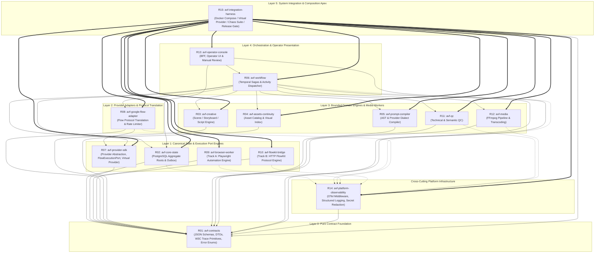

# DOMAIN OWNER FORMAL REVIEW & DIRECTIVES
## Decision Cluster 09: Repository Dependency Architecture & DAG

**CLUSTER ID:** CLUSTER-09  
**DECISION AREA:** Repository Dependency Architecture, 6-Layer Acyclic DAG & Cross-Repository Boundaries  
**DOMAIN OWNER:** R11 — Platform Specialist  
**PROPONENT:** R01 — Domain DDD Specialist  
**CHALLENGER:** R10 — Developer Experience / DX Specialist  
**FINDINGS & GAPS COVERED:** FINDING_010, FINDING_028, FINDING_070, TECH-009, TECH-010, GOV-003  
**RELEVANT CONTRACTS & SPECS:**
- [`01_master/REPOSITORY_STRATEGY.md`](file:///Applications/XAMPP/xamppfiles/htdocs/AGENTIC/AVF_SPEC_REVIEW/AI_VIDEO_FACTORY_BLUEPRINT_KIT_v0.9.0/01_master/REPOSITORY_STRATEGY.md)
- [`01_master/SYSTEM_INVARIANTS.md`](file:///Applications/XAMPP/xamppfiles/htdocs/AGENTIC/AVF_SPEC_REVIEW/AI_VIDEO_FACTORY_BLUEPRINT_KIT_v0.9.0/01_master/SYSTEM_INVARIANTS.md)
- [`04_integration/DEPENDENCY_GRAPH.md`](file:///Applications/XAMPP/xamppfiles/htdocs/AGENTIC/AVF_SPEC_REVIEW/AI_VIDEO_FACTORY_BLUEPRINT_KIT_v0.9.0/04_integration/DEPENDENCY_GRAPH.md)
- [`04_integration/LOCAL_DEVELOPMENT.md`](file:///Applications/XAMPP/xamppfiles/htdocs/AGENTIC/AVF_SPEC_REVIEW/AI_VIDEO_FACTORY_BLUEPRINT_KIT_v0.9.0/04_integration/LOCAL_DEVELOPMENT.md)
- [`04_integration/TEST_STRATEGY.md`](file:///Applications/XAMPP/xamppfiles/htdocs/AGENTIC/AVF_SPEC_REVIEW/AI_VIDEO_FACTORY_BLUEPRINT_KIT_v0.9.0/04_integration/TEST_STRATEGY.md)
- [`04_integration/SECURITY_MODEL.md`](file:///Applications/XAMPP/xamppfiles/htdocs/AGENTIC/AVF_SPEC_REVIEW/AI_VIDEO_FACTORY_BLUEPRINT_KIT_v0.9.0/04_integration/SECURITY_MODEL.md)
- [`02_contracts/API_COMPATIBILITY_POLICY.md`](file:///Applications/XAMPP/xamppfiles/htdocs/AGENTIC/AVF_SPEC_REVIEW/AI_VIDEO_FACTORY_BLUEPRINT_KIT_v0.9.0/02_contracts/API_COMPATIBILITY_POLICY.md)
- [`03_repo_blueprints/R01_CONTRACTS.md`](file:///Applications/XAMPP/xamppfiles/htdocs/AGENTIC/AVF_SPEC_REVIEW/AI_VIDEO_FACTORY_BLUEPRINT_KIT_v0.9.0/03_repo_blueprints/R01_CONTRACTS.md) through [`R15_INTEGRATION_HARNESS.md`](file:///Applications/XAMPP/xamppfiles/htdocs/AGENTIC/AVF_SPEC_REVIEW/AI_VIDEO_FACTORY_BLUEPRINT_KIT_v0.9.0/03_repo_blueprints/R15_INTEGRATION_HARNESS.md)
- [`review-session/FREEZE_REMEDIATION_V1/C02R_GENUINE_RAW/CLUSTER_08_PROPONENT_R01.md`](file:///Applications/XAMPP/xamppfiles/htdocs/AGENTIC/AVF_SPEC_REVIEW/review-session/FREEZE_REMEDIATION_V1/C02R_GENUINE_RAW/CLUSTER_08_PROPONENT_R01.md)
- [`review-session/FREEZE_REMEDIATION_V1/C02R_GENUINE_RAW/CLUSTER_08_CHALLENGER_R10.md`](file:///Applications/XAMPP/xamppfiles/htdocs/AGENTIC/AVF_SPEC_REVIEW/review-session/FREEZE_REMEDIATION_V1/C02R_GENUINE_RAW/CLUSTER_08_CHALLENGER_R10.md)
- [`review-session/FREEZE_REMEDIATION_V1/CHANGE_PROPOSALS/CP-010_REPOSITORY_DEPENDENCY_DAG.md`](file:///Applications/XAMPP/xamppfiles/htdocs/AGENTIC/AVF_SPEC_REVIEW/review-session/FREEZE_REMEDIATION_V1/CHANGE_PROPOSALS/CP-010_REPOSITORY_DEPENDENCY_DAG.md)

---

## 1. Executive Summary & Domain Owner Verdict

### 1.1 Formal Verdict: APPROVED WITH MANDATORY PLATFORM & DX DIRECTIVES (AMENDED)
As the **Platform Specialist (R11)** and designated **Domain Owner for Decision Cluster 09 (Repository Dependency Architecture & DAG)**, I have conducted an exhaustive, technical domain review of the structural proposal defended by R01 (Domain DDD Specialist) and the adversarial cross-examination mounted by R10 (Developer Experience Specialist).

I formally **APPROVE** the revised 6-layer acyclic Directed Acyclic Graph (DAG) spanning all 15 repositories, the absolute encapsulation of PostgreSQL persistence exclusively within `R02 Core State`, and the normative 15x15 Forbidden Dependency Matrix. 

Simultaneously, I uphold and integrate the critical developer experience (DX) and reliability remediations demanded by R10:
1. **Resolution of Polyrepo Tooling Inconsistencies:** Eradicating monorepo-specific path assumptions (`packages/avf-*`) by establishing a concrete **Two-Tier CI Verification Architecture** (per-repo AST boundary linters + global release manifest auditing in `R15`).
2. **Elimination of Distributed CI Deadlocks:** Mandating the **N-1 Schema Backward Compatibility Policy** in `02_contracts/API_COMPATIBILITY_POLICY.md` to ensure producers and consumers can be upgraded independently without peer CI build failures.
3. **Closing the Mock Reality Distortion Gap:** Upgrading `FakeProvider` from a naive 1-second mock to a **Contract-Verified Virtual Provider** in `R07` and `R15`, featuring deterministic chaos injection (rate limits, security challenges, CDP drops, 99% progress freezes) and golden cassette VCR replay capabilities.
4. **Decoupling Trace Primitives from Telemetry Runtimes:** Codifying raw W3C TraceContext primitive strings directly in `R01 Contracts` to eliminate circular dependency traps with `R14 Platform Observability`.

---

## 2. Review Pillar 1: The 6-Layer Acyclic DAG Across All 15 Repositories

### 2.1 Mathematical Acyclicity & Topological Ordering
In an autonomous multi-agent development environment, structural cycles ($R_i \to R_j \to \dots \to R_i$) represent catastrophic architectural failure modes. Cycles cause distributed build deadlocks, make isolated unit testing impossible, and cause LLM context windows to hallucinate cross-boundary implementation details.

The AVF platform architecture partitions all 15 repositories across exactly 6 hierarchical layers ($L_0$ to $L_5$) plus cross-cutting telemetry. The dependency relation $E = (u, v)$ (where component $u$ depends at build or package time on component $v$) is strictly directed downwards:
$$\tau(u) > \tau(v), \quad \text{where } \tau: V \to \{0, 1, 2, 3, 4, 5\}$$



### 2.2 Comprehensive Layer Invariants & Specifications

| Layer | Repositories | Bounded Context & Responsibilities | Permitted Build Dependencies | Mandatory Layer Invariants |
|---|---|---|---|---|
| **Layer 0** | `R01 avf-contracts` | Foundational domain contracts, JSON schemas (`domain-entities`, `provider-request`, `provider-result`, `browser-command`, `event-envelope`), TypeScript interfaces, Python Pydantic DTOs, W3C Trace primitives, and Error Enums. | **Zero** ($out\text{-}degree = 0$) | Must contain zero runtime dependencies. No database drivers, no logging frameworks, no network libraries. `R01` does not import `R14`. |
| **Layer 1** | `R02 avf-core-state`<br/>`R07 avf-provider-sdk`<br/>`R09 avf-browser-worker`<br/>`R10 avf-flowkit-bridge` | Canonical state persistence and low-level port execution engines.<br/>- `R02`: PostgreSQL aggregate persistence, transactional outbox, and optimistic locking.<br/>- `R07`: Abstract provider interfaces, `FlowExecutionPort`, and `VirtualProvider`.<br/>- `R09`: Track A Playwright automation engine.<br/>- `R10`: Track B reverse-engineered HTTP bridge. | `R01`, `R14` (SDK client only) | - `R02` is the sole repository permitted to connect to PostgreSQL.<br/>- Strict lateral isolation: $R09 \not\leftrightarrow R10$. Neither worker may import or reference the other.<br/>- `R09` and `R10` hold ephemeral session state only; neither owns canonical persistence. |
| **Layer 2** | `R08 avf-google-flow-adapter` | Google Flow Provider Adapter: Translates canonical `GenerateVideoCommand` into granular `FlowExecutionPort` operations. | `R01`, `R07`, `R14` | Communicates with `R09` or `R10` at runtime exclusively via abstract `FlowExecutionPort` network endpoints (HTTP/gRPC/IPC); contains zero compile-time dependencies on `R09` or `R10` internal modules. |
| **Layer 3** | `R03 avf-creative`<br/>`R04 avf-assets-continuity`<br/>`R05 avf-prompt-compiler`<br/>`R11 avf-qc`<br/>`R12 avf-media` | Bounded domain engines and stateless media workers.<br/>- `R03`: Storyboard, scene planning, script generation.<br/>- `R04`: Character/environment asset catalog & embeddings.<br/>- `R05`: Provider-agnostic prompt AST compiler.<br/>- `R11`: Technical & semantic QC evaluation.<br/>- `R12`: Video transcoding, probing, stitching via FFmpeg. | `R01`, `R14` (FFmpeg binary for `R12`) | **Strictly Provider-Agnostic:** Layer 3 repos must never depend on `R08`, `R09`, or `R10`. Creative planning, prompt compilation, and QC must remain 100% reusable across future providers (Sora, Runway, Kling). |
| **Layer 4** | `R06 avf-workflow`<br/>`R13 avf-operator-console` | Saga orchestration and operator presentation.<br/>- `R06`: Temporal saga orchestrator coordinating activities across L1–L3.<br/>- `R13`: Operator Console UI & BFF for manual review, override, and timeline monitoring. | `R01`, `R02`, `R03`, `R04`, `R05`, `R07`, `R08`, `R11`, `R12`, `R14` (`R13` depends on `R01`, `R02`, `R06`, `R14`) | - `R06` state is workflow execution history; it mutates canonical state strictly via `R02` API.<br/>- `R13` queries `R02` read models and dispatches commands to `R06`/`R02`; never touches worker private DBs. |
| **Cross-Cutting** | `R14 avf-platform-observability` | OpenTelemetry wrappers, distributed trace context propagation, structured log formatters, and automatic secret redaction filters. | `R01` (primitive schemas only) | Published as lightweight client libraries (`@avf/observability-sdk` / `avf_observability`) imported by L1–L5 runtime services. Telemetry export at runtime is asynchronous non-blocking OTLP over gRPC/HTTP. |
| **Layer 5** | `R15 avf-integration-harness` | System composition apex, Docker Compose topologies, test harness orchestration, contract compatibility suites, and release gate. | **All Repos (`R01`–`R14`)** | Top-level consumer only ($in\text{-}degree = 0$). Never imported by any other repo. Validates system-wide release integrity and executes Phase-0 comparative benchmarks. |

---

## 3. Review Pillar 2: Strict PostgreSQL Database Encapsulation in R02 Core State

The Platform Domain strictly affirms and mandates the **absolute encapsulation of PostgreSQL persistence inside `R02 Core State`**. Direct database access by any component other than `R02` is an unacceptable architectural anti-pattern that violates fundamental system invariants.

```text
+----------------------------------------------------------------------------------------------------+
|                               PLATFORM DATABASE ENCAPSULATION MODEL                                |
+----------------------------------------------------------------------------------------------------+
|  UPSTREAM CALLERS:                                                                                 |
|  [R06 Workflow Orchestrator]      [R13 Operator Console]      [R08 Adapter / Layer 3 Workers]      |
+-----------------+----------------------------+-------------------------------+---------------------+
                  | (gRPC / HTTP Commands)     | (Read API / Operator Overrides)| (Webhook / Event Callbacks)
                  v                            v                               v
+----------------------------------------------------------------------------------------------------+
|                                       R02 CORE STATE SERVICE                                       |
|  +----------------------------------------------------------------------------------------------+  |
|  | Aggregate Root Boundaries: Project / ShotVersion / GenerationJob / Take                      |  |
|  | Domain State Machine Validation (PENDING -> SUBMITTED -> RUNNING -> COMPLETED | FAILED)       |  |
|  | Optimistic Concurrency Engine (Atomic WHERE version = :expected_version)                    |  |
|  | Transactional Outbox Committer (Atomically committed in exact same ACID Tx)                 |  |
|  +----------------------------------------------------------------------------------------------+  |
+---------------------------------------------------+------------------------------------------------+
                                                    | Private Connection Pool (Unix Socket / PgBouncer)
                                                    v
+----------------------------------------------------------------------------------------------------+
|                                        POSTGRESQL DATABASE                                         |
|  - Network Boundary: Bound EXCLUSIVELY to internal Docker network `avf-state-net`                  |
|  - Credential Isolation: `DATABASE_URL` provisioned ONLY to R02 container                          |
|  - Host Port 5432: NEVER exposed to host or external bridge networks                               |
+----------------------------------------------------------------------------------------------------+
```

### 3.1 Failure Modes of Bypassing R02 Database Encapsulation

1. **Dual-Write Hazard & Outbox Event Loss:**
   When `R02` mutates state, it commits the state change and the domain event record (`outbox_events`) in the exact same ACID transaction. If an external service (e.g. `R08 Google Flow Adapter` or `R06 Workflow`) writes directly to SQL tables, the write bypasses outbox generation. Downstream consumers (QC, Media, Console) never receive notification, causing silent pipeline stall.
2. **Optimistic Concurrency Breakdown & Lost Updates:**
   `R02` enforces optimistic locking via monotonically increasing integer `version` columns. Direct SQL writes bypass `version = version + 1` validation, causing race conditions where concurrent lease updates overwrite each other.
3. **Domain Invariant & State Machine Corruption:**
   - **System Invariant 1 (Cardinality):** Direct SQL inserts can create orphaned `Take` records referencing non-existent `GenerationJob` IDs.
   - **System Invariant 16 (Take Immutability):** `R02` rejects any `UPDATE` on a finalized `Take` row. Direct DB updates could silently overwrite completed take checksums and video assets, corrupting immutable audit trails.
   - **System Invariant 5 (Session Isolation):** Ephemeral worker state (Playwright page state, cookie expiration) must never be written to core state.

### 3.2 Platform Security & Network Directives for Database Isolation

- **Directive DB-01 (Zero Host Port Exposure):** In all Docker Compose files and Kubernetes manifests, the PostgreSQL service is attached exclusively to the private internal bridge network `avf-state-net`. Port `5432` must **never** be mapped to `0.0.0.0` or exposed to the host machine.
- **Directive DB-02 (Credential Boundary):** `DATABASE_URL`, `POSTGRES_USER`, and `POSTGRES_PASSWORD` environment variables are injected strictly and exclusively into the `R02 Core State` container. Container configurations attempting to inject DB credentials into `R06`, `R08`, `R09`, `R10`, `R13`, or domain workers will be rejected by CI.
- **Directive DB-03 (Encapsulated Migrations):** Database migration scripts (Alembic / Flyway / Prisma) reside exclusively in `R02 Core State`. No other repository may contain DDL migrations or database connection pooling code.

---

## 4. Evaluation of Challenger (R10) Arguments & Architectural Resolutions

R10 raised four substantial attacks against the operational viability of the candidate architecture. Below is the domain owner's formal evaluation and technical resolution for each:

### 4.1 Attack 1: Polyrepo Version Bump Avalanche & Pre-Release Friction
- **Challenger Position:** A 15-polyrepo setup causes an $O(N)$ cascading PR avalanche during Phase 0/Phase 1 pre-release iteration. Adding a field in `R01` triggers 14 downstream PRs across 6 sequential waves. Furthermore, R01's brief had a fatal tooling contradiction by providing monorepo file paths (`packages/avf-*`) for `dependency-cruiser`.
- **Domain Owner Evaluation:** **Upheld in part.** The release choreography overhead of 15 standalone repositories during rapid pre-release iteration is a genuine risk. However, merging all 15 repositories into a single monorepo was thoroughly evaluated and rejected in ADR-001 because bounded polyrepos provide strict physical blast-radius isolation, enabling parallel AI coding agents to operate without polluting git histories or context windows.
- **Platform Resolution:**
  1. We maintain the **Modular Polyrepo Architecture** as mandated by ADR-001.
  2. We resolve the tooling mismatch by replacing monorepo path assumptions with the **Two-Tier CI Verification Architecture** (Section 5.1).
  3. We mandate standard multi-repo developer workspace tooling in `04_integration/LOCAL_DEVELOPMENT.md`: Docker Compose bind mounting and container-isolated editable package installs (`pip install -e /workspace/avf-contracts` / `pnpm link`), enabling developers and agents to iterate across repos locally with zero symlink breakage.

### 4.2 Attack 2: Two-Sided Contract Coordination Deadlocks
- **Challenger Position:** When contracts evolve across consumer-producer boundaries (e.g. `R08 Google Flow Adapter` calling `R09 Browser Worker` via `FlowExecutionPort`), neither repo can merge its PR first without breaking peer CI tests against the published peer container.
- **Domain Owner Evaluation:** **Upheld.** This is a textbook distributed CI coordination deadlock.
- **Platform Resolution:**
  We formally mandate the **N-1 Schema Backward Compatibility Policy** in `02_contracts/API_COMPATIBILITY_POLICY.md` (Section 5.2).

### 4.3 Attack 3: Circularity Between Contracts (R01) and Observability (R14)
- **Challenger Position:** If `02_contracts/event-envelope.schema.json` defines distributed tracing headers, does `R01` depend on `R14` or does `R14` depend on `R01`?
- **Domain Owner Evaluation:** **Resolved & Validated.**
- **Platform Resolution:**
  1. `R01 Contracts` defines raw W3C TraceContext fields (`trace_id`, `span_id`, `trace_flags`, `trace_state`) as primitive regex-validated strings directly in its JSON schemas:
     ```json
     "trace_id": { "type": "string", "pattern": "^([0-9a-fA-F]{32}|[0-9a-fA-F-]{36})$" },
     "span_id": { "type": "string", "pattern": "^[0-9a-fA-F]{16}$" }
     ```
  2. `R01 Contracts` has **zero runtime dependencies** and does not import `@avf/observability-sdk`.
  3. `R14 Platform Observability` imports `R01 Contracts` to obtain domain context types and correlation IDs.
  4. Runtime services in Layers 1–5 import `@avf/observability-sdk` to automatically extract and inject W3C trace headers into `R01` envelopes. The dependency graph remains strictly acyclic.

### 4.4 Attack 4: Mock Fidelity & The Catastrophic Fragility of `FakeProvider`
- **Challenger Position:** A naive `FakeProvider` returning instant 200 OK or linear 1-second progress increments creates a "mock reality distortion gap," failing to simulate asynchronous freezes at 99%, Turnstile security challenges, MV3 service worker terminations, CDP drops, or multi-megabyte media streaming pressure.
- **Domain Owner Evaluation:** **Fully Upheld.** Systems passing CI against a naive mock will collapse upon staging deployment against live providers.
- **Platform Resolution:**
  `FakeProvider` in `R07` and `R15` is formally upgraded to the **Contract-Verified Virtual Provider Specification** (Section 5.3).

---

## 5. Implementation Mechanisms: CI Architecture, N-1 Policy & Virtual Provider

### 5.1 Two-Tier CI Verification Architecture
To enforce the 6-layer DAG and Forbidden Dependency Matrix across 15 polyrepos without monorepo tooling conflicts, we establish a two-tier verification model:

```text
+----------------------------------------------------------------------------------------------------+
|                                TWO-TIER CI VERIFICATION ARCHITECTURE                               |
+----------------------------------------------------------------------------------------------------+
|  TIER 1: Per-Repository Local CI Linters (Shift-Left on Every PR)                                  |
|  - Executed inside the isolated git repository of each component (e.g. avf-creative).               |
|  - Python repos: `import-linter` enforces local contract boundaries.                               |
|  - TypeScript repos: ESLint `no-restricted-imports` blocks illegal packages.                       |
|  - Validates package manifest (`package.json` / `pyproject.toml`) against Permitted Dependencies.  |
+---------------------------------------------------+------------------------------------------------+
                                                    | PASSED & MERGED
                                                    v
+----------------------------------------------------------------------------------------------------+
|  TIER 2: Global System Composition & Release Auditor in R15 (Release Gate)                         |
|  - Inspects the assembled `RELEASE_MANIFEST.yaml` and resolved container image dependency trees.   |
|  - Validates full 15-repo acyclicity, SemVer range pinning, and container network isolation.       |
|  - Executes cross-repository consumer-driven contract suites against the Virtual Provider.        |
+----------------------------------------------------------------------------------------------------+
```

#### Tier 1 Example: Per-Repository `import-linter` Configuration for `R03 avf-creative` (`.importlinter`)
```ini
[importlinter]
root_package = avf_creative

[importlinter:contract:1]
name = Forbidden Database Driver Access
type = forbidden
source_modules = avf_creative
forbidden_modules =
    psycopg2
    asyncpg
    sqlalchemy
    prisma
    avf_core_state

[importlinter:contract:2]
name = Forbidden Provider Adapter Coupling
type = forbidden
source_modules = avf_creative
forbidden_modules =
    avf_google_flow_adapter
    avf_browser_worker
    avf_flowkit_bridge
```

### 5.2 N-1 Schema Backward Compatibility Policy
To prevent two-sided contract deadlocks during independent repository deployments:

1. **Consumer Forward-Tolerance (N-1 Invariant):** Every inter-service API and message consumer (e.g. `FlowExecutionPort` in `R09`/`R10`, command handlers in `R02`) **MUST** accept both schema version $N$ (current) and version $N-1$ (previous) simultaneously.
2. **Two-Phase Additive Evolution:**
   - **Phase 1 (Additive Expansion):** New fields introduced in `R01` must be optional (`required: false` with sensible defaults). The producer (`R08`) is upgraded to emit the new field; the consumer (`R09`) accepts both old and new formats.
   - **Phase 2 (Deprecation & Enforcement):** After all consumers are confirmed running version $N$, the old field is marked deprecated and eventually removed in a subsequent major version bump.
3. **Safe Merge Order:** Pull requests in consumer and producer repositories can be merged and tagged in arbitrary order without causing peer CI pipeline failures.

### 5.3 Upgraded Contract-Verified Virtual Provider in R07 & R15
The `FakeProvider` is officially upgraded to the **Virtual Provider Specification**, embedding high-fidelity simulation and chaos injection:

```typescript
export interface VirtualProviderConfig {
  scenario: "SUCCESS_INSTANT" | "SUCCESS_ASYNC" | "CHAOS_FAULT_INJECTION" | "GOLDEN_CASSETTE_REPLAY";
  asyncDelayMs?: number;
  chaosOptions?: {
    rateLimitAfterCalls?: number;         // Injects HTTP 429 Rate Limit with Retry-After header
    injectSecurityChallenge?: boolean;     // Simulates Cloudflare Turnstile interstitial
    dropCdpConnectionAtStep?: string;      // Simulates Chrome MV3 worker termination / CDP drop
    pollingStallSecs?: number;             // Stalls progress at 99% to test lease extension
    corruptMediaOutput?: boolean;          // Generates corrupt bitstream to exercise QC rejection
  };
  cassettePath?: string;                  // Path to recorded VCR session cassette
}
```

1. **Deterministic Fault Injection:** Automated tests can trigger exact failure scenarios via environment variables (`CHAOS_RATE_LIMIT=true`, `CHAOS_SECURITY_CHALLENGE=true`, `CHAOS_POLLING_STALL_SECS=45`) to verify Temporal saga retries, lease heartbeats, and operator challenge escalation in `R06` and `R13`.
2. **Golden Cassette VCR Replay:** `R15` includes a cassette recorder/replayer that captures live Google Flow HTTP/CDP traffic, scrubs auth tokens, and replays exact network interactions deterministically in offline CI.
3. **Synthetic High-Bitrate Video Generator:** Generates valid multi-megabyte H.264/MP4 video streams (with SMPTE colorbars, frame counters, and audio tones) to exercise chunked S3 uploads, FFmpeg probing in `R12 Media`, and frame-level anomaly detection in `R11 QC`.

---

## 6. The Normative 15x15 Forbidden Dependency Matrix

The following matrix is the **authoritative, normative specification** of permitted and forbidden compile-time/package dependencies across all 15 repositories. This matrix must be rendered into `04_integration/DEPENDENCY_GRAPH.md` and enforced by CI.

| Source Repo $\downarrow$ \ Target Repo $\to$ | R01 | R02 | R03 | R04 | R05 | R06 | R07 | R08 | R09 | R10 | R11 | R12 | R13 | R14 | R15 |
|---|---|---|---|---|---|---|---|---|---|---|---|---|---|---|---|
| **R01 Contracts** | — | ❌ | ❌ | ❌ | ❌ | ❌ | ❌ | ❌ | ❌ | ❌ | ❌ | ❌ | ❌ | ❌ | ❌ |
| **R02 Core State** | ✅ | — | ❌ | ❌ | ❌ | ❌ | ❌ | ❌ | ❌ | ❌ | ❌ | ❌ | ❌ | 🔄 | ❌ |
| **R03 Creative** | ✅ | ❌ | — | ❌ | ❌ | ❌ | ❌ | ❌ | ❌ | ❌ | ❌ | ❌ | ❌ | 🔄 | ❌ |
| **R04 Assets/Continuity** | ✅ | ❌ | ❌ | — | ❌ | ❌ | ❌ | ❌ | ❌ | ❌ | ❌ | ❌ | ❌ | 🔄 | ❌ |
| **R05 Prompt Compiler** | ✅ | ❌ | ❌ | ❌ | — | ❌ | ❌ | ❌ | ❌ | ❌ | ❌ | ❌ | ❌ | 🔄 | ❌ |
| **R06 Workflow** | ✅ | ✅ | ✅ | ✅ | ✅ | — | ✅ | ✅ | ❌ | ❌ | ✅ | ✅ | ❌ | 🔄 | ❌ |
| **R07 Provider SDK** | ✅ | ❌ | ❌ | ❌ | ❌ | ❌ | — | ❌ | ❌ | ❌ | ❌ | ❌ | ❌ | 🔄 | ❌ |
| **R08 Google Flow Adapter**| ✅ | ❌ | ❌ | ❌ | ❌ | ❌ | ✅ | — | ⚡ | ⚡ | ❌ | ❌ | ❌ | 🔄 | ❌ |
| **R09 Browser Worker** | ✅ | ❌ | ❌ | ❌ | ❌ | ❌ | ❌ | ❌ | — | ❌ | ❌ | ❌ | ❌ | 🔄 | ❌ |
| **R10 FlowKit Bridge** | ✅ | ❌ | ❌ | ❌ | ❌ | ❌ | ❌ | ❌ | ❌ | — | ❌ | ❌ | ❌ | 🔄 | ❌ |
| **R11 QC Engine** | ✅ | ❌ | ❌ | ❌ | ❌ | ❌ | ❌ | ❌ | ❌ | ❌ | — | ❌ | ❌ | 🔄 | ❌ |
| **R12 Media** | ✅ | ❌ | ❌ | ❌ | ❌ | ❌ | ❌ | ❌ | ❌ | ❌ | ❌ | — | ❌ | 🔄 | ❌ |
| **R13 Operator Console** | ✅ | ✅ | ❌ | ❌ | ❌ | ✅ | ❌ | ❌ | ❌ | ❌ | ❌ | ❌ | — | 🔄 | ❌ |
| **R14 Observability SDK** | ✅ | ❌ | ❌ | ❌ | ❌ | ❌ | ❌ | ❌ | ❌ | ❌ | ❌ | ❌ | ❌ | — | ❌ |
| **R15 Integration Harness**| ✅ | ✅ | ✅ | ✅ | ✅ | ✅ | ✅ | ✅ | ✅ | ✅ | ✅ | ✅ | ✅ | ✅ | — |

**Legend:**
- ✅ **Permitted Direct Build/Package Dependency:** Source repository may declare dependency on target package.
- ❌ **Strictly Prohibited Dependency:** CI pipeline must reject any pull request containing this dependency.
- 🔄 **Cross-Cutting Telemetry Import:** Permitted to import the `@avf/observability-sdk` client library.
- ⚡ **Runtime Port Binding Only:** `R08` interacts with `R09`/`R10` exclusively via abstract `FlowExecutionPort` network endpoints; zero compile-time or package dependencies permitted.

---

## 7. Actionable Spec Remediation Checklist

To prepare for C03R / C04R synthesis and formal spec freeze, the following actionable blueprint updates are **mandated**:

| Action Item ID | Target Specification File | Required Normative Modification |
|---|---|---|
| **ACT-DAG-01** | [`04_integration/DEPENDENCY_GRAPH.md`](file:///Applications/XAMPP/xamppfiles/htdocs/AGENTIC/AVF_SPEC_REVIEW/AI_VIDEO_FACTORY_BLUEPRINT_KIT_v0.9.0/04_integration/DEPENDENCY_GRAPH.md) | Replace existing partial graph with the complete 6-layer DAG Mermaid diagram, formal layer definitions ($L_0$ to $L_5$), and the normative 15x15 Forbidden Dependency Matrix. |
| **ACT-DAG-02** | [`01_master/REPOSITORY_STRATEGY.md`](file:///Applications/XAMPP/xamppfiles/htdocs/AGENTIC/AVF_SPEC_REVIEW/AI_VIDEO_FACTORY_BLUEPRINT_KIT_v0.9.0/01_master/REPOSITORY_STRATEGY.md) | Formally document the 6-layer hierarchy, polyrepo packaging rules, SemVer dependency range requirements, and strict prohibition on production git branch dependencies. |
| **ACT-DAG-03** | [`03_repo_blueprints/R01_CONTRACTS.md`](file:///Applications/XAMPP/xamppfiles/htdocs/AGENTIC/AVF_SPEC_REVIEW/AI_VIDEO_FACTORY_BLUEPRINT_KIT_v0.9.0/03_repo_blueprints/R01_CONTRACTS.md) through [`R15_INTEGRATION_HARNESS.md`](file:///Applications/XAMPP/xamppfiles/htdocs/AGENTIC/AVF_SPEC_REVIEW/AI_VIDEO_FACTORY_BLUEPRINT_KIT_v0.9.0/03_repo_blueprints/R15_INTEGRATION_HARNESS.md) | Audit and update the `DEPENDENCIES`, `DOES NOT OWN`, and `DONE WHEN` sections of all 15 blueprints to align 100% with the master matrix. |
| **ACT-DAG-04** | [`02_contracts/API_COMPATIBILITY_POLICY.md`](file:///Applications/XAMPP/xamppfiles/htdocs/AGENTIC/AVF_SPEC_REVIEW/AI_VIDEO_FACTORY_BLUEPRINT_KIT_v0.9.0/02_contracts/API_COMPATIBILITY_POLICY.md) | Codify the N-1 schema backward compatibility policy and two-phase additive transition rules for all inter-service boundaries. |
| **ACT-DAG-05** | [`03_repo_blueprints/R07_PROVIDER_SDK.md`](file:///Applications/XAMPP/xamppfiles/htdocs/AGENTIC/AVF_SPEC_REVIEW/AI_VIDEO_FACTORY_BLUEPRINT_KIT_v0.9.0/03_repo_blueprints/R07_PROVIDER_SDK.md) & [`R15_INTEGRATION_HARNESS.md`](file:///Applications/XAMPP/xamppfiles/htdocs/AGENTIC/AVF_SPEC_REVIEW/AI_VIDEO_FACTORY_BLUEPRINT_KIT_v0.9.0/03_repo_blueprints/R15_INTEGRATION_HARNESS.md) | Upgrade `FakeVideoProvider` to the **Virtual Provider Specification** with chaos injection flags (`CHAOS_RATE_LIMIT`, `CHAOS_SECURITY_CHALLENGE`, `CHAOS_CDP_DISCONNECT`, `CHAOS_POLLING_STALL_MS`) and golden cassette replay. |
| **ACT-DAG-06** | [`04_integration/LOCAL_DEVELOPMENT.md`](file:///Applications/XAMPP/xamppfiles/htdocs/AGENTIC/AVF_SPEC_REVIEW/AI_VIDEO_FACTORY_BLUEPRINT_KIT_v0.9.0/04_integration/LOCAL_DEVELOPMENT.md) | Document multi-repo developer workspace workflows, Docker Compose volume mounting, and container-isolated editable package linking. |
| **ACT-DAG-07** | [`04_integration/SECURITY_MODEL.md`](file:///Applications/XAMPP/xamppfiles/htdocs/AGENTIC/AVF_SPEC_REVIEW/AI_VIDEO_FACTORY_BLUEPRINT_KIT_v0.9.0/04_integration/SECURITY_MODEL.md) | Formally document PostgreSQL network isolation (`avf-state-net`), zero host-port exposure, and exclusive credential injection in `R02`. |

---

## 8. Formal Sign-Off & Disposition

| Role | Specialist Name | Position | Disposition |
|---|---|---|---|
| **Domain Owner (Platform)** | **R11** | Platform Specialist | **APPROVED WITH MANDATES (CP-010 RATIFIED)** |
| **Proponent** | **R01** | Domain DDD Specialist | **CONCURS WITH DX REMEDIATIONS** |
| **Challenger** | **R10** | Developer Experience Specialist | **SATISFIED (REMEDIATION DEMANDS ADOPTED)** |

**FINAL DISPOSITION:** **CONFIRMED & RATIFIED FOR SPEC FREEZE**  
**CHANGE PROPOSAL:** **CP-010 (AMENDED)**

---
*Signed by R11 Platform Specialist — Domain Owner for Decision Cluster 09*  
*AI Video Factory Architecture Council — C02R Genuine Adversarial Cross-Examination*
