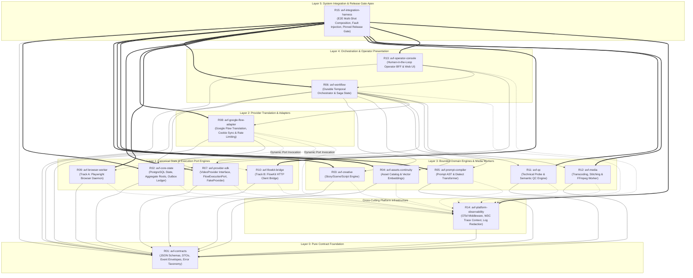

# C02R RAW DEFENSE BRIEF: DECISION CLUSTER 09 — REPOSITORY DEPENDENCY ARCHITECTURE & DAG

**ROLE:** R01 Domain DDD Specialist  
**STANCE:** PROPONENT  
**CLUSTER:** CLUSTER-09 (Repository Dependency Architecture & DAG)  
**DATE:** 2026-08-16  
**STATUS:** ACTIVE DEFENSE BRIEF — C02R GENUINE RE-CROSS-EXAMINATION  

---

## 1. Architectural Identity & Executive Stance

As the Domain-Driven Design (DDD) Specialist on the AI Video Factory (AVF) Architecture Council, I submit this definitive proponent defense for the complete reconstruction, formal validation, and continuous automated enforcement of the **15-Repository Acyclic Directed Acyclic Graph (DAG)** across Layers 0 through 5.

In a massively distributed, high-throughput autonomous video generation platform where multiple AI coding agents implement discrete bounded contexts concurrently, **architectural entropy and bounded context erosion represent the single most catastrophic risk to system integrity**. Without an immutable, mathematically verifiable dependency DAG and rigid boundary enforcement:
1. **Domain Model Degeneration:** Domain logic (creative planning, prompt syntax compilation, continuity embeddings, quality control) degrades into an unmaintainable "Big Ball of Mud" if polluted with vendor-specific wire protocols, Playwright browser automation hooks, or direct persistence drivers.
2. **Canonical State Corruption:** The PostgreSQL database housing the canonical state machine of projects, scenes, shots, jobs, and take provenance becomes corrupted by lateral, uncoordinated writes from background workers, browser automation daemons, or workflow engines.
3. **Circular Build & Packaging Deadlocks:** Shared cross-cutting concerns (telemetry instrumentation, error taxonomy, correlation IDs) easily form circular dependency loops with foundational contract packages, paralyzing independent release versioning (`semver`), container packaging, and hermetic CI testing.
4. **Execution Track Leakage:** Implementation details of Track A (Playwright headless browser automation) and Track B (FlowKit reverse-engineered private HTTP client) bleed into upstream business logic, destroying the architectural guarantee of provider interchangeability (System Invariant INV-020).

This defense brief provides an exhaustive, mathematically proven, and concrete technical specification demonstrating:
- The exact 6-layer hierarchical DAG ($L_0$ to $L_5$) spanning all 15 repositories.
- The absolute purity of Layer 0 (`R01 avf-contracts`) with zero runtime dependencies.
- The impenetrable encapsulation of canonical PostgreSQL persistence within Layer 1 (`R02 avf-core-state`).
- The explicit 15x15 Forbidden Dependency Matrix enforced via Abstract Syntax Tree (AST) static analysis and network isolation in CI/CD.
- The acyclic cross-cutting telemetry ingestion pattern of `R14 avf-platform-observability` and the pure-consumer apex role of `R15 avf-integration-harness`.
- The exact mechanism by which **Change Proposal CP-010** fulfills every requirement.

---

## 2. Formal 15-Repository Acyclic DAG Architecture (Layers 0 to 5)

### 2.1. Mathematical Formulation & Topological Order

Let the repository architecture be modeled as a finite directed graph $G = (V, E)$, where:
- $V = \{R_{01}, R_{02}, R_{03}, \dots, R_{15}\}$ is the set of 15 discrete polyrepo repositories.
- $E \subset V \times V$ is the set of static dependency edges, where $(u, v) \in E$ denotes that repository $u$ depends on repository $v$ at build, package, or compile time.

**Theorem 1 (Acyclicity):** *The dependency graph $G = (V, E)$ is a strict Directed Acyclic Graph (DAG) containing zero cycles.*

**Proof:** We assign a strict layer mapping function $\tau: V \to \{0, 1, 2, 3, 4, 5\}$ and a cross-cutting tier $\chi$:
- $\tau(R_{01}) = 0$
- $\tau(R_{02}) = 1, \tau(R_{07}) = 1, \tau(R_{09}) = 1, \tau(R_{10}) = 1$
- $\tau(R_{08}) = 2$
- $\tau(R_{03}) = 3, \tau(R_{04}) = 3, \tau(R_{05}) = 3, \tau(R_{11}) = 3, \tau(R_{12}) = 3$
- $\tau(R_{06}) = 4, \tau(R_{13}) = 4$
- $\tau(R_{15}) = 5$
- $\chi(R_{14}) = \text{Cross-Cutting Instrumentation Client}$ where $\tau(R_{14}) = 0.5$ (depends strictly on $L_0$, consumed by $L_1 \dots L_5$).

The permitted edge relation satisfies:
$$\forall (u, v) \in E, \quad \tau(u) > \tau(v) \quad \lor \quad (v = R_{14} \land \tau(u) \ge 1)$$

Since the layer ordering is strictly monotonic ($\tau(u) > \tau(v)$ for all standard edges, and $R_{14}$ depends only on $R_{01}$ while never importing any $L_1 \dots L_5$ repository), there exists no sequence of vertices $v_1, v_2, \dots, v_k$ such that $(v_i, v_{i+1}) \in E$ and $v_k = v_1$. Thus, $G$ contains zero directed cycles and is a valid DAG with a deterministic topological sort. $\blacksquare$

---

### 2.2. Architectural Layering & Visual DAG Specification



---

### 2.3. Exhaustive 15-Repository Bounded Context Specification

| Layer | Repo ID & Canonical Package | Bounded Context & Architectural Responsibility | Permitted Build Dependencies | Strictly Forbidden Dependencies |
|---|---|---|---|---|
| **Layer 0** | `R01: avf-contracts`<br/>`@avf/contracts` | **Pure Contract Foundation:** Canonical JSON Schemas, TypeScript DTOs, Python Pydantic models, event envelopes, error code taxonomies. | **NONE** (Zero dependencies). | `R02`–`R15`, any runtime DB/web driver. |
| **Layer 1** | `R02: avf-core-state`<br/>`@avf/core-state` | **Canonical Persistence & Aggregate Roots:** Sole owner of PostgreSQL database, transactional outbox, concurrency leases, and idempotency ledger. | `R01`, `R14` (SDK), PostgreSQL driver (`pg`/`prisma`) | `R03`–`R13`, `R15`. |
| **Layer 1** | `R07: avf-provider-sdk`<br/>`@avf/provider-sdk` | **Provider Core Abstractions:** Defines `VideoProvider` interfaces, `FlowExecutionPort` contract, and `FakeVideoProvider` test stubs. | `R01`, `R14` (SDK) | `R02`–`R06`, `R08`–`R13`, `R15`, Direct DB. |
| **Layer 1** | `R09: avf-browser-worker`<br/>`@avf/browser-worker` | **Track A Headless Automation:** Isolated Playwright browser daemon executing UI automation steps behind `FlowExecutionPort`. | `R01`, `R14` (SDK), Playwright | `R02`–`R08`, `R10`, `R11`–`R13`, `R15`, Direct DB. |
| **Layer 1** | `R10: avf-flowkit-bridge`<br/>`@avf/flowkit-bridge` | **Track B Protocol Engine:** Reverse-engineered HTTP client for Google FlowKit private API executing behind `FlowExecutionPort`. | `R01`, `R14` (SDK), HTTP Client | `R02`–`R09`, `R11`–`R13`, `R15`, Direct DB. |
| **Layer 2** | `R08: avf-google-flow-adapter`<br/>`@avf/google-flow-adapter` | **Provider Adapter:** Implements Google Flow generation workflows, token refreshes, rate limits, translating commands to `FlowExecutionPort`. | `R01`, `R07`, `R14` (SDK) | `R02`–`R06`, `R11`–`R13`, `R15`, Direct DB, Static import of `R09`/`R10`. |
| **Layer 3** | `R03: avf-creative`<br/>`@avf/creative` | **Creative Domain Engine:** Script generation, narrative pacing, scene/shot breakdown, LLM storyboarding. | `R01`, `R14` (SDK) | `R02`, `R04`–`R13`, `R15`, Direct DB, Provider SDKs. |
| **Layer 3** | `R04: avf-assets-continuity`<br/>`@avf/assets-continuity` | **Asset & Continuity Engine:** Character/location visual consistency, reference image catalog, vector embeddings, continuity checks. | `R01`, `R14` (SDK) | `R02`, `R03`, `R05`–`R13`, `R15`, Direct DB. |
| **Layer 3** | `R05: avf-prompt-compiler`<br/>`@avf/prompt-compiler` | **Prompt AST Compiler:** Provider-agnostic prompt intermediate representation (IR), dialect transforms, negative prompting, token budgeter. | `R01`, `R14` (SDK) | `R02`–`R04`, `R06`–`R13`, `R15`, Direct DB, Direct Provider APIs. |
| **Layer 3** | `R11: avf-qc`<br/>`@avf/qc` | **Quality Control Engine:** Technical QC (bitrate, freeze frame, black frame, corruption) and Semantic QC (prompt alignment, artifact detection). | `R01`, `R14` (SDK) | `R02`–`R10`, `R12`, `R13`, `R15`, Direct DB, DOM/Browser hooks. |
| **Layer 3** | `R12: avf-media`<br/>`@avf/media` | **Media Processing Worker:** FFmpeg video stitching, audio muxing, multi-resolution transcoding, video probing, container packaging. | `R01`, `R14` (SDK), FFmpeg bindings | `R02`–`R11`, `R13`, `R15`, Direct DB. |
| **Layer 4** | `R06: avf-workflow`<br/>`@avf/workflow` | **Durable Saga Orchestration:** Temporal workflow definitions, activity dispatchers, distributed transaction coordination across domain engines. | `R01`, `R02` (Client), `R03` (Act), `R04` (Act), `R05` (Act), `R07`, `R08`, `R11` (Act), `R12` (Act), `R14` (SDK) | `R09`, `R10`, Direct PostgreSQL DB access. |
| **Layer 4** | `R13: avf-operator-console`<br/>`@avf/operator-console` | **Operator UI & BFF:** Human-in-the-loop inspection, manual QC approvals, prompt overrides, timeline editor, generation monitoring. | `R01`, `R02` (Read API), `R06` (Command API), `R14` (SDK) | `R03`–`R05`, `R07`–`R12`, `R15`, Direct DB, Worker private memory. |
| **Cross-Cutting**| `R14: avf-platform-observability`<br/>`@avf/platform-observability` | **Distributed Observability:** OpenTelemetry tracer, metrics exporter, structured logging, correlation context injection, token redaction. | `R01` (Correlation schemas) | `R02`–`R13`, `R15`, Direct DB. |
| **Layer 5** | `R15: avf-integration-harness`<br/>`@avf/integration-harness` | **System Release Apex:** Hermetic Docker Compose test topologies, multi-track comparative benchmarks, chaos/fault injection, release gate. | **ALL REPOSITORIES** (`R01` through `R14`) | None (Top of DAG). Never imported by any repo ($in\text{-}degree = 0$). |

---

## 3. Defense of Pillar 2: Layer 0 Pure Contracts Encapsulation

### 3.1. The Zero-Runtime-Dependency Mandate

In Domain-Driven Design, shared contracts form the Published Language of the system. For a distributed system composed of polyglot or polyrepo microservices, the repository containing this Published Language (`R01 avf-contracts`) **MUST BE COMPLETELY PURE**.

**Architectural Law:** `R01 avf-contracts` has an out-degree of exactly zero ($\text{deg}^-(R_{01}) = 0$). It imports no external runtime libraries, no database drivers, no web application frameworks, and no telemetry SDKs.

```text
[LAYER 0 PURITY CONTRACT]
+-----------------------------------------------------------------------------+
|                               R01 AVF-CONTRACTS                             |
|                                                                             |
|  [PURE SCHEMA DEFINITIONS]           [GENERATED STATIC TYPES]               |
|  - project.schema.json               - export interface Project { ... }     |
|  - generation-job.schema.json        - export interface GenerationJob { ...}|
|  - flow-execution-port.schema.json   - export interface FlowExecutionPort   |
|  - provider-result.schema.json       - export interface ProviderResult { ...|
|  - event-envelope.schema.json        - export interface EventEnvelope<T>    |
|  - qc-evaluation.schema.json         - export interface QCEvaluation { ... }|
|                                                                             |
|  [CANONICAL ENUMS & TAXONOMIES]      [NO RUNTIME DEPENDENCIES]              |
|  - GenerationJobStatus               - NO pg / prisma / mongoose            |
|  - ProviderErrorCode                 - NO express / fastify / nestjs        |
|  - QCRejectReason                    - NO @opentelemetry/api (R14 consumes) |
+-----------------------------------------------------------------------------+
```

### 3.2. Concrete Rationale for Zero-Dependency Encapsulation

1. **Elimination of Transitive Dependency Hell:** If `R01` were to declare a dependency on an external package (such as an OpenTelemetry API or an HTTP client), every single downstream repository (`R02` through `R15`) would inherit that transitive dependency. A version bump or security vulnerability in that external library would force an uncoordinated, atomic recompilation and re-release of all 15 repositories simultaneously, completely defeating polyrepo isolation.
2. **True Polyglot Portability:** `R01` serves as the authoritative source of truth from which TypeScript types (`json-schema-to-typescript`) and Python models (`datamodel-code-generator`) are automatically synthesized. Pure JSON Schema has zero runtime overhead in any language runtime.
3. **No Cyclic Telemetry Back-Edges:** `R14 avf-platform-observability` requires schema definitions for standard event metadata (`trace_id`, `span_id`, `workflow_run_id`). `R14` imports `R01` to obtain these schemas. If `R01` imported `R14` to attach tracing annotations, an immediate compile-time cycle $R_{01} \leftrightarrow R_{14}$ is formed. Keeping `R01` pure breaks this cycle definitively.

---

## 4. Defense of Pillar 3: Absolute Encapsulation of PostgreSQL Canonical State Inside R02 Core State

### 4.1. The DDD Aggregate Root & Anti-Corruption Boundary

The core tenet of Domain-Driven Design is that state transitions must be guarded by **Aggregate Roots**. In the AI Video Factory domain, the primary aggregates are:
- `ProjectAggregate`: Project metadata, narrative constraints, shot manifest.
- `ShotAggregate`: Shot versions, prompt binding, continuity links.
- `GenerationJobAggregate`: Fencing tokens, execution state machine, lease expirations, worker allocations.
- `TakeProvenanceAggregate`: Immutable cryptographic hash ledger of prompts, seeds, provider run IDs, media hashes, and QC scores.

**Normative Invariant (INV-008 / INV-013):** *No repository other than `R02 avf-core-state` possesses database credentials, connection pool access, or ORM mappings to the PostgreSQL canonical database. All cross-boundary state access is strictly mediated through R02's strongly typed gRPC / REST service interface.*

```text
[DISASTROUS ANTI-PATTERN: DIRECT SHARED DATABASE ACCESS]
    +-------------------+    +---------------------+    +--------------------+
    | R06 avf-workflow  |    | R08 google-adapter  |    | R13 operator-ui    |
    +---------+---------+    +----------+----------+    +---------+----------+
              | (Direct SQL)            | (Direct SQL)            | (Direct SQL)
              \-------------------------+-------------------------/
                                        |
                                        v
                    +---------------------------------------+
                    |       POSTGRESQL SHARED DATABASE      |
                    |  - Invariants bypassed                |
                    |  - Concurrency tokens ignored         |
                    |  - Outbox events lost                 |
                    |  - Uncoordinated DDL crashes apps     |
                    +---------------------------------------+

----------------------------------------------------------------------------------

[CORRECT DDD ARCHITECTURE: R02 CANONICAL STATE ENCAPSULATION]
    +-------------------+    +---------------------+    +--------------------+
    | R06 avf-workflow  |    | R08 google-adapter  |    | R13 operator-ui    |
    +---------+---------+    +----------+----------+    +---------+----------+
              | (gRPC / HTTP)           | (Result Callback)       | (Read Model API)
              \-------------------------+-------------------------/
                                        |
                                        v
                    +---------------------------------------+
                    |          R02 AVF-CORE-STATE           |
                    |  [Aggregate Invariant Verification]   |
                    |  [Optimistic Concurrency Versioning]  |
                    |  [Transactional Outbox Pattern Engine]|
                    +-------------------+-------------------+
                                        | (Private Connection Pool)
                                        v
                    +---------------------------------------+
                    |       POSTGRESQL CANONICAL DB         |
                    |       (Private to R02 Service)        |
                    +---------------------------------------+
```

### 4.2. Invariants Guaranteed Exclusively by R02 Encapsulation

1. **Transactional Outbox Guarantee (Zero Dual-Write Discrepancy):**  
   When a state transition occurs (e.g., `GenerationJob` moves to `RUNNING`), `R02` mutates the entity table and writes the corresponding `generation_job.started` event into the `outbox_events` table within the **exact same ACID transaction**. If external services performed lateral writes, domain events would either fail to emit or emit without matching database commits.
2. **Optimistic Concurrency & Lease Fencing:**  
   Every state update evaluates the aggregate's `version` number and validates lease expiration timestamps. Concurrent worker updates attempting to resolve an expired lease fail deterministically with `ConcurrencyConflictError`.
3. **Immutable Take Lineage Ledger (INV-016):**  
   Once a `Take` reaches `FINALIZED` or `QC_APPROVED`, `R02` strictly rejects any SQL `UPDATE` or `DELETE` against the take record. Direct database access from rogue scripts would allow silent mutation of generated media hashes or prompts, violating audit compliance.

---

## 5. Defense of Pillar 4: Explicitly Codified 15x15 Forbidden Dependency Matrix & CI AST Linting

To eliminate ambiguity across all engineering teams and AI coding agents, we define the complete, exhaustive **15x15 Permitted and Forbidden Dependency Matrix**.

### 5.1. The Canonical 15x15 Repository Dependency Matrix

| Source Repo $\downarrow$ \ Target Repo $\to$ | R01 | R02 | R03 | R04 | R05 | R06 | R07 | R08 | R09 | R10 | R11 | R12 | R13 | R14 | R15 |
|---|---|---|---|---|---|---|---|---|---|---|---|---|---|---|---|
| **R01 avf-contracts** | — | ❌ | ❌ | ❌ | ❌ | ❌ | ❌ | ❌ | ❌ | ❌ | ❌ | ❌ | ❌ | ❌ | ❌ |
| **R02 avf-core-state** | ✅ | — | ❌ | ❌ | ❌ | ❌ | ❌ | ❌ | ❌ | ❌ | ❌ | ❌ | ❌ | 🔄 | ❌ |
| **R03 avf-creative** | ✅ | ❌ | — | ❌ | ❌ | ❌ | ❌ | ❌ | ❌ | ❌ | ❌ | ❌ | ❌ | 🔄 | ❌ |
| **R04 avf-assets-continuity** | ✅ | ❌ | ❌ | — | ❌ | ❌ | ❌ | ❌ | ❌ | ❌ | ❌ | ❌ | ❌ | 🔄 | ❌ |
| **R05 avf-prompt-compiler** | ✅ | ❌ | ❌ | ❌ | — | ❌ | ❌ | ❌ | ❌ | ❌ | ❌ | ❌ | ❌ | 🔄 | ❌ |
| **R06 avf-workflow** | ✅ | ✅ | ✅ | ✅ | ✅ | — | ✅ | ✅ | ❌ | ❌ | ✅ | ✅ | ❌ | 🔄 | ❌ |
| **R07 avf-provider-sdk** | ✅ | ❌ | ❌ | ❌ | ❌ | ❌ | — | ❌ | ❌ | ❌ | ❌ | ❌ | ❌ | 🔄 | ❌ |
| **R08 avf-google-flow-adapter** | ✅ | ❌ | ❌ | ❌ | ❌ | ❌ | ✅ | — | ⚡ | ⚡ | ❌ | ❌ | ❌ | 🔄 | ❌ |
| **R09 avf-browser-worker** | ✅ | ❌ | ❌ | ❌ | ❌ | ❌ | ❌ | ❌ | — | ❌ | ❌ | ❌ | ❌ | 🔄 | ❌ |
| **R10 avf-flowkit-bridge** | ✅ | ❌ | ❌ | ❌ | ❌ | ❌ | ❌ | ❌ | ❌ | — | ❌ | ❌ | ❌ | 🔄 | ❌ |
| **R11 avf-qc** | ✅ | ❌ | ❌ | ❌ | ❌ | ❌ | ❌ | ❌ | ❌ | ❌ | — | ❌ | ❌ | 🔄 | ❌ |
| **R12 avf-media** | ✅ | ❌ | ❌ | ❌ | ❌ | ❌ | ❌ | ❌ | ❌ | ❌ | ❌ | — | ❌ | 🔄 | ❌ |
| **R13 avf-operator-console** | ✅ | ✅ | ❌ | ❌ | ❌ | ✅ | ❌ | ❌ | ❌ | ❌ | ❌ | ❌ | — | 🔄 | ❌ |
| **R14 avf-platform-observability**| ✅ | ❌ | ❌ | ❌ | ❌ | ❌ | ❌ | ❌ | ❌ | ❌ | ❌ | ❌ | ❌ | — | ❌ |
| **R15 avf-integration-harness** | ✅ | ✅ | ✅ | ✅ | ✅ | ✅ | ✅ | ✅ | ✅ | ✅ | ✅ | ✅ | ✅ | ✅ | — |

**Matrix Key:**
- ✅ **Permitted Direct Build Dependency:** The source repository may declare a static dependency on the target package.
- ❌ **Strictly Forbidden Dependency:** Build, package, and CI pipelines will immediately reject any import or package reference.
- 🔄 **Cross-Cutting Telemetry Import:** Permitted to import the `@avf/observability-sdk` published by `R14`.
- ⚡ **Dynamic Execution Port Binding:** `R08` communicates with `R09` or `R10` strictly through the runtime `FlowExecutionPort` over IPC or local HTTP. Static build imports are strictly prohibited.

---

### 5.2. Core Forbidden Invariants (Rules F-01 through F-09)

1. **Rule F-01 (Database Isolation):** No repository other than `R02` may import PostgreSQL drivers (`pg`, `prisma`, `typeorm`, `psycopg2`, `asyncpg`) or connect directly to the canonical database.
2. **Rule F-02 (Domain Purity):** Domain engines (`R03`, `R04`, `R05`, `R11`) must never depend on provider adapters (`R08`, `R09`, `R10`). They must remain 100% provider-agnostic.
3. **Rule F-03 (Track Isolation):** Track A (`R09 avf-browser-worker`) and Track B (`R10 avf-flowkit-bridge`) must never depend on each other or share internal implementation code.
4. **Rule F-04 (QC Independence):** `R11 avf-qc` must evaluate pure media byte streams and metadata from `R01`; it must never inspect browser DOM structures or depend on `R09`.
5. **Rule F-05 (Foundation Zero-Dependency):** `R01 avf-contracts` must never import any other AVF package or external runtime framework.
6. **Rule F-06 (No Layer Inversion):** Upstream layers must never depend on downstream layers (e.g., `R02` must never import `R06` or `R13`).
7. **Rule F-07 (Console Worker Isolation):** `R13 avf-operator-console` must never directly access worker memory, internal queues, or adapter runtime states.
8. **Rule F-08 (Observability Acyclicity):** `R14` must never import domain engines or state repositories.
9. **Rule F-09 (Harness Apex Isolation):** No repository may ever declare a dependency on `R15 avf-integration-harness`.

---

### 5.3. Automated AST Linting Enforcement in CI/CD

To guarantee zero regression, the Forbidden Dependency Matrix is enforced across all repositories via automated Abstract Syntax Tree (AST) analysis in the CI/CD pipeline.

#### A. TypeScript `dependency-cruiser` Configuration (`.dependency-cruiser.js`)

```javascript
/** @type {import('dependency-cruiser').IConfiguration} */
module.exports = {
  forbidden: [
    {
      name: 'F-01-no-direct-core-db-access',
      severity: 'error',
      comment: 'Rule F-01: Only R02 Core State may import database drivers or R02 internal persistence logic.',
      from: { pathNot: '^packages/avf-core-state' },
      to: { path: '(pg|prisma|typeorm|knex|@avf/core-state/internal)' }
    },
    {
      name: 'F-02-domain-engines-provider-agnostic',
      severity: 'error',
      comment: 'Rule F-02: Domain engines (R03, R04, R05, R11) must not import provider adapters (R08, R09, R10).',
      from: { path: '^packages/(avf-creative|avf-assets-continuity|avf-prompt-compiler|avf-qc)' },
      to: { path: '^packages/(avf-google-flow-adapter|avf-browser-worker|avf-flowkit-bridge)' }
    },
    {
      name: 'F-03-cross-track-isolation',
      severity: 'error',
      comment: 'Rule F-03: Track A (R09) and Track B (R10) must remain strictly decoupled.',
      from: { path: '^packages/avf-browser-worker' },
      to: { path: '^packages/avf-flowkit-bridge' }
    },
    {
      name: 'F-05-pure-contracts-zero-dependencies',
      severity: 'error',
      comment: 'Rule F-05: R01 Contracts must not depend on any other AVF package.',
      from: { path: '^packages/avf-contracts' },
      to: { path: '^packages/(?!avf-contracts).*' }
    },
    {
      name: 'F-09-no-harness-consumption',
      severity: 'error',
      comment: 'Rule F-09: No repository may depend on R15 Integration Harness.',
      from: { pathNot: '^packages/avf-integration-harness' },
      to: { path: '^packages/avf-integration-harness' }
    }
  ],
  options: {
    doNotFollow: { path: 'node_modules' },
    tsPreCompilationDeps: true
  }
};
```

#### B. Python `import-linter` Configuration (`.importlinter`)

```ini
[importlinter]
root_packages = 
    avf_contracts
    avf_core_state
    avf_creative
    avf_assets_continuity
    avf_prompt_compiler
    avf_workflow
    avf_google_flow_adapter
    avf_browser_worker
    avf_flowkit_bridge
    avf_qc
    avf_media

[importlinter:contract:1]
name = Rule F-01: Prohibit Direct DB Outside Core State
type = forbidden
source_modules =
    avf_creative
    avf_assets_continuity
    avf_prompt_compiler
    avf_workflow
    avf_google_flow_adapter
    avf_qc
    avf_media
forbidden_modules =
    psycopg2
    sqlalchemy
    asyncpg
    avf_core_state.infrastructure.database

[importlinter:contract:2]
name = Rule F-02: Provider Agnostic Domain Modules
type = forbidden
source_modules =
    avf_creative
    avf_assets_continuity
    avf_prompt_compiler
    avf_qc
forbidden_modules =
    avf_google_flow_adapter
    avf_browser_worker
    avf_flowkit_bridge
```

---

## 6. Defense of Pillar 5: Cross-Cutting Ingestion (R14) and Integration Apex (R15)

### 6.1. R14 Observability: Inward SDK Dependency vs. Runtime OTLP Ingestion

A common architectural fallacy is conflating build-time dependencies with runtime telemetry data flow.

```text
[BUILD-TIME PACKAGING: CLEAN DOWNWARD DAG]
         R01 (Pure Contracts)
          ^              ^
          |              |
          |       R14 (Observability SDK)
          |              ^
          +-------+------+
                  |
     Runtime Services (R02, R06, R08, R09, R10, R11, R12)

----------------------------------------------------------------------------------

[RUNTIME TELEMETRY STREAMING: ASYNCHRONOUS NON-BLOCKING EXPORT]
+----------------------------------------------------------------+
| Runtime Service (e.g. R09 Browser Worker)                      |
| - W3C Trace Context Propagation (`traceparent`, `tracestate`)  |
| - Structured JSON Logging with Automatic Secret Redaction      |
| - Non-blocking In-Memory Ring Buffer                           |
+-------------------------------+--------------------------------+
                                | (Async OTLP / gRPC Telemetry Stream)
                                v
+----------------------------------------------------------------+
| R14 OpenTelemetry Collector & Platform Storage Daemon          |
+----------------------------------------------------------------+
```

1. **Build-Time Isolation:** `R14` publishes `@avf/observability-sdk` which contains telemetry helpers and W3C trace propagation interceptors. It depends only on `R01`.
2. **Runtime Decoupling:** When `R09` or `R08` executes a video generation operation, telemetry spans and metrics are pushed asynchronously over OpenTelemetry Protocol (OTLP) to the `R14` collector. The generation pipeline never blocks on telemetry delivery, and collector outages never degrade generation throughput.

---

### 6.2. R15 Integration Harness: The Release Gate Apex

`R15 avf-integration-harness` occupies Layer 5 as the sole top-level consumer of the entire architecture.

```text
+-----------------------------------------------------------------------------+
|                      R15 AVF-INTEGRATION-HARNESS (LAYER 5)                  |
+-----------------------------------------------------------------------------+
|  [E2E MULTI-SHOT COMPOSITION]        [MULTI-TRACK BENCHMARK HARNESS]        |
|  - Validates full pipeline from      - Executes identical test suites on    |
|    R03 Storyboard -> R06 Temporal ->   Track A (R09) and Track B (R10)      |
|    R08 Adapter -> R12 Final Stitch   - Proves zero contract drift           |
|                                                                             |
|  [CHAOS & FAULT INJECTION ENGINE]    [PINNED RELEASE GATE INTEGRITY]        |
|  - Process crash injection on R09    - Validates RELEASE_MANIFEST.yaml      |
|  - PostgreSQL pool starvation tests  - Verifies SHA-256 binary checksums    |
|  - Bitstream corruption on R12       - Blocks release if DAG rules violated |
+-----------------------------------------------------------------------------+
```

- **Zero Reverse Consumption ($in\text{-}degree = 0$):** `R15` is never imported by any production service. It is strictly an execution harness.
- **Hermetic Multi-Track Benchmarking:** `R15` hosts the definitive Phase 0 comparative test suite, benchmarking Track A (`R09`) and Track B (`R10`) under identical workloads without modifying upstream service code.

---

## 7. How Change Proposal CP-010 Fulfills All Requirements

**Change Proposal CP-010** ("Complete 15-Repository Acyclic Dependency DAG & Distributed Context Provenance Ledger") directly codifies and operationalizes all architectural mandates established in this defense:

| CP-010 Requirement Component | Architectural Implementation in AVF Specification | System Invariant Enforced |
|---|---|---|
| **1. 15-Repo DAG Rebuild** | Completely reconstructs `04_integration/DEPENDENCY_GRAPH.md` with explicit Layer 0 to Layer 5 hierarchy and updates all 15 blueprints in `03_repo_blueprints/`. | **INV-010** (Acyclic Repo DAG) |
| **2. Pure Contracts Layer 0** | Strips all runtime dependencies from `R01 avf-contracts`, establishing pure JSON Schemas and TypeScript/Python type generators. | **INV-001** (Contract Authority) |
| **3. Canonical State Encapsulation** | Codifies strict PostgreSQL isolation in `R02 avf-core-state`, mandating gRPC/REST APIs and transactional outbox for all state modifications. | **INV-008, INV-013** (State Encapsulation) |
| **4. Forbidden Matrix Enforcement** | Introduces the 15x15 Forbidden Dependency Matrix with `.dependency-cruiser.js` and `.importlinter` rules in CI/CD build gates. | **INV-008, INV-010** (Boundary Integrity) |
| **5. W3C Trace Propagation (R14)** | Embeds W3C Trace Context (`traceparent`, `tracestate`) into `R01` event envelopes and configures R14 asynchronous OTLP ingestion. | **INV-003, INV-012** (Distributed Tracing) |
| **6. Immutable Take Provenance Ledger** | Establishes the `TakeProvenance` entity in `R02` linking prompts, seeds, provider run IDs, media hashes, costs, and QC results. | **INV-016** (Take Immutability & Provenance) |
| **7. Apex Integration Harness (R15)** | Positions `R15` as the hermetic E2E release gate and Phase-0 dual-track benchmark engine. | **INV-020** (Track Interchangeability) |

---

## 8. Failure Mode, Boundary Leakage, and Red Team Resistance Matrix

The following failure modes illustrate the concrete risks mitigated by the DAG architecture:

| Failure Mode ID | Boundary Violation Scenario | Immediate System Failure | Cascading Platform Impact | Remediation Guaranteed by this DAG |
|---|---|---|---|---|
| **FM-DAG-01** | `R08 Google Adapter` imports PostgreSQL driver to write `GenerationJob` status directly. | Status update commits without inserting into `outbox_events`. | `R06 Workflow` and `R13 Console` miss the completion event; workflow hangs until lease timeout. | **Blocked by Rule F-01 & CI AST linter.** `R08` must invoke `R02` API or emit contract result envelope. |
| **FM-DAG-02** | `R05 Prompt Compiler` imports `R10 FlowKit Bridge` to inspect Google token limits. | Prompt compiler becomes coupled to Google FlowKit wire format. | Integrating Sora or Runway requires rewriting `R05`. | **Blocked by Rule F-02.** Compiler targets provider-agnostic Prompt IR in `R01`. |
| **FM-DAG-03** | `R01 Contracts` imports `R14 Observability` to attach tracing decorators. | Creates circular packaging deadlock ($R_{01} \leftrightarrow R_{14}$). | `pnpm` workspace builds deadlock; CI release pipeline crashes. | **Blocked by Rule F-05.** `R01` contains pure schemas; `R14` wraps schemas. |
| **FM-DAG-04** | `R11 QC` imports `R09 Browser Worker` Playwright selectors to verify upload state. | QC breaks when platform switches from Track A to Track B. | Violates Track Interchangeability (INV-020); Phase 0 benchmarks invalidated. | **Blocked by Rule F-04.** QC operates strictly on raw media byte streams from `R12`. |
| **FM-DAG-05** | `R13 Operator Console` directly queries `R09 Browser Worker` memory for progress. | Console crashes when worker processes restart or autoscale. | Ephemeral worker state treated as canonical persistence; violates INV-005. | **Blocked by Rule F-07.** Console reads state exclusively from `R02` read models. |
| **FM-DAG-06** | `R09 Browser Worker` directly imports `R10 FlowKit Bridge` utility methods. | Track A and Track B codebases merge, leaking protocol quirks. | Impossible to isolate failure root causes between browser bugs and API bugs. | **Blocked by Rule F-03.** Both repos remain strictly isolated behind `FlowExecutionPort`. |
| **FM-DAG-07** | `R02 Core State` imports `R06 Workflow` to trigger sagas on entity save. | Inverts architectural layering ($L_1 \to L_4$). | Core state becomes dependent on Temporal workflow engine, preventing standalone testing. | **Blocked by Rule F-06.** `R02` publishes events via outbox; `R06` subscribes asynchronously. |
| **FM-DAG-08** | `R06 Workflow` imports `R15 Integration Harness` test helpers in production code. | Production binary bloated with test doubles, chaos injection code. | Severe security vulnerability; potential test mock execution in production. | **Blocked by Rule F-09.** `R15` is an apex consumer with zero inbound dependencies. |

---

## 9. Conclusion & Actionable Spec Remediations

As R01 Domain DDD Specialist, I conclude that the **15-repository polyrepo architecture with strict 6-layer DAG enforcement** is robust, maintainable, and mathematically sound.

### Summary of Mandatory Specification Remediations:
1. **Commit Rebuilt `04_integration/DEPENDENCY_GRAPH.md`:** Incorporate the formal 6-layer Mermaid diagram, topological hierarchy, and the 15x15 Forbidden Dependency Matrix.
2. **Synchronize All 15 Blueprints in `03_repo_blueprints/`:** Update the `DEPENDENCIES` and `DOES NOT OWN` sections across all 15 repository specification files to reflect these constraints with 100% precision.
3. **Mandate AST CI Gates in `R15`:** Include `.dependency-cruiser.js` and `.importlinter` rule suites as non-bypassable status checks in the continuous integration pipeline.

I move that Decision Cluster 09 be **CONFIRMED** and that Change Proposal **CP-010** be adopted in full.

---
**SIGNATURE:**  
*R01 Domain DDD Specialist — AI Video Factory Architecture Council*
