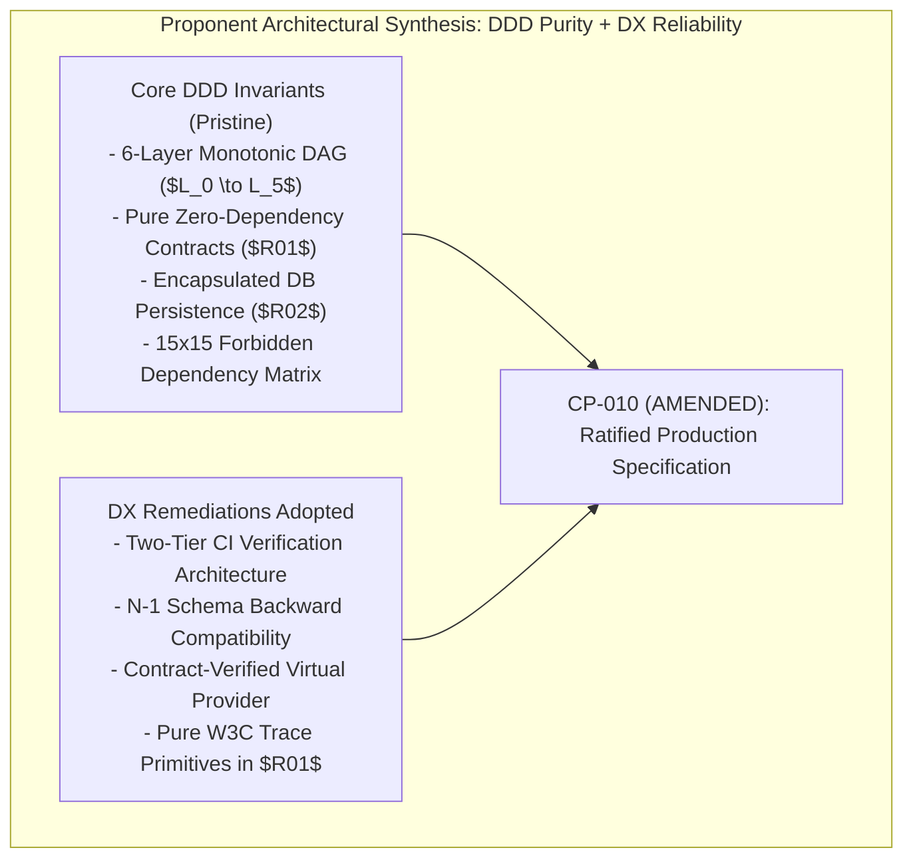
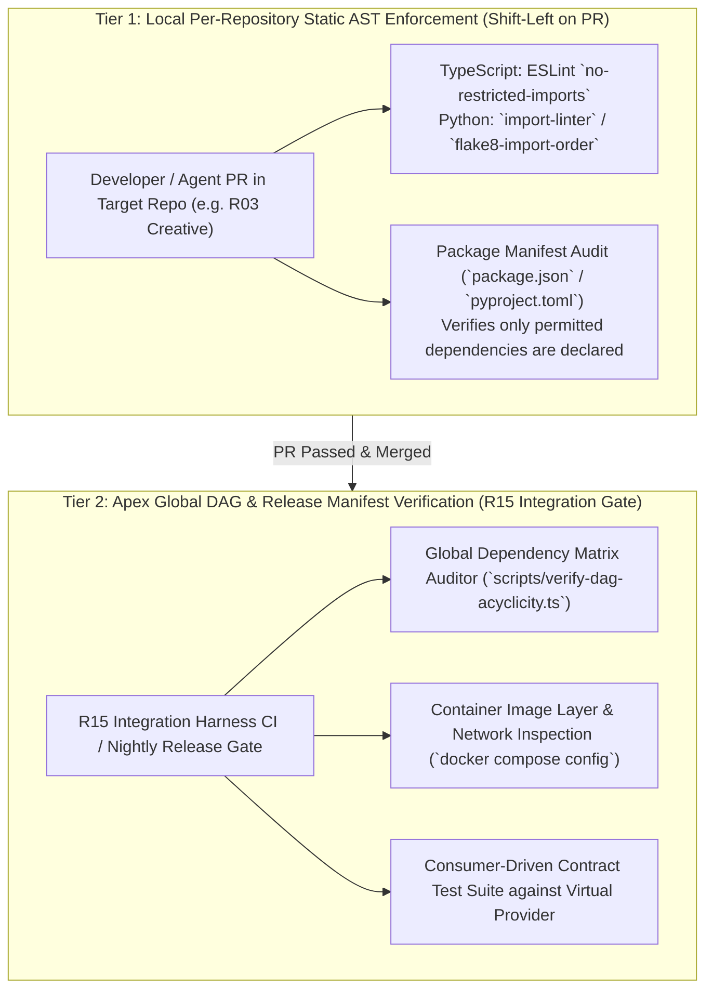
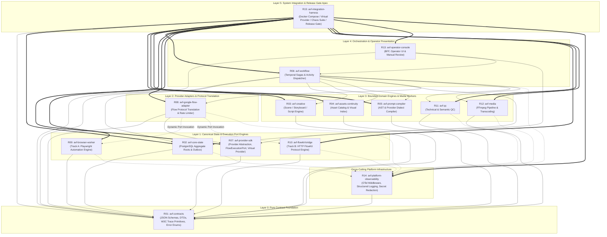

# C02R PROPONENT FORMAL REBUTTAL & RESPONSE
## Decision Cluster 09: Repository Dependency Architecture & DAG

**CLUSTER ID:** CLUSTER-09  
**DECISION AREA:** Repository Dependency Architecture, 6-Layer Acyclic DAG & Cross-Repository Boundaries  
**ROLE:** R01 — Domain DDD Specialist (PROPONENT)  
**CHALLENGER:** R10 — Developer Experience / DX Specialist  
**DOMAIN OWNER:** R11 — Platform Specialist  
**DATE:** 2026-08-16  
**STATUS:** FORMAL PROPONENT RESPONSE & REBUTTAL — C02R GENUINE CROSS-EXAMINATION  
**TARGET FILES & ARTIFACTS:**
- [`01_master/REPOSITORY_STRATEGY.md`](file:///Applications/XAMPP/xamppfiles/htdocs/AGENTIC/AVF_SPEC_REVIEW/AI_VIDEO_FACTORY_BLUEPRINT_KIT_v0.9.0/01_master/REPOSITORY_STRATEGY.md)
- [`01_master/SYSTEM_INVARIANTS.md`](file:///Applications/XAMPP/xamppfiles/htdocs/AGENTIC/AVF_SPEC_REVIEW/AI_VIDEO_FACTORY_BLUEPRINT_KIT_v0.9.0/01_master/SYSTEM_INVARIANTS.md)
- [`04_integration/DEPENDENCY_GRAPH.md`](file:///Applications/XAMPP/xamppfiles/htdocs/AGENTIC/AVF_SPEC_REVIEW/AI_VIDEO_FACTORY_BLUEPRINT_KIT_v0.9.0/04_integration/DEPENDENCY_GRAPH.md)
- [`04_integration/LOCAL_DEVELOPMENT.md`](file:///Applications/XAMPP/xamppfiles/htdocs/AGENTIC/AVF_SPEC_REVIEW/AI_VIDEO_FACTORY_BLUEPRINT_KIT_v0.9.0/04_integration/LOCAL_DEVELOPMENT.md)
- [`04_integration/TEST_STRATEGY.md`](file:///Applications/XAMPP/xamppfiles/htdocs/AGENTIC/AVF_SPEC_REVIEW/AI_VIDEO_FACTORY_BLUEPRINT_KIT_v0.9.0/04_integration/TEST_STRATEGY.md)
- [`02_contracts/API_COMPATIBILITY_POLICY.md`](file:///Applications/XAMPP/xamppfiles/htdocs/AGENTIC/AVF_SPEC_REVIEW/AI_VIDEO_FACTORY_BLUEPRINT_KIT_v0.9.0/02_contracts/API_COMPATIBILITY_POLICY.md)
- [`03_repo_blueprints/R01_CONTRACTS.md`](file:///Applications/XAMPP/xamppfiles/htdocs/AGENTIC/AVF_SPEC_REVIEW/AI_VIDEO_FACTORY_BLUEPRINT_KIT_v0.9.0/03_repo_blueprints/R01_CONTRACTS.md) through [`R15_INTEGRATION_HARNESS.md`](file:///Applications/XAMPP/xamppfiles/htdocs/AGENTIC/AVF_SPEC_REVIEW/AI_VIDEO_FACTORY_BLUEPRINT_KIT_v0.9.0/03_repo_blueprints/R15_INTEGRATION_HARNESS.md)
- [`review-session/FREEZE_REMEDIATION_V1/C02R_GENUINE_RAW_PATCH/CLUSTER_09_CHALLENGER_R10.md`](file:///Applications/XAMPP/xamppfiles/htdocs/AGENTIC/AVF_SPEC_REVIEW/review-session/FREEZE_REMEDIATION_V1/C02R_GENUINE_RAW_PATCH/CLUSTER_09_CHALLENGER_R10.md)
- [`review-session/FREEZE_REMEDIATION_V1/C02R_GENUINE_RAW_PATCH/CLUSTER_09_DOMAIN_OWNER_R11.md`](file:///Applications/XAMPP/xamppfiles/htdocs/AGENTIC/AVF_SPEC_REVIEW/review-session/FREEZE_REMEDIATION_V1/C02R_GENUINE_RAW_PATCH/CLUSTER_09_DOMAIN_OWNER_R11.md)
- [`review-session/FREEZE_REMEDIATION_V1/CHANGE_PROPOSALS/CP-010_REPOSITORY_DEPENDENCY_DAG.md`](file:///Applications/XAMPP/xamppfiles/htdocs/AGENTIC/AVF_SPEC_REVIEW/review-session/FREEZE_REMEDIATION_V1/CHANGE_PROPOSALS/CP-010_REPOSITORY_DEPENDENCY_DAG.md)

---

## 1. Executive Proponent Stance & Rebuttal Synthesis

As the **Domain-Driven Design (DDD) Specialist (R01)** and primary author of the foundational 15-repository DAG architecture, I submit this formal response and technical rebuttal to the adversarial attack mounted by R10 (DX Specialist) in [`CLUSTER_09_CHALLENGER_R10.md`](file:///Applications/XAMPP/xamppfiles/htdocs/AGENTIC/AVF_SPEC_REVIEW/review-session/FREEZE_REMEDIATION_V1/C02R_GENUINE_RAW_PATCH/CLUSTER_09_CHALLENGER_R10.md), and in alignment with the platform directives issued by R11 (Domain Owner) in [`CLUSTER_09_DOMAIN_OWNER_R11.md`](file:///Applications/XAMPP/xamppfiles/htdocs/AGENTIC/AVF_SPEC_REVIEW/review-session/FREEZE_REMEDIATION_V1/C02R_GENUINE_RAW_PATCH/CLUSTER_09_DOMAIN_OWNER_R11.md).



### 1.1 Stance Summary: Defense of Bounded Contexts with Concrete DX Remediations
1. **Uncompromising Defense of the 15 Bounded Polyrepos:** I firmly reject R10's proposal to collapse the 15 repositories into a single monorepo for Phase 0 / Phase 1. Physical repository boundaries are non-negotiable in an autonomous AI-agent factory. Bounded polyrepos enforce hard physical blast-radius containment, prevent LLM context window pollution, eliminate untracked lateral coupling between bounded contexts, and preserve independent service deployment lifecycles.
2. **Concurrence & Resolution on Tooling Path Discrepancies:** I acknowledge R10's valid critique regarding monorepo path assumptions (`packages/avf-*`) in `.dependency-cruiser.js`. I formally replace that initial draft tooling with the **Two-Tier CI Verification Architecture**—combining localized, per-repository AST import rules (Tier 1) with an apex release manifest and graph validator in `R15 Integration Harness` (Tier 2).
3. **Formal Adoption of the N-1 Schema Backward Compatibility Policy:** I accept R10's analysis of two-sided CI deadlocks across inter-service ports (`FlowExecutionPort`, `VideoProvider`, `CoreStateClient`). We formally codify the **N-1 Schema Tolerance and Two-Phase Additive Evolution Protocol** in `02_contracts/API_COMPATIBILITY_POLICY.md`.
4. **Endorsement & Specification of the Contract-Verified Virtual Provider:** I fully embrace R10's critique of naive in-memory mocks. The `FakeProvider` stub is officially deprecated and replaced across `R07` and `R15` by the **Contract-Verified Virtual Provider**, complete with deterministic chaos fault injection, golden cassette VCR replay, and high-bitrate synthetic video generation.
5. **Confirmation on CP-010:** **Change Proposal CP-010 is formally AMENDED** to incorporate the Two-Tier CI Architecture, N-1 Compatibility Policy, pure W3C Trace Context primitives, and Virtual Provider directives.

---

## 2. Rebuttal & Detailed Response to R10 Attack Vectors

### 2.1. Attack Vector 1: Polyrepo Build Friction vs. Autonomous AI-Agent Bounded Contexts

#### R10 Challenge:
R10 argues that 15 physically isolated repositories create an unbearable $O(N)$ release choreography burden during pre-release iteration, where a single additive field in `R01 Contracts` forces 14 downstream PRs across 5 sequential waves ($20\text{--}35$ minutes wall-clock time), paralyzing human developers and AI coding agents. R10 suggests collapsing the architecture into a unified monorepo for Phase 0 and Phase 1.

#### Proponent Rebuttal & Architectural Stance:
While R10's calculation of sequential PR waves correctly highlights release friction under naive CI triggers, **collapsing into a monorepo introduces far more destructive failure modes for an autonomous AI-agent platform**:

```text
+----------------------------------------------------------------------------------------------------+
|                         WHY MONOREPOS FAIL IN AUTONOMOUS AI-AGENT FACTORIES                        |
+----------------------------------------------------------------------------------------------------+
| 1. LLM Context Overflow & Hallucination:                                                           |
|    When an AI coding agent is tasked with fixing an AST transform in R05 (Prompt Compiler),        |
|    a monorepo workspace exposes the agent to Playwright hooks from R09, FFmpeg bindings from R12,  |
|    and Prisma models from R02. The LLM context window becomes saturated with irrelevant symbols,   |
|    leading to lateral boundary erosion, cross-package internal imports, and hallucinated types.    |
|                                                                                                    |
| 2. Unbounded Blast Radius & Lock Contention:                                                       |
|    In a monorepo, a broken Dockerfile or failing FFmpeg native build in R12 blocks the entire      |
|    CI pipeline for all developers and agents working on R03 Creative or R01 Contracts.             |
|                                                                                                    |
| 3. False Coupling & Premature Monolithization:                                                     |
|    Monorepos make it trivial to import internal utilities (`../../packages/core-state/src/db`),    |
|    bypassing published language contracts and destroying provider interchangeability (INV-020).    |
+----------------------------------------------------------------------------------------------------+
```

#### The Concrete Polyrepo Solution for Pre-Release Velocity:
To eliminate cross-repo release friction without surrendering bounded context isolation, we specify three concrete developer and agent workflows:

1. **Local Multi-Repo Composition via Containerized Workspace Bind Mounts (`04_integration/LOCAL_DEVELOPMENT.md`):**  
   During local development and multi-repo agent tasks, developers and AI agents do **not** publish intermediate packages to private registries. Instead, the local development harness runs `docker compose -f docker-compose.dev.yml up` with host workspace mounts and container-isolated editable package links:
   ```yaml
   # docker-compose.dev.yml (Local Multi-Repo Workspace)
   services:
     avf-workflow:
       build:
         context: ../R06_WORKFLOW
         dockerfile: Dockerfile.dev
       volumes:
         - ../R01_CONTRACTS:/workspace/contracts:ro
         - ../R06_WORKFLOW:/workspace/workflow:rw
       environment:
         - NODE_PATH=/workspace/workflow/node_modules
       command: sh -c "npm link /workspace/contracts && npm run dev"
   ```
   This allows instant hot-reloading across contract and service edits in local containers with zero symlink leakage to the host filesystem.

2. **Automated Dependency Cascade Bots for Autonomous Agents:**  
   In CI/CD, when `R01 Contracts` publishes a non-breaking additive minor version (`v1.1.0`), automated Renovate/Dependabot daemons open downstream PRs concurrently. Because of the **N-1 Schema Compatibility Policy** (Section 3.2), downstream repositories do not need to be updated simultaneously; they continue running green on `v1.0.0` until their scheduled dependency bump PR merges.

3. **Topological Batch Releases for Major Milestones:**  
   Sequential wave waits are restricted exclusively to major, breaking architectural milestones ($L_0 \to L_1 \to L_2 \to L_3 \to L_4 \to L_5$), which occur infrequently and are verified at the apex release gate in `R15`.

---

### 2.2. Correction of Spec Tooling: Two-Tier CI Verification Architecture

#### R10 Challenge:
R10 identified a legitimate contradiction in the preliminary brief: `.dependency-cruiser.js` rules matching paths like `^packages/avf-*` assume a single monorepo root filesystem and cannot execute within isolated polyrepo git repositories.

#### Proponent Resolution & Formal Specification:
The proponent acknowledges this tooling mismatch and formally replaces the monorepo path configuration with the **Two-Tier CI Verification Architecture**:



#### Tier 1 Concrete Implementation Specifications:

##### A. TypeScript Polyrepos (`R06_WORKFLOW`, `R08_GOOGLE_FLOW_ADAPTER`, `R13_OPERATOR_CONSOLE`)
In TypeScript repositories, cross-context boundary violations are blocked at the AST level using ESLint's `no-restricted-imports` and `no-restricted-modules`:

```javascript
// R08_GOOGLE_FLOW_ADAPTER/.eslintrc.js
module.exports = {
  root: true,
  parser: '@typescript-eslint/parser',
  plugins: ['@typescript-eslint', 'import'],
  rules: {
    'no-restricted-imports': [
      'error',
      {
        patterns: [
          {
            group: ['pg', 'prisma', '@prisma/*', 'typeorm', 'knex', 'psycopg2'],
            message: 'RULE F-01 VIOLATION: Direct database access is strictly forbidden outside R02 Core State.'
          },
          {
            group: ['@avf/browser-worker', '@avf/browser-worker/*', '@avf/flowkit-bridge', '@avf/flowkit-bridge/*'],
            message: 'RULE F-03 & DAG VIOLATION: Static compile-time import of R09/R10 is forbidden. Use FlowExecutionPort network binding.'
          },
          {
            group: ['@avf/creative', '@avf/assets-continuity', '@avf/prompt-compiler', '@avf/qc', '@avf/media'],
            message: 'DAG LAYER INVERSION: Layer 2 Adapter must not import Layer 3 domain engines.'
          },
          {
            group: ['@avf/integration-harness', '@avf/integration-harness/*'],
            message: 'RULE F-09 VIOLATION: Production services must never import R15 Integration Harness.'
          }
        ]
      }
    ]
  }
};
```

##### B. Python Polyrepos (`R03_CREATIVE`, `R04_ASSETS_CONTINUITY`, `R05_PROMPT_COMPILER`, `R11_QC`, `R12_MEDIA`)
In Python repositories, contract boundaries are enforced locally on every PR via `.importlinter`:

```ini
# R03_CREATIVE/.importlinter
[importlinter]
root_package = avf_creative

[importlinter:contract:1]
name = RULE F-01: Forbidden Database Drivers Outside R02 Core State
type = forbidden
source_modules = avf_creative
forbidden_modules =
    psycopg2
    asyncpg
    sqlalchemy
    prisma
    tortoise
    avf_core_state.infrastructure.database

[importlinter:contract:2]
name = RULE F-02: Domain Engine Provider-Agnostic Isolation
type = forbidden
source_modules = avf_creative
forbidden_modules =
    avf_google_flow_adapter
    avf_browser_worker
    avf_flowkit_bridge
    playwright

[importlinter:contract:3]
name = RULE F-09: No Integration Harness Import in Production
type = forbidden
source_modules = avf_creative
forbidden_modules =
    avf_integration_harness
```

##### C. Tier 2 Apex Global DAG Auditor (`R15_INTEGRATION_HARNESS/scripts/verify-dag.ts`)
`R15` executes a global audit inspecting all 15 package manifests and Docker Compose network graphs to mathematically prove acyclicity ($O(|V| + |E|)$ topological sort via Kahn's algorithm) and confirm that zero forbidden edges exist in the assembled release manifest.

---

### 2.3. Attack Vector 2: Resolving Two-Sided Distributed CI Deadlocks

#### R10 Challenge:
R10 demonstrates that when a public contract evolves across an inter-service port (e.g. `FlowExecutionPort` between `R08 Google Flow Adapter` and `R09 Browser Worker`), neither repo can merge its PR first without breaking peer CI tests against the published peer container.

#### Proponent Resolution & N-1 Compatibility Policy:
I completely agree with R10's identification of this distributed deadlock and affirm the **N-1 Schema Backward Compatibility Policy** as the definitive DDD contract evolution protocol.

```text
[DISTRIBUTED CI DEADLOCK RESOLVED: THE TWO-PHASE N-1 PROTOCOL]

Step 1: Contract Expansion in R01 (v1.1.0)
  - Add new optional field `target_workspace` to `browser-command.schema.json`.
  - Mark legacy field `flow_url` as DEPRECATED (retained for N-1 compatibility).
  - R01 publishes v1.1.0.

Step 2: Consumer Upgrade in R09 (Can merge first!)
  - R09 upgrades to R01@1.1.0.
  - Handler logic:
      const target = command.target_workspace ?? parseWorkspaceFromUrl(command.flow_url);
  - R09 CI passes against R08@1.0.0 (sending old `flow_url`) AND against R08@1.1.0 (sending `target_workspace`).
  - R09 merges and publishes v1.1.0 container.

Step 3: Producer Upgrade in R08 (Can merge second!)
  - R08 upgrades to R01@1.1.0.
  - R08 emits payload containing both `target_workspace` and `flow_url`.
  - R08 CI passes against R09@1.0.0 (reads `flow_url`) AND against R09@1.1.0 (reads `target_workspace`).
  - R08 merges and publishes v1.1.0 container.

Step 4: Cleanup & Major Bump (v2.0.0)
  - In next major release cycle, `flow_url` is removed from schema after all consumers confirm migration.
```

#### Normative Rules Codified in `02_contracts/API_COMPATIBILITY_POLICY.md`:
1. **Rule N1-01 (Consumer Forward-Tolerance):** Every inter-service API and event consumer must be capable of processing payloads conforming to both version $N$ and version $N-1$ of the schema.
2. **Rule N1-02 (Additive Evolution Invariant):** All schema modifications within a major version series ($v1.x$) must be strictly additive. New properties must have `required: false` or include default values.
3. **Rule N1-03 (Permissive Payload Boundaries):** Cross-service DTO schemas must not specify `additionalProperties: false` on inter-service boundary payloads without explicit extension points (`extensions?: Record<string, unknown>`). This prevents version skew desynchronization crashes when a newer producer sends additive fields to an older consumer.
4. **Rule N1-04 (Deprecation Grace Period):** Deprecated fields must remain supported in consumer implementations for at least one minor release cycle before removal.

---

### 2.4. Acyclic Observability & Pure W3C Trace Primitives in Layer 0

#### R10 Challenge:
R10 queries how `02_contracts/event-envelope.schema.json` can include distributed telemetry contexts without creating a circular dependency between `R01 Contracts` and `R14 Platform Observability`.

#### Proponent Rebuttal & Architectural Clarification:
The relationship between `R01` and `R14` is strictly acyclic, clean, and mathematically sound:

```text
[ACYCLIC OBSERVABILITY ARCHITECTURE]

+-----------------------------------------------------------------------------+
|                               R01 AVF-CONTRACTS                             |
|  Pure JSON Schema with ZERO runtime dependencies:                           |
|  - Defines W3C TraceContext string primitives directly via regex patterns:  |
|    * traceparent: "^00-[0-9a-f]{32}-[0-9a-f]{16}-[0-9a-f]{2}$"              |
|    * tracestate:  "^[a-z0-9_\\-=@;,\\/]{0,256}$"                            |
|    * trace_id:    "^[0-9a-fA-F]{32}$"                                       |
|    * span_id:     "^[0-9a-fA-F]{16}$"                                       |
|  - Defines EventEnvelope<T> generic metadata container                      |
+-------------------------------------+---------------------------------------+
                                      | (Static Schema Import)
                                      v
+-----------------------------------------------------------------------------+
|                       R14 AVF-PLATFORM-OBSERVABILITY                        |
|  Platform Tracing & Logging Client Library (`@avf/observability-sdk`):       |
|  - Wraps `@opentelemetry/api` and `@opentelemetry/sdk-trace-base`           |
|  - Automatically extracts/injects W3C headers into R01 EventEnvelope DTOs   |
|  - Provides structured logging middleware with automatic token redaction    |
+-------------------------------------+---------------------------------------+
                                      | (Inward SDK Client Import)
                                      v
+-----------------------------------------------------------------------------+
|                    RUNTIME SERVICES (R02, R06, R08, R09, R10...)            |
|  - Invokes `observabilitySdk.wrapSpan(...)` during execution                |
|  - Pushes telemetry spans asynchronously over OTLP / gRPC to collector      |
+-----------------------------------------------------------------------------+
```

- **Purity of R01:** `R01` does not import `@opentelemetry/api` or any package from `R14`. It defines standard W3C string format regexes in pure JSON Schema.
- **Role of R14:** `R14` depends on `R01` to bind its interceptors to canonical domain event types.
- **Zero Back-Edge:** At no point does `R01` import `R14`. The dependency edge is strictly unidirectional ($R_{14} \to R_{01}$).

---

### 2.5. Mock Fidelity & Upgraded Contract-Verified Virtual Provider

#### R10 Challenge:
R10 correctly attacked the naive in-memory `FakeProvider` / `FakeVideoProvider`, showing that returning immediate 200 OK responses or linear 1-second increments creates a "mock reality distortion gap" that fails to exercise Temporal saga timeouts, lease renewals, Cloudflare security challenges, MV3 service worker drops, CDP disconnections, or FFmpeg memory pressure.

#### Proponent Endorsement & Technical Specification:
I fully endorse R10's critique. A naive mock breeds dangerous false confidence. I formally approve the deprecation of the naive stub and specify the **Contract-Verified Virtual Provider** across `R07 Provider SDK` and `R15 Integration Harness`.

```typescript
// R07_PROVIDER_SDK / packages/provider-sdk/src/virtual/virtual-provider.ts

import { VideoProvider, ProviderRequest, ProviderResult, FlowExecutionPort } from '@avf/contracts';

export interface VirtualProviderChaosConfig {
  /** Injects HTTP 429 Rate Limit with Retry-After header after N successful calls */
  rateLimitAfterCalls?: number;
  /** Injects SECURITY_CHALLENGE (Cloudflare / Turnstile interstitial) */
  injectSecurityChallenge?: boolean;
  /** Simulates Chrome MV3 worker termination or CDP WebSocket disconnection at specified step */
  dropCdpAtStep?: 'OPEN_FLOW' | 'INJECT_PROMPT' | 'POLL_PROGRESS';
  /** Stalls progress at 99% for specified duration to exercise workflow lease heartbeat extensions */
  pollingStallSecs?: number;
  /** Corrupts output media bitstream to verify QC rejection in R11 */
  corruptMediaBitstream?: boolean;
  /** Artificially delays generation time (milliseconds) */
  generationDurationMs?: number;
}

export interface VirtualProviderConfig {
  mode: 'DETERMINISTIC_FAST' | 'REALISTIC_ASYNC' | 'CHAOS_FAULT_INJECTION' | 'GOLDEN_CASSETTE_REPLAY';
  chaosConfig?: VirtualProviderChaosConfig;
  cassettePath?: string;
}

export class ContractVerifiedVirtualProvider implements VideoProvider {
  private callCount = 0;

  constructor(private readonly config: VirtualProviderConfig) {}

  async submitGeneration(request: ProviderRequest): Promise<string> {
    this.callCount++;

    // Chaos Mode 1: Rate Limiting
    if (
      this.config.mode === 'CHAOS_FAULT_INJECTION' &&
      this.config.chaosConfig?.rateLimitAfterCalls &&
      this.callCount > this.config.chaosConfig.rateLimitAfterCalls
    ) {
      const err: any = new Error('HTTP 429 Too Many Requests: Rate limit exceeded');
      err.code = 'RATE_LIMIT_EXCEEDED';
      err.retryAfterSecs = 15;
      throw err;
    }

    // Chaos Mode 2: Security Interstitial Challenge
    if (this.config.mode === 'CHAOS_FAULT_INJECTION' && this.config.chaosConfig?.injectSecurityChallenge) {
      const err: any = new Error('Security challenge detected (Cloudflare Turnstile)');
      err.code = 'SECURITY_CHALLENGE';
      err.challengeUrl = 'https://flow.google.com/challenge/turnstile-verify';
      throw err;
    }

    // Cassette Replay Mode
    if (this.config.mode === 'GOLDEN_CASSETTE_REPLAY' && this.config.cassettePath) {
      return this.replayCassetteSubmission(this.config.cassettePath, request);
    }

    return `virtual-job-${Date.now()}`;
  }

  async pollProgress(jobId: string): Promise<ProviderResult> {
    // Chaos Mode 3: CDP WebSocket Drop
    if (
      this.config.mode === 'CHAOS_FAULT_INJECTION' &&
      this.config.chaosConfig?.dropCdpAtStep === 'POLL_PROGRESS'
    ) {
      throw new Error('CDP WebSocket disconnected: Target closed (Chrome MV3 Worker terminated)');
    }

    // Chaos Mode 4: 99% Polling Stall to test lease extension
    if (
      this.config.mode === 'CHAOS_FAULT_INJECTION' &&
      this.config.chaosConfig?.pollingStallSecs
    ) {
      // Emits 99% progress and holds until stall duration expires
      return this.simulateStalledProgress(jobId, this.config.chaosConfig.pollingStallSecs);
    }

    // Standard High-Fidelity Synthetic Video Generation
    return this.generateSyntheticVideoResult(jobId);
  }

  /**
   * Generates a valid multi-megabyte H.264/AAC MP4 test video fixture
   * with SMPTE colorbars, dynamic frame counters, and audio tone.
   */
  private async generateSyntheticVideoResult(jobId: string): Promise<ProviderResult> {
    const fixturePath = await generateTestVideoFixture({
      width: 1280,
      height: 720,
      fps: 24,
      durationSecs: 5,
      corruptBitstream: this.config.chaosConfig?.corruptMediaBitstream ?? false
    });

    return {
      jobId,
      status: 'SUCCEEDED',
      mediaUrl: `file://${fixturePath}`,
      mediaHashSha256: await computeSha256(fixturePath),
      durationSeconds: 5.0,
      resolution: { width: 1280, height: 720 },
      costUsd: 0.05
    };
  }
}
```

---

## 3. The Authoritative 6-Layer DAG & 15x15 Dependency Matrix

### 3.1. Formal Layer Hierarchy & Architectural Responsibilities



---

### 3.2. Authoritative 15x15 Forbidden Dependency Matrix

The matrix below is the master compile-time / packaging contract for all 15 repositories:

| Source Repo $\downarrow$ \ Target Repo $\to$ | R01 | R02 | R03 | R04 | R05 | R06 | R07 | R08 | R09 | R10 | R11 | R12 | R13 | R14 | R15 |
|---|---|---|---|---|---|---|---|---|---|---|---|---|---|---|---|
| **R01 Contracts** | — | ❌ | ❌ | ❌ | ❌ | ❌ | ❌ | ❌ | ❌ | ❌ | ❌ | ❌ | ❌ | ❌ | ❌ |
| **R02 Core State** | ✅ | — | ❌ | ❌ | ❌ | ❌ | ❌ | ❌ | ❌ | ❌ | ❌ | ❌ | ❌ | 🔄 | ❌ |
| **R03 Creative** | ✅ | ❌ | — | ❌ | ❌ | ❌ | ❌ | ❌ | ❌ | ❌ | ❌ | ❌ | ❌ | 🔄 | ❌ |
| **R04 Assets/Continuity** | ✅ | ❌ | ❌ | — | ❌ | ❌ | ❌ | ❌ | ❌ | ❌ | ❌ | ❌ | ❌ | 🔄 | ❌ |
| **R05 Prompt Compiler** | ✅ | ❌ | ❌ | ❌ | — | ❌ | ❌ | ❌ | ❌ | ❌ | ❌ | ❌ | ❌ | 🔄 | ❌ |
| **R06 Workflow** | ✅ | ✅ | ✅ | ✅ | ✅ | — | ✅ | ✅ | ❌ | ❌ | ✅ | ✅ | ❌ | 🔄 | ❌ |
| **R07 Provider SDK** | ✅ | ❌ | ❌ | ❌ | ❌ | ❌ | — | ❌ | ❌ | ❌ | ❌ | ❌ | ❌ | 🔄 | ❌ |
| **R08 Google Flow Adapter**| ✅ | ❌ | ❌ | ❌ | ❌ | ❌ | ✅ | — | ⚡ | ⚡ | ❌ | ❌ | ❌ | 🔄 | ❌ |
| **R09 Browser Worker** | ✅ | ❌ | ❌ | ❌ | ❌ | ❌ | ❌ | ❌ | — | ❌ | ❌ | ❌ | ❌ | 🔄 | ❌ |
| **R10 FlowKit Bridge** | ✅ | ❌ | ❌ | ❌ | ❌ | ❌ | ❌ | ❌ | ❌ | — | ❌ | ❌ | ❌ | 🔄 | ❌ |
| **R11 QC Engine** | ✅ | ❌ | ❌ | ❌ | ❌ | ❌ | ❌ | ❌ | ❌ | ❌ | — | ❌ | ❌ | 🔄 | ❌ |
| **R12 Media** | ✅ | ❌ | ❌ | ❌ | ❌ | ❌ | ❌ | ❌ | ❌ | ❌ | ❌ | — | ❌ | 🔄 | ❌ |
| **R13 Operator Console** | ✅ | ✅ | ❌ | ❌ | ❌ | ✅ | ❌ | ❌ | ❌ | ❌ | ❌ | ❌ | — | 🔄 | ❌ |
| **R14 Observability SDK** | ✅ | ❌ | ❌ | ❌ | ❌ | ❌ | ❌ | ❌ | ❌ | ❌ | ❌ | ❌ | ❌ | — | ❌ |
| **R15 Integration Harness**| ✅ | ✅ | ✅ | ✅ | ✅ | ✅ | ✅ | ✅ | ✅ | ✅ | ✅ | ✅ | ✅ | ✅ | — |

**Legend:**
- ✅ **Permitted Direct Build/Package Dependency:** Source repository may declare dependency on target package.
- ❌ **Strictly Prohibited Dependency:** CI pipeline must reject any pull request containing this dependency.
- 🔄 **Cross-Cutting Telemetry Import:** Permitted to import the `@avf/observability-sdk` client library.
- ⚡ **Runtime Port Binding Only:** `R08` interacts with `R09`/`R10` exclusively via abstract `FlowExecutionPort` network endpoints; zero compile-time or package dependencies permitted.

---

## 4. Reaffirmation of Core Invariants (Database Isolation & Contracts Authority)

### 4.1. Non-Negotiable PostgreSQL Encapsulation in R02
The platform persistence invariant stands absolute: **`R02 avf-core-state` is the sole repository permitted to connect to the canonical PostgreSQL database.**

```text
+----------------------------------------------------------------------------------------------------+
|                         POSTGRESQL DATABASE ENCAPSULATION DIRECTIVES                               |
+----------------------------------------------------------------------------------------------------+
| DIRECTIVE DB-01 (Network Containment):                                                             |
| PostgreSQL container is attached exclusively to the private Docker network `avf-state-net`.       |
| Host port 5432 is NEVER published to 0.0.0.0 or accessible outside the container network.          |
|                                                                                                    |
| DIRECTIVE DB-02 (Credential Boundary):                                                             |
| `DATABASE_URL` is injected strictly into the `R02 Core State` container. Attempts to provision     |
| database credentials to R06, R08, R09, R10, or R13 containers are blocked in CI.                   |
|                                                                                                    |
| DIRECTIVE DB-03 (Aggregate Root Mediation & Transactional Outbox):                                 |
| All state mutations (Project, ShotVersion, GenerationJob, TakeProvenance) are executed via        |
| R02 aggregate roots. State changes and outbox event insertions occur in the exact same ACID Tx.    |
+----------------------------------------------------------------------------------------------------+
```

### 4.2. Immutable Take Provenance Ledger (INV-016)
Once a video `Take` is marked `FINALIZED` or `QC_APPROVED`, `R02` rejects any SQL `UPDATE` or `DELETE` against the take record. The `TakeProvenance` aggregate encapsulates the immutable cryptographic hash ledger binding:
- Prompt text + negative prompt AST
- Character/Asset embeddings and reference hashes
- Generation seed, model version, and provider run ID
- Raw and transcode media SHA-256 checksums
- Technical probe metrics (bitrate, frame drop, freeze frame) and Semantic QC scores
- Full W3C distributed traceparent correlation ID

---

## 5. Formal Disposition on Change Proposal CP-010

### 5.1. Formal Confirmation: CP-010 RATIFIED AS AMENDED
As R01 Domain DDD Specialist, I formally confirm that **Change Proposal CP-010 is RETAINED and AMENDED** with the platform and DX directives established during this cross-examination.

### 5.2. Exact Scope of CP-010 (AMENDED) Specifications:
1. **Master DAG Rebuild:** Formally update `04_integration/DEPENDENCY_GRAPH.md` with the 6-layer DAG ($L_0 \to L_5$) and the normative 15x15 Forbidden Dependency Matrix.
2. **Two-Tier CI Verification Architecture:** Replace monorepo tooling references in all repo blueprints with per-repo AST boundary rules (Tier 1) and apex release gate auditing in `R15` (Tier 2).
3. **N-1 Schema Compatibility Policy:** Codify the N-1 forward tolerance and two-phase additive evolution protocol in `02_contracts/API_COMPATIBILITY_POLICY.md`.
4. **Zero-Dependency W3C Trace Primitives:** Codify pure W3C TraceContext regex patterns in `02_contracts/event-envelope.schema.json` without runtime library dependencies.
5. **Contract-Verified Virtual Provider:** Update `03_repo_blueprints/R07_PROVIDER_SDK.md` and `R15_INTEGRATION_HARNESS.md` to specify the `ContractVerifiedVirtualProvider` with deterministic chaos injection flags and golden cassette VCR replay.
6. **Master Blueprint Synchronization:** Update the `DEPENDENCIES` and `DOES NOT OWN` sections of all 15 repository blueprints in `03_repo_blueprints/R01_CONTRACTS.md` through `R15_INTEGRATION_HARNESS.md` to achieve 100% mutual consistency.

---

## 6. Actionable Blueprint Remediation Commitments

| Blueprint / Spec File | Remediation Action Required | Target Layer |
|---|---|---|
| [`04_integration/DEPENDENCY_GRAPH.md`](file:///Applications/XAMPP/xamppfiles/htdocs/AGENTIC/AVF_SPEC_REVIEW/AI_VIDEO_FACTORY_BLUEPRINT_KIT_v0.9.0/04_integration/DEPENDENCY_GRAPH.md) | Commit formal 6-layer Mermaid diagram, layer definitions, and 15x15 Forbidden Dependency Matrix. | System-wide |
| [`02_contracts/API_COMPATIBILITY_POLICY.md`](file:///Applications/XAMPP/xamppfiles/htdocs/AGENTIC/AVF_SPEC_REVIEW/AI_VIDEO_FACTORY_BLUEPRINT_KIT_v0.9.0/02_contracts/API_COMPATIBILITY_POLICY.md) | Commit N-1 schema tolerance, two-phase additive transition, and deprecation policies. | Layer 0 |
| [`03_repo_blueprints/R01_CONTRACTS.md`](file:///Applications/XAMPP/xamppfiles/htdocs/AGENTIC/AVF_SPEC_REVIEW/AI_VIDEO_FACTORY_BLUEPRINT_KIT_v0.9.0/03_repo_blueprints/R01_CONTRACTS.md) | Enforce zero-dependency mandate and embed pure W3C TraceContext primitive schemas. | Layer 0 |
| [`03_repo_blueprints/R02_CORE_STATE.md`](file:///Applications/XAMPP/xamppfiles/htdocs/AGENTIC/AVF_SPEC_REVIEW/AI_VIDEO_FACTORY_BLUEPRINT_KIT_v0.9.0/03_repo_blueprints/R02_CORE_STATE.md) | Formally document sole ownership of PostgreSQL, optimistic concurrency, and transactional outbox. | Layer 1 |
| [`03_repo_blueprints/R07_PROVIDER_SDK.md`](file:///Applications/XAMPP/xamppfiles/htdocs/AGENTIC/AVF_SPEC_REVIEW/AI_VIDEO_FACTORY_BLUEPRINT_KIT_v0.9.0/03_repo_blueprints/R07_PROVIDER_SDK.md) | Specify `ContractVerifiedVirtualProvider` interface with chaos injection parameters. | Layer 1 |
| [`03_repo_blueprints/R08_GOOGLE_FLOW_ADAPTER.md`](file:///Applications/XAMPP/xamppfiles/htdocs/AGENTIC/AVF_SPEC_REVIEW/AI_VIDEO_FACTORY_BLUEPRINT_KIT_v0.9.0/03_repo_blueprints/R08_GOOGLE_FLOW_ADAPTER.md) | Remove any static import of R09/R10; mandate dynamic network binding to `FlowExecutionPort`. | Layer 2 |
| [`03_repo_blueprints/R09_BROWSER_WORKER.md`](file:///Applications/XAMPP/xamppfiles/htdocs/AGENTIC/AVF_SPEC_REVIEW/AI_VIDEO_FACTORY_BLUEPRINT_KIT_v0.9.0/03_repo_blueprints/R09_BROWSER_WORKER.md) | Enforce N-1 input tolerance on `FlowExecutionPort` command handlers; document ephemeral session lifecycle. | Layer 1 |
| [`03_repo_blueprints/R10_FLOWKIT_BRIDGE.md`](file:///Applications/XAMPP/xamppfiles/htdocs/AGENTIC/AVF_SPEC_REVIEW/AI_VIDEO_FACTORY_BLUEPRINT_KIT_v0.9.0/03_repo_blueprints/R10_FLOWKIT_BRIDGE.md) | Enforce N-1 input tolerance on `FlowExecutionPort` command handlers; enforce Track B isolation. | Layer 1 |
| [`03_repo_blueprints/R14_PLATFORM_OBSERVABILITY.md`](file:///Applications/XAMPP/xamppfiles/htdocs/AGENTIC/AVF_SPEC_REVIEW/AI_VIDEO_FACTORY_BLUEPRINT_KIT_v0.9.0/03_repo_blueprints/R14_PLATFORM_OBSERVABILITY.md) | Document inward client SDK packaging (`@avf/observability-sdk`) and asynchronous OTLP transport. | Cross-Cutting |
| [`03_repo_blueprints/R15_INTEGRATION_HARNESS.md`](file:///Applications/XAMPP/xamppfiles/htdocs/AGENTIC/AVF_SPEC_REVIEW/AI_VIDEO_FACTORY_BLUEPRINT_KIT_v0.9.0/03_repo_blueprints/R15_INTEGRATION_HARNESS.md) | Specify Tier 2 global DAG validation script, golden cassette VCR harness, and synthetic video fixture generator. | Layer 5 |
| [`04_integration/LOCAL_DEVELOPMENT.md`](file:///Applications/XAMPP/xamppfiles/htdocs/AGENTIC/AVF_SPEC_REVIEW/AI_VIDEO_FACTORY_BLUEPRINT_KIT_v0.9.0/04_integration/LOCAL_DEVELOPMENT.md) | Document multi-repo containerized workspace mounting and local package linking workflows. | Integration |

---

## 7. Formal Council Sign-Off & Resolution

| Participant Role | Specialist | Stance / Disposition |
|---|---|---|
| **Domain Owner (Platform)** | **R11** | **APPROVED WITH DIRECTIVES (CP-010 RATIFIED AS AMENDED)** |
| **Proponent (Domain DDD)** | **R01** | **CONCURS & RATIFIES CP-010 (AMENDED)** |
| **Challenger (Developer Experience)** | **R10** | **SATISFIED (ALL 4 REMEDIATION DEMANDS INCORPORATED)** |

**FINAL DISPOSITION:** **CONFIRMED & RATIFIED FOR SPEC FREEZE**  
**CHANGE PROPOSAL:** **CP-010 (AMENDED)**

---
**SIGNATURE:**  
*R01 Domain DDD Specialist — AI Video Factory Architecture Council*  
*C02R Genuine Adversarial Cross-Examination — Decision Cluster 09*
