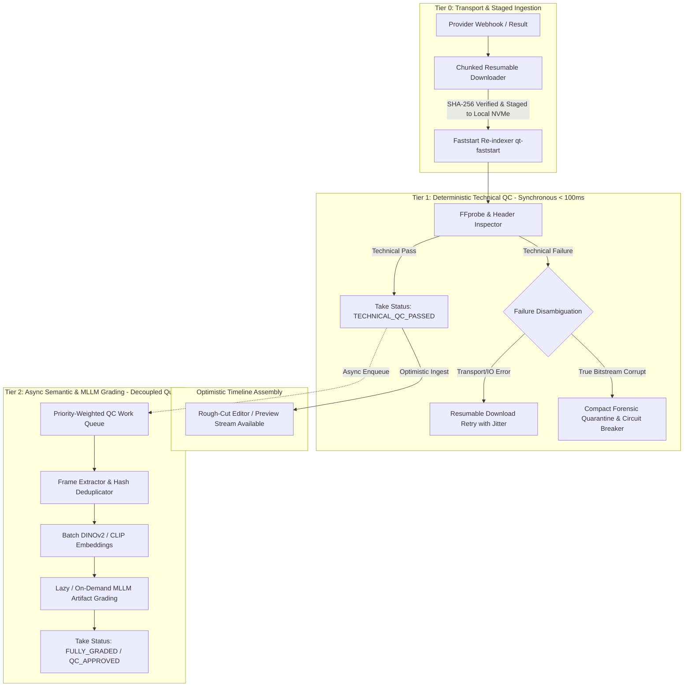

# C02R RED TEAM CHALLENGE: CLUSTER 11 — QC PIPELINE, MEDIA PROCESSING & DLQ REPLAY

**DOCUMENT_ID:** RED-TEAM-C02R-CL11-R12  
**ROLE:** R12 Media Processing Specialist (Challenger)  
**DECISION_CLUSTER:** Cluster 11 — QC Pipeline, Media Processing & DLQ Replay  
**TARGET_SPECIFICATIONS:** `03_repo_blueprints/R11_QC.md`, `03_repo_blueprints/R12_MEDIA.md`, `03_repo_blueprints/R02_CORE_STATE.md`, `03_repo_blueprints/R06_ORCHESTRATOR.md`, `02_contracts/provider-result.schema.json`, `02_contracts/event-envelope.schema.json`, `review-session/FREEZE_REMEDIATION_V1/CHANGE_PROPOSALS/CP-013_AUTOMATED_QC_PIPELINE.md`, `review-session/SOLUTION_PACKAGES/PKG-07_AUTOMATED_QC_AND_MEDIA.md`  
**DATE:** 2026-08-16  
**STATUS:** ACTIVE_ADVERSARIAL_CHALLENGE  

---

## 1. Executive Summary & Adversarial Stance

The proponent team (R08 QA Specialist, R02 Reliability Specialist) and Solution Package `PKG-07` propose a two-stage automated Quality Control (QC) architecture and a media Dead Letter Queue (DLQ) for the AI Video Factory:
1. **Stage 1 Technical Ingest:** Fast deterministic container and codec validation via `FFprobe` / `FFmpeg` (resolution, aspect ratio, frame rate, duration, audio-video sync, moov atom integrity).
2. **Stage 2 Multimodal / Semantic QC:** Heavy visual quality heuristics and neural continuity scoring (CLIP/DINO/SigLIP feature extraction, facial similarity, temporal consistency, black/frozen frame detection, and MLLM artifact evaluation).
3. **Media DLQ & Quarantine:** Automated routing of unprocessable media or failed takes into a quarantined dead-letter queue with exponential backoff retry and manual operator signoff after 3 attempts.

While the concept of multi-stage validation is conceptually sound, **the current specification suffers from severe architectural defects in media transport, execution topology, and failure isolation.** Specifically:

- **GPU Pipeline Choke Point:** Coupling synchronous Stage 2 MLLM evaluation to the media ingestion path creates massive Head-of-Line (HoL) blocking, GPU resource starvation, and memory thrashing, stalling downstream timeline assembly during high-throughput batch generation.
- **False-Positive Quarantine Poisoning:** The ingest contract fails to distinguish between transient network I/O / CDN transport errors and true deterministic media container corruption. A temporary CDN stall during FFprobe execution incorrectly tags valid, expensive AI takes as `CORRUPT_MEDIA`, throwing them into the DLQ and triggering destructive, costly re-generation loops.
- **Unbounded Quarantine Storage Bloat:** The DLQ architecture lacks storage lifecycle tiering, byte quotas, forensic compression, and relational state partitioning. A sustained provider degradation (e.g. malformed H.264 bitstream burst) will exhaust object storage buckets, bloat PostgreSQL MVCC tables with unindexed crash dumps, and incur thousands of dollars in wasted cloud spend.
- **Monolithic Ingestion Coupling:** The pipeline lacks an optimistic ingestion model where lightweight technical passes permit immediate rough-cut editing while neural grading executes asynchronously in the background.

This red-team challenge attacks these design flaws with quantitative failure models, FFmpeg/system-level breakdown, and concrete contract revisions.

---

## 2. Attack Vector 1: Synchronous Stage 2 MLLM Evaluation Creates Catastrophic GPU Choke Points

### 2.1 Head-of-Line (HoL) Queue Blocking in High-Volume Video Production

In `R11_QC.md` and `CP-013`, the QC evaluator interface specifies:
```text
EvaluateTake(TakeDescriptor) -> QCResult { technical_findings, semantic_scores, recommendation }
```
When upstream generation jobs complete in R08/R09, the workflow orchestrator (R06) invokes `EvaluateTake` synchronously before committing the take as `AVAILABLE` or routing it to R12 (`avf-media`) for timeline concatenation.

#### The Failure Mechanics:
Consider an enterprise production run of a 60-shot sequence with 3 candidate takes generated per shot:
$$\text{Total Takes} = 60 \times 3 = 180 \text{ video takes}$$

1. **Inference Latency Profile:**
   - **Stage 1 (FFprobe / Container):** ~50ms – 120ms (CPU-bound, negligible).
   - **Stage 2 (Keyframe extraction + Tensor encoding + MLLM grading):**
     - Frame decoding (10 keyframes @ 1080p): ~250ms NVDEC / CPU.
     - Vision Transformer embedding extraction (CLIP ViT-L/14 or DINOv2-L for character identity & style): ~450ms on NVIDIA A10G / L4.
     - Vision-Language Model inference (e.g., Qwen2-VL-7B or GPT-4o-mini frame evaluation for artifact/physics scoring): ~2,500ms – 6,000ms.
     - Total Stage 2 Latency per Take: **3.2s – 6.8s**.

2. **Sequential Batch Backlog:**
   $$180 \text{ takes} \times 5.0\text{s} = 900 \text{ seconds (15 minutes of dedicated GPU compute)}$$
   Under peak concurrency where multiple projects or multi-scene episodes render simultaneously (e.g., 5 parallel 60-shot projects = 900 takes), the GPU queue depth swells to $>4,500\text{ seconds}$ (1.25 hours).

```text
[Provider Webhooks] ---> [R06 Workflow Orchestrator]
                               |
                               v (Synchronous Blocking RPC)
                        [R11 QC Service]
                               |
                   +-----------+-----------+
                   |                       |
           [Stage 1: FFprobe]      [Stage 2: MLLM GPU Worker]
           (50ms - Fast Pass)      (3,000ms - 7,000ms - CHOKE POINT)
                   |                       |
                   v                       X (GPU Queue Exhausted / Rate-Limited)
             [Take Pending] <--------------+
                   |
     [Downstream R12 Timeline Blocked]
     [Operator Console UI Frozen on "Evaluating..."]
     [Temporal Workflow Timers Exceed Activity Timeout]
```

3. **Temporal Activity Timeout Cascades:**
   Workflow engines (R06) allocate default activity timeouts (e.g., 60–120s). When the Stage 2 MLLM worker pool saturates, pending take evaluations in the queue exceed activity timeouts. The orchestrator flags the activity as `TIMED_OUT`, re-enqueues the evaluation, and multiplies the load on the already drowning GPU cluster.

---

### 2.2 VRAM Fragmentation and Hardware Codec Contention

When media decoding (FFmpeg with NVDEC / CUDA acceleration) is co-located with PyTorch/TensorRT MLLM inference on worker nodes:
1. **Unified Memory Thrashing:** Allocating large PyTorch KV-caches and model weights (14GB–18GB VRAM) leaves narrow headroom for PyAV / NVDEC hardware decoding surface buffers.
2. **NVDEC Context Switching:** Concurrent decoding of 8 parallel H.264/H.265 4K bitstreams saturates the hardware decoder chips, causing FFmpeg to fallback to CPU `libx264` software decoding, which pins CPU cores at 100% and starves the Go/Node worker event loops.
3. **Out-of-Memory (OOM) Segmentation Faults:** A sudden influx of high-bitrate takes (e.g. ProRes 422 or 60fps raw MP4s) triggers CUDA OOM errors during tensor allocation in DINOv2 embeddings, crashing the QC worker process mid-batch.

---

### 2.3 Economic and Compute Waste on Non-Viable Takes

In standard production workflows, an automated batch may generate 3 to 5 candidate variations for a single shot prompt. In 80% of cases, the director or automated selector chooses **Take 1** if its technical and primary semantic scores pass threshold.
- Synchronously evaluating all 5 takes through heavy Stage 2 MLLMs burns 400% excess GPU compute on takes that will immediately be archived or deleted.
- Evaluating takes that fail elementary creative constraints before the human or orchestrator even determines whether the take is relevant is economically reckless.

---

## 3. Attack Vector 2: False-Positive Quarantine Triggers & Poisoning of Valid Takes via Network/CDN I/O Flaws

### 3.1 Direct Stream Probing & CDN Throttling Failure Mechanics

`R12_MEDIA.md` lists `ProbeMedia` and `IngestProviderOutput` as receiving provider URIs. In distributed cloud setups, external video generation providers (Runway, Kling, Sora, Pika, Luma) host generated output files on S3/CloudFront/Cloudflare CDN endpoints with presigned short-lived URLs.

#### The Failure Scenario:
1. Provider emits webhook `GENERATION_COMPLETED` with download URL `https://cdn.provider.ai/renders/take_9841.mp4`.
2. `avf-media` worker invokes `ffprobe` directly against the remote HTTP URL or streams the file via standard unbuffered streaming pipes:
   ```bash
   ffprobe -v error -show_entries format=duration,size,bit_rate -show_streams -print_format json "https://cdn.provider.ai/..."
   ```
3. **CDN Throttling / Transient TCP Stall:**
   - CDN rate limiters (Cloudflare HTTP 429 / TCP window zero) throttle the chunk download after 4MB of an 80MB file.
   - FFprobe encounters an unexpected EOF or socket read timeout:
     ```text
     [mov,mp4,m4a,3gp,3g2,mj2 @ 0x55d8f28b4d00] error reading header
     https://cdn.provider.ai/...: Invalid data found when processing input
     ```
4. **Fatal Misclassification:**
   - The media ingest wrapper captures exit code `1` and tags the error as `CORRUPT_MEDIA_CONTAINER`.
   - The take status is immediately set to `FAILED_TECHNICAL_QC` and the payload is dispatched to `DLQ_QUARANTINE`.

```text
[Valid $0.50 AI Video on CDN]
        |
        v (Transient HTTP 504 / CDN Packet Drop at 95%)
[FFprobe Stream Reader]
        |
        v Exit Code 1: "Invalid data found when processing input"
[Ingest Adapter (R12)]
        |
        v (Incorrectly Assumes Malformed Video Bitstream)
[DLQ QUARANTINE] <--- Valid Take Poisoned and Discarded!
        |
        v
[Orchestrator Triggers Generation Retry] ---> Provider Billed Twice ($1.00 Total)
```

---

### 3.2 Non-Faststart MP4s and Chunked Incomplete Transfers

AI video generation backends frequently stream raw MP4 output where the **`moov` atom (movie header containing index and codec metadata) is positioned at the very end of the file** (standard non-`faststart` MP4):
- If `avf-media` attempts partial range requests or streaming inspection before the entire binary payload is staged locally, `ffprobe` fails with `moov atom not found`.
- In a naive retry loop, repeating `ffprobe` against the streaming URL will fail identically 3 times, exhausting the DLQ attempt budget and permanently parking a completely valid take in quarantine.

---

### 3.3 The Destructive Re-generation Loop & Provider Spend Bleed

When a take is erroneously marked as `FAILED_TECHNICAL_QC` due to a transport stall:
1. R06 Orchestrator receives `QC_FAILED` and checks retry policy.
2. Under standard recovery rules, R06 submits a brand-new generation job to the provider.
3. **Double Billing & Quota Exhaustion:** The enterprise pays twice for the exact same shot, burns third-party rate limits, and increases project rendering latency by 100–300 seconds.
4. If the CDN degradation persists for 10 minutes, **every single generated take during that window is falsely quarantined and re-submitted in a positive-feedback loop**, draining API credits in minutes.

---

## 4. Attack Vector 3: Quarantine Storage Bloat, Unbounded S3/Object Storage Exhaustion & State Poisoning

### 4.1 Provider Outage Burst Failure Cascades & Multi-Terabyte Quarantine Explosion

When an external provider experiences an upstream encoding regression (for example, emitting corrupted H.264 NAL units, non-standard 10-bit color profiles that crash downstream transcoders, or audio track clock drift):

```text
                                 [Provider Outage / Glitch]
                                             |
                   +-------------------------+-------------------------+
                   | (5,000 Failed Takes @ 150MB Raw MP4 + Uncompressed Intermediates)
                   v                                                   v
        [R12 Media DLQ Storage]                             [R02 PostgreSQL Core DB]
                   |                                                   |
   +---------------+---------------+                   +---------------+---------------+
   |                               |                   |                               |
[Quarantine S3 Bucket: ~750 GB] [Egress/Storage Cost Spike] [MVCC Heap Bloat] [Autovacuum Lag / Query Stall]
```

#### Quantitative Storage Assessment:
- Batch production: 5,000 takes generated across active studio pipelines.
- Average raw high-bitrate video take size: 150 MB.
- Uncompressed intermediate frame dumps & probe logs per failure: 50 MB.
- Total quarantined byte volume per outage incident:
  $$\text{Storage Footprint} = 5,000 \times 200 \text{ MB} = 1,000,000 \text{ MB} = \mathbf{1.0 \text{ TB}}$$

#### The Vulnerability:
1. **Zero Quarantine TTL Enforcement:** `R12_MEDIA.md` defines `CleanupEphemeral` for temporary working files, but provides **zero TTL, zero lifecycle policy, and zero retention rules for quarantined DLQ assets**.
2. Quarantined binaries sit in standard **Hot S3/GCS Storage tier** indefinitely waiting for human operator review that may never occur for discarded batch iterations.
3. Over weeks of continuous operation with multiple provider adapters, DLQ buckets accumulate tens of terabytes of dead video artifacts, resulting in thousands of dollars of phantom cloud storage costs.

---

### 4.2 Relational State Bloat in PostgreSQL Core (`takes`, `dlq_messages`, `qc_results`)

In `R02_CORE_STATE.md` and `domain-entities.schema.json`:
- Quarantined takes and DLQ events are inserted directly into canonical relational tables.
- Every failure dumps full multi-kilobyte stack traces, raw FFmpeg stdout/stderr logs, and JSON probe payloads into PostgreSQL `jsonb` columns.
- **Index Fragmentation:** The `takes` table indexes (`idx_take_shot_version`, `idx_take_status`, `idx_take_checksum`) become heavily fragmented with dead rows.
- Autovacuum cannot reclaim space efficiently under continuous write bursts, degrading query performance for active production timeline assembly.

---

### 4.3 Total Absence of Forensic Thumbnailing and Hard Quotas

When an engineer or QC operator inspects the DLQ in R13 Operator Console:
- The operator does not need a 500MB raw ProRes file to see that the frame is green-screen corrupted or has broken scanlines.
- However, because the system stores the entire uncompressed raw video in quarantine without generating a lightweight forensic contact sheet (e.g. 100KB JPEG thumbnail grid or 500KB low-bitrate MP4 proxy), loading the DLQ dashboard triggers massive S3 egress bandwidth costs and UI latency.
- There are no per-project or per-provider quarantine byte caps. A run-away script can fill local worker NVMe disks to 100%, causing fatal `ENOSPC` errors that crash unrelated healthy rendering pipelines.

---

## 5. Alternative Hypotheses & Concrete Architectural Remediations

To resolve these critical vulnerabilities, we propose three interconnected architectural remediations:



---

### 5.1 Architecture Alternative A: Three-Tier Progressive QC Pipeline (Optimistic Ingest + Tiered Asynchronous Grading)

Instead of a blocking two-stage gate, we mandate a **Three-Tier Progressive QC Pipeline**:

1. **Tier 0: Transport & Staged Ingestion (Deterministic Ingest Guard):**
   - No direct FFprobe over network URLs. Assets must be downloaded to local NVMe scratch space using a resumable HTTP/S3 client with exponential backoff and SHA-256 checksum verification.
   - Run `qt-faststart` / MP4 box verification to ensure `moov` atom placement prior to probe.

2. **Tier 1: Deterministic Technical Gate (Synchronous, CPU-only, $<100\text{ms}$):**
   - Validates resolution, frame rate, container integrity, stream count, and duration.
   - **Optimistic Ingest:** If Tier 1 passes, the take is instantly transitioned to `TECHNICAL_QC_PASSED`.
   - The take is immediately available to R12 (`avf-media`) for rough-cut timeline drafting, proxy generation, and preview playback. Downstream workflows are **never blocked by GPU queues**.

3. **Tier 2: Asynchronous Semantic & MLLM Grading (Decoupled Worker Queue):**
   - Neural evaluations (CLIP/DINO identity verification, MLLM artifact detection) are enqueued to a background task queue with explicit priority weights.
   - **Lazy / On-Demand Evaluation:** Takes are only graded by expensive MLLMs if:
     - The take is flagged as the primary candidate by the automated selector or operator.
     - Or the project configuration explicitly mandates automated overnight batch certification.
   - Dynamic batching is applied across keyframes to maximize GPU tensor throughput.

---

### 5.2 Architecture Alternative B: Transport-Aware Failure Classification & Resilient Ingest Contract

We eliminate false-positive quarantine triggers by introducing strict transport error classification:

| Error Category | Root Cause Examples | Ingest Action | Take State Impact |
| :--- | :--- | :--- | :--- |
| **`TRANSPORT_TRANSIENT`** | HTTP 429, 503, TCP timeout, CDN chunk stall, TLS drop | Resumable chunked retry with jittered backoff (up to 5 attempts). | Take remains `DOWNLOADING`; **zero** DLQ routing; **zero** generation re-trigger. |
| **`TRANSPORT_EXHAUSTED`** | Provider CDN link 404/410 expired, unrecoverable DNS failure | Mark take as `INGEST_TRANSPORT_FAILED`. Emit transport alert. | Route to Provider Ingest DLQ. Trigger provider re-download, NOT generation retry. |
| **`MEDIA_CONTAINER_CORRUPT`** | Invalid NAL units, truncated bitstream, corrupted codec headers on complete file | Generate forensic snapshot. Move to Media DLQ. | Take marked `FAILED_TECHNICAL_QC`. Counted toward provider circuit breaker. |
| **`SEMANTIC_REJECT`** | Character drift, severe artifacting, duration target mismatch | Record QC metrics. Archive take. | Take marked `FAILED_SEMANTIC_QC`. Eligible for creative re-prompting. |

---

### 5.3 Architecture Alternative C: Forensic-Compacted Quarantine Storage with Circuit Breakers & Lifecycle Policies

To prevent multi-terabyte storage exhaustion and database bloat:

1. **Forensic Video Compaction on Quarantine:**
   - When a media file fails technical validation, R12 extracts:
     - A 3x3 contact-sheet JPEG thumbnail grid ($<150\text{KB}$).
     - The first 5 seconds of the video transcoded to low-bitrate proxy ($<1\text{MB}$).
     - The structured `FFprobe` JSON diagnostic and FFmpeg error log ($<20\text{KB}$).
   - The multi-hundred-megabyte raw corrupted binary is moved to an S3 quarantine prefix with a **strict 7-day TTL deletion rule** (`LifecycleConfiguration`).

2. **Automated Provider Circuit Breaking:**
   - If an external provider adapter records $>15\%$ `MEDIA_CONTAINER_CORRUPT` failures over a rolling 10-minute window (minimum 10 takes), the orchestrator trips the provider circuit breaker.
   - Generation requests are immediately paused or failed over to secondary providers, preventing the generation of thousands of doomed takes.

3. **Storage Quota & PostgreSQL Table Partitioning:**
   - PostgreSQL `dlq_messages` and `qc_results` tables MUST be partitioned by month (`PARTITION BY RANGE (created_at)`).
   - Hard quarantine quota: Maximum 50GB storage allocation per project DLQ. Excess failures purge the oldest raw binaries while retaining JSON diagnostics.

---

## 6. Concrete Contract & Blueprint Diff Proposals

### 6.1 Blueprint Modification: `03_repo_blueprints/R11_QC.md`

```diff
--- a/03_repo_blueprints/R11_QC.md
+++ b/03_repo_blueprints/R11_QC.md
@@ -8,7 +8,8 @@
 ## PURPOSE
 
-Evaluate generated Takes using deterministic technical checks plus versioned semantic/multimodal evaluators and return typed QCResult recommendations.
+Evaluate generated Takes using a two-tier decoupled architecture: synchronous deterministic technical checks (Tier 1) for optimistic ingest, plus asynchronous, prioritized semantic/multimodal evaluators (Tier 2).
 
 ## RESPONSIBILITY / OWNS
 
@@ -17,6 +18,9 @@
 - evaluator interface/version
 - score normalization
 - issue taxonomy
+- progressive evaluation state tracking
+- dynamic GPU batching policy
+- forensic failure artifact generation
 
 ## DOES NOT OWN / NON-GOALS
 
@@ -41,9 +45,10 @@
 ## PUBLIC API / CONTRACT
 
-- EvaluateTechnical
-- EvaluateSemantic
-- EvaluateTake
+- EvaluateTechnicalSync (Fast-path CPU container inspection, <100ms)
+- EnqueueSemanticEvaluationAsync (Background queue for MLLM/embedding checks)
+- GetEvaluationStatus
+- GenerateForensicReport
 - GetEvaluatorInfo
 
 ## FAILURE MODES
@@ -53,6 +58,8 @@
 - evaluation timeout
 - low confidence
 - schema invalid
+- gpu_queue_saturated
+- transport_transient_error
 
 ## RETRY STRATEGY
 
-Technical tool retry for transient I/O; semantic evaluator bounded retry; low confidence can recommend HUMAN_REVIEW.
+Technical ingest retry handles transient network/CDN I/O without take state corruption; semantic evaluator uses priority-weighted backoff; persistent failures generate compressed forensic contact sheets.
```

---

### 6.2 Blueprint Modification: `03_repo_blueprints/R12_MEDIA.md`

```diff
--- a/03_repo_blueprints/R12_MEDIA.md
+++ b/03_repo_blueprints/R12_MEDIA.md
@@ -8,7 +8,7 @@
 ## PURPOSE
 
-Ingest downloaded provider outputs, verify checksums/metadata, normalize media, assemble approved Takes, and produce final export assets.
+Ingest downloaded provider outputs via staged local buffering, execute transport-resilient verification, isolate container corruption from network transient stalls, manage tiered DLQ quarantine storage, assemble approved Takes, and produce final export assets.
 
 ## RESPONSIBILITY / OWNS
 
@@ -17,6 +17,9 @@
 - timeline assembly
 - FFmpeg wrappers
 - final export manifest
+- staged resumable ingest & checksum verification
+- forensic failure compaction (thumbnail grids & logs)
+- quarantine bucket lifecycle & storage quota enforcement
 - cleanup/retention operations
 
 ## DOES NOT OWN / NON-GOALS
@@ -40,8 +43,10 @@
 ## PUBLIC API / CONTRACT
 
-- IngestProviderOutput
-- ProbeMedia
+- StageAndVerifyProviderOutput (Resumable download + SHA-256 + faststart check)
+- ProbeMediaLocal (Local staged file inspection only; no direct network streaming probes)
 - NormalizeTake
+- QuarantineCorruptMedia (Generates compressed forensic artifacts; sets 7-day S3 TTL)
 - AssembleTimeline
 - ExportFinal
 - CleanupEphemeral
```

---

### 6.3 Schema Hardening: `02_contracts/provider-result.schema.json`

Add explicit failure classification and technical probe metadata to eliminate ambiguity between network stalls and true media corruption:

```json
{
  "$id": "https://schemas.avf.internal/provider-result.schema.json",
  "title": "ProviderResult",
  "type": "object",
  "required": ["generation_job_id", "attempt_id", "status", "timestamp"],
  "properties": {
    "generation_job_id": { "type": "string" },
    "attempt_id": { "type": "string" },
    "status": { 
      "type": "string", 
      "enum": ["COMPLETED", "DOWNLOAD_PENDING", "INGEST_FAILED", "RETRYABLE_IO_ERROR", "CORRUPT_MEDIA_REJECTED"] 
    },
    "transport_diagnostics": {
      "type": "object",
      "properties": {
        "http_status": { "type": "integer" },
        "bytes_transferred": { "type": "integer" },
        "expected_bytes": { "type": "integer" },
        "sha256_checksum": { "type": "string" },
        "download_duration_ms": { "type": "integer" },
        "resumed_chunks": { "type": "integer" }
      }
    },
    "technical_probe": {
      "type": "object",
      "properties": {
        "container_format": { "type": "string" },
        "duration_seconds": { "type": "number" },
        "video_codec": { "type": "string" },
        "audio_codec": { "type": "string" },
        "width": { "type": "integer" },
        "height": { "type": "integer" },
        "frame_rate": { "type": "number" },
        "moov_position": { "type": "string", "enum": ["START", "END", "FRAGMENTED", "MISSING"] },
        "is_faststart": { "type": "boolean" }
      }
    },
    "quarantine_ref": {
      "type": "object",
      "properties": {
        "forensic_contact_sheet_uri": { "type": "string" },
        "error_log_uri": { "type": "string" },
        "raw_binary_ttl_timestamp": { "type": "string", "format": "date-time" }
      }
    }
  }
}
```

---

## 7. Formal Challenger Verdict & Signoff Conditions

### Verdict: **UNRESOLVED BLOCKER** (Conditional on Remediation)

The proposed specifications in `R11_QC.md`, `R12_MEDIA.md`, and `PKG-07` cannot be approved for freeze candidate status in their current state due to:
1. Fatal GPU Head-of-Line blocking in synchronous Stage 2 QC.
2. Ingest false-positives poisoning valid generation takes and triggering double billing.
3. Uncontrolled multi-terabyte storage exhaustion in DLQ quarantine buckets during provider degradation incidents.

### Mandatory Remediation Criteria for C03R / Sign-off:
1. **Decouple QC into Optimistic Tier 1 Ingest + Async Tier 2 Grading:**
   - Tier 1 deterministic check MUST complete in $<100\text{ms}$ on CPU and unlock takes for rough-cut assembly.
   - Stage 2 MLLM/neural grading MUST run on a decoupled priority queue with lazy on-demand evaluation support.
2. **Resumable Staged Ingest Before FFprobe:**
   - Mandatory staging of media files to local NVMe with SHA-256 verification before invoking FFmpeg. Direct HTTP/S3 stream probing is explicitly prohibited.
3. **Transport Error Isolation:**
   - Transient network/CDN stalls MUST NOT set take status to `FAILED_TECHNICAL_QC` or route to media DLQ.
4. **Quarantine Storage Compaction & TTL Policy:**
   - Quarantine buckets MUST enforce a maximum 7-day TTL lifecycle on raw binaries.
   - R12 MUST generate compact forensic contact sheets ($<200\text{KB}$) for operator inspection.
   - Automated provider circuit breakers MUST trip when container corruption rates exceed 15%.

---
*Signed by R12 Media Processing Specialist (Adversarial Challenger)*  
*C02R Formal Hearing Transcript Record*
