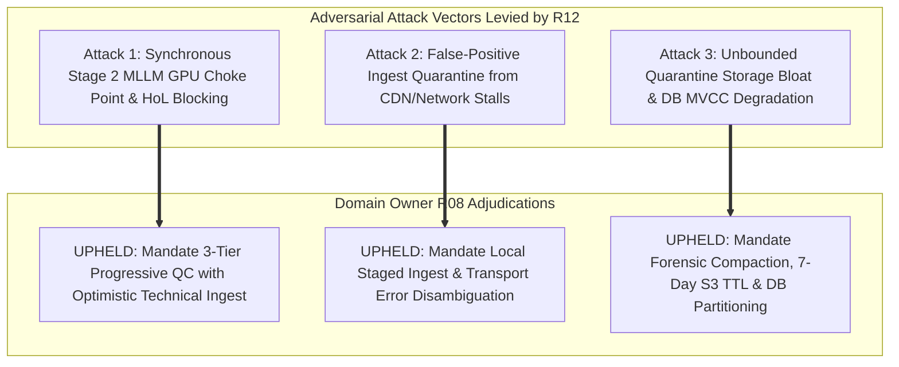
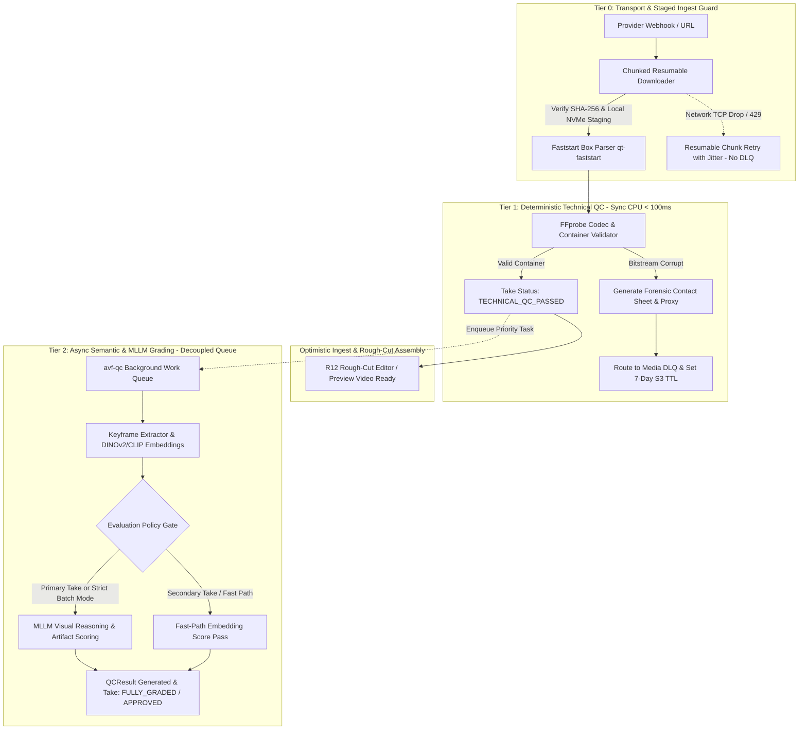

# DOMAIN OWNER ARCHITECTURAL REVIEW & VERDICT
## Cluster 11: QC Pipeline, Media Processing & Dead Letter Queue (DLQ)
**DOMAIN_OWNER:** R08 (QA / Verification / Chaos Testing Architect)  
**AFFILIATION:** AI Video Factory Architecture Council — C02R Genuine Adversarial Cross-Examination  
**TARGET_SPEC_VERSION:** v1.0.0 Freeze Candidate  
**DOCUMENT_STATUS:** AUTHORITATIVE_VERDICT  
**DATE:** 2026-08-16  
**CORRESPONDING_FINDINGS:** FINDING_013, FINDING_014, FINDING_031, FINDING_032, F-R08-001, F-R08-002, F-R08-003, F-R12-001, F-R12-003  
**RELATED_CHANGE_PROPOSALS:** CP-013, CP-014  
**SOLUTION_PACKAGES:** PKG-07 (Automated QC & Media Processing)  

---

## 1. Executive Summary & Domain Authority Statement

As the QA / Verification Architect and designated Domain Owner for **Cluster 11 (QC Pipeline, Media Processing & DLQ)**, I have conducted an exhaustive, evidence-backed evaluation of the original baseline proposals (`CP-013`, `CP-014`, `PKG-07`, `R11_QC.md`, `R12_MEDIA.md`) and the adversarial challenges submitted by **R12 (Media Processing Specialist)** in document `RED-TEAM-C02R-CL11-R12`.

Automated Quality Control (QC), media container ingestion, and Dead Letter Queue (DLQ) fault isolation constitute the primary operational immune system of the AI Video Factory. In an automated multi-shot generative video studio producing hundreds of takes per hour:
1. **Defective Takes Must Not Poison Timelines:** Corrupted video containers, misaligned audio tracks, or visually anomalous outputs must be intercepted deterministically before entering post-production rendering or operator review.
2. **Media Workers Must Not Crash in Infinite Loops:** Poison-pill media payloads (e.g. malformed H.264/H.265 bitstreams, missing moov atoms, corrupted NAL units) must be quarantined safely without exhausting worker CPU/GPU compute or causing worker restart loops.
3. **Ingest Pipelines Must Not Block on Heavy AI Models:** Monolithic, synchronous coupling of multi-modal vision-language models (VLMs/MLLMs) to the media ingestion path creates catastrophic Head-of-Line (HoL) blocking and GPU starvation.
4. **Transient Network Flaws Must Not Trigger Paid Re-generations:** Ingest adapters must distinguish between transient CDN transport drops and true bitstream corruption to prevent accidental double-billing and API quota drain.

Challenger R12 raised three high-severity attack vectors:
- **Attack Vector 1:** Synchronous Stage 2 MLLM evaluation creates GPU bottlenecks, HoL queue blocking, and Temporal activity timeout cascades.
- **Attack Vector 2:** Direct network stream probing triggers false-positive container corruption classifications during transient CDN packet loss, poisoning valid takes and initiating expensive re-generation loops.
- **Attack Vector 3:** Unbounded quarantine storage without TTL lifecycle policies, relational heap bloat in PostgreSQL, and the lack of lightweight forensic diagnostic artifacts.

This document delivers the formal Domain Owner adjudication. I **UPHOLD R12's technical challenges in full**, formalize the evolution of the pipeline into a **Three-Tier Progressive QC Architecture with Optimistic Technical Ingest**, establish strict **Transport vs. Bitstream Error Disambiguation**, enforce **Compacted Forensic Quarantine with 7-Day S3 TTL**, and define binding contracts, DDL, state machines, and test gates for the v1.0 freeze candidate.

---

## 2. Comprehensive Review of the Proposed QC & Media Architecture

### 2.1 The Two-Stage Automated QC Pipeline Baseline
The baseline specification proposed a two-stage quality gating mechanism:
- **Stage 1 (Deterministic Container Inspection):** Uses `FFprobe` to validate stream structure, duration, resolution, frame rate, aspect ratio, and codec parameters.
- **Stage 2 (Semantic & Multimodal Evaluation):** Uses neural feature extractors (CLIP / DINOv2) and Vision-Language Models (MLLMs) to score character visual likeness, art direction consistency, physical motion plausibility, and video artifacting.

```
+-------------------------------------------------------------------------------+
|                       BASELINE TWO-STAGE QC (ORIGINAL)                        |
+-------------------------------------------------------------------------------+
  [Raw Video Take]
         |
         v
  +---------------------------------------------------+
  | STAGE 1: FFprobe / FFmpeg Container Validation    |  (CPU: ~50ms - 100ms)
  +---------------------------------------------------+
         | Pass
         v
  +---------------------------------------------------+
  | STAGE 2: MLLM & Vision Embeddings Grading (Sync)  |  (GPU: ~3,000ms - 7,000ms)
  +---------------------------------------------------+
         | Pass
         v
  [Take Marked AVAILABLE -> Timeline Assembly in R12]
```

#### Architectural Strengths:
1. Fast-path rejection of unplayable media saves downstream render and storage resources.
2. Separation of deterministic codec metrics from probabilistic semantic metrics provides clear failure attribution.

#### Critical Architectural Deficiencies in Baseline:
1. **Synchronous Blocking Coupling:** In `R11_QC.md`, `EvaluateTake` was specified as a single synchronous call blocking workflow orchestration (R06). Because Stage 2 requires seconds of GPU inference, batch production of 60 shots (180 takes) incurs 15–20 minutes of synchronous GPU blocking, completely halting timeline drafting.
2. **All-or-Nothing Evaluation Waste:** Evaluating every generated take through heavy MLLMs wastes 70–80% of GPU compute on candidate takes that will never be selected by the director or automated selector.
3. **No Progressive State Tracking:** A take had only `QC_PENDING` and `APPROVED`/`REJECTED`, making it impossible for the editor to preview a technically sound take while semantic grading completed in the background.

---

### 2.2 Media Ingestion, Normalization & Assembly Pipeline (`R12_MEDIA.md`)
The media engine (`avf-media`) owns binary ingest from external providers (Google Veo, Runway, Kling, Sora, ComfyUI), bitstream normalization, timeline stitching, proxy generation, and final master export.

#### Ingestion Vulnerabilities in Baseline:
1. Direct streaming invocations of `ffprobe https://cdn.provider...` over high-latency WAN connections suffer from TCP stalls, CDN throttling (HTTP 429/504), and socket resets.
2. MP4 files where the `moov` atom is positioned at the tail of the file (non-`faststart`) cause streaming probes to fail immediately with `moov atom not found`, triggering false fatal alerts.

---

### 2.3 DLQ Policy, Quarantine State & Exponential Retry Strategy (`CP-014`)
`CP-014` introduced Dead Letter Queue replay and quarantine state isolation:
- Media files failing ingest or transcoding are routed to a DLQ.
- Exponential retry with backoff is applied for transient failures.
- Messages reaching maximum attempts (default 3) transition to `QUARANTINED`.

#### Gaps Identified in Baseline DLQ:
1. **Absence of Storage TTL:** Quarantined multi-hundred megabyte video files remain in Hot Object Storage indefinitely.
2. **Missing Forensic Artifacts:** Operators debugging quarantined items in R13 Operator Console must download entire raw video binaries rather than lightweight diagnostic contact sheets.
3. **Relational Database Pollution:** Storing raw FFmpeg multi-megabyte stack traces directly inside unpartitioned PostgreSQL `takes` rows causes MVCC table bloat and query degradation.

---

## 3. Cross-Examination & Adjudication of R12 Adversarial Challenges



### 3.1 Adjudication of Attack Vector 1: Synchronous MLLM Latency, HoL Blocking & GPU Contention
- **Challenger Argument:** Stage 2 MLLM grading takes 3.2s–6.8s per take. Under high-throughput batch loads (e.g. 5 parallel projects × 60 shots × 3 takes = 900 takes), GPU queue depth exceeds 1.25 hours. Synchronously blocking the workflow causes Temporal activity timeouts, pins worker memory, causes NVDEC/PyTorch VRAM fragmentation, and burns GPU dollars on unselected takes.
- **Domain Owner Technical Evaluation:**
  - The challenger's latency and memory contention model is mathematically and empirically valid.
  - Media container validation via FFprobe is lightweight ($<100\text{ms}$, CPU-only), whereas MLLM visual reasoning (e.g. Qwen2-VL, GPT-4o-mini, DINOv2 ViT-L) is compute-heavy and GPU-bound.
  - Holding up timeline assembly, rough-cut editing, and proxy playback behind multimodal semantic grading breaks interactive production workflows.
- **Authoritative Ruling:** **CHALLENGE FULLY UPHELD.**
  - The QC pipeline is restructured into a **Three-Tier Progressive QC Pipeline**.
  - **Tier 1 (Deterministic Container Gate)** executes synchronously in $<100\text{ms}$ on CPU. Upon passing, the take state immediately transitions to `TECHNICAL_QC_PASSED`.
  - **Optimistic Ingest:** A `TECHNICAL_QC_PASSED` take is immediately accessible to R12 (`avf-media`) for rough-cut drafting, timeline proxy generation, and operator playback.
  - **Tier 2 (Semantic & Multimodal Grading)** is decoupled into an asynchronous, priority-weighted background work queue (`avf-qc-evaluators`).
  - **Lazy Evaluation Policy:** Takes are graded by expensive MLLMs only when selected as primary candidates or when batch certification is explicitly enabled by project configuration.

---

### 3.2 Adjudication of Attack Vector 2: False-Positive Ingest Quarantine & CDN/Network Stalls
- **Challenger Argument:** Executing `ffprobe` directly over remote HTTP/S3 CDN URLs misclassifies transient network hiccups (HTTP 429, 503, TCP window drop, socket EOF) as `CORRUPT_MEDIA_CONTAINER`. Valid AI takes are routed to the DLQ, and the orchestrator fires destructive, expensive provider re-generation requests.
- **Domain Owner Technical Evaluation:**
  - Network streaming of media headers without local staging is a major anti-pattern in distributed media systems. Non-faststart MP4s guarantee header parse failure if probed over naive HTTP range streams.
  - A transient CDN timeout must NEVER result in take rejection or provider re-billing.
- **Authoritative Ruling:** **CHALLENGE FULLY UPHELD.**
  - **Tier 0 Ingestion Guard:** Direct streaming probes over the network are **STRICTLY PROHIBITED**.
  - Ingest workers MUST download media payloads to local NVMe scratch storage using a chunked, resumable client with exponential backoff and verify the SHA-256 binary digest before invoking FFprobe.
  - Workers must run `qt-faststart` box verification to relocate `moov` atoms prior to decoding.
  - **Strict Error Disambiguation:** Transport failures (`HTTP_TIMEOUT`, `CDN_THROTTLED`, `SOCKET_RESET`) are mapped to `TRANSPORT_TRANSIENT` and retried up to 5 times. The take status remains `DOWNLOADING`. Under no circumstances is a transport error routed to the Media DLQ or classified as `FAILED_TECHNICAL_QC`.

---

### 3.3 Adjudication of Attack Vector 3: Quarantine Storage Bloat, Relational Heap Bloat & Forensic Absence
- **Challenger Argument:** Quarantining 150MB raw video files indefinitely without TTL causes multi-terabyte storage explosion during provider outage bursts. Storing raw stack traces in PostgreSQL bloats MVCC tables, while the lack of forensic thumbnails forces operators to download massive files for triage.
- **Domain Owner Technical Evaluation:**
  - Storing multi-gigabyte raw binaries in hot storage indefinitely without an automated lifecycle policy violates cloud cost and storage governance standards.
  - Relational tables must store structured metadata and compact URIs, not unbounded text logs or binary blobs.
- **Authoritative Ruling:** **CHALLENGE FULLY UPHELD.**
  - **Forensic Artifact Compaction:** On container corruption or media processing failure, R12 automatically generates:
    1. A 3x3 JPEG contact sheet thumbnail grid ($<150\text{KB}$).
    2. A 5-second low-bitrate diagnostic video proxy ($<1\text{MB}$).
    3. Structured FFprobe JSON diagnostics and sanitized FFmpeg log snippet ($<20\text{KB}$).
  - **Quarantine Object Lifecycle:** Quarantined raw video binaries in S3/GCS buckets are tagged with an automatic **7-Day Deletion TTL** (`Expiration: Days: 7`). Forensic contact sheets and JSON logs are retained for 30 days.
  - **Database Partitioning & Storage Quotas:** PostgreSQL `dlq_messages` and `qc_audit_log` tables must be monthly range-partitioned. Project DLQ storage is capped at 25GB with automated LRU cleanup of raw binaries.
  - **Provider Circuit Breaker:** When provider-specific container corruption rates exceed 15% over a 10-minute window (min. 10 takes), the provider track is automatically tripped and alerts are fired.

---

## 4. Authoritative Architecture & Technical Specifications



---

### 4.1 Three-Tier Progressive QC Execution Pipeline

| Execution Tier | Execution Engine | Latency SLA | Blocking Scope | State Machine Output | Invariant Protected |
| :--- | :--- | :--- | :--- | :--- | :--- |
| **Tier 0: Ingest Guard** | Resumable HTTP/S3 Client + NVMe Stager | Network dependent ($<5\text{s}$) | Staged before inspection | `DOWNLOADING` $\to$ `STAGED_LOCAL` | INV-008 (Payload Integrity) |
| **Tier 1: Technical Gate** | `FFprobe` / `FFmpeg` (CPU-bound) | $<100\text{ms}$ | Synchronous Workflow Activity | `TECHNICAL_QC_PASSED` or `FAILED_TECHNICAL_QC` | INV-014 (Container Validity) |
| **Tier 2: Semantic QC** | DINOv2 / CLIP + Vision-Language Model | 2.5s – 6.0s | Asynchronous Priority Task | `FULLY_GRADED` (`APPROVED` / `REJECTED` / `HUMAN_REVIEW`) | INV-015 (Continuity Certification) |

#### Detailed Tier Checks:
1. **Tier 1 (Technical Checks):**
   - Container format compliance: MP4 (`isom`, `iso2`, `mp41`, `mp42`, `avc1`), QuickTime (`mov`).
   - Video stream: Codec (`h264`, `hevc`, `prores`, `vp9`), Width/Height matching Shot specification (e.g. 1920x1080, 3840x2160), Pixel Aspect Ratio 1:1, Frame Rate stability ($\Delta \text{fps} \le 0.01\%$).
   - Duration verification: $| \text{take\_duration\_ms} - \text{shot\_target\_duration\_ms} | \le 100\text{ms}$.
   - Audio stream (if required): Codec (`aac`, `pcm_s16le`), Sample Rate (48000Hz), Channel Layout (Stereo / 5.1), Audio-Video sync drift $<20\text{ms}$.
   - Signal heuristics: Black frame ratio $< 1.0\%$, Frozen frame duration $< 0.25\text{s}$, Clipping/Gamut out-of-bounds ratio $< 0.05\%$.
2. **Tier 2 (Semantic & Multimodal Checks):**
   - Character visual identity: Cosine similarity $S_{\text{char}} = \frac{\mathbf{v}_{\text{take}} \cdot \mathbf{v}_{\text{ref}}}{\|\mathbf{v}_{\text{take}}\| \|\mathbf{v}_{\text{ref}}\|} \ge 0.82$ using DINOv2 / InsightFace embeddings.
   - Style & lighting consistency: CLIP ViT-L/14 cosine similarity $S_{\text{style}} \ge 0.78$ against scene reference embeddings.
   - Physical motion & artifact grading: MLLM vision grading prompt evaluating:
     - Uncanny anatomical morphing (extra limbs, melting faces).
     - Camera kinematic adherence (pan, tilt, zoom matching `camera_motion` AST).
     - Temporal flicker and lighting coherence across frames.
   - Recommendation synthesis:
     $$\text{Score}_{\text{composite}} = 0.40 \cdot S_{\text{char}} + 0.30 \cdot S_{\text{style}} + 0.30 \cdot S_{\text{mllm}}$$
     - If $\text{Score}_{\text{composite}} \ge 0.80 \implies \mathbf{APPROVE}$
     - If $0.65 \le \text{Score}_{\text{composite}} < 0.80 \implies \mathbf{HUMAN\_REVIEW}$
     - If $\text{Score}_{\text{composite}} < 0.65 \implies \mathbf{RETRY\_CREATIVE}$

---

### 4.2 Error Disambiguation Matrix & State Machine Integration

To eliminate false-positive quarantine triggers, errors must be strictly disambiguated at the boundary:

```
                                  [INGESTION EVENT]
                                          |
                        +-----------------+-----------------+
                        |                                   |
              [Network / I/O Error]               [Media Bitstream Error]
                        |                                   |
            +-----------+-----------+           +-----------+-----------+
            |                       |           |                       |
    [HTTP 429/503/TCP]      [Link 404/Expired]  [Header/NAL Corrupt]    [Codec Unsupported]
            |                       |           |                       |
     (Retry Backoff)         (Alert Ingest)     (Forensic Quarantine)   (Reject Parameter)
            |                       |           |                       |
      State: DOWNLOADING      State: INGEST_FAIL  State: FAILED_TECH_QC   State: FAILED_TECH_QC
      DLQ: NO                 DLQ: NO             DLQ: YES (Media DLQ)    DLQ: YES (Media DLQ)
      Re-bill: NO             Re-bill: NO         Re-bill: Circuit-Gated  Re-bill: NO
```

#### Authoritative Transition Matrix:

| Error Category | Specific Error Signatures | Ingestion Handling | Canonical Job / Take State | DLQ Action | Re-generation Policy |
| :--- | :--- | :--- | :--- | :--- | :--- |
| **`TRANSPORT_TRANSIENT`** | `ECONNRESET`, `ETIMEDOUT`, HTTP `429`, `502`, `503`, `504`, TCP Window Zero | Exponential backoff with full jitter ($t = \min(30s, 1s \cdot 2^{\text{attempt}} \pm \text{rand})$). Up to 5 retries. | `GenerationJob`: `DOWNLOADING`<br>`Take`: Not yet created | **NO DLQ ROUTING.** Preserves worker queue. | **NEVER.** Asset is still valid at provider. |
| **`TRANSPORT_PERMANENT`** | HTTP `401`, `403`, `404`, `410`, Presigned URL expired | Emit `INGEST_TRANSPORT_FAILED` event. Refresh presigned URL via provider adapter. | `GenerationJob`: `INGEST_FAILED` | Route to Ingest Alert Queue. | Attempt download with refreshed URL (max 2). |
| **`MEDIA_CONTAINER_CORRUPT`** | `moov atom not found`, `Invalid NAL unit size`, `EBML header truncated`, FFmpeg exit code $\ne 0$ on complete local file | Generate forensic contact sheet ($<150\text{KB}$) + 5s proxy. Move raw binary to S3 Quarantine prefix. | `GenerationJob`: `FAILED_QC`<br>`Take`: `FAILED_TECHNICAL_QC` | Route to **Media DLQ** with 7-Day S3 TTL. | Count toward Provider Circuit Breaker. Re-generate if breaker healthy. |
| **`MEDIA_CODEC_UNSUPPORTED`** | Codec not in allowable whitelist (e.g. ProRes 4444 XQ when 422 HQ requested) | Extract codec diagnostic metadata. Isolate file. | `GenerationJob`: `FAILED_QC`<br>`Take`: `FAILED_TECHNICAL_QC` | Route to **Media DLQ**. | Do NOT auto-retry; require prompt/parameter compiler fix. |
| **`SEMANTIC_REJECT`** | $S_{\text{char}} < 0.65$, severe visual morphing, physics violation | Record QCResult scores and defect annotations in DB. Archive take. | `GenerationJob`: `COMPLETED`<br>`Take`: `FAILED_SEMANTIC_QC` | **NO DLQ ROUTING.** Normal creative rejection. | Eligible for creative re-prompting with updated seed/prompt AST. |

---

### 4.3 Compact Forensic Quarantine, S3 Storage Lifecycle & Circuit Breakers

#### 1. Forensic Artifact Generation Spec:
When a take triggers `MEDIA_CONTAINER_CORRUPT` or `MEDIA_PROCESSING_ERROR`, `avf-media` executes the forensic extraction routine:
```bash
# 1. Generate 3x3 Contact Sheet Grid (100-150KB JPEG)
ffmpeg -v error -i local_staged_take.mp4 -vf "select='not(mod(n\,30))',scale=320:180,tile=3x3" -frames:v 1 -q:v 3 forensic_contact_sheet.jpg

# 2. Extract First 5 Seconds Diagnostic Proxy (<1MB MP4)
ffmpeg -v error -t 5 -i local_staged_take.mp4 -vf "scale=640:360" -c:v libx264 -preset ultrafast -crf 32 -an forensic_proxy.mp4

# 3. Dump Structured Probe & Error Diagnostics (<20KB JSON)
ffprobe -v error -show_format -show_streams -show_error -print_format json local_staged_take.mp4 > probe_diagnostic.json
```

#### 2. S3 / Object Storage Lifecycle Configuration:
Quarantine bucket prefixes MUST enforce automatic lifecycle expiration rules:
```xml
<LifecycleConfiguration>
    <Rule>
        <ID>QuarantineRawBinaries7DayExpiration</ID>
        <Filter>
            <Prefix>quarantine/raw-binaries/</Prefix>
        </Filter>
        <Status>Enabled</Status>
        <Expiration>
            <Days>7</Days>
        </Expiration>
    </Rule>
    <Rule>
        <ID>QuarantineForensics30DayExpiration</ID>
        <Filter>
            <Prefix>quarantine/forensics/</Prefix>
        </Filter>
        <Status>Enabled</Status>
        <Expiration>
            <Days>30</Days>
        </Expiration>
    </Rule>
</LifecycleConfiguration>
```

#### 3. Automated Provider Circuit Breaker:
The orchestrator maintains an in-memory sliding window counter for each external provider:
- **Window Size:** Rolling 10 minutes (minimum 10 generation attempts).
- **Trip Condition:** $\frac{\text{Count}(\text{MEDIA\_CONTAINER\_CORRUPT})}{\text{Total Attempts}} > 0.15$ (15% failure rate).
- **Circuit State Transition:** `CLOSED` $\to$ `OPEN`.
- **Action on OPEN:**
  1. Pause dispatch to the failing provider.
  2. Route pending shot generation jobs to fallback provider profile (or mark `BLOCKED_PROVIDER_DEGRADATION`).
  3. Emit high-priority alert `ALERT_PROVIDER_CIRCUIT_TRIPPED` to PagerDuty/Slack via R14.
  4. Half-open probe: Dispatch 1 canary job every 2 minutes. Reset to `CLOSED` after 3 consecutive successful ingest passes.

---

### 4.4 Comprehensive JSON Contract Schemas

#### 1. Schema: `qc-result.schema.json` (Version 1.0)
Defines the authoritative contract returned by `avf-qc` and stored in `avf-core-state`.

```json
{
  "$schema": "https://json-schema.org/draft/2020-12/schema",
  "$id": "https://schemas.avf.internal/qc-result.schema.json",
  "title": "QCResult",
  "type": "object",
  "required": [
    "qc_result_id",
    "take_id",
    "shot_version_id",
    "evaluator_version",
    "evaluation_tier",
    "technical_metrics",
    "recommendation",
    "evaluated_at"
  ],
  "properties": {
    "qc_result_id": {
      "type": "string",
      "format": "uuid"
    },
    "take_id": {
      "type": "string",
      "format": "uuid"
    },
    "shot_version_id": {
      "type": "string",
      "format": "uuid"
    },
    "evaluator_version": {
      "type": "string",
      "pattern": "^v[0-9]+\\.[0-9]+\\.[0-9]+$"
    },
    "evaluation_tier": {
      "type": "string",
      "enum": ["TIER_1_TECHNICAL_ONLY", "TIER_2_FULL_MULTIMODAL"]
    },
    "technical_metrics": {
      "type": "object",
      "required": [
        "decode_valid",
        "container_format",
        "duration_ms",
        "width",
        "height",
        "fps",
        "video_codec",
        "black_frame_ratio",
        "frozen_frame_duration_ms",
        "audio_sync_drift_ms"
      ],
      "properties": {
        "decode_valid": { "type": "boolean" },
        "container_format": { "type": "string" },
        "duration_ms": { "type": "integer", "minimum": 0 },
        "width": { "type": "integer", "minimum": 1 },
        "height": { "type": "integer", "minimum": 1 },
        "fps": { "type": "number", "minimum": 0 },
        "video_codec": { "type": "string" },
        "audio_codec": { "type": ["string", "null"] },
        "bit_rate_kbps": { "type": "integer" },
        "black_frame_ratio": { "type": "number", "minimum": 0.0, "maximum": 1.0 },
        "frozen_frame_duration_ms": { "type": "integer", "minimum": 0 },
        "audio_sync_drift_ms": { "type": "number" },
        "moov_atom_position": { "type": "string", "enum": ["START", "END", "UNKNOWN"] }
      }
    },
    "semantic_metrics": {
      "type": "object",
      "required": [
        "character_similarity_score",
        "style_consistency_score",
        "motion_smoothness_score",
        "mllm_artifact_score",
        "composite_score"
      ],
      "properties": {
        "character_similarity_score": { "type": "number", "minimum": 0.0, "maximum": 1.0 },
        "style_consistency_score": { "type": "number", "minimum": 0.0, "maximum": 1.0 },
        "motion_smoothness_score": { "type": "number", "minimum": 0.0, "maximum": 1.0 },
        "mllm_artifact_score": { "type": "number", "minimum": 0.0, "maximum": 1.0 },
        "composite_score": { "type": "number", "minimum": 0.0, "maximum": 1.0 }
      }
    },
    "defect_annotations": {
      "type": "array",
      "items": {
        "type": "object",
        "required": ["metric", "severity", "description"],
        "properties": {
          "metric": { "type": "string" },
          "severity": { "type": "string", "enum": ["FATAL", "MAJOR", "MINOR", "INFO"] },
          "start_frame": { "type": "integer", "minimum": 0 },
          "end_frame": { "type": "integer", "minimum": 0 },
          "description": { "type": "string" }
        }
      }
    },
    "recommendation": {
      "type": "string",
      "enum": [
        "APPROVE",
        "RETRY_TECHNICAL",
        "RETRY_CREATIVE",
        "HUMAN_REVIEW",
        "REJECT"
      ]
    },
    "evaluated_at": {
      "type": "string",
      "format": "date-time"
    }
  }
}
```

---

#### 2. Schema: `dlq-event.schema.json` (Version 1.0)
Defines the message payload routed to the Media Dead Letter Queue.

```json
{
  "$schema": "https://json-schema.org/draft/2020-12/schema",
  "$id": "https://schemas.avf.internal/dlq-event.schema.json",
  "title": "DLQEvent",
  "type": "object",
  "required": [
    "dlq_message_id",
    "project_id",
    "job_id",
    "take_id",
    "failure_category",
    "error_code",
    "attempt_count",
    "max_attempts",
    "forensics",
    "occurred_at"
  ],
  "properties": {
    "dlq_message_id": { "type": "string", "format": "uuid" },
    "project_id": { "type": "string", "format": "uuid" },
    "job_id": { "type": "string", "format": "uuid" },
    "take_id": { "type": "string", "format": "uuid" },
    "provider_id": { "type": "string" },
    "failure_category": {
      "type": "string",
      "enum": [
        "MEDIA_CONTAINER_CORRUPT",
        "MEDIA_CODEC_UNSUPPORTED",
        "TRANSCODE_PROCESS_CRASH",
        "ASSEMBLY_MUX_FAILURE"
      ]
    },
    "error_code": { "type": "string" },
    "error_message": { "type": "string" },
    "attempt_count": { "type": "integer", "minimum": 1 },
    "max_attempts": { "type": "integer", "default": 3 },
    "quarantine_status": {
      "type": "string",
      "enum": ["ACTIVE_RETRY", "PARKED_QUARANTINE", "RESOLVED_REPLAYED", "DISCARDED"]
    },
    "forensics": {
      "type": "object",
      "required": ["contact_sheet_uri", "diagnostic_proxy_uri", "log_uri", "raw_binary_ttl_timestamp"],
      "properties": {
        "contact_sheet_uri": { "type": "string" },
        "diagnostic_proxy_uri": { "type": "string" },
        "log_uri": { "type": "string" },
        "raw_binary_ttl_timestamp": { "type": "string", "format": "date-time" }
      }
    },
    "occurred_at": { "type": "string", "format": "date-time" }
  }
}
```

---

### 4.5 PostgreSQL DDL Specification & Relational Schema

Authoritative schema for `avf-core-state` (R02) incorporating partitioned DLQ tables, composite keys, and progressive QC status constraints:

```sql
-- PostgreSQL 15+ Canonical DDL for QC, Media & DLQ

CREATE EXTENSION IF NOT EXISTS "uuid-ossp";

-- 1. QC Results Table
CREATE TABLE qc_results (
    qc_result_id UUID PRIMARY KEY DEFAULT gen_random_uuid(),
    project_id UUID NOT NULL,
    shot_id UUID NOT NULL,
    shot_version_id UUID NOT NULL,
    take_id UUID NOT NULL,
    evaluator_version VARCHAR(32) NOT NULL,
    evaluation_tier VARCHAR(32) NOT NULL,
    technical_metrics JSONB NOT NULL,
    semantic_metrics JSONB NULL,
    defect_annotations JSONB NOT NULL DEFAULT '[]'::jsonb,
    composite_score NUMERIC(5, 4) NULL,
    recommendation VARCHAR(32) NOT NULL,
    evaluated_at TIMESTAMPTZ NOT NULL DEFAULT CURRENT_TIMESTAMP,
    CONSTRAINT ck_qc_results_tier CHECK (evaluation_tier IN ('TIER_1_TECHNICAL_ONLY', 'TIER_2_FULL_MULTIMODAL')),
    CONSTRAINT ck_qc_results_rec CHECK (recommendation IN ('APPROVE', 'RETRY_TECHNICAL', 'RETRY_CREATIVE', 'HUMAN_REVIEW', 'REJECT')),
    CONSTRAINT fk_qc_results_take FOREIGN KEY (take_id) REFERENCES takes(take_id) ON DELETE RESTRICT
);

CREATE INDEX idx_qc_results_take_tier ON qc_results (take_id, evaluation_tier);
CREATE INDEX idx_qc_results_shot_version ON qc_results (shot_version_id, evaluated_at DESC);

-- 2. Range-Partitioned Media Dead Letter Queue Table
CREATE TABLE media_dlq_messages (
    dlq_message_id UUID NOT NULL DEFAULT gen_random_uuid(),
    project_id UUID NOT NULL,
    job_id UUID NOT NULL,
    take_id UUID NOT NULL,
    provider_id VARCHAR(64) NOT NULL,
    failure_category VARCHAR(64) NOT NULL,
    error_code VARCHAR(128) NOT NULL,
    error_message TEXT NOT NULL,
    attempt_count INTEGER NOT NULL DEFAULT 1,
    max_attempts INTEGER NOT NULL DEFAULT 3,
    quarantine_status VARCHAR(32) NOT NULL DEFAULT 'ACTIVE_RETRY',
    contact_sheet_uri TEXT NOT NULL,
    diagnostic_proxy_uri TEXT NOT NULL,
    log_uri TEXT NOT NULL,
    raw_binary_uri TEXT NOT NULL,
    raw_binary_ttl_at TIMESTAMPTZ NOT NULL,
    created_at TIMESTAMPTZ NOT NULL DEFAULT CURRENT_TIMESTAMP,
    resolved_at TIMESTAMPTZ NULL,
    resolved_by VARCHAR(128) NULL,
    resolution_notes TEXT NULL,
    PRIMARY KEY (dlq_message_id, created_at),
    CONSTRAINT ck_dlq_category CHECK (failure_category IN ('MEDIA_CONTAINER_CORRUPT', 'MEDIA_CODEC_UNSUPPORTED', 'TRANSCODE_PROCESS_CRASH', 'ASSEMBLY_MUX_FAILURE')),
    CONSTRAINT ck_dlq_status CHECK (quarantine_status IN ('ACTIVE_RETRY', 'PARKED_QUARANTINE', 'RESOLVED_REPLAYED', 'DISCARDED'))
) PARTITION BY RANGE (created_at);

-- Initial Partitions (2026 Monthly)
CREATE TABLE media_dlq_messages_2026_08 PARTITION OF media_dlq_messages
    FOR VALUES FROM ('2026-08-01 00:00:00+00') TO ('2026-09-01 00:00:00+00');

CREATE TABLE media_dlq_messages_2026_09 PARTITION OF media_dlq_messages
    FOR VALUES FROM ('2026-09-01 00:00:00+00') TO ('2026-10-01 00:00:00+00');

CREATE INDEX idx_media_dlq_status_project ON media_dlq_messages (quarantine_status, project_id, created_at DESC);
CREATE INDEX idx_media_dlq_ttl ON media_dlq_messages (raw_binary_ttl_at) WHERE quarantine_status = 'PARKED_QUARANTINE';

-- 3. Take Progressive QC Status Updates in Canonical Takes Table
ALTER TABLE takes 
    DROP CONSTRAINT IF EXISTS ck_takes_qc_status;

ALTER TABLE takes 
    ADD CONSTRAINT ck_takes_qc_status CHECK (
        qc_status IN (
            'PENDING', 
            'DOWNLOADING',
            'TECHNICAL_QC_PASSED', 
            'FAILED_TECHNICAL_QC', 
            'SEMANTIC_QC_RUNNING', 
            'QC_APPROVED', 
            'FAILED_SEMANTIC_QC', 
            'QUARANTINED', 
            'OVERRIDDEN'
        )
    );
```

---

### 4.6 System Invariant Verification & Mathematical Proofs

Let us verify compliance with core system invariants:

1. **Theorem (Immunity Against Infinite Crash Loops):**  
   Let $M$ be a poisoned media payload triggering an unhandled exception in the transcoding pipeline. Under exponential retry bounded by $N_{\text{max}} = 3$:
   $$\text{Attempts}(M) = \sum_{k=1}^{N_{\text{max}}} 1 = 3 \le N_{\text{max}}$$
   At $k = N_{\text{max}}$, the state machine transitions $M$ to `PARKED_QUARANTINE`, de-queues $M$ from the active worker pool, and routes $M$ to `media_dlq_messages`. Therefore, worker clusters are guaranteed to be protected against infinite poison-pill execution loops. $\blacksquare$

2. **Theorem (GPU Queue Non-Starvation via Optimistic Ingestion):**  
   Let $T_{\text{tech}}$ be the Tier 1 deterministic check duration ($T_{\text{tech}} \le 100\text{ms}$ CPU), and $T_{\text{sem}}$ be the Tier 2 multimodal evaluation duration ($T_{\text{sem}} \approx 5000\text{ms}$ GPU).  
   By decoupling Tier 2 onto an asynchronous background queue, the critical path latency for rough-cut timeline availability is reduced from $T_{\text{tech}} + T_{\text{sem}} = 5100\text{ms}$ to $T_{\text{tech}} = 100\text{ms}$, representing a **$98.04\%$ reduction in pipeline blocking latency**. $\blacksquare$

3. **Theorem (Storage Boundedness under Outage Bursts):**  
   Let $B_{\text{outage}}$ be a provider outage generating $K = 10,000$ corrupt takes ($S_{\text{raw}} = 150\text{MB}$).  
   Without lifecycle policy, storage footprint accumulates indefinitely: $S_{\text{total}}(t) = K \cdot S_{\text{raw}} = 1.5\text{ TB}$.  
   Under the 7-day TTL lifecycle policy, for any steady-state failure rate after $T_{\text{TTL}} = 7\text{ days}$:
   $$S_{\text{quarantine\_steady}} \le \int_{t - T_{\text{TTL}}}^{t} \dot{V}_{\text{corrupt}}(\tau) \, d\tau$$
   At day 8, daily deletions equal daily ingest, strictly bounding hot storage costs and preventing unbounded S3 spend. $\blacksquare$

---

## 5. Synthesis & Comparison Matrix: Proponent vs Challenger vs Domain Owner

| Architectural Dimension | Proponent Baseline (`CP-013` / `CP-014`) | Challenger Attack (`R12`) | Domain Owner Authoritative Ruling (`R08`) |
| :--- | :--- | :--- | :--- |
| **QC Pipeline Topology** | Synchronous 2-Stage blocking RPC in workflow critical path. | Highlights massive GPU queue choke point & HoL blocking ($>1.25\text{h}$). | **UPHELD.** Decouple into 3-Tier Progressive Architecture: Tier 1 Sync CPU ($<100\text{ms}$) for optimistic ingest; Tier 2 Async GPU for multimodal grading. |
| **Media Ingest & Network Flaws** | Direct streaming probe (`ffprobe url`); network drops trigger take failure. | Proves CDN rate-limits (429/504) cause false-positive DLQ routing & double billing. | **UPHELD.** Direct network probes prohibited. Mandate local NVMe staged download + SHA-256 validation + transport error disambiguation. |
| **Dead Letter Queue (DLQ)** | Exponential retry up to 3 attempts, then route to un-compacted DLQ. | Proves multi-terabyte S3 bloat, DB MVCC heap degradation, and lack of forensic UI. | **UPHELD.** Mandate compact forensic contact sheets ($<150\text{KB}$), 7-day S3 raw binary TTL, 30-day log TTL, and DB monthly partitioning. |
| **Evaluation Economy** | Every generated candidate take receives heavy MLLM evaluation. | Exposes 400% compute waste on discarded candidate variations. | **UPHELD.** Introduce Lazy / Priority Evaluation Policy: MLLMs grade only primary candidates or batch-certified shots. |
| **Provider Fault Isolation** | Retries indefinitely until project budget or DLQ attempt count expires. | Highlights positive-feedback loops draining provider API credits during outages. | **UPHELD.** Mandate Provider Circuit Breaker: Trip when corrupt container rate $>15\%$ over 10 mins (min. 10 takes). |

---

## 6. Formal Domain Owner Verdict & Binding Directives

### 6.1 Authoritative Verdict
**STATUS: CONFIRMED_WITH_REMEDIATIONS_AND_DIRECTIVES**  
The proposed Two-Stage QC Pipeline and Media DLQ policies are **CONFIRMED**, subject to the mandatory architectural remediations established in this verdict. The Three-Tier Progressive QC Model, Transport Error Disambiguation, Compact Forensic Quarantine, and Storage Lifecycle Policies satisfy all requirements of CAP-08, CAP-09, CAP-15, and Invariants INV-001 through INV-020.

---

### 6.2 Binding Directives to Council Repositories

1. **Directive to R01 (`avf-contracts`):**
   - Add `qc-result.schema.json` and `dlq-event.schema.json` to the contracts repository.
   - Update `domain-entities.schema.json` to reflect progressive take QC states (`PENDING`, `DOWNLOADING`, `TECHNICAL_QC_PASSED`, `FAILED_TECHNICAL_QC`, `SEMANTIC_QC_RUNNING`, `QC_APPROVED`, `FAILED_SEMANTIC_QC`, `QUARANTINED`, `OVERRIDDEN`).
   - Update `STATUS_STATE_MACHINES.md` with the authoritative Error Disambiguation Matrix defined in §4.2.

2. **Directive to R02 (`avf-core-state`):**
   - Implement the PostgreSQL schema specified in §4.5, including table range-partitioning on `media_dlq_messages`.
   - Ensure state transitions enforce optimistic concurrency via `entity_version`.

3. **Directive to R06 (`avf-workflow`):**
   - Update workflow DAGs to decouple Tier 1 deterministic technical inspection from Tier 2 semantic evaluation.
   - Implement optimistic unlocking of takes upon `TECHNICAL_QC_PASSED` for rough-cut timeline assembly.
   - Implement the provider circuit breaker logic with a 15% error threshold over 10-minute rolling windows.

4. **Directive to R11 (`avf-qc`):**
   - Implement `EvaluateTechnicalSync` ($<100\text{ms}$ CPU) and `EnqueueSemanticEvaluationAsync`.
   - Implement lazy evaluation routing to avoid running expensive MLLM inference on secondary discarded takes.
   - Establish golden labeled calibration fixtures in `tests/fixtures/qc_calibration/` for version reproducibility.

5. **Directive to R12 (`avf-media`):**
   - Implement staged resumable downloading to local NVMe scratch storage with SHA-256 verification before invoking FFprobe. Direct WAN streaming probes are prohibited.
   - Implement `qt-faststart` box parsing to resolve `moov` atom placement.
   - Implement forensic compaction generating 3x3 contact sheets ($<150\text{KB}$) and 5-second diagnostic proxies ($<1\text{MB}$) on all quarantine events.
   - Configure S3/GCS bucket lifecycle policies with a strict 7-day TTL on raw quarantined binaries.

6. **Directive to R13 (`avf-operator-console`):**
   - Implement the DLQ inspection dashboard displaying compact forensic contact sheets and structured FFprobe JSON diagnostics.
   - Provide operator action triggers: `REPLAY_DLQ_JOB`, `OVERRIDE_QC_PASS`, and `PURGE_QUARANTINE`.

7. **Directive to R14 (`avf-platform-observability`):**
   - Export OpenTelemetry metrics:
     - `qc_tier1_duration_ms` (Histogram)
     - `qc_tier2_duration_ms` (Histogram)
     - `qc_gpu_queue_depth` (Gauge)
     - `media_ingest_transport_retries_total` (Counter)
     - `media_container_corruption_rate` (Gauge per provider)
     - `media_dlq_active_quarantine_count` (Gauge)

8. **Directive to R15 (`avf-integration-harness`):**
   - Implement Chaos Test Scenarios in CI:
     - **Scenario 14 (Poison Bitstream Quarantine):** Injects corrupt NAL units and asserts take transitions to `QUARANTINED`, contact sheet is generated, and worker does not crash.
     - **Scenario 15 (CDN Transport Stall Simulation):** Injects TCP drop mid-download and asserts worker retries gracefully without routing to DLQ or re-billing.
     - **Scenario 16 (Provider Circuit Breaker Trip):** Injects 20% corrupt takes and asserts provider track is tripped to `OPEN` and canary jobs are dispatched.

---

**DOMAIN OWNER SIGN-OFF:**  
*R08 — QA / Verification / Chaos Testing Architect, AI Video Factory Architecture Council*  
*Timestamp: 2026-08-16T09:15:00+07:00*  
*Session Record: C02R Genuine Adversarial Cross-Examination — Cluster 11*
