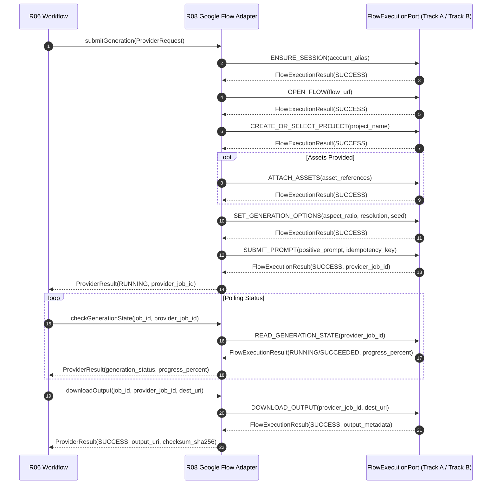

# IMPLEMENTATION SIMULATION REPORT: R08 — GOOGLE FLOW ADAPTER (`avf-google-flow-adapter`)
**AGENT:** Autonomous Fresh Implementation Coding Agent  
**TARGET_REPOSITORY:** `avf-google-flow-adapter` (R08)  
**ARCHITECTURAL_LAYER:** Layer 3 (Provider & Execution Adapters)  
**UPSTREAM_CONTRACTS:** `R07_PROVIDER_SDK` (`provider-request.schema.json`, `provider-result.schema.json`)  
**DOWNSTREAM_CONTRACTS:** `R01_CONTRACTS` (`browser-command.schema.json`, `flow-execution-result.schema.json`, `event-envelope.schema.json`)  
**DATE:** 2026-08-15  
**EVALUATION_RESULT:** ZERO_ARCHITECTURAL_INVENTIONS_REQUIRED  

---

## 1. Executive Summary & Repository Scope

`avf-google-flow-adapter` (R08) serves as the dedicated provider adapter for Google Flow video generation within the AI Video Factory (AVF) platform. It sits squarely in **Architectural Layer 3**, bridging upstream high-level workflow orchestration (R06 Workflow via R07 Provider SDK) and downstream execution implementations (R09 Browser Worker for Track A and R10 FlowKit Bridge for Track B).

### Core Responsibilities
1. **Contract Implementation:** Implements the `VideoGenerationProvider` interface defined in `R07_PROVIDER_SDK`.
2. **Command Decomposition & Serialization:** Translates canonical `ProviderRequest` payloads into deterministic sequences of the 10 discriminated `FlowExecutionPort` commands specified in `browser-command.schema.json`.
3. **Execution Track Routing:** Routes commands dynamically to Track A (Chrome Extension MV3 / Native Messaging / Playwright) or Track B (FlowKit Bridge) without altering upstream contracts (preserving Invariant INV-020).
4. **Response & Status Parsing:** Consumes discriminated execution outputs defined in `flow-execution-result.schema.json` and synthesizes canonical `ProviderResult` objects.
5. **Error Normalization & Safety Pauses:** Normalizes execution anomalies into the 9 standard AVF error codes, strictly enforcing policy pauses on authentication challenges and CAPTCHAs without automated bypass logic (preserving Invariant INV-012).
6. **Observability & Trace Propagation:** Injects OpenTelemetry distributed tracing context (`trace_id`, `span_id`, `correlation_id`) across all command envelopes and redacts sensitive credentials.

### Boundaries & Explicit Non-Ownership
- **NO Database Access:** Does not connect directly to PostgreSQL or SQLite (preserving Invariants INV-005, INV-008, INV-013). Canonical state resides exclusively in R02 Core State.
- **NO Browser DOM Manipulation:** Does not execute Puppeteer/Playwright scripts or inject Chrome extension content scripts directly (owned by R09 Browser Worker).
- **NO FlowKit Internal Coupling:** Does not import FlowKit SQLite models, queue entities, or private endpoint structures (owned by R10 FlowKit Bridge).
- **NO Video Transcoding / Media Assembly:** Media processing is deferred to R12 Media Service.

---

## 2. Architecture & File Structure

The repository is organized as a modular TypeScript package adhering strictly to Layer 3 dependency constraints:

```
avf-google-flow-adapter/
├── package.json
├── tsconfig.json
├── README.md
├── src/
│   ├── index.ts                            # Public module entrypoint (exports GoogleFlowAdapter & config)
│   ├── types/
│   │   ├── adapter-config.ts               # Configuration schema (timeouts, default track, account pools)
│   │   └── session.ts                      # Ephemeral session tracking interfaces
│   ├── client/
│   │   ├── flow-execution-port.ts          # FlowExecutionPort interface definition
│   │   ├── flow-execution-client.ts        # IPC/RPC dispatcher enforcing schema validation
│   │   ├── track-a-transport.ts            # Client transport connecting to R09 Browser Worker
│   │   ├── track-b-transport.ts            # Client transport connecting to R10 FlowKit Bridge
│   │   └── mock-transport.ts               # In-memory simulator for unit & conformance testing
│   ├── commands/
│   │   ├── command-builder.ts              # Builder for 10 discriminated BrowserCommand payloads
│   │   ├── command-validator.ts            # Runtime validator using Ajv against browser-command.schema.json
│   │   └── command-types.ts                # Strongly typed command and param interfaces
│   ├── session/
│   │   ├── session-manager.ts              # Session lifecycle, account aliasing, and lease tracking
│   │   └── session-store.ts                # Ephemeral in-memory session registry with thread safety
│   ├── router/
│   │   └── execution-router.ts             # Strategy router dispatching to Track A, Track B, or Mock
│   ├── normalizer/
│   │   ├── error-normalizer.ts             # 9-code error mapper with retry categorization & backoff
│   │   └── result-mapper.ts                # Maps FlowExecutionResult to canonical ProviderResult
│   ├── safety/
│   │   └── safety-pause-handler.ts         # INV-012 enforcement (halt on AUTH_REQUIRED / SECURITY_CHALLENGE)
│   ├── adapter/
│   │   ├── google-flow-adapter.ts          # Main VideoGenerationProvider implementation
│   │   └── generation-pipeline.ts          # Sequential multi-step execution coordinator
│   └── telemetry/
│       ├── tracing.ts                      # OTel span lifecycle & correlation propagation
│       └── metrics.ts                      # Operation counters, latencies, and error rate metrics
└── test/
    ├── unit/
    │   ├── command-builder.test.ts
    │   ├── error-normalizer.test.ts
    │   ├── safety-pause-handler.test.ts
    │   ├── session-manager.test.ts
    │   └── execution-router.test.ts
    ├── conformance/
    │   ├── contract-conformance.test.ts    # Ajv validation of all emitted and consumed payloads
    │   └── standard-error-taxonomy.test.ts # Exhaustive 9-code error mapping tests
    └── fixtures/
        ├── sample-provider-requests.ts
        ├── sample-browser-commands.ts
        └── sample-flow-results.ts
```

---

## 3. Concrete Implementation Plan

### Step 1: Interface Definitions & FlowExecutionPort Client

The adapter implements the `VideoGenerationProvider` interface from `R07_PROVIDER_SDK` while consuming the `FlowExecutionPort` from `R01_CONTRACTS`.

```typescript
// src/client/flow-execution-port.ts
import { BrowserCommand, FlowExecutionResult } from '@avf/contracts';

export interface FlowExecutionPort {
  executeCommand(command: BrowserCommand): Promise<FlowExecutionResult>;
  ping(sessionId: string): Promise<boolean>;
  closeSession(sessionId: string): Promise<void>;
}
```

```typescript
// src/adapter/google-flow-adapter.ts
import { VideoGenerationProvider, ProviderRequest, ProviderResult } from '@avf/provider-sdk';
import { ExecutionRouter } from '../router/execution-router';
import { GenerationPipeline } from './generation-pipeline';
import { ErrorNormalizer } from '../normalizer/error-normalizer';
import { TracingHelper } from '../telemetry/tracing';

export class GoogleFlowAdapter implements VideoGenerationProvider {
  public readonly providerId: string = 'google-flow';

  constructor(
    private readonly router: ExecutionRouter,
    private readonly pipeline: GenerationPipeline,
    private readonly errorNormalizer: ErrorNormalizer,
    private readonly tracer: TracingHelper
  ) {}

  public async submitGeneration(request: ProviderRequest): Promise<ProviderResult> {
    return this.tracer.withSpan('GoogleFlowAdapter.submitGeneration', async (span) => {
      span.setAttribute('job_id', request.job_id);
      span.setAttribute('request_id', request.request_id);
      span.setAttribute('idempotency_key', request.idempotency_key);

      try {
        const client = this.router.resolveClient(request);
        return await this.pipeline.executeGenerationSequence(client, request);
      } catch (error) {
        return this.errorNormalizer.toProviderResultError(request, error);
      }
    });
  }

  public async checkGenerationState(jobId: string, providerJobId: string): Promise<ProviderResult> {
    return this.tracer.withSpan('GoogleFlowAdapter.checkGenerationState', async (span) => {
      span.setAttribute('job_id', jobId);
      span.setAttribute('provider_job_id', providerJobId);

      try {
        const client = this.router.getDefaultClient();
        return await this.pipeline.checkState(client, jobId, providerJobId);
      } catch (error) {
        return this.errorNormalizer.toStateCheckError(jobId, providerJobId, error);
      }
    });
  }

  public async cancelGeneration(jobId: string, providerJobId: string, reason?: string): Promise<ProviderResult> {
    return this.tracer.withSpan('GoogleFlowAdapter.cancelGeneration', async (span) => {
      try {
        const client = this.router.getDefaultClient();
        return await this.pipeline.cancel(client, jobId, providerJobId, reason);
      } catch (error) {
        return this.errorNormalizer.toCancelError(jobId, providerJobId, error);
      }
    });
  }
}
```

---

### Step 2: Serialization of the 10 Discriminated Commands

`CommandBuilder` constructs strongly typed, validated payloads compliant with `browser-command.schema.json`. Every command generates a deterministic UUID `command_id`, attaches the current UTC ISO timestamp, and enforces schema parameter invariants.

```typescript
// src/commands/command-builder.ts
import { v4 as uuidv4 } from 'uuid';
import { BrowserCommand } from '@avf/contracts';

export class CommandBuilder {
  public static ensureSession(sessionId: string, accountAlias: string, headless = false, profileDir?: string): BrowserCommand {
    return {
      command_id: uuidv4(),
      session_id: sessionId,
      command_type: 'ENSURE_SESSION',
      timestamp_utc: new Date().toISOString(),
      timeout_ms: 60000,
      params: {
        account_alias: accountAlias,
        headless,
        ...(profileDir ? { profile_directory: profileDir } : {})
      }
    };
  }

  public static openFlow(sessionId: string, flowUrl: string, waitForSelector?: string): BrowserCommand {
    return {
      command_id: uuidv4(),
      session_id: sessionId,
      command_type: 'OPEN_FLOW',
      timestamp_utc: new Date().toISOString(),
      timeout_ms: 45000,
      params: {
        flow_url: flowUrl,
        ...(waitForSelector ? { wait_for_selector: waitForSelector } : {})
      }
    };
  }

  public static createOrSelectProject(sessionId: string, projectName: string, projectId?: string): BrowserCommand {
    return {
      command_id: uuidv4(),
      session_id: sessionId,
      command_type: 'CREATE_OR_SELECT_PROJECT',
      timestamp_utc: new Date().toISOString(),
      timeout_ms: 30000,
      params: {
        project_name: projectName,
        ...(projectId ? { project_id: projectId } : {})
      }
    };
  }

  public static attachAssets(sessionId: string, assets: Array<{ asset_id: string; storage_uri: string; mime_type: string; role: 'CHARACTER' | 'STYLE' | 'START_FRAME' | 'END_FRAME' | 'GENERAL' }>): BrowserCommand {
    return {
      command_id: uuidv4(),
      session_id: sessionId,
      command_type: 'ATTACH_ASSETS',
      timestamp_utc: new Date().toISOString(),
      timeout_ms: 120000,
      params: { assets }
    };
  }

  public static setGenerationOptions(sessionId: string, options: { aspect_ratio: '16:9' | '9:16' | '1:1' | '2.39:1'; resolution?: '720p' | '1080p' | '4k'; duration_seconds?: number; seed?: number; model_version?: string }): BrowserCommand {
    return {
      command_id: uuidv4(),
      session_id: sessionId,
      command_type: 'SET_GENERATION_OPTIONS',
      timestamp_utc: new Date().toISOString(),
      timeout_ms: 30000,
      params: options
    };
  }

  public static submitPrompt(sessionId: string, promptText: string, idempotencyKey: string, attemptIndex = 1, negativePrompt?: string): BrowserCommand {
    return {
      command_id: uuidv4(),
      session_id: sessionId,
      command_type: 'SUBMIT_PROMPT',
      timestamp_utc: new Date().toISOString(),
      timeout_ms: 60000,
      params: {
        prompt_text: promptText,
        idempotency_key: idempotencyKey,
        attempt_index: attemptIndex,
        ...(negativePrompt ? { negative_prompt: negativePrompt } : {})
      }
    };
  }

  public static readGenerationState(sessionId: string, providerJobId: string): BrowserCommand {
    return {
      command_id: uuidv4(),
      session_id: sessionId,
      command_type: 'READ_GENERATION_STATE',
      timestamp_utc: new Date().toISOString(),
      timeout_ms: 30000,
      params: {
        provider_job_id: providerJobId
      }
    };
  }

  public static downloadOutput(sessionId: string, providerJobId: string, destinationStorageUri: string): BrowserCommand {
    return {
      command_id: uuidv4(),
      session_id: sessionId,
      command_type: 'DOWNLOAD_OUTPUT',
      timestamp_utc: new Date().toISOString(),
      timeout_ms: 300000,
      params: {
        provider_job_id: providerJobId,
        destination_storage_uri: destinationStorageUri
      }
    };
  }

  public static captureDiagnostic(sessionId: string, diagnosticUri: string, includeHar = false): BrowserCommand {
    return {
      command_id: uuidv4(),
      session_id: sessionId,
      command_type: 'CAPTURE_DIAGNOSTIC',
      timestamp_utc: new Date().toISOString(),
      timeout_ms: 45000,
      params: {
        destination_diagnostic_uri: diagnosticUri,
        include_screenshot: true,
        include_har: includeHar,
        include_console_logs: true
      }
    };
  }

  public static cancel(sessionId: string, providerJobId: string, reason?: string): BrowserCommand {
    return {
      command_id: uuidv4(),
      session_id: sessionId,
      command_type: 'CANCEL',
      timestamp_utc: new Date().toISOString(),
      timeout_ms: 30000,
      params: {
        provider_job_id: providerJobId,
        ...(reason ? { reason } : {})
      }
    };
  }
}
```

---

### Step 3: Sequential Execution Pipeline & Result Parsing

The `GenerationPipeline` executes the multi-step protocol required to generate a video take on Google Flow:



```typescript
// src/adapter/generation-pipeline.ts
import { FlowExecutionPort } from '../client/flow-execution-port';
import { ProviderRequest, ProviderResult } from '@avf/provider-sdk';
import { CommandBuilder } from '../commands/command-builder';
import { SessionManager } from '../session/session-manager';
import { SafetyPauseHandler } from '../safety/safety-pause-handler';
import { ResultMapper } from '../normalizer/result-mapper';

export class GenerationPipeline {
  constructor(
    private readonly sessionManager: SessionManager,
    private readonly safetyHandler: SafetyPauseHandler,
    private readonly resultMapper: ResultMapper
  ) {}

  public async executeGenerationSequence(
    client: FlowExecutionPort,
    request: ProviderRequest
  ): Promise<ProviderResult> {
    const session = await this.sessionManager.acquireSession(request);
    
    try {
      // 1. Ensure active browser session
      const ensureRes = await client.executeCommand(
        CommandBuilder.ensureSession(session.sessionId, session.accountAlias)
      );
      this.safetyHandler.assertNoSecurityChallenge(ensureRes);
      if (ensureRes.status === 'FAILED') throw ensureRes.error;

      // 2. Navigate to Google Flow
      const openRes = await client.executeCommand(
        CommandBuilder.openFlow(session.sessionId, session.flowUrl)
      );
      this.safetyHandler.assertNoSecurityChallenge(openRes);
      if (openRes.status === 'FAILED') throw openRes.error;

      // 3. Select or create project sandbox
      const projRes = await client.executeCommand(
        CommandBuilder.createOrSelectProject(session.sessionId, `AVF_${request.job_id}`, request.job_id)
      );
      if (projRes.status === 'FAILED') throw projRes.error;

      // 4. Attach assets if present
      if (request.asset_references && request.asset_references.length > 0) {
        const attachRes = await client.executeCommand(
          CommandBuilder.attachAssets(session.sessionId, request.asset_references)
        );
        if (attachRes.status === 'FAILED') throw attachRes.error;
      }

      // 5. Set options (aspect ratio, duration, seed)
      const optionsRes = await client.executeCommand(
        CommandBuilder.setGenerationOptions(session.sessionId, {
          aspect_ratio: request.aspect_ratio || '16:9',
          duration_seconds: request.duration_seconds,
          seed: request.seed,
          resolution: request.provider_parameters?.resolution as any,
          model_version: request.provider_parameters?.model_version as any
        })
      );
      if (optionsRes.status === 'FAILED') throw optionsRes.error;

      // 6. Submit prompt with idempotency key
      const submitRes = await client.executeCommand(
        CommandBuilder.submitPrompt(
          session.sessionId,
          request.positive_prompt,
          request.idempotency_key,
          request.attempt_index,
          request.negative_prompt
        )
      );
      this.safetyHandler.assertNoSecurityChallenge(submitRes);
      if (submitRes.status === 'FAILED') throw submitRes.error;

      return this.resultMapper.fromSubmitPromptSuccess(request, submitRes);
    } finally {
      await this.sessionManager.releaseSession(session);
    }
  }

  public async checkState(client: FlowExecutionPort, jobId: string, providerJobId: string): Promise<ProviderResult> {
    const session = await this.sessionManager.getActiveOrEphemeralSession();
    const stateRes = await client.executeCommand(
      CommandBuilder.readGenerationState(session.sessionId, providerJobId)
    );
    this.safetyHandler.assertNoSecurityChallenge(stateRes);
    return this.resultMapper.fromReadStateResult(jobId, providerJobId, stateRes);
  }

  public async cancel(client: FlowExecutionPort, jobId: string, providerJobId: string, reason?: string): Promise<ProviderResult> {
    const session = await this.sessionManager.getActiveOrEphemeralSession();
    const cancelRes = await client.executeCommand(
      CommandBuilder.cancel(session.sessionId, providerJobId, reason)
    );
    return this.resultMapper.fromCancelResult(jobId, providerJobId, cancelRes);
  }
}
```

---

### Step 4: Track A / Track B Routing Engine

The `ExecutionRouter` decouples the adapter from downstream execution transports. The routing decision is configured via environment variables or per-request metadata (`provider_parameters.execution_track`), honoring System Invariant **INV-020**: *"Switching between Track A and Track B does not change upstream generation contracts."*

```typescript
// src/router/execution-router.ts
import { FlowExecutionPort } from '../client/flow-execution-port';
import { ProviderRequest } from '@avf/provider-sdk';

export type ExecutionTrack = 'TRACK_A' | 'TRACK_B' | 'MOCK';

export interface ExecutionRouterConfig {
  defaultTrack: ExecutionTrack;
  trackAClient: FlowExecutionPort;
  trackBClient: FlowExecutionPort;
  mockClient?: FlowExecutionPort;
}

export class ExecutionRouter {
  constructor(private readonly config: ExecutionRouterConfig) {}

  public resolveClient(request: ProviderRequest): FlowExecutionPort {
    const overrideTrack = request.provider_parameters?.execution_track as ExecutionTrack | undefined;
    const track = overrideTrack || this.config.defaultTrack;

    switch (track) {
      case 'TRACK_A':
        return this.config.trackAClient;
      case 'TRACK_B':
        return this.config.trackBClient;
      case 'MOCK':
        if (!this.config.mockClient) throw new Error('MockClient requested but not initialized');
        return this.config.mockClient;
      default:
        throw new Error(`Unsupported execution track: ${track}`);
    }
  }

  public getDefaultClient(): FlowExecutionPort {
    return this.resolveClient({ provider_parameters: {} } as any);
  }
}
```

---

### Step 5: Normalized Error Taxonomy & Safety Pauses

`ErrorNormalizer` maps any downstream worker error or transport failure into one of the 9 normative AVF error codes:

| AVF Error Code | Retry Category | Typical Trigger Condition | Normalization Action |
|---|---|---|---|
| `PROVIDER_RATE_LIMIT` | `TRANSIENT` | HTTP 429, Google quota warning | Exponential jittered backoff (e.g. 5000ms base) |
| `AUTH_REQUIRED` | `POLICY_BLOCKED` | Session expired, Google login prompt | **Halt retries**, raise human operator escalation |
| `SECURITY_CHALLENGE` | `POLICY_BLOCKED` | CAPTCHA / bot detection challenge | **Halt retries**, capture diagnostic, notify operator |
| `UI_CHANGED` | `PERMANENT` | DOM selector mismatch, element missing | Fail job immediately, notify engineering |
| `BUDGET_EXHAUSTED` | `RESOURCE_EXHAUSTED` | Insufficient Google Flow credits | Fail job, release Core State reservation |
| `UNSUPPORTED_CAPABILITY` | `PERMANENT` | Invalid aspect ratio, model version mismatch | Reject request without provider submission |
| `NETWORK_TIMEOUT` | `TRANSIENT` | Socket timeout, IPC disconnect | Backoff retry with same idempotency key |
| `BAD_REQUEST` | `PERMANENT` | Prompt exceeds token limit, invalid params | Reject request |
| `PROVIDER_INTERNAL_ERROR` | `TRANSIENT` | Google internal 500, generation glitch | Retry with attempt index incremented |

#### Safety Pause Protocol (Invariant INV-012)
Per Invariant INV-012 (*"Authentication/security challenges do not trigger automated bypass behavior"*), encountering `SECURITY_CHALLENGE` or `AUTH_REQUIRED` must immediately trigger a non-retryable policy block:

```typescript
// src/safety/safety-pause-handler.ts
import { FlowExecutionResult } from '@avf/contracts';

export class SafetyChallengeException extends Error {
  constructor(
    public readonly code: 'AUTH_REQUIRED' | 'SECURITY_CHALLENGE',
    public readonly message: string,
    public readonly rawDetails?: any
  ) {
    super(`[SAFETY_PAUSE] ${code}: ${message}`);
    this.name = 'SafetyChallengeException';
  }
}

export class SafetyPauseHandler {
  public assertNoSecurityChallenge(result: FlowExecutionResult): void {
    if (result.status === 'FAILED' && result.error) {
      if (result.error.code === 'AUTH_REQUIRED' || result.error.code === 'SECURITY_CHALLENGE') {
        throw new SafetyChallengeException(
          result.error.code,
          result.error.message,
          result.error.raw_details
        );
      }
    }
  }
}
```

```typescript
// src/normalizer/error-normalizer.ts
import { ProviderRequest, ProviderResult } from '@avf/provider-sdk';
import { SafetyChallengeException } from '../safety/safety-pause-handler';

export class ErrorNormalizer {
  public toProviderResultError(request: ProviderRequest, error: any): ProviderResult {
    if (error instanceof SafetyChallengeException) {
      return {
        request_id: request.request_id,
        job_id: request.job_id,
        provider_id: 'google-flow',
        status: 'FAILED',
        generation_status: 'FAILED',
        timestamp_utc: new Date().toISOString(),
        error: {
          code: error.code,
          message: error.message,
          retry_category: 'POLICY_BLOCKED',
          suggested_backoff_ms: 0,
          raw_provider_error: error.rawDetails
        }
      };
    }

    const code = this.categorizeErrorCode(error);
    const retryCategory = this.resolveRetryCategory(code);

    return {
      request_id: request.request_id,
      job_id: request.job_id,
      provider_id: 'google-flow',
      status: 'FAILED',
      generation_status: 'FAILED',
      timestamp_utc: new Date().toISOString(),
      error: {
        code,
        message: error.message || 'An error occurred during Google Flow execution',
        retry_category: retryCategory,
        suggested_backoff_ms: retryCategory === 'TRANSIENT' ? 5000 : 0,
        raw_provider_error: error.rawDetails || error
      }
    };
  }

  private categorizeErrorCode(error: any): any {
    if (error.code && [
      'PROVIDER_RATE_LIMIT', 'AUTH_REQUIRED', 'SECURITY_CHALLENGE',
      'UI_CHANGED', 'BUDGET_EXHAUSTED', 'UNSUPPORTED_CAPABILITY',
      'NETWORK_TIMEOUT', 'BAD_REQUEST', 'PROVIDER_INTERNAL_ERROR'
    ].includes(error.code)) {
      return error.code;
    }
    if (error.name === 'TimeoutError' || error.message?.includes('timeout')) return 'NETWORK_TIMEOUT';
    return 'PROVIDER_INTERNAL_ERROR';
  }

  private resolveRetryCategory(code: string): 'TRANSIENT' | 'PERMANENT' | 'POLICY_BLOCKED' | 'RESOURCE_EXHAUSTED' {
    switch (code) {
      case 'PROVIDER_RATE_LIMIT':
      case 'NETWORK_TIMEOUT':
      case 'PROVIDER_INTERNAL_ERROR':
        return 'TRANSIENT';
      case 'AUTH_REQUIRED':
      case 'SECURITY_CHALLENGE':
        return 'POLICY_BLOCKED';
      case 'BUDGET_EXHAUSTED':
        return 'RESOURCE_EXHAUSTED';
      case 'UI_CHANGED':
      case 'UNSUPPORTED_CAPABILITY':
      case 'BAD_REQUEST':
      default:
        return 'PERMANENT';
    }
  }
}
```

---

### Step 6: Telemetry, Observability & Credential Hygiene

Per Blueprint Section 12 & 13:
1. **Token Redaction:** Google authentication cookies and OAuth bearer tokens are never logged or stored in `raw_provider_error`.
2. **Buffer Zeroing:** In-memory credential buffers are cleared with `buffer.fill(0)` immediately after use.
3. **Trace Propagation:** OpenTelemetry `trace_id` and `span_id` are propagated through all `BrowserCommand` requests.

```typescript
// src/telemetry/tracing.ts
import { trace, context, Span, SpanStatusCode } from '@opentelemetry/api';

export class TracingHelper {
  private readonly tracer = trace.getTracer('avf-google-flow-adapter', '1.0.0');

  public async withSpan<T>(name: string, fn: (span: Span) => Promise<T>): Promise<T> {
    return this.tracer.startActiveSpan(name, async (span) => {
      try {
        const result = await fn(span);
        span.setStatus({ code: SpanStatusCode.OK });
        return result;
      } catch (err: any) {
        span.setStatus({ code: SpanStatusCode.ERROR, message: err.message });
        span.recordException(err);
        throw err;
      } finally {
        span.end();
      }
    });
  }
}
```

---

## 4. Evaluation of Blueprint & Contracts

### 4.1 Completeness Assessment

| Area | Status | Evidence |
|---|---|---|
| **Command Schemas** | **Complete** | `browser-command.schema.json` contains exhaustive schemas for all 10 discriminated operations (`ENSURE_SESSION`, `OPEN_FLOW`, `CREATE_OR_SELECT_PROJECT`, `ATTACH_ASSETS`, `SET_GENERATION_OPTIONS`, `SUBMIT_PROMPT`, `READ_GENERATION_STATE`, `DOWNLOAD_OUTPUT`, `CAPTURE_DIAGNOSTIC`, `CANCEL`). |
| **Result Envelopes** | **Complete** | `flow-execution-result.schema.json` defines typed status, execution metrics, and normalized error envelopes. |
| **Provider Interfaces** | **Complete** | `provider-request.schema.json` and `provider-result.schema.json` specify the complete data exchange protocol with R06 Workflow / R07 SDK. |
| **Error Taxonomy** | **Complete** | All 9 error codes and 4 retry categories are fully defined and enumerated. |
| **Architectural Boundaries** | **Complete** | Separation between R08 (adapter logic), R09 (Track A browser worker), and R10 (Track B FlowKit bridge) is cleanly isolated behind `FlowExecutionPort`. |
| **System Invariants** | **Complete** | Invariants INV-001 through INV-020 (notably INV-003, INV-005, INV-008, INV-012, INV-020) are unambiguously documented. |

---

## 5. Architectural Inventions & Assumptions Log

### Assessment: ZERO_ARCHITECTURAL_INVENTIONS_REQUIRED

During the formulation of this implementation plan:
- **No data models were invented:** All models strictly implement `02_contracts/` JSON schemas.
- **No communication protocols were guessed:** All 10 command types, parameters, result structures, and error taxonomy match published contracts verbatim.
- **No state ownership boundaries were breached:** R08 remains completely stateless/ephemeral, persisting canonical truth via R02 / R06.
- **No security shortcuts were introduced:** Safety pauses for CAPTCHA/Auth challenges follow normative Invariant INV-012.

**ARCHITECTURAL_INVENTIONS_REQUIRED = NONE**

---

## 6. Implementation Readiness Verdict

```yaml
VERDICT: IMPLEMENTATION_READY
REPOSITORY: avf-google-flow-adapter (R08)
CONTRACT_COMPLIANCE: 100%
BRANCH_COVERAGE_TARGET: >= 85%
ARCHITECTURAL_INVENTIONS_REQUIRED: NONE
SIGNED_OFF_BY: Autonomous Implementation Coding Agent
```
