# AI VIDEO FACTORY v1.0.0 — MASTER EXECUTION SEQUENCE
## Critical Path, Gates, and Canonical Execution Sequence

**Version:** 1.0.0 (Remediated)  
**Authority:** Technical Architecture Board  
**Execution Policy:** **SAFE SEQUENTIAL OPERATOR MODE (CANONICAL)**  

---

## 1. Canonical Execution Policy & Golden Path

> [!IMPORTANT]
> **CANONICAL HUMAN OPERATOR RUN PATH:**
> For v1.0.0 operator safety and deterministic execution, the runbook mandates **SAFE SEQUENTIAL OPERATOR MODE**.
> - Human operators must execute prompts sequentially, one at a time, strictly following `RECOMMENDED_NEXT_PROMPT`.
> - Do NOT require human operators to orchestrate concurrent or parallel work streams.
> - The human golden path is deterministic, linear, and single-threaded.
> - Any mentions of concurrency are designated as: `OPTIONAL_OPTIMIZATION — NOT PART OF CANONICAL HUMAN RUN PATH`.

---

## 2. Master Critical Path Diagram

```mermaid
graph TD
    CHK01[CHK-01: Preflight & Security] --> CHK02[CHK-02: Env Doctor]
    CHK02 --> PROV01[PROV-01: Polyrepo Plan]
    PROV01 --> PROV02[PROV-02: Polyrepo Init]
    PROV02 --> PROV03[PROV-03: GitHub Provision]
    PROV03 --> R01[R01 Contracts: Plan -> Impl -> Test -> Accept]
    R01 --> R14[R14 Observability: Plan -> Impl -> Test -> Accept]
    R14 --> R02[R02 Core State: Plan -> Impl -> Test -> Accept]
    R02 --> R07[R07 Provider SDK: Plan -> Impl -> Test -> Accept]
    R07 --> GATE00[GATE-00: Foundation Gate]
    
    GATE00 --> R06[R06 Workflow: Plan -> Impl -> Test -> Accept]
    R06 --> R15[R15 Integration Harness: Plan -> Impl -> Test -> Accept]
    R15 --> GATE01[GATE-01: FakeProvider E2E Gate]
    
    GATE01 --> R08[R08 Google Flow Adapter]
    R08 --> R10[R10 FlowKit Bridge - Track B]
    R10 --> R09[R09 Browser Worker - Track A]
    R09 --> GATE02[GATE-02: Flow Port Conformance Gate]
    
    GATE02 --> R03[R03 Creative]
    R03 --> R04[R04 Assets Continuity]
    R04 --> R05[R05 Prompt Compiler]
    R05 --> R11[R11 QC Service]
    R11 --> R12[R12 Media Service]
    R12 --> GATE03[GATE-03: Creative & Media Gate]
    
    GATE03 --> R13[R13 Operator Console]
    R13 --> GATE04[GATE-04: Full System Integration Gate]
    GATE04 --> GATE05[GATE-05: Controlled Live Flow Gate]
    GATE05 --> REL01[REL-01: Pre-Release Audit]
    REL01 --> REL02[REL-02: Tag & Publish Release]
    REL02 --> REL03[REL-03: Post-Release Verification]
    REL03 --> TERMINAL[TERMINAL_COMPLETE: v1.0.0 Production Ready]
```

---

## 3. Phase-by-Phase Canonical Execution Schedule

| Phase ID | Phase Name | Canonical Execution Mode | Unlocking Gate | Primary Output |
|---|---|---|---|---|
| **Phase 00** | Checkpoints & Preflight | SEQUENTIAL_REQUIRED | Doctor PASS | Clean dev environment |
| **Phase 01** | Repository Provisioning | SEQUENTIAL_REQUIRED | Repo Init PASS | 15 initialized git repos |
| **Phase 02** | R01 Contracts | SEQUENTIAL_REQUIRED | R01 Released | Schemas, types, fixture suite |
| **Phase 03** | R14 Observability | SEQUENTIAL_REQUIRED | R14 Released | OTel SDK, Secret Redaction |
| **Phase 04** | R02 Core State | SEQUENTIAL_REQUIRED | R02 Released | PostgreSQL schema, entities, state machine |
| **Phase 05** | R07 Provider SDK | SEQUENTIAL_REQUIRED | R07 Released | VideoProvider, FakeVideoProvider |
| **Gate 00** | Foundation Gate | SEQUENTIAL_REQUIRED | GATE_00 Passed | Contracts, State, SDK validated |
| **Phase 06** | R06 Workflow | SEQUENTIAL_REQUIRED | R06 Released | Temporal workflows & activities |
| **Phase 07** | R15 Integration Harness | SEQUENTIAL_REQUIRED | R15 Released | 16 Fault injection scenarios |
| **Gate 01** | FakeProvider E2E Gate | SEQUENTIAL_REQUIRED | GATE_01 Passed | Deterministic single-shot proven |
| **Phase 08** | R08 Google Flow Adapter | SEQUENTIAL_REQUIRED | R08 Released | FlowExecutionPort interface |
| **Phase 09** | R10 FlowKit Bridge | SEQUENTIAL_CANONICAL *(OPTIONAL_OPTIMIZATION — NOT PART OF CANONICAL HUMAN RUN PATH: parallel-safe after GATE-01)* | R10 Released | Direct Protocol Bridge (Track B) |
| **Phase 10** | R09 Browser Worker | SEQUENTIAL_CANONICAL *(OPTIONAL_OPTIMIZATION — NOT PART OF CANONICAL HUMAN RUN PATH: parallel-safe after GATE-01)* | R09 Released | Playwright CDP Worker (Track A) |
| **Gate 02** | Flow Port Conformance Gate | SEQUENTIAL_REQUIRED | GATE_02 Passed | 10-op benchmark equivalence |
| **Phase 11** | R03 Creative | SEQUENTIAL_CANONICAL *(OPTIONAL_OPTIMIZATION — NOT PART OF CANONICAL HUMAN RUN PATH: parallel-safe after GATE-00)* | R03 Released | LLM scene decomposition |
| **Phase 12** | R04 Assets Continuity | SEQUENTIAL_CANONICAL *(OPTIONAL_OPTIMIZATION — NOT PART OF CANONICAL HUMAN RUN PATH: parallel-safe after GATE-00)* | R04 Released | Character continuity manager |
| **Phase 13** | R05 Prompt Compiler | SEQUENTIAL_CANONICAL *(OPTIONAL_OPTIMIZATION — NOT PART OF CANONICAL HUMAN RUN PATH: parallel-safe after R04)* | R05 Released | Dialect template compiler |
| **Phase 14** | R11 QC Service | SEQUENTIAL_CANONICAL *(OPTIONAL_OPTIMIZATION — NOT PART OF CANONICAL HUMAN RUN PATH: parallel-safe after GATE-00)* | R11 Released | Technical & Semantic QC |
| **Phase 15** | R12 Media Service | SEQUENTIAL_CANONICAL *(OPTIONAL_OPTIMIZATION — NOT PART OF CANONICAL HUMAN RUN PATH: parallel-safe after GATE-00)* | R12 Released | FFmpeg video stitching |
| **Gate 03** | Creative & Media Gate | SEQUENTIAL_REQUIRED | GATE_03 Passed | End-to-end creative pipeline |
| **Phase 16** | R13 Operator Console | SEQUENTIAL_REQUIRED | R13 Released | Web UI for human review & DLQ |
| **Gate 04** | System Integration Gate | SEQUENTIAL_REQUIRED | GATE_04 Passed | Offline 15-repo complete system |
| **Gate 05** | Controlled Live Flow Gate | SEQUENTIAL_REQUIRED | GATE_05 Passed | Real Google Flow verification |
| **Phase 18** | Release Engineering | SEQUENTIAL_REQUIRED | v1.0.0 Released | Tagged & published system |
