# AI VIDEO FACTORY v1.0.0 — POST-PATCH PROMPT GRAPH ANALYSIS
## Execution Graph Traversal, Gate Alignment & Hostile Review Verification

**Document:** Post-Remediation Execution Graph  
**Evaluation Date:** 2026-08-16  
**Topology Status:** `100% CONNECTED & DETERMINISTIC`  

---

## 1. Canonical PASS Path Traversal

```mermaid
graph TD
    START[START_HERE.md] --> CHK01[CHK-01: Preflight & Security]
    CHK01 --> CHK02[CHK-02: Env Doctor]
    CHK02 --> PROV01[PROV-01: Polyrepo Plan]
    PROV01 --> PROV02[PROV-02: Polyrepo Init]
    PROV02 --> PROV03[PROV-03: GitHub Provision]
    
    subgraph Foundation Layer
        PROV03 --> R01[R01 Contracts: 01->02->03->04]
        R01 --> R14[R14 Observability: 01->02->03->04]
        R14 --> R02[R02 Core State: 01->02->03->04]
        R02 --> R07[R07 Provider SDK: 01->02->03->04]
        R07 --> GATE00[GATE-00: Foundation Gate]
    end
    
    subgraph Orchestration & Harness
        GATE00 --> R06[R06 Workflow: 01->02->03->04]
        R06 --> R15[R15 Integration Harness: 01->02->03->04]
        R15 --> GATE01[GATE-01: FakeProvider E2E Gate]
    end
    
    subgraph Flow Execution Adapters
        GATE01 --> R08[R08 Google Flow Adapter: 01->02->03->04]
        R08 --> R10[R10 FlowKit Bridge - Track B: 01->02->03->04]
        R10 --> R09[R09 Browser Worker - Track A: 01->02->03->04]
        R09 --> GATE02[GATE-02: Flow Port Conformance Gate]
    end
    
    subgraph Creative & Media Pipeline
        GATE02 --> R03[R03 Creative: 01->02->03->04]
        R03 --> R04[R04 Assets Continuity: 01->02->03->04]
        R04 --> R05[R05 Prompt Compiler: 01->02->03->04]
        R05 --> R11[R11 QC Service: 01->02->03->04]
        R11 --> R12[R12 Media Service: 01->02->03->04]
        R12 --> GATE03[GATE-03: Creative & Media Gate]
    end
    
    subgraph Integration & Release
        GATE03 --> R13[R13 Operator Console: 01->02->03->04]
        R13 --> GATE04[GATE-04: System Integration Gate]
        GATE04 --> GATE05[GATE-05: Controlled Live Flow Gate]
        GATE05 --> REL01[REL-01: Pre-Release Audit]
        REL01 --> REL02[REL-02: Tag & Publish Release]
        REL02 --> REL03[REL-03: Post-Release Verification]
        REL03 --> COMPLETE[TERMINAL_COMPLETE: Production Ready]
    end
```

---

## 2. Integration Gate Prerequisite Verification Table

| Gate ID | Target Purpose | Mandatory Manifest Prerequisites | Mandatory Prompt Header Prerequisites | Status |
|---|---|---|---|---|
| **GATE-00** | L0-L3 Foundation Gate | `R07-04`, `R02-04`, `R14-04`, `R01-04` | `R07-04`, `R02-04`, `R14-04`, `R01-04` | **ALIGNED** |
| **GATE-01** | FakeProvider E2E Gate | `R15-04`, `R06-04`, `GATE-00` | `R15-04`, `R06-04`, `GATE-00` | **ALIGNED** |
| **GATE-02** | Flow Port Conformance Gate | `R09-04`, `R10-04`, `R08-04`, `GATE-01` | `R09-04`, `R10-04`, `R08-04`, `GATE-01` | **ALIGNED (MB-01 Fixed)** |
| **GATE-03** | Creative & Media Gate | `R12-04`, `R11-04`, `R05-04`, `R04-04`, `R03-04`, `GATE-02` | `R12-04`, `R11-04`, `R05-04`, `R04-04`, `R03-04`, `GATE-02` | **ALIGNED (MB-02 Fixed)** |
| **GATE-04** | Full System Gate | `R13-04`, `GATE-03`, `GATE-01` | `R13-04`, `GATE-03`, `GATE-01` | **ALIGNED** |
| **GATE-05** | Controlled Live Flow Gate | `GATE-04` | `GATE-04` | **ALIGNED** |

---

## 3. Hostile Cross-Family Review Coverage (9/9)

The 9 high-stakes boundary acceptance points strictly require **Claude Opus 4.6 Thinking** in fresh conversations (`NEW_REQUIRED`), with **Gemini 3.1 Pro High** as designated cross-family fallback:

| Prompt ID | Boundary Target | Assigned Model | Fallback Model | Conversation Mode |
|---|---|---|---|---|
| `R01-04` | JSON Schemas & Conformance Hardening | Claude Opus 4.6 Thinking | Gemini 3.1 Pro High | `NEW_REQUIRED` |
| `GATE-00` | Foundation Layer Integration Gate | Claude Opus 4.6 Thinking | Gemini 3.1 Pro High | `NEW_REQUIRED` |
| `R06-04` | Temporal Workflow Replay Determinism | Claude Opus 4.6 Thinking | Gemini 3.1 Pro High | `NEW_REQUIRED` |
| `R08-04` | Provider-Neutral Adapter Port | Claude Opus 4.6 Thinking | Gemini 3.1 Pro High | `NEW_REQUIRED` |
| `R10-04` | Direct Protocol FlowKit Bridge (Track B) | Claude Opus 4.6 Thinking | Gemini 3.1 Pro High | `NEW_REQUIRED` |
| `R09-04` | Browser Playwright Worker (Track A) | Claude Opus 4.6 Thinking | Gemini 3.1 Pro High | `NEW_REQUIRED` |
| `GATE-02` | 10-Operation Conformance Benchmark | Claude Opus 4.6 Thinking | Gemini 3.1 Pro High | `NEW_REQUIRED` |
| `GATE-05` | Live Google Flow Smoke Verification | Claude Opus 4.6 Thinking | Gemini 3.1 Pro High | `NEW_REQUIRED` |
| `REL-01` | Final Pre-Release Governance Audit | Claude Opus 4.6 Thinking | Gemini 3.1 Pro High | `NEW_REQUIRED` |

---

## 4. Graph Properties & Connectivity Audit

- **Total Graph Nodes:** 109 nodes (99 execution prompts in manifest + 9 master recovery prompts + 1 session resumption prompt).
- **Inbound Edges:** Every node has at least one valid inbound edge from the golden path or failure triage tree.
- **Outbound Edges:** Every execution prompt has exact, non-dangling `pass_next` and `fail_next` links.
- **Terminal State:** `REL-03` leads deterministically to `TERMINAL_COMPLETE`.
- **Dangling Links:** **0 dangling links** verified across entire graph.
- **Cyclic Dependency Check:** DAG is strictly layered (L0 -> L1 -> L2 -> L3 -> L4 -> L5 -> Release). 0 cycles detected.
